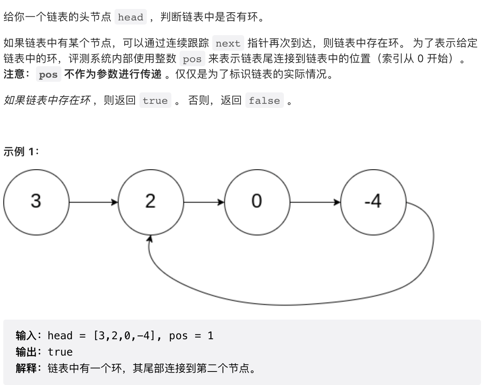

# 141.环形链表

## [力扣链接](https://leetcode.cn/problems/linked-list-cycle/)



## 解题思路
### 循环求解
利用Set结构记住已经遍历过的节点，如果遍历到的节点已经在Set中，则说明有环，否则无环。
```javascript
/**
 * Definition for singly-linked list.
 * function ListNode(val) {
 *     this.val = val;
 *     this.next = null;
 * }
 */

/**
 * @param {ListNode} head
 * @return {boolean}
 */
var hasCycle = function(head) {
    let cache = new Set()
    while(head){
        if(cache.has(head)){
            return true
        }else{
            cache.add(head)
        }
        head = head.next
    }
    return false
};
```
### 快慢指针
定义俩个指针，每次循环中慢指针走一步，快指针走俩步，如果是环形链表，指针总会相遇。
```javascript
/**
 * Definition for singly-linked list.
 * function ListNode(val) {
 *     this.val = val;
 *     this.next = null;
 * }
 */

/**
 * @param {ListNode} head
 * @return {boolean}
 */
var hasCycle = function(head) {
 if( !head || !head.next){
     return false
 }
 let slow = head;
 let fast = head;
 while( fast && fast.next ){
     fast = fast.next.next
     slow = slow.next
     if(fast === slow){
         return true
     }
 }
 return false
};
```
