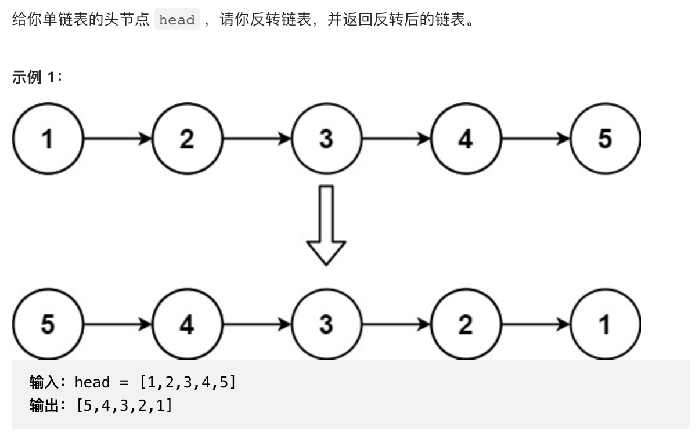

# 206.反转链表
## [力扣链接](https://leetcode.cn/problems/reverse-linked-list/)



## 解题思路
### 双指针
```javascript
/**
 * Definition for singly-linked list.
 * function ListNode(val, next) {
 *     this.val = (val===undefined ? 0 : val)
 *     this.next = (next===undefined ? null : next)
 * }
 */
/**
 * @param {ListNode} head
 * @return {ListNode}
 */
var reverseList = function(head) {
 if(!head || !head.next){
     return head
 }
 let temp; 
 let pre = null;
 let cur = head;
 while(cur){
     temp = cur.next; //记录下一个节点
     cur.next = pre //下一节点的指向往前

     pre = cur     
     cur = temp
 }
 return pre
};
```
### 递归
```javascript
/**
 * Definition for singly-linked list.
 * function ListNode(val, next) {
 *     this.val = (val===undefined ? 0 : val)
 *     this.next = (next===undefined ? null : next)
 * }
 */
/**
 * @param {ListNode} head
 * @return {ListNode}
 */
var reverseList = function(head) {
    if(!head || !head.next){
        return head
    }
    let node = reverseList(head.next)
    head.next.next = head
    head.next = null
    
    return node
};
```
分析：以链表 1->2->3->4->5 为例子
- 第一轮出栈：head = 5，5.next = null，返回 1->2->3->4->5
- 第二轮出栈：head = 4，要返回1->2->3 4<-5
- 第三轮出栈：head = 3，要返回1->2 3<-4<-5
- 第四轮出栈：head = 2，要返回1 2<-3<-4<-5
- 第五轮出栈：head = 1，要返回 1<-2<-3<-4<-5