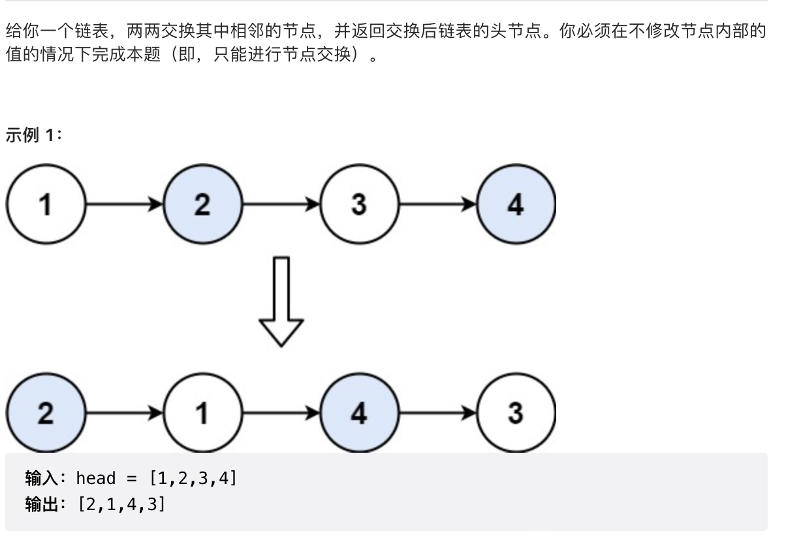
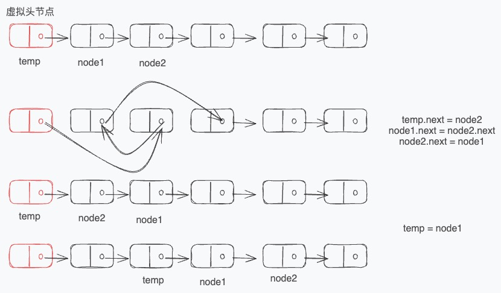

# 24.两两交换链表中的节点

## [力扣链接](https://leetcode.cn/problems/swap-nodes-in-pairs/)



## 解题思路



```js
/**
 * Definition for singly-linked list.
 * function ListNode(val, next) {
 *     this.val = (val===undefined ? 0 : val)
 *     this.next = (next===undefined ? null : next)
 * }
 */
/**
 * @param {ListNode} head
 * @return {ListNode}
 */
var swapPairs = function (head) {
  let dummyhead = new ListNode(0, head);
  let temp = dummyhead;
  while (temp.next && temp.next.next) {
    let pre = temp.next;
    let cur = temp.next.next;

    temp.next = cur;
    pre.next = cur.next;
    cur.next = pre;

    temp = pre;
  }
  return dummyhead.next;
};
```
