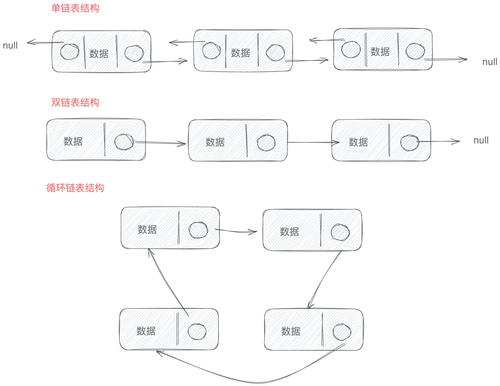

# 链表

## 什么是链表

链表是通过**指针连接**的线性结构。每一个节点由俩部分组成————**数据域与指针域**。

### Javascript 中的链表实现：

```js
class NodeList {
  constructor(val) {
    this.val = val;
    this.next = null;
  }
}
```

### 链表结构



### 链表的基本操作逻辑

- 删除节点：找到前一个节点，将前一个节点的 next 指向被删除节点的下一个节点。
- 添加节点：找到要插入位置的前一节点，将前一节点的 next 指向新节点，新节点的 next 指向原来的下一节点。
