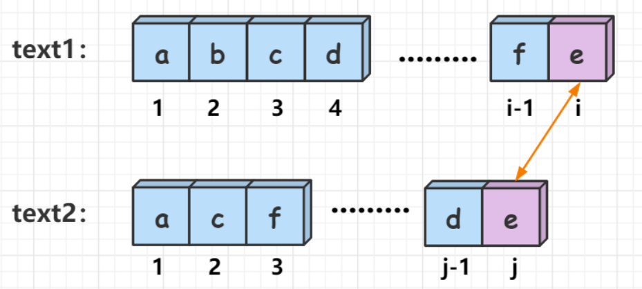
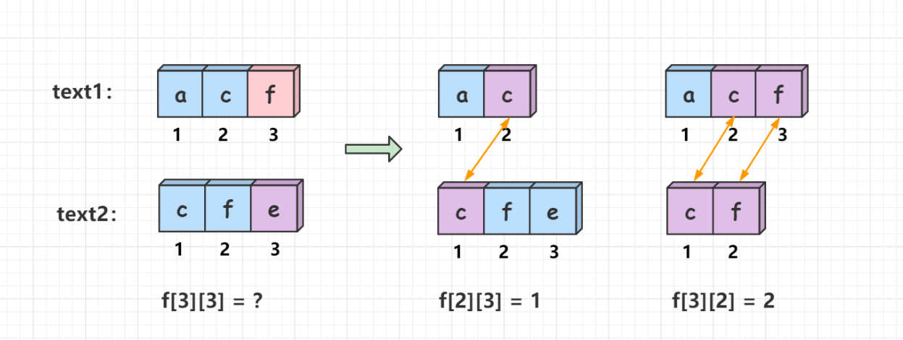

# 动态规划经典题

动态规划的核心是写出问题的状态转移方程（即递推公式），有了状态转移方程，编写代码就是很简单的事了。
**如何写出状态转移方程才是动态规划最关键的问题。**
因此，这里只给出每个问题的状态转移方程，代码只是对数学公式的翻译。

## [3. 无重复字符的最长子串](https://leetcode.cn/problems/longest-substring-without-repeating-characters/)

给定一个字符串 `s` ，请你找出其中不含有重复字符的 **最长 子串** 的长度。

**示例 1:**

```
输入: s = "abcabcbb"
输出: 3 
解释: 因为无重复字符的最长子串是 "abc"，所以其长度为 3。
```

**示例 2:**

```
输入: s = "bbbbb"
输出: 1
解释: 因为无重复字符的最长子串是 "b"，所以其长度为 1。
```

**示例 3:**

```
输入: s = "pwwkew"
输出: 3
解释: 因为无重复字符的最长子串是 "wke"，所以其长度为 3。
     请注意，你的答案必须是 子串 的长度，"pwke" 是一个子序列，不是子串。
```

```java
class Solution {
    public int lengthOfLongestSubstring(String s) {
        //为空直接返回0
        if (s.isEmpty()) {
            return 0;
        }
        //fi是以i位置字符结尾，不含重复字符的最大长度
        int[] fn = new int[s.length()];
        //第一位设置1
        fn[0] = 1;
        int max = 1;
        for (int i = 1; i < s.length(); i++) {
            // 需要查询重复的范围
            //假设字符串为abcabcbb，那么第二个b就从前三位开始遍历即可，因为f[3]=3，再往前加则会包含一个已经有的a，没必要
            int field = fn[i - 1];
            // 获取第i个字符
            char c = s.charAt(i);
            // 是否找到了相同的节点
            boolean findSame = false;
            while (field > 0) {
                //假设i=4，那么从index=1开始遍历到index=4
                int index = i - field;
                field--;
                //如果找到了相同字符
                if (s.charAt(index) == c) {
                    //获取两个相同字符之间的距离
                    //因为是按下标算的，所以需要+1，因为要计算间距，要减去一个位置所以-1
                    int m = i - index - 1 + 1;
                    fn[i] = m;
                    findSame = true;
                    break;
                }
            }
            if (!findSame){
                fn[i] = fn[i - 1] + 1;
            }
            max = Math.max(fn[i], max);
        }
        return max;
    }
}
```

## [1143. 最长公共子序列](https://leetcode.cn/problems/longest-common-subsequence/)

给定两个字符串 `text1` 和 `text2`，返回这两个字符串的最长 **公共子序列** 的长度。如果不存在 **公共子序列** ，返回 `0` 。

一个字符串的 **子序列** 是指这样一个新的字符串：它是由原字符串在不改变字符的相对顺序的情况下删除某些字符（也可以不删除任何字符）后组成的新字符串。

- 例如，`"ace"` 是 `"abcde"` 的子序列，但 `"aec"` 不是 `"abcde"` 的子序列。

两个字符串的 **公共子序列** 是这两个字符串所共同拥有的子序列。

**示例 1：**

```
输入：text1 = "abcde", text2 = "ace" 
输出：3  
解释：最长公共子序列是 "ace" ，它的长度为 3 。
```

**示例 2：**

```
输入：text1 = "abc", text2 = "abc"
输出：3
解释：最长公共子序列是 "abc" ，它的长度为 3 。
```

**示例 3：**

```
输入：text1 = "abc", text2 = "def"
输出：0
解释：两个字符串没有公共子序列，返回 0 。
```

状态计算：

可以根据text1[i]和text2[j]的情况，分为两种决策：

1、若text1[i] == text2[j] ，也就是说两个字符串的最后一位相等，那么问题就转化成了字符串text1的[1,j-1]区间和字符串text2的[1,j-1]区间的最长公共子序列长度再加上一，即`f[i][j] = f[i - 1][j - 1] + 1`。（下标从1开始）



2、若text1[i] != text2[j]，也就是说两个字符串的最后一位不相等，那么字符串text1的[1,i]区间和字符串text2的[1,j]区间的最长公共子序列长度无法延长，因此`f[i][j]`就会继承`f[i-1][j]与f[i][j-1]`中的较大值，即`f[i][j] = max(f[i - 1][j],f[i][j - 1]) `。 （ 下标从1开始）



如上图所示：我们比较text1[3]与text2[3]，发现'f'不等于'e'，这样f[3][3]无法在原先的基础上延长，因此继承"ac"与"cfe" ，"acf"与"cf"的最长公共子序列中的较大值，即 f[3][3] = max(f[2][3] ,f[3][2]) = 2。
实现细节：

我们定义的状态表示f数组和text数组下标均是从1开始的，而题目给出的text数组下标是从0开始的，为了一 一对应，在判断text1和text2数组的最后一位是否相等时，往前错一位，即使用text1[i - 1]和text2[j - 1]来判断。

这里解释一下为什么f数组和text数组均定义成下标从1开始。原因是因为状态转移方程 f[i][j] = max(f[i - 1][j],f[i][j - 1]), 当我们的f数组定义成下标从1开始以后，我们就可以在代码中不用对下标越界问题做出额外判断。其实我们也可以发现一个问题，就是题目给定的原数组，比如text数组，如果下标从1开始的话，状态表示会更加的清晰，推导状态转移方程的过程也会更加好理解。

```java
class Solution {
    public int longestCommonSubsequence(String text1, String text2) {
        int n = text1.length(), m =  text2.length();
        //长度+1的二维数组，将0作为一行列
        int[][] f = new int[n + 1][m + 1];
        for (int i = 1; i <= n; ++i) {
            for (int j = 1; j <= m; ++j) {
                //如果最后一位相等，则在原最长公共长度+1
                if (text1.charAt(i - 1) == text2.charAt(j - 1)) {
                    f[i][j] = f[i - 1][j - 1] + 1;
                } else {
                    //最长公共子序列长度无法延长，获取s2的j-1长度与s1的i长度比较的最大值和
                    //s1的i-1长度与s2的j长度比较的最大值
                    f[i][j] = Math.max(f[i - 1][j], f[i][j - 1]);
                }
            }
        }
        return f[n][m];
    }
}

    a  b c d e
  0 0  0 0 0 0
a 0 1  1 1 1 1
c 0 1  1 2 2 2
e 0 1  1 2 2 3

```

## [53. 最大子数组和](https://leetcode.cn/problems/maximum-subarray/)

给你一个整数数组 `nums` ，请你找出一个具有最大和的连续子数组（子数组最少包含一个元素），返回其最大和。

**示例 1：**

```
输入：nums = [-2,1,-3,4,-1,2,1,-5,4]
输出：6
解释：连续子数组 [4,-1,2,1] 的和最大，为 6 。
```

**示例 2：**

```
输入：nums = [1]
输出：1
```

**示例 3：**

```
输入：nums = [5,4,-1,7,8]
输出：23
```

```
[-2,1,-3,4,-1,2,1,-5,4]
 -2,1,-2,4,3,5,6,1,5 

```

新建一个数组a,a[i]表示以i下标结尾的最大子数组和，动态规划

```java
class Solution {
    public int maxSubArray(int[] nums) {
        int[] array = new int[nums.length];
        array[0] = nums[0];
        int max = nums[0];
        for (int i = 1; i < nums.length; i++) {
            if (nums[i] + array[i - 1] < nums[i]) {
                array[i] = nums[i];
            } else {
                array[i] = nums[i] + array[i - 1];
            }
            max = Math.max(array[i], max);
        }
        return max;
    }
}
```


## [121. 买卖股票的最佳时机](https://leetcode.cn/problems/best-time-to-buy-and-sell-stock/)

给定一个数组 `prices` ，它的第 `i` 个元素 `prices[i]` 表示一支给定股票第 `i` 天的价格。

你只能选择 **某一天** 买入这只股票，并选择在 **未来的某一个不同的日子** 卖出该股票。设计一个算法来计算你所能获取的最大利润。

返回你可以从这笔交易中获取的最大利润。如果你不能获取任何利润，返回 `0` 。

**示例 1：**

```
输入：[7,1,5,3,6,4]
输出：5
解释：在第 2 天（股票价格 = 1）的时候买入，在第 5 天（股票价格 = 6）的时候卖出，最大利润 = 6-1 = 5 。
     注意利润不能是 7-1 = 6, 因为卖出价格需要大于买入价格；同时，你不能在买入前卖出股票。
```

**示例 2：**

```
输入：prices = [7,6,4,3,1]
输出：0
解释：在这种情况下, 没有交易完成, 所以最大利润为 0。
```

## [121. 买卖股票的最佳时机](https://leetcode.cn/problems/best-time-to-buy-and-sell-stock/)

给定一个数组 `prices` ，它的第 `i` 个元素 `prices[i]` 表示一支给定股票第 `i` 天的价格。

你只能选择 **某一天** 买入这只股票，并选择在 **未来的某一个不同的日子** 卖出该股票。设计一个算法来计算你所能获取的最大利润。

返回你可以从这笔交易中获取的最大利润。如果你不能获取任何利润，返回 `0` 。

**示例 1：**

```
输入：[7,1,5,3,6,4]
输出：5
解释：在第 2 天（股票价格 = 1）的时候买入，在第 5 天（股票价格 = 6）的时候卖出，最大利润 = 6-1 = 5 。
     注意利润不能是 7-1 = 6, 因为卖出价格需要大于买入价格；同时，你不能在买入前卖出股票。
```

**示例 2：**

```
输入：prices = [7,6,4,3,1]
输出：0
解释：在这种情况下, 没有交易完成, 所以最大利润为 0。
```

```
  7, 1 , 5 , 3 , 6 ,4
  1  2   2   2   2  2
```

​	将价格最低的日期下标存储起来，如果当前下标的数大于最低价格则计算比较，否则进行替换

```java
class Solution {
    public int maxProfit(int[] prices) {
        int max = 0;
        int minIndex = 0;
        for (int i = 1; i < prices.length; i++) {
            if (prices[i] < prices[minIndex]) {
                minIndex = i;
                continue;
            }
            max = Math.max(prices[i] - prices[minIndex], max);
        }
        return max;
    }
}
```


