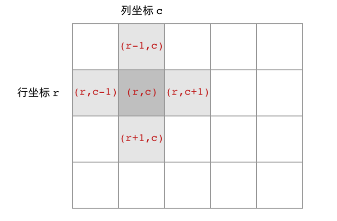
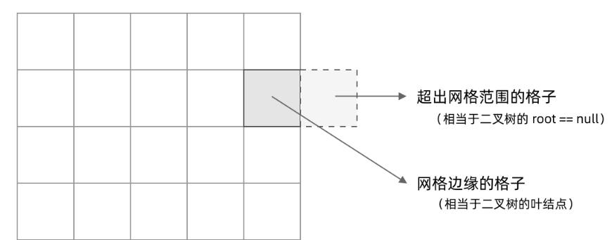
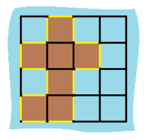
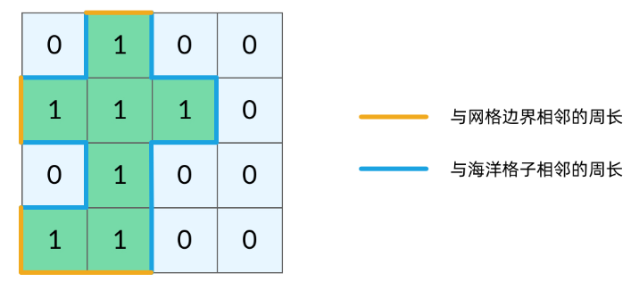
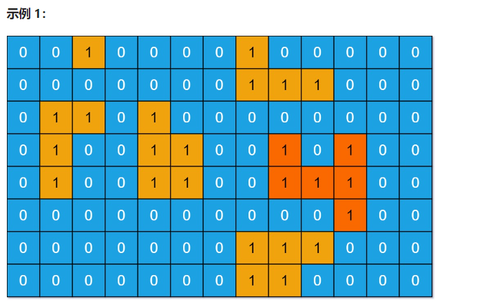

# 岛屿类问题

## 岛屿数量 leetcode 200 （技术面试高频考）

给你一个由 `'1'`（陆地）和 `'0'`（水）组成的的二维网格，请你计算网格中岛屿的数量。岛屿总是被水包围，并且每座岛屿只能由水平方向和/或竖直方向上相邻的陆地连接形成。此外，你可以假设该网格的四条边均被水包围。

**示例 1：**

```
输入：grid = [
  ["1","1","1","1","0"],
  ["1","1","0","1","0"],
  ["1","1","0","0","0"],
  ["0","0","0","0","0"]
]
输出：1
```

**示例 2：**

```
输入：grid = [
  ["1","1","0","0","0"],
  ["1","1","0","0","0"],
  ["0","0","1","0","0"],
  ["0","0","0","1","1"]
]
输出：3
```

我们所熟悉的 DFS（深度优先搜索）问题通常是在树或者图结构上进行的。而我们今天要讨论的 DFS 问题，是在一种「网格」结构中进行的。岛屿问题是这类网格 DFS 问题的典型代表。网格结构遍历起来要比二叉树复杂一些，如果没有掌握一定的方法，DFS 代码容易写得冗长繁杂。

本文将以岛屿问题为例，展示网格类问题 DFS 通用思路，以及如何让代码变得简洁。

网格结构要比二叉树结构稍微复杂一些，它其实是一种简化版的图结构。要写好网格上的 DFS 遍历，我们首先要理解二叉树上的 DFS 遍历方法，再类比写出网格结构上的 DFS 遍历。我们写的二叉树 DFS 遍历一般是这样的：

```java
Java
void traverse(TreeNode root) {
    // 判断 base case
    if (root == null) {
        return;
    }
    // 访问两个相邻结点：左子结点、右子结点
    traverse(root.left);
    traverse(root.right);
}
```

可以看到，二叉树的 DFS 有两个要素：「访问相邻结点」和「判断 base case」。

第一个要素是访问相邻结点。二叉树的相邻结点非常简单，只有左子结点和右子结点两个。二叉树本身就是一个递归定义的结构：一棵二叉树，它的左子树和右子树也是一棵二叉树。那么我们的 DFS 遍历只需要递归调用左子树和右子树即可。

第二个要素是 判断 base case。一般来说，二叉树遍历的 base case 是 root == null。这样一个条件判断其实有两个含义：一方面，这表示 root 指向的子树为空，不需要再往下遍历了。另一方面，在 root == null 的时候及时返回，可以让后面的 root.left 和 root.right 操作不会出现空指针异常。

对于网格上的 DFS，我们完全可以参考二叉树的 DFS，写出网格 DFS 的两个要素：

首先，网格结构中的格子有多少相邻结点？答案是上下左右四个。对于格子 (r, c) 来说（r 和 c 分别代表行坐标和列坐标），四个相邻的格子分别是 (r-1, c)、(r+1, c)、(r, c-1)、(r, c+1)。换句话说，网格结构是「四叉」的。



其次，网格 DFS 中的 base case 是什么？从二叉树的 base case 对应过来，应该是网格中不需要继续遍历、grid[r][c] 会出现数组下标越界异常的格子，也就是那些超出网格范围的格子



这一点稍微有些反直觉，坐标竟然可以临时超出网格的范围？这种方法我称为「先污染后治理」—— 甭管当前是在哪个格子，先往四个方向走一步再说，如果发现走出了网格范围再赶紧返回。这跟二叉树的遍历方法是一样的，先递归调用，发现 root == null 再返回。

这样，我们得到了网格 DFS 遍历的框架代码：

```java
void dfs(int[][] grid, int r, int c) {
    // 判断 base case
    // 如果坐标 (r, c) 超出了网格范围，直接返回
    if (!inArea(grid, r, c)) {
        return;
    }
    // 访问上、下、左、右四个相邻结点
    dfs(grid, r - 1, c);
    dfs(grid, r + 1, c);
    dfs(grid, r, c - 1);
    dfs(grid, r, c + 1);
}

// 判断坐标 (r, c) 是否在网格中
boolean inArea(int[][] grid, int r, int c) {
    return 0 <= r && r < grid.length 
        	&& 0 <= c && c < grid[0].length;
}
```

如何避免重复遍历
网格结构的 DFS 与二叉树的 DFS 最大的不同之处在于，遍历中可能遇到遍历过的结点。这是因为，网格结构本质上是一个「图」，我们可以把每个格子看成图中的结点，每个结点有向上下左右的四条边。在图中遍历时，自然可能遇到重复遍历结点。

这时候，DFS 可能会不停地「兜圈子」，永远停不下来，如下图所示：

如何避免这样的重复遍历呢？答案是标记已经遍历过的格子。以岛屿问题为例，我们需要在所有值为 1 的陆地格子上做 DFS 遍历。每走过一个陆地格子，就把格子的值改为 2，这样当我们遇到 2 的时候，就知道这是遍历过的格子了。也就是说，每个格子可能取三个值：

0 —— 海洋格子
1 —— 陆地格子（未遍历过）
2 —— 陆地格子（已遍历过）
我们在框架代码中加入避免重复遍历的语句：

```java
void dfs(int[][] grid, int r, int c) {
    // 判断 base case
    if (!inArea(grid, r, c)) {
        return;
    }
    // 如果这个格子不是岛屿，直接返回
    if (grid[r][c] != 1) {
        return;
    }
    grid[r][c] = 2; // 将格子标记为「已遍历过」
    
    // 访问上、下、左、右四个相邻结点
    dfs(grid, r - 1, c);
    dfs(grid, r + 1, c);
    dfs(grid, r, c - 1);
    dfs(grid, r, c + 1);
}

// 判断坐标 (r, c) 是否在网格中
boolean inArea(int[][] grid, int r, int c) {
    return 0 <= r && r < grid.length 
        	&& 0 <= c && c < grid[0].length;
}

```

解法代码：

```java
public static int numIslands(char[][] grid) {
    int num = 0;
    //循环遍历数组
    for (int i = 0; i < grid.length; i++) {
        for (int j = 0; j < grid[i].length; j++) {
            if (grid[i][j] == '1') {
                num++;
                dfs(grid, i, j);
            }
        }
    }
    return num;
}

public static void dfs(char[][] grid, int i, int j) {
    if (i < 0 || i >= grid.length || j < 0 || j >= grid[i].length || grid[i][j] != '1') {
        return;
    }
    grid[i][j] = '2';
    dfs(grid, i - 1, j);
    dfs(grid, i + 1, j);
    dfs(grid, i, j - 1);
    dfs(grid, i, j + 1);
}
```


## [463. 岛屿的周长](https://leetcode.cn/problems/island-perimeter/)

给定一个 `row x col` 的二维网格地图 `grid` ，其中：`grid[i][j] = 1` 表示陆地， `grid[i][j] = 0` 表示水域。

网格中的格子 **水平和垂直** 方向相连（对角线方向不相连）。整个网格被水完全包围，但其中恰好有一个岛屿（或者说，一个或多个表示陆地的格子相连组成的岛屿）。

岛屿中没有“湖”（“湖” 指水域在岛屿内部且不和岛屿周围的水相连）。格子是边长为 1 的正方形。网格为长方形，且宽度和高度均不超过 100 。计算这个岛屿的周长。


**示例 1：**



```
输入：grid = [[0,1,0,0],[1,1,1,0],[0,1,0,0],[1,1,0,0]]
输出：16
解释：它的周长是上面图片中的 16 个黄色的边
```

**示例 2：**

```
输入：grid = [[1]]
输出：4
```

**示例 3：**

```
输入：grid = [[1,0]]
输出：4
```

那么这些和我们岛屿的周长有什么关系呢？实际上，岛屿的周长是计算岛屿全部的「边缘」，而这些边缘就是我们在 DFS 遍历中，dfs 函数返回的位置。观察题目示例，我们可以将岛屿的周长中的边分为两类，如下图所示。黄色的边是与网格边界相邻的周长，而蓝色的边是与海洋格子相邻的周长。



当我们的 dfs 函数因为「坐标 (r, c) 超出网格范围」返回的时候，实际上就经过了一条黄色的边；而当函数因为「当前格子是海洋格子」返回的时候，实际上就经过了一条蓝色的边。这样，我们就把岛屿的周长跟 DFS 遍历联系起来了，我们的题解代码也呼之欲出：

```java
public int islandPerimeter(int[][] grid) {
    for (int r = 0; r < grid.length; r++) {
        for (int c = 0; c < grid[0].length; c++) {
            if (grid[r][c] == 1) {
                // 题目限制只有一个岛屿，计算一个即可
                return dfs(grid, r, c);
            }
        }
    }
    return 0;
}

int dfs(int[][] grid, int r, int c) {
    // 函数因为「坐标 (r, c) 超出网格范围」返回，对应一条黄色的边
    if (!inArea(grid, r, c)) {
        return 1;
    }
    // 函数因为「当前格子是海洋格子」返回，对应一条蓝色的边
    if (grid[r][c] == 0) {
        return 1;
    }
    // 函数因为「当前格子是已遍历的陆地格子」返回，和周长没关系
    if (grid[r][c] != 1) {
        return 0;
    }
    grid[r][c] = 2;
    return dfs(grid, r - 1, c)
        + dfs(grid, r + 1, c)
        + dfs(grid, r, c - 1)
        + dfs(grid, r, c + 1);
}

// 判断坐标 (r, c) 是否在网格中
boolean inArea(int[][] grid, int r, int c) {
    return 0 <= r && r < grid.length 
        	&& 0 <= c && c < grid[0].length;
}
```


## [695. 岛屿的最大面积](https://leetcode-cn.com/problems/max-area-of-island/)

**岛屿** 是由一些相邻的 `1` (代表土地) 构成的组合，这里的「相邻」要求两个 `1` 必须在 **水平或者竖直的四个方向上** 相邻。你可以假设 `grid` 的四个边缘都被 `0`（代表水）包围着。

岛屿的面积是岛上值为 `1` 的单元格的数目。

计算并返回 `grid` 中最大的岛屿面积。如果没有岛屿，则返回面积为 `0` 。

 

```
输入：grid = [[0,0,1,0,0,0,0,1,0,0,0,0,0],[0,0,0,0,0,0,0,1,1,1,0,0,0],[0,1,1,0,1,0,0,0,0,0,0,0,0],[0,1,0,0,1,1,0,0,1,0,1,0,0],[0,1,0,0,1,1,0,0,1,1,1,0,0],[0,0,0,0,0,0,0,0,0,0,1,0,0],[0,0,0,0,0,0,0,1,1,1,0,0,0],[0,0,0,0,0,0,0,1,1,0,0,0,0]]
输出：6
解释：答案不应该是 11 ，因为岛屿只能包含水平或垂直这四个方向上的 1 。
```

**示例 2：**

```
输入：grid = [[0,0,0,0,0,0,0,0]]
输出：0
```

```java
class Solution {
    public int maxAreaOfIsland(int[][] grid) {
        int maxArea = 0;
        for (int r = 0; r < grid.length; r++) {
            for (int c = 0; c < grid[0].length; c++) {
                if (grid[r][c] == 1) {
                    // 题目限制只有一个岛屿，计算一个即可
                    int are = dfs(grid, r, c);
                    maxArea = Math.max(maxArea, are);
                }
            }
        }
        return maxArea;
    }

    int dfs(int[][] grid, int r, int c) {
        // 如果这个点不合法，或者这个点是海水，直接返回0
        if (!inArea(grid, r, c) || grid[r][c] != 1) {
            return 0;
        }
        //递归计算上下左右四个方向的岛屿面积
        grid[r][c] = 2;
        int num = 1;
        num += dfs(grid, r + 1, c);
        num += dfs(grid, r - 1, c);
        num += dfs(grid, r, c + 1);
        num += dfs(grid, r, c - 1);
        return num;
    }

    // 判断坐标 (r, c) 是否在网格中
    boolean inArea(int[][] grid, int r, int c) {
        return 0 <= r && r < grid.length
                && 0 <= c && c < grid[0].length;
    }
}
```


