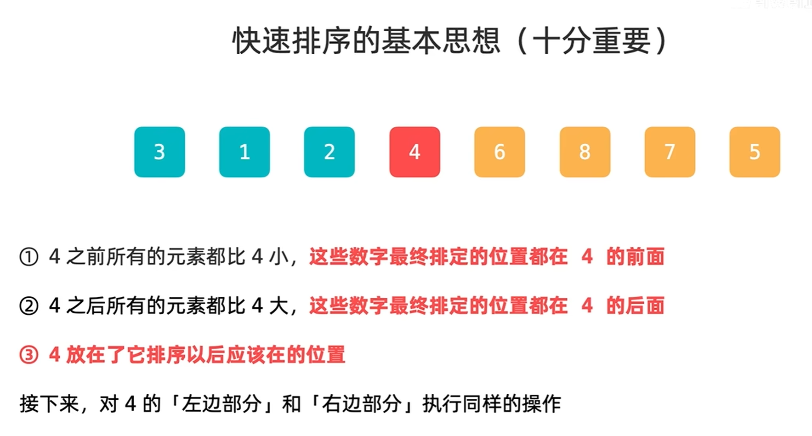
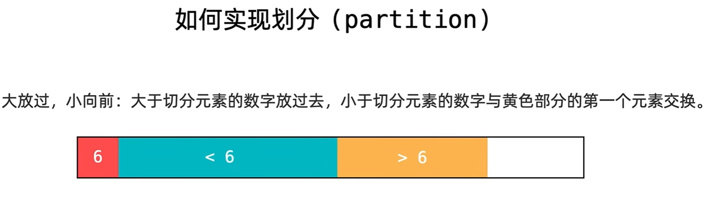

# 快速排序详解

来自B站 [liweiwei1419](https://space.bilibili.com/236935093)

## 基本思想：



分治思想：减而治之


## partition

划分




## 第一版代码

```java
class Solution {
    public int[] sortArray(int[] nums) {
        quickSort(nums, 0, nums.length - 1);
        return nums;
    }

    public void quickSort(int[] nums, int left, int right) {
        if (left >= right) return;
        int pivotIndex = partition(nums, left, right);
        quickSort(nums, left, pivotIndex - 1);
        quickSort(nums, pivotIndex + 1, right);
    }
	
    //开始保证nums[left+1..j)和[j..i]为空集
    public int partition(int[] nums, int left, int right) {
        int pivot = nums[left];
        int j = left + 1;
        for (int i = left + 1; i <= right; i++) {
            if (nums[i] < pivot) {
                swap(nums, i, j);
                j++;
            }
        }
        swap(nums, left, j - 1);
        return j-1;
    }

    public void swap(int[] nums, int i, int j) {
        int temp = nums[i];
        nums[i] = nums[j];
        nums[j] = temp;
    }
}
```

为什么这一版比较慢？因为选择了未排定区间的第一个元素为第一个元素，最差情况为N平方时间复杂度

在顺序数组/逆序数组时效率很差

使用随机选择元素的方式打乱数组

## 第二版代码

```java
class Solution {

    public final static Random random = new Random(System.currentTimeMillis());

    public int[] sortArray(int[] nums) {
        quickSort(nums, 0, nums.length - 1);
        return nums;
    }

    public void quickSort(int[] nums, int left, int right) {
        if (left >= right) return;
        int pivotIndex = partition(nums, left, right);
        quickSort(nums, left, pivotIndex - 1);
        quickSort(nums, pivotIndex + 1, right);
    }

    public int partition(int[] nums, int left, int right) {
        //随机选择范围中的一个下标，左右都是闭区间
        int randomIndex = left + random.nextInt(right - left + 1);
        swap(nums, randomIndex, left);
        //此时pivot就是区间中的一个随机数
        int pivot = nums[left];
        int j = left + 1;
        for (int i = left + 1; i <= right; i++) {
            if (nums[i] < pivot) {
                swap(nums, i, j);
                j++;
            }
        }
        swap(nums, left, j - 1);
        return j-1;
    }

    public void swap(int[] nums, int i, int j) {
        int temp = nums[i];
        nums[i] = nums[j];
        nums[j] = temp;
    }
}
```

还存在问题：有很多相同值元素存在时，随机选择pivot无效


## 双路快排

```java
class Solution {

    public final static Random random = new Random(System.currentTimeMillis());

    public int[] sortArray(int[] nums) {
        quickSort(nums, 0, nums.length - 1);
        return nums;
    }

    public void quickSort(int[] nums, int left, int right) {
        if (left >= right)
            return;
        int pivotIndex = partition(nums, left, right);
        quickSort(nums, left, pivotIndex - 1);
        quickSort(nums, pivotIndex + 1, right);
    }

    public int partition(int[] nums, int left, int right) {
        int randomIndex = left + random.nextInt(right - left + 1);
        swap(nums, randomIndex, left);
        int pivot = nums[left];
        // (left+1..le)<=pivot
        int le = left + 1;
        // (ge..right]>=pivot
        int ge = right;
        while (true) {
            while ( le <= ge && nums[le] < pivot ) {
                le++;
            }
            while ( le <= ge && nums[ge] > pivot ) {
                ge--;
            }
            if (le >= ge) {
                break;
            }
            swap(nums, le, ge);
            le++;
            ge--;
        }
        swap(nums, left, ge);
        //交换一次完成后，j前面所有元素都小于等于pivot,j后面元素都是大于等于pivot
        return ge;
    }
  

    public void swap(int[] nums, int i, int j) {
        int temp = nums[i];
        nums[i] = nums[j];
        nums[j] = temp;
    }
}
```

平均地将相等的元素分到两个区间内，是不稳定的排序


## 三路快排

将相同地元素都放在同一个区间内

```java
import java.util.Random;

class Solution {

    public final static Random random = new Random(System.currentTimeMillis());

    public int[] sortArray(int[] nums) {
        quickSort(nums, 0, nums.length - 1);
        return nums;
    }

    public void quickSort(int[] nums, int left, int right) {
        if (left >= right) return;
        int randomIndex = left + random.nextInt(right - left + 1);
        swap(nums, randomIndex, left);
        int pivot = nums[left];

        int lt = left;  // nums[left+1...lt] < pivot
        int gt = right + 1; // nums[gt...right] > pivot
        int i = left + 1; // nums[lt+1...i-1] == pivot
        while (i < gt) {
            if (nums[i] < pivot) {
                lt++;
                swap(nums, i, lt);
                i++;
            } else if (nums[i] == pivot) {
                i++;
            } else {
                gt--;
                swap(nums, i, gt);
            }
        }
        swap(nums, left, lt);

        quickSort(nums, left, lt - 1); // 对左半部分进行快速排序
        quickSort(nums, gt, right);    // 对右半部分进行快速排序
    }

    public void swap(int[] nums, int i, int j) {
        int temp = nums[i];
        nums[i] = nums[j];
        nums[j] = temp;
    }
}
```


