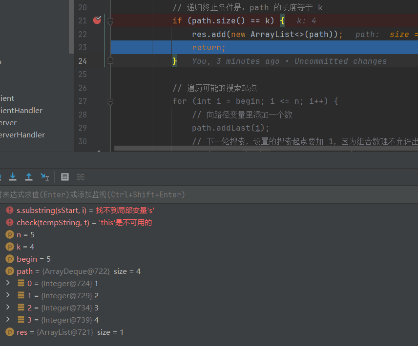

#  华为算法题笔记

## **5.**排列组合（2题）

### (1) *leetcode 面试题08.08.有重复字符串的排列组合

有重复字符串的排列组合。编写一种方法，计算某字符串的所有排列组合。

**示例1:**

```
 输入：S = "qqe"
 输出：["eqq","qeq","qqe"]
```

**示例2:**

```
 输入：S = "ab"
 输出：["ab", "ba"]
```

个人解法：

```java
class Solution {
  public String[] permutation(String S) {
    String str = S;
    List<String> charList = str.chars().mapToObj(c -> String.valueOf((char) c)).toList();
    Set<String> set = new HashSet<>();
    for (String node : charList) {
      if (set.isEmpty()) {
        //set为空直接塞入
        set.add(node);
      } else {
        Set<String> tempSet = new HashSet<>();
        for (String setNode : set) {
          for (int i = 0; i < setNode.length() + 1; i++) {
            String targrt = insertString(setNode, i, node);
            tempSet.add(targrt);
          }
        }
        set.addAll(tempSet);
      }
    }
    Iterator<String> iterator = set.iterator();
    while (iterator.hasNext()) {
      String e = iterator.next();
      if (e.length() != str.length()) {
        iterator.remove();
      }
    }
    String[] array = set.toArray(new String[0]);
    return array;
  }

  public static String insertString(String str, int index, String node) {
    if (index == 0) {
      return node + str;
    }
    if (index == str.length()) {
      return str + node;
    }
    return str.substring(0, index) + node + str.substring(index);
  }
}

```


### (2) leetcode 77.组合

给定两个整数 `n` 和 `k`，返回范围 `[1, n]` 中所有可能的 `k` 个数的组合。

你可以按 **任何顺序** 返回答案

```java
import java.util.ArrayDeque;
import java.util.ArrayList;
import java.util.Deque;
import java.util.List;

public class Solution {

    public List<List<Integer>> combine(int n, int k) {
        List<List<Integer>> res = new ArrayList<>();
        if (k <= 0 || n < k) {
            return res;
        }
        // 从 1 开始是题目的设定
        Deque<Integer> path = new ArrayDeque<>();
        dfs(n, k, 1, path, res);
        return res;
    }

    private void dfs(int n, int k, int begin, Deque<Integer> path, List<List<Integer>> res) {
        // 递归终止条件是：path 的长度等于 k
        //然后将一组path添加到需要返回的res中
        if (path.size() == k) {
            res.add(new ArrayList<>(path));
            return;
        }

        // 遍历可能的搜索起点
        for (int i = begin; i <= n; i++) {
            // 向路径变量里添加一个数
            path.addLast(i);
            // 下一轮搜索，设置的搜索起点要加 1，因为组合数理不允许出现重复的元素
            dfs(n, k, i + 1, path, res);
            // 重点理解这里：深度优先遍历有回头的过程，因此递归之前做了什么，递归之后需要做相同操作的逆向操作
            //比如1234选择3个数，我前三次已经遍历到了123，那么此时path.size() == k成立，我需要将3删除再去找最后一个4，将124放入
            //12的组合处理完了就去找13组合的，此时需要将2从path移除
            //递归的层数是k-1
            path.removeLast();
        }
    }
}

```




## 6.双指针（3题）

> 双指针算法有多种变体，包括快慢指针、左右指针、对撞指针等
>
> 在双指针算法中，通常会有两个指针分别指向数据结构中的不同位置，然后根据问题的要求，调整这两个指针的位置，直到达到解决问题的条件。双指针算法的时间复杂度通常较低，因此在解决一些需要高效算法的问题时很有用。
>
> 双指针算法常见的应用场景包括但不限于：
>
> 1. 求解数组或链表中的两数之和、三数之和等问题。
> 2. 寻找数组或链表中的滑动窗口、连续子数组等。
> 3. 反转数组或链表。
> 4. 判断链表是否有环。
> 5. 合并两个有序数组或链表等

### (1) *leetcode 674.最长连续递增序列

给定一个未经排序的整数数组，找到最长且 **连续递增的子序列**，并返回该序列的长度。

**连续递增的子序列** 可以由两个下标 `l` 和 `r`（`l < r`）确定，如果对于每个 `l <= i < r`，都有 `nums[i] < nums[i + 1]` ，那么子序列 `[nums[l], nums[l + 1], ..., nums[r - 1], nums[r]]` 就是连续递增子序列。

**示例 1：**

```
输入：nums = [1,3,5,4,7]
输出：3
解释：最长连续递增序列是 [1,3,5], 长度为3。
尽管 [1,3,5,7] 也是升序的子序列, 但它不是连续的，因为 5 和 7 在原数组里被 4 隔开。 
```

**示例 2：**

```
输入：nums = [2,2,2,2,2]
输出：1
解释：最长连续递增序列是 [2], 长度为1。
```

```java
class Solution {
    public int findLengthOfLCIS(int[] nums) {
        int p1 = 0;
        int p2 = 1;
        int result = 1;
        int max = 1;
        for (int i = 0; i < nums.length; i++) {
            if (p2 == nums.length) {
                break;
            }
            if (nums[p2] > nums[p1]) {
                max++;
                p2++;
                p1++;
                result = Math.max(result, max);
            } else {
                max = 1;
                p2++;
                p1++;
            }
        }
        return result;
    }
}
```


### (2) NC17.最长回文子串

给你一个字符串 `s`，找到 `s` 中最长的回文子串。

如果字符串的反序与原始字符串相同，则该字符串称为回文字符串。

**示例 1：**

```
输入：s = "babad"
输出："bab"
解释："aba" 同样是符合题意的答案。
```

**示例 2：**

```
输入：s = "cbbd"
输出："bb"
```

个人解法暴力法      `通过但超时了。。。`

```java
class Solution {
    public String longestPalindrome(String s) {
        String str = s;
        if (str.length() == 1) {
            return str;
        }
        String result = "";
        int p1;
        int p2;
        for (int i = 0; i < str.length(); i++) {
            p1 = i;
            p2 = p1 + 2;
            while (p2 <= str.length()) {
                if (check(str.substring(p1, p2)) && p2 - p1 > result.length()) {
                    String now = str.substring(p1, p2);
                    if (now.length() > result.length()) {
                        result = now;
                    }
                }
                p2++;
            }
        }
        if (result.isEmpty()) {
            result = str.substring(0, 1);
        }
        return result;
    }

    public static boolean check(String str) {
        int len = str.length();
        for (int i = 0; i < len / 2; i++) {
            if (str.charAt(i) != str.charAt(len - i - 1)) {
                return false;
            }
        }
        return true;
    }
}
```

**正确解法：动态规划**

>  空间换时间，将计算结果暂存起来，避免重复计算。作用和工程中用 `redis` 做缓存有异曲同工之妙
>
> 我们用一个 boolean dp[l][r] 表示字符串从 i 到 j 这段是否为回文。试想如果 dp[l][r]=true，我们要判断 dp[l-1][r+1] 是否为回文。只需要判断字符串在(l-1)和（r+1)两个位置是否为相同的字符，减少了很多重复计算。

```java
public String longestPalindrome(String s) {
        if (s == null || s.length() < 2) {
            return s;
        }
        int strLen = s.length();
        int maxStart = 0;  //最长回文串的起点
        int maxEnd = 0;    //最长回文串的终点
        int maxLen = 1;  //最长回文串的长度

        boolean[][] dp = new boolean[strLen][strLen];

        for (int r = 1; r < strLen; r++) {
            for (int l = 0; l < r; l++) {
                //r - l <= 2的意思是只要是三位长度，两边一样就是回文数
                //dp[l + 1][r - 1]  代表两边一样且中间内容也是回文数
                if (s.charAt(l) == s.charAt(r) && (r - l <= 2 || dp[l + 1][r - 1])) {
                    dp[l][r] = true;
                    if (r - l + 1 > maxLen) {
                        maxLen = r - l + 1;
                        maxStart = l;
                        maxEnd = r;

                    }
                }

            }

        }
        return s.substring(maxStart, maxEnd + 1);
    }
```

**图示：**

|      | 0 a   | 1 b   | 2 c  | 3 b  | 4 a  |
| ---- | ----- | ----- | ---- | ---- | :--- |
| 0 a  |       |       |      |      |      |
| 1 b  | F     |       |      |      |      |
| 2 c  | F     | F     |      |      |      |
| 3 b  | F     | **T** | F    |      |      |
| 4 a  | **T** | F     | F    | F    |      |

### (3) NC28.最小覆盖子串

给你一个字符串 `s` 、一个字符串 `t` 。返回 `s` 中涵盖 `t` 所有字符的最小子串。如果 `s` 中不存在涵盖 `t` 所有字符的子串，则返回空字符串 `""` 。

**注意：**

- 对于 `t` 中重复字符，我们寻找的子字符串中该字符数量必须不少于 `t` 中该字符数量。
- 如果 `s` 中存在这样的子串，我们保证它是唯一的答案。

**示例 1：**

```
输入：s = "ADOBECODEBANC", t = "ABC"
输出："BANC"
解释：最小覆盖子串 "BANC" 包含来自字符串 t 的 'A'、'B' 和 'C'。
```

**示例 2：**

```
输入：s = "a", t = "a"
输出："a"
解释：整个字符串 s 是最小覆盖子串。
```

**示例 3:**

```
输入: s = "a", t = "aa"
输出: ""
解释: t 中两个字符 'a' 均应包含在 s 的子串中，
因此没有符合条件的子字符串，返回空字符串。
```

个人解法，暴力法，超时了。。

```java
class Solution {
    public String minWindow(String s, String t) {
        int sStart = 0;
        String result = "";
        int minLegth = 0;
        for (int i = 0; i <= s.length(); i++) {
            if (s.substring(sStart, i).length() < t.length()) {
                continue;
            }
            int hit = check(s.substring(sStart, i), t);
            if (hit != t.length()) {
                if (minLegth == 0) {
                    continue;
                } else {
                    sStart++;
                }
                // 记录第一次命中的字符串
            } else if (minLegth == 0) {
                for (int j = sStart; j < i; j++) {
                    String tempString = s.substring(j, i);
                    if (check(tempString, t) == t.length()) {
                        result = tempString;
                        minLegth = result.length();
                    } else {
                        sStart++;
                        break;
                    }
                }
                // 之后再命中
            } else {
                for (int j = sStart; j < i; j++) {
                    String tempString = s.substring(j, i);
                    if (check(tempString, t) == t.length()) {
                        if (tempString.length() < result.length()) {
                            result = tempString;
                            minLegth = result.length();
                        }
                    } else {
                        sStart++;
                        break;
                    }
                }
            }
        }
        return result;
    }

    public static int check(String s1, String s2) {
        int target = 0;
        List<String> charList = s2.chars().mapToObj(c -> String.valueOf((char) c)).toList();
        for (String node : charList) {
            if (s1.contains(node)) {
                s1 = s1.replaceFirst(node, "");
                target++;
            }
        }
        return target;
    }
}
```

​	正确解法：滑动窗口

```java
class Solution {
    public String minWindow(String S, String t) {
        char[] s = S.toCharArray();
        int m = s.length;
        int ansLeft = -1;
        int ansRight = m;
        int left = 0;
        int[] cntS = new int[128]; // s 子串字母的出现次数
        int[] cntT = new int[128]; // t 中字母的出现次数
        for (char c : t.toCharArray()) {
            cntT[c]++;
        }
        for (int right = 0; right < m; right++) { // 移动子串右端点
            cntS[s[right]]++; // 右端点字母移入子串
            while (isCovered(cntS, cntT)) { // 涵盖
                if (right - left < ansRight - ansLeft) { // 找到更短的子串
                    ansLeft = left; // 记录此时的左右端点
                    ansRight = right;
                }
                cntS[s[left++]]--; // 左端点字母移出子串
            }
        }
        return ansLeft < 0 ? "" : S.substring(ansLeft, ansRight + 1);
    }

    private boolean isCovered(int[] cntS, int[] cntT) {
        for (int i = 'A'; i <= 'Z'; i++) {
            if (cntS[i] < cntT[i]) {
                return false;
            }
        }
        for (int i = 'a'; i <= 'z'; i++) {
            if (cntS[i] < cntT[i]) {
                return false;
            }
        }
        return true;
    }
}
```

> 在滑动窗口类型的问题中都会有两个指针，一个用于「延伸」现有窗口的 rrr 指针，和一个用于「收缩」窗口的 lll 指针。在任意时刻，只有一个指针运动，而另一个保持静止。我们在 sss 上滑动窗口，通过移动 rrr 指针不断扩张窗口。当窗口包含 ttt 全部所需的字符后，如果能收缩，我们就收缩窗口直到得到最小窗口。

## **7.**深搜（1题）

### (1) HJ41.称砝码

描述

现有n种砝码，重量互不相等，分别为 m1,m2,m3…mn ；
每种砝码对应的数量为 x1,x2,x3...xn 。现在要用这些砝码去称物体的重量(放在同一侧)，问能称出多少种不同的重量。

输入描述：

对于每组测试数据：
第一行：n --- 砝码的种数(范围[1,10])
第二行：m1 m2 m3 ... mn --- 每种砝码的重量(范围[1,2000])
第三行：x1 x2 x3 .... xn --- 每种砝码对应的数量(范围[1,10])

输出描述：

利用给定的砝码可以称出的不同的重量数

示例1

输入：

```
2
1 2
2 1
```

输出：

```
5
```

说明：

```
可以表示出0，1，2，3，4五种重量。   
```

```java
import java.util.Scanner;

import java.util.*;

// 注意类名必须为 Main, 不要有任何 package xxx 信息
public class Main {
    public static void main(String[] args) {
        Scanner in = new Scanner(System.in);
        int n = in.nextInt();
        in.nextLine();
        int[] weightArr = new int[n];
        int[] countArr = new int[n];
        for (int i = 0; i < n; i++) {
            weightArr[i] = in.nextInt();
        }
        for (int i = 0; i < n; i++) {
            countArr[i] = in.nextInt();
        }
        Set<Integer> result = new HashSet<>();
        result.add(1);
        for (int i = 0; i < weightArr.length; i++) {
            int weight = weightArr[i];
            int num = countArr[i];
            result = getSumRange(result, getRange(weight, num));
        }
        System.out.println(result.size());
    }

    //传入砝码克重和数量算出它的范围数组
    public static int[] getRange(int weight, int num) {
        int[] result = new int[num + 1];
        for (int i = 0; i <= num; i++) {
            result[i] = i * weight;
        }
        return result;
    }

    //传入两个数组，返回他们和的范围
    public static Set<Integer> getSumRange(Set<Integer> s1, int[] i2) {
        Set<Integer> result = new HashSet<>();
        for (int j : s1) {
            for (int k : i2) {
                result.add(j + k);
            }
        }
        return result;
    }
}
```
