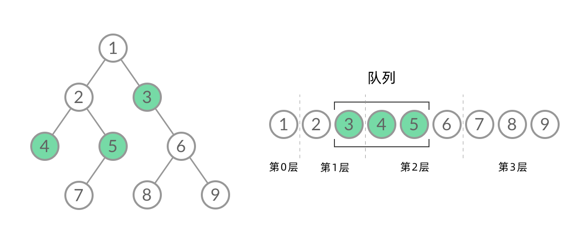

# 华为算法题笔记

## **8.**二叉树（2题）

### (1) *leetcode 剑指offer 32 — II.从上到下打印二叉树 II `BFS广度优先算法`

- 从上到下按层打印二叉树，同一层的节点按从左到右的顺序打印，每一层打印到一行。
- 示例 1：
  给定二叉树: [3,9,20,null,null,15,7],
  3
  /    /
  9    20
  /       /
  15       7
- 返回其层次遍历结果：
  [
  [3],
  [9,20],
  [15,7]
  ]

- **算法流程**：
  **特例处理： 当根节点为空，则返回空列表 [] ；**
  **初始化： 打印结果列表 res = [] ，包含根节点的队列 queue = [root] ；**
  **BFS 循环： 当队列 queue 为空时跳出；**
  **新建一个临时列表 tmp ，用于存储当前层打印结果；**
  **当前层打印循环： 循环次数为当前层节点数（即队列 queue 长度）；**
  **出队： 队首元素出队，记为 node；**
  **打印： 将 node.val 添加至 tmp 尾部；**
  **添加子节点： 若 node 的左（右）子节点不为空，则将左（右）子节点加入队列 queue ；**
  **将当前层结果 tmp 添加入 res 。**
  **返回值： 返回打印结果列表 res 即可**。




**每层打印到一行： 将本层全部节点打印到一行，并将下一层全部节点加入队列，以此类推，即可分为多行打印。**

```java
class Solution {
    public List<List<Integer>> levelOrder(TreeNode root) {
        Queue<TreeNode> queue = new LinkedList<>();
        List<List<Integer>> res = new ArrayList<>();
        if(root != null) queue.add(root);
        while(!queue.isEmpty()) {
            List<Integer> tmp = new ArrayList<>();
            for(int i = queue.size(); i > 0; i--) {
                TreeNode node = queue.poll();
                tmp.add(node.val);
                if(node.left != null) queue.add(node.left);
                if(node.right != null) queue.add(node.right);
            }
            res.add(tmp);
        }
        return res;
    }
}
```

### (2) leetcode 剑指offer 32 — III.从上到下打印二叉树 III

`在上一题基础上增加了奇偶判断`

请实现一个函数按照之字形顺序打印二叉树，即第一行按照从左到右的顺序打印，第二层按照从右到左的顺序打印，第三行再按照从左到右的顺序打印，其他行以此类推。

例如:
给定二叉树: [3,9,20,null,null,15,7]

3

/ /
9  20
/  /
15   7

返回其层次遍历结果：

[
[3],
[20,9],
[15,7]
]

算法流程：
特例处理： 当树的根节点为空，则直接返回空列表 [] ；
初始化： 打印结果空列表 res ，包含根节点的双端队列 deque ；
BFS 循环： 当 deque 为空时跳出；
新建列表 tmp ，用于临时存储当前层打印结果；
当前层打印循环： 循环次数为当前层节点数（即 deque 长度）；
出队： 队首元素出队，记为 node；
打印： 若为奇数层，将 node.val 添加至 tmp 尾部；否则，添加至 tmp 头部；
添加子节点： 若 node 的左（右）子节点不为空，则加入 deque ；
将当前层结果 tmp 转化为 list 并添加入 res ；
返回值： 返回打印结果列表 res 即

```java
class Solution {
    public List<List<Integer>> levelOrder(TreeNode root) {
        Queue<TreeNode> queue = new LinkedList<>();
        List<List<Integer>> res = new ArrayList<>();
        if(root != null) queue.add(root);
        while(!queue.isEmpty()) {
            LinkedList<Integer> tmp = new LinkedList<>();
            for(int i = queue.size(); i > 0; i--) {
                TreeNode node = queue.poll();
                if(res.size() % 2 == 0) tmp.addLast(node.val); // 偶数层 -> 队列头部
                else tmp.addFirst(node.val); // 奇数层 -> 队列尾部
                if(node.left != null) queue.add(node.left);
                if(node.right != null) queue.add(node.right);
            }
            res.add(tmp);
        }
        return res;
    }
}
```

## 其他（6题）

###  *HJ108.求最小公倍数

输入两个正整数A和B。

输出A和B的最小公倍数。

示例1

输入：

```
5 7
```

输出：

```
35
```

示例2

输入：

```
2 4
```

输出：

```
4
```

```java
import java.util.Scanner;

public class Main {
    public static void main(String[] args) {
        Scanner in = new Scanner(System.in);
        int[] arr = new int[2];
        for (int i = 0; i < 2; i++) {
            arr[i] = in.nextInt();
        }
        int loopNum = arr[1];
        int result = arr[0] * arr[1];
        for (int i = 1; i <= loopNum; i++) {
            if (i * arr[0] % arr[1] == 0) {
                result = i * arr[0];
                break;
            }
        }
        System.out.println(result);
    }
}
```


###  *HJ60.查找组成一个偶数最接近的两个素数

任意一个偶数（大于2）都可以由2个素数组成，组成偶数的2个素数有很多种情况，本题目要求输出组成指定偶数的两个素数差值最小的素数对。

输入描述：

输入一个大于2的偶数

输出描述：

从小到大输出两个素数

示例1

输入：

```
20
```


输出：

```
7
13
```

示例2

输入：

```
4
```

输出：

```
2
2
```

**算法流程**：

- 对于每个数字，从最接近的两个中位数开始处理判断是否素数
- 如果两个组成偶数的数字都是素数，因为是从最接近的两个数开始枚举，因此一旦都是素数则输出并返回，得到结果

```java
import java.util.Scanner;

public class Main {
    public static void main(String[] args) {
        Scanner scanner = new Scanner(System.in);
        while (scanner.hasNext()) {
            int num = scanner.nextInt();
            //如num=10, 遍历:5,6,7,8
            //从最接近的两个中位数开始处理判断
            for (int i = num / 2; i < num - 1; i++) {
                if (isPrime(i) && isPrime(num - i)) {
                    System.out.println((num - i) + "/n" + i);
                    return;
                }

            }
        }
    }

    private static boolean isPrime(int num) {
        for (int i = 2; i <= Math.sqrt(num); i++) {
            if (num % i == 0) {
                return false;
            }
        }
        return true;
    }
}
```

###  *leetcode 994.腐烂的橘子

在给定的 `m x n` 网格 `grid` 中，每个单元格可以有以下三个值之一：

- 值 `0` 代表空单元格；
- 值 `1` 代表新鲜橘子；
- 值 `2` 代表腐烂的橘子。

每分钟，腐烂的橘子 **周围 4 个方向上相邻** 的新鲜橘子都会腐烂。

返回 *直到单元格中没有新鲜橘子为止所必须经过的最小分钟数。如果不可能，返回 `-1`* 。

**示例 1：**

****

```
输入：grid = [[2,1,1],[1,1,0],[0,1,1]]
输出：4
```

**示例 2：**

```
输入：grid = [[2,1,1],[0,1,1],[1,0,1]]
输出：-1
解释：左下角的橘子（第 2 行， 第 0 列）永远不会腐烂，因为腐烂只会发生在 4 个方向上。
```

**示例 3：**

```
输入：grid = [[0,2]]
输出：0
解释：因为 0 分钟时已经没有新鲜橘子了，所以答案就是 0 。
```

​	个人暴力法

正确解法：广度BFS，通过queue塞入数组节点

```java
class Solution {
    public int orangesRotting(int[][] grid) {
        int min = 0;
        int[][] copyGird = new int[grid.length][grid[0].length];
        for (int i = 0; i < grid.length; i++) {
            System.arraycopy(grid[i], 0, copyGird[i], 0, grid[0].length);
        }
        while (check(grid)) {
            int towNum = getTwo(grid);
            for (int i = 0; i < grid.length; i++) {
                if (towNum == 0) {
                    break;
                }
                if (grid[i] == null) {
                    continue;
                }
                for (int j = 0; j < grid[i].length; j++) {
                    if (towNum == 0) {
                        break;
                    }
                    if (grid[i][j] == 2) {
                        // 判断上面
                        if (i - 1 >= 0 && grid[i - 1] != null) {
                            if (grid[i - 1][j] == 1) {
                                copyGird[i - 1][j] = 2;
                            }
                        }
                        // 判断下面
                        if (i + 1 < grid.length && grid[i + 1] != null) {
                            if (grid[i + 1][j] == 1) {
                                copyGird[i + 1][j] = 2;
                            }
                        }
                        // 判断左边
                        if (j - 1 >= 0) {
                            if (grid[i][j - 1] == 1) {
                                copyGird[i][j - 1] = 2;
                            }
                        }
                        // 判断右边
                        if (j + 1 < grid[i].length) {
                            if (grid[i][j + 1] == 1) {
                                copyGird[i][j + 1] = 2;
                            }
                        }
                        towNum--;
                    }
                }
            }
            for (int i = 0; i < copyGird.length; i++) {
                System.arraycopy(copyGird[i], 0, grid[i], 0, copyGird[0].length);
            }
            min++;
        }
        if (checkNum(grid)) {
            min = -1;
        }
        return min;
    }

    // 检查是否还有1节点，也就是还有未腐烂的橘子，并且附近还有2
    public boolean check(int[][] grid) {
        boolean flag = false;
        for (int i = 0; i < grid.length; i++) {
            if (grid[i] == null) {
                continue;
            }
            for (int j = 0; j < grid[i].length; j++) {
                if (grid[i][j] == 1) {
                    // 判断上面
                    if (i - 1 >= 0 && grid[i - 1] != null) {
                        if (grid[i - 1][j] == 2) {
                            flag = true;
                            break;
                        }
                    }
                    // 判断下面
                    if (i + 1 < grid.length && grid[i + 1] != null) {
                        if (grid[i + 1][j] == 2) {
                            flag = true;
                            break;
                        }
                    }
                    // 判断左边
                    if (j - 1 >= 0) {
                        if (grid[i][j - 1] == 2) {
                            flag = true;
                            break;
                        }
                    }
                    // 判断右边
                    if (j + 1 < grid[i].length) {
                        if (grid[i][j + 1] == 2) {
                            flag = true;
                            break;
                        }
                    }
                }
            }
        }
        return flag;
    }

    // 检查是否还有1
    public boolean checkNum(int[][] grid) {
        boolean flag = false;
        for (int i = 0; i < grid.length; i++) {
            if (grid[i] == null) {
                continue;
            }
            for (int j = 0; j < grid[i].length; j++) {
                if (grid[i][j] == 1) {
                    flag = true;
                }
            }
        }
        return flag;
    }

    public int getTwo(int[][] grid) {
        int flag = 0;
        for (int i = 0; i < grid.length; i++) {
            if (grid[i] == null) {
                continue;
            }
            for (int j = 0; j < grid[i].length; j++) {
                if (grid[i][j] == 2) {
                    flag++;
                }
            }
        }
        return flag;
    }
}
```

正规解法：

```java
public int orangesRotting(int[][] grid) {
    int M = grid.length;
    int N = grid[0].length;
    Queue<int[]> queue = new LinkedList<>();

    int count = 0; // count 表示新鲜橘子的数量
    for (int r = 0; r < M; r++) {
        for (int c = 0; c < N; c++) {
            if (grid[r][c] == 1) {
                count++;
            } else if (grid[r][c] == 2) {
                queue.add(new int[]{r, c});
            }
        }
    }

    int round = 0; // round 表示腐烂的轮数，或者分钟数
    while (count > 0 && !queue.isEmpty()) {
        round++;
        int n = queue.size();
        for (int i = 0; i < n; i++) {
            int[] orange = queue.poll();
            int r = orange[0];
            int c = orange[1];
            if (r-1 >= 0 && grid[r-1][c] == 1) {
                grid[r-1][c] = 2;
                count--;
                queue.add(new int[]{r-1, c});
            }
            if (r+1 < M && grid[r+1][c] == 1) {
                grid[r+1][c] = 2;
                count--;
                queue.add(new int[]{r+1, c});
            }
            if (c-1 >= 0 && grid[r][c-1] == 1) {
                grid[r][c-1] = 2;
                count--;
                queue.add(new int[]{r, c-1});
            }
            if (c+1 < N && grid[r][c+1] == 1) {
                grid[r][c+1] = 2;
                count--;
                queue.add(new int[]{r, c+1});
            }
        }
    }

    if (count > 0) {
        return -1;
    } else {
        return round;
    }
}

```

### 	leetcode 204.计数质数

给定整数 `n` ，返回 *所有小于非负整数 `n` 的质数的数量* 。

**示例 1：**

```
输入：n = 10
输出：4
解释：小于 10 的质数一共有 4 个, 它们是 2, 3, 5, 7 。
```

**示例 2：**

```
输入：n = 0
输出：0
```

**示例 3：**

```
输入：n = 1
输出：0
```

> 枚举没有考虑到数与数的关联性，因此难以再继续优化时间复杂度。接下来我们介绍一个常见的算法，该算法由希腊数学家厄拉多塞（Eratosthenes/rm EratosthenesEratosthenes）提出，称为厄拉多塞筛法，简称埃氏筛。
>
> 我们考虑这样一个事实：如果 xxx 是质数，那么大于 xxx 的 xxx 的倍数 2x,3x,…2x,3x,/ldots2x,3x,… 一定不是质数，因此我们可以从这里入手。

```java
public static int countPrimes(int n) {
    //假设n=10 ,先把0123456789十个数都设置为质数
    int[] isPrime = new int[n];
    Arrays.fill(isPrime, 1);
    //质数的数量
    int ans = 0;
    //从2开始遍历，所以01都被忽略了..
    for (int i = 2; i < n; ++i) {
        //如果这个数是质数
        if (isPrime[i] == 1) {
            //数量+1
            ans += 1;
            //如果我们从 2x 开始标记其实是冗余的，应该直接从 x⋅x 开始标记，因为 2x,3x,… 这些数一定在 xxx 之前就被其他数的倍数标记过了，例如 2 的所有倍数，3 的所有倍数等
            if ((long) i * i < n) {
                //将这些质数的倍数全部设置0，合数
                for (int j = i * i; j < n; j += i) {
                    isPrime[j] = 0;
                }
            }
        }
    }
    return ans;
}
```
