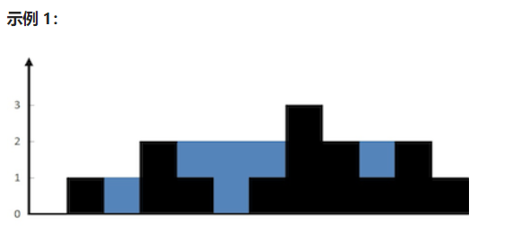

# 双指针问题

## [Leetcode 11. 盛最多水的容器](https://leetcode-cn.com/problems/container-with-most-water/)

给定一个长度为 `n` 的整数数组 `height` 。有 `n` 条垂线，第 `i` 条线的两个端点是 `(i, 0)` 和 `(i, height[i])` 。

找出其中的两条线，使得它们与 `x` 轴共同构成的容器可以容纳最多的水。

返回容器可以储存的最大水量。

```java
class Solution {
    public int maxArea(int[] height) {
        int p = 0;
        int f = height.length - 1;
        int max = 0;
        while (p <= f) {
            int curr = (f - p) * Math.min(height[p], height[f]);
            max = Math.max(max, curr);
            if (height[p] <= height[f]) {
                p++;
            } else {
                f--;
            }
        }
        return max;
    }
}
```


## [LeetCode 42. 接雨水](https://leetcode-cn.com/problems/trapping-rain-water/)

给定 `n` 个非负整数表示每个宽度为 `1` 的柱子的高度图，计算按此排列的柱子，下雨之后能接多少雨水。



**示例 1：**

```
输入：height = [0,1,0,2,1,0,1,3,2,1,2,1]
输出：6
解释：上面是由数组 [0,1,0,2,1,0,1,3,2,1,2,1] 表示的高度图，在这种情况下，可以接 6 个单位的雨水（蓝色部分表示雨水）。 
```

**示例 2：**

```
输入：height = [4,2,0,3,2,5]
输出：9
```

**个人解法：将一维数组拆分成二维数组，height中的每个值转化为二维数组的高度1，然后逐层循环计算1和1之间的距离**

**但是超出内存限制了**

```java
class Solution {
    public int trap(int[] height) {
        int maxnum = 0;
        // 获取二维数组高度
        for (int i = 0; i < height.length; i++) {
            maxnum = Math.max(height[i], maxnum);
        }
        // 设置一个二维数组,高度过大会超内存
        int[][] area = new int[maxnum][height.length];
        for (int i = 0; i < height.length; i++) {
            for (int j = 0; j < height[i]; j++) {
                area[maxnum - j - 1][i] = 1;
            }
        }
        // 接雨水的量
        int recv = 0;
        // 循环每一层，双指针计算1和1之间的空余
        for (int i = 0; i < maxnum; i++) {
            int p = -1;
            int n = -1;
            for (int j = 0; j < area[i].length; j++) {
                if (area[i][j] == 1) {
                    if (p < 0 || p < n) {
                        p = j;
                    } else {
                        n = j;
                    }
                    if (n > 0) {
                        recv = recv + (p > n ? p - n - 1 : n - p - 1);
                    }
                }
            }
        }
        return recv;
    }
}
```

**正确解法，双指针：**

左指针指向0，右指针指向height.length。如果左右指针高度相同，或右指针高度小于左指针高度，则右指针往左移

只要有一边高度大于另外一边，假设height[left]=0，而height[right]=3，那么left位置的水能存多少完全取决于left左边的最大高度是多少，水只会向左流走，绝对不会向右流走。

```java
class Solution {
    public int trap(int[] height) {
        int ans = 0;
        int left = 0, right = height.length - 1;
        int leftMax = 0, rightMax = 0;
        while (left < right) {
            leftMax = Math.max(leftMax, height[left]);
            rightMax = Math.max(rightMax, height[right]);
            if (height[left] < height[right]) {
                ans += leftMax - height[left];
                ++left;
            } else {
                ans += rightMax - height[right];
                --right;
            }
        }
        return ans;
    }
}

```

## [LeetCode 167. 两数之和 II - 输入有序数组](https://leetcode.cn/problems/two-sum-ii-input-array-is-sorted/)

给你一个下标从 **1** 开始的整数数组 `numbers` ，该数组已按 **非递减顺序排列** ，请你从数组中找出满足相加之和等于目标数 `target` 的两个数。如果设这两个数分别是 `numbers[index1]` 和 `numbers[index2]` ，则 `1 <= index1 < index2 <= numbers.length` 。

以长度为 2 的整数数组 `[index1, index2]` 的形式返回这两个整数的下标 `index1` 和 `index2`。

你可以假设每个输入 **只对应唯一的答案** ，而且你 **不可以** 重复使用相同的元素。

你所设计的解决方案必须只使用常量级的额外空间。

**示例 1：**

```
输入：numbers = [2,7,11,15], target = 9
输出：[1,2]
解释：2 与 7 之和等于目标数 9 。因此 index1 = 1, index2 = 2 。返回 [1, 2] 。
```

**示例 2：**

```
输入：numbers = [2,3,4], target = 6
输出：[1,3]
解释：2 与 4 之和等于目标数 6 。因此 index1 = 1, index2 = 3 。返回 [1, 3] 。
```

**示例 3：**

```
输入：numbers = [-1,0], target = -1
输出：[1,2]
解释：-1 与 0 之和等于目标数 -1 。因此 index1 = 1, index2 = 2 。返回 [1, 2] 。
```

使用双指针，一个指针指向值较小的元素，一个指针指向值较大的元素。指向较小元素的指针从头向尾遍历，指向较大元素的指针从尾向头遍历。

如果两个指针指向元素的和 sum == target，那么得到要求的结果；
如果 sum > target，移动较大的元素，使 sum 变小一些；
如果 sum < target，移动较小的元素，使 sum 变大一些。

```java
class Solution {
    public int[] twoSum(int[] numbers, int target) {
        int p = 0;
        int n = numbers.length - 1;
        while (p < n) {
            if (numbers[p] + numbers[n] > target) {
                n--;
            }
            if (numbers[p] + numbers[n] < target) {
                p++;
            }
            if (numbers[p] + numbers[n] == target) {
                return new int[]{p + 1, n + 1};
            }
        }
        return null;
    }
}
```


## [leetcode 633. 平方数之和](https://leetcode.cn/problems/sum-of-square-numbers/)

给定一个非负整数 `c` ，你要判断是否存在两个整数 `a` 和 `b`，使得 `a2 + b2 = c` 。

**示例 1：**

```
输入：c = 5
输出：true
解释：1 * 1 + 2 * 2 = 5
```

**示例 2：**

```
输入：c = 3
输出：false
```

与上面类似，主要需要界定大小指针的起始点

>  陷阱：小心int越界 ,int 类型通常占用4字节，即32比特。其取值范围为-2,147,483,648到2,147,483,647
>
> 使用long

```java
class Solution {
    public boolean judgeSquareSum(int c) {
        long n = (long) Math.floor(Math.sqrt(c));
        long p = 0;
        while (p <= n) {
            if (p * p + n * n > c) {
                n--;
            }else if (p * p + n * n < c) {
                p++;
            }else {
                return true;
            }
        }
        return false;
    }
}
```

