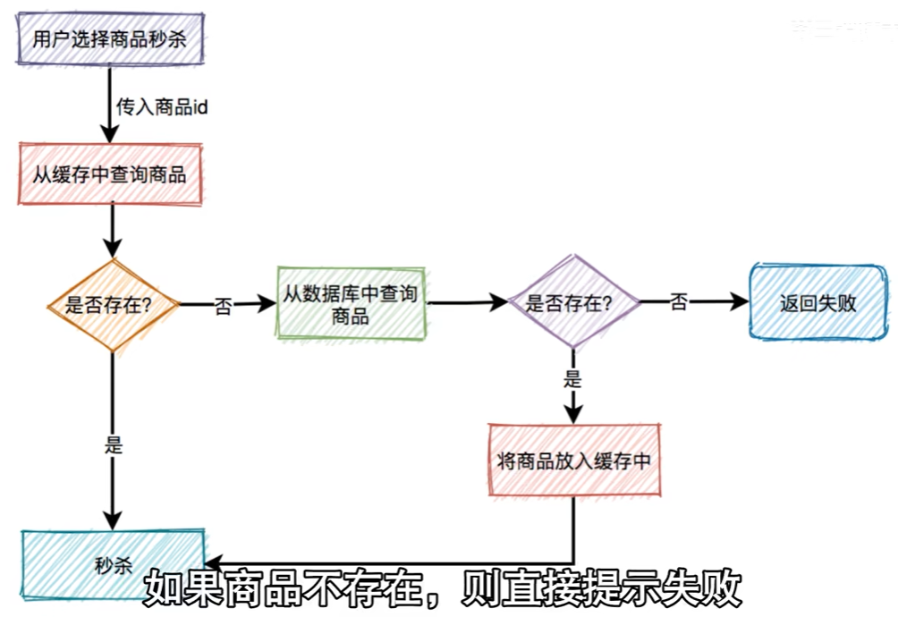
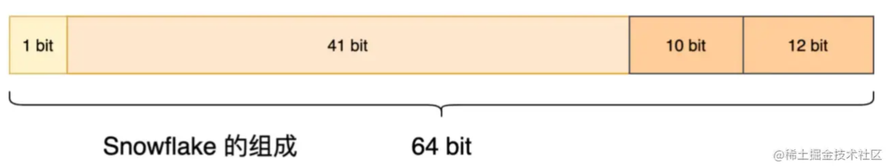

# **业务场景方面面试题**

### 1.**是否定义、设计过业务模型？**

**答案解析思路**：这个问题看似“高大上”，但其实非常简单。所谓的业务模型就是将**需求转换成程序之后，设计的数据库和数据表**，所以在开发中你一定定义过或设计过业务模型。

理解需求->分析需求->建立关系和依赖->设计业务逻辑->持久化数据模型

>  在设计数据库的整个过程中，要遵循数据库的“三范式”。

### **2.如何防止重复提交订单？(如何保证幂等性)**

重复提交原因

- 一种是由于用户在短时间内多次点击下单按钮，或浏览器刷新按钮导致。
- 另一种则是由于Nginx或类似于SpringCloud Gateway的网关层，进行超时重试造成的。

**方案一：提交订单按钮置灰**

这种解决方案在注册登录的场景下比较常见，当我们点击”发送验证码“按钮的时候，会进行手机短信验证码发送，且按钮就会有一分钟左右的置灰。

但这种方案只能解决多次点击下单按钮的问题，对于Nginx或类似于SpringCloud Gateway的超时重试所导致的问题是无能为力的。

当然，这种方案也不是真的没有价值。它可以在高并发场景下，从浏览器端去拦住一部分请求，减少后端服务器的处理压力。

**方案二：预生成全局唯一订单号**

（1）后端新增一个接口，用于预生成一个“全局唯一订单号”

> 该“全局唯一订单号”不能代替数据库主键，在未分库分表场景下，主键还是用数据库自增ID比较好。

（2）进入创建订单页面时，前端请求该接口，**获取该订单号**。

（3）在提交订单时，请求参数里要带上这个预生成的“全局唯一订单号”，利用数据库的唯一索引特性，在插入订单记录时，如果该“全局唯一的订单号”重复，记录会插入失败。

**方案三：前端自己生成全局唯一订单号** 简化了一定的逻辑不用请求接口了

**方案四：从订单业务的本质入手**

`如何防止重复提交订单`，其实就是**防止在短时间内，用户和商品进行多次连接**。

可以用 `用户ID + 分隔符 + 商品ID` 作为唯一标识，让持有相同标识的请求在短时间内不能重复下单，不就可以了吗？而且，Redis不正是做这种解决方案的利器吗？

把`用户ID + 分隔符 + 商品ID`作为Redis key，并把”短时间所对应的秒数“设置为seconds，让它过期自动删除。

### ***3.高并发如何设计一个秒杀系统**

流量会在某个点激凸，对此要设计一个全新的系统来应对这种场景

- 页面静态化：

  活动页面是用户流量的第一入口，所以并发量最大。如果这些流量都能直接访问服务端，服务端有很大可能会挂掉而活动中大部分内容很有可能都是固定的，（商品名称，描述等），通常情况下会对页面做静态化处理。只有到秒杀时间点且用户点了秒杀按钮才会正式请求服务端，这样能过滤大部分请求

- CDN加速

  每个区域请求服务端时间各不相同，地域相差远网速各不相同。为此需要使用cdn`内容分发网络`，使用户就近获取内容，降低网络拥塞，提高访问响应速率和命中率

- 秒杀按钮：

  如何在静态页面中保证秒杀按钮是第一时间点亮的呢？

  使用js文件控制。一般将js，css和静态资源放在cdn上。秒杀开始之前，js标志为false，当秒杀开始时系统生成一个新的js文件，此时标志为true

  前端还可以加一个定时器，控制10s之内只允许发起一次请求，如果点击一次则10s内置灰

- 缓存：

  

  缓存三大问题：

  ​	缓存击穿：大量请求去请求数据库然后将数据放入缓存，为此可以进行缓存预热和添加分布式锁

  ​	缓存穿透：商品id在数据库不存在，如果是更新很少的场景可以使用布隆过滤器，但如果缓存更新频繁，则需要将不存在的商品id也缓存起来`这种特殊商品的超时时间要短`

  ​	缓存雪崩：

- 库存问题：分布式锁

  在用户下单后进行库存的预扣减，如果超时未支付就加回去

  但在并发场景下会有原子性问题而导致超卖

  使用redisson分布式锁

- mq异步处理

  把下单和支付功能从秒杀中抽出来，由秒杀端发送消息，下单服务消费消息

  此时又要注意

  消息丢失：

  重复消费：

- 限流：

  识别非法请求：1.对某个用户/IP限流

  2.对请求接口总次数进行限制

  3.验证码 数字/移动滑块

## 4.使用雪花算法作为id时发生时钟回拨怎么办？

`snowflake`（雪花算法）：Twitter 开源的分布式 id 生成算法，64 位的 long 型的 id，分为 4 部分：

- 1 bit：不用，统一为 0
- 41 bits：`毫秒时间戳`，可以表示 69 年的时间。
- 10 bits：5 bits 代表机房 id，5 个 bits 代表机器 id。最多代表 32 个机房，每个机房最多代表 32 台机器。
- 12 bits：同一毫秒内的 id，最多 4096 个不同 id，自增模式

优点：

- 毫秒数在高位，自增序列在低位，整个ID都是趋势递增的。
- 不依赖数据库等第三方系统，以服务的方式部署，稳定性更高，生成ID的性能也是非常高的。
- 可以根据自身业务特性分配bit位，非常灵活。

缺点：强依赖机器时钟，如果机器上时钟回拨（可以搜索 **2017 年闰秒 7:59:60**），会导致发号重复或者服务会处于不可用状态

> 服务器上的时钟不同步后，又自动进行同步了，前后时间不一致

**时钟回拨**：**服务器时钟可能会因为各种原因发生不准，而网络中会提供 NTP 服务来做时间校准，因此在做校准的时候，服务器时钟就会发生时钟的跳跃或者回拨问题。**

方法一：时钟同步

服务器上都安装了 `ntpdate` 软件，作为 NTP 客户端，会每隔 `10 分钟`向 `NTP 时间服务器`同步一次时间

（1）方式一：使用美团 `Leaf`方案，基于雪花算法。

（2）**方式二：使用百度 UidGenerator，基于雪花算法**

（3）方式三：用 Redis 生成自增的分布式 ID。弊端是 ID 容易被猜到，有安全风险。
