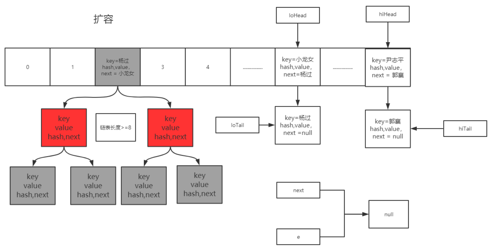

# Collections 之hashMap

## **数据结构**

数组 + 链表 +(红黑树     jdk>=8)

## **源码原理分析**

### **重要成员变量**

- DEFAULT_INITIAL_CAPACITY = 1 << 4  Hash 表默认初始容量 (`default_initial_capacity:默认初始容量`)

  > 数组初始容量必须是2的整数次幂，如果不是会被转化成2的指数（大于n最接近n的2的整数次幂）
  >
  > 为什么是2的指数幂？让hash更为散列减少哈希碰撞，

- MAXIMUM_CAPACITY = 1 << 30  最大 Hash 表容量 （`maximum_capacity:最大容量`）

- DEFAULT_LOAD_FACTOR = 0.75f    默认加载因子    `容量达到75%进行扩容`

  > 比如初始容量16，当达到12个就开始扩容
  >
  > 为什么是0.75 是在空间和时间上取得了不错的均衡（牛顿二项式推导）

- TREEIFY_THRESHOLD = 8   链表转红黑树阈值`大于8也就是9才会转`

  > 同时考虑MIN_TREEIFY_CAPACITY容量达到64才会转，否则优先扩容

- UNTREEIFY_THRESHOLD = 6    红黑树转链表阈值

- MIN_TREEIFY_CAPACITY = 64    链表转红黑树时 hash 表最小容量阈值，达不到优先扩容。


### hash计算机hash值

```java
static final int hash(Object key) {
    int h;
    //hashmap里不是用取模而是位运算效率高，差10倍效率
    return (key == null) ? 0 : (h = key.hashCode()) ^ (h >>> 16);
}
```


### **Jdk7 - 扩容死锁分析**

HashMap 是线程不安全的，不安全的具体原因就是在高并发场景下，扩容可能产生死锁 (Jdk1.7 存在) 以及 get 操作可能带来的数据丢失。

死锁问题核心在于下面代码，多线程扩容导致形成的链表环 

```java
void transfer(Entry[] newTable, boolean rehash) {
    int newCapacity = newTable.length;
    // 对原哈希表中的每个元素进行遍历
    for (Entry<K,V> e : table) {
        while(null != e) {
            Entry<K,V> next = e.next;//第一行
            if (rehash) {
                // 重新计算当前元素的 哈希
                e.hash = null == e.key ? 0 : hash(e.key);
            }
           	// 根据新哈希表的容量和当前元素的哈希值计算新哈希表中的 索引位置
            int i = indexFor(e.hash, newCapacity);//第二行
            //将当前元素的下一个节点指向新哈希表中索引位置 i 处的头节点，实现链表的插入操作 头插
            e.next = newTable[i];//第三行
            // e -> T[i] （原来i位置的值）   =>    T[i] = e  头插完成 
            newTable[i] = e;//第四行
      		//进行下一个e的判断
            e = next;//第五行
        }
    }
}
```

#### **单线程扩容**

​	**假设：**hash 算法就是简单的 key 与 length (数组长度) 求余。hash 表长度为 2，如果不扩容， 那么元素 key 为 3,5,7 按照计算 (key% table.length) 的话都应该碰撞到 table [1] 上。

​	**扩容：**hash 表长度会扩容为 4 重新 hash，key=3 会落到 table [3] 上 (3%4=3)， 当前 e.next 为 key (7), 继续 while 循环重新 hash，key=7 会落到 table [3] 上 (7%4=3), 产生碰撞， 这里采用的是头插入法，所以 key=7 的 Entry 会排在 key=3 前面 (这里可以具体看 while 语句中代码) 当前 e.next 为 key (5), 继续 while 循环重新 hash，key=5 会落到 table [1] 上 (5%4=3)， 当前 e.next 为 null, 跳出 while 循环，resize 结束。


#### **多线程扩容**

下面就是多线程同时 put 的情况了， 然后同时进入 transfer 方法中：假设这里有两个线程同时执行了 put () 操作，并进入了 transfer () 环节

```java
while(null != e) {
      Entry<K,V> next = e.next;//第一行，线程1执行到此被调度挂起
      int i = indexFor(e.hash, newCapacity);//第二行
      e.next = newTable[i];//第三行
      newTable[i] = e;//第四行
      e = next;//第五行
}
```

> 简而言之，两个线程同时对一个hashmap扩容时       - e1   (简单图示)
>
> ​																							  |
>
> ​																							e2
>
> T2准备扩容时获取了map某个节点的e1和next被阻塞后（也就是代码第一行）
>
> T1又完成了扩容流程  就变成了     - - e2 -
>
> ​															  |
>
> ​															e1
>
> 此时T2继续执行代码就会导致e1，e2形成循环链表


### **Jdk8 - 扩容**

Java8 HashMap 扩容跳过了 Jdk7 扩容的坑，对源码进行了优化，采用**高低位拆分转移方式**，避免了**链表环的产生**。

扩容前


扩容后



扩容代码：

```java
Node<K,V> loHead = null, loTail = null;
Node<K,V> hiHead = null, hiTail = null;
Node<K,V> next;
//循环遍历原哈希表中的每个元素
do {
    next = e.next;
    //根据当前元素的哈希值与原哈希表的容量 oldCap 进行与运算的结果，将元素分为两组，
    // e.hash & 16 = 0 低位指针
    if ((e.hash & oldCap) == 0) {
        //将低位的hash相连形成一个链表，loTail用于指向尾部，loHead永远指向头部
        //高位链接也同样处理
        if (loTail == null)
            loHead = e;
        else
            loTail.next = e;
        loTail = e;
    }
    else {
        //// e.hash & 16 > 0 高位指针
        if (hiTail == null)
            hiHead = e;
        else
            hiTail.next = e;
        hiTail = e;
    }
} while ((e = next) != null);
if (loTail != null) {
    //对于低位链表直接挪到新数组的原来位置
    loTail.next = null;
    newTab[j] = loHead;
}
if (hiTail != null) {
    //对于高位表挪到原来位置+老数组长度的位置
    hiTail.next = null;
    newTab[j + oldCap] = hiHead;
}
```

这种方式绕开了rehash

> 要满足高低位移动数组容量必须是2的幂次方
>
> 举例来说，假设 `oldCap` 的值为 3，二进制表示为 011。而哈希表的新容量是原来的两倍，即 `newCap` 等于 `oldCap` 的两倍，也就是 6，二进制表示为 110。
>
> 现在考虑一个哈希值的情况，它的二进制表示是 5 `101`。`假设5在oldCap放在2的位置5%3=2`
>
> 按位与运算的结果是 001 那就是放在1+2=3的位置，这与它的正确位置相悖
>
> 
>
> 这种方式同样适用于分库分表的扩容

