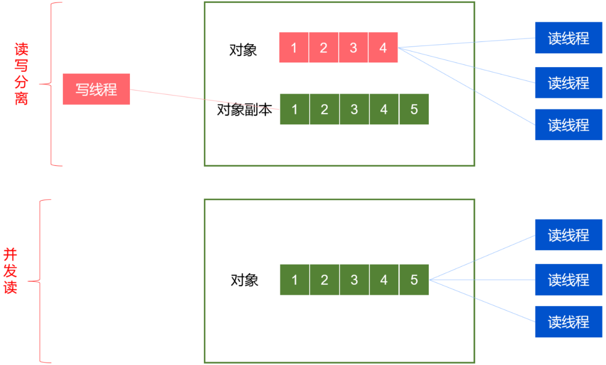

# **Collections之CollCopyOnWrite 机制**

核心思想：读写分离，空间换时间，避免为保证并发安全导致的激烈的锁竞争。

实现：CopyOnWriteArrayList，CopyOnWriteArraySet，CopyOnWriteMap

## **划关键点：**

1. CopyOnWrite 适用于读多写少的情况，最大程度的提高读的效率；

2. CopyOnWrite 是最终一致性，在写的过程中，原有的读的数据是不会发生更新的，只有新的读才能读到最新数据；

> 如何使其他线程能够及时读到新的数据，需要使用 volatile 变量

3. 写的时候不能并发写，需要对写操作进行加锁

   

## **源码原理**:**写时复制**

也就是副本

```java
/*
 *   添加元素api
 */
public boolean add(E e) {
    final ReentrantLock lock = this.lock;
    lock.lock();
    try {
        Object[] elements = getArray();
        int len = elements.length;
        Object[] newElements = Arrays.copyOf(elements, len + 1); //复制一个array副本
        newElements[len] = e; //往副本里写入
        setArray(newElements); //副本替换原本，成为新的原本
        return true;
    } finally {
        lock.unlock();
    }
}
//读api
public E get(int index) {
    return get(getArray(), index); //无锁
}
```

