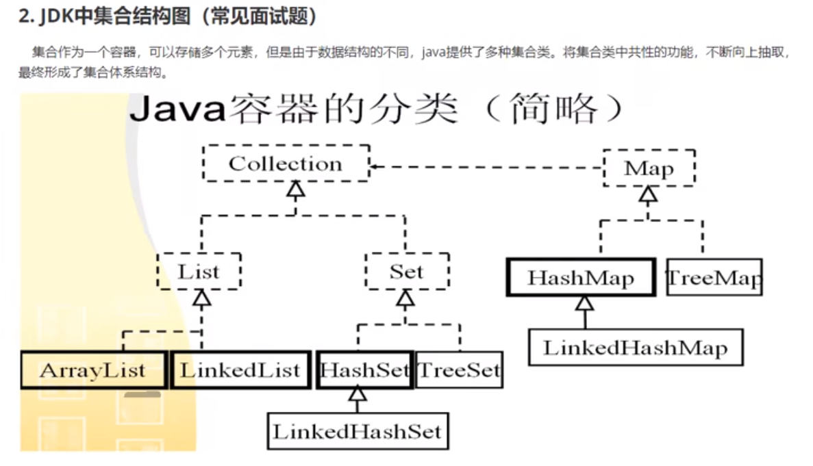

# Collections 之 List

集合就是存储数据的容器

Collection，主要由 List、Set、Queue 组成：

- List 代表有序、可重复的集合，典型代表就是封装了动态数组的 [ArrayList](https://javabetter.cn/collection/arraylist.html) 和封装了链表的 [LinkedList](https://javabetter.cn/collection/linkedlist.html)；

- Set 代表无序、不可重复的集合，典型代表就是 HashSet 和 TreeSet；

  > Set 的特点是存取无序，**不可以存放重复的元素**，**不可以用下标对元素进行操作**，和 List 有很多不同。

- Queue 代表队列，典型代表就是双端队列 [ArrayDeque](https://javabetter.cn/collection/arraydeque.html)，以及优先级队列 [PriorityQueue](https://javabetter.cn/collection/PriorityQueue.html)。




## ArrayList

List 的特点是存取有序，可以存放重复的元素，可以用下标对元素进行操作

- ArrayList 是由数组实现的，支持**随机存取**，也就是可以**通过下标直接存取元素**
- 从尾部插入和删除元素会比较快捷，从中间插入和删除元素会比较低效，因为涉及到数组元素的复制和移动
- 如果内部数组的容量不足时会**自动扩容**，因此当元素非常庞大的时候，效率会比较低

### 添加元素

可以通过 `add()` 方法向 ArrayList 中添加一个元素

```
堆栈过程图示：
add(element)
└── if (size == elementData.length) // 判断是否需要扩容
    ├── grow(minCapacity) // 扩容
    │   └── newCapacity = oldCapacity + (oldCapacity >> 1) // 计算新的数组容量
    │   └── Arrays.copyOf(elementData, newCapacity) // 创建新的数组
    ├── elementData[size++] = element; // 添加新元素
    └── return true; // 添加成功
```

来具体看一下，先是 `add()` 方法的源码

```java
/**
 * 将指定元素添加到 ArrayList 的末尾
 * @param e 要添加的元素
 * @return 添加成功返回 true
 */
public boolean add(E e) {
    ensureCapacityInternal(size + 1);  // 确保 ArrayList 能够容纳新的元素
    elementData[size++] = e; // 在 ArrayList 的末尾添加指定元素
    return true;
}

```

继续跟下去，来看看 `ensureCapacityInternal()` 方法：

```java
/**
 * 确保 ArrayList 能够容纳指定容量的元素
 * @param minCapacity 指定容量的最小值
 */
private void ensureCapacityInternal(int minCapacity) {
    if (elementData == DEFAULTCAPACITY_EMPTY_ELEMENTDATA) { // 如果 elementData 还是默认的空数组
        minCapacity = Math.max(DEFAULT_CAPACITY, minCapacity); // 使用 DEFAULT_CAPACITY 和指定容量的最小值中的较大值
    }

    ensureExplicitCapacity(minCapacity); // 确保容量能够容纳指定容量的元素
}
```

此时：

- 参数 minCapacity 为 1（size+1 传过来的）
- elementData 为存放 ArrayList 元素的底层数组，前面声明 ArrayList 的时候讲过了，此时为空 `{}`
- DEFAULTCAPACITY_EMPTY_ELEMENTDATA 前面也讲过了，为 `{}`

所以，if 条件此时为 true，if 语句 `minCapacity = Math.max(DEFAULT_CAPACITY, minCapacity)` 要执行。

DEFAULT_CAPACITY 为 10（见下面的代码），所以执行完这行代码后，minCapacity 为 10，`Math.max()` 方法的作用是取两个当中最大的那个。

```java
private static final int DEFAULT_CAPACITY = 10;
```

接下来执行 `ensureExplicitCapacity()` 方法，来看一下源码：

```java
/**
 * 检查并确保集合容量足够，如果需要则增加集合容量。
 *
 * @param minCapacity 所需最小容量
 */
private void ensureExplicitCapacity(int minCapacity) {
    // 检查是否超出了数组范围，确保不会溢出
    if (minCapacity - elementData.length > 0)
        // 如果需要增加容量，则调用 grow 方法
        grow(minCapacity);
}
```

此时：

- 参数 minCapacity 为 10
- elementData.length 为 0（数组为空）

```java
/**
 * 扩容 ArrayList 的方法，确保能够容纳指定容量的元素
 * @param minCapacity 指定容量的最小值
 */
private void grow(int minCapacity) {
    // 检查是否会导致溢出，oldCapacity 为当前数组长度
    int oldCapacity = elementData.length;
    int newCapacity = oldCapacity + (oldCapacity >> 1); // 扩容至原来的1.5倍
    if (newCapacity - minCapacity < 0) // 如果还是小于指定容量的最小值
        newCapacity = minCapacity; // 直接扩容至指定容量的最小值
    if (newCapacity - MAX_ARRAY_SIZE > 0) // 如果超出了数组的最大长度
        newCapacity = hugeCapacity(minCapacity); // 扩容至数组的最大长度
    // 将当前数组复制到一个新数组中，长度为 newCapacity
    elementData = Arrays.copyOf(elementData, newCapacity);
}
```

此时：

- 参数 minCapacity 为 10
- 变量 oldCapacity 为 0

所以 newCapacity 也为 0，于是 `newCapacity - minCapacity` 等于 -10 小于 0，于是第一个 if 条件为 true，执行第一个 if 语句 `newCapacity = minCapacity`，然后 newCapacity 为 10。

紧接着执行 `elementData = Arrays.copyOf(elementData, newCapacity);`，也就是进行数组的第一次扩容，长度为 10。

回到 `add()` 方法：

```java
public boolean add(E e) {
    ensureCapacityInternal(size + 1);
    elementData[size++] = e;
    return true;
}
```

执行 `elementData[size++] = e`。

数组的第一个元素（下标为 0） 被赋值为 “xxx”，接着返回 true，第一次 add 方法执行完毕。

### 指定位置添加元素

除了 `add(E e)` 方法，还可以通过 `add(int index, E element)` 方法把元素添加到 ArrayList 的指定位置

`add(int index, E element)` 方法的源码如下：

```java
/**
 * 在指定位置插入一个元素。
 *
 * @param index   要插入元素的位置
 * @param element 要插入的元素
 * @throws IndexOutOfBoundsException 如果索引超出范围，则抛出此异常
 */
public void add(int index, E element) {
    rangeCheckForAdd(index); // 检查索引是否越界
	// 确保容量足够，如果需要扩容就扩容
    ensureCapacityInternal(size + 1);  
    // 将 index 及其后面的元素向后移动一位
    System.arraycopy(elementData, index, elementData, index + 1,size - index); 
    // 将元素插入到指定位置
    elementData[index] = element; 
    size++; // 元素个数加一
}
```

`add(int index, E element)` 方法会调用到一个非常重要的本地方法`System.arraycopy()`，它会对数组进行复制（要插入位置上的元素往后复制）。

**这是 arraycopy () 的语法：**

```java
System.arraycopy(elementData, index, elementData, index + 1, size - index);
```

- elementData：表示要复制的源数组，即 ArrayList 中的元素数组。
- index：表示源数组中要复制的起始位置，即需要将 index 及其后面的元素向后移动一位。
- elementData：表示要复制到的目标数组，即 ArrayList 中的元素数组。
- index + 1：表示目标数组中复制的起始位置，即将 index 及其后面的元素向后移动一位后，应该插入到的位置。
- size - index：表示要复制的元素个数，即需要将 index 及其后面的元素向后移动一位，需要移动的元素个数为 size - index。


### 总结

ArrayList，如果有个中文名的话，应该叫动态数组，也就是可增长的数组，可调整大小的数组。动态数组克服了静态数组的限制，静态数组的容量是固定的，只能在首次创建的时候指定。而动态数组会随着元素的增加自动调整大小，更符合实际的开发需求。


## **LinkedList**

- LinkedList 是由双向链表实现的，**不支持随机存取**，只能**从一端开始遍历，直到找到需要的元素后返回**；
- 任意位置**插入和删除元素都很方便**，因为只需要改变前一个节点和后一个节点的引用即可，不像 ArrayList 那样需要复制和移动数组元素；
- 因为每个元素都存储了前一个和后一个节点的引用，所以相对来说，**占用的内存空间会比 ArrayList 多一些**

```java
/**
 * 链表中的节点类。
 */
private static class Node<E> {
    E item; // 节点中存储的元素
    Node<E> next; // 指向下一个节点的指针
    Node<E> prev; // 指向上一个节点的指针

    /**
     * 构造一个新的节点。
     *
     * @param prev 前一个节点
     * @param element 节点中要存储的元素
     * @param next 后一个节点
     */
    Node(Node<E> prev, E element, Node<E> next) {
        this.item = element; // 存储元素
        this.next = next; // 设置下一个节点
        this.prev = prev; // 设置上一个节点
    }
}
```

它由三部分组成：

- 节点上的元素
- 下一个节点
- 上一个节点

其中

- 对于第一个节点来说，prev 为 null；
- 对于最后一个节点来说，next 为 null；
- 其余的节点呢，prev 指向前一个，next 指向后一个。

**使用**

在使用之前，我们都必须得初始化

```java
LinkedList<String> list = new LinkedList();
```

在初始化的时候可以指定大小，也可以不指定，等到添加第一个元素的时候进行第一次扩容。而我，没有大小，只要内存够大，我就可以无穷大。

### **增**

可以调用 add 方法添加元素：

```java
list.add("沉默王二");
list.add("沉默王三");
list.add("沉默王四");
```

add 方法内部其实调用的是 linkLast 方法：

```java
/**
 * 将指定的元素添加到列表的尾部。
 *
 * @param e 要添加到列表的元素
 * @return 始终为 true（根据 Java 集合框架规范）
 */
public boolean add(E e) {
    linkLast(e); // 在列表的尾部添加元素
    return true; // 添加元素成功，返回 true
}
```

linkLast，顾名思义，就是在链表的尾部添加元素：

```java
/**
 * 在列表的尾部添加指定的元素。
 *
 * @param e 要添加到列表的元素
 */
void linkLast(E e) {
    final Node<E> l = last; // 获取链表的最后一个节点
    final Node<E> newNode = new Node<>(l, e, null); // 创建一个新的节点，并将其设置为链表的最后一个节点
    last = newNode; // 将新的节点设置为链表的最后一个节点
    if (l == null) // 如果链表为空，则将新节点设置为头节点
        first = newNode;
    else
        l.next = newNode; // 否则将新节点链接到链表的尾部
    size++; // 增加链表的元素个数
}
```

### **删**

- `remove()`：删除第一个节点
- `remove(int)`：删除指定位置的节点
- `remove(Object)`：删除指定元素的节点
- `removeFirst()`：删除第一个节点
- `removeLast()`：删除最后一个节点

```java
 * 删除指定位置上的元素。
 *
 * @param index 要删除的元素的索引
 * @return 从列表中删除的元素
 * @throws IndexOutOfBoundsException 如果索引越界（index &lt; 0 || index &gt;= size()）
 */
public E remove(int index) {
    checkElementIndex(index); // 检查索引是否越界
    return unlink(node(index)); // 删除指定位置的节点，并返回节点的元素
}
```

unlink 方法其实很好理解，就是更新当前节点的 next 和 prev，然后把当前节点上的元素设为 null。

```java
/**
 * 从链表中删除指定节点。
 *
 * @param x 要删除的节点
 * @return 从链表中删除的节点的元素
 */
E unlink(Node<E> x) {
    final E element = x.item; // 获取要删除节点的元素
    final Node<E> next = x.next; // 获取要删除节点的下一个节点
    final Node<E> prev = x.prev; // 获取要删除节点的上一个节点

    if (prev == null) { // 如果要删除节点是第一个节点
        first = next; // 将链表的头节点设置为要删除节点的下一个节点
    } else {
        prev.next = next; // 将要删除节点的上一个节点指向要删除节点的下一个节点
        x.prev = null; // 将要删除节点的上一个节点设置为空
    }

    if (next == null) { // 如果要删除节点是最后一个节点
        last = prev; // 将链表的尾节点设置为要删除节点的上一个节点
    } else {
        next.prev = prev; // 将要删除节点的下一个节点指向要删除节点的上一个节点
        x.next = null; // 将要删除节点的下一个节点设置为空
    }

    x.item = null; // 将要删除节点的元素设置为空
    size--; // 减少链表的元素个数
    return element; // 返回被删除节点的元素
}
```

### 改

可以调用 `set()` 方法来更新元素：

```java
list.set(0, "沉默王五");
```

来看一下 `set()` 方法：

```java
/**
 * 将链表中指定位置的元素替换为指定元素，并返回原来的元素。
 *
 * @param index 要替换元素的位置（从 0 开始）
 * @param element 要插入的元素
 * @return 替换前的元素
 * @throws IndexOutOfBoundsException 如果索引超出范围（index < 0 || index >= size()）
 */
public E set(int index, E element) {
    checkElementIndex(index); // 检查索引是否超出范围
    Node<E> x = node(index); // 获取要替换的节点
    E oldVal = x.item; // 获取要替换节点的元素
    x.item = element; // 将要替换的节点的元素设置为指定元素
    return oldVal; // 返回替换前的元素
}
```

来看一下 node 方法：

```java
/**
 * 获取链表中指定位置的节点。
 *
 * @param index 节点的位置（从 0 开始）
 * @return 指定位置的节点
 * @throws IndexOutOfBoundsException 如果索引超出范围（index < 0 || index >= size()）
 */
Node<E> node(int index) {
    if (index < (size >> 1)) { // 如果索引在链表的前半部分
        Node<E> x = first;
        for (int i = 0; i < index; i++) // 从头节点开始向后遍历链表，直到找到指定位置的节点
            x = x.next;
        return x; // 返回指定位置的节点
    } else { // 如果索引在链表的后半部分
        Node<E> x = last;
        for (int i = size - 1; i > index; i--) // 从尾节点开始向前遍历链表，直到找到指定位置的节点
            x = x.prev;
        return x; // 返回指定位置的节点
    }
}
```

`size >> 1`：也就是右移一位，相当于除以 2。对于计算机来说，移位比除法运算效率更高，因为数据在计算机内部都是以二进制存储的。

换句话说，node 方法会对下标进行一个初步判断，如果靠近前半截，就从下标 0 开始遍历；如果靠近后半截，就从末尾开始遍历，这样可以提高效率，最大能提高一半的效率。

找到指定下标的节点就简单了，直接把原有节点的元素替换成新的节点就 OK 了，prev 和 next 都不用改动

### **查**

我这个查的招式可以分为两种：

- indexOf (Object)：查找某个元素所在的位置
- get (int)：查找某个位置上的元素

来看一下 indexOf 方法的源码

```java
/**
 * 返回链表中首次出现指定元素的位置，如果不存在该元素则返回 -1。
 *
 * @param o 要查找的元素
 * @return 首次出现指定元素的位置，如果不存在该元素则返回 -1
 */
public int indexOf(Object o) {
    int index = 0; // 初始化索引为 0
    if (o == null) { // 如果要查找的元素为 null
        for (Node<E> x = first; x != null; x = x.next) { // 从头节点开始向后遍历链表
            if (x.item == null) // 如果找到了要查找的元素
                return index; // 返回该元素的索引
            index++; // 索引加 1
        }
    } else { // 如果要查找的元素不为 null
        for (Node<E> x = first; x != null; x = x.next) { // 从头节点开始向后遍历链表
            if (o.equals(x.item)) // 如果找到了要查找的元素
                return index; // 返回该元素的索引
            index++; // 索引加 1
        }
    }
    return -1; // 如果没有找到要查找的元素，则返回 -1
}
```


## 两者的使用场景

当需要**频繁随机访问元素**的时候，例如读取大量数据并进行处理或者需要对数据进行排序或查找的场景，可以使用 ArrayList。例如一个学生管理系统，需要对学生列表进行排序或查找操作，可以使用 ArrayList 存储学生信息，以便快速访问和处理。

当需要**频繁插入和删除元素**的时候，例如实现队列或栈，或者需要在中间插入或删除元素的场景，可以使用 LinkedList。例如一个实时聊天系统，需要实现一个消息队列，可以使用 LinkedList 存储消息，以便快速插入和删除消息。

在一些特殊场景下，可能需要同时支持随机访问和插入 / 删除操作。例如一个在线游戏系统，需要实现一个玩家列表，需要支持快速查找和遍历玩家，同时也需要支持玩家的加入和离开。在这种情况下，可以使用 LinkedList 和 ArrayList 的组合，例如使用 LinkedList 存储玩家，以便快速插入和删除玩家，同时使用 ArrayList 存储玩家列表，以便快速查找和遍历玩家。