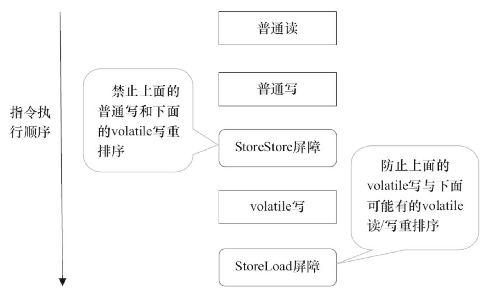
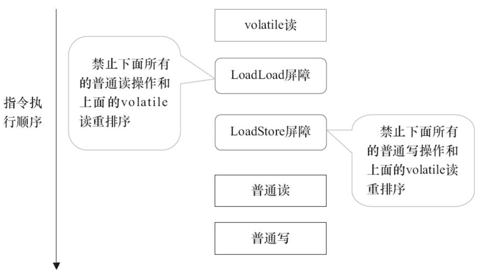

# volatile 详解

## **并发编程的可见性，原子性与有序性问题**

### **原子性**

原子性指的是一个操作是不可中断的，即使是在多线程环境下，一个操作一旦开始就不会被其他线程影响。

在 java 中，对**基本数据类型的变量的读取和赋值操作**是原子性操作

> 有点要注意的是，对于 32 位系统的来说，long 类型数据和 double 类型数据 (对于基本数据类型byte,short,int,float,boolean,char 读写是原子操作)，它们的读写并非原子性的，也就是说如果存在两条线程同时对 long 类型或者 double 类型的数据进行读写是存在相互干扰的，因为对于 32 位虚拟机来说，每次原子读写是 32 位的，而 long 和 double 则是 64 位的存储单元，这样会导致一个线程在写时，操作完前 32 位的原子操作后，轮到 B 线程读取时，恰好只读取到了后 32 位的数据，这样可能会读取到一个既非原值又不是线程修改值的变量，它可能是 “半个变量” 的数值，即 64 位数据被两个线程分成了两次读取。但也不必太担心，因为读取到 “半个变量” 的情况比较少见，至少在目前的商用的虚拟机中，几乎都把 64 位的数据的读写操作作为原子操作来执行，因此对于这个问题不必太在意，知道这么回事即可。


### **可见性**

可见性指的是**当一个线程修改了某个共享变量的值，其他线程是否能够马上得知这个修改的值**。

- 对于**串行程序**来说，可见性是不存在的，因为我们在任何一个操作中修改了某个变量的值，后续的操作中都能读取这个变量值，并且是修改过的新值。

- 但在**多线程环境**中可就不一定了，前面我们分析过，由于线程对共享变量的操作都是线程拷贝到各自的工作内存进行操作后才写回到主内存中的，这就可能存在一个线程 A 修改了共享变量 x 的值，还未写回主内存时，另外一个线程 B 又对主内存中同一个共享变量 x 进行操作，但此时 A 线程工作内存中共享变量 x 对线程 B 来说并不可见，这种**工作内存与主内存同步延迟现象就造成了可见性问题**
- 另外**指令重排以及编译器优化**也可能导致可见性问题，通过前面的分析，我们知道无论是编译器优化还是处理器优化的重排现象，在多线程环境下，确实会导致程序轮序执行的问题，从而也就导致可见性问题


### **有序性问题**

在 Java 里面，可以通过 volatile 关键字来保证一定的 “有序性”。

> 另外可以通过 synchronized 和 Lock 来保证有序性，很显然，synchronized 和 Lock 保证每个时刻是有一个线程执行同步代码，相当于是让线程顺序执行同步代码，自然就保证了有序性。

**Java 内存模型**：每个线程都有自己的工作内存（类似于前面的高速缓存）。**线程对变量的所有操作都必须在工作内存中进行，而不能直接对主存进行操作。并且每个线程不能访问其他线程的工作内存。**Java 内存模型具备一些先天的 “有序性”，即不需要通过任何手段就能够得到保证的有序性，这个通常也称为 **happens-before** 原则。

如果两个操作的执行次序无法从 happens-before 原则推导出来，那么它们就不能保证它们的有序性，虚拟机可以**随意地对它们进行重排序**。

**指令重排序**：java 语言规范规定 JVM 线程内部维持顺序化语义。即只要程序的最终结果与它顺序化情况的结果相等，那么指令的执行顺序可以与代码顺序不一致，此过程叫指令的重排序。

**指令重排序的意义是什么？**

JVM 能根据处理器特性（CPU 多级缓存系统、多核处理器等）适当的对机器指令进行重排序，使机器指令能更符合 CPU 的执行特性，最大限度的发挥机器性能。

下图为从源码到最终执行的指令序列示意图：


## **as-if-serial 语义**

​	as-if-serial 语义的意思是：不管怎么重排序（编译器和处理器为了提高并行度），（单线程）程序的执行结果不能被改变。

​	编译器、runtime 和处理器都必须遵守 as-if-serial 语义。

​	为了遵守 as-if-serial 语义，编译器和处理器不会**对存在数据依赖关系的操作做重排序**，因为这种重排序会改变执行结果。**但是，如果操作之间不存在数据依赖关系，这些操作就可能被编译器和处理器重排序。**<Badge type="error">注意</Badge>


## **happens-before 原则**

只靠 sychronized 和 volatile 关键字来保证原子性、可见性以及有序性，那么编写并发程序可能会显得十分麻烦

幸运的是，从 JDK 5 开始，Java 使用新的 JSR-133 内存模型，提供了 happens-before 原则来辅助保证程序执行的原子性、可见性以及有序性的问题，它是判断数据是否存在竞争、线程是否安全的依据，

**happens-before 原则内容如下**

- 程序顺序原则：即在一个线程内必须保证语义串行性，也就是说按照代码顺序执行。

- 锁规则 ：解锁 (unlock) 操作必 然发生在后续的同一个锁的加锁 (lock) 之前，也就是说，如果对于一个锁解锁后，再加锁，那么加锁的动作必须在解锁动作之后 (同一个锁)。

- volatile 规则 ：volatile 变量的写，先发生于读，这保证了 volatile 变量的可见性，简单的理解就是，volatile 变量在每次被线程访问时，都强迫从主内存中读该变量的值，而当该变量发生变化时，又会强迫将最新的值刷新到主内存，任何时刻，不同的线程总是能够看到该变量的最新值。

- 线程启动规则 线程的 start () 方法先于它的每一个动作，即如果线程 A 在执行线程 B 的 start 方法之前修改了共享变量的值，那么当线程 B 执行 start 方法时，线程 A 对共享变量的修改对线程 B 可见

- 传递性 A 先于 B ，B 先于 C 那么 A 必然先于 C

- 线程终止规则 线程的所有操作先于线程的终结，Thread.join () 方法的作用是等待当前执行的线程终止。假设在线程 B 终止之前，修改了共享变量，线程 A 从线程 B 的 join 方法成功返回后，线程 B 对共享变量的修改将对线程 A 可见。

- 线程中断规则 对线程 interrupt () 方法的调用先行发生于被中断线程的代码检测到中断事件的发生，可以通过 Thread.interrupted () 方法检测线程是否中断。

- 对象终结规则对象的构造函数执行，结束先于 finalize () 方法


## **volatile 内存语义**

volatile 是 Java 虚拟机提供的轻量级的同步机制。volatile 关键字有如下两个作用

- 保证被 volatile 修饰的共享变量对所有线程总数可见的，也就是当一个线程修改了一个被 volatile 修饰共享变量的值，新值总是可以被其他线程立即得知。

- 禁止指令重排序优化。

### **volatile 的可见性**

关于 volatile 的可见性作用，我们必须意识到被 volatile 修饰的变量对所有线程总数立即可见的，对 volatile 变量的所有写操作总是能立刻反应到其他线程中

> volatile 的可见性底层依赖MESI缓存一致性协议来实现

### **volatile 无法保证原子性**

```java
public class VolatileVisibility {
    public static volatile int i =0;
    public static void increase(){
        i++;
    }
}
```

​	在并发场景下，i 变量的任何改变都会立马反应到其他线程中，但是如此存在多条线程同时调用 increase () 方法的话，就会出现线程安全问题，毕竟 i++; 操作并不具备原子性

该操作是先读取值，然后写回一个新值，相当于原来的值加上 1，分两步完成，如果第二个线程在第一个线程读取旧值和写回新值期间读取 i 的域值，那么第二个线程就会与第一个线程一起看到同一个值，并执行相同值的加 1 操作，这也就造成了线程安全失败

因此对于 increase 方法必须使用 synchronized 修饰，以便保证线程安全

> 需要注意的是一旦使用 synchronized 修饰方法后，由于 synchronized 本身也具备与 volatile 相同的特性，即可见性，因此在这样种情况下就完全可以省去 volatile 修饰变量。

### **volatile 禁止重排优化**

​	volatile 关键字另一个作用就是**禁止指令重排优化**，从而避免多线程环境下程序出现乱序执行的现象，关于指令重排优化前面已详细分析过，这里主要简单说明一下 volatile 是如何实现禁止指令重排优化的。先了解一个概念，**内存屏障 (Memory Barrier）**。 

#### **硬件层的内存屏障**

Intel 硬件提供了一系列的内存屏障，主要有： 

1. lfence，是一种 Load Barrier 读屏障 

2. sfence, 是一种 Store Barrier 写屏障 

3. mfence, 是一种全能型的屏障，具备 ifence 和 sfence 的能力 

4. Lock 前缀，Lock 不是一种内存屏障，但是它能完成类似内存屏障的功能。Lock 会对 CPU 总线和高速缓存加锁，可以理解为 CPU 指令级的一种锁。它后面可以跟 ADD, ADC, AND, BTC, BTR, BTS, CMPXCHG, CMPXCH8B, DEC, INC, NEG, NOT, OR, SBB, SUB, XOR, XADD, and XCHG 等指令。

不同硬件实现内存屏障的方式不同，Java 内存模型屏蔽了这种底层硬件平台的差异，由 JVM 来为不同的平台生成相应的机器码。 JVM 中提供了四类内存屏障指令：

| 屏障类型   | 指令示例                   | 说明                                                         |
| ---------- | -------------------------- | ------------------------------------------------------------ |
| LoadLoad   | Load1; LoadLoad; Load2     | 保证 load1 的读取操作在 load2 及后续读取操作之前执行         |
| StoreStore | Store1; StoreStore; Store2 | 在 store2 及其后的写操作执行前，保证 store1 的写操作已刷新到主内存 |
| LoadStore  | Load1; LoadStore; Store2   | 在 stroe2 及其后的写操作执行前，保证 load1 的读操作已读取结束 |
| StoreLoad  | Store1; StoreLoad; Load2   | 保证 store1 的写操作已刷新到主内存之后，load2 及其后的读操作才能执行 |

​	内存屏障，又称内存栅栏，是一个 CPU 指令，它的作用有两个

- 一是保证特定操作的执行顺序

- 二是保证某些变量的内存可见性（利用该特性实现 volatile 的内存可见性）

由于编译器和处理器都能执行指令重排优化。如果在指令间插入一条 Memory Barrier 则会告诉编译器和 CPU，不管什么指令都不能和这条 Memory Barrier 指令重排序，也就是说通过插入内存屏障禁止在内存屏障前后的指令执行重排序优化。Memory Barrier 的另外一个作用是强制刷出各种 CPU 的缓存数据，因此任何 CPU 上的线程都能读取到这些数据的最新版本。

**总之，volatile 变量正是通过内存屏障实现其在内存中的语义，即可见性和禁止重排优化**


### **volatile 内存语义的实现**

前面提到过重排序分为编译器重排序和处理器重排序。为了实现 volatile 内存语义，JMM 会分别限制这两种类型的重排序类型。

下图是 JMM 针对编译器制定的 volatile 重排序规则表。

| 第一个操作  | 第二个操作：普通读写 | 第二个操作：volatile 读 | 第二个操作：volatile 写 |
| ----------- | -------------------- | ----------------------- | ----------------------- |
| 普通读写    | 可以重排             | 可以重排                | 不可以重排              |
| volatile 读 | 不可以重排           | 不可以重排              | 不可以重排              |
| volatile 写 | 可以重排             | 不可以重排              | 不可以重排              |

举例来说，第二行最后一个单元格的意思是：在程序中，当第一个操作为普通变量的读或写时，如果第二个操作为 volatile 写，则编译器不能重排序这两个操作。

从上图可以看出：

- 当第二个操作是 volatile 写时，不管第一个操作是什么，都不能重排序。这个规则确保 volatile 写之前的操作不会被编译器重排序到 volatile 写之后。

- 当第一个操作是 volatile 读时，不管第二个操作是什么，都不能重排序。这个规则确保 volatile 读之后的操作不会被编译器重排序到 volatile 读之前。

- 当第一个操作是 volatile 写，第二个操作是 volatile 读或写时，不能重排序。

​	为了实现 volatile 的内存语义，编译器在生成字节码时，会在指令序列中插入内存屏障来禁止特定类型的处理器重排序。对于编译器来说，发现一个最优布置来最小化插入屏障的总数几乎不可能。为此，JMM 采取保守策略。下面是基于保守策略的 JMM 内存屏障插入策略。

- 在每个 volatile 写操作的前面插入一个 StoreStore 屏障。

- 在每个 volatile 写操作的后面插入一个 StoreLoad 屏障。

- 在每个 volatile 读操作的后面插入一个 LoadLoad 屏障。

- 在每个 volatile 读操作的后面插入一个 LoadStore 屏障。

​	上述内存屏障插入策略非常保守，但它可以保证在任意处理器平台，任意的程序中都能得到正确的 volatile 内存语义。

​	下面是保守策略下，**volatile 写**插入内存屏障后生成的指令序列示意图



​	上图中 StoreStore 屏障可以保证在 volatile 写之前，其前面的所有普通写操作已经对任意处理器可见了。这是因为 StoreStore 屏障将保障上面所有的普通写在 volatile 写之前刷新到主内存。

​	这里比较有意思的是，volatile 写后面的 StoreLoad 屏障。此屏障的作用是避免 volatile 写与 后面可能有的 volatile 读 / 写操作重序。

​	因为编译器常常无法准确判断在一个 volatile 写的后面 是否需要插入一个 StoreLoad 屏障（比如，一个 volatile 写之后方法立即 return）。

​	为了保证能正确 实现 volatile 的内存语义，JMM 在采取了保守策略：在每个 volatile 写的后面，或者在每个 volatile 读的前面插入一个 StoreLoad 屏障。从整体执行效率的角度考虑，**JMM 最终选择了在每个 volatile 写的后面插入一个 StoreLoad 屏障**。因为 volatile 写 - 读内存语义的常见使用模式是：一个 写线程写 volatile 变量，多个读线程读同一个 volatile 变量。当读线程的数量大大超过写线程时，选择在 volatile 写之后插入 StoreLoad 屏障将带来可观的执行效率的提升。从这里可以看到 JMM 在实现上的一个特点：**首先确保正确性，然后再去追求执行效率。**

​	下图是在保守策略下，**volatile 读**插入内存屏障后生成的指令序列示意图



​	上图中 LoadLoad 屏障用来禁止处理器把上面的 volatile 读与下面的普通读重排序。LoadStore 屏障用来禁止处理器把上面的 volatile 读与下面的普通写重排序。

​	上述 volatile 写和 volatile 读的内存屏障插入策略非常保守。在实际执行时，只要不改变 volatile 写 - 读的内存语义，编译器可以根据具体情况省略不必要的屏障

> volatile修饰的变量在汇编层面会有lock修饰,而lock会触发MESI缓存一致性协议。cpu对于这个lock修饰的变量会对缓存行上锁然后通知其他cpu，其他cpu工作缓存的这个变量就失效了需要从主存中重新获取
