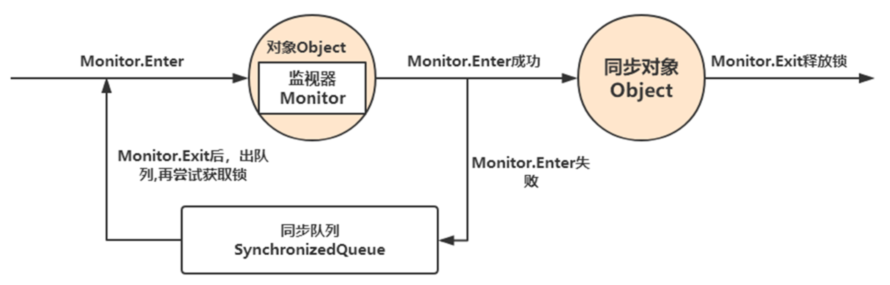

# 并发编程之synchronized 

synchronized :同步的

## **设计同步器的意义**

多线程编程中，有可能会出现多个线程同时访问同一个共享、可变资源的情况，这个资源我们称之其为**临界资源**

**这种资源可能是：对象、变量、文件等。**

> 共享：资源可以由多个线程同时访问 
>
> 可变：资源可以在其生命周期内被修改

**由于线程执行的过程是不可控的，所以需要采用同步机制来协同对对象可变状态的访问！**


## **如何解决线程并发安全问题？**

所有的并发模式在解决线程安全问题时，采用的方案都是**序列化访问临界资源**。即在同一时刻，只能有一个线程访问临界资源，也称作**同步互斥访问**。

Java 中，提供了两种方式来实现同步互斥访问：**synchronized 和 Lock**

**同步器的本质就是加锁**

加锁目的：**序列化访问临界资源**，即同一时刻只能有一个线程访问临界资源 (**同步互斥访问**)

不过有一点需要区别的是：当多个线程执行一个方法时，该方法内部的局部变量并不是临界资源，因为这些局部变量是在每个线程的私有栈中，因此不具有共享性，不会导致线程安全问题。`多个线程执行一个方法不会有线程安全问题`


## **synchronized 原理详解**

synchronized 内置锁是一种**对象锁** (锁的是对象而非引用)，**作用粒度是对象**，可以用来实现对临界资源的同步互斥访问，**是可重入的**。

加锁的方式：

- **同步实例方法，锁是当前实例对象**

- **同步类方法，锁是当前类对象**

- **同步代码块，锁是括号里面的对象**


### **synchronized 底层原理**

​	synchronized 是基于 JVM 内置锁实现，通过内部对象 **Monitor**(监视器锁) 实现，基于进入与退出 Monitor 对象实现方法与代码块同步，监视器锁的实现依赖底层操作系统的 **Mutex lock**（互斥锁）实现，它是一个**重量级锁，性能较低**。当然，JVM 内置锁在 1.5 之后版本做了重大的优化，如锁粗化、锁消除、**轻量锁、偏向锁**、适应性自旋等技术来减少锁操作的开销，内置锁的并发性能已经基本与 Lock 持平。

> Monitor依靠操作系统Mutex互斥量实现，性能很低

​	synchronized 关键字被编译成字节码后会被翻译成 **monitorenter 和 monitorexit** 两条指令分别在同步块逻辑代码的起始位置与结束位置。

​	每个同步对象都有一个自己的 Monitor (监视器锁)，加锁过程如下图所示：`排队获取，失败就到同步队列等待释放，再获取`



### **Monitor 监视器锁**

#### **什么是 monitor？**

可以把它理解为 **一个同步工具**，也可以描述为 **一种同步机制**

它通常被 **描述为一个对象**。与一切皆对象一样，所有的 Java 对象是天生的 Monitor，每一个 Java 对象都有成为 Monitor 的潜质，**因为在 Java 的设计中 ，每一个 Java 对象自打娘胎里出来就带了一把看不见的锁，它叫做内部锁或者 Monitor 锁**。也就是通常说 Synchronized 的对象锁

**MarkWord 锁标识位为 10，其中指针指向的是 Monitor 对象的起始地址**。在 Java 虚拟机（HotSpot）中，**Monitor 是由 ObjectMonitor 实现的**，其主要数据结构如下

```java
ObjectMonitor() {
    _header       = NULL;
    _count        = 0; // 记录个数
    _waiters      = 0,
    _recursions   = 0;
    _object       = NULL;
    _owner        = NULL;
    _WaitSet      = NULL; // 处于wait状态的线程，会被加入到_WaitSet
    _WaitSetLock  = 0 ;
    _Responsible  = NULL ;
    _succ         = NULL ;
    _cxq          = NULL ;
    FreeNext      = NULL ;
    _EntryList    = NULL ; // 处于等待锁block状态的线程，会被加入到该列表
    _SpinFreq     = 0 ;
    _SpinClock    = 0 ;
    OwnerIsThread = 0 ;
  }
```

ObjectMonitor 中有两个队列，**_WaitSet 和 _EntryList**，用来保存 ObjectWaiter 对象列表（ **每个等待锁的线程都会被封装成 ObjectWaiter 对象** ），_owner 指向持有 ObjectMonitor 对象的线程，当多个线程同时访问一段同步代码时：

1. 首先会进入 _EntryList 集合，当线程获取到对象的 monitor 后，进入 _Owner 区域并把 monitor 中的 owner 变量设置为当前线程，同时 monitor 中的计数器 count 加 1；

2. 若线程调用 wait () 方法，将释放当前持有的 monitor，owner 变量恢复为 null，count 自减 1，同时该线程进入 WaitSet 集合中等待被唤醒；

3. 若当前线程执行完毕，也将释放 monitor（锁）并复位 count 的值，以便其他线程进入获取 monitor (锁)；

​	Synchronized 锁便是通过这种方式获取锁的，也是为什么 Java 中任意对象可以作为锁的原因，同时 notify/notifyAll/wait 等方法会使用到 Monitor 锁对象，所以必须在同步代码块中使用。

​	监视器 Monitor 有两种同步方式：**互斥与协作**。多线程环境下线程之间如果需要共享数据，需要解决互斥访问数据的问题，监视器可以确保监视器上的数据在同一时刻只会有一个线程在访问 

> 锁状态是被记录在每个对象的对象头（Mark Word）中


####  monitor工作流程   

任何一个对象都有一个 Monitor 与之关联，当且一个 Monitor 被持有后，它将处于锁定状态。Synchronized 在 JVM 里的实现都是 基于**进入和退出 Monitor 对象**来实现方法同步和代码块同步，虽然具体实现细节不一样，但是都可以通过成对的 MonitorEnter 和 MonitorExit 指令来实现。

- **monitorenter**：每个对象都是一个监视器锁（monitor）。当 monitor 被占用时就会处于锁定状态，**线程执行 monitorenter 指令时尝试获取 monitor 的所有权**

  **过程如下**：

1. **如果 monitor 的进入数为 0**，则该线程进入 monitor，然后将进入数设置为 1，该线程即为 monitor 的所有者；

2. **如果线程已经占有该 monitor**，只是重新进入，则进入 monitor 的进入数加 1；

3. **如果其他线程已经占用了 monitor**，则该线程进入阻塞状态，直到 monitor 的进入数为 0，再重新尝试获取 monitor 的所有权；

- **monitorexit**：执行 monitorexit 的线程必须是 objectref 所对应的 monitor 的所有者。指令执行时，monitor 的进入数减 1，如果减 1 后进入数为 0，那线程退出 monitor，不再是这个 monitor 的所有者。其他被这个 monitor 阻塞的线程可以尝试去获取这个 monitor 的所有权。

**monitorexit，指令出现了两次，第 1 次为同步正常退出释放锁；第 2 次为发生异步退出释放锁**；

**原理：**Synchronized 的语义底层是通过一个 monitor 的对象来完成，其实 wait/notify 等方法也依赖于 monitor 对象，这就是为什么只有在同步的块或者方法中才能调用 wait/notify 等方法，否则会抛出 java.lang.IllegalMonitorStateException 的异常的原因。

> 对于Synchronized 修饰的同步方法，会有一个**ACC_SYNCHRONIZED** 标识符，JVM 就是根据该标示符来实现方法的同步的，原理与monitor 类似

> **JVM 通过调用操作系统的互斥原语 mutex 来实现，被阻塞的线程会被挂起、等待重新调度**，会导致 “用户态和内核态” 两个态之间来回切换，对性能有较大影响


## **锁的膨胀升级过程**

​	锁的状态总共有四种，**无锁状态、偏向锁、轻量级锁和重量级锁**。随着锁的竞争，锁可以从偏向锁升级到轻量级锁，再升级的重量级锁，但是锁的升级是单向的，也就是说只能从低到高升级，不会出现锁的降级。下图为锁的升级全过程：

### 	**偏向锁**

偏向锁的核心思想是，如果一个线程获得了锁，那么锁就进入偏向模式，此时 Mark Word 的结构也变为偏向锁结构，当这个线程再次请求锁时，无需再做任何同步操作，即获取锁的过程，这样就省去了大量有关锁申请的操作，从而也就提供程序的性能。

所以，对于没有锁竞争的场合，偏向锁有很好的优化效果，毕竟极有可能连续多次是同一个线程申请相同的锁。

但是对于锁竞争比较激烈的场合，偏向锁就失效了，因为这样场合极有可能每次申请锁的线程都是不相同的，因此这种场合下不应该使用偏向锁，否则会得不偿失，需要注意的是，偏向锁失败后，并不会立即膨胀为重量级锁，而是先升级为轻量级锁。

### **轻量级锁**

倘若偏向锁失败，虚拟机并不会立即升级为重量级锁，它还会尝试使用一种称为轻量级锁的优化手段，此时 Mark Word 的结构也变为轻量级锁的结构。

轻量级锁能够提升程序性能的依据是 “对绝大部分的锁，在整个同步周期内都不存在竞争”，注意这是经验数据。需要了解的是，轻量级锁所适应的场景是线程交替执行同步块的场合，如果存在同一时间访问同一锁的场合，就会导致轻量级锁膨胀为重量级锁。

### **自旋锁**

基于在大多数情况下，线程持有锁的时间都不会太长，如果直接挂起操作系统层面的线程可能会得不偿失，毕竟操作系统实现线程之间的切换时需要从用户态转换到核心态，这个状态之间的转换需要相对比较长的时间，时间成本相对较高

因此自旋锁会假设在不久将来，当前的线程可以获得锁，因此虚拟机会让当前想要获取锁的线程做几个空循环 (这也是称为自旋的原因)

一般不会太久，在经过若干次循环后，如果得到锁，就顺利进入临界区。如果还不能获得锁，那就会将线程在操作系统层面挂起，这就是自旋锁的优化方式

### **锁消除**

消除锁是虚拟机另外一种锁的优化，这种优化更彻底，Java 虚拟机在 JIT 编译时 (可以简单理解为当某段代码即将第一次被执行时进行编译，又称**即时编译**)，通过对运行上下文的扫描，去除不可能存在共享资源竞争的锁，通过这种方式消除没有必要的锁，可以节省毫无意义的请求锁时间

如 StringBuffer 的 append 是一个同步方法，但是在 add 方法中的 StringBuffer 属于一个局部变量，并且不会被其他线程所使用，因此 StringBuffer 不可能存在共享资源竞争的情景，JVM 会自动将其锁消除。

**锁消除的依据是逃逸分析的数据支持。**