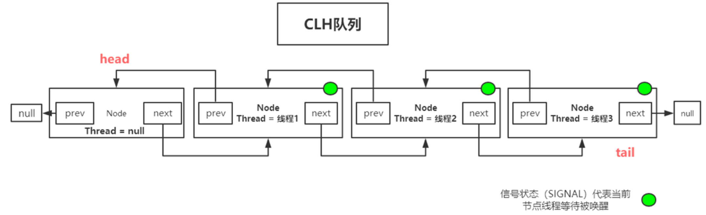
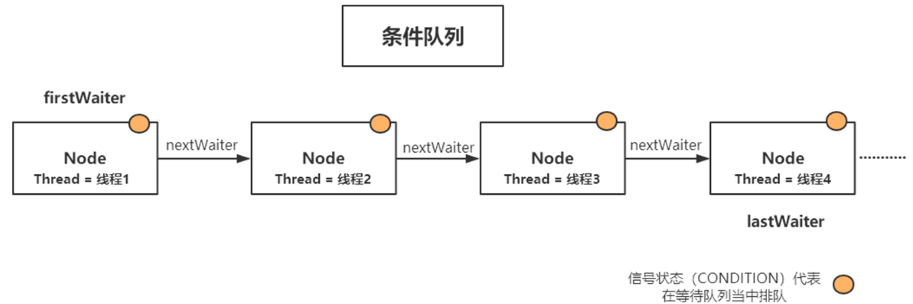

# 并发编程之AQS 

> 面试常说的JUC是什么？
>
> java.util.concurrent  也就是**并发编程中很常用的实用工具类**

​	Java 并发编程核心在于 **java.util.concurrent 包**而 juc 当中的大多数同步器实现都是围绕着共同的基础行为，比如等待队列、条件队列、独占获取、共享获取等，而这个行为的抽象就是基于 **AbstractQueuedSynchronizer** 简称 AQS

​	AQS 定义了一套多线程访问共享资源的同步器框架，是一个依赖状态 (state) 的同步器。 


## **ReentrantLock**

​	ReentrantLock 是一种基于 AQS 框架的应用实现，是 JDK 中的一种线程并发访问的同步手段

​	它的功能类似于 synchronized 是一种互斥锁，可以保证线程安全。而且它具有比 synchronized 更多的特性，比如它支持手动加锁与解锁，支持加锁的公平性。

```java
abstract static class Sync extends AbstractQueuedSynchronizer 
```

```java
使用ReentrantLock进行同步
ReentrantLock lock = new ReentrantLock(false);//false为非公平锁，true为公平锁
lock.lock() //加锁
lock.unlock() //解锁
    
//调用sync内部类的加锁
final void lock() {
   acquire(1);
}
```

> ReentrantLock 如何实现 synchronized 不具备的公平与非公平性呢？
>
> 在 ReentrantLock 内部定义了一个 Sync 的内部类，该类继承 AbstractQueuedSynchronized，对该抽象类的部分方法做了实现；并且还定义了两个子类：
>
> 1、FairSync 公平锁的实现
>
> 2、NonfairSync 非公平锁的实现
>
> 这两个类都继承自 Sync，也就是间接继承了 AbstractQueuedSynchronized，所以这一个 ReentrantLock 同时具备公平与非公平特性。


### lock() 

```java
   //acquire方法实现
public final void acquire(int arg) {
        if (!tryAcquire(arg) &&
            acquireQueued(addWaiter(Node.EXCLUSIVE), arg))
            //中断当前线程的方法。
            selfInterrupt();
    }
```

#### **tryAcquire：ReentrantLock公平锁下尝试获取锁方法**

```java
protected final boolean tryAcquire(int acquires) {
    //获取当前线程引用
    final Thread current = Thread.currentThread();
    int c = getState();
    //state =0 表示没有人持有锁，但是因为是公平锁要看看队列有没有排队
    if (c == 0) {
        //hasQueuedPredecessor看head和tail是否为空
        if (!hasQueuedPredecessors() &&
            //通过cas对state增加
            compareAndSetState(0, acquires)) {
            //设置锁为当前线程持有
            setExclusiveOwnerThread(current);
            return true;
        }
    }
    //查看是否是自己持有锁的情况，是就是重入，对于重入情况，对state++
    else if (current == getExclusiveOwnerThread()) {
        int nextc = c + acquires;
        if (nextc < 0)
            throw new Error("Maximum lock count exceeded");
        setState(nextc);
        return true;
    }
    return false;
}
```

#### addWaiter：对于 tryAcquire 获取锁失败的情况，执行入队

> mode有两种：Node.EXCLUSIVE：独占；SHARED：共享   (semaphore会用到)
> Node的四个重要属性:pre,next,Theard,waitstate  (volatile int waitStatus;)
> waitstate: 当前节点生命状态，信号量 有以下属性
>
> SIGNAL:-1，可被唤醒
>
> CANCELLED:1  出现异常，可能是中断，错误引起，需要被废弃结束 
>
> CONDITION:-2 条件等待
>
> PROPAGATE:-3  传播
>
> 0:初始状态

```java
private Node addWaiter(Node mode) {
    //  将当前线程构建成Node类型
    Node node = new Node(Thread.currentThread(), mode);
    
    Node pred = tail;
    if (pred != null) {
        node.prev = pred;
        if (compareAndSetTail(pred, node)) {
            pred.next = node;
            return node;
        }
    }
    enq(node);
    return node;
}
```

#### enq：当tail为空时为当前线程创建节点，排入队列。

```java
private Node enq(final Node node) {
    for (;;) {
        Node t = tail;
        //先看队列是否为空，队列为空需要初始化，创建空的头节点然后进行下一轮for循环
        if (t == null) { 
            if (compareAndSetHead(new Node()))
                //插入一个新节点让tail和head都指向它，意味着队列初始化完成
                //head -> new Node <- tail
                tail = head;
        } else {
            //不管三七二十一先把node的前驱指向那个初始化后的new Node
            //head,tail-> new Node <- node
            node.prev = t;
            //set尾部节点，入队也存在竞争，用cas的方式把tail指向node
            //head-> new Node <- node <- tail
            if (compareAndSetTail(t, node)) {
                //把newNode的next指向node,形成双向链表
                //head-> new Node <=> node <- tail
                t.next = node;
                return t;
            }
        }
    }
}
```

#### acquireQueued：当tryAcquire获取锁失败且完成入队后，为该线程继续获取锁

```java
final boolean acquireQueued(final Node node, int arg) {
    boolean failed = true;
    try {
        boolean interrupted = false;
        for (;;) {
            //p就是那个线程为空的new Node
            final Node p = node.predecessor();
            //在进入的node为头节点时再获取一次，争取不让线程阻塞
            if (p == head && tryAcquire(arg)) {
                //成功，对结点进行出队
                setHead(node);
                //head -> node（null） <- tail
                p.next = null; // 让gc回收
                failed = false;
                return interrupted;
            }
            //不能获取到，阻塞等待唤醒
            //注意这里是在for循环里的，第一轮会先修改p的waitstate，第二轮才是阻塞线程
            if (shouldParkAfterFailedAcquire(p的, node) &&
                parkAndCheckInterrupt())
                interrupted = true;
        }
    //interrupted 用于获取锁失败后直接进行错误返回不再排队 用于lockInterruptibly()中
    } finally {
        if (failed)
            cancelAcquire(node);
    }
}
	//head-> node(null) <-tail 相当于我当前的node变成了new Node，也就是出队,原来那个new Node会被回收
    private void setHead(Node node) {
        head = node;
        node.thread = null;
        node.prev = null;
    }
```

#### shouldParkAfterFailedAcquire ：不能获取到锁时修改前驱的waitstate，表示当前node可唤醒

```java
    private static boolean shouldParkAfterFailedAcquire(Node pred, Node node) {
        int ws = pred.waitState;
        if (ws == Node.SIGNAL)
           	//如果node前驱的waitstate是-1表示node可被唤醒
            //(上一个节点的waitState指示的是下一个节点的是否可以被唤醒)
            //为什么会有这个waitstate？因为要在循环中保证多线程竞争的情况
            //非公平场景下可能T1修改完了waitstate但是有T3又将锁持有了，要将waitstate改回去保证正常运行
            return true;
        if (ws > 0) {
            //表示出现了异常，跳过这个节点
            do {
                node.prev = pred = pred.prev;
            } while (pred.waitStatus > 0);
            pred.next = node;
        } else {
             //将其设置为SIGNAL状态，然后当前结点才可以可以安全被阻塞
            compareAndSetWaitStatus(pred, ws, Node.SIGNAL);
        }
        return false;
    }
```

#### parkAndCheckInterrupt ：对节点进行阻塞，并且判断线程是否由中断状态唤醒

```java
    private final boolean parkAndCheckInterrupt() {
        //LockSupport.park 底层实现逻辑调用系统内核功能 pthread_mutex_lock 阻塞线程
        LockSupport.park(this);
        //返回阻塞成功的状态true
        return Thread.interrupted();
    }
```


### unlock()

```java
public void unlock() {
    sync.release(1);
}

public final boolean release(int arg) {
    if (tryRelease(arg)) {
        Node h = head;
        //头节点不为空且waitstate表示有可被唤醒的线程
        if (h != null && h.waitStatus != 0)
            unparkSuccessor(h);
        return true;
    }
    return false;
}
```

#### tryRelease：尝试释放锁

```java
protected final boolean tryRelease(int releases) {
    int c = getState() - releases;
    if (Thread.currentThread() != getExclusiveOwnerThread())
        throw new IllegalMonitorStateException();
    boolean free = false;
    if (c == 0) {
        free = true;
        setExclusiveOwnerThread(null);
    }
    setState(c);
    return free;
}
```

#### unparkSuccessor :唤醒阻塞的线程

```java
private void unparkSuccessor(Node node) {
    //注意，这里的node是真正node的前驱节点
    int ws = node.waitStatus;
    if (ws < 0)
        //如果当前节点的等待状态小于0，即表示节点处于等待状态，需要将其等待状态更新为0，即表示未等待。
        compareAndSetWaitStatus(node, ws, 0);
    //获取当前节点的后继节点，也就是真正要唤醒的node
    Node s = node.next;
    if (s == null || s.waitStatus > 0) {
        s = null;
        for (Node t = tail; t != null && t != node; t = t.prev)
            if (t.waitStatus <= 0)
                s = t;
    }
    if (s != null)
        //唤醒
        //注意唤醒线程后可能锁被第三者T3给抢走了！然后在T3的unparkSuccessor中又将waitstate置回了0后面需要T2再改一次
        LockSupport.unpark(s.thread);
}
```


## **AQS 具备特性**

- 阻塞等待队列

- 共享 / 独占

- 公平 / 非公平

- 可重入

- 允许中断

除了 Lock 外，Java.util.concurrent 当中同步器的实现如 Latch,Barrier,BlockingQueue 等，都是基于 AQS 框架实现

> 一般通过定义内部类 Sync 继承 AQS，将同步器所有调用都映射到 Sync 对应的方法

### AQS 内部维护属性 **volatile int state** 

state 表示资源的可用状态

State 三种访问方式：**getState()、setState()、compareAndSetState()**


### **AQS 定义两种资源共享方式**

- Exclusive - 独占，只有一个线程能执行，如 ReentrantLock

- Share - 共享，多个线程可以同时执行，如 Semaphore/CountDownLatch

### AQS 定义两种队列

- 同步等待队列

- 条件等待队列

自定义同步器在实现时只需要实现共享资源 state 的获取与释放方式即可，至于具体线程等待队列的维护，AQS 已经在顶层实现好了。

自定义同步器实现时主要实现以下几种方法：

- isHeldExclusively()：该线程是否正在独占资源。

- tryAcquire(int)：独占方式。尝试获取资源，成功则返回 true，失败则返回 false。

- tryRelease(int)：独占方式。尝试释放资源，成功则返回 true，失败则返回 false。

- tryAcquireShared(int)：共享方式。尝试获取资源。负数表示失败；0 表示成功，但没有剩余可用资源；正数表示成功，且有剩余资源。

- tryReleaseShared(int)：共享方式。尝试释放资源，如果释放后允许唤醒后续等待结点返回 true，否则返回 false。

​	

#### 同步等待队列

​	AQS 当中的同步等待队列也称 CLH 队列，CLH 队列是 Craig、Landin、Hagersten 三人发明的一种基于双向链表数据结构的队列，是 FIFO 先入先出线程等待队列

​	Java 中的 CLH 队列是原 CLH 队列的一个变种，线程由原自旋机制改为阻塞机制。



#### **条件等待队列**

​	Condition 是一个多线程间协调通信的工具类，使得某个，或者某些线程一起等待某个条件（Condition）, 只有当该条件具备时，这些等待线程才会被唤醒，从而重新争夺锁

