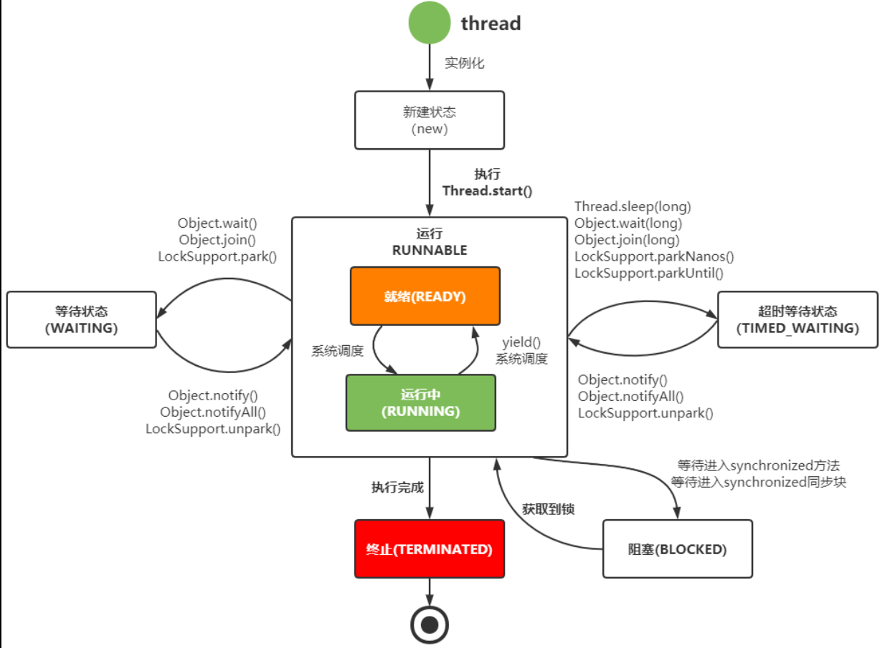
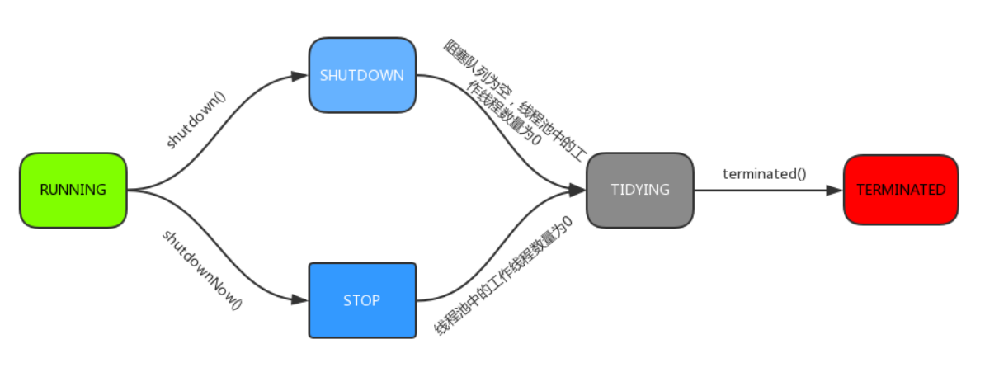
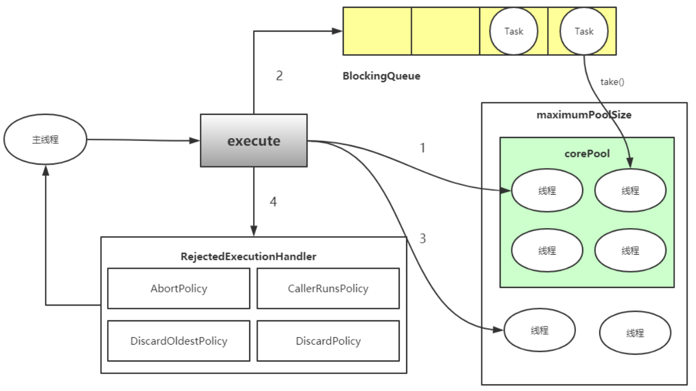
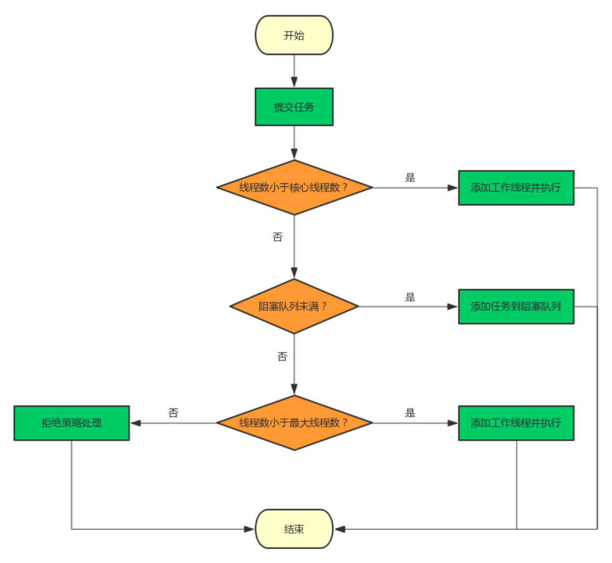
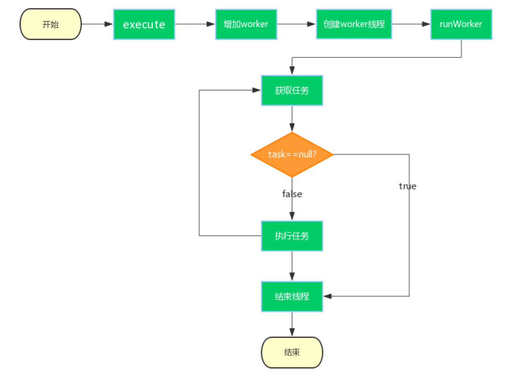

# 并发编程之Executor

## **线程**

线程是调度CPU资源的最小单位，线程模型分为KLT模型与ULT模型，JVM使用的KLT模型，Java线程与OS线程保持1:1的映射关系，也就是说有一个java线程也会在操作系统里有一个对应的线程。Java线程有多种生命状态

> KLT模型 : KLT 是由操作系统内核管理和调度的线程，因此也称为内核线程
>
> ULT模型 ：ULT 是由用户空间的线程库管理和调度的线程，因此也称为用户线程

- **NEW**,新建

- **RUNNABLE**,运行

- **BLOCKED**,阻塞

- **WAITING**,等待

- **TIMED_WAITING**,超时等待

- **TERMINATED**，终结



## **线程池**

​	线程池”，顾名思义就是一个线程缓存，线程是稀缺资源，如果被无限制的创建，不仅会消耗系统资源，还会降低系统的稳定性，因此Java中提供线程池对线程进行统一分配、调优和监控

> ThreadPoolExecutor 默认线程池
>
> ScheduledThreadPoolExecutor 定时线程池

###  **线程池介绍**

在web开发中，服务器需要接受并处理请求，所以会为一个请求来分配一个线程来进行处理。如果每次请求都新创建一个线程的话实现起来非常简便，但是存在一个问题：

**如果并发的请求数量非常多，但每个线程执行的时间很短，这样就会频繁的创建和销毁线程，如此一来会大大降低系统的效率。可能出现服务器在为每个请求创建新线程和销毁线程上花费的时间和消耗的系统资源要比处理实际的用户请求的时间和资源更多**

这就是线程池的目的了。线程池为线程生命周期的开销和资源不足问题提供了解决方案。通过对多个任务重用线程，线程创建的开销被分摊到了多个任务上

什么时候使用线程池？

- 单个任务处理时间比较短

- 需要处理的任务数量很大

线程池优势

- 重用存在的线程，减少线程创建，消亡的开销，提高性能

- 提高响应速度。当任务到达时，任务可以不需要的等到线程创建就能立即执行。

- 提高线程的可管理性。线程是稀缺资源，如果无限制的创建，不仅会消耗系统资源，还会降低系统的稳定性，使用线程池可以进行统一的分配，调优和监控


###  **线程池重点属性**

```java
private final AtomicInteger ctl = new AtomicInteger(ctlOf(RUNNING, 0));
private static final int COUNT_BITS = Integer.SIZE - 3;
private static final int CAPACITY   = (1 << COUNT_BITS) - 1;
```

**ctl** 是对线程池的运行状态和线程池中有效线程的数量进行控制的一个字段， 它包含两部分的信息: 

**线程池的运行状态**  和**线程池内有效线程的数量** 

这里可以看到，使用了Integer类型来保存，高3位保存runState，低29位保存workerCount。COUNT_BITS 就是29，CAPACITY就是1左移29位减1（29个1），这个常量表示workerCount的上限值，大约是5亿

ctl常用方法

```java
private static int runStateOf(int c)     { return c & ~CAPACITY; }
private static int workerCountOf(int c)  { return c & CAPACITY; }
private static int ctlOf(int rs, int wc) { return rs | wc; }
```

- **runStateOf**：获取运行状态；

- **workerCountOf**：获取活动线程数；

- **ctlOf**：获取运行状态和活动线程数的值。

### 五种状态

1. **RUNNING**

- 状态说明：线程池处在RUNNING状态时，能够接收新任务，以及对已添加的任务进行处理。

- 状态切换：线程池的初始化状态是RUNNING。换句话说，线程池被一旦被创建，就处于RUNNING状态，并且线程池中的任务数为0！

2.  **SHUTDOWN**

- 状态说明：线程池处在SHUTDOWN状态时，不接收新任务，但能处理已添加的任务。

- 状态切换：调用线程池的shutdown()接口时，线程池由RUNNING -> SHUTDOWN。

3. **STOP**

- 状态说明：线程池处在STOP状态时，不接收新任务，不处理已添加的任务，并且会中断正在处理的任务。

-  状态切换：调用线程池的shutdownNow()接口时，线程池由(RUNNING or SHUTDOWN ) -> STOP。

4. TIDYING

- 状态说明：当所有的任务已终止，ctl记录的”任务数量”为0，线程池会变为TIDYING状态。当线程池变为TIDYING状态时，会执行钩子函数terminated()。terminated()在ThreadPoolExecutor类中是空的，若用户想在线程池变为TIDYING时，进行相应的处理；可以通过**重载terminated()函数**来实现。

- 状态切换：当线程池在SHUTDOWN状态下，阻塞队列为空并且线程池中执行的任务也为空时，就会由 SHUTDOWN -> TIDYING。 当线程池在STOP状态下，线程池中执行的任务为空时，就会由STOP -> TIDYING。

5. TERMINATED

- 状态说明：线程池彻底终止，就变成TERMINATED状态。

- 状态切换：线程池处在TIDYING状态时，执行完terminated()之后，就会由 TIDYING -> TERMINATED。




## **线程的实现方式**

```java
// 实现Runnable接口的类将被Thread执行，表示一个基本的任务
 public interface Runnable {
 // run方法就是它所有的内容，就是实际执行的任务
 public abstract void run();
 }

 //Callable同样是任务，与Runnable接口的区别在于它接收泛型，同时它执行任务后带有返回内容
 public interface Callable<V> {
 // 相对于run方法的带有返回值的call方法
 V call() throws Exception;
 }
```


## **ThreadPoolExecutor**

### 重要属性

- **corePoolSize**

线程池中的**核心线程数**，当提交一个任务时，线程池创建一个新线程执行任务，**直到当前线程数等于corePoolSize**；如果当前线程数为corePoolSize，**继续提交的任务被保存到阻塞队列**中，等待被执行

>  如果执行了线程池的prestartAllCoreThreads()方法，线程池会提前创建并启动所有核心线程

- **maximumPoolSize**

线程池中允许的**最大线程数**。**如果当前阻塞队列满了，且继续提交任务，则创建新的线程执行任务**，前提是当前线程数小于maximumPoolSize

- **keepAliveTime**

线程池维护线程所**允许的空闲时间**。当线程池中的**线程数量大于corePoolSize**的时候，如果这时没有新的任务提交**，核心线程外的线程不会立即销毁，而是会等待，直到等待的时间超过了keepAliveTime**

- **unit**

keepAliveTime的单位

- **workQueue**

用来保存等待被执行的任务的阻塞队列，且任务必须实现Runable接口，在JDK中提供了如下阻塞队列：

1、ArrayBlockingQueue：基于数组结构的有界阻塞队列，按FIFO排序任务；

2、LinkedBlockingQuene：基于链表结构的阻塞队列，按FIFO排序任务，吞吐量通常要高于ArrayBlockingQuene；

3、SynchronousQuene：一个不存储元素的阻塞队列，每个插入操作必须等到另一个线程调用移除操作，否则插入操作一直处于阻塞状态，吞吐量通常要高于LinkedBlockingQuene；

4、priorityBlockingQuene：具有优先级的无界阻塞队列；

- **threadFactory**

它是ThreadFactory类型的变量，**用来创建新线程**。默认使用Executors.defaultThreadFactory() 来创建线程。使用默认的ThreadFactory来创建线程时，会使新创建的线程具有相同的NORM_PRIORITY优先级并且是非守护线程，同时也设置了线程的名称

- **handler**

线程池的**饱和策略**，当阻塞队列满了，且没有空闲的工作线程，如果继续提交任务，必须采取一种策略处理该任务，线程池提供了4种策略：

1、AbortPolicy：**直接抛出异常，默认策略**；

2、CallerRunsPolicy：用调用者所在的线程来执行任务；

3、DiscardOldestPolicy：丢弃阻塞队列中靠最前的任务，并执行当前任务；

4、DiscardPolicy：直接丢弃任务；

> 上面的4种策略都是ThreadPoolExecutor的内部类。当然也可以根据应用场景实现RejectedExecutionHandler接口，自定义饱和策略，如记录日志或持久化存储不能处理的任务

### **线程池监控**`方法`

- public long getTaskCount()  线程池已执行与未执行的任务总数

- public long getCompletedTaskCount()  已完成的任务数

- public int getPoolSize() 线程池当前的线程数

- public int getActiveCount() 线程池中正在执行任务的线程数量



### **源码分析**

**execute方法**

```java
public void execute(Runnable command) {
    if (command == null)
        throw new NullPointerException();
    int c = ctl.get();
    /*
     * workerCountOf方法取出低29位的值，表示当前活动的线程数；
     * 如果当前活动线程数小于corePoolSize，则新建一个线程放入线程池中；
     * 并把任务添加到该线程中。
     */
    if (workerCountOf(c) < corePoolSize) {
         /*
         * addWorker中的第二个参数表示限制添加线程的数量是根据corePoolSize来判断还是maximumPoolSize来判断；
         * 如果为true，根据corePoolSize来判断；
         * 如果为false，则根据maximumPoolSize来判断
         */
        if (addWorker(command, true))
            return;
        c = ctl.get();
    }
     /*
     * 如果当前线程池是运行状态并且任务添加到队列成功
     */
    if (isRunning(c) && workQueue.offer(command)) {
        // 重新获取ctl值
        int recheck = ctl.get();
        // 再次判断线程池的运行状态，如果不是运行状态，由于之前已经把command添加到workQueue中了，这时需要移除该command
         // 执行过后通过handler使用拒绝策略对该任务进行处理，整个方法返回
        if (! isRunning(recheck) && remove(command))
            reject(command);
         /*
         * 获取线程池中的有效线程数，如果数量是0，则执行addWorker方法
         * 这里传入的参数表示：
         * 1. 第一个参数为null，表示在线程池中创建一个线程，但不去启动；
         * 2. 第二个参数为false，将线程池的有限线程数量的上限设置为maximumPoolSize，添加线程时根据maximumPoolSize来判断；这里表示的非核心线程数的创建
         * 如果判断workerCount大于0，则直接返回，在workQueue中新增的command会在将来的某个时刻被执行。
         */
        else if (workerCountOf(recheck) == 0)
            addWorker(null, false);
    }
    /*
     * 如果执行到这里，有两种情况：
     * 1. 线程池已经不是RUNNING状态；
     * 2. 线程池是RUNNING状态，但workerCount >= corePoolSize并且workQueue已满。
     * 这时，再次调用addWorker方法，但第二个参数传入为false，将线程池的有限线程数量的上限设置为maximumPoolSize；
     * 如果失败则拒绝该任务
     */
    else if (!addWorker(command, false))
        reject(command);
}
```

简单来说，在执行execute()方法时如果状态一直是RUNNING时，的执行过程如下：

1. 如果**workerCount < corePoolSize**，则创建并启动一个线程来执行新提交的任务；

2. 如果**workerCount >= corePoolSize**，且线程池内的阻塞队列未满，则将任务添加到该阻塞队列中；

3. 如 果 **workerCount >= corePoolSize && workerCount <maximumPoolSize**，且线程池内的阻塞队列已满，则创建并启动一个线程来执行新提交的任务；

4. 如果**workerCount >= maximumPoolSize**，并且线程池内的阻塞队列已满, 则根据拒绝策略来处理该任务, 默认的处理方式是直接抛异常。这里要注意一下addWorker(null, false);，也就是创建一个线程，但并没有传入任务，因为任务已经被添加到workQueue中了，所以worker在执行的时候，会直接从workQueue中获取任务。所以，在workerCountOf(recheck) == 0时执行addWorker(null, false);也是为了保证线程池在RUNNING状态下必须要有一个线程来执行任务。



**addWorker方法**

addWorker方法的主要工作是在线程池中创建一个新的线程并执行，firstTask参数 用于指定新增的线程执行的第一个任务，core参数为true表示在新增线程时会判断当前活动线程数是否少于corePoolSize，false表示新增线程前需要判断当前活动线程数是否少于maximumPoolSize

```java
private boolean addWorker(Runnable firstTask, boolean core) {
    retry: //第一个循环点
    for (;;) {
        int c = ctl.get();
        int rs = runStateOf(c);  // 获取运行状态
        /*
         * 这个if判断
         * 如果rs >= SHUTDOWN，则表示此时不再接收新任务；
         * 接着判断以下3个条件，只要有1个不满足，则返回false：
         */
        if (rs >= SHUTDOWN &&
            //1. rs == SHUTDOWN，这时表示关闭状态，不再接受新提交的任务，但却可以继续处理阻塞队列中已保存的任务
            ! (rs == SHUTDOWN &&
               //firsTask为空
               firstTask == null &&
               //阻塞队列不为空
               ! workQueue.isEmpty()))
            return false;

        for (;;) {
            int wc = workerCountOf(c); // 获取线程数
            // 如果wc超过CAPACITY，也就是ctl的低29位的最大值（二进制是29个1），返回false；
            if (wc >= CAPACITY ||
                // 这里的core是addWorker方法的第二个参数，如果为true表示根据corePoolSize来比较，如果为false则根据maximumPoolSize来比较。
                wc >= (core ? corePoolSize : maximumPoolSize))
                return false;
            // 尝试增加workerCount，如果成功，则跳出第一个for循环
            if (compareAndIncrementWorkerCount(c))
                break retry;
            c = ctl.get();  
            // 如果当前的运行状态不等于rs，说明状态已被改变，返回第一个for循环继续执行
            if (runStateOf(c) != rs)
                continue retry;
        }
    }

    boolean workerStarted = false;
    boolean workerAdded = false;
    Worker w = null;
    try {
        w = new Worker(firstTask);  // 根据firstTask来创建Worker对象
        final Thread t = w.thread;  //每一个Worker对象都会创建一个线程
        if (t != null) {
            final ReentrantLock mainLock = this.mainLock;
            mainLock.lock();
            try {
                int rs = runStateOf(ctl.get());
                 // rs < SHUTDOWN表示是RUNNING状态；
                 // 如果rs是RUNNING状态或者rs是SHUTDOWN状态并且firstTask为null，向线程池中添加线程。
                 // 因为在SHUTDOWN时不会在添加新的任务，但还是会执行workQueue中的任务
                if (rs < SHUTDOWN ||
                    (rs == SHUTDOWN && firstTask == null)) {
                    if (t.isAlive()) 
                        throw new IllegalThreadStateException();
                    workers.add(w);
                    int s = workers.size();
                    if (s > largestPoolSize)
                        largestPoolSize = s;
                    workerAdded = true;
                }
            } finally {
                mainLock.unlock();
            }
            if (workerAdded) {
                t.start(); // 启动线程
                workerStarted = true;
            }
        }
    } finally {
        if (! workerStarted)
            addWorkerFailed(w);
    }
    return workerStarted;
}
```

## **Worker类**

线程池中的每一个线程被封装成一个Worker对象，ThreadPool维护的其实就是一组Worker对象，请参见JDK源码。

Worker类继承了AQS，并实现了Runnable接口，注意其中的firstTask和thread属性：firstTask用它来保存传入的任务；thread是在调用构造方法时通过ThreadFactory来创建的线程，是用来处理任务的线程。

在调用构造方法时 ， 需要把任务传入 ，这里通过getThreadFactory().newThread(this);来新建一个线程，newThread方法传入的参数是

this，因为Worker本身继承了Runnable接口，也就是一个线程，所以一个Worker对象在启动的时候会调用Worker类中的run方法。

**Worker继承了AQS，使用AQS来实现独占锁的功能。**

为什么不使用ReentrantLock来实现呢？可以看到tryAcquire方法，它是不允许重入的，而ReentrantLock是允许重入的：

1. lock方法一旦获取了独占锁，表示当前线程正在执行任务中；

2. 如果正在执行任务，则不应该中断线程；

3. 如果该线程现在不是独占锁的状态，也就是空闲的状态，说明它没有在处理任务，这时可以对该线程进行中断；

4. 线程池在执行shutdown方法或tryTerminate方法时会调用interruptIdleWorkers方法来中断空闲的线程，interruptIdleWorkers方法会使用tryLock方法来判断线程池中的线程是否是空闲状态；

5. 之所以设置为不可重入，是因为我们不希望任务在调用像setCorePoolSize这样的线程池控制方法时重新获取锁。如果使用ReentrantLock，它是可重入的，这样如果在任务中调用了如setCorePoolSize这类线程池控制的方法，会中断正在运行的线程。

所以，Worker继承自AQS，用于判断线程是否空闲以及是否可以被中断。

此外，在构造方法中执行了setState(-1);，把state变量设置为-1，为什么这么做呢？是因为AQS中默认的state是0，如果刚创建了一个Worker对象，还没有执行任务时，这时就不应该被中断，看一下tryAquire方法：

```java
protected boolean tryAcquire(int unused) {
 //cas修改state，不可重入
if (compareAndSetState(0, 1)) {
	setExclusiveOwnerThread(Thread.currentThread());
 	return true;
 }
 return false;
}
```

tryAcquire方法是根据state是否是0来判断的，所以，setState(-1);将state设置为-1是为了禁止在执行任务前对线程进行中断。

正因为如此，在runWorker方法中会先调用Worker对象的unlock方法将state设置为0。

### **runWorker方法**

在Worker类中的run方法调用了runWorker方法来**执行任务**，runWorker方法的代码如下：

```java
final void runWorker(Worker w) {
    Thread wt = Thread.currentThread();
    Runnable task = w.firstTask;
    w.firstTask = null;
    w.unlock(); // allow interrupts
    boolean completedAbruptly = true;
    try {
        //while循环不断地通过getTask()方法获取任务
        while (task != null || (task = getTask()) != null) {
            w.lock();
            //runStateAtLeast(ctl.get(), STOP) 这部分判断当前线程池的运行状态是否至少是 STOP
            //如果线程池正在停止(stop)，那么要保证当前线程是中断状态；如果不是的话，则要保证当前线程不是中断状态；
            //这里要考虑在执行该if语句期间可能也执行了shutdownNow方法，shutdownNow方法会把状态设置为STOP，回顾一下STOP状态：
            //不能接受新任务，也不处理队列中的任务，会中断正在处理任务的线程。在线程池处于RUNNING 或 SHUTDOWN 状态时，调用 shutdownNow() 方法会使线程池进入到该状态
            if ((runStateAtLeast(ctl.get(), STOP) ||
                 (Thread.interrupted() &&
                  runStateAtLeast(ctl.get(), STOP))) && !wt.isInterrupted())
                wt.interrupt();
            try {
                beforeExecute(wt, task);
                Throwable thrown = null;
                try {
                    //调用task.run()执行任务
                    task.run();
                } catch (RuntimeException x) {
                    thrown = x; throw x;
                } catch (Error x) {
                    thrown = x; throw x;
                } catch (Throwable x) {
                    thrown = x; throw new Error(x);
                } finally {
                    afterExecute(task, thrown);
                }
            } finally {
                task = null;
                w.completedTasks++;
                w.unlock();
            }
        }
        //completedAbruptly 变量来表示在执行任务过程中是否出现了异常,在processWorkerExit方法中会对该变量的值进行判断
        completedAbruptly = false;
    } finally {
        //如果task为null则跳出循环，执行processWorkerExit()方法
        processWorkerExit(w, completedAbruptly);
    }
}
```

### **getTask方法**

getTask方法用来从阻塞队列中取任务，代码如下

```java
private Runnable getTask() {
    //// timeOut变量的值表示上次从阻塞队列中取任务时是否超时
    boolean timedOut = false; 

    for (;;) {
        int c = ctl.get();
        int rs = runStateOf(c);
        /*
         * 如果线程池状态rs >= SHUTDOWN，也就是非RUNNING状态，再进行以下判断：
         * 1. rs >= STOP，线程池是否正在stop；
         * 2. 阻塞队列是否为空。
         * 如果以上条件满足，则将workerCount减1并返回null。
         * 因为如果当前线程池状态的值是SHUTDOWN或以上时，不允许再向阻塞队列中添加任务。
         */
        if (rs >= SHUTDOWN && (rs >= STOP || workQueue.isEmpty())) {
            decrementWorkerCount();
            return null;
        }

        int wc = workerCountOf(c);

        // timed变量用于判断是否需要进行超时控制。
        // allowCoreThreadTimeOut默认是false，也就是核心线程不允许进行超时；
        // wc > corePoolSize，表示当前线程池中的线程数量大于核心线程数量；
        // 对于超过核心线程数量的这些线程，需要进行超时控制
        boolean timed = allowCoreThreadTimeOut || wc > corePoolSize;
        /*
         * wc > maximumPoolSize的情况是因为可能在此方法执行阶段同时执行了setMaximumPoolSize方法；
         * timed && timedOut 如果为true，表示当前操作需要进行超时控制，并且上次从阻塞队列中获取任务发生了超时
         * 接下来判断，如果有效线程数量大于1，或者阻塞队列是空的，那么尝试将workerCount减1；
         * 如果减1失败，则返回重试。
         * 如果wc == 1时，也就说明当前线程是线程池中唯一的一个线程了。
         */
        if ((wc > maximumPoolSize || (timed && timedOut))
            && (wc > 1 || workQueue.isEmpty())) {
            if (compareAndDecrementWorkerCount(c))
                return null;
            continue;
        }

        try {
            /*
             * 根据timed来判断，如果为true，则通过阻塞队列的poll方法进行超时控制，如果在keepAliveTime时间内没有获取到任务，则返回null；
             * 否则通过take方法，如果这时队列为空，则take方法会阻塞直到队列不为空。
             */
            Runnable r = timed ?
                workQueue.poll(keepAliveTime, TimeUnit.NANOSECONDS) :
                workQueue.take();
            // 如果 r == null，说明已经超时，timedOut设置为true
            if (r != null)
                return r;
            timedOut = true;
        } catch (InterruptedException retry) {
            // 如果获取任务时当前线程发生了中断，则设置timedOut为false并返回循环重试
            timedOut = false;
        }
    }
}
```

这里重要的地方是第二个if判断，目的是控制线程池的有效线程数量

**由上文中的分析可以知道，在执行execute方法时，如果当前线程池的线程数量超过了corePoolSize且小于maximumPoolSize，并且workQueue已满时，则可以增加工作线程，但这时如果超时没有获取到任务，也就是timedOut为true的情况，说明workQueue已经为空了，也就说明了当前线程池中不需要那么多线程来执行任务了，可以把多于corePoolSize数量的线程销毁掉，保持线程数量在corePoolSize即可。**

什么时候会销毁？当然是runWorker方法执行完之后，也就是Worker中的run方法执行完，由JVM自动回收。

getTask方法返回null时，在runWorker方法中会跳出while循环，然后会执行processWorkerExit方法


### **processWorkerExit方法**

```java
private void processWorkerExit(Worker w, boolean completedAbruptly) {
    // 如果completedAbruptly值为true，则说明线程执行时出现了异常，需要将workerCount减1；
 // 如果线程执行时没有出现异常，说明在getTask()方法中已经已经对workerCount进行了减1操作，这里就不必再减了。
    if (completedAbruptly) 
        decrementWorkerCount();

    final ReentrantLock mainLock = this.mainLock;
    mainLock.lock();
    try {
        //统计完成的任务数
        completedTaskCount += w.completedTasks;
        // 从workers中移除，也就表示着从线程池中移除了一个工作线程
        workers.remove(w);
    } finally {
        mainLock.unlock();
    }
	// 根据线程池状态进行判断是否结束线程池
    tryTerminate();

    int c = ctl.get();
    /*
     * 当线程池是RUNNING或SHUTDOWN状态时，如果worker是异常结束，那么会直接addWorker；
     * 如果allowCoreThreadTimeOut=true，并且等待队列有任务，至少保留一个worker；
     * 如果allowCoreThreadTimeOut=false，workerCount不少于corePoolSize。
     */
    if (runStateLessThan(c, STOP)) {
        if (!completedAbruptly) {
            int min = allowCoreThreadTimeOut ? 0 : corePoolSize;
            if (min == 0 && ! workQueue.isEmpty())
                min = 1;
            if (workerCountOf(c) >= min)
                return; // replacement not needed
        }
        addWorker(null, false);
    }
}
```

至此，processWorkerExit执行完之后，工作线程被销毁，以上就是整个工作线程的生命周期，从execute方法开始，Worker使用ThreadFactory创建新的工作线程，runWorker通过getTask获取任务，然后执行任务，如果getTask返回null，进入processWorkerExit方法，整个线程结束，如图所示

