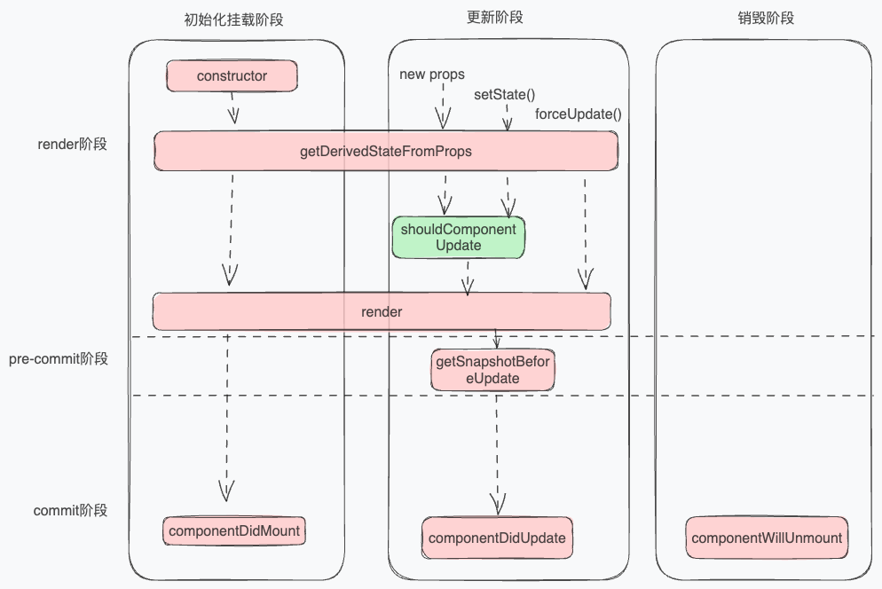

# React Hooks 中的生命周期

函数组件本质是函数，并不存在生命周期的概念。但是可以利用 Hooks 模拟实现生命周期。

先了解下类组件写法中的生命周期。

## 类组件中的生命周期

React 中有俩个重要阶段，render 阶段和 commit 阶段。

- render 阶段：深度遍历 fiber 树，发现不同的节点，对于需要变化的组件，就会执行 render 函数。
- commit 阶段：commit 阶段会创建修改真实的 DOM 节点。细分为`before Mutation`( DOM 修改前)，`Mutation` ( DOM 修改)，`Layout`( DOM 修改后) 三个阶段。

同时，生命周期的执行分为初始化挂载、更新、销毁三大阶段。流程图如下：

> 该流程图示基于 React16.3 版本后。



---

在 render 阶段，对于 fiber tag = 1 类组件的情况，源码的处理是：

```js
function updateClassComponent() {
  // 用于标记组件是否需要更新
  let shouldUpdate;
  // workInProgress是React在渲染过程中用来跟踪当前正在工作的Fiber节点的对象。stateNode 是 fiber 指向 类组件实例的指针。
  const instance = workInProgress.stateNode;
  if (instance === null) {
    // instance 为组件实例,如果组件实例不存在，证明该类组件没有被挂载过，那么会走初始化流程
    //组件实例将在这个方法中被new。
    constructClassInstance(workInProgress, Component, nextProps);
    //初始化挂载组件流程
    mountClassInstance(
      workInProgress,
      Component,
      nextProps,
      renderExpirationTime,
    );
    shouldUpdate = true;
  } else {
    // 更新组件流程
    shouldUpdate = updateClassInstance(
      current,
      workInProgress,
      Component,
      nextProps,
      renderExpirationTime,
    );
  }
  if (shouldUpdate) {
    nextChildren = instance.render(); /* 执行render函数 ，得到子节点 */
    reconcileChildren(
      current,
      workInProgress,
      nextChildren,
      renderExpirationTime,
    ); /* 继续调和子节点 */
  }
}
```

React 的大部分生命周期的执行，都在 `mountClassInstance` 和`updateClassInstance` 这两个方法中执行。

### 初始化阶段

- constructor 执行：`constructClassInstance`函数中执行，new 一个组件实例。接着调用`mountClassInstance`函数进行初始化挂载组件。

```js
function mountClassInstance(
  workInProgress,
  ctor,
  newProps,
  renderExpirationTime,
) {
  const instance = workInProgress.stateNode;
  const getDerivedStateFromProps = ctor.getDerivedStateFromProps;
  if (typeof getDerivedStateFromProps === 'function') {
    // ctor 就是我们写的类组件，获取类组件的静态方法
    const partialState = getDerivedStateFromProps(nextProps, prevState); // 这个时候执行 getDerivedStateFromProps 生命周期 ，得到将合并的state
    const memoizedState =
      partialState === null || partialState === undefined
        ? prevState
        : Object.assign({}, prevState, partialState); // 合并state
    workInProgress.memoizedState = memoizedState;
    instance.state = workInProgress.memoizedState; //将state 赋值给我们实例上，instance.state  就是我们在组件中 this.state获取的state
  }
  // 这里是为了兼容旧版react，在16.3版本后，componentWillMount就已经被废弃。
  if (
    typeof ctor.getDerivedStateFromProps !== 'function' &&
    typeof instance.getSnapshotBeforeUpdate !== 'function' &&
    typeof instance.componentWillMount === 'function'
  ) {
    instance.componentWillMount(); //当 getDerivedStateFromProps 和 getSnapshotBeforeUpdate 不存在的时候 ，执行 componentWillMount*/
  }
}
```

- getDerivedStateFromProps 执行：根据 props 和 state 计算出新的 state。

- componentWillMount 执行

- render 函数执行

- componentDidMount 执行：这是 commit 阶段时执行。

所以在初始化阶段，类组件的生命周期：constructor ——>getDerivedStateFromProps / componentWillMount ——>Render ——>componentDidMount。

### 更新阶段

```js
function updateClassInstance(
  current,
  workInProgress,
  ctor,
  newProps,
  renderExpirationTime,
) {
  const instance = workInProgress.stateNode; // 类组件实例
  const hasNewLifecycles = typeof ctor.getDerivedStateFromProps === 'function'; // 判断是否具有 getDerivedStateFromProps 生命周期
  if (
    !hasNewLifecycles &&
    typeof instance.componentWillReceiveProps === 'function'
  ) {
    if (oldProps !== newProps || oldContext !== nextContext) {
      // 浅比较 props 不相等
      instance.componentWillReceiveProps(newProps, nextContext); // 执行生命周期 componentWillReceiveProps
    }
  }
  let newState = (instance.state = oldState);
  if (hasNewLifecycles) {
    ctor.getDerivedStateFromProps(
      nextProps,
      prevState,
    ); /* 执行生命周期getDerivedStateFromProps  ，逻辑和mounted类似 ，合并state  */
    newState = workInProgress.memoizedState;
  }
  let shouldUpdate = true;
  if (typeof instance.shouldComponentUpdate === 'function') {
    /* 执行生命周期 shouldComponentUpdate 返回值决定是否执行render ，调和子节点 */
    shouldUpdate = instance.shouldComponentUpdate(
      newProps,
      newState,
      nextContext,
    );
  }
  if (shouldUpdate) {
    if (typeof instance.componentWillUpdate === 'function') {
      instance.componentWillUpdate(); /* 执行生命周期 componentWillUpdate  */
    }
  }
  return shouldUpdate;
}
```

- componentWillReceiveProps 执行：判断是否存在 getDerivedStateFromProps，不存在执行 componentWillReceiveProps。
- getDerivedStateFromProps 执行：存在 getDerivedStateFromProps，就执行 getDerivedStateFromProps。
- shouldComponentUpdate 执行
- componentWillUpdate 执行
- render 函数执行
- 执行 getSnapshotBeforeUpdate：发生在 commit 阶段的`before Mutation`( DOM 修改前)阶段，生命周期的返回值，将作为第三个参数 \_\_reactInternalSnapshotBeforeUpdate 传递给 componentDidUpdate 。主要用途是在组件的 DOM 更新之前获取一些信息，这些信息可以用于在组件更新后的某个时刻使用。这个方法在某些特定的情况下非常有用，例如当你需要在组件更新后执行一些操作，这些操作依赖于组件更新前的 DOM 状态。
- 执行 componentDidUpdate

执行流程：componentWillReceiveProps/getDerivedStateFromProps——>shouldComponentUpate——>componentWillUpate——>render——>getSnapshotBeforeUpdate——>componentDidUpdate

### 销毁阶段

- componentWillUnmount 执行

---

分析完更新、执行、销毁阶段的生命周期，其中会发现在初始化阶段有 getDerivedStateFromProps / componentWillMount，和在更新阶段有 componentWillReceiveProps/getDerivedStateFromProps，俩种情况。

这是因为在 react16.3 之后，引用了 fiber 架构，用 getDerivedStateFromProps 取代了 componentWillMount、componentWillReceiveProps，使得能异步渲染。

同时用 getSnapshotBeforeUpdate 取代了 componentWillUpdate。

即在引入 fiber 架构后，生命周期为：

- 初始化挂载阶段：constructor、getDerivedStateFromProps、render、componentDidMount
- 更新阶段：getDerivedStateFromProps、shouldComponentUpdate、render、getSnapshotBeforeUpdate、componentDidUpdate

- 卸载阶段：componentWillUnmount

### hooks 与类组件生命周期的对应

初始化阶段

- constructor：useState 中的 state
- getDerivedStateFromProps：useState 中 upDate 函数
- render：函数本身
- componendDidMount：useEffect()

更新阶段：

- getDerivedStateFromProps：useState 中 upDate 函数
- shouldComponentUpdate：useMemo
- componentDidUpdate：useEffect()

卸载阶段：

- componentWillUnmount：useEffect()中的 return 函数
