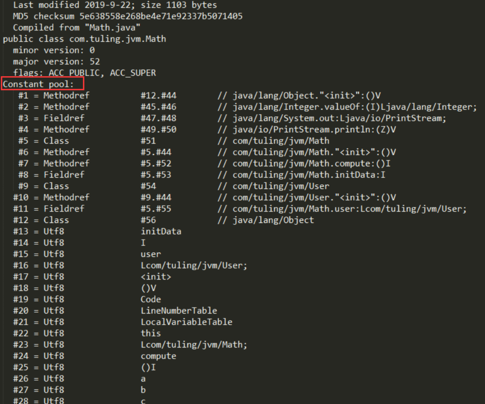
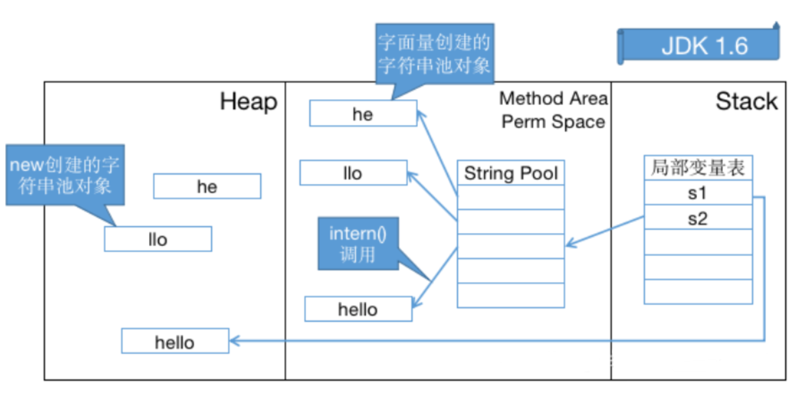
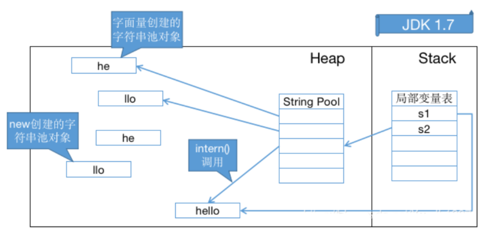

# 常量池详解

## Class 常量池

Class 常量池可以理解为是 Class 文件中的资源仓库。 Class 文件中除了包含类的版本、字段、方法、接口等描述信息外，还有一项信息就是**常量池 (constant pool table)**，用于存放编译期生成的各种**字面量 (Literal) 和符号引用 (Symbolic References)**。

我们一般可以通过 javap 命令生成可读的 JVM 字节码指令文件：

运行**javap -v Math.class**



红框标出的就是 class 常量池信息，常量池中主要存放两大类常量：**字面量和符号引用**。

### **字面量**

**字面量就是指由字母、数字等构成的字符串或者数值常量**

字面量只可以右值出现，所谓右值是指等号右边的值，如：int a=1 这里的 a 为左值，1 为右值。在这个例子中 1 就是字面量。

```java
int a = 1;
int b = 2;
int c = "abcdefg";
int d = "abcdefg";
```


### **符号引用**

符号引用是编译原理中的概念，是相对于直接引用来说的。主要包括了以下三类常量：

- 类和接口的全限定名 

- 字段的名称和描述符 

- 方法的名称和描述符

上面的 a，b 就是字段名称，就是一种符号引用，还有 Math 类常量池里的 Lcom/tuling/jvm/Math 是类的全限定名，main 和 compute 是方法名称，() 是一种 UTF8 格式的描述符，**这些都是符号引用**。

这些常量池现在是静态信息，只有到运行时被加载到内存后，这些符号才有对应的内存地址信息，这些常量池一旦被装入内存就变成**运行时常量池**，对应的符号引用在程序加载或运行时会被转变为被加载到内存区域的代码的直接引用，也就是我们说的动态链接了。

例如，compute () 这个符号引用在**运行时就会被转变为 compute () 方法具体代码在内存中的地址**，主要通过**对象头里的类型指针**去转换直接引用。


## **字符串常量池** （对象池）

### **字符串常量池的设计思想**

- 字符串的分配，和其他的对象分配一样，耗费高昂的时间与空间代价，作为最基础的数据类型，大量频繁的创建字符串，极大程度地影响程序的性能

- JVM 为了提高性能和减少内存开销，在实例化字符串常量的时候进行了一些优化

应用过程：

1. 为字符串开辟一个字符串常量池，类似于缓存区

2. 创建字符串常量时，首先查询字符串常量池是否存在该字符串

3. 存在该字符串，返回引用实例，不存在，实例化该字符串并放入池中

> 有点类似一个缓存。有我就获取，没有我就创建一份


### **三种字符串操作**

- 直接赋值字符串

```java
String s = "xxx";  // s指向常量池中的引用
```

这种方式创建的字符串对象，**只会在常量池中**

因为有 "xxx" 这个字面量，创建对象 s 的时候，JVM 会先去常量池中通过 equals (key) 方法，判断是否有相同的对象

如果有，则直接返回该对象在常量池中的引用；

如果没有，则会在常量池中创建一个新对象，再返回引用。

- new String();

```java
String s1 = new String("xxx");  // s1指向内存中的对象引用
```

这种方式会保证字符串常量池和堆中都有这个对象，没有就创建，最后**返回堆内存中的对象引用**。

步骤大致如下：

因为有 "xxx" 这个字面量，所以会先检查字符串常量池中是否存在字符串 "xxx"

不存在，先在字符串常量池里创建一个字符串对象；**再去内存中创建一个字符串对象** "xxx"；

存在的话，就直接去堆内存中创建一个字符串对象 "xxx"；

最后，将内存中的引用返回。

- intern 方法

```java
String s1 = new String("xxx");   
String s2 = s1.intern();
System.out.println(s1 == s2);  //false
```

String 中的 intern 方法是一个 native 的方法，当调用 intern 方法时，如果池已经包含一个等于此 String 对象的字符串（用 equals (oject) 方法确定），则返回池中的字符串。**否则，将 intern 返回的引用指向当前字符串 s1**


###  **字符串常量池位置**

Jdk1.6 及之前： 有永久代，运行时常量池在永久代，运行时常量池包含字符串常量池

Jdk1.7：有永久代，但已经逐步 “去永久代”，字符串常量池从永久代里的运行时常量池分离到堆里

Jdk1.8 及之后： 无永久代，运行时常量池在元空间，字符串常量池里依然在堆里

**字符串常量池设计原理**

　　字符串常量池底层是 hotspot 的 C++ 实现的，底层类似一个 HashTable， 保存的本质上是字符串对象的引用。

看一道比较常见的面试题，下面的代码创建了多少个 String 对象？

```java
String s1 = new String("he") + new String("llo");
String s2 = s1.intern();
 
System.out.println(s1 == s2);
// 在 JDK 1.6 下输出是 false，创建了 6 个对象
// 在 JDK 1.7 及以上的版本输出是 true，创建了 5 个对象
// 当然我们这里没有考虑GC，但这些对象确实存在或存在过
```

为什么输出会有这些变化呢？主要还是字符串池从永久代中脱离、移入堆区的原因， intern () 方法也相应发生了变化：

1、在 JDK 1.6 中，调用 intern () 首先会在字符串池中寻找 equal () 相等的字符串，假如字符串存在就返回该字符串在字符串池中的引用；假如字符串不存在，虚拟机会重新在永久代上创建一个实例，将 StringTable 的一个表项指向这个新创建的实例。



2、在 JDK 1.7 (及以上版本) 中，由于字符串池不在永久代了，intern () 做了一些修改，更方便地利用堆中的对象。字符串存在时和 JDK 1.6 一样，但是字符串不存在时不再需要重新创建实例，可以直接指向堆上的实例。



　　由上面两个图，也不难理解为什么 JDK 1.6 字符串池溢出会抛出 OutOfMemoryError: PermGen space ，而在 JDK 1.7 及以上版本抛出 OutOfMemoryError: Java heap space 。


### **String 常量池问题的几个例子**

示例 1：

```java
String s0="chen";
String s1="chen";
String s2="ch" + "en";
System.out.println( s0==s1 ); //true
System.out.println( s0==s2 ); //true
```

分析：因为例子中的 s0 和 s1 中的”chen” 都是字符串常量，它们在编译期就被确定了，所以 s0==s1 为 true；而”ch” 和”en” 也都是字符串常量，当一个字 符串由多个字符串常量连接而成时，它自己肯定也是字符串常量，所以 s2 也同样在编译期就被优化为一个字符串常量 "chen"，所以 s2 也是常量池中” chen” 的一个引用。所以我们得出 s0==s1==s2；


示例 2：

```java
String s0="chen";
String s1=new String("chen");
String s2="ch" + new String("en");
System.out.println( s0==s1 );　　// false
System.out.println( s0==s2 )；　 // false
System.out.println( s1==s2 );　　// false
```

分析：用 new String () 创建的字符串不是常量，不能在编译期就确定，所以 new String () 创建的字符串不放入常量池中，它们有自己的地址空间。

s0 还是常量池 中 "chen” 的引用，s1 因为无法在编译期确定，所以是运行时创建的新对象”chen” 的引用，s2 因为有后半部分 new String (”en”) 所以也无法在编译期确定，所以也是一个新创建对象”chen” 的引用；明白了这些也就知道为何得出此结果了。


示例 3：

```java
  String a = "a1";
  String b = "a" + 1;
  System.out.println(a == b); // true 
  
  String a = "atrue";
  String b = "a" + "true";
  System.out.println(a == b); // true 
  
  String a = "a3.4";
  String b = "a" + 3.4;
  System.out.println(a == b); // true
```

分析：JVM 对于字符串常量的 "+" 号连接，将在程序编译期，JVM 就将常量字符串的 "+" 连接优化为连接后的值，拿 "a" + 1 来说，经编译器优化后在 class 中就已经是 a1。在编译期其字符串常量的值就确定下来，故上面程序最终的结果都为 true。


示例 4：

```java
String a = "ab";
String bb = "b";
String b = "a" + bb;
 
System.out.println(a == b); // false
```

分析：JVM 对于字符串引用，由于在字符串的 "+" 连接中，有字符串引用存在，而引用的值在程序编译期是无法确定的，即 "a" + bb 无法被编译器优化，只有在程序运行期来动态分配并将连接后的新地址赋给 b。所以上面程序的结果也就为 false。


示例 5：

```java
String a = "ab";
final String bb = "b";
String b = "a" + bb;
 
System.out.println(a == b); // true
```

分析：和示例 4 中唯一不同的是 bb 字符串加了 final 修饰，对于 final 修饰的变量，它在编译时被解析为常量值的一个本地拷贝存储到自己的常量池中或嵌入到它的字节码流中。所以此时的 "a" + bb 和 "a" + "b" 效果是一样的。故上面程序的结果为 true。


示例 6：

```java
String a = "ab";
final String bb = getBB();
String b = "a" + bb;
 
System.out.println(a == b); // false
 
private static String getBB() 
{  
    return "b";  
 }
```

分析：JVM 对于字符串引用 bb，它的值在编译期无法确定，只有在程序运行期调用方法后，将方法的返回值和 "a" 来动态连接并分配地址为 b，故上面 程序的结果为 false。


### **关于 String 是不可变的**

​    通过上面例子可以得出得知：

```
String  s  =  "a" + "b" + "c";  //就等价于String s = "abc";
String  a  =  "a";
String  b  =  "b";
String  c  =  "c";
String  s1  =   a  +  b  +  c;
```

 s1 这个就不一样了，可以通过观察其 **JVM 指令码**发现 s1 的 "+" 操作会变成如下操作：

```java
StringBuilder temp = new StringBuilder();
temp.append(a).append(b).append(c);
String s = temp.toString();
```


## **八种基本类型的包装类和对象池**

**java 中基本类型的包装类的大部分都实现了常量池技术 (严格来说应该叫对象池，在堆上)**

这些类是 Byte,Short,Integer,Long,Character,Boolean, 另外两种浮点数类型的包装类则没有实现。另外 Byte,Short,Integer,Long,Character 这 5 种整型的包装类也只是在对应值小于等于 127 时才可使用对象池，也即对象不负责创建和管理大于 127 的这些类的对象。因为一般这种比较小的数用到的概率相对较大。

```java
public class Test {
 
    public static void main(String[] args) {
        //5种整形的包装类Byte,Short,Integer,Long,Character的对象，  
        //在值小于127时可以使用对象池  
        Integer i1 = 127;  //这种调用底层实际是执行的Integer.valueOf(127)，里面用到了IntegerCache对象池
        Integer i2 = 127;
        System.out.println(i1 == i2);//输出true  
 
        //值大于127时，不会从对象池中取对象  
        Integer i3 = 128;
        Integer i4 = 128;
        System.out.println(i3 == i4);//输出false  
        
        //用new关键词新生成对象不会使用对象池
        Integer i5 = new Integer(127);  
        Integer i6 = new Integer(127);
        System.out.println(i5 == i6);//输出false 
 
        //Boolean类也实现了对象池技术  
        Boolean bool1 = true;
        Boolean bool2 = true;
        System.out.println(bool1 == bool2);//输出true  
 
        //浮点类型的包装类没有实现对象池技术  
        Double d1 = 1.0;
        Double d2 = 1.0;
        System.out.println(d1 == d2);//输出false  
    }
} 
```