# Elasticsearch入门

**数据的分类：**

- **结构化数据：** 固定格式，有限长度    比如 mysql 存的数据

- **非结构化数据：**不定长，无固定格式   比如邮件，word 文档，日志

- **半结构化数据：** 前两者结合     比如 xml，html

**搜索的分类：**

- 结构化数据搜索：  
  - 使用**关系型数据库**

- 非结构化数据搜索
  - **顺序扫描**
  - **全文检索**

 

## 全文检索

**什么是全文检索**

全文检索是指：

- 通过一个程序**扫描文本中的`每一个单词`**，针对单词建立索引，并保存**该单词在文本中的`位置`、以及出现的`次数`**

- 用户查询时，通过之前建立好的索引来查询，将索引中单词对应的文本位置、出现的次数返回给用户，因为有了具体文本的位置，所以就可以将具体内容读取出来了

搜索原理简单概括的话可以分为这么几步：

1. **内容爬取**，停顿词过滤比如一些无用的像 "的"，“了” 之类的语气词 / 连接词
2. **内容分词**，提取关键词
3. **根据关键词建立倒排索引**
4. **用户输入关键词进行搜索**


### **倒排索引**

索引就类似于`目录`，平时我们使用的都是索引，**都是通过主键定位到某条数据**

那么倒排索引呢，刚好相反，**数据对应到主键**

这里以一个博客文章的内容为例:

**正排索引（正向索引）**

| 文章 ID | 文章标题            | 文章内容                                              |
| ------- | ------------------- | ----------------------------------------------------- |
| 1       | 浅析 JAVA 设计模式  | JAVA 设计模式是每一个 JAVA 程序员都应该掌握的进阶知识 |
| 2       | JAVA 多线程设计模式 | JAVA 多线程与设计模式结合                             |

**倒排索引（反向索引）**

假如，我们有一个站内搜索的功能，通过某个关键词来搜索相关的文章，那么这个关键词可能出现在标题中，也可能出现在文章内容中，那我们将会在创建或修改文章的时候，建立一个关键词与文章的对应关系表，这种，我们可以称之为倒排索引。

like % java 设计模式 %     java  设计模式

| 关键词   | 文章 ID |
| -------- | ------- |
| JAVA     | 1,2     |
| 设计模式 | 1,2     |
| 多线程   | 2       |

> 简单理解，正向索引是通过 key 找 value，反向索引则是通过 value 找 key。ES 底层在检索时底层使用的就是倒排索引。


## ElasticSearch 简介

ElasticSearch是一个分布式、RESTful 风格的搜索和数据分析引擎，是用 Java 开发并且是当前最流行的开源的企业级搜索引擎，能够达到近实时搜索，稳定，可靠，快速，安装使用方便。

客户端支持 Java、.NET（C#）、PHP、Python、Ruby 等多种语言。

**官方网站:** https://www.elastic.co/

**下载地址：**https://www.elastic.co/cn/downloads/past-releases#elasticsearch


### 起源-Lucene

- 基于 Java 语言开发的搜索引擎库类

- Lucene 具有高性能、易扩展的优点

- Lucene 的局限性︰

  - 只能基于 Java 语言开发

  - 类库的接口学习曲线陡峭

  - 原生并不支持水平扩展

 **Elasticsearch 与 Lucene 核心库竞争的优势在于：** 

- 完美封装了 Lucene 核心库，设计了友好的 Restful-API，开发者无需过多关注底层机制，直接开箱即用

- 分片与副本机制，直接解决了集群下性能与高可用问题

ES Server 进程  3 节点   raft  (奇数节点) 

数据分片 -> lucene 实例   分片和副本数    1 个 ES 节点可以有多个 lucene 实例，也可以指定一个索引的多个分片

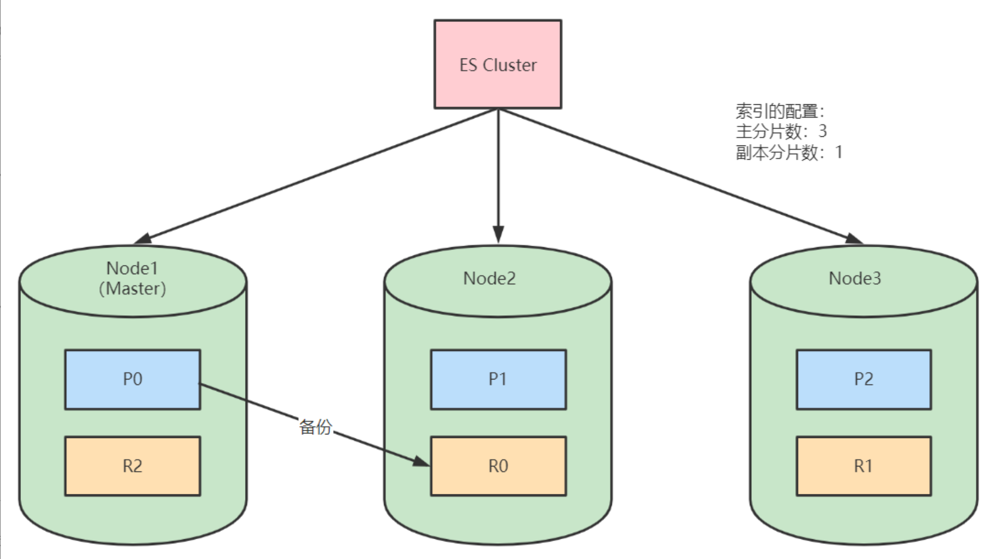


### **ElasticSearch vs Solr** 

Solr 是第一个基于 Lucene 核心库功能完备的搜索引擎产品，诞生远早于 Elasticsearch

当单纯的对已有数据进行搜索时，Solr 更快。当实时建立索引时，Solr 会产生 io 阻塞，查询性能较差，Elasticsearch 具有明显的优势

大型互联网公司，实际生产环境测试，将搜索引擎从 Solr 转到 Elasticsearch 以后的平均查询速度有了 50 倍的提升。

**总结：**

- Solr 利用 Zookeeper 进行分布式管理，而 Elasticsearch 自身带有分布式协调管理功能。 

- Solr 支持更多格式的数据，比如 JSON、XML、CSV，而 Elasticsearch 仅支持 json 文件格式。 

- Solr 在传统的搜索应用中表现好于 Elasticsearch，但在处理实时搜索应用时效率明显低于 Elasticsearch。 

- Solr 是传统搜索应用的有力解决方案，但 Elasticsearch 更适用于新兴的实时搜索应用。


### 应用场景 

- 站内搜索

- 日志管理与分析

- 大数据分析

- 应用性能监控

- 机器学习

国内现在有大量的公司都在使用 Elasticsearch，包括携程、滴滴、今日头条、饿了么、360 安全、小米、vivo 等诸多知名公司。除了搜索之外，结合 **Kibana、Logstash、Beats，Elastic Stack** 还被广泛运用在大数据近实时分析领域，包括日志分析、指标监控、信息安全等多个领域。它可以帮助你探索海量结构化、非结构化数据，按需创建可视化报表，对监控数据设置报警阈值，甚至通过使用机器学习技术，自动识别异常状况。


 

## 安装使用

**环境准备**

- 运行 Elasticsearch，需安装并配置 JDK
  - 设置 $JAVA_HOME

- 各个版本对 Java 的依赖 https://www.elastic.co/support/matrix#matrix_jvm

  - Elasticsearch 5 需要 Java 8 以上的版本	

  - Elasticsearch 从 6.5 开始支持 Java 11

  - 7.0 开始，内置了 Java 环境

**ES 比较耗内存，建议虚拟机 4G 或以上内存，jvm1g 以上的内存分配！！**

可以参考 es 的环境文件 elasticsearch-env.bat

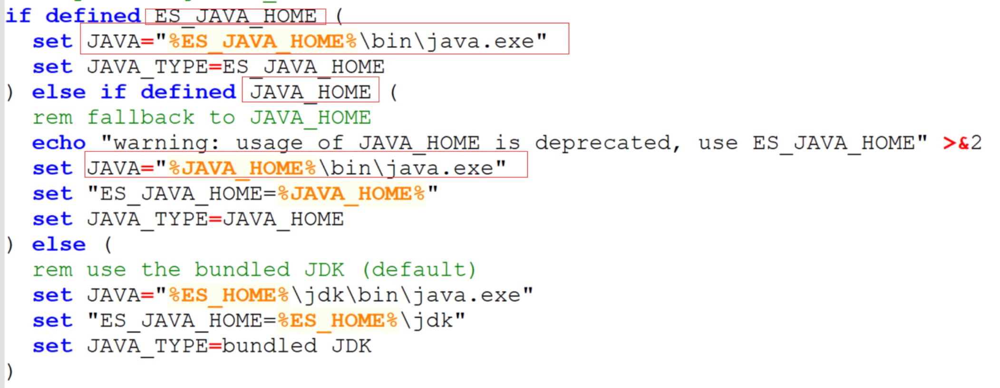

ES 的 jdk 环境生效的优先级配置 ES_JAVA_HOME>JAVA_HOME>ES_HOME

 **下载并解压 ElasticSearch**

下载地址： https://www.elastic.co/cn/downloads/past-releases#elasticsearch

选择版本：7.17.3

**ElasticSearch 文件目录结构**

| 目录    | 描述                                                         |
| ------- | ------------------------------------------------------------ |
| bin     | 脚本文件，包括启动 elasticsearch，安装插件，运行统计数据等   |
| config  | 配置文件目录，如 elasticsearch 配置、角色配置、jvm 配置等。  |
| jdk     | java 运行环境                                                |
| data    | 默认的数据存放目录，包含节点、分片、索引、文档的所有数据，生产环境需要修改。 |
| lib     | elasticsearch 依赖的 Java 类库                               |
| logs    | 默认的日志文件存储路径，生产环境需要修改。                   |
| modules | 包含所有的 Elasticsearch 模块，如 Cluster、Discovery、Indices 等。 |
| plugins | 已安装插件目录                                               |

### 主配置文件 elasticsearch.yml

- **cluster.name**

  **当前节点所属`集群名称`**，多个节点如果要组成同一个集群，那么集群名称一定要配置成相同。默认值 elasticsearch，生产环境建议根据 ES 集群的使用目的修改成合适的名字。

- **node.name**

  **当前`节点名称`**，默认值当前节点部署所在机器的主机名，所以如果一台机器上要起多个 ES 节点的话，需要通过配置该属性明确指定不同的节点名称。

- **path.data**

  **配置数据`存储目录`**，比如索引数据等，默认值 $ES_HOME/data，生产环境下强烈建议部署到另外的安全目录，防止 ES 升级导致数据被误删除。

- **path.logs**

  **`配置日志存储目录`**，比如运行日志和集群健康信息等，默认值 $ES_HOME/logs，生产环境下强烈建议部署到另外的安全目录，防止 ES 升级导致数据被误删除。

- **bootstrap.memory_lock**

  **配置 ES 启动时`是否进行内存锁定检查`**，默认值 true。

  ES 对于内存的需求比较大，一般生产环境建议配置大内存，如果内存不足，容易导致内存交换到磁盘，严重影响 ES 的性能。所以默认启动时进行相应大小内存的锁定，如果无法锁定则会启动失败。

  **非生产环境可能机器内存本身就很小，能够供给 ES 使用的就更小，如果该参数配置为 true 的话很可能导致无法锁定内存以致 ES 无法成功启动，此时可以修改为 false**

- **network.host**

  **配置`能够访问当前节点的主机`**，默认值为当前节点所在机器的本机回环地址 127.0.0.1 和 [::1]，这就导致默认情况下只能通过当前节点所在主机访问当前节点。**可以配置为 0.0.0.0 ，表示所有主机均可访问。**

  ```yml
  #ES开启远程访问  
  network.host: 0.0.0.0
  ```

- **http.port**

  **配置当前 ES 节点`对外提供服务的 http 端口`**，默认值 9200

- **discovery.seed_hosts**

  **配置参与`集群节点发现过程的主机列表`**，说白一点就是集群中所有节点所在的主机列表，可以是具体的 IP 地址，也可以是可解析的域名。

- **cluster.initial_master_nodes**

  **配置 ES `集群初始化时参与 master 选举的节点名称列表`**，必须与 node.name 配置的一致。

  ES 集群首次构建完成后，应该将集群中所有节点的配置文件中的 `cluster.initial_master_nodes` 配置项移除，重启集群或者将新节点加入某个已存在的集群时切记不要设置该配置项。


**修改 JVM 配置**

修改 config/jvm.options 配置文件，调整 jvm 堆内存大小

```sh
vim jvm.options
-Xms4g
-Xmx4g
```

配置的建议

- Xms 和 Xms 设置成 — 样

- Xmx 不要超过机器内存的 50%

- 不要超过 30GB - https://www.elastic.co/cn/blog/a-heap-of-trouble

**启动 ElasticSearch 服务**

**Windows**

**直接运行 elasticsearch.bat**

**Linux（centos7）**`复杂，见教程：`

https://note.youdao.com/ynoteshare/index.html?id=d5d5718ae542f274ba0fda4284a53231&type=note&_time=1715228771831

**客户端 Kibana 安装** `略`


 

### **Elasticsearch 安装分词插件**

Elasticsearch 提供插件机制对系统进行扩展

以安装 analysis-icu 这个分词插件为例

**在线安装**

```sh
#查看已安装插件
bin/elasticsearch-plugin list
#安装插件
bin/elasticsearch-plugin install analysis-icu
#删除插件
bin/elasticsearch-plugin remove analysis-icu
```

注意：安装和删除完插件后，需要重启 ES 服务才能生效。

测试分词效果

```json
POST _analyze
{
    "analyzer":"icu_analyzer",
    "text":"中华人民共和国"
}
```

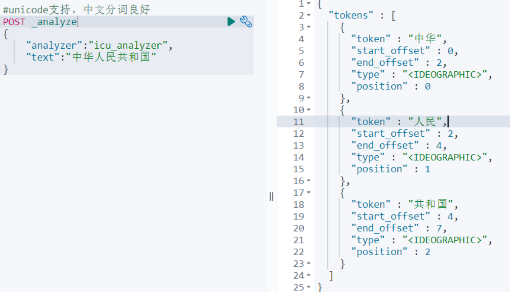

**离线安装**

本地下载相应的插件，解压，然后手动上传到 elasticsearch 的 plugins 目录，然后重启 ES 实例就可以了。

**比如 ik 中文分词插件：https://github.com/medcl/elasticsearch-analysis-ik**

测试分词效果

```json
#ES的默认分词设置是standard，会单字拆分
POST _analyze
{
    "analyzer":"standard",
    "text":"中华人民共和国"
}

#ik_smart:会做最粗粒度的拆
POST _analyze
{
    "analyzer": "ik_smart",
    "text": "中华人民共和国"
 }

#ik_max_word:会将文本做最细粒度的拆分
POST _analyze
{
    "analyzer":"ik_max_word",
    "text":"中华人民共和国"
}
```

创建索引时可以指定 IK 分词器作为默认分词器

```json
PUT /es_db
{
    "settings" : {
        "index" : {
            "analysis.analyzer.default.type": "ik_max_word"
        }
    }
}
```


## **ElasticSearch 基本概念**

**关系型数据库 VS ElasticSearch**

- 在 7.0 之前，一个 Index 可以设置多个 Types

- 目前 Type 已经被 Deprecated，7.0 开始，一个索引只能创建一个 Type - “_doc”

- 传统关系型数据库和 Elasticsearch 的区别:

  - Elasticsearch- Schemaless / 相关性 / 高性能全文检索

  - RDMS — 事务性 / Join	


### **索引（Index）**

**一个索引就是一个拥有几分相似特征的文档的集合**

比如说，可以有一个客户数据的索引，另一个产品目录的索引，还有一个订单数据的索引

**一个索引由一个名字来标识（必须全部是小写字母的）**，并且当我们要对对应于这个索引中的文档进行索引、搜索、更新和删除的时候，都要使用到这个名字

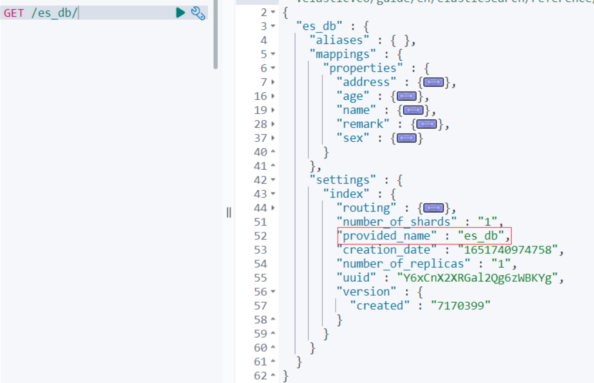

### **文档（Document）**

- **Elasticsearch 是面向文档的，文档是所有可搜索数据的最小单位。**

  - 日志文件中的日志项

  - 一本电影的具体信息 / 一张唱片的详细信息

  - MP3 播放器里的一首歌 / 一篇 PDF 文档中的具体内容

- **文档会被序列化成 JSON 格式，保存在 Elasticsearch 中**

  - JSON 对象由字段组成

  - 每个字段都有对应的字段类型 (字符串 / 数值 / 布尔 / 日期 / 二进制 / 范围类型)

- 每个文档都有一个 Unique ID
  - 可以自己指定 ID 或者通过 Elasticsearch 自动生成

- 一篇文档包含了一系列字段，类似数据库表中的一条记录

- JSON 文档，格式灵活，不需要预先定义格式

  - 字段的类型可以指定或者通过 Elasticsearch 自动推算

  - 支持数组 / 支持嵌套

**文档元数据**

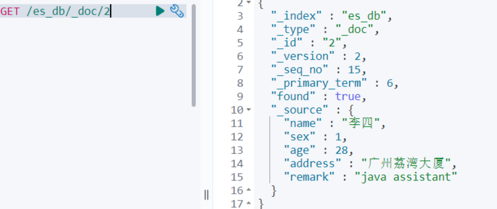

元数据，用于标注文档的相关信息：

- **_index：文档所属的索引名**

-  _type：文档所属的类型名

- _id：文档唯 —ld

- **_source: 文档的原始 Json 数据**

- `_version: ` 文档的版本号，修改删除操作_version 都会自增 1

- _`seq_no:  `和`_version` 一样，一旦数据发生更改，数据也一直是累计的。Shard 级别严格递增，保证后写入的 Doc 的_seq_no 大于先写入的 Doc 的_seq_no。

- `_primary_term: _primary_term `主要是用来恢复数据时处理当多个文档的`_seq_no `一样时的冲突，避免` Primary Shard` 上的写入被覆盖。每当 Primary Shard 发生重新分配时，比如重启，Primary 选举等，_primary_term 会递增 1。


## 操作

### **创建索引**

索引命名必须小写，不能以下划线开头

格式: PUT / 索引名称

```json
#创建索引
PUT /es_db

#创建索引时可以设置分片数和副本数
PUT /es_db
{
    "settings" : {
        "number_of_shards" : 3,
        "number_of_replicas" : 2
    }
}

#修改索引配置
PUT /es_db/_settings
{
    "index" : {
        "number_of_replicas" : 1
    }
}
```

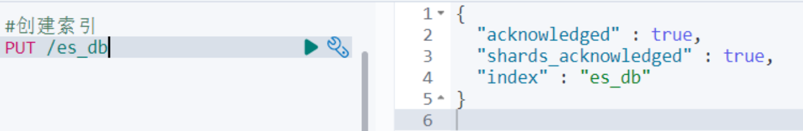


### **查询索引**

格式: GET / 索引名称

```
#查询索引
GET /es_db
 
#es_db是否存在
HEAD /es_db
```

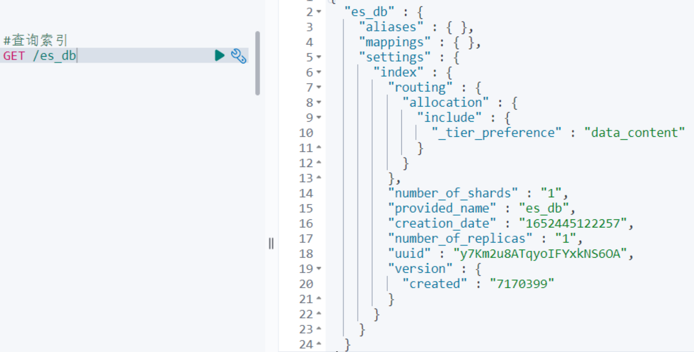


**删除索引**

格式: DELETE / 索引名称

```
DELETE /es_db
```

**ElasticSearch 文档操作**

示例数据

```json
PUT /es_db
{
    "settings" : {
        "index" : {
            "analysis.analyzer.default.type": "ik_max_word"
        }
    }
}
 
PUT /es_db/_doc/1
{
"name": "张三",
"sex": 1,
"age": 25,
"address": "广州天河公园",
"remark": "java developer"
}

PUT /es_db/_doc/2
{
"name": "李四",
"sex": 1,
"age": 28,
"address": "广州荔湾大厦",
"remark": "java assistant"
}
 
PUT /es_db/_doc/3
{
"name": "王五",
"sex": 0,
"age": 26,
"address": "广州白云山公园",
"remark": "php developer"
}
 
PUT /es_db/_doc/4
{
"name": "赵六",
"sex": 0,
"age": 22,
"address": "长沙橘子洲",
"remark": "python assistant"
}
 
PUT /es_db/_doc/5
{
"name": "张龙",
"sex": 0,
"age": 19,
"address": "长沙麓谷企业广场",
"remark": "java architect assistant"
}	
	
PUT /es_db/_doc/6
{
"name": "赵虎",
"sex": 1,
"age": 32,
"address": "长沙麓谷兴工国际产业园",
"remark": "java architect"
}	
```


### 添加（索引）文档 

- **格式: [PUT | POST] / 索引名称 /[_doc  | _create ]/id**

```json
# 创建文档,指定id
# 如果id不存在，创建新的文档，否则先删除现有文档，再创建新的文档，版本会增加
PUT /es_db/_doc/1
{
"name": "张三",
"sex": 1,
"age": 25,
"address": "广州天河公园",
"remark": "java developer"
}	
 
#创建文档，ES生成id
POST /es_db/_doc
{
"name": "张三",
"sex": 1,
"age": 25,
"address": "广州天河公园",
"remark": "java developer"
}
```

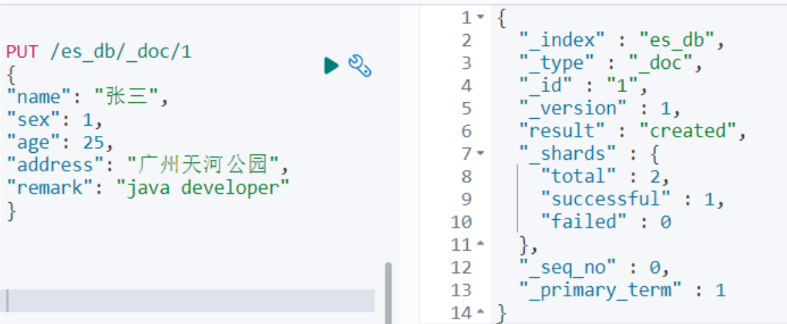

> 注意：POST 和 PUT 都能起到创建 / 更新的作用，**PUT 需要对一个具体的资源进行操作也就是要确定 id 才能进行更新 / 创建**，而 **POST 是可以针对整个资源集合进行操作的，如果不写 id 就由 ES 生成一个唯一 id 进行创建新文档**，如果填了 id 那就针对这个 id 的文档进行创建 / 更新

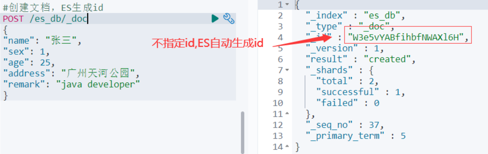

Create - 如果 ID 已经存在，会失败

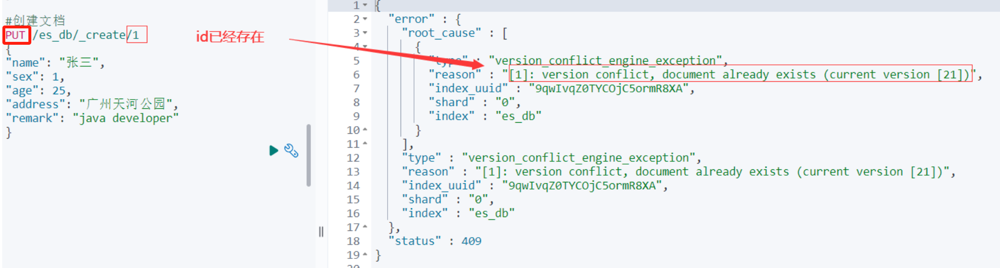


### **修改文档** 

- 使用`_update` 部分更新，格式: POST / 索引名称 /_update/id

update 不会删除原来的文档，而是实现真正的数据更新

```
# 部分更新：在原有文档上更新
# Update -文档必须已经存在，更新只会对相应字段做增量修改
POST /es_db/_update/1
{
  "doc": {
    "age": 28
  }
}
 
#查询文档
GET /es_db/_doc/1
```

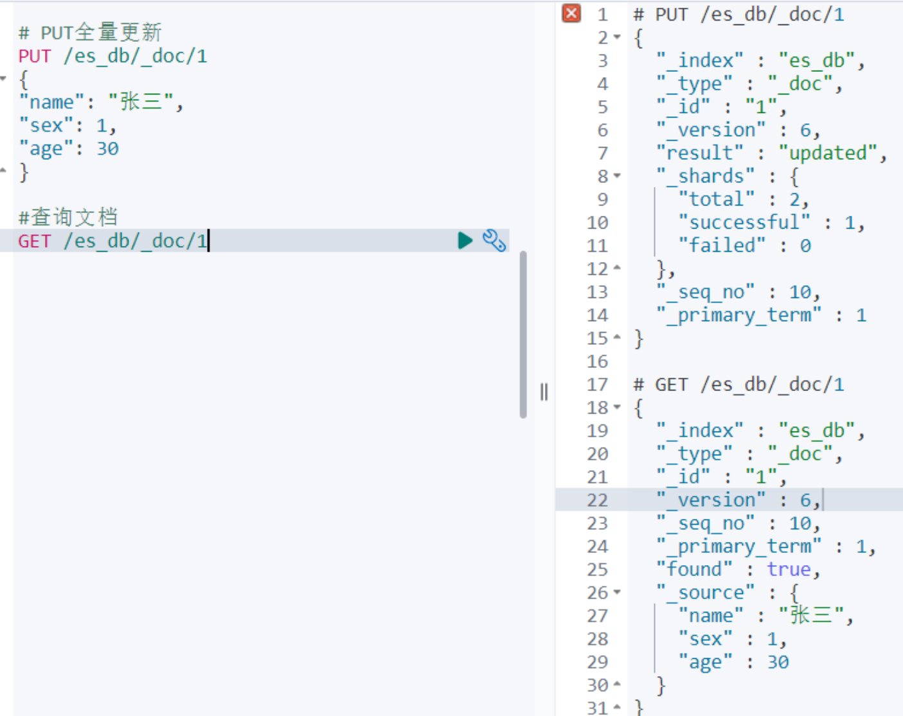

- 使用 _update_by_query 更新文档

```json
POST /es_db/_update_by_query
{
  "query": { 
    "match": {
      "_id": 1
    }
  },
  "script": {
    "source": "ctx._source.age = 30"
  }
}
```

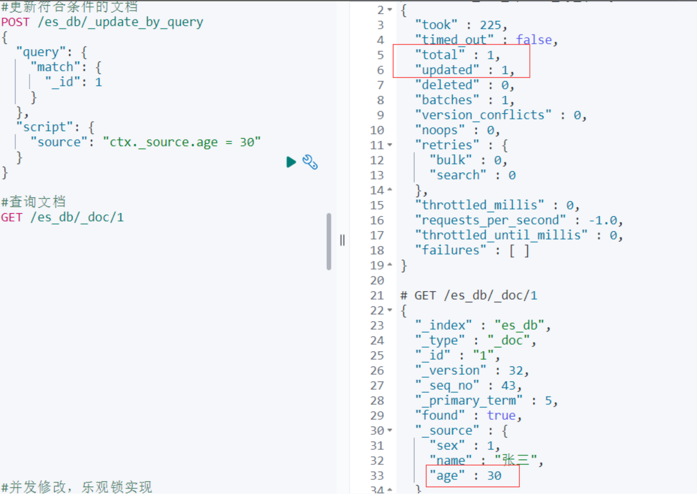

**并发场景下修改文档**

`_seq_no `和`_primary_term` 是对`_version` 的优化，7.X 版本的 ES 默认使用这种方式控制版本，所以当在高并发环境下使用乐观锁机制修改文档时，要带上当前文档的`_seq_no `和`_primary_term` 进行更新：

```json
POST /es_db/_doc/2?if_seq_no=21&if_primary_term=6
{
  "name": "李四xxx"
}
```

如果版本号不对，会抛出版本冲突异常


### 查询文档

- 根据 id 查询文档，格式: `GET / 索引名称 /_doc/id`

```
GET /es_db/_doc/1
```

- 条件查询 `_search`，格式： `/ 索引名称 /_doc/_search`

```
# 查询前10条文档
GET /es_db/_doc/_search
```

ES Search API 提供了两种条件查询搜索方式：

- REST 风格的请求 URI，直接将参数带过去

- 封装到 request body 中，这种方式可以定义更加易读的 JSON 格式

```json
#通过URI搜索，使用“q”指定查询字符串，“query string syntax” KV键值对
 
#条件查询, 如要查询age等于28岁的 _search?q=*:***
GET /es_db/_doc/_search?q=age:28
 
#范围查询, 如要查询age在25至26岁之间的 _search?q=***[** TO **]  注意: TO 必须为大写
GET /es_db/_doc/_search?q=age[25 TO 26]
 
#查询年龄小于等于28岁的 :<=
GET /es_db/_doc/_search?q=age:<=28
#查询年龄大于28前的 :>
GET /es_db/_doc/_search?q=age:>28
 
#分页查询 from=*&size=*
GET /es_db/_doc/_search?q=age[25 TO 26]&from=0&size=1
 
#对查询结果只输出某些字段 _source=字段,字段
GET /es_db/_doc/_search?_source=name,age
 
#对查询结果排序 sort=字段:desc/asc
GET /es_db/_doc/_search?sort=age:desc
```

### **删除文档**

格式: DELETE / 索引名称 /_doc/id

```
DELETE /es_db/_doc/1
```


### 文档批量操作

- 批量操作可以减少网络连接所产生的开销，提升性能

  - 支持在一次 API 调用中，对不同的索引进行操作

  - 可以在 URI 中指定 Index，也可以在请求的 Payload 中进行

  - 操作中单条操作失败，并不会影响其他操作

  - 返回结果包括了每一条操作执行的结果

   

  **批量写入**

  批量对文档进行写操作是通过_bulk 的 API 来实现的

  - 请求方式：POST

  - 请求地址：_bulk

  - 请求参数：通过_bulk 操作文档，一般至少有两行参数 (或偶数行参数)

  - 第一行参数为指定操作的类型及操作的对象 (index,type 和 id)

  - 第二行参数才是操作的数据

  参数类似于：

  ```
  {"actionName":{"_index":"indexName", "_type":"typeName","_id":"id"}}
  {"field1":"value1", "field2":"value2"}
  ```

  - actionName：表示操作类型，主要有 create,index,delete 和 update

   

  **批量创建文档 create**

  ```
  POST _bulk
  {"create":{"_index":"article", "_type":"_doc", "_id":3}}
  {"id":3,"title":"fox老师","content":"fox老师666","tags":["java", "面向对象"],"create_time":1554015482530}
  {"create":{"_index":"article", "_type":"_doc", "_id":4}}
  {"id":4,"title":"mark老师","content":"mark老师NB","tags":["java", "面向对象"],"create_time":1554015482530}
  ```

  **普通创建或全量替换 index**

  ```
  POST _bulk
  {"index":{"_index":"article", "_type":"_doc", "_id":3}}
  {"id":3,"title":"图灵徐庶老师","content":"图灵学院徐庶老师666","tags":["java", "面向对象"],"create_time":1554015482530}
  {"index":{"_index":"article", "_type":"_doc", "_id":4}}
  {"id":4,"title":"图灵诸葛老师","content":"图灵学院诸葛老师NB","tags":["java", "面向对象"],"create_time":1554015482530}
  ```

  - 如果原文档不存在，则是创建

  - 如果原文档存在，则是替换 (全量修改原文档)

   

  **批量删除 delete**

  ```
  POST _bulk
  {"delete":{"_index":"article", "_type":"_doc", "_id":3}}
  {"delete":{"_index":"article", "_type":"_doc", "_id":4}}
  ```

  **批量修改 update**

  ```
  POST _bulk
  {"update":{"_index":"article", "_type":"_doc", "_id":3}}
  {"doc":{"title":"ES大法必修内功"}}
  {"update":{"_index":"article", "_type":"_doc", "_id":4}}
  {"doc":{"create_time":1554018421008}}
  ```

   

  **组合应用**

  ```
  POST _bulk
  {"create":{"_index":"article", "_type":"_doc", "_id":3}}
  {"id":3,"title":"fox老师","content":"fox老师666","tags":["java", "面向对象"],"create_time":1554015482530}
  {"delete":{"_index":"article", "_type":"_doc", "_id":3}}
  {"update":{"_index":"article", "_type":"_doc", "_id":4}}
  {"doc":{"create_time":1554018421008}}
  ```

   

  **批量读取**

  es 的批量查询可以使用 mget 和 msearch 两种。其中 mget 是需要我们知道它的 id，可以指定不同的 index，也可以指定返回值 source。msearch 可以通过字段查询来进行一个批量的查找。

  **_mget**

  ```
  #可以通过ID批量获取不同index和type的数据
  GET _mget
  {
  "docs": [
  {
  "_index": "es_db",
  "_id": 1
  },
  {
  "_index": "article",
  "_id": 4
  }
  ]
  }
   
  #可以通过ID批量获取es_db的数据
  GET /es_db/_mget
  {
  "docs": [
  {
  "_id": 1
  },
  {
  "_id": 4
  }
  ]
  }
  #简化后
  GET /es_db/_mget 
  {
   "ids":["1","2"]  
   }
  ```


**_msearch**

在_msearch 中，请求格式和 bulk 类似。查询一条数据需要两个对象，第一个设置 index 和 type，第二个设置查询语句。查询语句和 search 相同。如果只是查询一个 index，我们可以在 url 中带上 index，这样，如果查该 index 可以直接用空对象表示。

```
GET /es_db/_msearch
{}
{"query" : {"match_all" : {}}, "from" : 0, "size" : 2}
{"index" : "article"}
{"query" : {"match_all" : {}}}
```