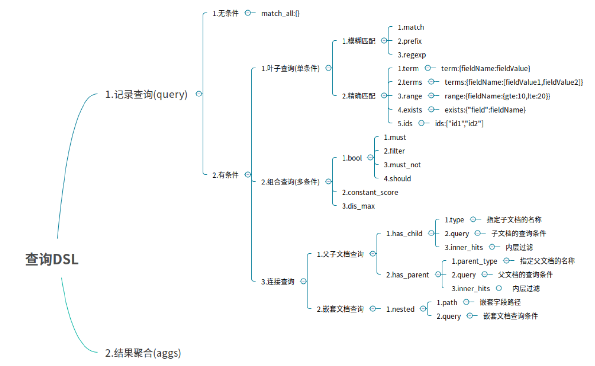
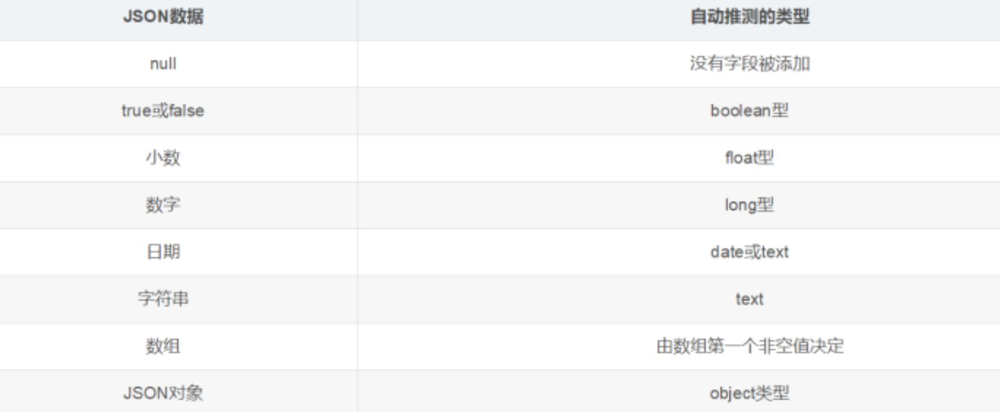

# Elasticsearch DSL

## 文档批量操作

### 1.批量获取文档数据

批量获取文档数据是通过`_mget `的 API 来实现的

1. 在 URL 中**不指定** index 和 type

   - 请求方式：GET

   - 请求地址：_mget

   - 功能说明 ： 可以通过 ID 批量获取不同 index 和 type 的数据

   - 请求参数：

     - docs : 文档数组参数

       - _index : 指定 index

       - _type : 指定 type

       - _id : 指定 id

       - _source : 指定要查询的字段

   ```json
   GET _mget
   {
   "docs": [
   	{
   		"_index": "es_db",
   		"_type": "_doc",
   		"_id": 1
   	},
   	{
   		"_index": "es_db",
   		"_type": "_doc",
   		"_id": 2
   	}
   ]
   }
   ```

   响应结果如下：

   ```json
   {
     "docs" : [
       {
         "_index" : "es_db",
         "_type" : "_doc",
         "_id" : "1",
         "_version" : 3,
         "_seq_no" : 7,
         "_primary_term" : 1,
         "found" : true,
         "_source" : {
           "name" : "张三666",
           "sex" : 1,
           "age" : 25,
           "address" : "广州天河公园",
           "remark" : "java developer"
         }
       },
       {
         "_index" : "es_db",
         "_type" : "_doc",
         "_id" : "2",
         "_version" : 1,
         "_seq_no" : 1,
         "_primary_term" : 1,
         "found" : true,
         "_source" : {
           "name" : "李四",
           "sex" : 1,
           "age" : 28,
           "address" : "广州荔湾大厦",
           "remark" : "java assistant"
         }
       }
     ]
   }
   ```

2. 在 URL 中**指定 index**

   - 请求方式：GET

   - 请求地址：/{{indexName}}/_mget

   - 功能说明 ： 可以通过 ID 批量获取不同 index 和 type 的数据

   - 请求参数：

     - docs : 文档数组参数

       - _index : 指定 index

       - _type : 指定 type

       - _id : 指定 id

       - _source : 指定要查询的字段

   ```json
   GET /es_db/_mget
   {
   "docs": [
   	{
   		"_type":"_doc",
   		"_id": 3
   	},
   	{
   		"_type":"_doc",
   		"_id": 4
   	}
   ]
   }
   ```

3. 在 URL 中指定 index 和 type

   - 请求方式：GET

   - 请求地址：/{{indexName}}/{{typeName}}/_mget

   - 功能说明 ： 可以通过 ID 批量获取不同 index 和 type 的数据

   - 请求参数：

     - docs : 文档数组参数

       - _index : 指定 index

       - _type : 指定 type

       - _id : 指定 id

       - _source : 指定要查询的字段

   ```json
   GET /es_db/_doc/_mget
   {
   "docs": [
   	{
   		"_id": 1
   	},
   	{
   		"_id": 2
   	}
   ]
   }
   ```


### 2.批量操作文档数据

批量对文档进行写操作是通过`_bulk` 的 API 来实现的

- 请求方式：POST

- 请求地址：_bulk

- 请求参数：通过_bulk 操作文档，**一般至少有两行参数 (或偶数行参数)**

  - **第一行参数为指定操作的类型及操作的对象 (index,type 和 id)**

  - **第二行参数才是操作的数据**

参数类似于：

```json
{"actionName":{"_index":"indexName", "_type":"typeName","_id":"id"}}
{"field1":"value1", "field2":"value2"}
```


`actionName`：表示操作类型，主要有 create,index,delete 和 update

1. 批量创建文档 **create**

   ```json
   POST _bulk
   {"create":{"_index":"article", "_type":"_doc", "_id":3}}
   {"id":3,"title":"老师1","content":"老师666","tags":["java", "面向对象"],"create_time":1554015482530}
   {"create":{"_index":"article", "_type":"_doc", "_id":4}}
   {"id":4,"title":"老师2","content":"老师NB","tags":["java", "面向对象"],"create_time":1554015482530}
   ```

2. 普通创建或全量替换 **index**

   ```json
   POST _bulk
   {"index":{"_index":"article", "_type":"_doc", "_id":3}}
   {"id":3,"title":"徐庶老师","content":"666","tags":["java", "面向对象"],"create_time":1554015482530}
   {"index":{"_index":"article", "_type":"_doc", "_id":4}}
   {"id":4,"title":"诸葛老师","content":"NB","tags":["java", "面向对象"],"create_time":1554015482530}
   ```

   > 如果原文档不存在，则是创建
   >
   > 如果原文档存在，则是替换 (全量修改原文档)

3. 批量删除 delete

   ```json
   POST _bulk
   {"delete":{"_index":"article", "_type":"_doc", "_id":3}}
   {"delete":{"_index":"article", "_type":"_doc", "_id":4}}
   ```

4. 批量修改 update

   ```json
   POST _bulk
   {"update":{"_index":"article", "_type":"_doc", "_id":3}}
   {"doc":{"title":"ES大法必修内功"}}
   {"update":{"_index":"article", "_type":"_doc", "_id":4}}
   {"doc":{"create_time":1554018421008}}
   ```


## DSL 语言高级查询

### Query DSL 概述

Domain Specific Language(领域专用语言)

Elasticsearch 提供了基于 JSON 的 DSL 来定义查询，DSL 由叶子查询子句和复合查询子句两种子句组成



DSL 查询语言中存在两种：查询 DSL（query DSL）和过滤 DSL（filter DSL）


**query DSL**

在查询上下文中，查询会回答这个问题 —— **“这个文档匹不匹配这个查询，它的相关度高么？”**

如何验证匹配很好理解，如何计算相关度呢？

ES 中索引的数据都会存储一个_score 分值，分值越高就代表越匹配。另外关于某个搜索的分值计算还是很复杂的，因此也需要一定的时间。


**filter DSL**

在过滤器上下文中，**查询会回答这个问题 ——“这个文档匹不匹配？”**

答案很简单，是或者不是。它不会去计算任何分值，也不会关心返回的排序问题，因此效率会高一点。

过滤上下文 是在使用 filter 参数时候的执行环境，比如在 bool 查询中使用 must_not 或者 filter

另外，经常使用过滤器，ES 会自动的缓存过滤器的内容，这对于查询来说，会提高很多性能。


### **无查询条件**

无查询条件是查询所有，默认是查询所有的，或者使用 `match_all `表示所有

```json
GET /es_db/_doc/_search
{
	"query":{
		"match_all":{}
	}
}
```

### 有查询条件

#### 叶子条件查询 (**单字段查询条件**)

##### 模糊匹配

模糊匹配主要是针对文本类型的字段，文本类型的字段会对内容进行分词，对查询时，也会对搜索条件进行分词，然后通过倒排索引查找到匹配的数据，模糊匹配主要通过 match 等参数来实现

- match : 通过 match 关键词模糊匹配条件内容

- prefix : 前缀匹配

- regexp : 通过正则表达式来匹配数据

> **match 的复杂用法**：match 条件还支持以下参数：
>
> - query : 指定匹配的值
>
> - operator : 匹配条件类型
>
> - and : 条件分词后都要匹配
>
> - or : 条件分词后有一个匹配即可 (默认)
>
> - minmum_should_match : 指定最小匹配的数量

**举例：**

1. 根据备注信息模糊查询 match, match 会根据该字段的分词器，进行分词查询 

```json
POST /es_db/_doc/_search
{
	"from": 0,
	"size": 2, 
	"query": {
		"match": {
			"address": "广州"
		}
	}
}
```

类似于sql的

```sql
SQL: select * from user where address like '%广州%' limit 0, 2
```


2. 多字段模糊匹配查询与精准查询 multi_match

```json
POST /es_db/_doc/_search
{
	"query":{
		"multi_match":{
			"query":"张三",
			"fields":["address","name"]
		}
	}
}
```

类似于

```sql
select * from student  where name like '%张三%' or address like '%张三%' 
```


##### 精确匹配

- term : 单个条件相等

- terms : 单个字段属于某个值数组内的值

- range : 字段属于某个范围内的值

- exists : 某个字段的值是否存在

- ids : 通过 ID 批量查询

举例：根据名称精确查询姓名 term, term 查询不会对字段进行分词查询，会采用精确匹配 

> 注意：采用 term 精确查询，查询字段映射类型属于为 keyword.

举例: 

```json
POST /es_db/_doc/_search
{
	"query": {
		"term": {
			"name": "admin"
		}
	}
}
```

类似sql的

```sql
select * from student where name = 'admin'
```


#### 组合条件查询 (多条件查询)

组合条件查询是将叶子条件查询语句进行组合而形成的一个完整的查询条件

- bool : 各条件之间有 and,or 或 not 的关系

  - must : 各个条件都必须满足，即各条件是 and 的关系

  - should : 各个条件有一个满足即可，即各条件是 or 的关系

  - must_not : 不满足所有条件，即各条件是 not 的关系

  - filter : 不计算相关度评分，它不计算_score 即相关度评分，效率更高

- constant_score : 不计算相关度评分

`must/filter/shoud/must_not` 等的子条件是通过 `term/terms/range/ids/exists/match `等叶子条件为参数的

> 注：以上参数，当只有一个搜索条件时，must 等对应的是一个对象，当是多个条件时，对应的是一个数组

举例：

1. 未指定字段条件查询 query_string , 含 AND 与 OR 条件

   ```json
   POST /es_db/_doc/_search
   {
   	"query":{
   		"query_string":{
   			"query":"广州 OR 长沙"
   		}
   	}
   }
   ```

2. 指定字段条件查询 query_string , 含 AND 与 OR 条件

   ```json
   POST /es_db/_doc/_search
   {
   	"query":{
   		"query_string":{
   			"query":"admin OR 长沙",
   			"fields":["name","address"]
   		}
   	}
   }
   ```


#### 连接查询 (多文档合并查询)

- 父子文档查询：parent/child

- 嵌套文档查询: nested


#### 范围查询

注：json 请求字符串中部分字段的含义

​	range：范围关键字

​	gte 大于等于

​	lte  小于等于

​	gt 大于

​	lt 小于

​	now 当前时间

举例：1

```json
POST /es_db/_doc/_search
{
	"query" : {
		"range" : {
			"age" : {
				"gte":25,
				"lte":28
			}
		}
	}
}
```

类似于

```sql
select * from user where age between 25 and 28
```

2.  分页、输出字段、排序综合查询

   ```json
   POST /es_db/_doc/_search
   {
   	"query" : {
   		"range" : {
   			"age" : {
   				"gte":25,
   				"lte":28
   				}
   			}
   		},
   	"from": 0,
   	"size": 2,
   	"_source": ["name", "age", "book"],
   	"sort": {"age":"desc"}
   }
   ```


### **Filter 过滤器方式查询**

Filter Context 对数据进行过滤 

```json
POST /es_db/_doc/_search
{
	"query":{
		"bool":{
			"filter":{
				"term":{
					"age":25
				}
			}
		}
	}
}	
```


### 总结:

**1. match`指定字段名分词匹配`**

**match：模糊匹配，需要指定字段名，但是输入会进行分词**，比如 "hello world" 会进行拆分为 hello 和 world，然后匹配，如果字段中包含 hello 或者 world，或者都包含的结果都会被查询出来，也就是说 match 是一个部分匹配的模糊查询。查询条件相对来说比较宽松。

**2. term`指定字段名不分词匹配`**

**term:  这种查询和 match 在有些时候是等价的，比如我们查询单个的词 hello，那么会和 match 查询结果一样，但是如果查询 "hello world"，结果就相差很大，因为这个输入不会进行分词**，就是说查询的时候，是查询字段分词结果中是否有 "hello world" 的字样，而不是查询字段中包含 "hello world" 的字样。当保存数据 "hello world" 时，elasticsearch 会对字段内容进行分词，"hello world" 会被分成 hello 和 world，不存在 "hello world"，因此这里的查询结果会为空。这也是 term 查询和 match 的区别。

**3. match_phase`指定字段名分词顺序且全包括匹配`**

**match_phase：会对输入做分词，但是需要结果中也包含所有的分词，而且顺序要求一样**。以 "hello world" 为例，要求结果中必须包含 hello 和 world，而且还要求他们是连着的，顺序也是固定的，hello that world 不满足，world hello 也不满足条件。

**4. query_string`不指定字段分词匹配`**

**query_string：和 match 类似，但是 match 需要指定字段名，query_string 是在所有字段中搜索**，范围更广泛。


## 文档映射

ES 中映射可以分为**动态映射和静态映射**

### 动态映射： 

在关系数据库中，需要事先创建数据库，然后在该数据库下创建数据表，并创建表字段、类型、长度、主键等，最后才能基于表插入数据。

**而 Elasticsearch 中不需要定义 Mapping 映射（即关系型数据库的表、字段等），在文档写入 Elasticsearch 时，会根据文档字段自动识别类型，这种机制称之为动态映射。**

动态映射规则如下：



动态映射

删除原创建的索引

```
DELETE /es_db
```

创建索引

```
PUT /es_db
```

创建文档 (ES 根据数据类型，会自动创建映射)

```json
PUT /es_db/_doc/1
{
	"name": "Jack",
	"sex": 1,
	"age": 25,
	"book": "java入门至精通",
	"address": "广州小蛮腰"
}
```

获取文档映射

```
GET /es_db/_mapping	
```


### 静态映射： 

静态映射是在 Elasticsearch 中也可以事先定义好映射，包含文档的各字段类型、分词器等，这种方式称之为静态映射

删除原创建的索引

```
DELETE /es_db
```

创建索引

```
PUT /es_db		
```

**设置文档映射`mappings`**

```json
PUT /es_db
{
	"mappings":{
		"properties":{
			"name":{"type":"keyword","index":true,"store":true},
			"sex":{"type":"integer","index":true,"store":true},
			"age":{"type":"integer","index":true,"store":true},
			"book":{"type":"text","index":true,"store":true},
			"address":{"type":"text","index":true,"store":true}
		}
	}
}
```

根据静态映射创建文档

```json
PUT /es_db/_doc/1
{
	"name": "Jack",
	"sex": 1,
	"age": 25,
	"book": "elasticSearch入门至精通",
	"address": "广州车陂"
}
```

获取文档映射

```
GET /es_db/_mapping	
```


## 核心类型（Core datatype）

字符串：string，string 类型包含 text 和 keyword

- **text：该类型被用来索引长文本，在创建索引前会将这些文本进行分词，转化为词的组合，建立索引**；允许 es 来检索这些词，text 类型不能用来排序和聚合。

- **keyword：该类型不能分词**，可以被用来检索过滤、排序和聚合，keyword 类型不可用 text 进行分词模糊检索。

数值型：long、integer、short、byte、double、float

日期型：date

布尔型：boolean


### **keyword 与 text 映射类型的区别**

将 book 字段设置为 keyword 映射 （只能精准查询，不能分词查询，能聚合、排序）

```json
POST /es_db/_doc/_search
{
	"query": {
		"term": {
			"book": "elasticSearch入门至精通"
		}
	}
}
```

将 book 字段设置为 text 映射（能模糊查询，能分词查询，不能聚合、排序）

```json
POST /es_db/_doc/_search
{ 
	"query": {
		"match": {
			"book": "elasticSearch入门至精通"
		}
	}
}
```


### 创建静态映射时指定 text 类型的 ik 分词器

1. 设置 ik 分词器的文档映射

   先删除之前的 es_db，再创建新的 es_db

   定义 ik_smart 的映射

   ```json
   PUT /es_db
   {
   	"mappings":{
   		"properties":{
   			"name":{"type":"keyword","index":true,"store":true},
   			"sex":{"type":"integer","index":true,"store":true},
   			"age":{"type":"integer","index":true,"store":true},
   			"book":{"type":"text","index":true,"store":true,"analyzer":"ik_smart","search_analyzer":"ik_smart"},
   			"address":{"type":"text","index":true,"store":true}
   		}
   	}
   }
   ```

2. 分词查询

   ```json
   POST /es_db/_doc/_search
   { 
   	"query": {
   		"match": {"address": "广"}
   	}
   }	
    
   POST /es_db/_doc/_search
   { 
   	"query": {
   		"match": {"address": "广州"}
   	}
   }	
   ```


### 对已存在的 mapping 映射进行修改

具体方法

1. 如果要推倒现有的映射，你得重新建立一个静态索引		
2. 然后把之前索引里的数据导入到新的索引里		
3. 删除原创建的索引		
4. 为新索引起个别名，为原索引名	

```json
POST _reindex
{
	"source": {
	"index": "db_index"
},
"dest": {
	"index": "db_index_2"
	}
}
 
DELETE /db_index

PUT /db_index_2/_alias/db_index
```

> **注意：通过这几个步骤就实现了索引的平滑过渡，并且是零停机**


## Elasticsearch 乐观并发控制

**在数据库领域中，有两种方法来确保并发更新，不会丢失数据：**

- 悲观并发控制 

  这种方法被关系型数据库广泛使用，它假定有变更冲突可能发生，因此阻塞访问资源以防止冲突。 一个典型的例子是读取一行数据之前先将其锁住，确保只有放置锁的线程能够对这行数据进行修改。  

- 乐观并发控制 

  Elasticsearch 中使用的这种方法假定冲突是不可能发生的，并且不会阻塞正在尝试的操作。 然而，如果源数据在读写当中被修改，更新将会失败。应用程序接下来将决定该如何解决冲突。 例如，可以重试更新、使用新的数据、或者将相关情况报告给用户。

创建一个文档为例    ES 老版本

```json
PUT /db_index/_doc/1
{
	"name": "Jack",
	"sex": 1,
	"age": 25,
	"book": "Spring Boot 入门到精通",
	"remark": "hello world"
}
```

- 实现_version 乐观锁更新文档

  ```json
  PUT /db_index/_doc/1?version=1
  {
  	"name": "Jack",
  	"sex": 1,
  	"age": 25,
  	"book": "Spring Boot 入门到精通",
  	"remark": "hello world"
  }
  ```

> ES 新版本 (7.x) 不使用 version 进行并发版本控制 ，使用 if_seq_no = 版本值 & if_primary_term = 文档位置 
>
> `_seq_no`：文档版本号，作用同`_version`
>
> `_primary_term`：文档所在位置


