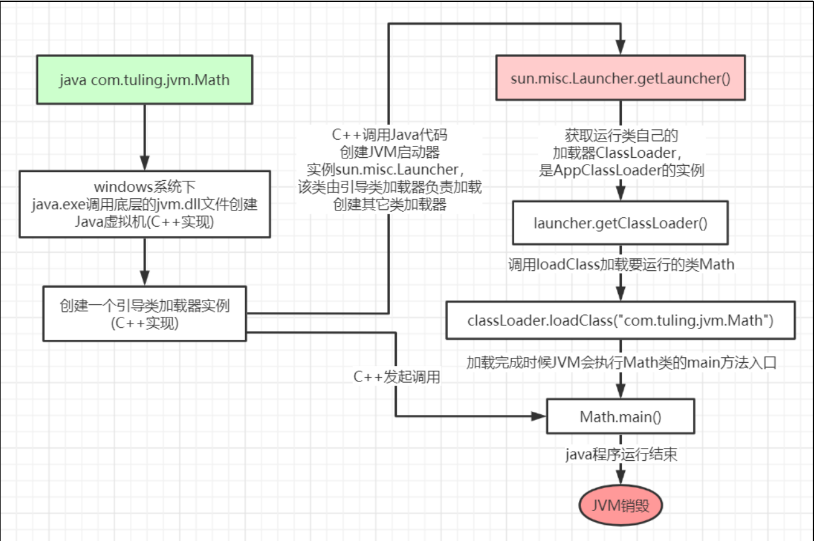
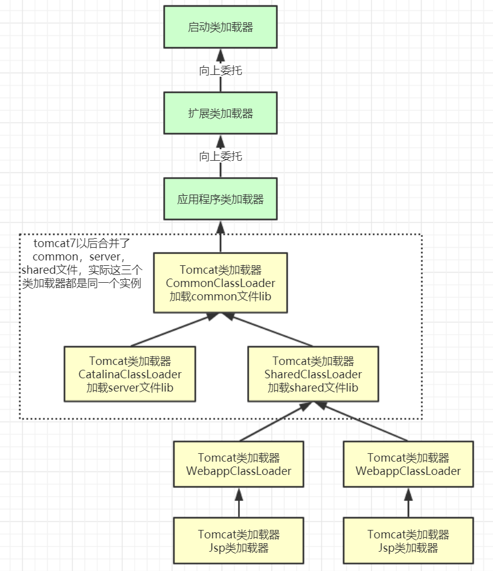

# JVM的类加载机制 

## 加载流程

**通过Java命令执行代码的大体流程如下：**




最关键的一步就是：**我们的类是如何进入到虚拟机当中的**

- 加载：在磁盘上查找字节码文件`（target/classes下的文件）`使用到类时才会加载，例如调用类的**main()**方法，**new()**对象等。在加载阶段会在内存中生成一个**代表这个类的java.lang.Class对象**（`双亲委派`），作为方法区这个类的各种数据（` 静态值`）的访问入口 

- 验证：校验**字节码文件**的正确性

- 准备：给类的静态变量分配内存，并赋予**默认值** `(int为0，Object为null,boolean为false)`

- 解析：将**符号引用**替换为直接引用，该阶段会把一些静态方法(符号引用)替换为指向数据所存内存的指针或句柄等(直接引用)，这是所谓的**静态链接**过程(类加载期间完成)，**动态链接**是在程序运行期间完成的将符号引用替换为直接引用

  `静态链接：把没有意义的符号（main,类名,方法名等）替换为这些符号所代表的在内存中的位置`

- 初始化：对类的静态变量**初始化**为指定的值` `，执行静态代码块

这些步骤只是先把类加载到**方法区！！！！！！！**

类被加载到方法区中后主要包含了 **运行时常量池、类型信息、字段信息、方法信息、类加载器的**

**引用、对应class实例的引用**等一些和**类本身**有关的信息和引用，没有实例相关的！！

`类加载器的引用：类->类加载器实例的引用`

`对应class实例的引用:类加载器在加载类信息放到方法区中后，会创建一个对应的Class 类型的
对象实例放到堆(Heap)中, 作为开发人员访问方法区中类定义的入口和切入点。`

也就是说：需要获取**类本身**的信息时，需要**先从堆中获取这个实例**，再根据**实例的引用**找到方法区中本身的类信息。

> 注意：类是先加载再使用的而不是一次性全部加载！（懒加载）


## 类加载器和双亲委派机制

上面的类加载过程主要是通过类加载器来实现的，Java里有如下几种类加载器

- 引导类加载器：负责加载支撑JVM运行的位于JRE的lib目录下的**核心类库**，比如rt.jar、charsets.jar等（lang.String类）

- 扩展类加载器：负责加载支撑JVM运行的位于JRE的lib目录下的ext扩展目录中的JAR类包

- 应用程序类加载器：负责加载ClassPath路径下的类包，主要就是加载你自己写的那些类

- 自定义加载器：负责加载用户自定义路径下的类包

`为什么在我打印引导类加载器时打印的是null?`

因为引导类加载器不是java的对象，而是c++生成的对象

### 类加载器初始化过程：

JVM启动器时创建sun.misc.Launcher，化使用了单例模式设计。

在Launcher**构造方法**内部，其创建了两个类加载器，分别是sun.misc.Launcher.ExtClassLoader(扩展类加载器)和sun.misc.Launcher.AppClassLoader(应用类加载器)。

```java
//Launcher的构造方法
public Launcher() {
    Launcher.ExtClassLoader var1;
    try {
        //构造扩展类加载器，在构造的过程中将其父加载器设置为null,原因如上
        var1 = Launcher.ExtClassLoader.getExtClassLoader();
    } catch (IOException var10) {
       .....
    }
 
    try {
        //构造应用类加载器，在构造的过程中将其父加载器设置为ExtClassLoader，
        //Launcher的loader属性值是AppClassLoader，我们一般都是用这个类加载器来加载我们自己写的应用程序
        this.loader = Launcher.AppClassLoader.getAppClassLoader(var1);
    } catch (IOException var9) {
     .....
    }
 
    Thread.currentThread().setContextClassLoader(this.loader);
    ......
}
```

### 双亲委派机制


这里类加载其实就有一个**双亲委派机制**，加载某个类时**会先委托父加载器寻找目标类**，**找不到再委托上层父加载器加载**，如果所有父加载器在自己的加载类路径下**都找不到目标类**，则在**自己的类加载路径中查找**并载入目标类。

比如我们的 Math 类，最先会找应用程序类加载器加载，应用程序类加载器会先委托扩展类加载器加载，扩展类加载器再委托引导类加载器，顶层引导类加载器在自己的类加载路径里找了半天没找到 Math 类，则向下退回加载 Math 类的请求，扩展类加载器收到回复就自己加载，在自己的类加载路径里找了半天也没找到 Math 类，又向下退回 Math 类的加载请求给应用程序类加载器，应用程序类加载器于是在自己的类加载路径里找 Math 类，结果找到了就自己加载了

**双亲委派机制说简单点就是，先找父亲加载，不行再由儿子自己加载**

我们来看下应用程序类加载器 AppClassLoader 加载类的双亲委派机制源码，AppClassLoader 的 loadClass 方法最终会调用其父类 ClassLoader 的 loadClass 方法，该方法的大体逻辑如下:

1. 首先，检查一下指定名称的类是否已经加载过，如果加载过了，就不需要再加载，直接返回。

2. 如果此类没有加载过，那么，再判断一下是否有父加载器；如果有父加载器，则由父加载器加载（即调用 parent.loadClass (name, false);）. 或者是调用 bootstrap 类加载器来加载。

3.  如果父加载器及 bootstrap 类加载器都没有找到指定的类，那么调用当前类加载器的 findClass 方法来完成类加载。

   > 类加载器的父加载器和父类不是一回事，譬如说appClassLoader的父类时URLclassLoader(其实除了引导类加载器，其他加载器父类都是它)，而父加载器是extClassLoader。

```java
//ClassLoader的loadClass方法，里面实现了双亲委派机制
protected Class<?> loadClass(String name, boolean resolve)
    throws ClassNotFoundException
{
    synchronized (getClassLoadingLock(name)) {
        // 检查当前类加载器是否已经加载了该类
        Class<?> c = findLoadedClass(name);
        if (c == null) {
            long t0 = System.nanoTime();
            try {
                if (parent != null) {  //如果当前加载器父加载器不为空则委托父加载器加载该类
                    c = parent.loadClass(name, false);
                } else {  //如果当前加载器父加载器为空则委托引导类加载器加载该类
                    c = findBootstrapClassOrNull(name);
                }
            } catch (ClassNotFoundException e) {
                // ClassNotFoundException thrown if class not found
                // from the non-null parent class loader
            }
 
            if (c == null) {
                // If still not found, then invoke findClass in order
                // to find the class.
                long t1 = System.nanoTime();
                //都会调用URLClassLoader的findClass方法在加载器的类路径里查找并加载该类
                //也就是最上面的 类加载流程
                c = findClass(name);
 
                // this is the defining class loader; record the stats
                sun.misc.PerfCounter.getParentDelegationTime().addTime(t1 - t0);
                sun.misc.PerfCounter.getFindClassTime().addElapsedTimeFrom(t1);
                sun.misc.PerfCounter.getFindClasses().increment();
            }
        }
        if (resolve) {  //不会执行
            resolveClass(c);
        }
        return c;
    }
}
```

**为什么要设计双亲委派机制？**

- 沙箱安全机制：自己写的 java.lang.String.class 类不会被加载，这样便可以防止核心 API 库被随意篡改  !

- 避免类的重复加载：当父亲已经加载了该类时，就没有必要子 ClassLoader 再加载一次，保证**被加载类的唯一性**！

以下是一个示例：

```java
package java.lang;
 
public class String {
    public static void main(String[] args) {
        System.out.println("**************My String Class**************");
    }
}
运行结果：
错误: 在类 java.lang.String 中找不到 main 方法, 请将 main 方法定义为:
   public static void main(String[] args)
否则 JavaFX 应用程序类必须扩展javafx.application.Application
```

一个没有被加载过的类根据全路径在引导类加载器中找到了，但是在这个String类中并没有main方法，所以报错`防止核心 API 库被随意篡改`


### 自定义类加载器示例：

自定义类加载器只需要继承 **java.lang.ClassLoader** 类，该类有两个核心方法，一个是 loadClass (String, boolean)，实现了**双亲委派机制**，还有一个方法是 findClass，默认实现是空方法，所以我们自定义类加载器主要是**重写** **findClass** **方法**。


### 打破双亲委派机制

再来一个沙箱安全机制示例，尝试打破双亲委派机制，用自定义类加载器加载我们自己实现的 java.lang.String.class

```java
        /**
         * 重写类加载方法，实现自己的加载逻辑，不委派给双亲加载
         */
        protected Class<?> loadClass(String name, boolean resolve) throws ClassNotFoundException {
            synchronized (getClassLoadingLock(name)) {
                // First, check if the class has already been loaded
                Class<?> c = findLoadedClass(name);
                if (c == null) {
                   long t0 = System.nanoTime();
                    // If still not found, then invoke findClass in order
                    // to find the class.
                    long t1 = System.nanoTime();
            
                    if(!name.startsWith("com.cjl.jvm")){
                        //不用c接收的话就不能先把Object等其他重要类先加载好
                        c = this.getParent().loadClass(name);
                    }else {
                        c = findClass(name);
                    }
                    // this is the defining class loader; record the stats
                    sun.misc.PerfCounter.getFindClassTime().addElapsedTimeFrom(t1);
                    sun.misc.PerfCounter.getFindClasses().increment();
                }
                if (resolve) {
                    resolveClass(c);
                }
                return c;
            }
        }
```


## **Tomcat 打破双亲委派机制**

Tomcat 是个 web 容器， 那么它要解决什么问题：

1. 一个 web 容器可能需要部署两个应用程序，不同的应用程序可能会**依赖同一个第三方类库的不同版本**，不能要求同一个类库在同一个服务器只有一份，因此要保证每个应用程序的类库都是独立的，保证相互隔离。 

2. 部署在同一个 web 容器中**相同的类库相同的版本可以共享**。否则，如果服务器有 10 个应用程序，那么要有 10 份相同的类库加载进虚拟机。 

3. **web 容器也有自己依赖的类库，不能与应用程序的类库混淆**。基于安全考虑，应该让容器的类库和程序的类库隔离开来。 

4. web 容器要支持 jsp 的修改，我们知道，jsp 文件最终也是要编译成 class 文件才能在虚拟机中运行，但程**序运行后修改 jsp** 已经是司空见惯的事情， web 容器需要**支持 jsp 修改后不用重启**。

   

- **第一个问题**，如果使用默认的类加载器机制，那么是无法加载**两个相同类库的不同版本**的，默认的类加器是不管你是什么版本的，只在乎你的全限定类名，并且只有一份

- 第二个问题，默认的类加载器是能够实现的，因为他的职责就是保证**唯一性**。

- 第三个问题和第一个问题一样

- **第四个问题**，我们想我们要怎么实现 jsp 文件的热加载，jsp 文件其实也就是 class 文件，那么如果修改了，但类名还是一样，类加载器会直接取方法区中已经存在的，**修改后的 jsp 是不会重新加载的。那么怎么办呢**？我们可以**直接卸载掉这 jsp 文件的类加载器**，所以你应该想到了，每个 jsp 文件对应一个唯一的类加载器，**当一个 jsp 文件修改了，就直接卸载这个 jsp 类加载器。重新创建类加载器，重新加载 jsp 文件**！！！！！





>注意：同一个 JVM 内，两个相同包名和类名的类对象可以共存，因为他们的类加载器可以不一样，所以看两个类对象是否是同一个，除了看类的包名和类名是否都相同之外，还需要他们的类加载器也是同一个才能认为他们是同一个。


**模拟实现 Tomcat 的 JasperLoader 热加载**

原理：后台启动线程监听 jsp 文件变化，如果变化了，找到该 jsp 对应的 servlet 类的加载器引用 (gcroot)，重新生成新的 **JasperLoader** 加载器赋值给引用，然后加载新的 jsp 对应的 servlet 类，之前的那个加载器因为没有 gcroot 引用了，下一次 gc 的时候会被销毁。

说白了就是销毁原来的加载器等着被gc回收，重新生成新的加载器给jsp用


