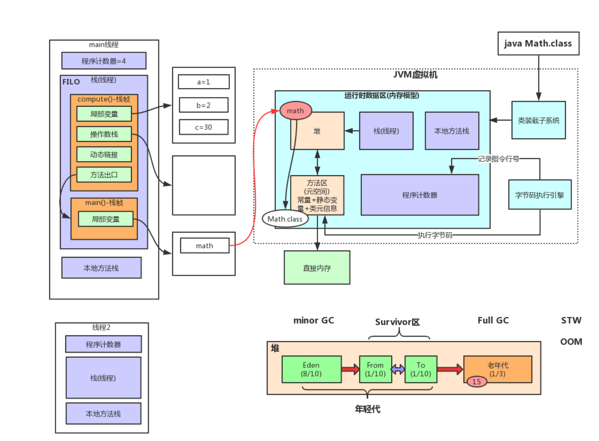
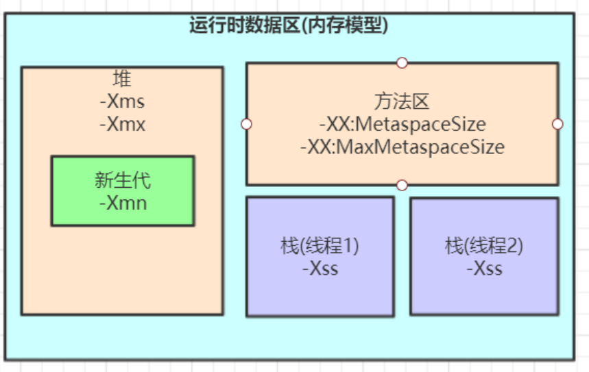

# JVM内存模型


## JVM体系结构

- **JVM**

英文名称（Java Virtual Machine），就是我们耳熟能详的 Java 虚拟机。Java 能够跨平台运行的核心在于 JVM 。

所有的 java 程序会首先被编译为.class 的类文件，这种类文件可以在虚拟机上执行。也就是说 class 文件并不直接与机器的操作系统交互，而是经过虚拟机间接与操作系统交互，由虚拟机将程序解释给本地系统执行。

针对不同的系统有不同的 jvm 实现，有 Linux 版本的 jvm 实现，也有 Windows 版本的 jvm 实现，但是同一段代码在编译后的字节码是一样的。这就是 Java 能够跨平台，实现一次编写，多处运行的原因所在。

- **JRE**

英文名称（Java Runtime Environment），就是 Java 运行时环境。我们编写的 Java 程序必须要在 JRE 才能运行。它主要包含两个部分，JVM 和 Java 核心类库。

JRE 是 Java 的运行环境，并不是一个开发环境，所以没有包含任何开发工具，如编译器和调试器等

- **JDK**

英文名称（Java Development Kit），就是 Java 开发工具包

- **最后，总结一下 JDK/JRE/JVM，他们三者的关系**

JRE = JVM + Java 核心类库

JDK = JRE + Java 工具 + 编译器 + 调试器


## JVM整体结构及内存模型

、

**紫色部分是每个线程私有的，橙色共有**

```java
public static void main(String args[]){
    Math math = new Math();
    math.compute();
    System.out.println ("xxxx")
}
```

### （线程）栈：存放线程内的局部变量

每当有一个新的线程被执行，jvm就会划分出栈中的一小块内存给这个线程

**栈帧**：每一个新的方法会对应自己独立的栈帧内存区域。各自的栈帧内存空间将各方法的变量进行了分隔。

>  在循环嵌套调用中，jvm不是将栈帧分配在调用者的栈帧里而是一直往上堆，所以递归调用容易栈溢出。见上图

**那么栈帧里有什么呢？**     

- **局部变量表**：一个数组，存放会用到的变量

  > main方法的局部变量表不太一样，见上图：对于实例对象来说，局部变量表里存放的是实例对象的内存地址

- **操作数栈**：要理解记住操作数栈，就让我们先来看看局部变量的赋值过程：以这段代码为例

  ```java
  public int compute(){
      int a = 1;
      int b = 2;
      int c = (a+b)*c;
      return c
  }
  ```

  1. 将常量1压入操作数栈
  2. 将int类型值存入局部变量1`什么是局部变量1？相当于局部变量表中的一个索引或者下标标识。而局部变量0就是局部变量表本身的(this)`而局部变量1放的是我们的第一个局部变量a`也就是说局部变量1是给a使用的` int类型值就是之前压入的常量1
  3.  b=2重复上面两步
  4. 从局部变量表装载局部变量1和2到操作数栈，执行int类型的加法，将结果3重新压入操作数栈
  5. 将一个带符号整数也就是10，压入操作数栈
  6. 弹出两个元素`到cpu内部寄存器`进行乘法，将结果压入操作数栈，然后到局部变量3
  7. 将局部变量3压入操作数栈，return,将其返回到main方法

- 动态链接：compute()原本是常量池的符号，在程序运行时将这个符号的引用转化为它对应的代码的实际位置，这就是**动态链接**
- 方法出口：存放返回到main方法，去到哪一行继续执行的信息`返回后执行的相关信息`

> java自带的javap -c 和 -v 指令可以帮我们把字节码文件转化为可读的（类似）jvm汇编文件。


### 程序计数器（PC寄存器）

每执行完一行代码，引擎就会修改计数器里的值。

切换线程时就是根据程序计数器记录的行数来恢复现场。


### 常量池

- 常量+静态变量
- 类信息：这个类的代码信息

> 如果有静态的对象，见上图，常量池中的静态对象是对堆中的某个实例对象引用（内存地址）


### 本地方法栈

native方法栈，同线程栈


### 堆

存放实例对象，见上图


## **JVM内存参数设置**



Spring Boot程序的JVM参数设置格式(Tomcat启动直接加在bin目录下catalina.sh文件里)：

```java
java ‐Xms2048M ‐Xmx2048M ‐Xmn1024M ‐Xss512K ‐XX:MetaspaceSize=256M ‐XX:MaxMetaspaceSize=256M ‐jar microservice‐eureka‐server.jar
```

- ‐Xms ，-Xmx：最小/最大堆内存
- -Xmn：指定新生代内存
- -Xss : 中一个线程所占内存

> -Xss设置越小count值越小，一个线程栈里能分配的栈帧就越少，但是对JVM整体来说能开启的线程数会更多

关于元空间的JVM参数有两个：**-XX:MetaspaceSize=N和 -XX:MaxMetaspaceSize=N**，对于64位JVM来说，元空间的默认初始大小是

21MB，**默认的元空间的最大值是无限**。

**-XX：MaxMetaspaceSize**： 设置元空间最大值， 默认是-1， 即不限制， 或者说只受限于本地内存大小。

**-XX：MetaspaceSize**： 指定元空间的初始空间大小， 以字节为单位，默认是21M，达到该值就会触发full gc进行类型卸载， **同时收集**

**器会对该值进行调整**： 如果释放了大量的空间， 就适当降低该值； 如果释放了很少的空间， 那么在不超过-XX：

**MaxMetaspaceSize 如果设置了的话 的情况下， 适当提高该值。**

由于**调整元空间的大小需要Full GC**，这是非常昂贵的操作，如果应用在启动的时候发生大量Full GC，通常都是由于永久代或元空间发生

了大小调整，基于这种情况，一般建议在JVM参数中**将MetaspaceSize和MaxMetaspaceSize设置成一样的值**，并设置得比初始值`21M`要大。对于8G物理内存的机器来说，一般我会将这两个值都设置为256M。

> 主要目的就是避免频繁fullGc。如果不进行设置，在启动一个服务时jvm就会一边fullGc一边给你扩容直到服务启动。


**JVM内存参数大小该如何设置？**

JVM参数大小设置并没有固定标准，需要根据实际项目情况分析

**理念：尽可能让对象都在新生代里分配和回收，尽量别让太多对象频繁进入老年代，避免频繁对老年代进行垃圾回收，同时给系统充足的内存大小，避免新生代频繁的进行垃圾回收。**