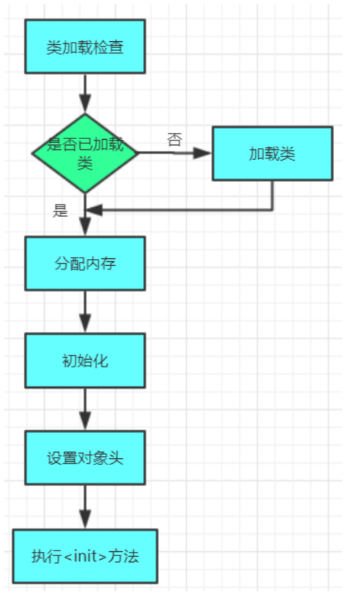
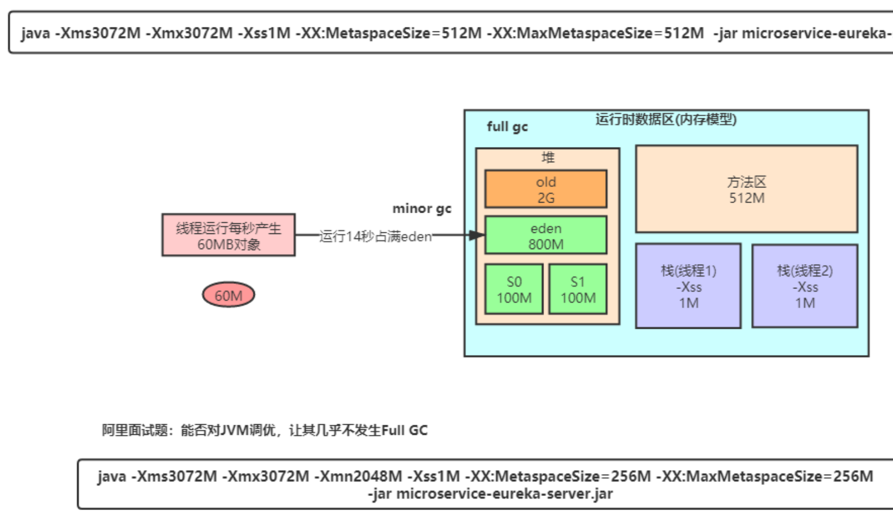
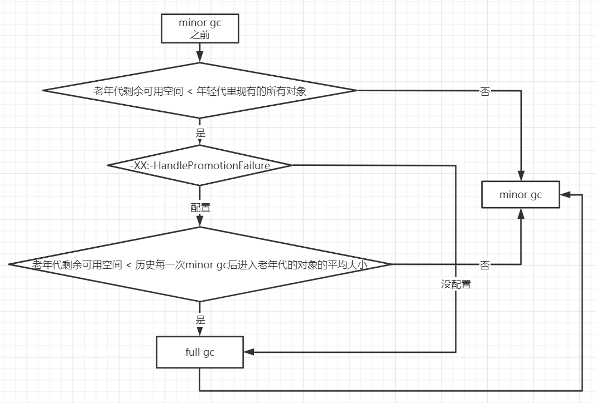

# 对象的创建与内存分配

## 对象的创建

>  之前的内容都是**类的加载过程**和**JVM内部的数据区分配**



### 1.类加载检查

虚拟机遇到一条new指令时，首先将去检查这个指令的参数是否能在**常量池中定位到一个类的符号引用**，并且检查这个

**符号引用代表的类是否已被加载、解析和初始化**过。如果没有，那必须先执行相应的类加载过程。

> 先看方法区内有没有类信息，没有再加载

new指令对应到语言层面上讲是，**new关键词、对象克隆、对象序列化**等。


### 2.分配内存

在类加载检查通过后，接下来虚拟机将为新生对象**分配内存**。对象所需内存的大小在类 加载完成后便可完全确定，为

对象分配空间的任务等同于**把一块确定大小的内存从Java堆中划分出来**。

这个步骤有两个问题：

**1.如何划分内存。**

**2.**在**并发情况**下， 可能出现正在给对象A分配内存，指针还没来得及修改，对象B又同时使用了原来的指针来分配内存的

情况。

#### 划分内存的方法：

- “指针碰撞” (`默认`)

如果Java堆中内存是绝对规整的，所有用过的内存都放在一边，空闲的内存放在另一边，中间放着一个**指针作为分界点**

**的指示器**，那所分配内存就仅仅是**把那个指针向空闲空间那边挪动一段与对象大小相等的距离**

- “空闲列表”

如果Java堆中的内存并不是规整的，已使用的内存和空 闲的内存相互交错，那就没有办法简单地进行指针碰撞了，虚拟

机就必须**维护一个列表**

> 对于不同垃圾收集器可能会产生的内存碎片，会用到空闲列表的方式划分内存

#### 解决并发问题的方法

- CAS

虚拟机采用CAS配上失败重试的方式保证更新操作的原子性来对分配内存空间的动作进行同步处理。

- 本地线程分配缓冲 (Thread local Allocation Buffer,TLAB)

把内存分配的动作按照线程划分在**不同的空间**`事先分配好的一块内存`之中进行，即每个线程在Java堆中**预先分配一小块内存**。通过**­XX:+/­UseTLAB**参数来设定虚拟机是否使用TLAB`(默认开启)`，**­XX:TLABSize** 指定TLAB大小。

> XX:+/-UseTLAB和­XX:TLABSize搭配使用，如果这个size不够用才会走CAS放到eden区
>
> 小tip: 启动参数的­XX:+/­  + 代表开启，- 代表关闭


### 3.初始化

内存分配完成后，虚拟机需要将分配到的**内存空间都初始化为零值**（不包括对象头）， 如果使用**TLAB**，这一工作过程也可以**提前至TLAB分配时进行**`设定这个本地线程分配缓冲的时候就已经初始化内存空间了`。这一步操作保证了对象的实例字段在Java代码中**可以不赋初始值就直接使用**，程序能访问到这些字段的数据类型所对应的零值。


### 4.设置对象头

初始化零值之后，虚拟机要对对象进行必要的设置，例如这个对象是哪个类的实例、如何才能找到类的元数据信息、对象的哈希码、对象的 GC 分代年龄等信息。这些信息存放在对象的对象头 Object Header 之中。

`实例对象本身的信息都存放在对象头中`

在 虚拟机中，对象在内存中存储的布局可以分为 3 块区域：**对象头**、 **实例数据**和**对齐填充**。 HotSpot 虚拟机的对象头包括两部分信息，第一部分用于**存储对象自身的运行时数据**， 如哈希码（HashCode）、GC 分代年龄、锁状态标志、线程持有的锁、偏向线程 ID、偏向时 间戳等。对象头的另外一部分是**类型指针**，即对象指向它的类元数据的指针，**虚拟机通过这个指针来确定这个对象是哪个类的实例**。

**32位对象头**


> 对象头主要有三部分：MarkWord，Klass Pointer和length(数组专属)，上图的对象头只放了MarkWord
>
> 我们可以在jvm启动参数中禁止对象启动指针压缩，这样原本被压缩到4个字节的Klass Pointer就会变回8个字节（针对内存地址）开启指针压缩可以减少每个对象的大小，节约空间，所以是默认开启的
>
> 分代年龄是4位，也就是说最大不能超过15
>
> Klass Pointer类型指针： 实例对象指向方法区这个类本身信息的指针

```java
Class<? extends Math> mathClass = math.getClass
```

看这段代码，这个所谓的mathClass与方法区的Math.class是不一样的，这是jvm**提供给我们开发人员访问类信息**用的，类似一个镜像，而jvm自己还是直接使用的方法区的类信息，也就是**通过对象头中的类型指针**去寻找

- **什么是 java 对象的指针压缩？**

1. jvm 配置参数：UseCompressedOops，compressed-- 压缩、**oop** (ordinary object pointer)-- 对象指针

2. 启用指针压缩: -XX:+UseCompressedOops (**默认开启**)，禁止指针压缩:-XX: -UseCompressedOops

- **为什么要进行指针压缩？**

1. 不压缩指针，**内存使用会多出 1.5 倍左右**，使用较大指针在主内存和缓存之间移动数据，**占用较大宽带，同时 GC 也会承受较大压力**

2. 为了减少 64 位平台下内存的消耗，**启用指针压缩功能**

3. 在 jvm 中，32 位地址最大支持 4G 内存 (2 的 32 次方)，可以通过对对象指针的存入堆内存时压缩编码、取出到 cpu 寄存器后解码方式进行优化 (**对象指针在堆中是 32 位，在寄存器中是 35 位**，2 的 35 次方 = 32G)，使得 jvm 只用 32 位地址就可以支持更大的内存配置 (小于等于 32G)`指针在寄存器中解压后是35位，压缩是32位，所以只要32位就可以支持更大空间，当然这个空间要小于等于32G,所有我们的堆内存最好小于32G,见5`

4. 堆内存大于 32G 时，压缩指针会失效，会强制使用 64 位 (即 8 字节) 来对 java 对象寻址，这就会出现 1 的问题，所以**堆内存不要大于 32G** 为好

>  **关于对齐填充：**对于大部分处理器，对象以 8 字节整数倍来对齐填充都是最高效的存取方式。

### 5.执行` <init>` 方法

`其实这一步才跟我们代码开发比较相关~`

 执行 `<init>` 方法，即对象按照程序员的意愿进行初始化。对应到语言层面上讲，就是为**属性赋值**，和执行**构造方法**。


## 对象的内存分配


### **对象栈上分配**

我们通过 JVM 内存分配可以知道 JAVA 中的对象都是在堆上进行分配，当对象没有被引用的时候，需要依靠 GC 进行回收内存，如果对象数量较多的时候，会给 GC 带来较大压力，也间接影响了应用的性能。**为了减少临时对象在堆内分配的数量**，JVM 通过**逃逸分析**确定该对象不会被外部访问。如果不会逃逸可以将该对象在**栈上分配**内存`栈帧`，这样该对象所占用的内存空间就可以**随栈帧出栈而销毁**，就**减轻了垃圾回收的压力**。

**先说结论：栈上分配依赖于逃逸分析和标量替换**

#### 对象逃逸分析：

就是分析对象动态作用域，当一个对象在方法中被定义后，它可能被外部方法所引用，例如**作为调用参数传递到其他地方**中。以下是一个简单示例

```java
public User test1() {
   User user = new User();
   user.setId(1);
   user.setName("cjl");
   //TODO 保存到数据库
   return user;
}
 
public void test2() {
   User user = new User();
   user.setId(1);
   user.setName("cjl");
   //TODO 保存到数据库
   //注意，没有返回后这个局部的user变量就是无效变量，直接跟随栈帧回收而回收
}
```

很显然 test1 方法中的 user 对象被返回了，这个对象的作用域范围不确定，test2 方法中的 **user 对象我们可以确定当方法结束这个对象就可以认为是无效对象了**，对于这样的对象我们其实可以将其分配在栈内存里，让其在**方法结束时跟随栈内存一起被回收掉**。

**ImportantSign**

> **JDK7 之后默认开启逃逸分析**，如果要关闭使用参数 (-XX:-DoEscapeAnalysis)

JVM 对于这种情况可以通过开启**逃逸分析参数 (-XX:+DoEscapeAnalysis)** 来优化对象内存分配位置，使其通过**标量替换**优先分配在栈上 

#### 标量替换

通过**逃逸分析确定该对象不会被外部访问**，并且**对象可以被进一步分解时**，**JVM 不会创建该对象**，而是将该对象成员变量**分解若干个被这个方法使用的成员变量**所代替，这些代替的成员变量在栈帧或寄存器上分配空间，这样就不会因为没有一大块连续空间导致对象内存不够分配  `为了避免栈内空间不是完整连续的而导致创建对象到堆上`

**标量与聚合量：**标量即不可被进一步分解的量，而 **JAVA 的基本数据类型就是标量**（如：int，long 等基本数据类型以及 reference 类型等），标量的对立就是可以被进一步分解的量，而这种量称之为聚合量。而在 **JAVA 中对象就是可以被进一步分解的聚合量**

> **JDK7 之后默认开启** 开启标量替换参数 (-XX:+EliminateAllocations)

**如果不开启这两个参数，呵呵，嘎嘎fullGc**


### **对象在 Eden 区分配**

大多数情况下，对象在新生代中 Eden 区分配。当 Eden 区没有足够空间进行分配时，虚拟机将发起一次 Minor GC。

**Minor GC 和 Full GC 的差别**

- **Minor GC/Young GC**：指发生新生代的的垃圾收集动作，Minor GC **非常频繁**，回收速度一般也比较**快**。

- **Major GC/Full GC**：一般会回收**老年代 ，年轻代，方法区**的垃圾，Major GC 的速度一般会比 Minor GC 的**慢 10 倍**以上。

大量的对象被分配在 eden 区，eden 区满了后会触发 minor gc，可能会有 99% 以上的对象成为垃圾被回收掉，**剩余存活的对象会被挪到为空的那块 survivor 区**，下一次 eden 区满了后又会触发 minor gc，把 eden 区和 survivor 区垃圾对象回收，把**剩余存活的对象一次性挪动到另外一块为空的 survivor 区**`eden区+s1区->s2区，如果放不下放old`，因为新生代的对象都是朝生夕死的，存活时间很短，所以 JVM 默认的 8:1:1 的比例是很合适的，**让 eden 区尽量的大`很重要`，survivor 区够用即可，**

>  JVM 默认有这个参数 - XX:+UseAdaptiveSizePolicy (默认)，会导致这个 8:1:1 比例自动变化，如果不想这个比例有变化可以设置参数 - XX:-UseAdaptiveSizePolicy


#### 大对象直接进入老年代 

**ImportantSign**

大对象就是需要大量连续内存空间的对象（比如：字符串、数组）

> JVM 参数 -XX:PretenureSizeThreshold 可以设置大对象的大小，如果对象超过设置大小会直接进入老年代，不会进入年轻代，这个参数只在 Serial 和 ParNew 两个收集器下有效。

**为什么要这样呢？**

为了避免为大对象分配内存时的**复制操作**而降低效率。不过避免大对象出现才是最重要的！


#### 长期存活的对象将进入老年代

也就是年龄判断机制

既然虚拟机采用了分代收的思想来管理内存，那么内存回收时就必须能识别哪些对象应放在新生代，哪些对象应放在老年代中。为了做到这一点，虚拟机给每个对象一个**对象年龄（Age）计数器**`对象头中`

如果对象在 Eden 出生并经过第一次 Minor GC 后仍然能够存活，并且能被 Survivor 容纳的话，将被移动到 Survivor 空间中，并将对象年龄设为 1。对象在 Survivor 中每熬过一次 MinorGC，年龄就增加 1 岁，当它的年龄增加到一定程度（默认为 15 岁)，就会被晋升到老年代中

> 对象晋升到老年代的年龄阈值，可以通过参数 **-XX:MaxTenuringThreshold** 来设置


#### **对象动态年龄判断**

**ImportantSign**

当前放对象的 Survivor 区域里 (其中一块放对象的 s 区)，一批对象的总大小大于这块 **Survivor 区域**内存大小的 50%

> -XX:TargetSurvivorRatio 可以指定比率，所以Survivor 要大一点

那么此时**大于等于**这批对象年龄最大值的对象，就可以**直接进入老年代**了，例如 Survivor 区域里现在有一批对象，年龄 1 + 年龄 2 + 年龄 n 的多个年龄对象总和超过了 Survivor 区域的 50%，此时就会**把年龄 n (含) 以上的对象都放入老年代，对象动态年龄判断机制一般是在 minor gc 之后触发的**，**有点像大对象直接进入老年代**

> 这个规则其实是希望那些可能是长期存活的对象，尽早进入老年代，但是可能会导致意料之外的大对象嘎嘎往old送导致频繁fullGc,而eden区都没怎么用

**调优实例**



**两个根本方法：调大young或者增加Survivor** 


#### **老年代空间分配担保机制**

**ImportantSign**



年轻代每次 **minor gc之前** JVM 都会计算下老年代**剩余可用空间**

如果这个可用空间小于年轻代里现有的所有对象大小之和 (**包括垃圾对象**)

> 就会看一个 “-XX:-HandlePromotionFailure”  (jdk1.8 默认,注意这里是关闭的,也就是默认不设置)  的参数是否设置了

如果有这个参数，就会看看老年代的可用内存大小，是否**大于之前每一次 minor gc 后进入老年代的对象**的**平均大小**。

如果上一步结果是小于或者之前说的参数没有设置，那么**就会触发一次 Full gc**！！！！对老年代和年轻代一起回收一次垃圾，如果回收完还是没有足够空间存放新的对象**就会发生 "OOM"！！！！！**

当然，如果 **minor gc 之后**剩余存活的需要挪动到老年代的对象大小**还是大于老年代可用空间**，那么**也会触发 full gc**！！！！！，full gc 完之后如果还是没有空间放 minor gc 之后的存活对象，则**也会发生 “OOM”！！！！**`所以为什么要有这个麻烦的参数？可能有更严苛的使用场景吧`

> minorGc之前看老年代剩余可用空间和历史每次minorGc后进入老年代对象平均大小
>
> minorGc之后看需要挪动到老年代可用空间的对象大小，当然这个oom也很正常

**总而言之，不要搞太多不容易死又特别大的对象进来，实在处理不掉，就扩容！！！！**


## **对象内存回收**

堆中几乎放着所有的对象实例，对堆垃圾回收前的第一步就是要判断哪些对象已经死亡

### **引用计数法**

给对象中添加一个引用计数器，每当有一个地方引用它，计数器就加 1；当引用失效，计数器就减 1；任何时候计数器为 0 的对象就是不可能再被使用的。

这个方法实现简单，效率高，但是目前主流的虚拟机中并没有选择这个算法来管理内存，其最主要的原因是它**很难解决对象之间相互循环引用的问题**


### **可达性分析算法**

将 **“GC Roots”** 对象作为起点，从这些节点开始向下搜索引用的对象，找到的对象都标记为**非垃圾对象**，其余未标记的对象都是垃圾对象

**GC Roots** 根节点：线程栈的本地变量、静态变量、本地方法栈的变量等等


### **常见引用类型**

java 的引用类型一般分为四种：**强引用**、**软引用**、弱引用、虚引用

**强引用**：普通的变量引用

```java
public static User user = new User();
```

**软引用**：将对象用 SoftReference 软引用类型的对象包裹，正常情况不会被回收，但是 GC 做完后发现释放不出空间存放新的对象，则会把这些软引用的对象回收掉。**软引用可用来实现内存敏感的高速缓存。**

```java
public static SoftReference<User> user = new SoftReference<User>(new User());
```

> 场景：浏览器的后退按钮,也就是缓存的上一级界面

**弱引用**：将对象用 WeakReference 软引用类型的对象包裹，弱引用跟没引用差不多，**GC 会直接回收掉**，很少用

```java
public static WeakReference<User> user = new WeakReference<User>(new User());
```

**虚引用：**虚引用也称为幽灵引用或者幻影引用，它是最弱的一种引用关系，几乎不用


### **finalize () 方法**

即使在可达性分析算法中不可达的对象，也**并非是 “非死不可” 的**，这时候它们暂时处于 “缓刑” 阶段，要真正宣告一个对象死亡，至少要经历再次标记过程。

**标记的前提是对象在进行可达性分析后发现没有与 GC Roots 相连接的引用链。**

**1. 第一次标记并进行一次筛选。**

筛选的条件是此对象是否有必要执行 finalize () 方法。

当对象没有覆盖 finalize 方法，对象将直接被回收。

**2. 第二次标记**

如果这个对象覆盖了 finalize 方法，finalize 方法是对象脱逃死亡命运的最后一次机会，如果对象要在 finalize () 中成功拯救自己，只要重新与引用链上的任何的一个对象建立关联即可，譬如把自己赋值给某个类变量或对象的成员变量，那在第二次标记时它将移除出 “即将回收” 的集合。如果对象这时候还没逃脱，那基本上它就真的被回收了。

> 注意：一个对象的 finalize () 方法只会被执行一次，也就是说通过调用 finalize 方法自我救命的机会就一次。

finalize () 方法的运行代价高昂， 不确定性大， 无法保证各个对象的调用顺序， 如今**已被官方明确声明为不推荐使用的语法**。 有些资料描述它适合做 “关闭外部资源” 之类的清理性工作， 这完全是对 finalize () 方法用途的一种自我安慰。 **finalize () 能做的所有工作， 使用 try-finally 或者其他方式都可以做得更好、更及时**， 所以建议大家完全可以**忘掉 Java 语言里面的这个方法**。


### **如何判断一个类是无用的类**

方法区主要回收的是无用的类，那么如何判断一个类是无用的类呢？

类需要同时满足下面 3 个条件才能算是 **“无用的类”** ：

- 该类所有的对象实例都已经被回收，也就是 Java 堆中不存在该类的任何实例。

- 加载该类的 ClassLoader 已经被回收。`只会在tomcat类似的需要自定义加载器的场景实现了，很难实现`

- 该类对应的 java.lang.Class 对象没有在任何地方被引用，无法在任何地方通过反射访问该类的方法。

> 方法区里的类信息很难很难被回收，除了用自定义类加载器加载的类，回收主要还是回收堆内存

