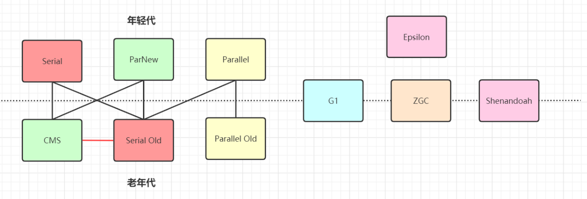
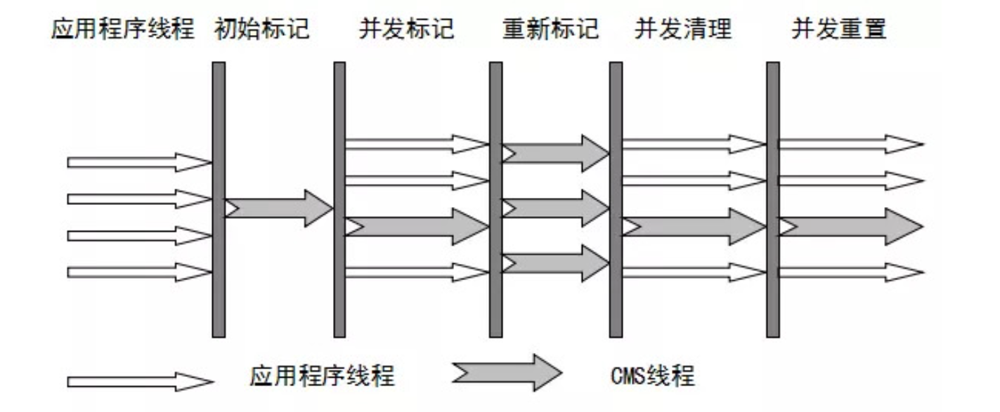
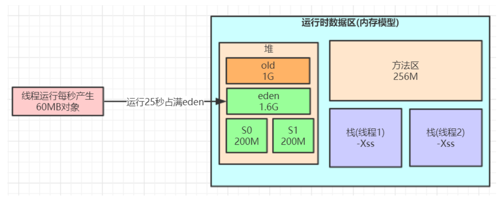
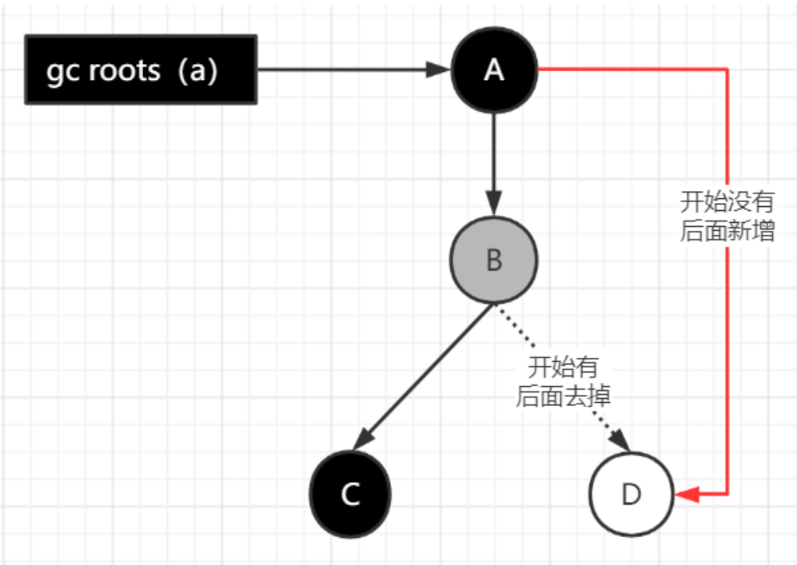
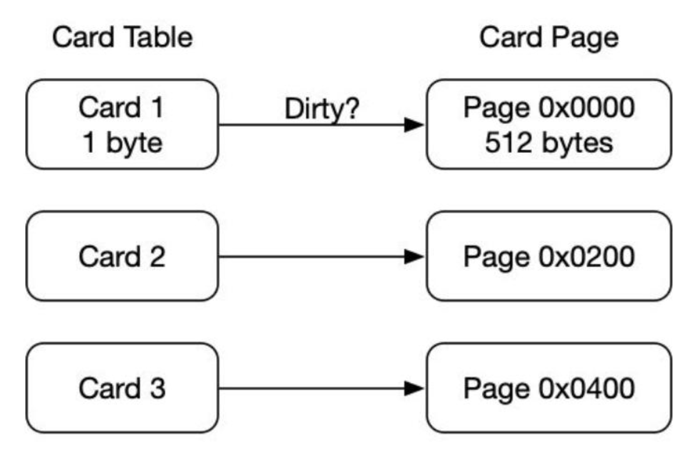

# JVM的垃圾收集1

## **垃圾收集算法**

**分代收集理论**

当前虚拟机的垃圾收集都采用**分代**收集算法，这种算法没有什么新的思想，只是根据对象存活周期的不同将内存分为几

块。一般将java堆分为新生代和老年代，这样我们就可以根据各个年代的特点选择合适的垃圾收集算法。

比如在新生代中，每次收集都会有大量对象(近99%)死去，所以可以选择复制算法，只需要付出少量对象的复制成本就可

以完成每次垃圾收集。而老年代的对象存活几率是比较高的，而且没有额外的空间对它进行分配担保，所以我们必须选

择“标记-清除”或“标记-整理”算法进行垃圾收集。

>  注意，“标记-清除”或“标记-整理”算法会比复制算法慢10倍以上,一般年轻代会用到标记复制因为朝生夕死，空间会比较够；老年代的对象大部分都会长期存活，空间宝贵，不适用标记复制

### **标记-复制算法**

它可以将内存分为大小相同的两块，每次使用其中的一块。当这一块的内存使用完后，就将还存活的对象**复制到另一块**去，然后再把使用的空间一次清理掉。这样就使每次的内存回收都是**对内存区间的一半**进行回收。


### **标记 - 清除算法**

算法分为 “标记” 和 “清除” 阶段：标记存活的对象， 统一回收所有未被标记的对象 (一般选择这种)；也可以反过来，标记出所有需要回收的对象，在标记完成后统一回收所有被标记的对象 。它是最基础的收集算法，比较简单，但是会带来两个明显的问题：

- 效率问题  (如果需要标记的对象太多，**效率不高**)

- 空间问题（标记清除后会产生大量**不连续的碎片**）


### **标记 - 整理算法**

根据老年代的特点特出的一种标记算法，**标记过程仍然与 “标记 - 清除” 算法一样**，但后续步骤不是直接对可回收对象回收，而是让所有存活的对象**向一端移动**，然后直接清理掉**端边界以外的内存**。


## 垃圾收集器



如果说收集算法是内存回收的方法论，那么垃圾收集器就是内存回收的**具体实现**。

虽然我们对各个收集器进行比较，但并非为了挑选出一个最好的收集器。因为直到现在为止还没有最好的垃圾收集器出现，更加没有万能的垃圾收集器，**我们能做的就是根据具体应用场景选择适合自己的垃圾收集器**。

### 1.1 Serial 收集器 

(-XX:+UseSerialGC：年轻代Serial  -XX:+UseSerialOldGC  老年代Serial)

Serial（串行）收集器是最基本、历史最悠久的垃圾收集器了。大家看名字就知道这个收集器是一个单线程收集器了。它的 **“单线程”** 的意义不仅仅意味着它只会使用一条垃圾收集线程去完成垃圾收集工作，更重要的是它在进行垃圾收集工作的时候**必须暂停其他所有的工作线程**（ **"Stop The World"** ），直到它收集结束。

**新生代采用复制算法，老年代采用标记 - 整理算法。**

它**简单而高效（与其他收集器的单线程相比）**。Serial 收集器由于没有线程交互的开销，自然可以获得很高的单线程收集效率。

**Serial Old 主要有两大用途：一种用途是在 JDK1.5 以及以前的版本中与 Parallel Scavenge 收集器搭配使用，**另一种用途是**作为 CMS 收集器的后备方案**。

> 为什么是后备方案呢？当cms并发收集失败时会使用Serial old


### 1.2 Parallel Scavenge 收集器 

(-XX:+UseParallelGC (年轻代), -XX:+UseParallelOldGC (老年代))

**Parallel** 收集器其实**就是 Serial 收集器的多线程版本**，除了使用多线程进行垃圾收集外，其余行为（控制参数、收集算法、回收策略等等）和 Serial 收集器类似。默认的**收集线程数跟 cpu 核数相同**，当然也可以用参数 **(-XX:ParallelGCThreads)** 指定收集线程数，但是一般不推荐修改。

Parallel Scavenge 收集器关注点是**吞吐量**（高效率的利用 CPU）。CMS 等垃圾收集器的关注点更多的是**用户线程的停顿时间**（提高用户体验）。所谓吞吐量就是 CPU 中用于运行用户代码的时间与 CPU 总消耗时间的比值。 

**新生代采用复制算法，老年代采用标记 - 整理算法。**

Parallel Old 收集器是 Parallel Scavenge 收集器的老年代版本。使用多线程和 “标记 - 整理” 算法。在**注重吞吐量以及 CPU 资源**的场合，都可以优先考虑 Parallel Scavenge 收集器和 Parallel Old 收集器     <u> **(JDK8 默认的新生代和老年代收集器**)。</u>


### 1.3 ParNew 收集器 

(-XX:+UseParNewGC)

ParNew 收集器其实**跟 Parallel 收集器很类似**，区别主要在于它可以和 CMS 收集器配合使用。

它是许多运行在 Server 模式下的虚拟机的**首要选择**。除了 Serial 收集器外，只有它能与 CMS 收集器配合工作。


### 1.4 CMS 收集器

 (-XX:+UseConcMarkSweepGC(old))

CMS收集器是一种以获取**最短回收停顿时间**为目标的收集器。它非常符合在注重**用户体验**的应用上使用，它是 HotSpot 虚拟机第一款真正意义上的**并发收集器**，它第一次实现了让**垃圾收集线程与用户线程（基本上）同时工作**。

从名字中的 **Mark Sweep** 这两个词可以看出，CMS 收集器是一种 **“标记 - 清除”** 算法实现的，它的运作过程相比于前面几种垃圾收集器来说更加复杂一些。整个过程分为四个步骤：

- **初始标记：** 暂停所有的其他线程 (STW)，并记录下 gc roots **直接能引用的对象**，**速度很快**，所以stw很短。

- **并发标记：** 并发标记阶段就是从 GC Roots 的直接关联对象开始遍历整个对象图的过程， 这个过程耗时较长但是不需要停顿用户线程， 可以与垃圾收集线程一起**并发运行**。因为用户程序继续运行，可能会有导致**已经标记过的对象状态发生改变**。

- **重新标记：** 重新标记阶段就是为了修正并发标记期间因为用户程序继续运行而导致标记**产生变动的那一部分对象**的标记记录 (主要是处理**漏标**问题)，这个阶段的停顿时间一般会比初始标记阶段的时间稍长，远远比并发标记阶段时间短。主要用到**三色标记**里的**增量更新**算法做重新标记。

  >  也会stw，但是时间也很短，主要针对那些并发标记途中产生变动有问题的对象

- **并发清理：** 开启用户线程，同时 GC 线程开始对未标记的区域做清扫。这个阶段如果有新增对象会被标记为黑色不做任何处理 。

- **并发重置：**重置本次 GC 过程中的标记数据。



从它的名字就可以看出它是一款优秀的垃圾收集器，主要优点：**并发收集、低停顿**。

但是它有下面几个明显的缺点：

- 对 CPU 资源敏感（会和服务抢资源）；

- 无法处理**浮动垃圾** (在并发标记和并发清理阶段又产生垃圾，这种浮动垃圾只能等到下一次 gc 再清理了)；

- 它使用的回收算法 -**“标记 - 清除” 算法**会导致收集结束时会有**大量空间碎片**产生，当然通过参数 - **XX:+UseCMSCompactAtFullCollection** 可以让 jvm 在执行完标记清除后再做整理

- 执行过程中的不确定性，会存在上一次垃圾回收还没执行完，然后垃圾回收又被触发的情况，**特别是在并发标记和并发清理阶段会出现**，一边回收，系统一边运行，也许没回收完就**再次触发 full gc**，也就是 "concurrent mode failure"，**此时会进入 stop the world，用 serial old 垃圾收集器来回收**

  

**CMS 的相关核心参数**

**ImportantSign**

- -XX:+UseConcMarkSweepGC：启用 cms 

- -XX:ConcGCThreads：并发的 GC 线程数

- **-XX:+UseCMSCompactAtFullCollection：**FullGC 之后做**压缩整理**（减少碎片）

- -XX:CMSFullGCsBeforeCompaction：多少次 FullGC 之后压缩一次，默认是 0，代表每次 FullGC 后都会压缩一次  `与上一条组合使用，如果不配置的话就是0`

- **-XX:CMSInitiatingOccupancyFraction:**  **当老年代使用达到该比例时会触发 FullGC（默认是 92，这是百分比）**

  > 留一点空间避免concurrent mode failure收集失败

- -XX:+UseCMSInitiatingOccupancyOnly：只使用设定的回收阈值 (-XX:CMSInitiatingOccupancyFraction 设定的值)，如果不指定，JVM 仅在第一次使用设定值，后续则会**自动调整**

  > 和元空间的21M回收差不多

- -XX:+CMSScavengeBeforeRemark：在 CMS GC 前启动一次 minor gc，降低 CMS GC 标记阶段 **(**也会对**年轻代一起做标记**，如果在 minor gc 就干掉了很多对垃圾对象，标记阶段就会减少一些标记时间**)** 时的开销，一般 CMS 的 GC 耗时 80% 都在标记阶段`开不开问题不大。`

  > 对于跨代引用的场景CMS也会对年轻代的对象进行标记，而这是很耗时间的，所以先minorgc一次。但这种场景**很少出现**

- **-XX:+CMSParallellnitialMarkEnabled：**表示在初始标记的时候多线程执行，缩短 STW`默认开启`

- **-XX:+CMSParallelRemarkEnabled**：在重新标记的时候多线程执行，缩短 STW`默认开启`

### **亿级流量电商系统如何优化 JVM 参数设置 (ParNew+CMS)**

> 上一章是ps+po



**对于 8G 内存，我们一般是分配 4G 内存给 JVM，正常的 JVM 参数配置如下：**

```java
-Xms3072M -Xmx3072M -Xss1M -XX:MetaspaceSize=256M -XX:MaxMetaspaceSize=256M  -XX:SurvivorRatio=8
```

这样设置可能会由于**动态对象年龄判断原则**`对象大于S区50%`导致频繁 full gc，于是我们可以更新下 JVM 参数设置：

```java
-Xms3072M -Xmx3072M -Xmn2048M -Xss1M -XX:MetaspaceSize=256M -XX:MaxMetaspaceSize=256M  -XX:SurvivorRatio=8 
```

这样就降低了因为对象动态年龄判断原则导致的对象频繁进入老年代的问题，其实**很多优化无非就是让短期存活的对象尽量都留在 survivor 里，不要进入老年代，这样在 minor gc 的时候这些对象都会被回收，不会进到老年代从而导致 full gc**。

`优化的核心思想，既要重要的对象早点进入老年代避免移来移去浪费性能，又要及时清理无用对象省出空间`

> 年轻代的内存空间是很重要的！！！

对于对象年龄应该为多少才移动到老年代比较合适，本例中一次 minor gc 要间隔二三十秒，大多数对象一般**在几秒内就会变为垃圾**，完全可以将默认的 15 岁改小一点，比如改为 5，那么意味着对象要经过 5 次 minor gc 才会进入老年代，整个时间也有一两分钟了，如果对象这么长时间都没被回收，完全可以认为这些对象是会存活的比较长的对象，可以移动到老年代，而不是继续一直占用 survivor 区空间。

> 大部分对象很快就变成垃圾，那么那些没有很快就变成垃圾的对象大概率就不是垃圾，我们就减少年龄判断

对于多大的对象直接进入老年代 (参数 -XX:PretenureSizeThreshold)，这个一般可以结合你自己系统看下有没有什么大对象生成，预估下大对象的大小，一般来说设置为 1M 就差不多了，很少有超过 1M 的大对象，这些对象一般就是你系统初始化分配的缓存对象，比如大的缓存 List，Map 之类的对象

```java
-Xms3072M -Xmx3072M -Xmn2048M -Xss1M  -XX:MetaspaceSize=256M -XX:MaxMetaspaceSize=256M  -XX:SurvivorRatio=8 
-XX:MaxTenuringThreshold=5 -XX:PretenureSizeThreshold=1M 
```

### 优化

对于 JDK8 默认的垃圾回收器是 - XX:+UseParallelGC (年轻代) 和 - XX:+UseParallelOldGC (老年代)，如果内存较大 (超过 **4 个 G**，只是经验值)，系统对**停顿时间比较敏感**，我们可以使用 **ParNew+CMS(**-XX:+UseParNewGC -XX:+UseConcMarkSweepGC**)**

对于老年代 CMS 的参数如何设置我们可以思考下，首先我们想下当前这个系统有哪些对象可能会长期存活躲过 5 次以上 minor gc 最终进入老年代。

无非就是那些 Spring 容器里的 Bean，线程池对象，一些初始化缓存数据对象等，这些加起来充其量也就几十 MB。

还有就是某次 minor gc 完了之后**还有超过一两百 M 的对象存活，那么就会直接进入老年代**，比如突然某一秒瞬间要处理五六百单，那么每秒生成的对象可能有一百多 M，再加上整个系统可能压力剧增，一个订单要好几秒才能处理完，下一秒可能又有很多订单过来。

我们可以估算下大概每隔五六分钟出现一次这样的情况，那么大概半小时到一小时之间就可能因为老年代满了触发一次 Full GC，Full GC 的触发条件还有我们之前说过的**老年代空间分配担保机制**，历次的 minor gc 挪动到老年代的对象大小肯定是非常小的，所以几乎不会在 minor gc 触发之前由于老年代空间分配担保失败而产生 full gc，其实在半小时后发生 full gc，这时候已经过了抢购的最高峰期，后续可能几小时才做一次 FullGC。

对于碎片整理，因为都是 1 小时或几小时才做一次 FullGC，是可以每做完一次就开始碎片整理，或者两到三次之后再做一次也行。

**综上，只要年轻代参数设置合理，老年代 CMS 的参数设置基本都可以用默认值，**如下所示：

```java
-Xms3072M -Xmx3072M -Xmn2048M -Xss1M  -XX:MetaspaceSize=256M -XX:MaxMetaspaceSize=256M  -XX:SurvivorRatio=8 
-XX:MaxTenuringThreshold=5 -XX:PretenureSizeThreshold=1M -XX:+UseParNewGC -XX:+UseConcMarkSweepGC 
-XX:CMSInitiatingOccupancyFraction=92 -XX:+UseCMSCompactAtFullCollection -XX:CMSFullGCsBeforeCompaction=3
```


## **垃圾收集底层算法实现**

### **三色标记**

**在并发标记的过程中，因为标记期间应用线程还在继续跑，对象间的引用可能发生变化，多标和漏标的情况就有可能发生。漏标的问题主要引入了三色标记算法来解决。**

**三色标记算法是把 Gc roots 可达性分析遍历对象过程中遇到的对象， 按照 “是否访问过” 这个条件标记成以下三种颜色：**

- **黑色**： 表示对象已经被垃圾收集器访问过， 且这个对象的所有引用都已经扫描过。 黑色的对象代表已经扫描过， 它是安全存活的， 如果有其他对象引用指向了黑色对象， 无须重新扫描一遍。 黑色对象不可能直接（不经过灰色对象） 指向某个白色对象。

- **灰色**： 表示对象已经被垃圾收集器访问过， 但这个对象上至少存在一个引用还没有被扫描过。

- **白色**： 表示对象尚未被垃圾收集器访问过。 显然在可达性分析刚刚开始的阶段， 所有的对象都是白色的， 若在分析结束的阶段， 仍然是白色的对象， 即代表不可达。



#### **多标 - 浮动垃圾**

在并发标记过程中，如果由于方法运行结束导致部分局部变量 (gcroot) 被销毁，这个 gcroot 引用的对象之前又被扫描过 (被标记为非垃圾对象)，那么本轮 GC 不会回收这部分内存。这部分本应该回收但是没有回收到的内存，被称之为 “**浮动垃圾**”。浮动垃圾并不会影响垃圾回收的正确性，只是需要等到下一轮垃圾回收中才被清除。

另外，**针对并发标记 (还有并发清理) 开始后产生的新对象，通常的做法是直接全部当成黑色**，本轮不会进行清除。这部分对象期间可能也会变为垃圾，这也算是浮动垃圾的一部分。

> 对于先前标黑但是过程中又被舍弃的对象jvm不作处理，等待下次gc处理
>
> 并发过程中产生的新的对象也都统统标黑，不做处理

#### **漏标 - 读写屏障**

漏标会导致被引用的对象被当成垃圾误删除，这是严重 bug，必须解决，有两种解决方案： **增量更新（Incremental Update） 和原始快照（Snapshot At The Beginning，SATB） 。**

**增量更新**就是当黑色对象插入新的指向白色对象的引用关系时， 就将这个新插入的引用记录下来， 等并发扫描结束之后， 再将这些记录过的引用关系中的黑色对象为根， 重新扫描一次。 这可以简化理解为， **黑色对象一旦新插入了指向白色对象的引用之后， 它就变回灰色对象了,既然是灰色那就肯定还有没被标记的，那就再扫描一次也就是增量  `实际上并没有真把黑标灰，而是记录下来`**。

**原始快照**就是当**灰色对象要删除指向白色对象的引用关系**时， 就将这个要删除的引用记录下来， 在并发扫描结束之后， 再将这些记录过的引用关系中的灰色对象为根， 重新扫描一次，这样就能扫描到白色的对象，将白色对象直接标记为黑色 (**目的就是让这种对象在本轮 gc 清理中能存活下来，待下一轮 gc 的时候重新扫描，这个对象也有可能是浮动垃圾**)

以上无论是对引用关系记录的插入还是删除， 虚拟机的记录操作都是通过**写屏障**实现的。 

> 什么是写屏障？在删除和新增引用这种修改操作时，会像aop一样在这个操作之前把这个操作的信息记录下来，以此来实现增量更新和原始快照

对于读写屏障，以 Java HotSpot VM 为例，其并发标记时对漏标的处理方案如下：

- **CMS：写屏障 + 增量更新**

- **G1，Shenandoah：写屏障 + SATB**

- **ZGC：读屏障**


**为什么 G1 用 SATB？CMS 用增量更新？**

SATB 相对增量更新效率会高 (当然 SATB 可能造成更多的浮动垃圾)，因为不需要在重新标记阶段再次深度扫描被删除引用对象，而 CMS 对增量引用的根对象会做深度扫描，G1 因为很多对象都位于不同的 region，CMS 就一块老年代区域，**重新深度扫描对象的话 G1 的代价会比 CMS 高，所以 G1 选择 SATB 不深度扫描对象，只是简单标记，等到下一轮 GC 再深度扫描**


#### **记忆集与卡表**



一个卡页中可包含多个对象，只要有一个对象的字段存在跨代指针，其对应的卡表的元素标识就变成 1，表示该元素变脏，否则为 0.

GC 时，只要筛选本收集区的卡表中变脏的元素加入 GCRoots 里。

> 垃圾收集场景中，收集器只需通过记忆集判断出某一块非收集区域是否存在指向收集区域的指针即可，无需了解跨代引用指针的全部细节

