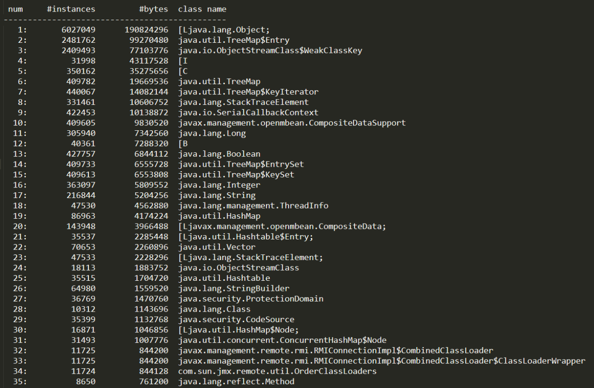
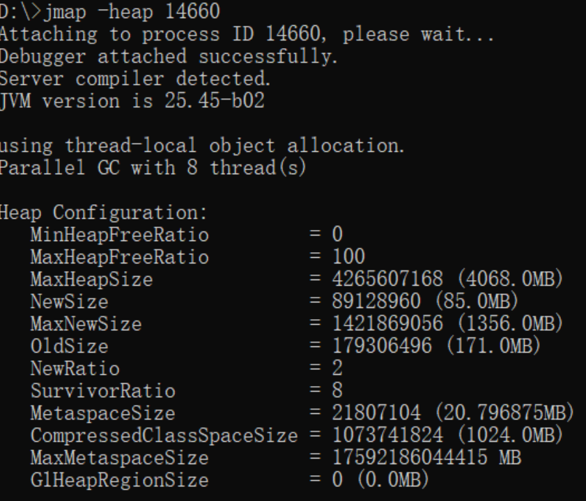
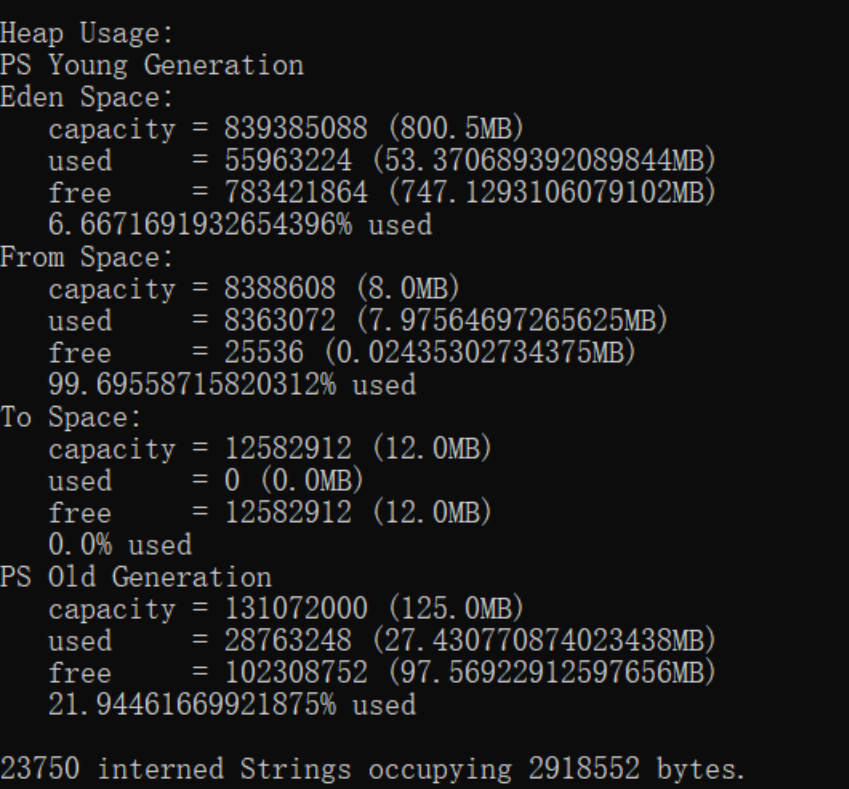
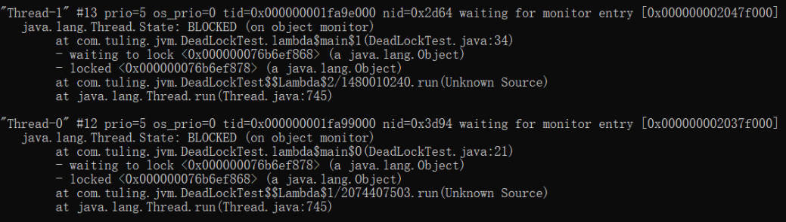
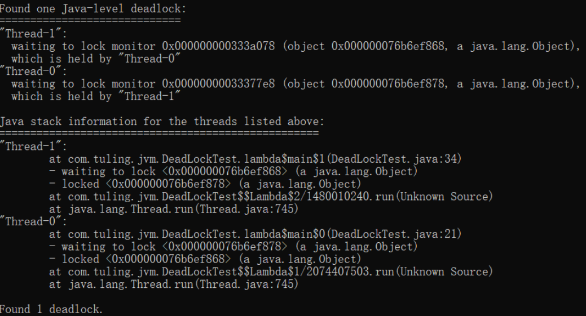
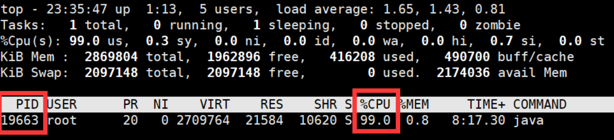
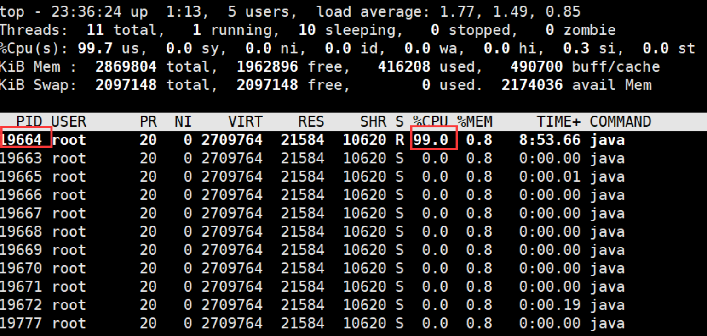
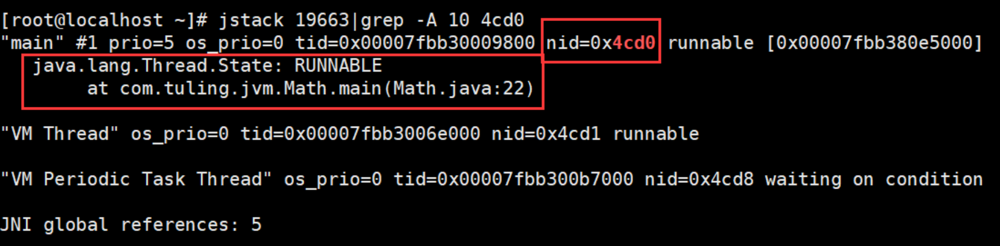
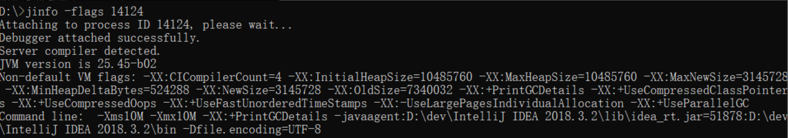

# JVM调优

**前置启动程序**

事先启动一个 web 应用程序，**用 jps 查看其进程 id**，接着用各种 jdk 自带命令优化应用

## **Jmap** （查看内存）

此命令可以用来查看内存信息，实例个数以及占用内存大小

```java
jmap -histo 14660 >./log.txt    #查看历史生成的实例,一般生成到文件中看
jmap -histo:live 14660  #查看当前存活的实例，执行过程中可能会触发一次full gc
```

打开 log.txt，文件内容如下：



- num：序号

- instances：实例数量

- bytes：占用空间大小

- class name：类名称（[C is a char[]，[S is a short[]，[I is a int[]，[B is a byte[]）

### 堆信息

jmap -heap (进程id)





> Eden Space eden区；From Space,To Space :两个Surivor区，Old Generation：老年代区


### **导出堆内存 dump**

导出堆内存快照信息成文件

```java
jmap -dump:format=b,file=eureka(名称) .hprof 14660
```

也可以设置内存溢出自动导出 dump 文件 (内存很大的时候，可能会导不出来)

1. -XX:+HeapDumpOnOutOfMemoryError

2. -XX:HeapDumpPath=./  （路径）

> 需要提前设置，在发生oom时可以查看原因


## **Jstack** （查看死锁，查看cpu）

### 用 jstack 加进程 id 查找死锁

```java
public class DeadLockTest {
   private static Object lock1 = new Object();
   private static Object lock2 = new Object();
   public static void main(String[] args) {
      new Thread(() -> {
         synchronized (lock1) {
            try {
               System.out.println("thread1 begin");
               Thread.sleep(5000);
            } catch (InterruptedException e) {}
            synchronized (lock2) {
               System.out.println("thread1 end");
            }
         }
      }).start();
 
      new Thread(() -> {
         synchronized (lock2) {
            try {
               System.out.println("thread2 begin");
               Thread.sleep(5000);
            } catch (InterruptedException e) {}
            synchronized (lock1) {
               System.out.println("thread2 end");
            }
         }
      }).start();
      System.out.println("main thread end");
   }
}
```



- "Thread-1" 线程名 

- prio=5 优先级 = 5

- tid=0x000000001fa9e000 线程 id

- nid=0x2d64 线程对应的本地线程标识 nid

- java.lang.Thread.State: BLOCKED 线程状态

> 实际上jstack打印的是所有线程的详细信息，但是如果进程中有死锁，在打印结果的最后会自动帮你找到死锁




### **jstack 找出占用 cpu 最高的线程信息**

```java
public class Math {
 
    public static final int initData = 666;
    public static User user = new User();
 
    public int compute() {  //一个方法对应一块栈帧内存区域
        int a = 1;
        int b = 2;
        int c = (a + b) * 10;
        return c;
    }
 
    public static void main(String[] args) {
        Math math = new Math();
        while (true){
            math.compute();
        }
    }
}
```

1. 使用命令 top -p <pid> ，显示你的 java 进程的内存情况，pid 是你的 java 进程号，比如 19663 `jps查找的`



2. 按 H  (Shift+h)，获取每个线程的内存情况



3.  找到最吃cpu的线程:找到内存和 cpu 占用最高的线程 tid，比如 19664

4. 转为十六进制得到 0x4cd0，此为线程 id 的十六进制表示`将19664转化为16进制`，再进行如下操作
5. 执行 jstack 19663|grep -A 10 <u>4cd0</u>，得到线程堆栈信息中 4cd0 这个线程所在行的后面 10 行，从堆栈中可以发现导致 cpu 飙高的调用方法




## **Jinfo** (查看 jvm 的参数)




## ***Jstat** (查看堆内存,最重要) <Badge type="error">最重要</Badge>

:::info{title=注意}

jstat 命令可以查看堆内存各部分的使用量，以及加载类的数量。命令的格式如下：

:::

jstat [- 命令选项] [vmid] [间隔时间 (毫秒)] [查询次数]

### 垃圾回收统计

**jstat -gc pid 最常用**，可以评估程序内存使用及 GC 压力整体情况

- S0C：第一个幸存区的大小，单位 KB

- S1C：第二个幸存区的大小

- S0U：第一个幸存区的使用大小

- S1U：第二个幸存区的使用大小

- EC：伊甸园区的大小

- EU：伊甸园区的使用大小

- OC：老年代大小

- OU：老年代使用大小

- MC：方法区大小 (元空间)

- MU：方法区使用大小

- CCSC: 压缩类空间大小 `不看`

- CCSU: 压缩类空间使用大小  `不看`

- YGC：年轻代垃圾回收次数  <Badge type="error">重要</Badge>

- YGCT：年轻代垃圾回收消耗时间，单位 s

- FGC：老年代垃圾回收次数  <Badge type="error">重要</Badge>

- FGCT：老年代垃圾回收消耗时间，单位 s

- GCT：垃圾回收消耗总时间，单位 s

### 其他命令

jstat -gccapacity (进程id)  :堆内存统计

jstat -gcnew  (进程id) :新生代垃圾回收统计

jstat -gcnewcapacity (进程id)  :新生代堆内存统计

jstat -gcold (进程id) :老年代垃圾回收统计

jstat -gcoldcapacity (进程id)  :老年代堆内存统计

jstat -gcmeta (进程id) :元空间垃圾回收统计

jstat -gcmetacapacity (进程id)  :元空间堆内存统计


## **JVM 运行情况预估**

用 jstat gc -pid 命令可以计算出如下一些关键数据，有了这些数据就可以采用之前介绍过的优化思路，先给自己的系统设置一些初始性的 JVM 参数，比如堆内存大小，年轻代大小，Eden 和 Survivor 的比例，老年代的大小，大对象的阈值，大龄对象进入老年代的阈值等。

- **年轻代对象增长的速率**

可以执行命令 jstat -gc pid 1000 10 (每隔 1 秒执行 1 次命令，共执行 10 次)，通过观察 EU (eden 区的使用) 来估算每秒 eden 大概新增多少对象，如果系统负载不高，可以把频率 1 秒换成 1 分钟，甚至 10 分钟来观察整体情况。注意，一般系统可能有高峰期和日常期，所以需要在不同的时间分别估算不同情况下对象增长速率。

- **Young GC 的触发频率和每次耗时**

知道年轻代对象增长速率我们就能推根据 eden 区的大小推算出 Young GC 大概多久触发一次，Young GC 的平均耗时可以通过 YGCT/YGC 公式算出，根据结果我们大概就能知道**系统大概多久会因为 Young GC 的执行而卡顿多久。**

- **每次 Young GC 后有多少对象存活和进入老年代**

这个因为之前已经大概知道 Young GC 的频率，假设是每 5 分钟一次，那么可以执行命令 jstat -gc pid 300000 10 ，观察每次结果 eden，survivor 和老年代使用的变化情况，在每次 gc 后 eden 区使用一般会大幅减少，survivor 和老年代都有可能增长，这些增长的对象就是每次 Young GC 后存活的对象，同时还可以看出每次 Young GC 后进去老年代大概多少对象，从而可以推算出**老年代对象增长速率。**

- **Full GC 的触发频率和每次耗时**

知道了老年代对象的增长速率就可以推算出 Full GC 的触发频率了，Full GC 的每次耗时可以用公式 FGCT/FGC 计算得出。

> **优化思路**其实简单来说就是尽量让**每次 Young GC 后的存活对象小于 Survivor 区域的 50%**，都留存在年轻代里。尽量别让对象进入老年代。尽量减少 Full GC 的频率，避免频繁 Full GC 对 JVM 性能的影响。


**内存泄露到底是怎么回事**

再给大家讲一种情况，一般电商架构可能会使用多级缓存架构，就是 redis 加上 JVM 级缓存，大多数同学可能为了图方便对于 JVM 级缓存就简单使用一个 hashmap，于是不断往里面放缓存数据，但是很少考虑这个 map 的容量问题，结果这个缓存 map 越来越大，一直占用着老年代的很多空间，时间长了就会导致 full gc 非常频繁，这就是一种内存泄漏，**对于一些老旧数据没有及时清理导致一直占用着宝贵的内存资源，时间长了除了导致 full gc，还有可能导致 OOM**

这种情况完全可以考虑采用一些成熟的 JVM 级缓存框架来解决，比如 ehcache 等自带一些 LRU 数据淘汰算法的框架来作为 JVM 级的缓存。

> 让某一个缓存一直被使用直到放入old区并且不断往里面放数据

