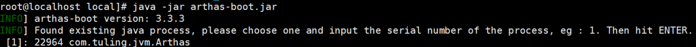
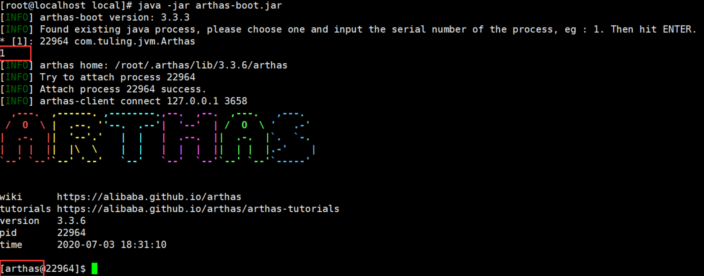
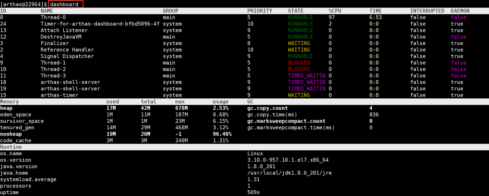
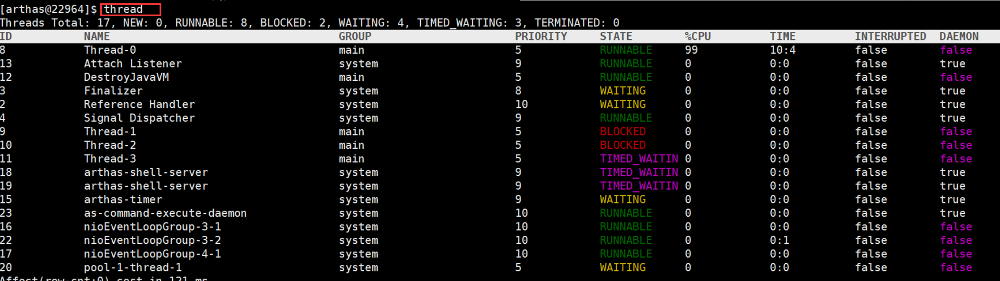
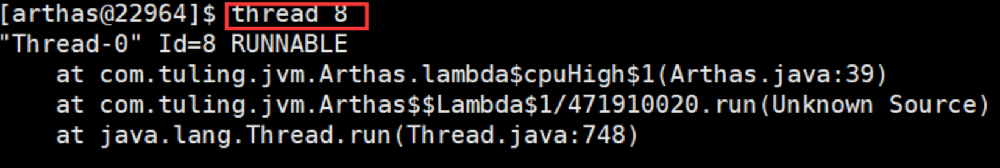
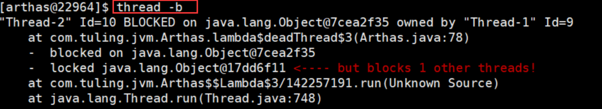
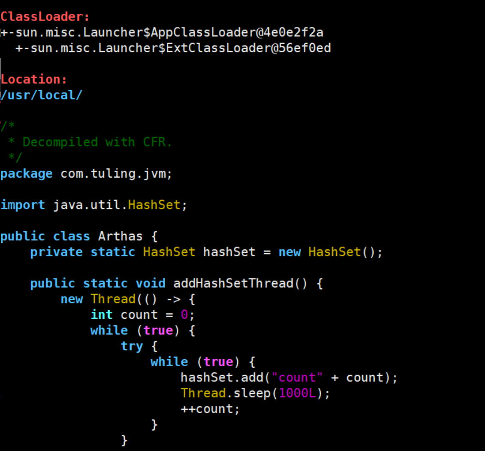
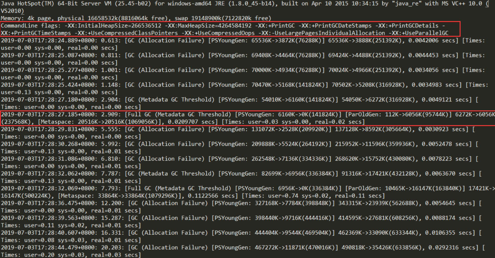

# JVM调优

## **阿里巴巴Arthas详解**

**Arthas** 是 Alibaba 在 2018 年 9 月开源的 **Java 诊断**工具。支持 JDK6+， 采用命令行交互模式，可以方便的定位和诊断

线上程序运行问题。**Arthas** 官方文档十分详细，详见：https://alibaba.github.io/arthas

###  **Arthas** **使用**

```java
# linux 系统上
# github下载arthas
wget https://alibaba.github.io/arthas/arthas-boot.jar
# 或者 Gitee 下载
wget https://arthas.gitee.io/arthas-boot.jar
```

用 java -jar 运行即可，可以识别机器上所有 Java 进程



```java
import java.util.HashSet;
 
public class Arthas {
    private static HashSet hashSet = new HashSet();
    public static void main(String[] args) {
        // 模拟 CPU 过高
        cpuHigh();
        // 模拟线程死锁
        deadThread();
        // 不断的向 hashSet 集合增加数据
        addHashSetThread();
    }
 
    /**
     * 不断的向 hashSet 集合添加数据
     */
    public static void addHashSetThread() {
        // 初始化常量
        new Thread(() -> {
            int count = 0;
            while (true) {
                try {
                    hashSet.add("count" + count);
                    Thread.sleep(1000);
                    count++;
                } catch (InterruptedException e) {
                    e.printStackTrace();
                }
            }
        }).start();
    }
    
    public static void cpuHigh() {
        new Thread(() -> {
            while (true) {
            }
        }).start();
    }
 
    /**
     * 死锁
     */
    private static void deadThread() {
        Object resourceA = new Object();
        Object resourceB = new Object();
        // 创建线程
        Thread threadA = new Thread(() -> {
            synchronized (resourceA) {
                System.out.println(Thread.currentThread() + " get ResourceA");
                try {
                    Thread.sleep(1000);
                } catch (InterruptedException e) {}
                System.out.println(Thread.currentThread() + "waiting get resourceB");
                synchronized (resourceB) {
                    System.out.println(Thread.currentThread() + " get resourceB");
                }
            }
        });
        Thread threadB = new Thread(() -> {
            synchronized (resourceB) {
                System.out.println(Thread.currentThread() + " get ResourceB");
                try {
                    Thread.sleep(1000);
                } catch (InterruptedException e) {}
                System.out.println(Thread.currentThread() + "waiting get resourceA");
                synchronized (resourceA) {
                    System.out.println(Thread.currentThread() + " get resourceA");
                }
            }
        });
        threadA.start();
        threadB.start();
    }
}
```

1. 选择进程序号 1，进入列表中的某个进程信息操作



2. 输入 **dashboard** 可以查看整个进程的运行情况，线程、内存、GC、运行环境信息：



3. 输入 **thread** 可以查看线程详细情况



4. 输入 **thread 加上线程 ID** 可以查看线程堆栈



5. 输入 **thread -b** 可以查看线程死锁



6. **输入 jad 加类的全名 可以反编译，这样可以方便我们查看线上代码是否是正确的版本**




## **GC 日志详解**

对于 java 应用我们可以通过一些配置把程序运行过程中的 gc 日志全部打印出来，然后分析 gc 日志得到关键性指标，分析 GC 原因，调优 JVM 参数。

### 打印 GC 日志方法

在 JVM 参数里增加参数，% t 代表时间

```java
java -jar -Xloggc:./gc-%t.log -XX:+PrintGCDetails -XX:+PrintGCDateStamps  -XX:+PrintGCTimeStamps -XX:+PrintGCCause  
-XX:+UseGCLogFileRotation -XX:NumberOfGCLogFiles=10 -XX:GCLogFileSize=100M microservice-eureka-server.jar
```

### **如何分析 GC 日志**

 JVM 刚启动的一部分 GC 日志 :



图中第一行红框是项目的配置参数。这里不仅配置了打印 GC 日志，还有相关的 VM 内存参数。 

第二行红框中的是在这个 GC 时间点发生 GC 之后相关 GC 情况。 

1. 对于 **2.909：**  这是从 jvm 启动开始计算到这次 GC 经过的时间，前面还有具体的发生时间日期。 

2. Full GC (Metadata GC Threshold) 指这是一次 full gc，括号里是 gc 的原因， PSYoungGen 是年轻代的 GC，ParOldGen 是老年代的 GC，Metaspace 是元空间的 GC

3. 6160K->0K (141824K)，这三个数字分别对应 GC 之前占用年轻代的大小，GC 之后年轻代占用，以及整个年轻代的大小。 

4. 112K->6056K (95744K)，这三个数字分别对应 GC 之前占用老年代的大小，GC 之后老年代占用，以及整个老年代的大小。 

5. 6272K->6056K (237568K)，这三个数字分别对应 GC 之前占用堆内存的大小，GC 之后堆内存占用，以及整个堆内存的大小。 

6. 20516K->20516K (1069056K)，这三个数字分别对应 GC 之前占用元空间内存的大小，GC 之后元空间内存占用，以及整个元空间内存的大小。 

7. 0.0209707 是该时间点 GC 总耗费时间。 

从日志可以发现几次 fullgc 都是由于元空间不够导致的，所以我们可以将元空间调大点

```java
 -XX:MetaspaceSize=256M -XX:MaxMetaspaceSize=256M 
```

 

对于 CMS 和 G1 收集器的日志会有一点不一样，也可以试着打印下对应的 gc 日志分析下

CMS:

```java
-Xms50M -Xmx50M -XX:MetaspaceSize=256M -XX:MaxMetaspaceSize=256M -XX:+UseParNewGC -XX:+UseConcMarkSweepGC   
```

G1:

```java
-Xms50M -Xmx50M -XX:MetaspaceSize=256M -XX:MaxMetaspaceSize=256M  XX:GCLogFileSize=100M -XX:+UseG1GC 
```


但是如果 GC 日志很多很多，成千上万行。就算你一目十行，看完了，脑子也是一片空白。所以我们可以借助一些功能来帮助我们分析，这里推荐一个 **gceasy** ([https://gceasy.io](https://gceasy.io/))，可以上传 gc 文件，然后他会利用可视化的界面来展现 GC 情况。

> 这个工具还可以提供参数修改建议，不过要花钱。主要还是图形化界面