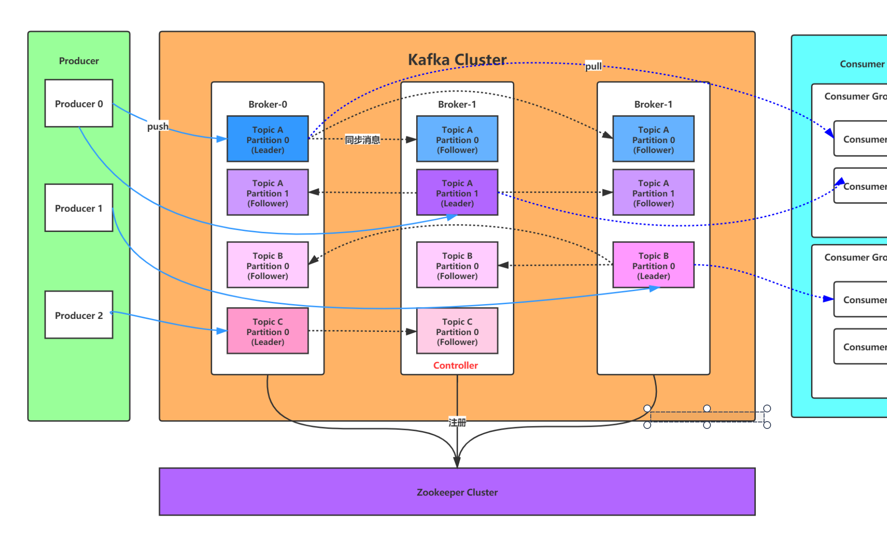
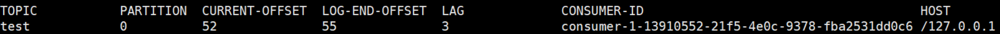
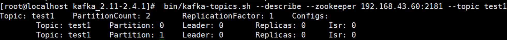
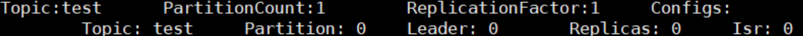
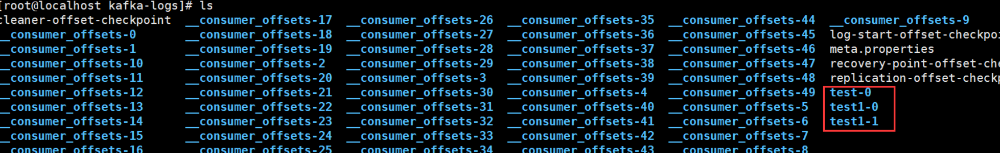
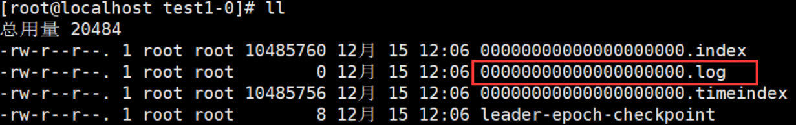

# Kafka入门

Kafka是最初由Linkedin公司开发，是一个**分布式、支持分区的（partition）、多副本的（replica），基于zookeeper协调的分布式消息系统**

它的最大的特性就是可以**实时的处理大量数据以满足各种需求场景**：比如基于hadoop的批处理系统、低延迟的实时系统、Storm/Spark流式处理引擎，web/nginx日志、访问日志，消息服务等等，Kafka用scala语言编写，Linkedin于2010年贡献给了Apache基金会并成为顶级开源 项目


## **Kafka的使用场景**

- **日志收集：**一个公司可以用Kafka收集各种服务的log，**通过kafka以统一接口服务的方式开放给各种consumer，例如hadoop、Hbase、Solr等**

- **消息系统：**解耦和生产者和消费者、缓存消息等。

- **用户活动跟踪：**Kafka经常被用来**记录web用户或者app用户的各种活动**，如浏览网页、搜索、点击等活动，这些活动信息被各个服务器发布到kafka的topic中，然后订阅者通过订阅这些topic来做实时的监控分析，或者装载到hadoop、数据仓库中做**离线分析和挖掘**。

- **运营指标：**Kafka也经常用来**记录运营监控数据**。包括收集各种分布式应用的数据，生产各种操作的集中反馈，比如报警和报告


## **Kafka基本概念**

kafka是一个分布式的，分区的消息(官方称之为`commit log`)服务。它提供一个消息系统应该具备的功能，但是确有着独特的设计。

基础的消息`(Message)`相关术语：

| **名称**      | **解释**                                                     |
| ------------- | ------------------------------------------------------------ |
| Broker        | 消息中间件处理节点，一个Kafka节点就是一个broker，一个或者多个Broker可以组成一个Kafka集群 |
| Topic         | Kafka根据topic对消息进行归类，发布到Kafka集群的**每条消息都需要指定一个topic** |
| Producer      | 消息生产者，向Broker发送消息的客户端                         |
| Consumer      | 消息消费者，从Broker读取消息的客户端                         |
| ConsumerGroup | 每个Consumer属于一个特定的Consumer Group，**一条消息可以被多个不同的Consumer Group消费，但是一个Consumer Group中只能有一个Consumer能够消费该消息！** |
| Partition     | 物理上的概念，一个topic可以分为多个partition，每个partition内部消息是有序的 |

因此，从一个较高的层面上来看，producer通过网络发送消息到Kafka集群，然后consumer来进行消费



> 服务端(brokers)和客户端(producer、consumer)之间通信通过**TCP协议**来完成


## kafka基本使用`命令行`

### server.properties核心配置

| **Property**        | **Default**                    | **Description**                                              |
| ------------------- | ------------------------------ | ------------------------------------------------------------ |
| broker.id           | 0                              | 每个broker都可以用一个唯一的**非负整数id进行标识**；这个id可以作为broker的“名字”，你可以选择任意你喜欢的数字作为id，只要id是唯一的即可。 |
| log.dirs            | /tmp/kafka-logs                | kafka存放数据的路径。这个路径并不是唯一的，可以是多个，路径之间只需要使用逗号分隔即可；有多个路径时，当创建新partition，都会选择在包含最少partitions的路径下进行以求负载均衡 |
| listeners           | PLAINTEXT://192.168.65.60:9092 | server接受客户端连接的端口，ip配置kafka本机ip即可            |
| zookeeper.connect   | localhost:2181                 | zooKeeper连接字符串的格式为：`hostname:port`，此处hostname和port分别是ZooKeeper集群中某个节点的host和port；zookeeper如果是集群，连接方式为`hostname1:port1, hostname2:port2, hostname3:port3` |
| log.retention.hours | 168(7天)                       | 每个日志文件删除之前保存的时间。默认数据保存时间对所有topic都一样。 |
| min.insync.replicas | 1(一个分区写成功就算成功)      | 指定每个分区的最小副本数，它定义了在生产者发送消息时需要等待的最小副本数量，以确认消息写入操作的成功 |
| delete.topic.enable | false                          | 是否允许删除主题                                             |

### **创建主题**

创建一个名字为“test”的Topic，这个topic只有一个partition，并且备份因子也设置为1：

```sh
bin/kafka‐topics.sh ‐‐create ‐‐zookeeper 192.168.65.60:2181 ‐‐replication‐factor 1 ‐‐partitions 1 ‐‐topic test
```

> - `bin/kafka‐topics.sh` Kafka 的一个 Shell 脚本，用于管理 Kafka 主题。
> - `--create`: 表示要创建一个新的主题。
> - `--zookeeper 192.168.65.60:2181`: 用于指定 Zookeeper 的连接地址。Zookeeper 用于管理 Kafka 集群的元数据信息，包括主题、分区、副本等。
> - `--replication‐factor 1`: 用于指定主题的副本因子。在这个例子中，副本因子被设置为 1，表示每个分区只有一个副本。
> - `--partitions 1`: 用于指定主题的分区数。在这个例子中，主题只有一个分区。
> - `--topic test`: 要创建的主题的名称

现在我们可以通过以下命令来查看kafka中目前存在的topic

```sh
bin/kafka‐topics.sh ‐‐list ‐‐zookeeper 192.168.65.60:2181
```

除了我们通过手工的方式创建Topic，当producer发布一个消息到某个指定的Topic，这个Topic如果不存在，就自动创建。

**删除主题**

```sh
bin/kafka‐topics.sh ‐‐delete ‐‐topic test ‐‐zookeeper 192.168.65.60:2181
```


### **发送消息**

kafka自带了一个producer命令客户端，可以从本地文件中读取内容，或者我们也可以以命令行中直接输入内容，并将这些内容以消息的形式发送到kafka集群中。

在默认情况下，每一个行会被当做成一个独立的消息。首先我们要运行发布消息的脚本，然后在命令中输入要发送的消息的内容：

```sh
# 运行发布消息脚本
bin/kafka‐console‐producer.sh ‐‐broker‐list 192.168.65.60:9092 ‐‐topic test
>this is a msg
>this is a another msg
```


### **消费消息**

对于consumer，kafka同样也携带了一个命令行客户端，会将获取到内容在命令中进行输出，**默认是消费最新的消息**：

```sh
bin/kafka‐console‐consumer.sh ‐‐bootstrap‐server 192.168.65.60:9092 ‐‐topic test
```

如果想要消费之前的消息可以通过`--from-beginning`参数指定，如下命令：

```sh
bin/kafka‐console‐consumer.sh ‐‐bootstrap‐server 192.168.65.60:9092 ‐‐from‐beginning ‐‐topic test
```

如果是通过不同的终端窗口来运行以上的命令，将会看到在producer终端输入的内容，很快就会在consumer的终端窗口上显示出来。

以上所有的命令都有一些附加的选项；当我们不携带任何参数运行命令的时候，将会显示出这个命令的详细用法。

**一个消费者消费多主题**

```sh
bin/kafka‐console‐consumer.sh ‐‐bootstrap‐server 192.168.65.60:9092 ‐‐whitelist "test|test‐2"
```

- **单播消费**

  一条消息只能被某一个消费者消费的模式，类似queue模式，只需让所有消费者在同一个消费组里即可分别在两个客户端执行如下消费命令，然后往主题里发送消息，结果只有一个客户端能收到消息

  ```sh
  bin/kafka‐console‐consumer.sh ‐‐bootstrap‐server 192.168.65.60:9092 ‐‐consumer‐property group.id=testGroup ‐‐topic test
  ```

- **多播消费**

  一条消息能被多个消费者消费的模式，类似`publish-subscribe`模式，针对Kafka同一条消息只能被同一个消费组下的某一个消

  费者消费的特性，要实现多播只要保证这些消费者属于不同的消费组即可。

  **我们再增加一个消费者，该消费者属于testGroup-2消费组，两个客户端都能收到消息**

  ```sh
  bin/kafka‐console‐consumer.sh ‐‐bootstrap‐server 192.168.65.60:9092 ‐‐consumer‐property group.id=testGroup‐2 ‐‐topic test
  ```

- **查看消费组名**

  ```sh
  bin/kafka‐consumer‐groups.sh ‐‐bootstrap‐server 192.168.65.60:9092 ‐‐list
  ```

- **查看消费组的消费偏移量**

  ```sh
   bin/kafka‐consumer‐groups.sh ‐‐bootstrap‐server 192.168.65.60:9092 ‐‐describe ‐‐group testGroup
  ```

  

  - **current-offset：**当前消费组的已消费偏移量
  - **log-end-offset：**主题对应分区消息的结束偏移量(HW)
  - **lag：**当前消费组未消费的消息数


## 主题Topic和消息日志Log

### Topic和log介绍

- **Topic**

  **Topic是一个类别的名称**，同类消息发送到同一个Topic下面。对于每一个Topic，下面可以有多个分区(**Partition)**日志文件

- **Partition**

  Partition是一个有序的message序列，这些message按顺序添加到一个叫做`commit log`的文件中。每个partition中的消息都有一个唯一的编号，称之为offset，用来唯一标示某个分区中的message。

**kafka一般不会删除消息，不管这些消息有没有被消费**。只会根据配置的日志保留时间`(log.retention.hours)`确认消息多久被删除，默认保留最近一周的日志消息。

> **kafka的性能与保留的消息数据量大小没有关系，因此保存大量的数据消息日志信息)不会有什么影响，也就是说kafka不怕消息积压**

- 日志Log

  每个consumer是基于自己在commit log中的`消费进度(offset)`来进行工作的。

  在kafka中，消费offset由consumer自己来维护；一般情况下我们按照顺序逐条消费commit log中的消息，当然可以通过指定offset来重复消费某些消息，或者跳过某些消息

  这意味kafka中的consumer对集群的影响是非常小的，添加一个或者减少一个consumer，对于集群或者其他consumer来说，都是没有影响的，**因为每个consumer维护各自的消费offset**


### 查看topic

**创建多个分区的主题：**

```sh
bin/kafka‐topics.sh ‐‐create ‐‐zookeeper 192.168.65.60:2181 ‐‐replication‐factor 1 ‐‐partitions 2 ‐‐topic test1
```

这里创建了主题test1，下面有两个分区`‐‐partitions 2`

**查看下topic的情况**

```sh
bin/kafka‐topics.sh ‐‐describe ‐‐zookeeper 192.168.65.60:2181 ‐‐topic test1
```



以下是输出内容的解释，第一行是所有分区的概要信息，之后的每一行表示每一个partition的信息。

- **leader节点负责给定partition的所有读写请求**。

- **replicas 表示某个partition在哪几个broker上存在备份**。不管这个节点是不是leader，甚至这个节点挂了，也会列出。
- **isr 是replicas的一个子集，它只列出当前还存活着的，并且已同步备份了该partition的节点**

运行相同的命令查看之前创建的名称为”test“的topic



之前设置了topic的partition数量为1，备份因子为1，因此显示就如上所示


### 查看log

可以进入kafka的数据文件存储目录查看test和test1主题的消息日志文件：



消息日志文件主要存放在分区文件夹里的以log结尾的日志文件里，如下是test1主题对应的分区0的消息日志



也可以通过如下命令增加topic的分区数量`(目前kafka不支持减少分区)`

```sh
bin/kafka‐topics.sh ‐alter ‐‐partitions 3 ‐‐zookeeper 192.168.65.60:2181 ‐‐topic test
```


### **理解Topic，Partition和Broker**

**一个topic，代表逻辑上的一个业务数据集，**比如按数据库里不同表的数据操作消息区分放入不同topic，订单相关操作消息放入订单topic，用户相关操作消息放入用户topic

对于大型网站来说，后端数据都是海量的，订单消息很可能是非常巨量的，比如有几百个G甚至达到TB级别，如果把这么多数据都放在一台机器上可定会有容量限制问题，**那么就可以在topic内部划分多个partition来分片存储数据**，不同的partition可以位于不同的机器上，每台机器上都运行一个Kafka的进程Broker。

**为什么要对Topic下数据进行分区存储？**

1. commit log文件会受到所在机器的文件系统大小的限制，分区之后，理论上一个topic可以处理任意数量的数据，摆脱了物理限制
2. 为了**提高并行度**


