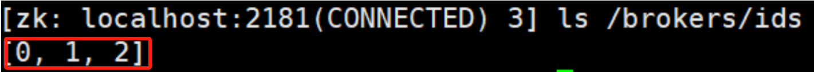
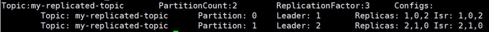
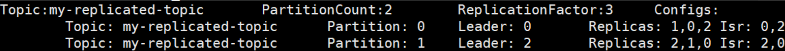
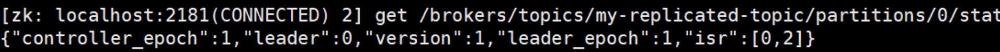
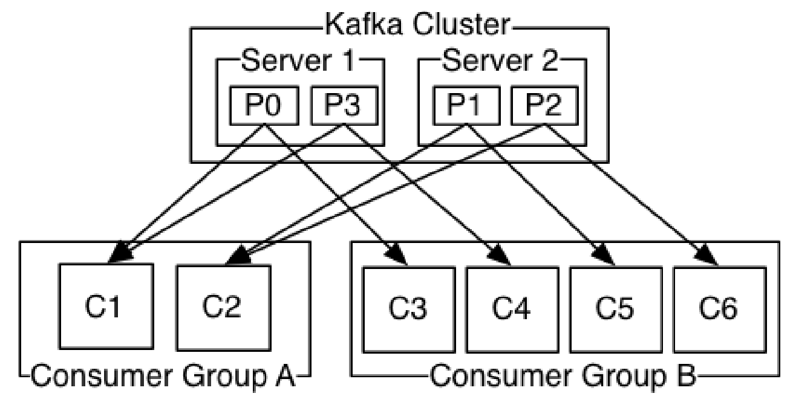

# Kafka编码

## **kafka集群**

### 集群使用

对于kafka来说，一个单独的broker意味着kafka集群中只有一个节点。要想增加kafka集群中的节点数量，**只需要多启动几个broker实例即可**。

假设现在我们在一台机器上同时启动三个broker实例

首先，我们需要建立好其他2个broker的配置文件：

```shell
cp config/server.properties config/server‐1.properties
cp config/server.properties config/server‐2.properties
```

配置文件的需要修改的内容分别如下：

**config/server-1.properties:**

```properties
#broker.id属性在kafka集群中必须要是唯一
broker.id=1
#kafka部署的机器ip和提供服务的端口号
listeners=PLAINTEXT://192.168.65.60:9093
log.dir=/usr/local/data/kafka‐logs‐1
#kafka连接zookeeper的地址，要把多个kafka实例组成集群，对应连接的zookeeper必须相同
zookeeper.connect=192.168.65.60:2181
```

**config/server-2.properties:**

```properties
broker.id=2
listeners=PLAINTEXT://192.168.65.60:9094
log.dir=/usr/local/data/kafka‐logs‐2
zookeeper.connect=192.168.65.60:2181
```

目前已经有一个zookeeper实例和一个broker实例在运行了，**现在只需要启动2个broker实例即可**

```sh
bin/kafka‐server‐start.sh ‐daemon config/server‐1.properties
bin/kafka‐server‐start.sh ‐daemon config/server‐2.properties
```

**查看zookeeper确认集群节点是否都注册成功：**



**创建一个新的topic，副本数设置为3，分区数设置为2：**

```shell
bin/kafka‐topics.sh ‐‐create ‐‐zookeeper 192.168.65.60:2181 ‐‐replication‐factor 3 ‐‐partitions 2 ‐‐topic my‐replicated‐topic
```

**查看下topic**

```shell
bin/kafka‐topics.sh ‐‐describe ‐‐zookeeper 192.168.65.60:2181 ‐‐topic my‐replicated‐topic
```



以下是输出内容的解释，第一行是所有分区的概要信息，之后的每一行表示每一个partition的信息。

- leader节点负责给定partition的所有读写请求，同一个主题不同分区leader副本一般不一样(为了容灾)
- replicas 表示某个partition在哪几个broker上存在备份。不管这个几点是不是leader，甚至这个节点挂了，也会列出
- isr 是replicas的一个子集，它只列出当前还存活着的，并且已同步备份了该partition的节点

> 可见kafka的横向扩容很简单，它的集群是相对分区partition来说的，不是相对broker来说的


**向新建的 my-replicated-topic 中发送一些message**

```sh
bin/kafka‐console‐producer.sh ‐‐broker‐list 192.168.65.60:9092,192.168.65.60:9093,192.168.65.60:9094 ‐‐topic my‐replicated‐topic
>my test msg 1
>my test msg 2
```

**开始消费：**

```sh
bin/kafka‐console‐consumer.sh ‐‐bootstrap‐server 192.168.65.60:9092,192.168.65.60:9093,192.168.65.60:9094 ‐‐from‐beginning ‐‐topic my‐replicated‐topic
my test msg 1
my test msg 2
```

**测试容错性**

因为broker1目前是my-replicated-topic的分区0的leader，所以我们要将其kill

```sh
ps ‐ef | grep server.properties
kill 14776
```

再执行命令查看topic

```
bin/kafka‐topics.sh ‐‐describe ‐‐zookeeper 192.168.65.60:9092 ‐‐topic my‐replicated‐topic
```



分区0的leader节点此时已经变成了broker 0

> 要注意的是，在Isr中，已经没有了1号节点。leader的选举也是从ISR(in-sync replica)中进行的。

此时依然可以消费新消息：

```sh
bin/kafka‐console‐consumer.sh ‐‐bootstrap‐server 192.168.65.60:9092,192.168.65.60:9093,192.168.65.60:9094 ‐‐from‐beg
inning ‐‐topic my‐replicated‐topic
my test msg 1
my test msg 2
```

**查看主题分区对应的leader信息：**



**可见kafka将很多集群关键信息记录在zookeeper里，保证自己的`无状态`，从而在水平扩容时非常方便**


### **集群消费**

log的partitions分布在kafka集群中不同的broker上，每个broker可以请求备份其他broker上partition上的数据。kafka集群支持配置一个partition备份的数量。

针对每个partition，都有一个broker起到leader的作用，0个或多个其他的broker作为follwers的作用。

**leader处理所有的针对这个partition的读写请求，而followers被动复制leader的结果**。

如果这个leader失效了，其中的一个follower将会自动的变成新的leader`选举机制`

- **Producers**

  生产者将消息发送到topic中去，同时负责选择将message发送到topic的哪一个partition中。通过round­-robin`轮询`做简单的负载均衡，也可以根据消息中的某一个关键字来进行区分

- **Consumers**

  传统的消息传递模式有2种：**队列( queue) 和（publish-subscribe）**

  - **queue模式：**多个consumer从服务器中读取数据，消息只会到达一个consumer
  - **publish-subscribe模式：**消息会被广播给所有的consumer

  Kafka基于这2种模式提供了一种consumer的抽象概念：`consumer group`

  - **queue模式：**所有的consumer都位于同一个consumer group 下。

  - **publish-subscribe模式：**所有的consumer都有着自己唯一的consumer group。

  > 结合之前的，同样的消息只能被不同group中的消费者消费，而不能被同一group的消费者消费

  官方图示：

  

- **消费顺序**

  - 一个partition同一个时刻在一个consumer group中只能有一个consumer instance在消费，从而保证消费顺序。

  - consumer group中的consumer instance的数量不能比一个Topic中的partition的数量多，否则，多出来的consumer消费不到消息。

  **Kafka只在partition的范围内保证消息消费的局部顺序性，不能在同一个topic中的多个partition中保证总的消费顺序性**

  如果有在总体上保证消费顺序的需求，那么我们可以通过将topic的partition数量设置为1，将consumer group中的

  consumer instance数量也设置为1，**但是这样会影响性能，所以kafka的顺序消费很少用**


## **Java客户端访问Kafka**

引入maven依赖

```xml
<dependency>
	<groupId>org.apache.kafka</groupId>
	<artifactId>kafka‐clients</artifactId>
	<version>2.4.1</version>
</dependency>
```

### **消息发送端代码：**

```java
public class MsgProducer {

	private final static String TOPIC_NAME = "my‐replicated‐topic";
	
	public static void main(String[] args) throws InterruptedException, ExecutionException {
		Properties props = new Properties();
        //指定了Kafka集群的地址
        //即使只指定了一个地址，只要其他broker的信息在Zookeeper中可用，Kafka客户端仍然能够正常连接到Kafka集群并发送消息,但是如果仅有的指定的这个挂了也无法连接
		props.put(ProducerConfig.BOOTSTRAP_SERVERS_CONFIG, "192.168.65.60:9092,192.168.65.60:9093,192.168.65.60:9094");


 		Producer<String, String> producer = new KafkaProducer<String, String>(props);
		int msgNum = 5;
		final CountDownLatch countDownLatch = new CountDownLatch(msgNum);
		for (int i = 1; i <= msgNum; i++) {
			Order order = new Order(i, 100 + i, 1, 1000.00);
			//未指定发送分区，具体发送的分区计算公式：hash(key)%partitionNum
			ProducerRecord<String, String> producerRecord = new ProducerRecord<String, String>(TOPIC_NAME,order.getOrderId().toString(), JSON.toJSONString(order));
			//等待消息发送成功的同步阻塞方法
			RecordMetadata metadata = producer.send(producerRecord).get();
			System.out.println("同步方式发送消息结果：" + "topic‐" + metadata.topic() + "|partition‐" + metadata.partition() + "|offset‐" + metadata.offset());
            
			//发送成功后的其他业务代码....

 		}
        //当前线程等待，直到计数器减少到零或者等待超过5秒钟（无论哪个条件先满足）再往下走
		countDownLatch.await(5, TimeUnit.SECONDS);
 		producer.close();
	}
}
```

**发出消息持久化机制参数**

- acks=0： 表示producer不需要等待任何broker确认收到消息的回复，就可以继续发送下一条消息。**性能最高，但是最容易丢消息**。

- acks=1： 至少要等待leader已经成功将数据写入本地log，但是不需要等待所有follower是否成功写入。就可以继续发送下一条消息。这种情况下，如果follower没有成功备份数据，而此时leader又挂掉，则消息会丢失。

- acks=‐1或all： 需要等待 `min.insync.replicas`(默认为1，推荐配置大于等于2) 这个参数配置的副本个数都成功写入日志，这种策略会保证只要有一个备份存活就不会丢失数据。这是最强的数据保证。**一般除非是金融级别，或跟钱打交道的场景才会使用这种配置**

```java
props.put(ProducerConfig.ACKS_CONFIG, "1");
```

**发送失败重试：**

默认重试间隔100ms，重试能保证消息发送的可靠性，但是也可能造成消息重复发送，比如网络抖动，所以需要在接收者那边做好消息接收的幂等性处理

```java
//遇到可重试的错误时，生产者会尝试重新发送消息最多3次
props.put(ProducerConfig.RETRIES_CONFIG, 3);
```

**重试间隔设置**

```java
props.put(ProducerConfig.RETRY_BACKOFF_MS_CONFIG, 300);
```

**设置发送消息的本地缓冲区**

如果设置了该缓冲区，消息会先发送到本地缓冲区，可以提高消息发送性能，默认值是33554432，即32MB

```java
props.put(ProducerConfig.BUFFER_MEMORY_CONFIG, 33554432);
```

这样kafka本地线程会从缓冲区取数据，批量发送到broker

**设置批量发送消息的大小**

默认值是16384，即16kb，就是说一个batch满了16kb就发送出去

```java
props.put(ProducerConfig.BATCH_SIZE_CONFIG, 16384);
```

**发送间隔**

默认值是0，意思就是消息必须立即被发送，但这样会影响性能

一般设置10毫秒左右，就是说这个消息发送完后会进入本地的一个batch，如果10毫秒内，这个batch满了16kb就会随batch一起被发送出去

如果10毫秒内，batch没满，那么也必须把消息发送出去，不能让消息的发送延迟时间太长

```java
props.put(ProducerConfig.LINGER_MS_CONFIG, 10);
```

**消息序列化**

把发送的key从字符串序列化为字节数组

```java
props.put(ProducerConfig.KEY_SERIALIZER_CLASS_CONFIG, StringSerializer.class.getName());
```

把发送消息value从字符串序列化为字节数组

```java
props.put(ProducerConfig.VALUE_SERIALIZER_CLASS_CONFIG, StringSerializer.class.getName());
```

**发送时指定发送分区**

```java
ProducerRecord<String, String> producerRecord = new ProducerRecord<String, String>(TOPIC_NAME , 0,order.getOrderId().toString(), JSON.toJSONString(order));
```

> - `ProducerRecord<String, String>`: 创建一个生产者记录，其中指定了键（key）和值（value）的类型，这里都是字符串类型。
> - `TOPIC_NAME`: 这是要发送消息的Kafka主题的名称。
> - `0`: 这是可选的分区（partition）编号，指定了消息将发送到哪个分区。在这里，使用了固定的分区0。
> - `order.getOrderId().toString()`: 这是消息的键（key），通常用于确定消息应该发送到哪个分区。这里使用了订单的ID作为键。
> - `JSON.toJSONString(order)`: 这是消息的值（value），使用JSON格式化了订单对象，并将其转换为字符串以便发送到Kafka

**异步回调方式发送消息**

```java
producer.send(producerRecord, new Callback() {
    //当消息发送完成时，Kafka生产者会调用这个方法，并传递发送结果和可能的异常
	public void onCompletion(RecordMetadata metadata, Exception exception) {
        //如果发送过程中出现了异常
		if (exception != null) {
			System.err.println("发送消息失败：" + exception.getStackTrace());
		}
        //如果消息发送成功
 		if (metadata != null) {
			System.out.println("异步方式发送消息结果：" + "topic‐" + metadata.topic() + "|partition‐"+ metadata.partition() + "|offset‐" + metadata.offset());
		}
        countDownLatch.countDown();
 	}
});
```


### 消息接收端代码：

```java
public class MsgConsumer {
    //主题名称
	private final static String TOPIC_NAME = "my‐replicated‐topic";
    //消费者group名称
	private final static String CONSUMER_GROUP_NAME = "testGroup";

	public static void main(String[] args) {
		Properties props = new Properties();
		props.put(ConsumerConfig.BOOTSTRAP_SERVERS_CONFIG, "192.168.65.60:9092,192.168.65.60:9093,192.168.65.60:9094");
		//放入消费分组名
		props.put(ConsumerConfig.GROUP_ID_CONFIG, CONSUMER_GROUP_NAME);
        
		//是否自动提交offset，默认就是true
        //如果设置为false，则消费者不会自动提交消费位移，需要手动调用commitSync()或commitAsync()方法来提交位移
		props.put(ConsumerConfig.ENABLE_AUTO_COMMIT_CONFIG, "true");
		//自动提交offset的间隔时间
		props.put(ConsumerConfig.AUTO_COMMIT_INTERVAL_MS_CONFIG, "1000");
        
		//服务端broker多久感知不到一个consumer心跳就认为他故障了，会将其踢出消费组，对应的Partition也会被重新分配给其他consumer，默认是10秒
		props.put(ConsumerConfig.SESSION_TIMEOUT_MS_CONFIG, 10 * 1000);


		//如果两次poll操作间隔超过了这个时间，broker就会认为这个consumer处理能力太弱，会将其踢出消费组，将分区分配给别的consumer消费
		props.put(ConsumerConfig.MAX_POLL_INTERVAL_MS_CONFIG, 30 * 1000);
        
        //消息序列化
		props.put(ConsumerConfig.KEY_DESERIALIZER_CLASS_CONFIG, StringDeserializer.class.getName());
		props.put(ConsumerConfig.VALUE_DESERIALIZER_CLASS_CONFIG, StringDeserializer.class.getName());
        
		KafkaConsumer<String, String> consumer = new KafkaConsumer<String, String>(props);
		consumer.subscribe(Arrays.asList(TOPIC_NAME));

		//消费指定分区
		consumer.assign(Arrays.asList(new TopicPartition(TOPIC_NAME, 0)));


		while (true) {
		//poll() API 是拉取消息的长轮询
			ConsumerRecords<String, String> records = consumer.poll(Duration.ofMillis(1000));
			for (ConsumerRecord<String, String> record : records) {
				System.out.printf("收到消息：partition = %d,offset = %d, key = %s, value = %s%n",record.partition(),
				record.offset(), record.key(), record.value());
         }
            
		if (records.count() > 0) {
			// 手动同步提交offset，当前线程会阻塞直到offset提交成功
			consumer.commitSync();
			// 手动异步提交offset，当前线程提交offset不会阻塞，可以继续处理后面的程序逻辑
			consumer.commitAsync(new OffsetCommitCallback() {
				@Override
				public void onComplete(Map<TopicPartition, OffsetAndMetadata> offsets, Exception exception) {
					if (exception != null) {
						System.err.println("Commit failed for " + offsets);
						System.err.println("Commit failed exception: " + exception.getStackTrace());
					}
				}	
			});
		}
	}
}
```

**消费方式**

当消费主题的是一个新的消费组，或者指定offset的消费方式，offset不存在，那么应该如何消费？

- latest(默认) ：只消费自己启动之后发送到主题的消息

- **earliest：第一次从头开始消费，以后按照消费offset记录继续消费**，这个需要区别于`consumer.seekToBeginning(每次都从头开始消费)`

```java
props.put(ConsumerConfig.AUTO_OFFSET_RESET_CONFIG, "earliest");
```

**心跳响应**	

设置consumer给broker发送心跳的间隔时间

broker接收到心跳如果此时有rebalance发生会通过心跳响应将rebalance方案下发给consumer，较短的心跳间隔可以使broker更快地检测到消费者的状态变化，并更及时地执行再平衡操作，从而提高系统的响应速度，但太频繁的心跳可能会增加网络负载

```java
props.put(ConsumerConfig.HEARTBEAT_INTERVAL_MS_CONFIG, 1000);
```

**消息回溯消费**

```java
consumer.assign(Arrays.asList(new TopicPartition(TOPIC_NAME, 0)));
consumer.seekToBeginning(Arrays.asList(new TopicPartition(TOPIC_NAME, 0)));
```

第一行代码将消费者分配到指定主题（`TOPIC_NAME`）的指定分区（0号分区）。通过使用 `assign` 方法，你手动分配了消费者所负责的分区，而不是使用消费者组进行自动分配。

第二行代码将消费者的读取位置设置到指定分区（0号分区）的起始位置，也就是消息的开头。这样设置后，消费者将从该分区的最早消息开始消费

**指定offset消费**

```java
consumer.assign(Arrays.asList(new TopicPartition(TOPIC_NAME, 0)));
consumer.seek(new TopicPartition(TOPIC_NAME, 0), 10);
```

第一行将消费者分配到指定主题（`TOPIC_NAME`）的指定分区（0号分区）。通过使用 `assign` 方法，你手动分配了消费者所负责的分区，而不是使用消费者组进行自动分配。

第二行代码将消费者的读取位置设置到指定分区（0号分区）的偏移量为10的位置。这意味着消费者将从该分区的第11条消息开始消费。这里的偏移量是以消息的编号为单位的，从0开始计数

**指定时间开始消费**

```java
// 获取指定主题的分区信息
List<PartitionInfo> topicPartitions = consumer.partitionsFor(TOPIC_NAME);
// 从1小时前开始消费
long fetchDataTime = new Date().getTime() - 1000 * 60 * 60;
// 构建分区到时间戳的映射
Map<TopicPartition, Long> map = new HashMap<>();
for (PartitionInfo par : topicPartitions) {
    map.put(new TopicPartition(TOPIC_NAME, par.partition()), fetchDataTime);
}
// 获取指定时间戳对应的偏移量
Map<TopicPartition, OffsetAndTimestamp> parMap = consumer.offsetsForTimes(map);
// 遍历分区和对应的偏移量
for (Map.Entry<TopicPartition, OffsetAndTimestamp> entry : parMap.entrySet()) {
    TopicPartition key = entry.getKey();
    OffsetAndTimestamp value = entry.getValue();
    // 跳过空键或空值
    if (key == null || value == null) continue;
    // 获取分区的偏移量
    Long offset = value.offset();
    // 打印分区和偏移量信息
    System.out.println("partition-" + key.partition() + "|offset-" + offset);
    System.out.println();
    // 根据消费者的时间戳确定偏移量
    if (value != null) {
        // 分配分区给消费者
        consumer.assign(Arrays.asList(key));
        // 设置消费者的读取位置到指定偏移量
        consumer.seek(key, offset);
    }
}
```


## **Spring Boot整合Kafka**

引入spring boot kafka依赖

```xml
<dependency>
    <groupId>org.springframework.kafka</groupId>
    <artifactId>spring-kafka</artifactId>
</dependency>
```

application.yml配置如下：

```yaml
server:
  port: 8080

spring:
  kafka:
    bootstrap-servers: 192.168.65.60:9092,192.168.65.60:9093,192.168.65.60:9094
    producer: # 生产者配置
      retries: 3 # 设置大于0的值，则客户端会将发送失败的记录重新发送
      batch-size: 16384
      buffer-memory: 33554432
      acks: 1
      # 指定消息key和消息体的编解码方式
      key-serializer: org.apache.kafka.common.serialization.StringSerializer
      value-serializer: org.apache.kafka.common.serialization.StringSerializer
    consumer: # 消费者配置
      group-id: default-group
      enable-auto-commit: false
      key-deserializer: org.apache.kafka.common.serialization.StringDeserializer
      value-deserializer: org.apache.kafka.common.serialization.StringDeserializer
```

发送者代码：

```java
@RestController
public class KafkaController {

    @Autowired
    private KafkaTemplate<String, String> kafkaTemplate;

    @RequestMapping("/send")
    public void send() {
        kafkaTemplate.send("mytopic", 0, "key", "this is a msg");
    }
}
```

消费者代码：

```java
@Component
public class MyConsumer {
    /**
     * 使用 @KafkaListener 注解监听名为 "mytopic" 的 Kafka 主题，并指定消费者组ID为 "testGroup"。
     * 消费者方法 listen() 接收 ConsumerRecord<String, String> 类型的消息记录。
     */
    @KafkaListener(topics = "mytopic", groupId = "testGroup")
    public void listen(ConsumerRecord<String, String> record) {
        String value = record.value();
        System.out.println(value);
        System.out.println(record);
    }
}
```

