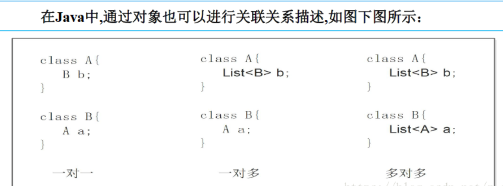
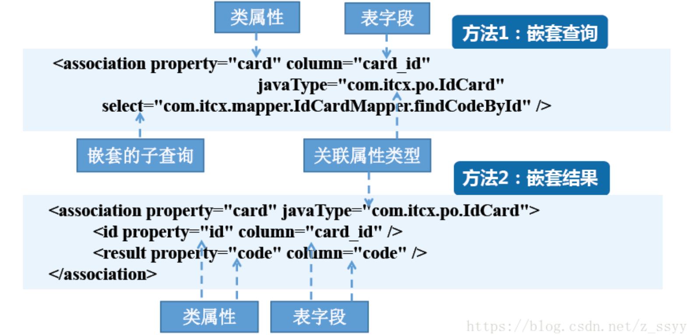
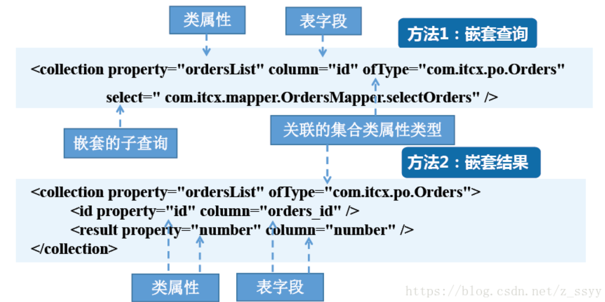

# MyBatis基于XML的详细使用-高级结果映射

## 联合查询

**emp.java**

```java
@Data
public class Emp {
    private Integer id;
    private String username;
    private LocalDate createDate;
    private deptId deptId;
}
```

**EmpMapper.xml**

```xml
<!-- 实现表联结查询的方式：  可以映射: DTO -->
<resultMap id="QueryEmp_Map" type="QueryEmpDTO">
    <id column="e_id" property="id"></id>
    <result column="user_name" property="username"></result>
    <result column="d_id" property="deptId"></result>
    <result column="dept_name" property="deptName"></result>
</resultMap>
 
<select id="QueryEmp"  resultMap="QueryEmp_Map">
    select t1.id as e_id,t1.user_name,t2.id as d_id,t2.dept_name from emp t1
    INNER JOIN dept t2 on t1.dept_id=t2.id
    where t1.id=#{id}
</select>
 
<!-- 实现表联结查询的方式：  可以映射map -->
<resultMap id="QueryEmp_Map" type="map">
    <id column="e_id" property="id"></id>
    <result column="user_name" property="username"></result>
    <result column="d_id" property="deptId"></result>
    <result column="dept_name" property="deptName"></result>
</resultMap>
 
<select id="QueryEmp"  resultMap="QueryEmp_Map">
    select t1.id as e_id,t1.user_name,t2.id as d_id,t2.dept_name from emp t1
    INNER JOIN dept t2 on t1.dept_id=t2.id
    where t1.id=#{id}
</select>
```

QueryEmpDTO

```java
public class QueryEmpDTO {
    private String deptName;
    private Integer deptId;
    private Integer id;
    private String username;
}
```

**Test**

```java
@Test
public void test01() {
    try(SqlSession sqlSession = sqlSessionFactory.openSession()){
        // Mybatis在getMapper就会给我们创建jdk动态代理
        EmpMapper mapper = sqlSession.getMapper(EmpMapper.class);
        QueryEmpDTO dto = mapper.QueryEmp(4);
        System.out.println(dto);
    }
}
```


## 嵌套结果

### 多对一

EmpMapper.xml

```xml
<resultMap id="QueryEmp_Map2" type="Emp">
    <id column="e_id" property="id"></id>
    <result column="user_name" property="username"></result>
    <!--association 实现多对一中的  “一” property 指定对象中的嵌套对象属性-->
    <association property="dept">
        <id column="d_id" property="id"></id>
        <id column="dept_name" property="deptName"></id>
    </association>
</resultMap>
 
<select id="QueryEmp2"  resultMap="QueryEmp_Map2">
    select 
    t1.id as e_id,
    t1.user_name,
    t2.id as d_id,
    t2.dept_name 
    from emp t1
    INNER JOIN dept t2 on t1.dept_id=t2.id
    where t1.id=#{id}
</select>
```

### 一对多

```xml
<!-- 嵌套结果： 一对多  查询部门及所有员工 -->
<resultMap id="SelectDeptAndEmpsMap" type="Dept">
    <id column="d_id"  property="id"></id>
    <id column="dept_name"  property="deptName"></id>
    <!--
    <collection  映射一对多中的 “多”
        property 指定需要映射的“多”的属性，一般声明为List
        ofType  需要指定list的类型
    -->
    <collection property="emps" ofType="Emp" >
        <id column="e_id" property="id"></id>
        <result column="user_name" property="username"></result>
        <result column="create_date" property="createDate"></result>
    </collection>
</resultMap>
 
<select id="SelectDeptAndEmps" resultMap="SelectDeptAndEmpsMap">
    select 
    t1.id as d_id,
    t1.dept_name,
    t2.id e_id,
    t2.user_name,
    t2.create_date 
    from dept t1
    LEFT JOIN emp t2 on t1.id=t2.dept_id
    where t1.id=#{id}
</select>
```

**Emp.java**

```java
public class Emp {
    private Integer id;
    private String username;
    private LocalDate createDate;
    private Dept dept;
}
```

**Dept.java:**

```java
public class Dept {
    private Integer id;
    private String deptName;
    private List<Emp> emps;
}
```

**EmpMapper.java:**

```java
public interface EmpMapper {
 
    /*实际开发中的实现方式*/
    QueryEmpDTO QueryEmp(Integer id);
 
    /*实用嵌套结果实现联合查询  多对一 */
    Emp QueryEmp2(Integer id);
 
    /*实用嵌套查询实现联合查询  多对一 */
    Emp QueryEmp3(Integer id);
}
```

**DeptMapper.java:**

```java
public interface DeptMapper {
    //嵌套查询： 一对多   使用部门id查询员工
   Dept SelectDeptAndEmps(Integer id);
 
   // 嵌套查询（异步查询）： 一对多  查询部门及所有员工
    Dept SelectDeptAndEmps2(Integer id);
}
```


## 延迟查询

当我们在进行表关联的时候，有可能在查询结果的时候不需要关联对象的属性值，那么此时可以通过延迟加载来实现功能。在全局配置文件中添加如下属性`mybatis-config.xml`

```xml
<!-- 开启延迟加载，所有分步查询都是懒加载 （默认是立即加载）-->
<setting name="lazyLoadingEnabled" value="true"/>
<!--当开启式， 使用pojo中任意属性都会加载延迟查询 ,默认是false
<setting name="aggressiveLazyLoading" value="false"/>-->
<!--设置对象的哪些方法调用会加载延迟查询   默认：equals,clone,hashCode,toString-->
<setting name="lazyLoadTriggerMethods" value=""/>
```

如果设置了全局加载，但是希望在某一个 sql 语句查询的时候不使用延时策略，可以添加 fetchType 下属性：

```xml
<association property="dept" fetchType="eager"  column="dept_id" select="cn.xxx.mapper.DeptMapper.SelectDept">
</association>
```


## 总结



三种关联 guan 关系都有两种关联查询的方式，嵌套查询，嵌套结果

*Mybatis 的 yanc 延迟加载配置

在全局配置文件中加入下面代码

```xml
<settings>
	<setting name=”lazyLoadingEnabled” value=”true” />
	<setting name=”aggressiveLazyLoading” value=”false”/>
</settings>
```

在映射文件中，`<association>` 元素和` < collection >` 元素中都已默认配置了延迟加载属性，即默认属性 `fetchType=”lazy”`（属性 `fetchType=”eager” `表示立即加载）, 所以在配置文件中开启延迟加载后，无需在映射文件中再做配置

### 一对一

使用` <association> `元素进行一对一关联映射非常简单，只需要参考如下两种示例配置即可



###  一对多

`<resultMap>` 元素中，包含了一个` < collection >` 子元素，MyBatis 就是通过该元素来处理一对多关联关系的

`<collection> `子元素的属性大部分与` < association > `元素相同，但其还包含一个特殊属性–ofType

`ofType `属性与` javaType `属性对应，它用于指定实体对象中集合类属性所包含的元素类型。

`<collection> `元素的使用也非常简单，同样可以参考如下两种示例进行配置，具体代码如下:



### 多对多

多对多的关联关系查询，同样可以使用前面介绍的 `<collection>` 元素进行处理（其用法和一对多关联关系查询语句用法基本相同）

