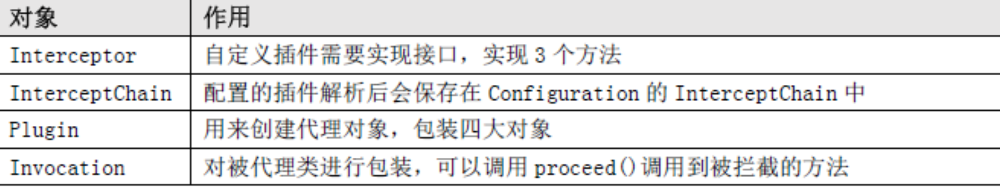

# MyBatis逆向工程&分页插件

## Mybatis 插件典型适用场景

- **分页功能**

  mybatis 的分页默认是基于内存分页的（查出所有，再截取），数据量大的情况下效率较低，不过使用 mybatis 插件可以改变该行为，只需要拦截 StatementHandler 类的 prepare 方法，改变要执行的 SQL 语句为分页语句即可；

- **公共字段统一赋值**

  一般业务系统都会有创建者，创建时间，修改者，修改时间四个字段，对于这四个字段的赋值，实际上可以在 DAO 层统一拦截处理，可以用 mybatis 插件拦截 Executor 类的 update 方法，对相关参数进行统一赋值即可；

- **性能监控**

  对于 SQL 语句执行的性能监控，可以通过拦截 Executor 类的 update, query 等方法，用日志记录每个方法执行的时间；

- **其它**

  其实 mybatis 扩展性还是很强的，基于插件机制，基本上可以控制 SQL 执行的各个阶段，如执行阶段，参数处理阶段，语法构建阶段，结果集处理阶段，具体可以根据项目业务来实现对应业务逻辑。


## **分页插件**

MyBatis 通过提供插件机制，让我们可以根据自己的需要去增强 MyBatis 的功能。

> 需要注意的是，如果没有完全理解 MyBatis 的运行原理和插件的工作方式，最好不要使用插件，因为它会改变系底层的工作逻辑，给系统带来很大的影响。

**MyBatis 的插件可以在不修改原来的代码的情况下，通过拦截的方式，改变四大核心对象的行为，比如处理参数，处理 SQL，处理结果**


**实现思考：**

- **第一个问题：**

  不修改对象的代码，怎么对对象的行为进行修改，比如说在原来的方法前面做一点事情，在原来的方法后面做一点事情？

  **答案：大家很容易能想到用`代理模式`，这个也确实是 MyBatis 插件的原理。**

- **第二个问题：**

  我们可以定义很多的插件，那么这种所有的插件会形成一个链路，比如我们提交一个休假申请，先是项目经理审批，然后是部门经理审批，再是 HR 审批，再到总经理审批，**怎么实现层层的拦截？**

  **答案：插件是层层拦截的，我们又需要用到另一种设计模式 —— `责任链模式`**

在之前的源码中我们也发现了，mybatis 内部对于插件的处理确实使用的代理模式，既然是代理模式，我们应该了解 MyBatis 允许哪些对象的哪些方法允许被拦截，并不是每一个运行的节点都是可以被修改的。

只有清楚了这些对象的方法的作用，当我们自己编写插件的时候才知道从哪里去拦截。


Executor 会拦截到 CachingExcecutor 或者 BaseExecutor。

因为创建 Executor 时是先创建 CachingExcecutor，再包装拦截。从代码顺序上能看到。我们可以通过 mybatis 的分页插件来看看整个插件从包装拦截器链到执行拦截器链的过程。

在查看插件原理的前提上，我们需要来看看官网对于自定义插件是怎么来做的，官网上有介绍：通过 MyBatis 提供的强大机制，使用插件是非常简单的，**只需实现 Interceptor 接口，并指定想要拦截的方法签名即可**。

在 Springboot 中集成，同时引入了 pagehelper-spring-boot-starter 导致 RowBounds 参数的值被刷掉了，也就是走到了我的拦截其中没有被设置值，这里需要注意，拦截器出了问题，可以 Debug 看一下 Configuration 配置类中拦截器链的包装情况。

### **自定义分页插件**

```java
@Intercepts({
        @Signature(type = Executor.class,method = "query" ,args ={MappedStatement.class, Object.class, RowBounds.class, ResultHandler.class} ), // 需要代理的对象和方法
        @Signature(type = Executor.class,method = "query" ,args ={MappedStatement.class, Object.class, RowBounds.class, ResultHandler.class, CacheKey.class, BoundSql.class} ) // 需要代理的对象和方法
})
public class MyPageInterceptor implements Interceptor {
 
    @Override
    public Object intercept(Invocation invocation) throws Throwable {
        System.out.println("简易版的分页插件：逻辑分页改成物理分页");
 
        // 修改sql 拼接Limit 0,10
        Object[] args = invocation.getArgs();
        // MappedStatement 对mapper映射文件里面元素的封装
        MappedStatement ms= (MappedStatement) args[0];
        // BoundSql 对sql和参数的封装
        Object parameterObject=args[1];
        BoundSql boundSql = ms.getBoundSql(parameterObject);
        // RowBounds 封装了逻辑分页的参数 ：当前页offset，一页数limit
        RowBounds rowBounds= (RowBounds) args[2];
 
        // 拿到原来的sql语句
        String sql = boundSql.getSql();
        String limitSql=sql+ " limit "+rowBounds.getOffset()+","+ rowBounds.getLimit();
 
        //将分页sql重新封装一个BoundSql 进行后续执行
        BoundSql pageBoundSql = new BoundSql(ms.getConfiguration(), limitSql, boundSql.getParameterMappings(), parameterObject);
 
        // 被代理的对象
        Executor executor= (Executor) invocation.getTarget();
        CacheKey cacheKey = executor.createCacheKey(ms, parameterObject, rowBounds, pageBoundSql);
        // 调用修改过后的sql继续执行查询
        return  executor.query(ms,parameterObject,rowBounds, (ResultHandler) args[3],cacheKey,pageBoundSql);
    }
}
```

**拦截签名跟参数的顺序有严格要求，如果按照顺序找不到对应方法会抛出异常：**

```
org.apache.ibatis.exceptions.PersistenceException:
### Error opening session.  Cause: org.apache.ibatis.plugin.PluginException: 
Could not find method on interface org.apache.ibatis.executor.Executor named query
```

MyBatis 启动时扫描 `<plugins>` 标签， 注册到 Configuration 对象的 InterceptorChain 中。property 里面的参数，会调用 `setProperties () `方法处理。

### 分页插件使用

**添加 pom 依赖：**

```
<dependency>
	<groupId>com.github.pagehelper</groupId>
	<artifactId>pagehelper</artifactId>
	<version>1.2.15</version>
</dependency>
```

**插件注册，在 mybatis-config.xml 中注册插件:**

```xml
<configuration>
	<plugins>
		<!-- com.github.pagehelper为PageHelper类所在包名 -->
		<plugin interceptor="com.github.pagehelper.PageHelper">
			<property name="helperDialect" value="mysql" />
			<!-- 该参数默认为false -->
			<!-- 设置为true时，会将RowBounds第一个参数offset当成pageNum页码使用 -->
			<!-- 和startPage中的pageNum效果一样 -->
			<property name="offsetAsPageNum" value="true" />
			<!-- 该参数默认为false -->
			<!-- 设置为true时，使用RowBounds分页会进行count查询 -->
			<property name="rowBoundsWithCount" value="true" />
			<!-- 设置为true时，如果pageSize=0或者RowBounds.limit = 0就会查询出全部的结果 -->
			<!-- （相当于没有执行分页查询，但是返回结果仍然是Page类型） -->
			<property name="pageSizeZero" value="true" />
			<!-- 3.3.0版本可用 - 分页参数合理化，默认false禁用 -->
			<!-- 启用合理化时，如果pageNum<1会查询第一页，如果pageNum>pages会查询最后一页 -->
			<!-- 禁用合理化时，如果pageNum<1或pageNum>pages会返回空数据 -->
			<property name="reasonable" value="true" />
			<!-- 3.5.0版本可用 - 为了支持startPage(Object params)方法 -->
			<!-- 增加了一个`params`参数来配置参数映射，用于从Map或ServletRequest中取值 -->
			<!-- 可以配置pageNum,pageSize,count,pageSizeZero,reasonable,不配置映射的用默认值 -->
			<!-- 不理解该含义的前提下，不要随便复制该配置 -->
			<property name="params" value="pageNum=start;pageSize=limit;" />
		</plugin>
	</plugins>
</configuration>
```

**调用**

```java
// 获取配置文件
InputStream inputStream = Resources.getResourceAsStream("mybatis/mybatis-config.xml");
// 通过加载配置文件获取SqlSessionFactory对象
SqlSessionFactory factory = new SqlSessionFactoryBuilder().build(inputStream);
try (SqlSession sqlSession = sqlSessionFactory.openSession()) {
    // Mybatis在getMapper就会给我们创建jdk动态代理
    EmpMapper mapper = sqlSession.getMapper(EmpMapper.class);
    PageHelper.startPage(1, 5);
    List<Emp> list=mapper.selectAll(); 
    PageInfo<ServiceStation> info = new PageInfo<ServiceStation>(list, 3);                   
          System.out.println("当前页码："+info.getPageNum());
          System.out.println("每页的记录数："+info.getPageSize());
          System.out.println("总记录数："+info.getTotal());
          System.out.println("总页码："+info.getPages());
          System.out.println("是否第一页："+info.isIsFirstPage());
          System.out.println("连续显示的页码：");
          int[] nums = info.getNavigatepageNums();
          for (int i = 0; i < nums.length; i++) {
               System.out.println(nums[i]);
          }     
}  
```


### 代理和拦截是怎么实现

上面提到的可以被代理的四大对象都是什么时候被代理的呢？

- Executor 是 openSession () 的时候创建的
- StatementHandler 是 SimpleExecutor.doQuery () 创建的
- 里面包含了处理参数的 ParameterHandler 和处理结果集的 ResultSetHandler 的创建，创建之后即调用 InterceptorChain.pluginAll ()，返回层层代理后的对象代理是由 Plugin 类创建。在我们重写的 plugin () 方法里面可以直接调用 returnPlugin.wrap (target, this); 返回代理对象。

单个插件的情况下，代理能不能被代理？代理顺序和调用顺序的关系？ 可以被代理。


因为代理类是 Plugin，所以最后调用的是 Plugin 的 invoke () 方法。它先调用了定义的拦截器的 intercept () 方法。可以通过 invocation.proceed () 调用到被代理对象被拦截的方法。



调用流程时序图：


### **PageHelper 原理**

先来看一下分页插件的简单用法：

```java
PageHelper.startPage(1, 3);
List<Blog> blogs = blogMapper.selectBlogById2(blog);
PageInfo page = new PageInfo(blogs, 3);
```

对于插件机制我们上面已经介绍过了，在这里我们自然的会想到其所涉及的核心类 ：`PageInterceptor`

拦截的是 Executor 的两个 query () 方法，要实现分页插件的功能，肯定是要对我们写的 sql 进行改写，那么一定是在 intercept 方法中进行操作的，我们会发现这么一行代码：

```java
String pageSql = this.dialect.getPageSql(ms, boundSql, parameter, rowBounds, cacheKey);
```

调用到 AbstractHelperDialect 中的 getPageSql 方法：

```java
public String getPageSql(MappedStatement ms, BoundSql boundSql, Object parameterObject, RowBounds rowBounds, CacheKey pageKey) {
	// 获取sql
	String sql = boundSql.getSql();
	//获取分页参数对象
	Page page = this.getLocalPage();
	return this.getPageSql(sql, page, pageKey);
}
```

这里可以看到会去调用 this.getLocalPage ()，我们来看看这个方法：

```java
public <T> Page<T> getLocalPage() {
　　return PageHelper.getLocalPage();
}
//线程独享
protected static final ThreadLocal<Page> LOCAL_PAGE = new ThreadLocal();
public static <T> Page<T> getLocalPage() {
　　return (Page)LOCAL_PAGE.get();
}
```

可以发现这里是调用的是 PageHelper 的一个本地线程变量中的一个 Page 对象，从其中获取我们所设置的 PageSize 与 PageNum，那么他是怎么设置值的呢？请看：

```java
PageHelper.startPage(1, 3);
 
public static <E> Page<E> startPage(int pageNum, int pageSize) {
    return startPage(pageNum, pageSize, true);
}

public static <E> Page<E> startPage(int pageNum, int pageSize, boolean count, Boolean reasonable, Boolean pageSizeZero) {
    Page<E> page = new Page(pageNum, pageSize, count);
    page.setReasonable(reasonable);
    page.setPageSizeZero(pageSizeZero);
    Page<E> oldPage = getLocalPage();
    if (oldPage != null && oldPage.isOrderByOnly()) {
        page.setOrderBy(oldPage.getOrderBy());
    }
    //设置页数，行数信息
    setLocalPage(page);
    return page;
}

protected static void setLocalPage(Page page) {
    //设置值
    LOCAL_PAGE.set(page);
}
```

在我们调用 PageHelper.startPage (1, 3); 的时候，系统会调用` LOCAL_PAGE.set (page) `进行设置，从而在分页插件中可以获取到这个本地变量对象中的参数进行 SQL 的改写，由于改写有很多实现，我们这里用的 Mysql 的实现：


在这里我们会发现分页插件改写 SQL 的核心代码：

```java
public String getPageSql(String sql, Page page, CacheKey pageKey) {
    StringBuilder sqlBuilder = new StringBuilder(sql.length() + 14);
    sqlBuilder.append(sql);
    if (page.getStartRow() == 0) {
        sqlBuilder.append(" LIMIT ");
        sqlBuilder.append(page.getPageSize());
    } else {
        sqlBuilder.append(" LIMIT ");
        sqlBuilder.append(page.getStartRow());
        sqlBuilder.append(",");
        sqlBuilder.append(page.getPageSize());
        pageKey.update(page.getStartRow());
    }
    pageKey.update(page.getPageSize());
    return sqlBuilder.toString();
}
```

PageHelper 就是这么一步一步的改写了我们的 SQL 从而达到一个分页的效果。

关键类总结：


## **MyBatis 逆向工程**

引入 pom 依赖 

```xml
<dependency>
    <groupId>org.mybatis.generator</groupId>
    <artifactId>mybatis-generator-core</artifactId>
    <version>1.4.0</version>
</dependency>
```

编写配置文件：

```xml
<?xml version="1.0" encoding="UTF-8"?>
<!DOCTYPE generatorConfiguration
  PUBLIC "-//mybatis.org//DTD MyBatis Generator Configuration 1.0//EN"
  "http://mybatis.org/dtd/mybatis-generator-config_1_0.dtd">
 
<generatorConfiguration>
<!-- 指定数据库驱动
	用java代码的方式生成可以不指定（只需要吧mybatis-generator和数据库驱动依赖到项目）
 
  <classPathEntry location ="F:/java/jar/mysql-connector-java-5.1.22-bin.jar" /> -->
  
  <!-- targetRuntime
  	MyBatis3  可以生成通用查询，可以指定动态where条件
    MyBatis3Simple 只生成CURD
   -->
  <context id="DB2Tables" targetRuntime="MyBatis3">
  
  <!-- 关于注释的生成规则 -->
	<commentGenerator>
	<!-- 设置不生成注释 -->
		<property name="suppressAllComments" value="true"/>
	</commentGenerator>
	
  <!-- 数据库的连接信息 -->
    <jdbcConnection driverClass="com.mysql.jdbc.Driver"
        connectionURL="jdbc:mysql://localhost:3306/bookstore"
        userId="root"
        password="root">
    </jdbcConnection>
 
<!-- java类型生成方式 -->
    <javaTypeResolver >
    <!-- forceBigDecimals 
	    	true 当数据库类型为decimal 或number 生成对应的java的BigDecimal
	    	false 会根据可数据的数值长度生成不同的对应java类型
	    useJSR310Types
	        false 所有数据库的日期类型都会生成java的 Date类型	
	        true  会将数据库的日期类型生成对应的JSR310的日期类型
	        		比如 mysql的数据库类型是date===>LocalDate
	        		必须jdk是1.8以上
    -->
      <property name="forceBigDecimals" value="false" />
    </javaTypeResolver>
 
	<!-- pojo的生成规则 -->
    <javaModelGenerator  
    	targetPackage="cn.tuling.pojo" targetProject="./src/main/java">
      <property name="enableSubPackages" value="true" />
      <property name="trimStrings" value="true" />
    </javaModelGenerator>
 
	<!-- sql映射文件的生成规则 -->
    <sqlMapGenerator targetPackage="cn.tuling.mapper"  targetProject="./src/main/resources">
      <property name="enableSubPackages" value="true" />
    </sqlMapGenerator>
 
	<!-- dao的接口生成规则 UserMapper-->
    <javaClientGenerator type="XMLMAPPER" targetPackage="cn.tuling.mapper"  targetProject="./src/main/java">
      <property name="enableSubPackages" value="true" />
    </javaClientGenerator>
 
    <table tableName="emp" domainObjectName="Emp" mapperName="EmpMapper" ></table>
 	<table tableName="dept" domainObjectName="Dept" mapperName="DeptMapper" ></table>
 
  </context>
</generatorConfiguration>
```

编写测试类

```java
public class MBGTest {
    @Test
    public void test01() throws Exception {
        List<String> warnings = new ArrayList<String>();
        boolean overwrite = true;
        File configFile = new File("generatorConfig.xml");
        ConfigurationParser cp = new ConfigurationParser(warnings);
        Configuration config = cp.parseConfiguration(configFile);
        DefaultShellCallback callback = new DefaultShellCallback(overwrite);
        MyBatisGenerator myBatisGenerator = new MyBatisGenerator(config, callback, warnings);
        myBatisGenerator.generate(null);
    }
}
```

调用

```java
/**
 * Mybatis3Simple生成调用
 */
@Test
public void test01() {
    try (SqlSession sqlSession = sqlSessionFactory.openSession()) {
        // Mybatis在getMapper就会给我们创建jdk动态代理
        EmpMapper mapper = sqlSession.getMapper(EmpMapper.class);
        Emp emp = mapper.selectByPrimaryKey(4);
        System.out.println(emp);
    }
}
 
/**
 * Mybatis3生成调用方式
 */
@Test
public void test02() {
    try (SqlSession sqlSession = sqlSessionFactory.openSession()) {
        // Mybatis在getMapper就会给我们创建jdk动态代理
        EmpMapper mapper = sqlSession.getMapper(EmpMapper.class);
 
        // 使用Example实现动态条件语句
        EmpExample empExample=new EmpExample();
        EmpExample.Criteria criteria = empExample.createCriteria();
        criteria.andUserNameLike("%帅%")
                .andIdEqualTo(4);
 
        List<Emp> emps = mapper.selectByExample(empExample);
        System.out.println(emps);
    }
}
```

