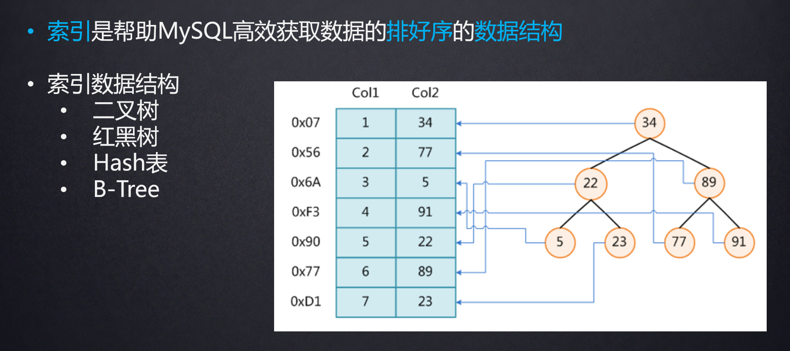
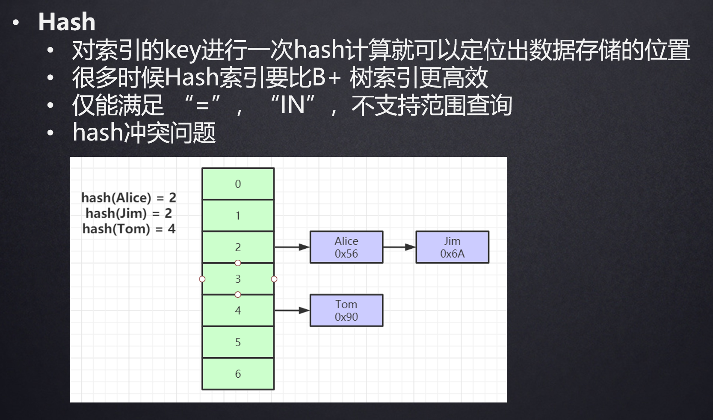
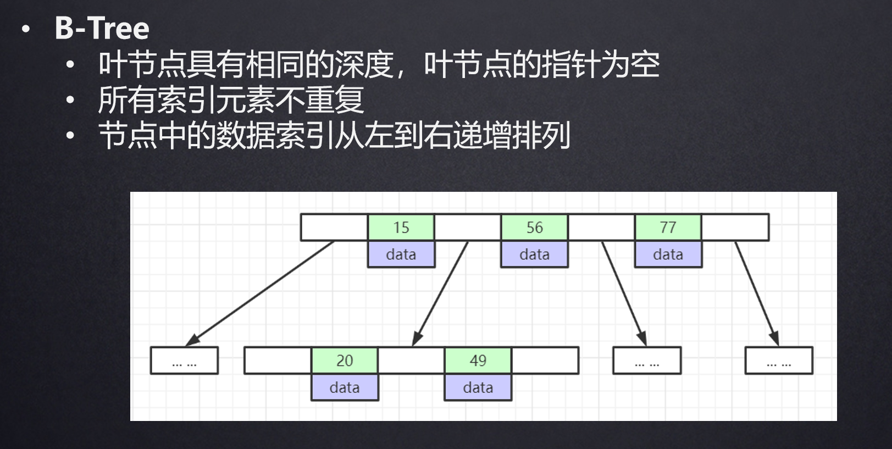
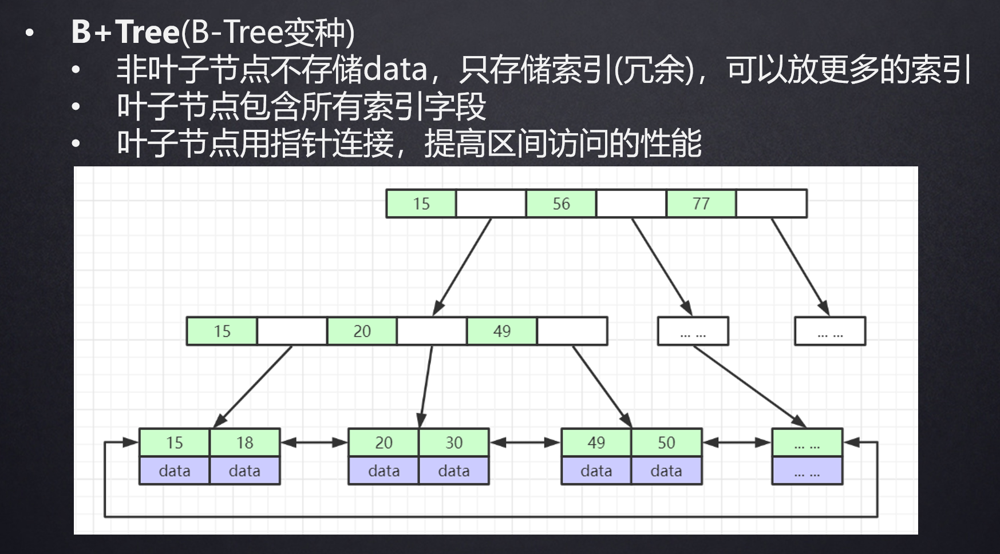
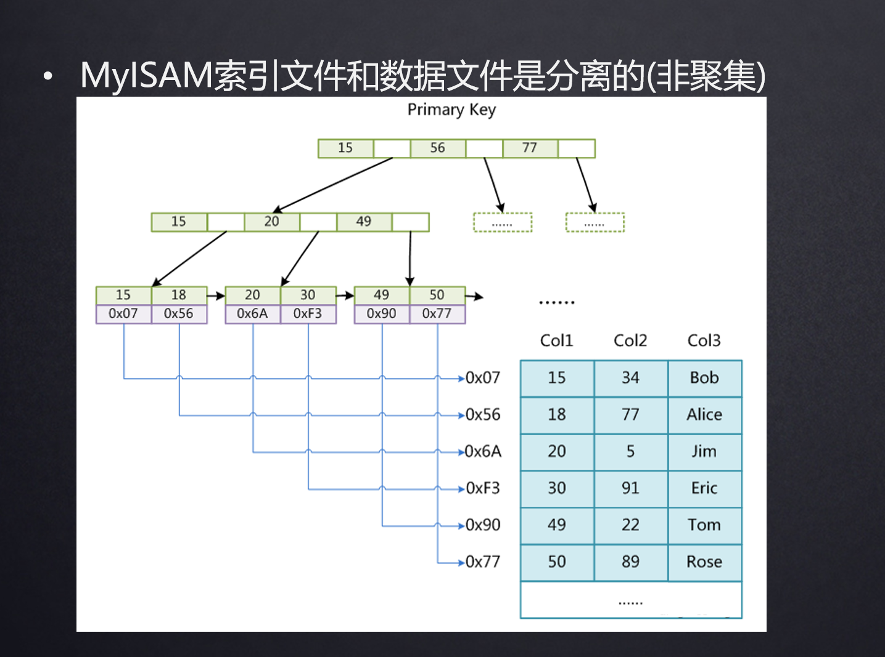
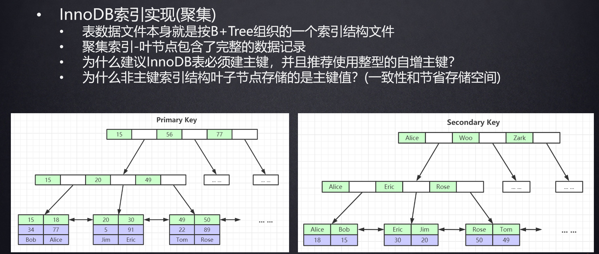
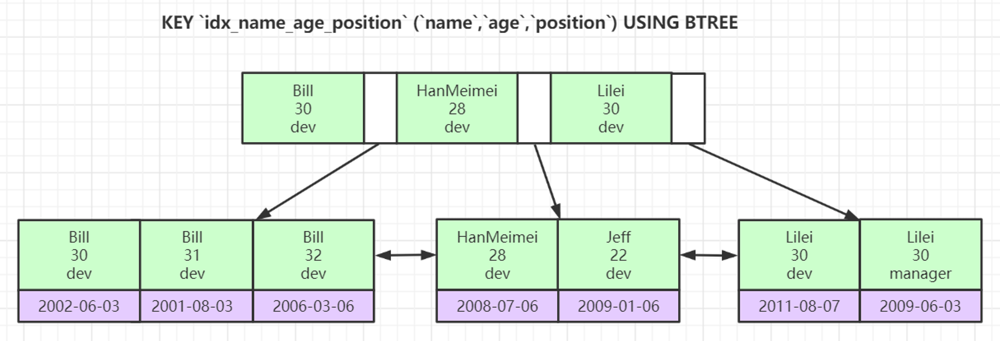

# Mysql底层数据结构

## 索引

- **索引**是帮助MySQL高效获取数据的**排好序**的**数据结构**

- **Hash表**：

  

  - 优点：查找速度快，**时间复杂度为O(1)**；适用于等值查询，如主键查询。

  - 缺点：不支持**范围查询和排序**；不适用于需要顺序访问的场景。

- **B树**：

  

  - 优点：平衡性好，支持范围查询和排序；适用于范围查询频繁的场景。

  - 缺点：插入和删除操作可能需要进行**平衡调整**，性能较Hash表差一些，非叶子节点存储数据导致阶数更多

- **红黑树**：

  - 优点：平衡性好，支持范围查询和排序；适用于有序数据的索引。

  - 缺点：相对于B树，**在数据量较大时，平衡性可能降低。**

- **二叉树**：

  - 优点：简单易懂，易于实现；适用于小规模数据和特定场景。

  - 缺点：不平衡的二叉树查找效率较低，可能导致性能问题。

### **B+树**
> 注意，主键索引里存放了整张表的数据，所以会比二级索引要大，二级索引只存放了主键

- **平衡性好**：B+树是一种平衡树结构，能够**保持树的平衡性**，使得在数据量较大时，树的高度相对较小，从而提高了检索的效率。

  > 2000W+下的数据量下依然可以保持三阶....，二阶也可以存100多W
  >
  > 第一阶的节点常驻内存，所以效率很高

- **范围查询和排序高效**：B+树中的内部节点只存储键值信息，而数据都存储在叶子节点上，并且叶子节点之间通过指针连接，形成一个有序链表。这种结构使得范围查询和排序操作非常高效，**可以快速地定位到范围内的数据**。

- **适用于磁盘存储**：B+树的节点大小通常会被设计成页大小，这样**每个节点都可以完全放入一个磁盘页**中，**减少了磁盘IO次数**，适合大规模数据的存储和查询。

- **支持高效的插入和删除操作**：B+树的插入和删除操作通常**只涉及到局部的节点调整，不会导致整棵树的重构**，因此具有较高的插入和删除效率。

### MyISAM存储引擎索引实现（非聚簇）

### **InnoDB索引实现(聚簇)**

- 表数据文件本身就是按B+Tree组织的一个索引结构文件

- 聚集索引-叶节点包含了完整的数据记录

- 为什么建议InnoDB表必须建主键，并且推荐使用整型的自增主键？

  - **支持快速定位和范围查询**：使用整型的自增主键作为主键，可以保证新插入的数据都是按照顺序递增的，这样在查询和范围查询时，可以更快地定位到目标数据。
  -  **减少插入和删除操作可能需要进行平衡调整**
  - **减少主键冲突和锁冲突**：自增主键在插入新数据时不会引发主键冲突，也不会在索引上引发锁冲突，能够提高并发插入的效率。
  - **主键保证唯一性和数据完整性**：主键保证了每一行数据的唯一性，避免了表中出现重复数据的情况，从而保证了数据的完整性和一致性。

- 为什么非主键索引结构叶子节点存储的是主键值？(一致性和节省存储空间)

  - **减少冗余存储**：将主键值存储在非主键索引结构的叶子节点中，避免了重复存储数据的情况，减少了存储空间的占用。

  - **支持覆盖索引查询**：如果查询的列都包含在了非主键索引中，那么可以直接通过非主键索引完成查询，无需再次访问主键索引，从而进一步提高了查询效率。

### 索引最左前缀原理

- **联合索引的底层存储结构长什么样？**

最左前缀原则是指在使用复合索引进行查询时，如果查询条件涉及到了复合索引的多个列，那么可以利用索引的最左前缀来进行查询。

具体来说，就是在查询时尽量从复合索引的最左边的列开始，依次使用索引的列。

- **为什么要遵循最左前缀原则？**

1. **提高查询效率**：遵循最左前缀原则可以确保查询时尽可能使用复合索引的左边列，这样可以**减少数据库扫描的数据量**，加快查询速度。
2. **减少索引的复杂性**：如果不遵循最左前缀原则，就可能需要**为每种查询情况都建立不同的索引**`针对每条sql建立不同的联合索引，浪费空间`，导致索引的数量增加，维护和管理成本也随之增加。
3. **避免性能下降**：如果查询条件不符合最左前缀原则，数据库可能无法使用索引，只能进行**全表扫描**，导致查询性能大幅下降。

