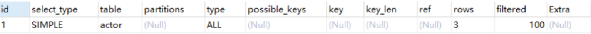
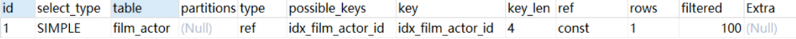
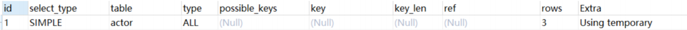
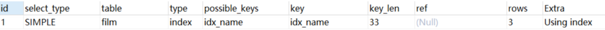
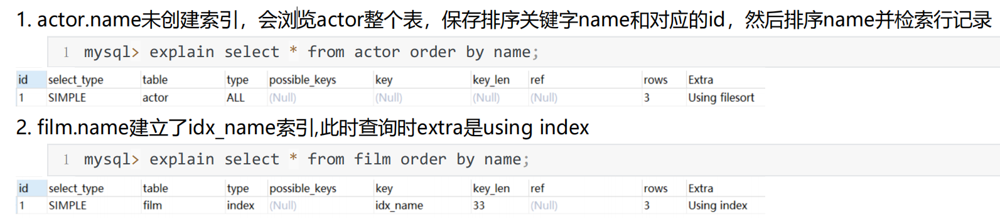
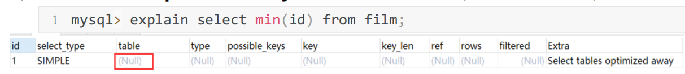
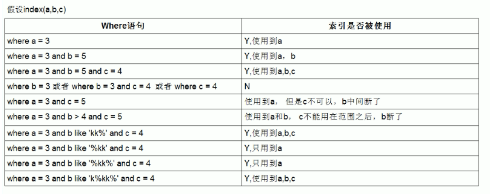

# **Explain工具介绍**

使用EXPLAIN关键字可以模拟优化器执行SQL语句，分析你的查询语句或是结构的性能瓶颈

在 select 语句之前增加 explain 关键字，MySQL 会在查询上设置一个标记，执行查询会返回执行计划的信息，而不是

执行这条SQL

>  注意：如果 from 中包含子查询，仍会执行该子查询，将结果放入临时表中


## **Explain分析示例**

```sql
 示例表：
 DROP TABLE IF EXISTS `actor`;
 CREATE TABLE `actor` (
 `id` int(11) NOT NULL,
`name` varchar(45) DEFAULT NULL,
`update_time` datetime DEFAULT NULL,
     PRIMARY KEY (`id`)
 ) ENGINE=InnoDB DEFAULT CHARSET=utf8;

 INSERT INTO `actor` (`id`, `name`, `update_time`) VALUES (1,'a','2017‐12‐22 15:27:18'), (2,'b','20
17‐12‐22 15:27:18'), (3,'c','2017‐12‐22 15:27:18');

 DROP TABLE IF EXISTS `film`;
 CREATE TABLE `film` (
 `id` int(11) NOT NULL AUTO_INCREMENT,
 `name` varchar(10) DEFAULT NULL,
 PRIMARY KEY (`id`),
 KEY `idx_name` (`name`)
 ) ENGINE=InnoDB DEFAULT CHARSET=utf8;

 INSERT INTO `film` (`id`, `name`) VALUES (3,'film0'),(1,'film1'),(2,'film2');

 DROP TABLE IF EXISTS `film_actor`;
 CREATE TABLE `film_actor` (
 `id` int(11) NOT NULL,
 `film_id` int(11) NOT NULL,
 `actor_id` int(11) NOT NULL,
 `remark` varchar(255) DEFAULT NULL,
 PRIMARY KEY (`id`),
 KEY `idx_film_actor_id` (`film_id`,`actor_id`)
 ) ENGINE=InnoDB DEFAULT CHARSET=utf8;

 INSERT INTO `film_actor` (`id`, `film_id`, `actor_id`) VALUES (1,1,1),(2,1,2),(3,2,1);
```

```sql
mysql> explain select * from actor;
```




## explain 中的列

接下来我们将展示 explain 中每个列的信息。

### **1. id列**

id列的编号是 select 的序列号，有几个 select 就有几个id，并且id的顺序是按 select 出现的顺序增长的。

**id列越大执行优先级越高，id相同则从上往下执行，id为NULL最后执行。**


### **2. select_type列**

select_type 表示对应行是简单还是复杂的查询。

1. simple：简单查询。查询不包含子查询和union

2. primary：复杂查询中最外层的 select

3. subquery：包含在 select 中的子查询（不在 from 子句中）

4. derived：包含在 from 子句中的子查询。MySQL会将结果存放在一个临时表中，也称为派生表（derived的英文含

义）

5. union：在 union 中的第二个和随后的 select


### **3. table列**

这一列表示 explain 的一行正在访问哪个表。

当 from 子句中有子查询时，table列是 <derivenN> 格式，表示当前查询依赖 id=N 的查询，于是先执行 id=N 的查询。

当有 union 时，UNION RESULT 的 table 列的值为<union1,2>，1和2表示参与 union 的 select 行id。


### **4.type列**  

<Badge type="error">最重要</Badge>

这一列表示关联类型或访问类型，即MySQL决定如何查找表中的行，查找数据行记录的大概范围。

- 依次从最优到最差分别为：**system > const > eq_ref > ref > range > index > ALL**

一般来说，**得保证查询达到range级别，最好达到ref**

- **NULL**：mysql能够在优化阶段分解查询语句，在执行阶段用不着再访问表或索引。

  例如：在索引列中选取最小值，可以单独查找索引来完成，不需要在**执行时访问表**

- **const, system**：mysql能对查询的某部分进行优化并将其转化成一个常量。用于primary key 或 unique key 的所有列与常数比较时，所以表最多有一个匹配行，读取1次，速度比较快。system是const的特例，表里只有一条元组匹配时为system`从一条记录里查询`

  ```sql
   mysql> explain extended select * from (select * from film where id = 1) tmp;
  ```

> 查询类型为"const"表示 MySQL 可以在查询执行计划中使用常量优化查询，**直接定位到唯一一行数据**。
>
> 以上两种情况很少很少


- **eq_ref**：**primary key 或 unique key** 索引的所有部分被连接使用 ，最多只会返回一条符合条件的记录。这可能是在

  const 之外最好的联接类型了，简单的 select 查询不会出现这种 type。

```sql
mysql> explain select * from film_actor left join film on film_actor.film_id = film.id;
```


- **ref**：相比 eq_ref，不使用唯一索引，而是使用**普通索引或者唯一性索引的部分前缀**，索引要和某个值相比较，可能会

 	找到多个符合条件的行。

```sql
 mysql> explain select * from film where name = 'film1';
```

- **range**：范围扫描通常出现在 in(), between ,> ,<, >= 等操作中。使用一个索引来检索给定范围的行

  ```sql
  mysql> explain select * from actor where id > 1;
  ```

- **index**：扫描全索引就能拿到结果，一般是扫描某个二级索引，这种扫描不会从索引树根节点开始快速查找，而是直接

  对二级索引的叶子节点遍历和扫描，速度还是比较慢的，这种查询一般为使用覆盖索引，二级索引一般比较小，所以这

  种通常比ALL快一些。

```sql
 explain select * from film;
```

> 为什么没有条件却走二级索引？如果不是覆盖索引的情况下，mysql会优先选择二级索引，因为主键索引包含整张表的数据加载很慢

- **ALL**：即全表扫描，扫描你的聚簇索引的所有叶子节点。通常情况下这需要增加索引来进行优化了。<Badge type="error">注意</Badge>

### **5. possible_keys列**

这一列显示查询可能使用哪些索引来查找。

explain 时可能出现 possible_keys 有列，而 key 显示 NULL 的情况，这种情况是因为表中数据不多，mysql认为索引

对此查询帮助不大，选择了全表查询。

**如果该列是NULL，则没有相关的索引。在这种情况下，可以通过检查 where 子句看是否可以创造一个适当的索引来提**

**高查询性能**，然后用 explain 查看效果。


### **6. key列**

这一列显示mysql**实际采用哪个索引来优化对该表的访问**。

如果没有使用索引，则该列是 NULL。如果想强制mysql使用或忽视possible_keys列中的索引，**在查询中使用 force**

**index、ignore index**。

> 一个是可能用到的索引，一个是实际用到的索引字段，在正常情况下，能走索引就走索引


### 7.**key_len列**

这一列显示了mysql在索引里使用的字节数，通过这个值可以算出具体使用了索引中的哪些列。

举例来说，film_actor的联合索引 idx_film_actor_id 由 film_id 和 actor_id 两个int列组成，并且每个int是4字节。通

过结果中的key_len=4可推断出查询使用了第一个列：film_id列来执行索引查找

```sql
explain select * from film_actor where film_id = 2;
```



key_len计算规则如下：

- 字符串

  - char(n)：n字节长度

  - varchar(n)：如果是utf-8，则长度 3n + 2 字节，加的2字节用来存储字符串长度

- 数值类型

  - tinyint：1字节

  - smallint：2字节

  - int：4字节

  - bigint：8字节

- 时间类型

  - date：3字节

  - timestamp：4字节

  - datetime：8字节

如果字段允许为 NULL，需要1字节记录是否为 NULL

> 索引最大长度是768字节，当字符串过长时，mysql会做一个类似左前缀索引的处理，将前半部分的字符提取出来做索引。


### **8. ref列**

这一列显示了在key列记录的索引中，表查找值所用到的列或常量，常见的有：const（常量），字段名（例：film.id）

> 常量说明sql优化比较好

### **9. rows列**

这一列是mysql估计要读取并检测的行数，注意这个不是结果集里的行数。`预估值`


### **10. Extra列**

这一列展示的是额外信息。常见的重要值如下：

1. **Using index：使用覆盖索引**

**覆盖索引定义**：mysql执行计划explain结果里的key有使用索引，如果select后面查询的字段都可以从这个索引的树中

获取，这种情况一般可以说是用到了覆盖索引，extra里一般都有using index；覆盖索引一般针对的是辅助索引，整个

查询结果只通过辅助索引就能拿到结果，不需要通过辅助索引树找到主键，再通过主键去主键索引树里获取其它字段值

> 不需要回表就是覆盖索引

2. **Using where**：使用 where 语句来处理结果，并且查询的列未被索引覆盖

```sql
 mysql> explain select * from actor where name = 'a';
```

3. **Using index condition**：查询的列不完全被索引覆盖，where条件中是一个前导列的范围；

```sql
 mysql> explain select * from film_actor where film_id > 1;
```

4. **Using temporary**：mysql需要创建一张临时表来处理查询。**出现这种情况一般是要进行优化的**，首先是想到用索引来优化。

​	actor.name没有索引，此时创建了张临时表来distinct、

```sql
 mysql> explain select distinct name from actor;
```



​	 film.name建立了idx_name索引，此时查询时extra是using index,没有用临时表

```sql
mysql> explain select distinct name from film;
```




5. **Using filesort**：将用外部排序而不是索引排序，数据较小时从内存排序，否则需要在磁盘完成排序。这种情况下一

般也是要考虑使用索引来优化的。



6. **Select tables optimized away**：使用某些聚合函数（比如 max、min）来访问存在索引的某个字段是




## **索引最佳实践**

### **1 .全值匹配**

查询条件直接使用    `=索引列`

### **2 .最左前缀法则**

如果索引了多列，要遵守最左前缀法则。指的是查询从索引的最左前列开始并且不跳过索引中的列。

### **3 .不在索引列上做任何操作（计算、函数、（自动or手动）类型转换），会导致索引失效而转向全表扫描**

常见情况：数字字符串之间的默认转化；date()日期函数；left()截取字段。。。

### **4.存储引擎不能使用索引中范围条件右边的列**

联合索引中中间的字段使用了范围查找导致后面的索引失效

### **5.尽量使用覆盖索引（只访问索引的查询（索引列包含查询列）），减少 select /* 语句**

### **6.mysql在使用不等于（！=或者<>）的时候无法使用索引会导致全表扫描**

### **7.is null,is not null 一般情况下也无法使用索引**

> 不等于，非空的情况下mysql会觉得数据太大干脆直接走索引，也有可能会走索引的
>
> null字段在索引树中会被集中放在一起的，所以非空判断也有可能会走索引

### **8.like以通配符开头（'$abc...'）mysql索引失效会变成全表扫描操作**

问题：解决like'%字符串%'索引不被使用的方法？

- **使用覆盖索引**：如果查询中只涉及到索引列和 SELECT 字段，可以考虑创建覆盖索引。覆盖索引是指索引包含了查询所需的所有字段，这样 MySQL 不需要回表查询原始数据，从而避免了性能损耗。

### **9.字符串不加单引号索引失效**

同上面的自动类型转换

**10.少用or或in，用它查询时，mysql不一定使用索引，mysql内部优化器会根据检索比例、表大小等多个因素整体评估是否使用索引**

> 也是有可能走有可能不走的情况

### **11.范围查询优化**

给某个字段进行添加单值索引后范围查找也不一定会走这个索引，因为数据可能太大了干脆全表更快

**优化方法：可以将大的范围拆分成多个小范围**


**索引使用总结：**



**like KK%相当于=常量，%KK和%KK% 相当于范围**