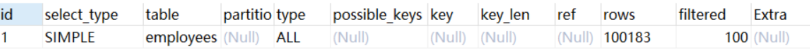
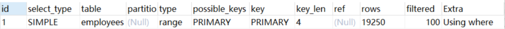
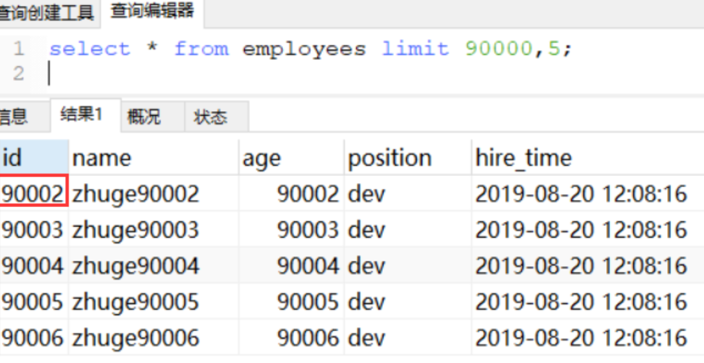
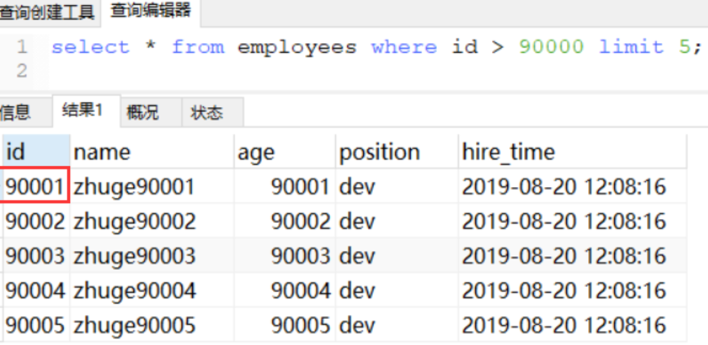
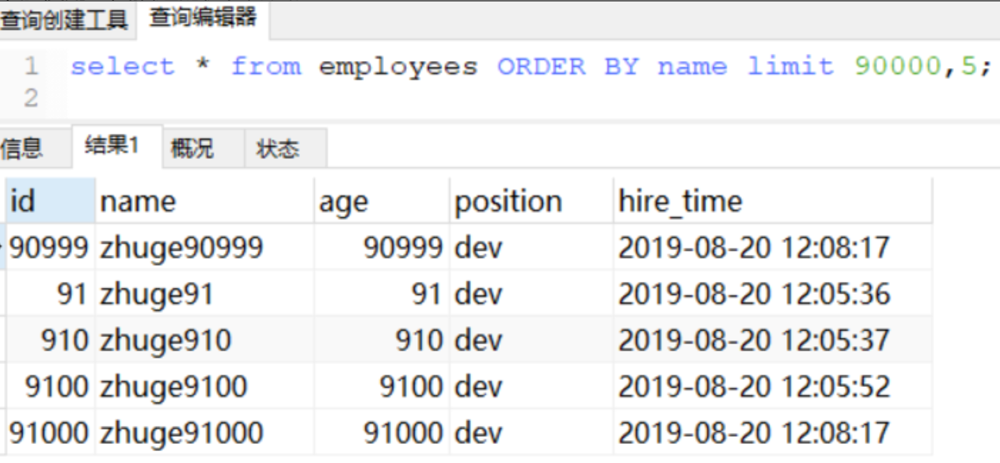
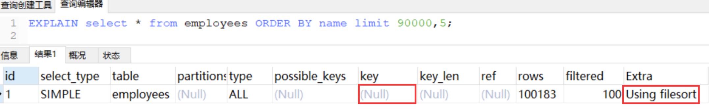
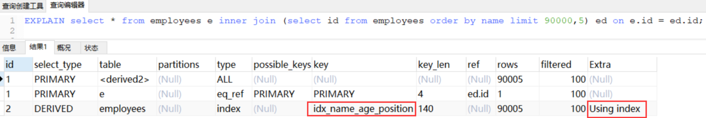
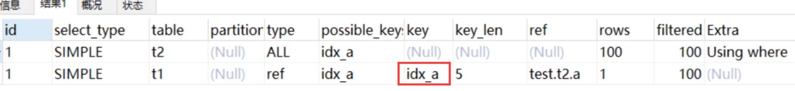
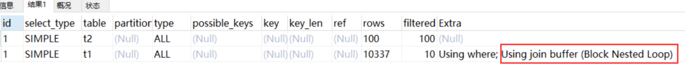
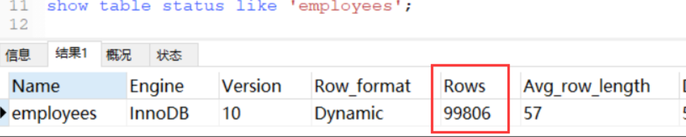

# Mysql 索引优化 (二)

## **分页查询优化**

```sql
示例表：
CREATE TABLE `employees` (
  `id` int(11) NOT NULL AUTO_INCREMENT,
  `name` varchar(24) NOT NULL DEFAULT '' COMMENT '姓名',
  `age` int(11) NOT NULL DEFAULT '0' COMMENT '年龄',
  `position` varchar(20) NOT NULL DEFAULT '' COMMENT '职位',
  `hire_time` timestamp NOT NULL DEFAULT CURRENT_TIMESTAMP COMMENT '入职时间',
  PRIMARY KEY (`id`),
  KEY `idx_name_age_position` (`name`,`age`,`position`) USING BTREE
) ENGINE=InnoDB AUTO_INCREMENT=1 DEFAULT CHARSET=utf8 COMMENT='员工记录表';
```

很多时候我们业务系统实现分页功能可能会用如下 sql 实现

```sql
mysql> select * from employees limit 10000,10;
```

表示从表 employees 中取出从 10001 行开始的 10 行记录。看似只查询了 10 条记录，实际这条 SQL 是先读取 10010 条记录，然后抛弃前 10000 条记录，然后读到后面 10 条想要的数据。因此要查询一张大表比较靠后的数据，执行效率是非常低的。

**>> 常见的分页场景优化技巧**

### **1、根据自增且连续的主键排序的分页查询**

首先来看一个根据自增且连续主键排序的分页查询的例子：

```sql
mysql> select * from employees limit 90000,5;
```



该 SQL 表示查询从第 90001 开始的五行数据，没添加单独 order by，表示通过**主键排序**。我们再看表 employees ，因为主键是自增并且连续的，所以可以改写成按照主键去查询从第 90001 开始的五行数据，如下：

```sql
mysql> select * from employees where id > 90000 limit 5;
```



查询的结果是一致的。我们再对比一下执行计划：

显然改写后的 SQL 走了索引，而且扫描的行数大大减少，执行效率更高。 

但是，这条改写的 SQL 在很多场景并不实用，因为表中可能某些记录被删后，主键空缺，导致结果不一致，如下图试验所示（先删除一条前面的记录，然后再测试原 SQL 和优化后的 SQL）：



第二条



两条 SQL 的结果并不一样，因此，如果主键不连续，不能使用上面描述的优化方法。

另外如果原 SQL 是 order by 非主键的字段，按照上面说的方法改写会导致两条 SQL 的结果不一致。所以这种改写得满足以下两个条件：

- 主键自增且连续

- 结果是按照主键排序的


### **2、根据非主键字段排序的分页查询**

一个根据非主键字段排序的分页查询，SQL 如下：

**mysql>  select /* from employees** **ORDER BY name** **limit 90000,5;**



**mysql> EXPLAIN select /* from employees** **ORDER BY name** **limit 90000,5;**



发现并没有使用 name 字段的索引（key 字段对应的值为 null），具体原因上节课讲过：

**扫描整个索引并查找到没索引的行 (可能要遍历多个索引树) 的成本比扫描全表的成本更高**，所以优化器放弃使用索引。

知道不走索引的原因，那么怎么优化呢？

其实关键是**让排序时返回的字段尽可能少**

所以可以让排序和分页操作**先查出主键**，然后**根据主键查到对应的记录**，SQL 改写如下

```sql
mysql> select * from employees e inner join (select id from employees order by name limit 90000,5) ed on e.id = ed.id;
```

需要的结果与原 SQL 一致，执行时间减少了一半以上，我们再对比优化前后 sql 的执行计划：




## **Join 关联查询优化**

```sql
-- 示例表：
CREATE TABLE `t1` (
  `id` int(11) NOT NULL AUTO_INCREMENT,
  `a` int(11) DEFAULT NULL,
  `b` int(11) DEFAULT NULL,
  PRIMARY KEY (`id`),
  KEY `idx_a` (`a`)
) ENGINE=InnoDB DEFAULT CHARSET=utf8;
 
create table t2 like t1;
 
-- 插入一些示例数据
-- 往t1表插入1万行记录
drop procedure if exists insert_t1; 
delimiter ;;
create procedure insert_t1()        
begin
  declare i int;                    
  set i=1;                          
  while(i<=10000)do                 
    insert into t1(a,b) values(i,i);  
    set i=i+1;                       
  end while;
end;;
delimiter ;
call insert_t1();
 
-- 往t2表插入100行记录
drop procedure if exists insert_t2; 
delimiter ;;
create procedure insert_t2()        
begin
  declare i int;                    
  set i=1;                          
  while(i<=100)do                 
    insert into t2(a,b) values(i,i);  
    set i=i+1;                       
  end while;
end;;
delimiter ;
call insert_t2();
```

**mysql 的表关联常见有两种算法**

- Nested-Loop Join 算法
- Block Nested-Loop Join 算法

### **1、** **嵌套循环连接** **Nested-Loop Join (NLJ) 算法**

一次一行循环地从第一张表（称为**驱动表**）中读取行，在这行数据中取到关联字段，根据关联字段在另一张表（**被驱动表**）里取出满足条件的行，然后取出两张表的结果合集。

```sql
mysql> EXPLAIN select * from t1 inner join t2 on t1.a= t2.a;
```



从执行计划中可以看到这些信息：

- 驱动表是 t2，被驱动表是 t1。先执行的就是驱动表 (执行计划结果的 id 如果一样则按从上到下顺序执行 sql)

  优化器一般会优先选择**小表做驱动表，**用 where 条件过滤完驱动表，然后再跟被驱动表做关联查询。**所以使用 inner join 时，排在前面的表并不一定就是驱动表。**

- 当使用 left join 时，左表是驱动表，右表是被驱动表，当使用 right join 时，右表时驱动表，左表是被驱动表，当使用 join 时，**mysql 会选择数据量比较小的表作为驱动表，大表作为被驱动表**。

- 使用了 NLJ 算法。一般 join 语句中，如果执行计划 Extra 中未出现 **Using join buffer** 则表示使用的 join 算法是 NLJ。


**上面 sql 的大致流程如下：**

1. **从表 t2 中读取一行数据**（如果 t2 表有查询过滤条件的，用先用条件过滤完，再从过滤结果里取出一行数据）
2. 从第 1 步的数据中，**取出关联字段 a，到表 t1 中查找**
3. 取出表 t1 中满足条件的行，跟 t2 中获取到的结果合并，作为结果返回给客户端；
4. 重复上面 3 步

整个过程会读取 t2 表的所有数据 (**扫描 100 行**)，然后遍历这每行数据中字段 a 的值，根据 t2 表中 a 的值索引扫描 t1 表中的对应行 (**扫描 100 次 t1 表的索引，1 次扫描可以认为最终只扫描 t1 表一行完整数据，也就是总共 t1 表也扫描了 100 行**)。因此整个过程扫描了 **200 行**。

如果被驱动表的关联字段没索引，**使用 NLJ 算法性能会比较低 **，mysql 会选择 Block Nested-Loop Join 算法。


### **2、** **基于块的嵌套循环连接** Block Nested-Loop Join(BNL) 算法

把**驱动表**的数据读入到 join_buffer 中，然后扫描**被驱动表**，把**被驱动表**每一行取出来跟 join_buffer 中的数据做对比。

```sql
mysql>EXPLAIN select * from t1 inner join t2 on t1.b= t2.b;
```



Extra 中 的 **Using join buffer (Block Nested Loop)** 说明该关联查询使用的是 BNL 算法。

- **上面 sql 的大致流程如下：**
  1. 把 t2 的所有数据放入到 **join_buffer** 中
  2. 把表 t1 中每一行取出来，跟 join_buffer 中的数据做对比
  3. 返回满足 join 条件的数据

整个过程对表 t1 和 t2 都做了一次全表扫描，因此扫描的总行数为 10000 (表 t1 的数据总量) + 100 (表 t2 的数据总量) = **10100**。并且 join_buffer 里的数据是无序的，因此对表 t1 中的每一行，都要做 100 次判断，所以内存中的判断次数是 100 * 10000= **100 万次！**


- **这个例子里表 t2 才 100 行，要是表 t2 是一个大表，join_buffer 放不下怎么办呢？**・

  join_buffer 的大小是由参数 join_buffer_size 设定的，默认值是 256k。如果放不下表 t2 的所有数据话，策略很简单，就是**分段放**。

  比如 t2 表有 1000 行记录， join_buffer 一次只能放 800 行数据，那么执行过程就是先往  join_buffer 里放 800 行记录，然后从 t1表里取数据跟 join_buffer 中数据对比得到部分结果，然后清空   join_buffer ，再放入 t2 表剩余 200 行记录，再次从 t1 表里取数据跟 join_buffer 中数据对比。所以就多扫了一次 t1 表。


- **被驱动表的关联字段没索引为什么要选择使用 BNL 算法而不使用 Nested-Loop Join 呢？**

  如果上面第二条 sql 使用 Nested-Loop Join，那么扫描行数为 100 * 10000 = 100 万次，这个是**磁盘扫描**。

  很显然，用 BNL 磁盘扫描次数少很多，相比于磁盘扫描，**BNL 的内存计算会快得多**。

  **因此 MySQL 对于被驱动表的关联字段没索引的关联查询，一般都会使用 BNL 算法。如果有索引一般选择 NLJ 算法，有索引的情况下 NLJ 算法比 BNL 算法性能更高**

  > NLJ有索引，数据少使用磁盘扫描；BNL 使用内存计算没有索引关联的数据会更快


### **3. 对于关联 sql 的优化**

- **关联字段加索引**，让 mysql 做 join 操作时**尽量选择 NLJ 算法**，驱动表因为需要全部查询出来，所以**过滤的条件也尽量要走索引**，避免全表扫描，**总之，能走索引的过滤条件尽量都走索引！**

- **小表驱动大表**，写多表连接 sql 时如果**明确知道**哪张表是小表可以用 straight_join 写法固定连接驱动方式，省去 mysql 优化器自己判断的时间

  

- `了解`**straight_join**

  **straight_join** 功能同 join 类似，**但能让左边的表来驱动右边的表**，能改表优化器对于联表查询的执行顺序。

  比如：select * from t2 straight_join t1 on t2.a = t1.a; 代表指定 mysql 选着 t2 表作为驱动表。

  - **straight_join** 只适用于 inner join，并不适用于 left join，right join。（因为 left join，right join 已经代表指定了表的执行顺序）

  - **尽可能让优化器去判断，因为大部分情况下 mysql 优化器是比人要聪明的。使用 straight_join 一定要慎重，因为部分情况下人为指定的执行顺序并不一定会比优化引擎要靠谱。**

  


- **对于小表定义的明确**

  在决定哪个表做驱动表的时候，应该是两个表按照各自的条件过滤，**过滤完成之后**，计算参与 join 的各个字段的总数据量，**数据量小的那个表，就是 “小表”**，应该作为驱动表。


 

- **in 和 exsits 优化**

  原则：**小表驱动大表**，即小的数据集驱动大的数据集

  - **in：**当 B 表的数据集小于 A 表的数据集时，in 优于 exists 

  ```sql
  select * from A where id in (select id from B)  
  #等价于：
  　　for(select id from B){
        select * from A where A.id = B.id
      }
  ```

  - **exists：**当 A 表的数据集小于 B 表的数据集时，exists 优于 in

  　　将主查询 A 的数据，放到子查询 B 中做条件验证，根据验证结果（true 或 false）来决定主查询的数据是否保留

  ```sql
  select * from A where exists (select 1 from B where B.id = A.id)
  #等价于:
      for(select * from A){
        select * from B where B.id = A.id
      }
  #A表与B表的ID字段应建立索引
  ```

  ```
  #A表与B表的ID字段应建立索引
  ```

  > - 1. EXISTS (subquery) 只返回 TRUE 或 FALSE, 因此子查询中的 SELECT * 也可以用 SELECT 1 替换，官方说法是实际执行时会忽略 SELECT 清单，因此没有区别
  >
  >   2. EXISTS 子查询的实际执行过程可能经过了优化而不是我们理解上的逐条对比
  >
  >   3. **EXISTS 子查询往往也可以用 JOIN 来代替**，何种最优需要具体问题具体分析
  >
  >   in:小的放后面；exist :小的放前面

  

## **count (/*) 查询优化**

```sql
-- 临时关闭mysql查询缓存，为了查看sql多次执行的真实时间
mysql> set global query_cache_size=0;
mysql> set global query_cache_type=0;
 
mysql> EXPLAIN select count(1) from employees;
mysql> EXPLAIN select count(id) from employees;
mysql> EXPLAIN select count(name) from employees;
mysql> EXPLAIN select count(*) from employees;
```

四个 sql 的执行计划一样，说明这四个 sql 执行效率应该差不多

- **字段有索引：count (/*)≈count (1)>count (字段)>count (主键 id)    // 字段有索引，count (字段) 统计走二级索引，二级索引存储数据比主键索引少，所以 count (字段)>count (主键 id)** 

- **字段无索引：count (/*)≈count (1)>count (主键 id)>count (字段)    // 字段没有索引 count (字段) 统计走不了索引，count (主键 id) 还可以走主键索引，所以 count (主键 id)>count (字段)**

**原因：**

- count (1) 跟 count (字段) 执行**过程类似**，不过 **count (1) 不需要取出字段统计，就用常量 1 做统计，count (字段) 还需要取出字段**，所以理论上 **count (1) 比 count (字段) 会快一点**。

- `count (*) `是例外，**mysql 并不会把全部字段取出来，而是专门做了优化**，不取值，按行累加，效率很高，所以不需要用 count (列名) 或 count (常量) 来替代 `count (*)`。

- 为什么对于 count (id)，mysql 最终选择辅助索引而不是主键聚集索引？

  因为二级索引相对主键索引存储数据更少，检索性能应该更高，mysql 内部做了点优化 


### **常见优化方法**

**1、查询 mysql 自己维护的总行数**

- 对于 **myisam 存储引擎**的表做不带 where 条件的 count 查询性能是很高的，因为 myisam 存储引擎的表的总行数会被 mysql 存储在磁盘上，查询不需要计算
- 但是对于 **innodb 存储引擎**的表 mysql 不会存储表的总记录行数 ，查询 count 需要**实时计算**


**2、show table status**

如果只需要知道表总行数的估计值可以用如下 sql 查询，性能很高



**3、将总数维护到 Redis 里**

插入或删除表数据行的时候同时维护 redis 里的表总行数 key 的计数值 (用 incr 或 decr 命令)，但是这种方式可能不准，**很难保证表操作和 redis 操作的事务一致性**


**4、增加数据库计数表**

插入或删除表数据行的时候同时维护计数表，让他们在**同一个事务里操作**


## **阿里巴巴 Mysql 规范解读**

在 MySQL 中，选择正确的数据类型，对于性能至关重要。一般应该遵循下面两步：

（1）确定合适的大类型：数字、字符串、时间、二进制；

（2）确定具体的类型：有无符号、取值范围、变长定长等。

在 MySQL 数据类型设置方面，**尽量用更小的数据类型**，因为它们通常有更好的性能，花费更少的硬件资源。并且，尽量把字段定义为 NOT NULL，避免使用 NULL。

### **1、数值类型**

| 类型           | 大小                                           | 范围（有符号）                                               | 范围（无符号）                                               | 用途           |
| -------------- | ---------------------------------------------- | ------------------------------------------------------------ | ------------------------------------------------------------ | -------------- |
| TINYINT        | 1 字节                                         | (-128, 127)                                                  | (0, 255)                                                     | 小整数值       |
| SMALLINT       | 2 字节                                         | (-32 768, 32 767)                                            | (0, 65 535)                                                  | 大整数值       |
| MEDIUMINT      | 3 字节                                         | (-8 388 608, 8 388 607)                                      | (0, 16 777 215)                                              | 大整数值       |
| INT 或 INTEGER | 4 字节                                         | (-2 147 483 648, 2 147 483 647)                              | (0, 4 294 967 295)                                           | 大整数值       |
| BIGINT         | 8 字节                                         | (-9 233 372 036 854 775 808, 9 223 372 036 854 775 807)      | (0, 18 446 744 073 709 551 615)                              | 极大整数值     |
| FLOAT          | 4 字节                                         | (-3.402 823 466 E+38, 1.175 494 351 E-38)，0，(1.175 494 351 E-38，3.402 823 466 351 E+38) | 0, (1.175 494 351 E-38, 3.402 823 466 E+38)                  | 单精度浮点数值 |
| DOUBLE         | 8 字节                                         | (1.797 693 134 862 315 7 E+308, 2.225 073 858 507 201 4 E-308), 0, (2.225 073 858 507 201 4 E-308, 1.797 693 134 862 315 7 E+308) | 0, (2.225 073 858 507 201 4 E-308, 1.797 693 134 862 315 7 E+308) | 双精度浮点数值 |
| DECIMAL        | 对 DECIMAL (M,D) ，如果 M>D，为 M+2 否则为 D+2 | 依赖于 M 和 D 的值                                           | 依赖于 M 和 D 的值                                           | 小数值         |

**优化建议**

1. 如果整形数据**没有负数**，如 ID 号，建议指定为 **UNSIGNED 无符号类型**，容量可以扩大一倍。
2. 建议使用 TINYINT 代替 ENUM、BITENUM、SET。
3. **避免使用整数的显示宽度** (参看文档最后)，也就是说，不要用 INT (10) 类似的方法指定字段显示宽度，**直接用 INT**。
4. **DECIMAL 最适合保存准确度要求高，而且用于计算的数据，比如价格**。但是在使用 DECIMAL 类型的时候，**注意长度设置**。
5. 建议使用整形类型来运算和存储实数，方法是，实数乘以相应的倍数后再操作。
6. **整数通常是最佳的数据类型**，因为它速度快，并且能使用 AUTO_INCREMENT。

### **2、日期和时间**

| 类型      | 大小(字节) | 范围                                       | 格式                | 用途                     |
| --------- | ---------- | ------------------------------------------ | ------------------- | ------------------------ |
| DATE      | 3          | 1000-01-01 到 9999-12-31                   | YYYY-MM-DD          | 日期值                   |
| TIME      | 3          | '-838:59:59' 到 '838:59:59'                | HH:MM:SS            | 时间值或持续时间         |
| YEAR      | 1          | 1901 到 2155                               | YYYY                | 年份值                   |
| DATETIME  | 8          | 1000-01-01 00:00:00 到 9999-12-31 23:59:59 | YYYY-MM-DD HH:MM:SS | 混合日期和时间值         |
| TIMESTAMP | 4          | 1970-01-01 00:00:00 到 2038-01-19 03:14:07 | YYYYMMDDhhmmss      | 混合日期和时间值，时间戳 |

**优化建议**

1. MySQL 能存储的最小时间粒度为秒。
2. **建议用 DATE 数据类型来保存日期**。MySQL 中默认的日期格式是 yyyy-mm-dd。
3. 用 MySQL 的内建类型 **DATE、TIME、DATETIME 来存储时间，而不是使用字符串**。
4. 当数据格式为 TIMESTAMP 和 DATETIME 时，可以用 CURRENT_TIMESTAMP 作为默认（MySQL5.6 以后），MySQL 会自动返回记录插入的确切时间。
5. TIMESTAMP 是 UTC 时间戳，与时区相关。
6. DATETIME 的存储格式是一个 YYYYMMDD HH:MM:SS 的整数，与时区无关，你存了什么，读出来就是什么。
7. 除非有特殊需求，**一般的公司建议使用 TIMESTAMP，它比 DATETIME 更节约空间**，但是像阿里这样的公司一般会用 DATETIME，因为不用考虑 TIMESTAMP 将来的时间上限问题。

 

### **3、字符串**

| 类型       | 大小                 | 用途                                                         |
| ---------- | -------------------- | ------------------------------------------------------------ |
| CHAR       | 0-255 字节           | 定长字符串，char (n) 当插入的字符数不足 n 时 (n 代表字符数)，插入空格进行补充保存。在进行检索时，尾部的空格会被去掉。 |
| VARCHAR    | 0-65535 字节         | 变长字符串，varchar (n) 中的 n 代表最大字符数，插入的字符数不足 n 时不会补充空格 |
| TINYBLOB   | 0-255 字节           | 不超过 255 个字符的二进制字符串                              |
| TINYTEXT   | 0-255 字节           | 短文本字符串                                                 |
| BLOB       | 0-65 535 字节        | 二进制形式的长文本数据                                       |
| TEXT       | 0-65 535 字节        | 长文本数据                                                   |
| MEDIUMBLOB | 0-16 777 215 字节    | 二进制形式的中等长度文本数据                                 |
| MEDIUMTEXT | 0-16 777 215 字节    | 中等长度文本数据                                             |
| LONGBLOB   | 0-4 294 967 295 字节 | 二进制形式的极大文本数据                                     |
| LONGTEXT   | 0-4 294 967 295 字节 | 极大文本数据                                                 |

**优化建议**

1. **字符串的长度相差较大用 VARCHAR；字符串短，且所有值都接近一个长度用 CHAR。**
2. CHAR 和 VARCHAR 适用于包括人名、邮政编码、电话号码和不超过 255 个字符长度的任意字母数字组合。那些要**用来计算的数字不要用 VARCHAR 类型保存**，因为可能会导致一些与计算相关的问题。换句话说，可能影响到计算的准确性和完整性。
3. **尽量少用 BLOB 和 TEXT**，因为全表查时需要全部加载到内存。如果实在要用可以考虑将 BLOB 和 TEXT 字段**单独存一张表，用 id 关联。**
4. BLOB 系列存储二进制字符串，与字符集无关。TEXT 系列存储非二进制字符串，与字符集相关。
5. BLOB 和 TEXT 都不能有默认值。


### **PS：INT 显示宽度**

我们经常会使用命令来创建数据表，而且同时会指定一个长度，如下。但是，**这里的长度并非是 TINYINT 类型存储的最大长度，而是显示的最大长度**，只有字符串相关时才是长度

```sql
CREATE TABLE `user`(
    `id` TINYINT(2) UNSIGNED
);
```

这里表示 user 表的 id 字段的类型是 TINYINT，可以存储的最大数值是 255。所以，在存储数据时，如果存入值小于等于 255，如 200，虽然超过 2 位，但是没有超出 TINYINT 类型长度，所以可以正常保存；如果存入值大于 255，如 500，那么 MySQL 会自动保存为 TINYINT 类型的最大值 255。

在查询数据时，不管查询结果为何值，都按实际输出。这里 TINYINT (2) 中 2 的作用就是，当需要在查询结果前填充 0 时，命令中加上 ZEROFILL 就可以实现，如：

```sql
`id` TINYINT(2) UNSIGNED ZEROFILL
```

这样，**查询结果如果是 5，那输出就是 05**。如果指定 TINYINT (5)，那输出就是 00005，其实实际存储的值还是 5，而且存储的数据不会超过 255，只是 MySQL 输出数据时在前面填充了 0。

换句话说，在 MySQL 命令中，字段的类型长度 TINYINT (2)、INT (11) **不会影响数据的插入**，只会在使用 ZEROFILL 时有用，让查询结果前填充 0。