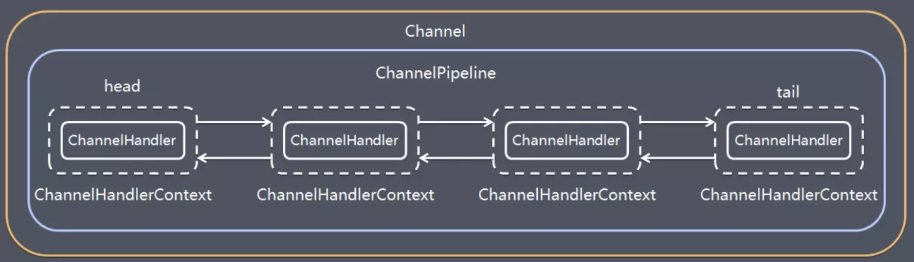
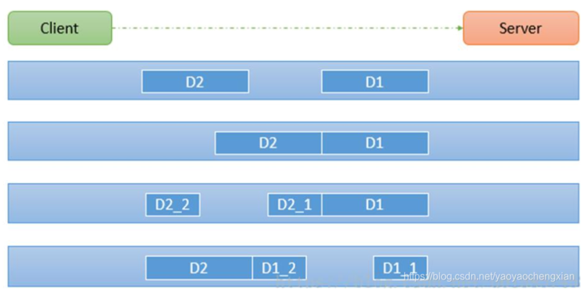

# Netty编解码 & 粘包拆包 & 心跳机制 & 断线自动重连

## Netty 编解码

### ChannelHandler

- ChannelHandler 充当了**处理入站和出站数据的应用程序逻辑容器**。

  例如，实现 ChannelInboundHandler 接口（或 ChannelInboundHandlerAdapter），你就可以接收入站事件和数据，这些数据随后会被你的应用程序的业务逻辑处理。当你要给连接的客户端发送响应时，也可以从 ChannelInboundHandler 冲刷数据。你的业务逻辑通常写在一个或者多个 ChannelInboundHandler 中。

- ChannelOutboundHandler 原理一样，只不过它是用来处理出站数据的。


### ChannelPipeline

- **ChannelPipeline 提供了 ChannelHandler 链的容器。**

  以客户端应用程序为例，如果事件的运动方向是**从客户端到服务端的，那么我们称这些事件为出站的**，即客户端发送给服务端的数据会通过 pipeline 中的一系列 **ChannelOutboundHandler**(ChannelOutboundHandler 调用是**从 tail 到 head 方向逐个调用每个 handler 的逻辑**)，并被这些 Handler 处理

- 反之则称为入站的，入站只调用 pipeline 里的 **ChannelInboundHandler** 逻辑 (ChannelInboundHandler 调用是**从 head 到 tail 方向逐个调用每个 handler 的逻辑**)。

  

> 入站：head—>tail；出站：tail—>head


### 编码解码器

- 当你通过 Netty 发送或者接受一个消息的时候，就将发生一次`数据转换`：

  入栈消息会被解码。从字节转换为另一种格式；如果是出栈消息，他会被编码为字节

  Netty 自己为我们提供了一系列实用的编码解码器，他们都实现了 `ChannelInboundHadnler` 或者 `ChannelOutboundHandler` 接口

  > Netty 提供了很多编解码器，比如编解码字符串的 **StringEncoder 和 StringDecoder**，编解码对象的 **ObjectEncoder 和 ObjectDecoder** 等

- 在这些类中，channelRead 方法已经被重写了：

  以入站为例，对于每个从入站 Channel 读取的消息，这个方法会被调用。随后，它将调用由已知解码器所提供的 decode () 方法进行解码，并将已经解码的字节转发给 ChannelPipeline 中的下一个 ChannelInboundHandler

- 如果要实现高效的编解码可以用 `protobuf`，但是 `protobuf `需要维护大量的 proto 文件比较麻烦，**现在一般可以使用protostuff**

  **protostuff：**protostuff 是一个基于 protobuf 实现的序列化方法，它较于 protobuf 最明显的好处是，在几乎不损耗性能的情况下做到了不用我们写.proto 文件来实现序列化

  **导入依赖：**

  ```xml
  <dependency>
      <groupId>com.dyuproject.protostuff</groupId>
      <artifactId>protostuff-api</artifactId>
      <version>1.0.10</version>
  </dependency>
  <dependency>
      <groupId>com.dyuproject.protostuff</groupId>
      <artifactId>protostuff-core</artifactId>
      <version>1.0.10</version>
  </dependency>
  <dependency>
      <groupId>com.dyuproject.protostuff</groupId>
      <artifactId>protostuff-runtime</artifactId>
      <version>1.0.10</version>
  </dependency>
  ```

  **序列化工具类，基于protobuf封装，使用时直接复制就可以**

  ```java
  public class ProtostuffUtil {
  
      private static Map<Class<?>, Schema<?>> cachedSchema = new ConcurrentHashMap<Class<?>, Schema<?>>();
  
      private static <T> Schema<T> getSchema(Class<T> clazz) {
          @SuppressWarnings("unchecked")
          Schema<T> schema = (Schema<T>) cachedSchema.get(clazz);
          if (schema == null) {
              schema = RuntimeSchema.getSchema(clazz);
              if (schema != null) {
                  cachedSchema.put(clazz, schema);
              }
          }
          return schema;
      }
  
      /**
       * 序列化
       * @param obj
       * @return
       */
      public static <T> byte[] serializer(T obj) {
          @SuppressWarnings("unchecked")
          Class<T> clazz = (Class<T>) obj.getClass();
          LinkedBuffer buffer = LinkedBuffer.allocate(LinkedBuffer.DEFAULT_BUFFER_SIZE);
          try {
              Schema<T> schema = getSchema(clazz);
              return ProtostuffIOUtil.toByteArray(obj, schema, buffer);
          } catch (Exception e) {
              throw new IllegalStateException(e.getMessage(), e);
          } finally {
              buffer.clear();
          }
      }
  
      /**
       * 反序列化
       * @param data
       * @param clazz
       * @return
       */
      public static <T> T deserializer(byte[] data, Class<T> clazz) {
          try {
              T obj = clazz.newInstance();
              Schema<T> schema = getSchema(clazz);
              ProtostuffIOUtil.mergeFrom(data, obj, schema);
              return obj;
          } catch (Exception e) {
              throw new IllegalStateException(e.getMessage(), e);
          }
      }
  
      public static void main(String[] args) {
          byte[] userBytes = ProtostuffUtil.serializer(new User(1, "zhuge"));
          User user = ProtostuffUtil.deserializer(userBytes, User.class);
          System.out.println(user);
      }
  }
  ```


## Netty 粘包拆包

- TCP 是一个流协议，就是没有界限的一长串二进制数据

- **粘包和拆包问题：**TCP 作为传输层协议并不不了解上层业务数据的具体含义，它会根据 TCP 缓冲区的实际情况进行数据包的划分，所以在业务上认为是一个完整的包，可能会被 TCP 拆分成多个包进行发送，也有可能把多个小的包封装成一个大的数据包发送，这就是所谓的 TCP 粘包和拆包问题。

- 面向流的通信是无消息保护边界的。
  如下图所示，client 发了两个数据包 D1 和 D2，但是 server 端可能会收到如下几种情况的数据

  

  ### 解决方案

  1. **消息定长度**，传输的数据大小固定长度，例如每段的长度固定为 100 字节，如果不够空位补空格

  2. 在数据包尾部添加**特殊分隔符**，比如下划线，中划线等，这种方法简单易行，**但选择分隔符的时候一定要注意每条数据的内部一定不能出现分隔符！**

  3. **发送长度`常用方法`：发送每条数据的时候，将数据的长度一并发送，比如可以选择每条数据的前 4 位是数据的长度，应用层处理时可以根据长度来判断每条数据的开始和结束。**

     

  Netty 提供了多个解码器，可以进行分包的操作，如下：

  - LineBasedFrameDecoder （回车换行分包）
  - DelimiterBasedFrameDecoder（特殊分隔符分包）
  - **FixedLengthFrameDecoder（固定长度报文来分包）**自定义长度分包编解码器


## Netty心跳检测机制

所谓心跳，即在 TCP 长连接中，客户端和服务器之间定期发送的一种特殊的数据包，通知对方自己还在线，以确保 TCP 连接的有效性

在 Netty 中，实现心跳机制的关键是 IdleStateHandler, 看下它的构造器：

```java
public IdleStateHandler(int readerIdleTimeSeconds, int writerIdleTimeSeconds, int allIdleTimeSeconds) { 		this((long)readerIdleTimeSeconds, (long)writerIdleTimeSeconds, (long)allIdleTimeSeconds,TimeUnit.SECONDS); 
}
```

idle：空闲的

- `readerIdleTimeSeconds`: **读超时**。即当在指定的时间间隔内没有从 Channel 读取到数据时，会触发一个 `READER_IDLE` 的 `IdleStateEvent `事件.
- writerIdleTimeSeconds: **写超时**。即当在指定的时间间隔内没有数据写入到 Channel 时，会触发一个 `WRITER_IDLE` 的 `IdleStateEvent `事件.
- `allIdleTimeSeconds`: **读 / 写超时**。即当在指定的时间间隔内没有读或写操作时，会触发一个 `ALL_IDLE` 的` IdleStateEvent `事件.

这三个参数默认的时间单位是秒。若需要指定其他时间单位，可以使用另一个构造方法：

```java
IdleStateHandler(boolean observeOutput, long readerIdleTime, long writerIdleTime, long allIdleTime, TimeUnit unit)
```

要实现 Netty 服务端心跳检测机制需要在服务器端的 ChannelInitializer 中加入如下的代码：

```java
 pipeline.addLast(new IdleStateHandler(3, 0, 0, TimeUnit.SECONDS));
```

### channelRead `发送消息的方法`

**IdleStateHandler 中的 channelRead 方法：**

```java
   public void channelRead(ChannelHandlerContext ctx, Object msg) throws Exception {
        if (this.readerIdleTimeNanos > 0L || this.allIdleTimeNanos > 0L) {
            this.reading = true;
            this.firstReaderIdleEvent = this.firstAllIdleEvent = true;
        }
// 该方法只是进行了透传，不做任何业务逻辑处理，让channelPipe中的下一个handler处理channelRead方法
        ctx.fireChannelRead(msg);
    }
```

### channelActive `接上服务端的方法`

```java
public void channelActive(ChannelHandlerContext ctx) throws Exception {
    //这里initialize的方法，这是IdleStateHandler的精髓
    this.initialize(ctx);
    super.channelActive(ctx);
}
```

**initialize(ctx)**

```java
 private void initialize(ChannelHandlerContext ctx) {
        switch(this.state) {
        case 1:
        case 2:
            return;
        default:
            this.state = 1;
            this.initOutputChanged(ctx);
            this.lastReadTime = this.lastWriteTime = this.ticksInNanos();
            //如果readerIdleTimeNanos>0，则提交一个任务ReaderIdleTimeoutTask，即判断读心跳空闲事件
            if (this.readerIdleTimeNanos > 0L) {
                this.readerIdleTimeout = this.schedule(ctx, new IdleStateHandler.ReaderIdleTimeoutTask(ctx), this.readerIdleTimeNanos, TimeUnit.NANOSECONDS);
            }

            if (this.writerIdleTimeNanos > 0L) {
                this.writerIdleTimeout = this.schedule(ctx, new IdleStateHandler.WriterIdleTimeoutTask(ctx), this.writerIdleTimeNanos, TimeUnit.NANOSECONDS);
            }

            if (this.allIdleTimeNanos > 0L) {
                this.allIdleTimeout = this.schedule(ctx, new IdleStateHandler.AllIdleTimeoutTask(ctx), this.allIdleTimeNanos, TimeUnit.NANOSECONDS);
            }
        }
    }
```

这边会触发一个 Task，**ReaderIdleTimeoutTask**，这个 task 里的 run 方法源码是这样的：

```java
 private final class ReaderIdleTimeoutTask extends IdleStateHandler.AbstractIdleTask {
        ReaderIdleTimeoutTask(ChannelHandlerContext ctx) {
            super(ctx);
        }

        protected void run(ChannelHandlerContext ctx) {
            long nextDelay = IdleStateHandler.this.readerIdleTimeNanos;
            if (!IdleStateHandler.this.reading) {
                //当前事件减去最后一次ChannelRead方法调用的时间，假如这个结果是6s，说明最后一次调用channelRead已经是6s之前的事情了。
                //你设置的是5s，那么nextDelay则为-1，说明超时了，那么this.channelIdle(ctx, event)则会触发下一个handler的userEventTriggered方法：
                nextDelay -= IdleStateHandler.this.ticksInNanos() - IdleStateHandler.this.lastReadTime;
            }

            if (nextDelay <= 0L) {
                IdleStateHandler.this.readerIdleTimeout = IdleStateHandler.this.schedule(ctx, this, IdleStateHandler.this.readerIdleTimeNanos, TimeUnit.NANOSECONDS);
                boolean first = IdleStateHandler.this.firstReaderIdleEvent;
                IdleStateHandler.this.firstReaderIdleEvent = false;

                try {
                    IdleStateEvent event = IdleStateHandler.this.newIdleStateEvent(IdleState.READER_IDLE, first);
                    IdleStateHandler.this.channelIdle(ctx, event);
                } catch (Throwable var6) {
                    ctx.fireExceptionCaught(var6);
                }
            } else {
                IdleStateHandler.this.readerIdleTimeout = IdleStateHandler.this.schedule(ctx, this, nextDelay, TimeUnit.NANOSECONDS);
            }

        }
    }

```

如果超时就会触发下一个 handler 的 userEventTriggered 方法：

```java
protected void channelIdle(ChannelHandlerContext ctx, IdleStateEvent evt) throws Exception {
        ctx.fireUserEventTriggered(evt);
}
```

### 总结
IdleStateHandler 这个类会根据你设置的超时参数的类型和值，循环去检测 channelRead 和 write 方法多久没有被调用了，如果这个时间超过了你设置的值，那么就会触发对应的事件，read 触发 read，write 触发 write，all 触发 all

如果超时了，则会调用 userEventTriggered 方法，且会告诉你超时的类型
如果没有超时，则会循环定时检测，除非你将 IdleStateHandler 移除 Pipeline


## Netty 断线自动重连实现

- 客户端启动连接服务端时、如果网络或者服务端有问题、客户端连接失败，可以重连，重连加载的逻辑在客户端。
- 系统运行过程汇总网络故障或者服务端故障，导致客户端断开链接也需要重连，可以在客户端处理数据的 Handler 的 `channelInactive` 方法中进行重连。

