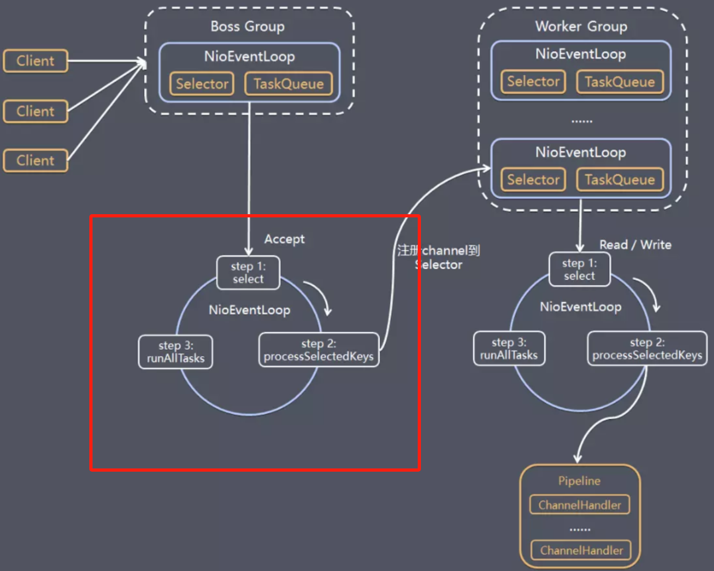
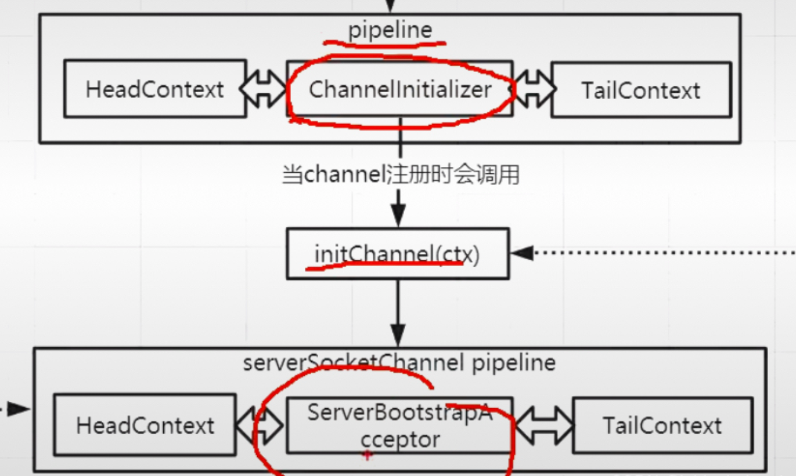

# Netty 核心线程模型源码`服务端`

## Netty 线程模型源码分析

### 服务端源码分析

### 创建NioEventLoopGroup()

> 创建了 `NioEventLoopGroup` 实例，用于管理 `NioEventLoop` 实例，循环创建并指定 `NioEventLoop` 实例的数量
>
> `NioEventLoop`创建了其中的线程池，多路复用器和任务阻塞队列等属性

首先我们在写 Netty 服务端程序的时候最开始是下面两句代码：

```java
//指定EvenLoopGroup中EvenLoop（线程数）的数量
EvenLoopGroup bossGroup = new NioEventLoopGroup(1);
//使用默认数量
EvenLoopGroup bossGroup = new NioEventLoopGroup();
```

进入他们的默认构造方法：**NioEventLoopGroup()**

```java
//如果我们不传递参数，默认数就是0
 public NioEventLoopGroup() {
        this(0);
    }

protected MultithreadEventLoopGroup(int nThreads, ThreadFactory threadFactory, Object... args) {
        super(nThreads == 0 ? DEFAULT_EVENT_LOOP_THREADS : nThreads, threadFactory, args);
    }
```

最核心的是 `super(nThreads == 0 ? DEFAULT_EVENT_LOOP_THREADS : nThreads, threadFactory, args);`这里面它判断参数传入的线程数 `nThreads` 是否为 0，如果是 0 线程数就是默认的 `DEFAULT_EVENT_LOOP_THREADS`

这个默认值是怎么初始化的？

```java
private static final int DEFAULT_EVENT_LOOP_THREADS = Math.max(1, SystemPropertyUtil.getInt("io.netty.eventLoopThreads", NettyRuntime.availableProcessors() * 2));
```

上面代码的逻辑就是 1 和 `SystemPropertyUtil.getInt` 的返回值进行比较

这个方法会首先判断系统参数 `"io.netty.eventLoopThreads"` 是否配置了，配置了就用该系统参数的值，没有配置就使用 `NettyRuntime.availableProcessors() * 2` 也就是**该机器核数的 2 倍**

上面代码就设置了 `NioEventLoopGroup` 中线程数的数量。我们继续进入 上面的**super** 方法。

```java
protected MultithreadEventExecutorGroup(int nThreads, Executor executor, EventExecutorChooserFactory chooserFactory, Object... args) {
        this.terminatedChildren = new AtomicInteger();
        this.terminationFuture = new DefaultPromise(GlobalEventExecutor.INSTANCE);
        //如果参数nThreads是0，就抛出异常
        if (nThreads <= 0) {
            throw new IllegalArgumentException(String.format("nThreads: %d (expected: > 0)", nThreads));
        } else {
        	// 在前面的代码中我们并没有指定线程池，这个if就是帮我们创建线程池
            if (executor == null) {
                executor = new ThreadPerTaskExecutor(this.newDefaultThreadFactory());
            }
			//这里又指定了一个线程池数组，然后数量就是参数nThreads(线程池数组）
            this.children = new EventExecutor[nThreads];
            int j;
            //遍历线程池数组中每一个线程池
            for(int i = 0; i < nThreads; ++i) {
                boolean success = false;
                boolean var18 = false;
                try {
                    var18 = true;
                    //给线程池赋值
                    this.children[i] = this.newChild((Executor)executor, args);
                    success = true;
                    var18 = false;
                } catch (Exception var19) {
                    throw new IllegalStateException("failed to create a child event loop", var19);
                } finally {
                    if (var18) {
                        if (!success) {
                            int j;
                            for(j = 0; j < i; ++j) {
                                this.children[j].shutdownGracefully();
                            }
                            for(j = 0; j < i; ++j) {
                                EventExecutor e = this.children[j];
                                try {
                                    while(!e.isTerminated()) {
                                        e.awaitTermination(2147483647L, TimeUnit.SECONDS);
                                    }
                                } catch (InterruptedException var20) {
                                    Thread.currentThread().interrupt();
                                    break;
                                }
                            }
                        }
                    }
                }
                if (!success) {
                    for(j = 0; j < i; ++j) {
                        this.children[j].shutdownGracefully();
                    }
                    for(j = 0; j < i; ++j) {
                        EventExecutor e = this.children[j];
                        try {
                            while(!e.isTerminated()) {
                                e.awaitTermination(2147483647L, TimeUnit.SECONDS);
                            }
                        } catch (InterruptedException var22) {
                            Thread.currentThread().interrupt();
                            break;
                        }
                    }
                }
            }
            this.chooser = chooserFactory.newChooser(this.children);
            FutureListener<Object> terminationListener = new FutureListener<Object>() {
                public void operationComplete(Future<Object> future) throws Exception {
                    if (MultithreadEventExecutorGroup.this.terminatedChildren.incrementAndGet() == MultithreadEventExecutorGroup.this.children.length) {
                        MultithreadEventExecutorGroup.this.terminationFuture.setSuccess((Object)null);
                    }
                }
            };
            EventExecutor[] var24 = this.children;
            j = var24.length;
            for(int var26 = 0; var26 < j; ++var26) {
                EventExecutor e = var24[var26];
                e.terminationFuture().addListener(terminationListener);
            }
            Set<EventExecutor> childrenSet = new LinkedHashSet(this.children.length);
            Collections.addAll(childrenSet, this.children);
            this.readonlyChildren = Collections.unmodifiableSet(childrenSet);
        }
    }
```

第一个核心代码： `this.children[i] = this.newChild((Executor)executor, args);`

```java
//NIOEventLoopGroup的实现
 protected EventLoop newChild(Executor executor, Object... args) throws Exception {
        EventLoopTaskQueueFactory queueFactory = args.length == 4 ? (EventLoopTaskQueueFactory)args[3] : null;
     	//创建了一个新的 NioEventLoop 实例，并传入了所需的参数
     	//this：表示当前的 NioEventLoopGroup 实例
     	//executor：用于执行任务的执行器
     	//(SelectorProvider)args[0]:可变参数数组中的第一个参数，表示 SelectorProvider，用于提供 Selector 实例
     	//..
        return new NioEventLoop(this, executor, (SelectorProvider)args[0], ((SelectStrategyFactory)args[1]).newSelectStrategy(), (RejectedExecutionHandler)args[2], queueFactory);
    }
```

从返回值看到类型是 `NioEventLoop`，也就是说` this.children[i]` 这个线程池数组中放的是 `NioEventLoop` 对象

**继续进入 NioEventLoop 的构造函数：**

```java
NioEventLoop(NioEventLoopGroup parent, Executor executor, SelectorProvider selectorProvider, SelectStrategy strategy, RejectedExecutionHandler rejectedExecutionHandler, EventLoopTaskQueueFactory queueFactory) {
        super(parent, executor, false, newTaskQueue(queueFactory), newTaskQueue(queueFactory), rejectedExecutionHandler);
        if (selectorProvider == null) {
            throw new NullPointerException("selectorProvider");
        } else if (strategy == null) {
            throw new NullPointerException("selectStrategy");
        } else {
            this.provider = selectorProvider;
            SelectorTuple selectorTuple = this.openSelector();
            this.selector = selectorTuple.selector;
            this.unwrappedSelector = selectorTuple.unwrappedSelector;
            this.selectStrategy = strategy;
        }
    }
```

上面代码首先第一句是调用父类的构造方法：`super(parent, executor, false, newTaskQueue(queueFactory), newTaskQueue(queueFactory),rejectedExecutionHandler);`

**设置相关属性和状态**


```java
protected SingleThreadEventLoop(EventLoopGroup parent, Executor executor, boolean addTaskWakesUp, Queue<Runnable> taskQueue, Queue<Runnable> tailTaskQueue, RejectedExecutionHandler rejectedExecutionHandler) {
    super(parent, executor, addTaskWakesUp, taskQueue, rejectedExecutionHandler);
    this.tailTasks = (Queue)ObjectUtil.checkNotNull(tailTaskQueue, "tailTaskQueue");
}

protected SingleThreadEventExecutor(EventExecutorGroup parent, Executor executor, boolean addTaskWakesUp, int maxPendingTasks, RejectedExecutionHandler rejectedHandler) {
    super(parent);
    this.threadLock = new CountDownLatch(1);
    this.shutdownHooks = new LinkedHashSet();
    this.state = 1;
    this.terminationFuture = new DefaultPromise(GlobalEventExecutor.INSTANCE);
    this.addTaskWakesUp = addTaskWakesUp;
    this.maxPendingTasks = Math.max(16, maxPendingTasks);
    this.executor = ThreadExecutorMap.apply(executor, this);
    //这个taskQueue的底层本质上就是一个LinkedBlockingQueue，阻塞队列
    this.taskQueue = this.newTaskQueue(this.maxPendingTasks);
    this.rejectedExecutionHandler = (RejectedExecutionHandler)ObjectUtil.checkNotNull(rejectedHandler, "rejectedHandler");
}
```

**继续回到 `NioEventLoop` 构造函数**

```java
this.provider = selectorProvider;
SelectorTuple selectorTuple = this.openSelector();
this.selector = selectorTuple.selector;
```

上面代码逻辑其实在 Java 的 `NIO` 中也有，就是获取一个 Selector，然后赋值给了 `this.selector` 这个 `Ni oEventLoop` 成员变量。到这里 NioEventLoop 的两个核心组件 **Selector 和 TaskQueue** 就找到源头了，我们继续回到 `MultithreadEventExecutorGroup` 方法：

```java
 this.children[i] = this.newChild((Executor)executor, args);
```

通过上面分析，我们知道了 this.children [I] 这个线程池数组里面封装的就是一个一个的 NioEventLoop，然后 NioEventLoop 底层就是一个 Selector 一个 TaskQueue，也正是对应了线程模型中的第一个部分

然后 `newChild((Executor)executor, args);` 这个方法的第一个参数就是 `executor` 它是我们前面创建的一个 `ThreadPerTaskExecutor` 线程池

到此 `NioEventLoopGroup` 创建的大致的底层逻辑就分析完了，主程序就开始执行下面代码：


### ServerBootStrap()链式调用

> 作为服务端启动对象，先设置了两个线程组
>
> 为了使用NioServerSocketChannel作为服务器通道的实现，保存了NioServerSocketChannel的构造函数
>
> 初始化服务器的连接队列大小
>
> 主要就是通过链式调用设置了启动对象的属性

```java
try{
	//创建服务器端的启动对象
	ServerBootStrap bootstrap =new ServerBootStrap();
}
```

点进 `ServerBootStrap` 的构造函数：

```java
public ServerBootstrap() {
    }
```

可以发现它的构造方法中什么也没干，`配置都是在后面的链式中完成的`，继续执行主业务代码：

```java
try{
	//创建服务器端的启动对象
	ServerBootStrap bootstrap =new ServerBootStrap();
	//使用链式编程来配置参数
	bootstrap.group(bossGroup,workerGroup)//设置两个线程组
}
```

`ServerBootStrap` 的参数的配置通常使用链式编程的方式进行配置，首先看第一个配置`.group(bossGroup,childGroup)`，从形式上看就是将我们前面定义的两个 `NiojEventLoopGroup` 设置进去了，我们进去源码看看：

```java
public ServerBootstrap group(EventLoopGroup parentGroup, EventLoopGroup childGroup) {
        super.group(parentGroup);
        ObjectUtil.checkNotNull(childGroup, "childGroup");
        if (this.childGroup != null) {
            throw new IllegalStateException("childGroup set already");
        } else {
            this.childGroup = childGroup;
            return this;
        }
    }

 public B group(EventLoopGroup group) {
        ObjectUtil.checkNotNull(group, "group");
        if (this.group != null) {
            throw new IllegalStateException("group set already");
        } else {
            this.group = group;
            return this.self();
        }
    }
```

从参数我们可以看出 `bossGroup` 对应的是 `parentGroup`（父线程组），`workerGroup` 对应的是 `childGroup`（子线程组）

首先调用了` super.group(parentGroup);` 即父类的 group 方法，父类的 group 方法主要就是将 `bossGroup` 赋值给了 `this.group `成员变量，然后 `childGroup` 赋值给子类的 `this.childGroup` 成员变量，然后返回 this 当前对象，达到了链式调用的条件。

上面代码本质上就是将我们创建的 `NioEventLoopGroup` 对象保存到了 `ServerBootStrap` 对象中。到此 `group(bossGroup,workerGroup)` 方法就执行完了，继续回到主业务代码：

```java
try{
	//创建服务器端的启动对象
	ServerBootStrap bootstrap =new ServerBootStrap();
	//使用链式编程来配置参数
	bootstrap.group(bossGroup,workerGroup)//设置两个线程组
			 .channel(NioServerSocketChannel.class) //使用NioServerSocketChannel作为服务器通道的实现
}
```

进入 `channel(NioServerSocketChannel.class) `方法：

```java
public B channel(Class<? extends C> channelClass) {
        return this.channelFactory((io.netty.channel.ChannelFactory)(new ReflectiveChannelFactory((Class)ObjectUtil.checkNotNull(channelClass, "channelClass"))));
    }
```

按照代码逻辑就是调用了 `this.channelFactory` 函数，然后该函数的参数就是 `new ReflectiveChannelFactory((Class)ObjectUtil.checkNotNull(channelClass, "channelClass"))` ：根据我们传入的 `channelClass` 类型创建了一个 `ReflectiveChannelFactory` ，进入内部代码：

```java
public ReflectiveChannelFactory(Class<? extends T> clazz) {
        ObjectUtil.checkNotNull(clazz, "clazz");

        try {
        	//将我们传入的channel类型的构造函数暂存了起来
            this.constructor = clazz.getConstructor();
        } catch (NoSuchMethodException var3) {
			//..
        }
    }
```

上面方法就是**将我们的指定的 `NioServerSocketChannel` 的构造函数保存到了 `ReflectiveChannelFactory` 对象中**了，然后执行 `this.channelFactory` 方法，进入该方法：

```java
public B channelFactory(ChannelFactory<? extends C> channelFactory) {
    ObjectUtil.checkNotNull(channelFactory, "channelFactory");
    if (this.channelFactory != null) {
        throw new IllegalStateException("channelFactory set already");
    } else {
        //这里就是将前面创建的channel工厂对象保存了起来
        this.channelFactory = channelFactory;
        return this.self();
    }
}
```

上面代码就是**将前面我们创建的 `ReflectiveChannelFactory` 保存到了` this.channelFactory` 这个成员变量中**。然后回到主业务代码：

```java
try{
	//创建服务器端的启动对象
	ServerBootStrap bootstrap =new ServerBootStrap();
	//使用链式编程来配置参数
	bootstrap.group(bossGroup,workerGroup)//设置两个线程组
			 .channel(NioServerSocketChannel.class) //使用NioServerSocketChannel作为服务器通道的实现
			 .option(ChannelOption.SO_BACKLOG,1024)//初始化服务器的连接队列大小，服务端处理客户端的连接是顺序处理的，所以同一事件只能处理一个客户端连接。多个客户端同时来的时候，服务端将不能处理的连接请求放在队列中等待		
}
```

我们进入`.option` 方法：

```java
public <T> B option(ChannelOption<T> option, T value) {
        ObjectUtil.checkNotNull(option, "option");
        if (value == null) {
            this.options.remove(option);
        } else {
            this.options.put(option, value);
        }
        return this.self();
    }
//BootStrap中的成员变量中的一个map集合（存储netty程序员启动时需要设置的一些属性）
private final Map<ChannelOption<?>, Object> options = new ConcurrentHashMap();
```

`option` 方法本质上就是用来设置 Netty 启动时的一些属性的，例如 `ChannelOption.SO_BACKLOG` 就是其中之一，设置的方式就是放到了 `ServerBootStrap` 中的一个线程安全集合 `options` 中，然后继续回到业务代码：

```java
try{
	//创建服务器端的启动对象
	ServerBootStrap bootstrap =new ServerBootStrap();
	//使用链式编程来配置参数
	bootstrap.group(bossGroup,workerGroup)//设置两个线程组
			 .channel(NioServerSocketChannel.class) //使用NioServerSocketChannel作为服务器通道的实现
			 .option(ChannelOption.SO_BACKLOG,1024)//初始化服务器的连接队列大小，服务端处理客户端的连接是顺序处理的，所以同一事件只能处理一个客户端连接。多个客户端同时来的时候，服务端将不能处理的连接请求放在队列中等待		
			 .childHandler((ChannelInitializer)(ch)->{
			 	//对workerGroup的SocketChannel设置处理器
			 	ch.pipeline().addLast(new NettyServerHandler());
			 	});
}
```

**然后就是调用` .childHandler` 设置 channel 的处理器链了，这也是最核心的部分了**。我们进入该方法：

```java
public ServerBootstrap childHandler(ChannelHandler childHandler) {
	this.childHandler = (ChannelHandler)ObjectUtil.checkNotNull(childHandler, "childHandler");
	return this;
}
```

上面代码就是将 `ChannelHandler` 对象赋值给 `ServerBootStrap` 的` this.childHandler` 属性。

> 看到这里我们不难发现整个链式调用的过程其实都是在给启动器 `ServerBootStrap` 对象的成员变量进行赋值。

到此 `ServerBootStrap` 对象就创建完成了，我们继续进行业务代码：

```java
	//绑定一个端口并且同步，生成了一个ChannelFuture异步对象，通过isDone()等方法可以判断异步事件的执行情况
	//启动服务器并绑定端口，bind是异步操作，sync方法是等待异步操作执行完毕（阻塞的）
	ChannelFuture cf=bootstrap.bind(9000).sync();
```

上面的代码是`非常重要`的一句代码，这里我们详细分析一下，我们进入 `bind` 方法：


### bind()绑定端口

```java
public ChannelFuture bind(int inetPort) {
        return this.bind(new InetSocketAddress(inetPort));
    }
```

上面代码首先将我们传入的端口号 `9000` 封装为一个 `InetSocketAddress` 对象，然后调用 `ServerBootStrap` 的 `bind` 方法，我们进入该 `bind` 方法：

上面代码首先将我们传入的端口号 `9000` 封装为一个 `InetSocketAddress` 对象，然后调用 `ServerBootStrap` 的 `bind` 方法，我们进入该 `bind` 方法：

```java
public ChannelFuture bind(SocketAddress localAddress) {
    //this.validate() 的意思是对当前对象进行验证，以确保其在后续操作中的正确性和可靠性
    this.validate();
    return this.doBind((SocketAddress)ObjectUtil.checkNotNull(localAddress, "localAddress"));
}
```

核心方法是 `this.doBind` 方法，然后参数就是我们前面传入的端口号，继续进入 `this.doBind` 方法：

```java
private ChannelFuture doBind(final SocketAddress localAddress) {
    final ChannelFuture regFuture = this.initAndRegister();
    final Channel channel = regFuture.channel();
    if (regFuture.cause() != null) {
        return regFuture;
    } else if (regFuture.isDone()) {
        ChannelPromise promise = channel.newPromise();
        doBind0(regFuture, channel, localAddress, promise);
        return promise;
    } else {
        final PendingRegistrationPromise promise = new PendingRegistrationPromise(channel);
        regFuture.addListener(new ChannelFutureListener() {
            public void operationComplete(ChannelFuture future) throws Exception {
                Throwable cause = future.cause();
                if (cause != null) {
                    promise.setFailure(cause);
                } else {
                    promise.registered();
                    AbstractBootstrap.doBind0(regFuture, channel, localAddress, promise);
                }
            }
        });
        return promise;
    }
}
```

我们重点分析上面代码，首先第一句核心代码是` final ChannelFuture regFuture = this.initAndRegister();`，它调用了 `this.initAndRegister` 方法获取了一个 `ChannelFuture` 对象，我们看看 `initAndRegister` 方法：

```java
final ChannelFuture initAndRegister() {
    Channel channel = null;

    try {
        channel = this.channelFactory.newChannel();
        this.init(channel);
    } catch (Throwable var3) {
		//..
    }

    ChannelFuture regFuture = this.config().group().register(channel);
    if (regFuture.cause() != null) {
        if (channel.isRegistered()) {
            channel.close();
        } else {
            channel.unsafe().closeForcibly();
        }
    }
    return regFuture;
}
```

`channel = this.channelFactory.newChannel();`前面在分析 ServerBootStrap 对象构建过程中，分析了`.channel(NioServerSocketChannel.class)` 底层就保存了一个 channel 工厂对象，这里就将前面创建的工厂对象拿出来创建了一个 channel 对象的实例，我们进入 `newChannel()` 方法：

```java
public T newChannel() {
    try {
        return (Channel)this.constructor.newInstance();
    } catch (Throwable var2) {
		//..
    }
}
```

**channel 工厂对象内部保存的其实就是我们传入的 `NioServerSocketChannel.class` 类型的构造函数，这里就用保存的构造函数使用反射创建了一个 Channel 实例。**

这里调用的是 `NioServerSocketChannel.class` 的空构造方法，我们进入该构造方法，看它创建了一些什么东西：

```java
public NioServerSocketChannel() {
    this(newSocket(DEFAULT_SELECTOR_PROVIDER));
}
```

然后这里调用了 `newSocket(DEFAULT_SELECTOR_PROVIDER)` 方法，我们进入该方法：

```java
private static java.nio.channels.ServerSocketChannel newSocket(SelectorProvider provider) {
    try {
        return provider.openServerSocketChannel();
    } catch (IOException var2) {
        throw new ChannelException("Failed to open a server socket.", var2);
    }
}
```

`provider.openServerSocketChannel();` 这句代码和 NIO 底层的 `ServerSocketChannel` 类的 open 方法的代码一模一样，这句代码的作用就是，从返回值也可以看出是`java.nio.channels.ServerSocketChannel`

newSocket 执行完毕后，看 **this()** 调用的是哪一个构造函数：

```java
public NioServerSocketChannel(java.nio.channels.ServerSocketChannel channel) {
	super((Channel)null, channel, 16);
	this.config = new NioServerSocketChannelConfig(this, this.javaChannel().socket());
}
```

首先我们进入 super 方法，参数就是前面 `newSocket` 创建的 `java.nio.channels.ServerSocketChannel` 对象，以及一个 16

这个 16 就代表 NIO 中 Selectionkey 对象的 OP_ACCEPT 事件 `public static final int OP_ACCEPT=1<<4;`：

```java
 protected AbstractNioChannel(Channel parent, SelectableChannel ch, int readInterestOp) {
     super(parent);
     //记录serverSocketChannel
     this.ch = ch;
     //记录serverSocketChannel感兴趣的事件
     this.readInterestOp = readInterestOp;
     try {
         //设置channel为非阻塞模式
         ch.configureBlocking(false);
     } catch (IOException var7) {
         try {
             ch.close();
         } catch (IOException var6) {
             logger.warn("Failed to close a partially initialized socket.", var6);
         }
         throw new ChannelException("Failed to enter non-blocking mode.", var7);
     }
 }
```

我们继续进入 super 方法：

```java
protected AbstractChannel(Channel parent) {
    this.parent = parent;
    this.id = this.newId();
    this.unsafe = this.newUnsafe();
    this.pipeline = this.newChannelPipeline();
}
```

上面代码核心就是创建了 `this.pipeline` 对象，我们进入 `newChannelPipeline` 方法，看看底层是如何创建 `Pipeline` 的：

```java
protected DefaultChannelPipeline newChannelPipeline() {
    return new DefaultChannelPipeline(this);
}

protected DefaultChannelPipeline(Channel channel) {
    this.channel = (Channel)ObjectUtil.checkNotNull(channel, "channel");
    this.succeededFuture = new SucceededChannelFuture(channel, (EventExecutor)null);
    this.voidPromise = new VoidChannelPromise(channel, true);
    //默认放了一个尾节点
    this.tail = new TailContext(this);
    //默认放了一个头节点
    this.head = new HeadContext(this);
    //说明是一个双向链表
    this.head.next = this.tail;
    this.tail.prev = this.head;
}
```

到此 `channelFactory.newChannel` 底层的逻辑我们就看完了

**其实就是创建了一个 ServerSocketChannel，然后构建了 pipeline 对象，我们继续回到 `initAndRegister()` 方法**：

```java
final ChannelFuture initAndRegister() {
        Channel channel = null;

        try {
            channel = this.channelFactory.newChannel();
            this.init(channel);
        } 
```

然后就行调用` this.init(channel);` 方法，我们进入该方法：

```java
//参数就是前面创建的NioServerSocketChannel对象
void init(Channel channel) {
        setChannelOptions(channel, (Map.Entry[])this.options0().entrySet().toArray(newOptionArray(0)), logger);
        setAttributes(channel, (Map.Entry[])this.attrs0().entrySet().toArray(newAttrArray(0)));
        ChannelPipeline p = channel.pipeline();
        final EventLoopGroup currentChildGroup = this.childGroup;
        final ChannelHandler currentChildHandler = this.childHandler;
        final Map.Entry<ChannelOption<?>, Object>[] currentChildOptions = (Map.Entry[])this.childOptions.entrySet().toArray(newOptionArray(0));
        final Map.Entry<AttributeKey<?>, Object>[] currentChildAttrs = (Map.Entry[])this.childAttrs.entrySet().toArray(newAttrArray(0));
    	
        p.addLast(new ChannelHandler[]{new ChannelInitializer<Channel>() {
            
            public void initChannel(final Channel ch) {
            //拿到前面创建的管道
                final ChannelPipeline pipeline = ch.pipeline();
                ChannelHandler handler = ServerBootstrap.this.config.handler();
                if (handler != null) {
                    pipeline.addLast(new ChannelHandler[]{handler});
                }

                ch.eventLoop().execute(new Runnable() {
                    public void run() {
                        pipeline.addLast(new ChannelHandler[]{new ServerBootstrapAcceptor(ch, currentChildGroup, currentChildHandler, currentChildOptions, currentChildAttrs)});
                    }
                });
            }
        }});
    }
```

上面代码最核心的一部分是下面这一段代码：

```java
 p.addLast(new ChannelHandler[]{new ChannelInitializer<Channel>() {
     public void initChannel(final Channel ch) {
         final ChannelPipeline pipeline = ch.pipeline();
         ChannelHandler handler = ServerBootstrap.this.config.handler();
         if (handler != null) {
             pipeline.addLast(new ChannelHandler[]{handler});
         }

         ch.eventLoop().execute(new Runnable() {
             public void run() {
                 pipeline.addLast(new ChannelHandler[]{new ServerBootstrapAcceptor(ch, currentChildGroup, currentChildHandler, currentChildOptions, currentChildAttrs)});
             }
         });
     }
 }});
```

使用 netty 的都知道这个就是向管道（ServerSocketChannel）中加入了一个处理器 handler，这个 handler 的作用我们后面再分析，现在 pipeline 里面有三个 handler 了。到此 `init` 方法执行完毕了，继续回到 `initAndRegister` 方法。

```java
final ChannelFuture initAndRegister() {
        Channel channel = null;
        try {
            channel = this.channelFactory.newChannel();
            this.init(channel);
        } catch (Throwable var3) {
            if (channel != null) {
                channel.unsafe().closeForcibly();
                return (new DefaultChannelPromise(channel, GlobalEventExecutor.INSTANCE)).setFailure(var3);
            }
            return (new DefaultChannelPromise(new FailedChannel(),GlobalEventExecutor.INSTANCE)).setFailure(var3);
        }
        ChannelFuture regFuture = this.config().group().register(channel);
        if (regFuture.cause() != null) {
            if (channel.isRegistered()) {
                channel.close();
            } else {
                channel.unsafe().closeForcibly();
            }
        }
        return regFuture;
    }
```

然后下一句核心代码是 `ChannelFuture regFuture = this.config().group().register(channel);`，签名我们的 ServerSocketChannel 已经创建完了，但是按照 NIO 的逻辑，Channel 需要注册到 Selector 中与感兴趣的事件绑定，这句代码就在干这个事，我们进入该方法：

> config 返回 ServerBootStrap 对象，group 返回 EventLoopGroup 对象（注意这个 EventLoopGroup 是 bossGroup）

```java
//注意前面group返回的事EventLoopGroup对象，所以这个register的实现就是`MultiThreadEventLoopGroup`
 public ChannelFuture register(Channel channel) {
        return this.next().register(channel);
    }
```

next 方法就是获取下一个 `EventLoop` 对象，然后调用 `EventLoop` 对象的 `register` 方法：

```java
//注意此时调用register方法的是`EventLoop`对象，所以register方法的实现是`SingleThreadEventLoopGroup`
  @Override
    public ChannelFuture register(Channel channel) {
        return register(new DefaultChannelPromise(channel, this));
    }
@Override
    public ChannelFuture register(final ChannelPromise promise) {
        ObjectUtil.checkNotNull(promise, "promise");
        promise.channel().unsafe().register(this, promise);
        return promise;
    }

@Override
        public final void register(EventLoop eventLoop, final ChannelPromise promise) {
            if (eventLoop == null) {
                throw new NullPointerException("eventLoop");
            }
            if (isRegistered()) {
                promise.setFailure(new IllegalStateException("registered to an event loop already"));
                return;
            }
            if (!isCompatible(eventLoop)) {
                promise.setFailure(
                        new IllegalStateException("incompatible event loop type: " + eventLoop.getClass().getName()));
                return;
            }

            AbstractChannel.this.eventLoop = eventLoop;
			//判断你传入的线程和当前的线程是否是一样
            if (eventLoop.inEventLoop()) {
            	//如果是一样，直接调用register0
                register0(promise);
            } else {
                try {
                	//否则使用你传入的线程来执行任务（这里就实现了异步调用）
                    eventLoop.execute(new Runnable() {
                        @Override
                        public void run() {
                            register0(promise);
                        }
                    });
                } catch (Throwable t) {
					//..
                }
            }
        }
```

上面代码的核心部分是：

```java
//判断你传入的线程和当前的线程是否是一样
if (eventLoop.inEventLoop()) {
    //如果是一样，直接调用register0
    register0(promise);
} else {
    try {
        //否则使用你传入的线程来执行任务（这里就实现了异步调用）
        eventLoop.execute(new Runnable() {
            @Override
            public void run() {
                register0(promise);
            }
        });
    }
```

netty 异步调用逻辑的核心代码就在 try 语句块中，我们进入 execute 方法：

```java
@Override
    public void execute(Runnable task) {
        if (task == null) {
            throw new NullPointerException("task");
        }
        boolean inEventLoop = inEventLoop();
        //将我们前面传的Runnable任务添加到了队列中
        addTask(task);
        if (!inEventLoop) {
            startThread();
            if (isShutdown()) {
                boolean reject = false;
                try {
                    if (removeTask(task)) {
                        reject = true;
                    }
                } catch (UnsupportedOperationException e) {
					//..
                }
                if (reject) {
                    reject();
                }
            }
        }
        if (!addTaskWakesUp && wakesUpForTask(task)) {
            wakeup(inEventLoop);
        }
    }
```

上面代码的核心就是 `addTask(task);`，它将前面传的 Runnable 任务添加到了队列中（EventLoop 的 TaskQueue）。

```java
    protected void addTask(Runnable task) {
        if (task == null) {
            throw new NullPointerException("task");
        }
        if (!offerTask(task)) {
            reject(task);
        }
    }

    final boolean offerTask(Runnable task) {
        if (isShutdown()) {
            reject();
        }
        return taskQueue.offer(task);
    }
```

回到 `execute` 方法，将任务丢到队列后，下面就调用` startThread();`，启动线程了，我们进入该方法：

```java
    private void startThread() {
        if (state == ST_NOT_STARTED) {
            if (STATE_UPDATER.compareAndSet(this, ST_NOT_STARTED, ST_STARTED)) {
                boolean success = false;
                try {
                    doStartThread();
                    success = true;
                } finally {
                    if (!success) {
                        STATE_UPDATER.compareAndSet(this, ST_STARTED, ST_NOT_STARTED);
                    }
                }
            }
        }
    }


private void doStartThread() {
        assert thread == null;
        //executor就是在创建EventLoopGroup时候创建的那个单线程线程池
        executor.execute(new Runnable() {
            @Override
            public void run() {
                thread = Thread.currentThread();
                if (interrupted) {
                    thread.interrupt();
                }
                boolean success = false;
                updateLastExecutionTime();
                try {
                    SingleThreadEventExecutor.this.run();
                    success = true;
                } catch (Throwable t) {
                   //..
                } finally {
                    for (;;) {
                        int oldState = state;
                        if (oldState >= ST_SHUTTING_DOWN || STATE_UPDATER.compareAndSet(
                                SingleThreadEventExecutor.this, oldState, ST_SHUTTING_DOWN)) {
                            break;
                        }
                    }
                    if (success && gracefulShutdownStartTime == 0) {
                        if (logger.isErrorEnabled()) {
							//..
                        }
                    }
                    try {
                        for (;;) {
                            if (confirmShutdown()) {
                                break;
                            }
                        }
                    } finally {
                        try {
                            cleanup();
                        } finally {
                            FastThreadLocal.removeAll();
                            STATE_UPDATER.set(SingleThreadEventExecutor.this, ST_TERMINATED);
                            threadLock.countDown();
							//..
                            terminationFuture.setSuccess(null);
                        }
                    }
                }
            }
        });
    }
```

进入核心代码` SingleThreadEventExecutor.this.run();`：

```java
@Override
    protected void run() {
       //死循环
        for (;;) {
            try {
                try {
                    switch (selectStrategy.calculateStrategy(selectNowSupplier, hasTasks())) {
                    case SelectStrategy.CONTINUE:
                        continue;
                    case SelectStrategy.BUSY_WAIT:
                    case SelectStrategy.SELECT:
                        select(wakenUp.getAndSet(false));
                        if (wakenUp.get()) {
                            selector.wakeup();
                        }
                    default:
                    }
                } catch (IOException e) {
                    rebuildSelector0();
                    handleLoopException(e);
                    continue;
                }
                cancelledKeys = 0;
                needsToSelectAgain = false;
                final int ioRatio = this.ioRatio;
                if (ioRatio == 100) {
                    try {
                        processSelectedKeys();
                    } finally {
                        runAllTasks();
                    }
                } else {
                    final long ioStartTime = System.nanoTime();
                    try {
                        processSelectedKeys();
                    } finally {
                        final long ioTime = System.nanoTime() - ioStartTime;
                        runAllTasks(ioTime * (100 - ioRatio) / ioRatio);
                    }
                }
            } catch (Throwable t) {
                handleLoopException(t);
            }
            try {
                if (isShuttingDown()) {
                    closeAll();
                    if (confirmShutdown()) {
                        return;
                    }
                }
            } catch (Throwable t) {
                handleLoopException(t);
            }
        }
    }
```

上面代码的核心就是` select(wakenUp.getAndSet(false));` 方法，我们进入该方法：

```java
@Override
    protected void run() {
       //死循环
        for (;;) {
            try {
                try {
                    switch (selectStrategy.calculateStrategy(selectNowSupplier, hasTasks())) {
                    case SelectStrategy.CONTINUE:
                        continue;

                    case SelectStrategy.BUSY_WAIT:
                        // fall-through to SELECT since the busy-wait is not supported with NIO

                    case SelectStrategy.SELECT:
                        select(wakenUp.getAndSet(false));


                        if (wakenUp.get()) {
                            selector.wakeup();
                        }
                        // fall through
                    default:
                    }
                } catch (IOException e) {
                    // If we receive an IOException here its because the Selector is messed up. Let's rebuild
                    // the selector and retry. https://github.com/netty/netty/issues/8566
                    rebuildSelector0();
                    handleLoopException(e);
                    continue;
                }

                cancelledKeys = 0;
                needsToSelectAgain = false;
                final int ioRatio = this.ioRatio;
                if (ioRatio == 100) {
                    try {
                        processSelectedKeys();
                    } finally {
                        // Ensure we always run tasks.
                        runAllTasks();
                    }
                } else {
                    final long ioStartTime = System.nanoTime();
                    try {
                        processSelectedKeys();
                    } finally {
                        // Ensure we always run tasks.
                        final long ioTime = System.nanoTime() - ioStartTime;
                        runAllTasks(ioTime * (100 - ioRatio) / ioRatio);
                    }
                }
            } catch (Throwable t) {
                handleLoopException(t);
            }
            // Always handle shutdown even if the loop processing threw an exception.
            try {
                if (isShuttingDown()) {
                    closeAll();
                    if (confirmShutdown()) {
                        return;
                    }
                }
            } catch (Throwable t) {
                handleLoopException(t);
            }
        }
    }
12345678910111213141516171819202122232425262728293031323334353637383940414243444546474849505152535455565758596061626364656667
```

上面代码的核心就是` select(wakenUp.getAndSet(false));` 方法，我们进入该方法：

```java
private void select(boolean oldWakenUp) throws IOException {
		//获得了selector
        Selector selector = this.selector;
        try {
            int selectCnt = 0;
            long currentTimeNanos = System.nanoTime();
            long selectDeadLineNanos = currentTimeNanos + delayNanos(currentTimeNanos);

            long normalizedDeadlineNanos = selectDeadLineNanos - initialNanoTime();
            if (nextWakeupTime != normalizedDeadlineNanos) {
                nextWakeupTime = normalizedDeadlineNanos;
            }
            for (;;) {
                long timeoutMillis = (selectDeadLineNanos - currentTimeNanos + 500000L) / 1000000L;
                if (timeoutMillis <= 0) {
                    if (selectCnt == 0) {
                        selector.selectNow();
                        selectCnt = 1;
                    }
                    break;
                }

                // If a task was submitted when wakenUp value was true, the task didn't get a chance to call
                // Selector#wakeup. So we need to check task queue again before executing select operation.
                // If we don't, the task might be pended until select operation was timed out.
                // It might be pended until idle timeout if IdleStateHandler existed in pipeline.
                if (hasTasks() && wakenUp.compareAndSet(false, true)) {
                    selector.selectNow();
                    selectCnt = 1;
                    break;
                }

                int selectedKeys = selector.select(timeoutMillis);
                selectCnt ++;

                if (selectedKeys != 0 || oldWakenUp || wakenUp.get() || hasTasks() || hasScheduledTasks()) {
                    // - Selected something,
                    // - waken up by user, or
                    // - the task queue has a pending task.
                    // - a scheduled task is ready for processing
                    break;
                }
                if (Thread.interrupted()) {
                    // Thread was interrupted so reset selected keys and break so we not run into a busy loop.
                    // As this is most likely a bug in the handler of the user or it's client library we will
                    // also log it.
                    //
                    // See https://github.com/netty/netty/issues/2426
                    if (logger.isDebugEnabled()) {
                        logger.debug("Selector.select() returned prematurely because " +
                                "Thread.currentThread().interrupt() was called. Use " +
                                "NioEventLoop.shutdownGracefully() to shutdown the NioEventLoop.");
                    }
                    selectCnt = 1;
                    break;
                }

                long time = System.nanoTime();
                if (time - TimeUnit.MILLISECONDS.toNanos(timeoutMillis) >= currentTimeNanos) {
                    // timeoutMillis elapsed without anything selected.
                    selectCnt = 1;
                } else if (SELECTOR_AUTO_REBUILD_THRESHOLD > 0 &&
                        selectCnt >= SELECTOR_AUTO_REBUILD_THRESHOLD) {
                    // The code exists in an extra method to ensure the method is not too big to inline as this
                    // branch is not very likely to get hit very frequently.
                    selector = selectRebuildSelector(selectCnt);
                    selectCnt = 1;
                    break;
                }

                currentTimeNanos = time;
            }

            if (selectCnt > MIN_PREMATURE_SELECTOR_RETURNS) {
                if (logger.isDebugEnabled()) {
                    logger.debug("Selector.select() returned prematurely {} times in a row for Selector {}.",
                            selectCnt - 1, selector);
                }
            }
        } catch (CancelledKeyException e) {
            if (logger.isDebugEnabled()) {
                logger.debug(CancelledKeyException.class.getSimpleName() + " raised by a Selector {} - JDK bug?",
                        selector, e);
        }
    }
```

上面代码的核心代码就是 `int selectedKeys = selector.select(timeoutMillis);`

**这里就调用了 Selector 的 select 方法，学习 NIO 后我们知道这个方法是一个阻塞方法，方法结果的返回值就是已经就绪的事件**

这里设置了超时时间，到了超时时间不管有没有事件就绪，select 方法就会执行完毕。上面代码核心就是调用了一个 select 方法，回到 run 方法：

```java
if (ioRatio == 100) {
    try {
        processSelectedKeys();
    } finally {
        // Ensure we always run tasks.
        runAllTasks();
    }
}
```

回到线程模型图，我们就回到了下面红圈部分：



第二步就是调用 `processSelectedKeys()` 方法，我们进入该方法：

```java
private void processSelectedKeys() {
    if (selectedKeys != null) {
        processSelectedKeysOptimized();
    } else {
        processSelectedKeysPlain(selector.selectedKeys());
    }
}
```

如果 `selectedKeys` 不为空，进入 `processSelectedKeysOptimized` 方法：

```java
private void processSelectedKeysOptimized() {
    for (int i = 0; i < selectedKeys.size; ++i) {
        final SelectionKey k = selectedKeys.keys[i];
        selectedKeys.keys[i] = null;
        final Object a = k.attachment();
        if (a instanceof AbstractNioChannel) {
            processSelectedKey(k, (AbstractNioChannel) a);
        } else {
            @SuppressWarnings("unchecked")
            NioTask<SelectableChannel> task = (NioTask<SelectableChannel>) a;
            processSelectedKey(k, task);
        }
        if (needsToSelectAgain) {
            selectedKeys.reset(i + 1);
            selectAgain();
            i = -1;
        }
    }
}
```

上面核心代码就是 NIO 代码的逻辑，这里就不详细分析了。回到 run 方法，下面就会调用 `runAllTasks()` 方法：

```java
protected boolean runAllTasks() {
    assert inEventLoop();
    boolean fetchedAll;
    boolean ranAtLeastOne = false;

    do {
        fetchedAll = fetchFromScheduledTaskQueue();
        if (runAllTasksFrom(taskQueue)) {
            ranAtLeastOne = true;
        }
    } while (!fetchedAll);

    if (ranAtLeastOne) {
        lastExecutionTime = ScheduledFutureTask.nanoTime();
    }
    afterRunningAllTasks();
    return ranAtLeastOne;
}
```

上面代码就是将 EventLoop 的 TaskQueue 中的任务拿出来执行。这里我们就得回到前面的 register 方法，因为在这里我们加入的一个任务会在 `runAllTasks` 方法中执行：

```java
eventLoop.execute(new Runnable() {
    @Override
    public void run() {
        register0(promise);
    }
});
```

进入 register0 方法：

```java
private void register0(ChannelPromise promise) {
            try {
                if (!promise.setUncancellable() || !ensureOpen(promise)) {
                    return;
                }
                boolean firstRegistration = neverRegistered;
                doRegister();
                neverRegistered = false;
                registered = true;
                pipeline.invokeHandlerAddedIfNeeded();
                safeSetSuccess(promise);
                pipeline.fireChannelRegistered();
                if (isActive()) {
                    if (firstRegistration) {
                        pipeline.fireChannelActive();
                    } else if (config().isAutoRead()) {
                        beginRead();
                    }
                }
            } catch (Throwable t) {
                closeForcibly();
                closeFuture.setClosed();
                safeSetFailure(promise, t);
            }
        }
```

注意上面代码第一个十分核心的代码` doRegister();`，我们进入该方法：

```java
@Override
protected void doRegister() throws Exception {
    boolean selected = false;
    for (;;) {
        try {
            selectionKey = javaChannel().register(eventLoop().unwrappedSelector(), 0, this);
            return;
        } catch (CancelledKeyException e) {
            if (!selected) {
                eventLoop().selectNow();
                selected = true;
            } else {
                throw e;
            }
        }
    }
}
```

`javaChannel()` 就是前面创建的 ServerSocketChannel，然后调用 register 方法将 ServerSocketChannel 注册到了 Selector 中了，然后绑定了感兴趣的事件。这里也是 NIO 的逻辑。回到 `register0` 方法，下一个核心代码是:

```java
pipeline.invokeHandlerAddedIfNeeded();
safeSetSuccess(promise);
pipeline.fireChannelRegistered();
if (isActive()) {
    if (firstRegistration) {
        pipeline.fireChannelActive();
    } else if (config().isAutoRead()) {
        beginRead();
    }
}
```

`invokeHandlerAddedIfNeeded();` 这里底层源码比较复杂，**它底层其实会调用我们之前在初始化 pipeLine 的时候加入的一个 handler：**

```java
p.addLast(new ChannelHandler[]{new ChannelInitializer<Channel>() {
            public void initChannel(final Channel ch) {
                final ChannelPipeline pipeline = ch.pipeline();
                ChannelHandler handler = ServerBootstrap.this.config.handler();
                if (handler != null) {
                    pipeline.addLast(new ChannelHandler[]{handler});
                }

                ch.eventLoop().execute(new Runnable() {
                    public void run() {
                        pipeline.addLast(new ChannelHandler[]{new ServerBootstrapAcceptor(ch, currentChildGroup, currentChildHandler, currentChildOptions, currentChildAttrs)});
                    }
                });
            }
        }});
```

执行了上面的代码 PipeLine 里面的 handler 的情况变化如下：



继续执行下面代码：

```java
pipeline.fireChannelRegistered();
	
	//head就是前面双向链表的头节点
  @Override
    public final ChannelPipeline fireChannelRegistered() {
        AbstractChannelHandlerContext.invokeChannelRegistered(head);
        return this;
    }

 static void invokeChannelRegistered(final AbstractChannelHandlerContext next) {
        EventExecutor executor = next.executor();
        if (executor.inEventLoop()) {
        //同步方式调用
            next.invokeChannelRegistered();
        } else {
        //异步方式调用
            executor.execute(new Runnable() {
                @Override
                public void run() {
                    next.invokeChannelRegistered();
                }
            });
        }
    }

private void invokeChannelRegistered() {
        if (invokeHandler()) {
            try {
                ((ChannelInboundHandler) handler()).channelRegistered(this);
            } catch (Throwable t) {
                notifyHandlerException(t);
            }
        } else {
            fireChannelRegistered();
        }
    }

  @Override
    public void channelRegistered(ChannelHandlerContext ctx) throws Exception {
        handleNewChannel(ctx);
       ctx.fireChannelRegistered();
    }
```

`((ChannelInboundHandler) handler()).channelRegistered(this);` 就调用了 handler 的 `channelRegistered` 方法，然后 `ctx.fireChannelRegistered();` 就是调用 pipeline 中下一个 handler 的核心逻辑。