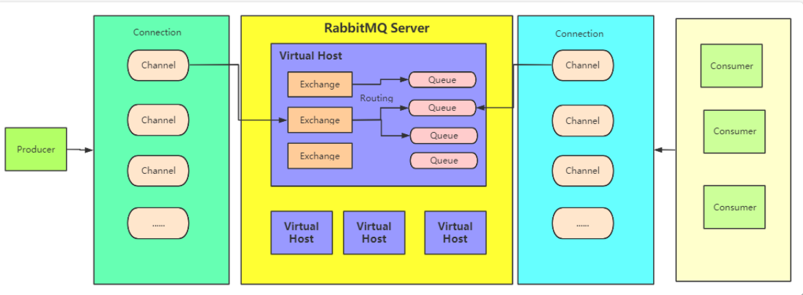
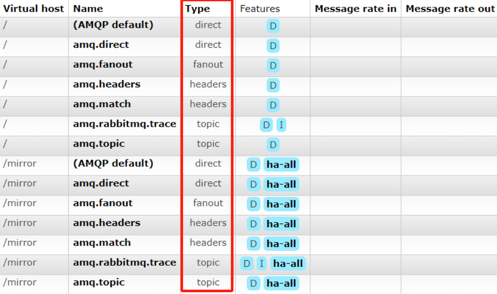
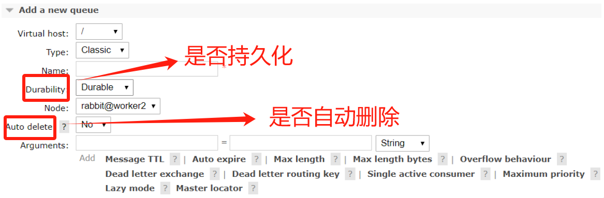
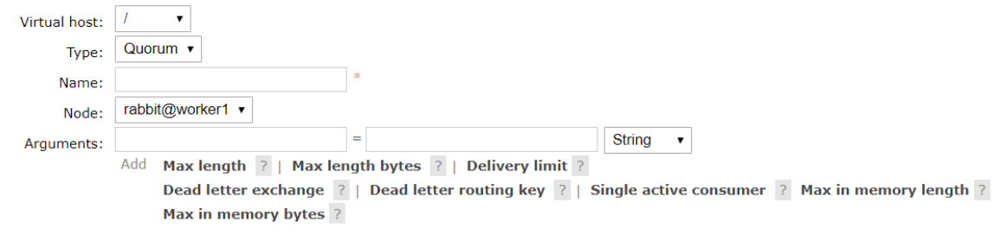
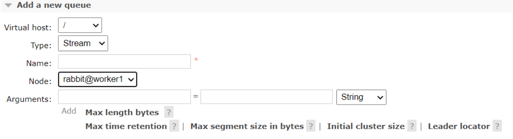

# RabbitMQ 基础

## 基础概念



### 虚拟主机 virtual host

RabbitMQ出于服务器复用的想法，可以在一 个RabbitMQ集群中划分出多个虚拟主机

每一个虚拟主机都有AMQP ` Advanced Message Queuing Protocol（高级消息队列协议）`  的全套基础 组件，并且可以针对每个虚拟主机进行权限以及数据分配，并且不同虚拟主机之间 是完全隔离的


### 连接 Connection

客户端与RabbitMQ进行交互，首先就需要建立一个TPC连接，这个连接就是 Connection


### 信道 Channel

一旦客户端与RabbitMQ建立了连接，就会分配一个AMQP信道 Channel。

每个 信道都会被分配一个唯一的ID。也可以理解为是客户端与RabbitMQ实际进行数据 交互的通道，我们后续的大多数的数据操作都是在信道 Channel 这个层面展开的。

 RabbitMQ为了减少性能开销，也会在一个Connection中建立多个Channel，**这样便于客户端进行多线程连接，这些连接会复用同一个Connection的TCP通道**，所 以在实际业务中，对于Connection和Channel的分配也需要根据实际情况进行考量


### 交换机 Exchange 

**这是RabbitMQ中进行数据路由的重要组件**。

消息发送到RabbitMQ中后，会首 先进入一个交换机，然后由交换机负责将数据转发到不同的队列中。

RabbitMQ中 有多种不同类型的交换机来支持不同的路由策略。从Web管理界面就能看到，在每 个虚拟主机中，RabbitMQ都会默认创建几个不同类型的交换机



**交换机多用来与生产者打交道。**

生产者发送的消息通过Exchange交换机分配到各 个不同的Queue队列上，而对于消息消费者来说，通常只需要关注自己感兴趣的队 列就可以了


### 队列 Queue

队列是实际保存数据的最小单位。队列结构天生就具有FIFO的顺序，**消息最终都会被分发到不同的队列当中，然后才被消费者进行消费处理**。

这是最近 RabbitMQ功能变动最大的地方。最为常用的是经典队列Classic，RabbitMQ 3.8.X 版本添加了**Quorum队列**，3.9.X又添加了**Stream队列**。


## Queue类别

### Classic 经典队列

这是RabbitMQ最为经典的队列类型。在单机环境中，拥有比较高的消息可靠 性。



其中，Durability有两个选项：

- Durable

  表示队列会将消息**保存到硬盘**，这样**消息的安全性更高**。

  但是同时，由于需要有**更多的IO操作**，**所以生产和消费消息的性能，相比Transient会比较低**

- Transient

  暂存。应用重启后消息就会消失

**Auto delete属性**如果选择为是，那队列将在至少一个消费者已经连接，然后所有的消费者都断开连接后删除自己

后面的Arguments部分，还有非常多的参数，可以点击后面的问号逐步了解

> 在MQ当中，队列其实是MQ集群中的一个数据分片的最 小单位。在MQ集群中，一个Topic会对应多个队列，而这些队列会均匀 的分配到集群的各个节点当中。


### Quorum 仲裁队列

仲裁队列，是RabbitMQ从3.8.0版本，引入的一个新的队列类型，整个3.8.X版 本，也都是在围绕仲裁队列进行完善和优化。

**仲裁队列相比Classic经典队列，在分布式环境下对消息的可靠性保障更高。**



**Quorum是基于Raft一致性协议实现的一种新型的分布式消息队列，他实现了久化，多备份的FIFO队列**，主要就是针对RabbitMQ的镜像模式设计的。

简单理解就是，**quorum队列中的消息需要有集群中多半节点同意确认后，才会写入到队列中**。

这种方式可以保证消息在集群内部不会丢失。同时，Quorum是以牺牲很多高级队列特性为代价，来进一步保 证消息在分布式环境下的高可靠

从整体功能上来说，Quorum队列是在Classic经典队列的基础上做减法，因此对 于RabbitMQ的长期使用者而言，其实是会影响使用体验的。他与普通队列的区别：

**与经典队列比较：**

Quorum队列大部分功能都是在Classic队列基础上做减法

比如Non-durable queues表示是非持久化的内存队列；Exclusivity表示独占队列，即表示队列只能由声明该队列的Connection连接来进行使用，包括队列创建、删除、收发消息等，并且独占队列会在声明该队列的Connection断开后自动删除。

其中有个特例就是这个**Poison Message(有毒的消息)**。

所谓毒消息是指**消息一直不能被消费者正常消费**(可能是由于消费者失败或者消费逻辑有问题等)，就会导致消息不断的重新入队，这样这些消息就成为了毒消息。

这些读消息应该有保障机制进行标记并及时删除。Quorum队列会持续跟踪消息的失败投递尝试次数，并记录 在"x-delivery-count"这样一个头部参数中。然后，就可以通过设置 Delivery limit 参数来定制一个毒消息的删除策略。当消息的重复投递次数超过了Delivery limit参数阈值时，RabbitMQ就会删除这些毒消息。当然，如果配置了死信队列的话，就会进入对应的死信队列

> Quorum队列更适合于**队列长期存在，并且对容错、数据安全方面的要求比低延迟、不持久等高级队列更能要求更严格的场景**。例如电商系统的订单，引入MQ 后，处理速度可以慢一点，但是订单不能丢失
>
> - 这说明 Quorum 队列更加注重容错性和数据安全性，而不是低延迟或不持久化等高级队列所关注的性能特性。
> - 相比之下，低延迟的队列可能会牺牲一定的数据一致性和安全性，以追求更快的数据传输速度，而不持久化的队列可能会将数据保存在内存中而不写入磁盘，以提高性能


### Stream队列

Stream队列是RabbitMQ自3.9.0版本开始引入的一种新的数据队列类型，也是目 前官方最为推荐的队列类型。

**这种队列类型的消息是持久化到磁盘并且具备分布式 备份的，更适合于消费者多，读消息非常频繁的场景**



**Stream队列的核心是以append-only只添加的日志来记录消息**

整体来说，就是消息将以append-only的方式持久化到日志文件中，然后通过调整每个消费者的消费进度offset，来实现消息的多次分发。这种队列提供了RabbitMQ已有的其他队列类型不太好实现的四个特点：

- large fan-outs 大规模分发 ：

  当想要向多个订阅者发送相同的消息时，以往的队列类型必须为每个消费者绑定一个专用的队列。如果消费者的数量很大，这就会导致性能低下。**而Stream队列允许任意数量的消费者使用同一个队列的消息，从而消除绑定多个队列的需求**

- Replay/Time-travelling 消息回溯 ：

  RabbitMQ已有的这些队列类型，在消费者处理完消息后，消息都会从队列中删除，因此，无法重新读取已经消费过的消息。**而Stream队列允许用户在日志的任何一个连接点开始重新读取数据**

- Throughput Performance 高吞吐性能：

  Strem队列的设计以性能为主要目标，**对消息传递吞吐量的提升非常明显**

- Large logs 大日志：

  RabbitMQ一直以来有一个让人诟病的地方，就是当队列中积累的消息过多时，性能下降会非常明显。但是Stream队列的设计目标就是**以最小的内存开销高效地存储大量的数据**


# RabbitMQ编程

## 原生API

**maven依赖**

```xml
<dependency>
    <groupId>com.rabbitmq</groupId>
    <artifactId>amqp-client</artifactId>
    <version>5.8.0</version>
</dependency>
```

这些各种各样的消息模型其实都对应一个比较统一的基础编程模型。

### **1.首先创建连接，获取Channel**

```java
//1. 创建连接工厂
ConnectionFactory factory = new ConnectionFactory();
//2. 设置参数
factory.setHost("192.168.88.131");//ip  默认值 localhost
factory.setPort(5672); // 端口  默认值 5672
factory.setVirtualHost("/itcast");// 虚拟机 默认值 /
factory.setUsername("chen");// 用户名 默认 guest
factory.setPassword("root11");// 密码 默认值 guest
//3. 创建连接 Connection
Connection connection = factory.newConnection();
//4. 创建 Channel
Channel channel = connection.createChannel();
```


### 2.声明queue队列

```java
//5. 创建队列 Queue
/*
queueDeclare (String queue, boolean durable, boolean exclusive, boolean autoDelete, Map<String, Object> arguments)
参数：
    1. queue：队列名称
    2. durable: 是否持久化，当 mq 重启之后，还在
    3. exclusive：是否独占。只能有一个消费者监听这队列
    4. autoDelete: 是否自动删除。当没有 Consumer 时，自动删除掉
    5. arguments：见上图参数
 */
// 如果没有一个名字叫 hello_world 的队列，则会创建该队列，如果有则不会创建
channel.queueDeclare("hello_world", true, false, false, null);
```

如果要声明一个Quorum队列，则只需要在后面的arguments中传入一个参数，xqueue-type，参数值设定为quorum。

```java
Map<String,Object> params = new HashMap<>();
params.put("x-queue-type","quorum");
//声明Quorum队列的方式就是添加一个x-queue-type参数，指定为quorum。默认是classic
channel.queueDeclare(QUEUE_NAME, true, false, false, params);
```

> 注意：1、对于Quorum类型，durable参数就必须是true了，设置成 false的话，会报错。同样，exclusive参数必须设置为false

如果要声明一个Stream队列，则 x-queue-type参数要设置为 stream

```java
Map<String,Object> params = new HashMap<>();
params.put("x-queue-type","stream");
params.put("x-max-length-bytes", 20_000_000_000L); // maximum stream size: 20 GB
params.put("x-stream-max-segment-size-bytes", 100_000_000); // size of segment files: 100 MB
channel.queueDeclare(QUEUE_NAME, true, false, false, params);
```

**声明的队列，如果服务端没有，那么会自动创建**

**但是如果服务端有了这个队列，那么声明的队列属性必须和服务端的队列属性一致才行**


### 3.生产者根据应用场景发送消息到队列

```java
/*
basicPublish (String exchange, String routingKey, BasicProperties props, byte [] body)
参数：
    1. exchange：交换机名称。简单模式下交换机会使用默认的 ""
    2. routingKey：路由名称
    3. props：配置信息
    4. body：发送消息数据
 */
//6. 发送消息
channel.basicPublish("", "hello_world", null, "hello rabbitmq~~~".getBytes());
```

其中exchange是一个Producer与queue的中间交互机制。可以让Producer把消息 按一定的规则发送到不同的queue，不需要的话就传空字符串，但是底层还是由默认交换机实现


### 4.Consumer消费消息

定义消费者来消费消息进行处理，并向RabbitMQ进行消息确认。确认了之后就表明这个消息已经消费完了，否则RabbitMQ还会继续让别的消费者实例来处理

这里主要收集了两种消费方式

- 被动消费模式：

  Consumer等待rabbitMQ 服务器将message推送过来再消费。 一般是启一个一直挂起的线程来等待

  ```java
  channel.queueDeclare ("hello_world",true,false,false,null);
  /*
  basicConsume (String queue, boolean autoAck, Consumer callback)
  参数：
      1. queue：队列名称
      2. autoAck：是否自动确认,为false则会继续往其他Consumer转发.如果每个Consumer一直为false，会导致消息不停的被转发，不停的吞噬系统资源，最终造成宕机
      3. callback：回调对象
   */
  // 接收消息
  Consumer consumer = new DefaultConsumer(channel){
      /*
          回调方法，当收到消息后，会自动执行该方法
          1. consumerTag：标识
          2. envelope：获取一些信息，交换机，路由 key...
          3. properties: 配置信息
          4. body：数据
       */
      @Override
      public void handleDelivery (String consumerTag, Envelope envelope, AMQP.BasicProperties properties, byte [] body) throws IOException {
          System.out.println ("consumerTag："+consumerTag);
          System.out.println ("Exchange："+envelope.getExchange ());
          System.out.println ("RoutingKey："+envelope.getRoutingKey ());
          System.out.println ("properties："+properties);
          System.out.println ("body："+new String (body));
      }
  };
  channel.basicConsume ("hello_world",true,consumer);
  ```


- 主动消费模式

  Comsumer主动到rabbitMQ服务器上去获取指定的 messge进行消费

  ```java
  GetResponse response = channel.basicGet(QUEUE_NAME, boolean autoAck);
  ```

### 4.1 Stream队列消费

消费Stream队列时，需要注意三板斧的设置

- channel必须设置basicQos属性
- 正确声明Stream队列
- 消费时需要指定offset

```java
Connection connection = RabbitMQUtil.getConnection();
Channel channel = connection.createChannel();
// 这三点要尤其注意
//1、这个属性必须设置。表示设置消费者一次性可以获取的消息数量为100条。一旦消费者处理完这100条消息中的一部分，RabbitMQ会再次向其发送新的消息，直到消息队列中的消息全部被消费完毕
channel.basicQos(100);
//2、声明Stream队列
Map<String,Object> params = new HashMap<>();
params.put("x-queue-type","stream");
params.put("x-max-length-bytes", 20_000_000_000L); // maximum stream size: 20 GB
params.put("x-stream-max-segment-size-bytes", 100_000_000); // size of segment files: 100 MB
channel.queueDeclare(QUEUE_NAME, true, false, false, params);
//Consumer接口还一个实现QueueConsuemr 但是代码注释过期了。
Consumer myconsumer = new DefaultConsumer(channel) {
	@Override
	public void handleDelivery(String consumerTag, Envelope envelope,AMQP.BasicProperties properties,byte[] body)throws IOException {
		System.out.println("========================");
		String routingKey = envelope.getRoutingKey();
		System.out.println("routingKey >" + routingKey);
		String contentType = properties.getContentType();
		System.out.println("contentType >" + contentType);
		long deliveryTag = envelope.getDeliveryTag();
		System.out.println("deliveryTag >" + deliveryTag);
		System.out.println("content:" + new String(body, "UTF-8"));
		//消息处理完后，进行答复。答复过的消息，服务器就不会再次转发。
		//没有答复过的消息，服务器会一直不停转发。
		channel.basicAck(deliveryTag, false);
	}
};
//3、消费时，必须指定offset。 可选的值：
// first: 从日志队列中第一个可消费的消息开始消费
// last: 消费消息日志中最后一个消息
// next: 相当于不指定offset，消费不到消息。
// Offset: 一个数字型的偏移量
// Timestamp:一个代表时间的Data类型变量，表示从这个时间点开始消费。例如 一个小时前 Date timestamp = new Date(System.currentTimeMillis() - 60 * 60 *1000)
Map<String,Object> consumeParam = new HashMap<>();
consumeParam.put("x-stream-offset","next");
channel.basicConsume(QUEUE_NAME, false,consumeParam, myconsumer);
channel.close();
```

### 5.1 完成以后生产者关闭连接，释放资源

```java
channel.close();
connection.close();
//消费者需要一直监听，不关闭
```


## 各类消息场景实践

### 1. hello world体验

最直接的方式，P端发送一个消息到一个指定的queue，中间不需要任何exchange 规则。C端按queue方式进行消费

**producer:**

```java
/*
queueDeclare (String queue, boolean durable, boolean exclusive, boolean autoDelete, Map<String, Object> arguments)
参数：
    1. queue：队列名称
    2. durable: 是否持久化，当 mq 重启之后，还在
    3. exclusive：是否独占。只能有一个消费者监听这队列
    4. autoDelete: 是否自动删除。当没有 Consumer 时，自动删除掉
    5. arguments：见上图参数
 */
channel.queueDeclare(QUEUE_NAME,false,false,false,null);
/*
basicPublish (String exchange, String routingKey, BasicProperties props, byte [] body)
参数：
    1. exchange：交换机名称。简单模式下交换机会使用默认的 ""
    2. routingKey：路由名称
    3. props：配置信息
    4. body：发送消息数据
 */
channel.basicPublish("", QUEUE_NAME, null, message.getBytes("UTF-8"));
```

**consumer:**

```java
channel.queueDeclare(QUEUE_NAME, false, false, false, null);
/*
basicConsume (String queue, boolean autoAck, Consumer callback)
    1. queue：队列名称
    2. autoAck：是否自动确认
    3. callback：回调对象
 */
channel.basicConsume (QUEUE_NAME,true,consumer);
```


### 2.Work queues 工作序列

Producer消息发送给queue，服务器根据负载方案决定把消息发给一个指定的 Consumer处理。

**producer:**

```java
channel.queueDeclare(TASK_QUEUE_NAME, true, false, false, null);
channel.basicPublish("",TASK_QUEUE_NAME,MessageProperties.PERSISTENT_TEXT_PLAIN,message.getBytes("UTF-8"));
```

**Consumer:**

```java
channel.queueDeclare(TASK_QUEUE_NAME, true, false, false, null);
channel.basicQos(1);
channel.basicConsume(TASK_QUEUE_NAME, false, consumer);
```

- Consumer端的autoAck字段设置的是false, 这表示consumer在接收到消息后不会自动反馈服务器已消费了message，**而要改在对message处理完成了之 后，再调用channel.basicAck来通知服务器已经消费了该message**

  这样即使 Consumer在执行message过程中出问题了，也不会造成message被忽略，因为没有ack的message会被服务器重新进行投递

  如果所有的consumer都忘记调用basicAck()了，就会造成message被不停的分发，也就造成不断的消耗系统资源。这也就是 Poison Message(毒消息)

- 所有的queue是不能被多次定义的。如 果一个queue在开始时被声明为durable，那在后面再次声明这个queue时，即使声明为 not durable，那这个queue的结果也还是durable的

- `channel.basicQos(1);`

  这里RabbitMQ默认是采用的fair dispatch，也叫round-robin模式，就是把**消息轮询**：在所有consumer中轮流发送

  **这种方式，没有考虑消息处理的复杂度以及consumer的处理能力**

  而他们改进后的方案，是consumer可以向服务器声明一个prefetchCount，我把他叫做预处理能力值`channel.basicQos(prefetchCount); `表示当前这个 consumer可以同时处理几个message。

  这样服务器在进行消息发送前，会检查这个consumer当前正在处理中的message(message已经发送，但是未收到 consumer的basicAck)有几个，如果超过了这个consumer节点的能力值，就不 再往这个consumer发布


### 3. Publish/Subscribe 订阅发布机制

这个机制是对上面的一种补充。也就是把preducer与Consumer进行进一步的解耦：producer只负责发送消息，至于消息进入哪个queue，由exchange来分配

**生产者 (Publisher)：**

```java
/*
  exchangeDeclare (String exchange, BuiltinExchangeType type, boolean durable, boolean autoDelete, boolean internal, Map<String, Object> arguments)
  参数：
  1. exchange: 交换机名称
  2. type: 交换机类型
     DIRECT ("direct"),：定向
     FANOUT ("fanout"),：扇形（广播），发送消息到每一个与之绑定队列。
     TOPIC ("topic"), 通配符的方式
     HEADERS ("headers"); 参数匹配
  3. durable: 是否持久化
  4. autoDelete: 自动删除
  5. internal：内部使用。 一般 false
  6. arguments：参数
*/
String exchangeName = "test_fanout";
//5. 创建交换机
channel.exchangeDeclare (exchangeName, BuiltinExchangeType.FANOUT,true,false,false,null);
String body = "日志信息：张三调用了 findAll 方法... 日志级别：info...";
//8. 发送消息
channel.basicPublish (exchangeName,"",null,body.getBytes ());
```

**消费者 (Subscriber)：**

```java
channel.exchangeDeclare(EXCHANGE_NAME, "fanout");
//6. 创建队列
String queue1Name = "test_fanout_queue1";
String queue2Name = "test_fanout_queue2";
channel.queueDeclare (queue1Name,true,false,false,null);
channel.queueDeclare (queue2Name,true,false,false,null);
//7. 绑定队列和交换机
/*
   queueBind (String queue, String exchange, String routingKey)
  1. queue：队列名称
  2. exchange：交换机名称
  3. routingKey：路由键，绑定规则
     如果交换机的类型为 fanout ，routingKey 设置为 ""
 */
channel.queueBind (queue1Name,exchangeName,"");
channel.queueBind (queue2Name,exchangeName,"");
channel.basicConsume(queueName, true, "");
```

关键处就是type为fanout 的exchange,这种类型的exchange只负责往所有已 绑定的队列上发送消息。


### 4. Routing 基于内容的路由

**生产者 (Publisher)：**

```java
private static final String EXCHANGE_NAME = "direct_logs";
private static final String[] SEVERITIES = {"info", "warning", "error"};

channel.exchangeDeclare(EXCHANGE_NAME, "direct");

// 模拟发送不同级别的日志消息
for (String severity : SEVERITIES) {
    String message = "Log message with severity '" + severity + "'";
    // 指定消息的路由键
    channel.basicPublish(EXCHANGE_NAME, severity, null, message.getBytes());
}
```

**消费者 (Subscriber)：**

```java
// 声明direct类型的交换机
channel.exchangeDeclare(EXCHANGE_NAME, "direct");
// 创建一个新的队列
String queueName = channel.queueDeclare().getQueue();
// 根据不同的路由键绑定队列到交换机上
String[] routingKeys = {"info", "warning", "error"};
for (String severity : routingKeys) {
    channel.queueBind(queueName, EXCHANGE_NAME, severity);
}
// 监听队列，接收消息
channel.basicConsume(queueName, true, null);
```


### 5.Topics

这个模式也就在上一个模式的基础上，对routingKey进行了模糊匹配 单词之间用,隔开，*** 代表一个具体的单词。# 代表0个或多个单词**

**生产者 (Publisher)：**

```java
private static final String[] TOPICS = {"quick.orange.rabbit", "lazy.orange.elephant", "quick.orange.fox",
            "lazy.brown.fox", "lazy.pink.rabbit", "quick.brown.fox"};
// 声明topic类型的交换机
channel.exchangeDeclare(EXCHANGE_NAME, "topic");
// 模拟发送不同主题的消息
for (String topic : TOPICS) {
    String message = "Message for topic '" + topic + "'";
    // 指定消息的路由键
    channel.basicPublish(EXCHANGE_NAME, topic, null, message.getBytes());
}
```

**消费者 (Subscriber)：**

```java
private static final String[] BINDING_KEYS = {"*.orange.*", "*.*.rabbit", "lazy.#"};
// 声明topic类型的交换机
channel.exchangeDeclare(EXCHANGE_NAME, "topic");
// 创建一个新的队列
String queueName = channel.queueDeclare().getQueue();
// 根据不同的绑定键绑定队列到交换机上
for (String bindingKey : BINDING_KEYS) {
	channel.queueBind(queueName, EXCHANGE_NAME, bindingKey);
}
String message = new String(delivery.getBody(), "UTF-8");
// 监听队列，接收消息
channel.basicConsume(queueName, true, null);
```


### 6.Publisher Confirms 发送者消息确认

RabbitMQ的消息可靠性是非常高的，但是他以往的机制都是保证消息发送到了 MQ之后，可以推送到消费者消费，不会丢失消息。但是发送者发送消息是否成功是 没有保证的。

Producer.basicPublish方法是没有返回值的，也就是说，一次发送消息是否成功， 应用是不知道的，这在业务上就容易造成消息丢失。而这个模块就是通过给发送者 提供一些确认机制，来保证这个消息发送的过程是成功的

发送者确认模式默认是不开启的，所以如果需要开启发送者确认模式，需要手动 在channel中进行声明

```java
channel.confirmSelect();
```

**异步确认消息**

```java
// 启用 Publisher Confirms 模式
channel.confirmSelect();

// 添加消息确认监听器
channel.addConfirmListener(new ConfirmListener() {
    @Override
    public void handleAck(long deliveryTag, boolean multiple) throws IOException {
        if (multiple) {
            System.out.println("Messages up to " + deliveryTag + " have been confirmed.");
        } else {
            System.out.println("Message " + deliveryTag + " has been confirmed.");
        }
    }
	
    @Override
    public void handleNack(long deliveryTag, boolean multiple) throws IOException {
        System.err.println("Message " + deliveryTag + " has been rejected.");
    }
});

// 模拟发送消息
String message = "Hello, RabbitMQ!";
channel.basicPublish("", QUEUE_NAME, null, message.getBytes());
```

- deliveryTag：这个是一个唯一的序列号，代表一个唯一的消息。应用程序需要自己来将这个序列号与消息对应起来。

- multiple：这个是一个Boolean型的参数。如果是true，就表示这一次只确认了 当前一条消息。如果是false，就表示RabbitMQ这一次确认了一批消息，在 deliveryTag之前的所有消息都已经确认完成了

