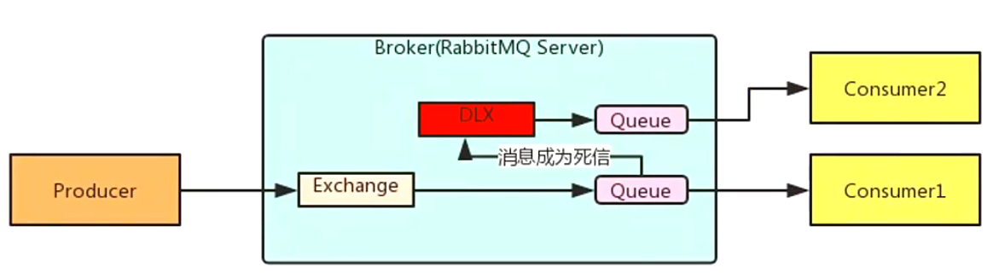
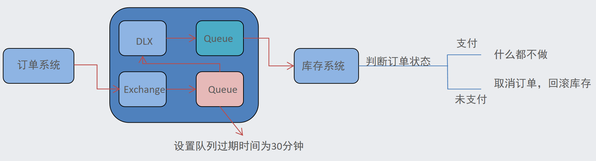

# RabbitMQ 高级特性

## 消息的可靠投递

在使用 RabbitMQ 的时候，作为消息发送方希望杜绝任何消息丢失或者投递失败场景。RabbitMQ 为我们提供了两种方式用来控制消息的投递可靠性模式

- confirm 确认模式

  

- return  退回模式


rabbitmq 整个消息投递的路径为：
producer--->rabbitmq broker--->exchange--->queue--->consumer

- 消息从 producer 到 exchange 则会返回一个 confirmCallback 。
- 消息从 exchange-->queue 投递失败则会返回一个 returnCallback

我们将利用这两个 callback 控制消息的可靠性投递

**生产者xml配置**

```xml
<!--加载配置文件-->
<context;propertyplaceholder location="classpath:rabbitmg, properties"/>
<!--定义rabbitmg connectionFactory-->
<rabbit:connection-factory id="connectionFactory" host="49.234. 151.117"
							port="5672"
							username="guest"
							password="guestvirtual-host"
							publisher-confirms="true"
							publisher-returns="true"
/>                                                              
<!--定义管理交换机、队列-->
<rabbit:admin connection-factory="connectionFactory"/>
                                                    
<!--定义rabbitTemplate对象操作可以在代码中方便发送消息-->
<rabbit:template id="rabbitTemplate" connection-factory="connectionFactory"/>
```

**生产者代码示例**

```java
public class Producer {
    public static void main(String[] args) {
        // 加载 Spring 配置文件
        ApplicationContext context = new ClassPathXmlApplicationContext("rabbitmq-context.xml");
        // 获取 RabbitTemplate 对象
        RabbitTemplate rabbitTemplate = context.getBean(RabbitTemplate.class);
        // 设置确认回调函数
        rabbitTemplate.setConfirmCallback((correlationData, ack, cause) -> {
            // 判断消息是否成功发送到 RabbitMQ 服务器
            if (ack) {
                // 如果成功，输出成功信息
                System.out.println("Message successfully sent to RabbitMQ server");
            } else {
                // 如果失败，输出失败原因
                System.out.println("Failed to send message to RabbitMQ server: " + cause);
            }
        });
        // 准备要发送的消息
        String message = "Hello World!";
        // 发送消息到名为 "hello" 的队列
        rabbitTemplate.convertAndSend("", "hello", message);
        System.out.println(" [x] Sent '" + message + "'");
    }
}
```

**消费者xml配置**

```xml
<!--定义监听器容器
acknowledge="manual":手动签收 prefetch="1":每次抓取多少条消息
-->
<!--定义监听器容器acknowledge="manual" prefetch="1" 从none自动签收改为manual-->
<rabbit:listenercontainer connection-factory="connectionFactory" acknowledge-"manual">
	<rabbit:listener ref="ackListener" queue-names="test queue_confirm"></rabbit:listener></rabbit:listenercontainer>
```

**监听器ackListener**

消息的手动签收通常是在 `ChannelAwareMessageListener` 接口中实现的。这个接口提供了一个 `acknowledge` 方法，可以手动确认或拒绝消息

ChannelAwareMessageListener继承MessageListener 

```java
public class ReturnConsumer implements ChannelAwareMessageListener {
    @Override
    public void onMessage(Message message, Channel channel) throws Exception {
        try {
            System.out.println("Received returned message: " + new String(message.getBody()));
            // 处理消息逻辑...

            // 手动确认消息
            channel.basicAck(message.getMessageProperties().getDeliveryTag(), false);
        } catch (Exception e) {
            // 发生异常时，拒绝消息并重新放入队列
            channel.basicReject(message.getMessageProperties().getDeliveryTag(), true);
        }
    }
}
```

> **channel.basicReject(deliveryTag, true);**
>
> ​    basic.reject 方法拒绝 deliveryTag 对应的消息，第二个参数是否 requeue，true 则重新入队列，否则丢弃或者进入死信队列。
>
> 该方法 reject 后，该消费者还是会消费到该条被 reject 的消息。
>
> **channel.basicNack(deliveryTag, false, true);**
>
> ​    basic.nack 方法为不确认 deliveryTag 对应的消息，第二个参数是否应用于多消息，第三个参数是否 requeue，与 basic.reject 区别就是同时支持多个消息，可以 nack 该消费者先前接收未 ack 的所有消息。nack 后的消息也会被自己消费到。

**在 RabbitMQ 中，`channel.basicAck` 方法用于手动确认消息的消费**。当消费者成功处理了消息并且不再需要该消息时，可以调用 `channel.basicAck` 来告知 RabbitMQ 可以将该消息从队列中删除

```java
channel.basicAck(deliveryTag, multiple);
```

- `deliveryTag`：表示要确认的消息的标识符，是一个整数值，每次消费消息时都会生成一个唯一的 `deliveryTag`。
- `multiple`：表示是否批量确认消息。如果设置为 `true`，则会确认所有比 `deliveryTag` 小的消息；如果设置为 `false`，则只确认一条消息。


### Consumer Ack

ack指Acknowledge，确认。 表示消费端收到消息后的确认方式。

有三种确认方式：

- 自动确认：acknowledge="none"
- 手动确认：acknowledge="manual"

- 根据异常情况确认：acknowledge="auto"

其中自动确认是指，当消息一旦被Consumer接收到，则自动确认收到，并将相应 message 从 RabbitMQ 的消息缓存中移除

但是在实际业务处理中，很可能消息接收到，业务处理出现异常，那么该消息就会丢失

**如果设置了手动确认方式，则需要在业务处理成功后，调用channel.basicAck()，手动签收，如果出现异常，则调用channel.basicNack()方法，让其自动重新发送消息**

**配置**

```xml
<!-- 在rabbit:listener-container标签中设置acknowledge属性，设置ack方式 none：自动确认，manual：手动确认-->
<rabbit:listenercontainer connection-factory="connectionFactory" acknowledge-"manual">
```

如果在消费端没有出现异常，则调用channel.basicAck(deliveryTag,false);方法确认签收消息

```java
// 手动确认消息
channel.basicAck(message.getMessageProperties().getDeliveryTag(), false);
```

如果出现异常，则在catch中调用 basicNack或 basicReject，拒绝消息，让MQ重新发送消息

```java
// 发生异常时，拒绝消息并重新放入队列
channel.basicReject(message.getMessageProperties().getDeliveryTag(), true);
```


### 消息可靠性保证

- **持久化**
  - exchange要持久化
  - queue要持久化
  - message要持久化
- **生产方确认Confirm**：生产者发送消息后，等待 RabbitMQ 返回确认信号，确保消息已经成功接收
- **消费方确认Ack**：消费者确认机制确保消息已经被成功消费。消费者接收到消息后，处理完消息后发送确认信号，告知 RabbitMQ 可以将消息从队列中删除
- **重试机制：**如果消息消费失败，可以设置消息的重试机制，将消息重新放回队列等待重新消费。可以通过设置最大重试次数和延迟重试等策略来实现
- **Broker高可用：**为了防止消息丢失，可以设置 RabbitMQ 的集群模式和镜像队列，确保消息备份和高可用性


## 消费端限流

通过 `<rabbit:listener-container>` 中的 `prefetch` 属性可以配置消费端的预取值，用于限制消费者在单次获取消息时可以接收的最大消息数量。这可以帮助实现消费者的限流。

```xml
<rabbit:listener-container connection-factory="connectionFactory" prefetch="10" acknowledge-"manual">
    <rabbit:listener ref="messageListener" method="onMessage" queue-names="queueName"/>
</rabbit:listener-container>
```

`prefetch` 属性设置了预取值为 10。这意味着每次消费者会从 RabbitMQ 服务器获取最多 10 条消息。这样可以避免消费者一次性接收大量消息导致负载过高的情况发生

> 消费端的确认模式一定为手动确认


## TTL

**xml配置演示**

```xml
<rabbit:queue id="myQueue" name="myQueue">
    <rabbit:queue-arguments>
        <!-- 在 entry 元素中，我们指定了 x-message-ttl 键和其对应的值，即消息的 TTL 时间为 60000ms（即 60 秒） -->
        <entry key="x-message-ttl" value="60000"/> <!-- TTL 设置为 60000ms（60秒）-->
    </rabbit:queue-arguments>
</rabbit:queue>

<rabbit:topic-exchange id="myTopicExchange" name="myTopicExchange">
    <rabbit:bindings>
        <!-- 匹配 ttl.# 的路由键 -->
        <rabbit:binding queue="ttlQueue" pattern="ttl.#"/>
    </rabbit:bindings>
</rabbit:topic-exchange>
```

TTL 全称 Time To Live（存活时间/过期时间）。

当消息到达存活时间后，还没有被消费，会被自动清除

RabbitMQ可以对**消息设置过期时间**，也可以对整个**队列（Queue）设置过期时间**

> 设置**队列过期时间**使用参数：x-message-ttl，单位：ms(毫秒)，会对整个队列消息统一过期。
> 设置**消息过期时间**使用参数：expiration。单位：ms(毫秒)，当该消息在队列头部时（消费时），会单独判断这一消息是否过期。
> 如果两者都进行了设置，以**时间短的为准**

### 死信队列

死信队列，英文缩写：**DLX**   Dead Letter Exchange（死信交换机）

当消息成为Dead message后，可以被重新发送到另一个交换机，这个交换机就是DLX



```xml
<!--死信队列:
1.声明正常的队列(test_queue_dlx)和交换机(test_exchange_dlx)
2.声明死信队列(queue_dlx)和死信交换机(exchange_dlx)
3.正常队列绑定死信交换机
	设置两个参数:
		*x-dead-letter-exchange:死信交换机名称
		*x-dead-letter-routing-key:发送给死信交换机的routingkey -->

<!--1.声明正常的队列(test_queue_dlx)和交换机(test_exchange_dlx) -->
<rabbit:queue name="test_queue_dlx" id="test_queue_dlx">
    
<!--2.正常队列绑定死信交换机-->
	<rabbit:queue arguments>
        
		<!--3.1 x-dead-letter-exchange:死信交换机名称-->
    	<entry key="x-dead-letter-exchange" value="exchange_dlx" />
        
		<!--3.2 x-dead-letter-routing-key:发送给死信交换机的routingkex-->
   	 	<entry key="x-dead-letter-routing-key" value="dlx.hehe"/>
        
		<!--4.1 设置队列的过期时间 tt1-->
		<entry key="x-message-ttl" value="10000" value-type="java.lang.Integer" />
        
    	<!--4.2 设置队列的长度限制 max-length-->
		<entry key="x-max-length" value="10" value-type="java.lang.Integer" />
        
    </rabbit:queue-arguments>
</rabbit:queue>

<!--声明正常交换机-->
<rabbit:topic-exchange name-"test_exchange_dlx">
	<rabbit:bindings>
        <rabbit:binding pattern"test.dlx.#" queue "test_queue_dlx"></rabbit:binding>
    </rabbit:bindings>
</rabbit:topic-exchange>

<!--声明死信队列(queue_dlx)和死信交换机(exchange_dlx) -->
<rabbit:queue name="queue_dlx" id="queue_dlx"></rabbit:queue>
<rabbit:topic-exchange name"exchange dlx">
	<rabbit:bindings>
		<rabbit:binding pattern="dlx.#"queue="queue_dlx"></rabbit:binding>
	</rabbit:bindings>
</rabbit:topic-exchange>
```

消息成为死信的三种情况：

1. **队列消息长度到达限制**
2. **消费者拒接消费消息**，basicNack/basicReject,并且不把消息重新放入原目标队列,requeue=false
3. **原队列存在消息过期设置**，消息到达超时时间未被消费

> 死信交换机和死信队列和普通的没有区别
> 当消息成为死信后，如果该队列绑定了死信交换机，则消息会被死信交换机重新路由到死信队列


### 延迟队列

即消息进入队列后不会立即被消费，只有到达指定时间后，才会被消费

在RabbitMQ中并未提供延迟队列功能，但是可以使用：**TTL+死信队列 组合实现延迟队列的效果**



**xml配置演示**

```xml
<!--延迟队列:
1.定义正常交换机(order_exchange)和队列(order_queue)
2.定义死信交换机(order_exchange_dlx)和队列(order_queue_dlx)
3.绑定，设置正常队列过期时间为30分钟 -->

<!--1.定义正常交换机(order_exchange)和队列(order_queue)-->
<rabbit:queue id="order_queue" name="order_queue">                                     
	<!--2.绑定，设置正常队列过期时间为30分钟-->
	<rabbit:queue arguments>
		<entry key="x-dead-letter-exchange" value="order_exchange_dlx" />
        <!-- 发送到死信交换机的路由key -->
    	<entry key="x-dead-letter-routing-key" value-"dlx.order.cancel"/>
   	 	<entry key="x-message-ttl"value="10000"value-type="java.lang.Integer"/>
	</rabbit:queue-arguments>
</rabbit:queue>

<!--正常交换机-->
<rabbit:topic-exchange name="order_exchange">
	<rabbit:bindings>
        <rabbit:binding pattern"order.#"queue"order queue"></rabbit:binding>
	</rabbit:bindings>
</rabbit:topicexchange>

<!--2.定义死信交换机(order_exchange_dlx)和队列(order_queue_dlx)-->
<rabbit:queue id="order_queue_dlx" name"order queue dlx"></rabbit:queue>

<rabbit:topic-exchange name="order_exchange_dlx">
    <rabbit:bindings>
        <rabbit:binding pattern="dlx.order.#" queue="order_queue_dlx"></rabbit:binding>
    </rabbit:bindings>
</rabbit:topic-exchange>
```


