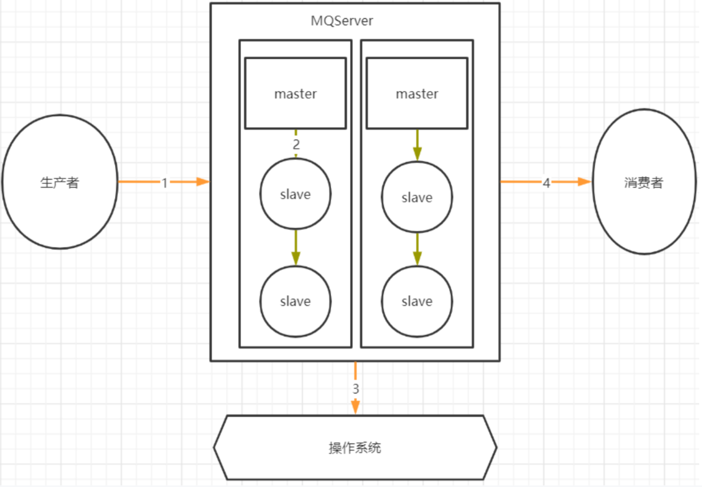
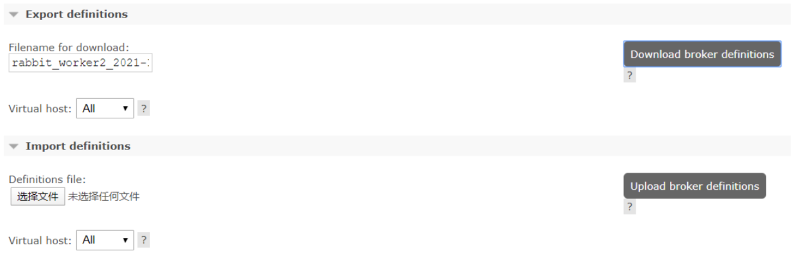
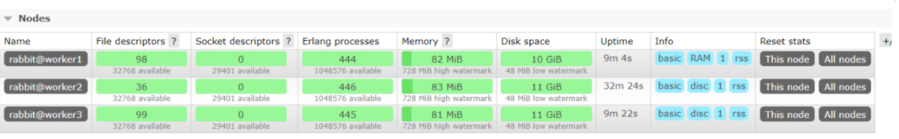

# rabbitMQ常见问题 `面试`

## 一.RabbitMQ如何保证消息不丢失？

> 千万不要回答 手动确认了

### 1.哪些环节会有丢消息的可能？



 其中，1，2，4 三个场景都是跨网络的，而跨网络就肯定会有丢消息的可能

**3这一步的丢消息无法避免：**

通常 MQ 存盘时都会先写入操作系统的缓存 page cache 中，然后再由操作系统异步的将消息写入硬盘。

这个中间有个时间差，就可能会造成消息丢失。**如果服务挂了，缓存中还没有来得及写入硬盘的消息就会丢失**。这也是任何用户态的应用程序**无法避免**的


### 2.RabbitMQ消息零丢失方案

- **生产者保证消息正确发送到RibbitMQ**

  **对于单个数据，可以使用生产者确认机制。通过多次确认的方式，保证生产者的消息能够正确的发送到 RabbitMQ 中。**

  RabbitMQ 的生产者确认机制分为同步确认和异步确认

  - 同步确认：主要是通过在生产者端使用 Channel.waitForConfirmsOrDie () 指定一个等待确认的完成时间

  - 异步确认机制则是通过 channel.addConfirmListener (ConfirmCallback var1, ConfirmCallback var2) 在生产者端注入两个回调确认函数。第一个函数是在生产者发送消息时调用，第二个函数则是生产者收到 Broker 的消息确认请求时调用。

    两个函数需要通过 sequenceNumber 自行完成消息的前后对应。sequenceNumber 的生成方式需要通过 channel 的序列获取。int sequenceNumber = channel.getNextPublishSeqNo ();

  在 RabbitMQ 中，另外还有一种**手动事务**的方式，可以保证消息正确发送。

  手动事务机制主要有几个关键的方法： channel.txSelect () 开启事务； channel.txCommit () 提交事务； channel.txRollback () 回滚事务； 用这几个方法来进行事务管理。但是这种方式需要手动控制事务逻辑，并且手动事务会对 channel 产生阻塞，**造成吞吐量极大下降**

- RabbitMQ消息存盘不丢消息

  对于 Classic 经典队列，直接将队列声明成为持久化队列即可

  而新增的 Quorum 队列和 Stream 队列，都是明显的持久化队列，能更好的保证服务端消息不会丢失

- RabbitMQ 主从消息同步时不丢消息

  这涉及到 RabbitMQ 的集群架构。

  - 普通集群模式：消息是分散存储的，不会主动进行消息同步了，是**有可能丢失消息的**
  - 镜像模式集群：数据会主动在集群各个节点当中同步，这时**丢失消息的概率不会太高**

  另外，启用 **Federation 联邦机制，给包含重要消息的队列建立一个远端备份**，也是一个不错的选择

- RabbitMQ消费者不丢失消息

  RabbitMQ 在消费消息时可以指定是自动应答，还是手动应答

  - 自动应答模式：消费者会在完成业务处理后自动进行应答，而如果消费者的业务逻辑抛出异常，RabbitMQ 会将消息进行重试，**这样是不会丢失消息的，但是有可能会造成消息一直重复消费**

  - 手动应答模式：将 RabbitMQ 的应答模式设定为手动应答可以**提高消息消费的可靠性**。

  也可以在配置文件中通过属性 spring.rabbitmq.listener.simple.**acknowledge-mode** 进行指定：可以设定为 **AUTO 自动应答； MANUAL 手动应答；NONE 不应答**

   其中这个 NONE 不应答，就是不启动应答机制，RabbitMQ 只管往消费者推送消息后，就不再重复推送消息了**，这样效率更高，但是显然会有丢消息的可能**

最后，任何用户态的应用程序都无法保证绝对的数据安全，所以，备份与恢复的方案也需要考虑到


## 二.如何保证消息幂等？

### 1.RabbitMQ 的自动重试功能：

当消费者消费消息处理业务逻辑时，如果抛出异常，或者不向 RabbitMQ 返回响应，默认情况下，RabbitMQ 会无限次数的重复进行消息消费

处理幂等问题，**首先要设定 RabbitMQ 的重试次数**。在SpringBoot集成RabbitMQ时，可以在配置文件中指定spring.rabbitmq.listener.simple.retry开头的一系列属性，来制定重试策略。然后，需要在业务上处理幂等问题。

**处理幂等问题的关键是要给每个消息一个唯一的标识。**

 在 SpringBoot 框架集成 RabbitMQ 后，可以给每个消息指定一个全局唯一的 MessageID，在消费者端针对 MessageID 做幂等性判断。

**关键代码：**

```java
//发送者指定ID字段
Message message2 = MessageBuilder.withBody(message.getBytes()).setMessageId(UUID.randomUUID().toString()).build();
rabbitTemplate.send(message2);
//消费者获取MessageID，自己做幂等性判断
@RabbitListener(queues = "fanout_email_queue")
public void process(Message message) throws Exception {
    // 获取消息Id
    String messageId = message.getMessageProperties().getMessageId();
```

 在原生 API 当中，也是支持 MessageId 的。在实际工作中，最好还是**能够添加一个具有业务意义的数据作为唯一键会更好**，这样能更好的防止重复消费问题对业务的影响。

比如，针对订单消息，那就用订单 ID 来做唯一键。在 RabbitMQ 中，消息的头部就是一个很好的携带数据的地方

```java
// ==== 发送消息时，携带sequenceNumber和orderNo
AMQP.BasicProperties.Builder builder = new AMQP.BasicProperties.Builder();
builder.deliveryMode(MessageProperties.PERSISTENT_TEXT_PLAIN.getDeliveryMode());
builder.priority(MessageProperties.PERSISTENT_TEXT_PLAIN.getPriority());
//携带消息ID
builder.messageId(""+channel.getNextPublishSeqNo());
Map<String, Object> headers = new HashMap<>();
//携带订单号
headers.put("order", "123");
builder.headers(headers);
channel.basicPublish("", QUEUE_NAME, builder.build(), message.getBytes("UTF-8"));

// ==== 接收消息时，拿到sequenceNumber
Consumer myconsumer = new DefaultConsumer(channel) {
   @Override
   public void handleDelivery(String consumerTag, Envelope envelope,BasicProperties properties, byte[] body)
     throws IOException {
     //获取消息ID
     System.out.println("messageId:"+properties.getMessageId());
    //获取订单ID
     properties.getHeaders().forEach((key,value)-> System.out.println("key: "+key +"; value: "+value));
     // 处理消息id逻辑
     //消息处理完后，进行答复。答复过的消息，服务器就不会再次转发。
     //没有答复过的消息，服务器会一直不停转发。
     channel.basicAck(deliveryTag, false);
   }
  };
channel.basicConsume(QUEUE_NAME, false, myconsumer);
```


## 三.如何保证消息的顺序？

某些场景下，需要保证消息的消费顺序，例如一个下单过程，需要先完成扣款，然后扣减库存，然后通知快递发货，这个顺序不能乱。如果每个步骤都通过消息进行异步通知的话，这一组消息就必须保证他们的消费顺序是一致的。

在 RabbitMQ 当中，针对消息顺序的设计其实是比较弱的。唯一比较好的策略就是 **单队列 + 单消息推送**：即一组有序消息，只发到一个队列中，利用队列的 FIFO 特性保证消息在队列内顺序不会乱。

**但是，这是以极度消耗性能作为代价的，在实际适应过程中，应该尽量避免这种场景**

然后在消费者进行消费时，保证只有一个消费者，同时指定 prefetch 属性为 1，即每次 RabbitMQ 都只往客户端推送一个消息。

而在多队列情况下，如何保证消息的顺序性，目前使用 RabbitMQ 的话，还没有比较好的解决方案。**在使用时，应该尽量避免这种情况**


## 四.关于RabbitMQ的数据堆积问题

**RabbitMQ 一直以来都有一个缺点，就是对于消息堆积问题的处理不好**

当 RabbitMQ 中有大量消息堆积时，整体性能会严重下降，而目前新推出的 Quorum 队列以及 Stream 队列，目的就在于解决这个核心问题。但是这两种队列的稳定性和周边生态都还不够完善，

**因此，在使用 RabbitMQ 时，还是要非常注意消息堆积的问题。尽量让消息的消费速度和生产速度保持一致**

 而如果确实出现了消息堆积比较严重的场景，就需要从数据流转的各个环节综合考虑，设计适合的解决方案。

- 首先在消息生产者端：

  对于生产者端，最明显的方式自然是**降低消息生产的速度**

  但是，生产者端产生消息的速度通常是跟业务息息相关的，一般情况下不太好直接优化。但是可以选择**尽量多采用批量消息的方式，降低 IO 频率**

- 然后在 RabbitMQ 服务端：

  对于消息堆积严重的队列，可以预先**添加懒加载机制，或者创建 Sharding 分片队列**，这些措施都有助于优化服务端的消息堆积能力。另外，**尝试使用 Stream 队列**，也能很好的提高服务端的消息堆积能力。

- 接下来在消息消费者端：

  要提升消费速度最直接的方式，就是**增加消费者数量**了。尤其当消费端的服务出现问题，已经有大量消息堆积时。这时，可以尽量多的申请机器，部署消费端应用，争取在最短的时间内消费掉积压的消息，但是这种方式需要注意对其他组件的性能压力。

  - 对于单个消费者端，可以通过配置提升消费者端的吞吐量。例如 

    ```properties
    # 单次推送消息数量
    spring.rabbitmq.listener.simple.prefetch=1
    # 消费者的消费线程数量
    spring.rabbitmq.listener.simple.concurrency=5
    ```

     灵活配置这几个参数，能够在一定程度上调整每个消费者实例的吞吐量，减少消息堆积数量。

  当确实遇到紧急状况，来不及调整消费者端时，**可以紧急上线一个消费者组，专门用来将消息快速转录。保存到数据库或者 Redis，然后再慢慢进行处理**


## 五.RabbitMQ的备份与恢复

> 文档地址： https://www.rabbitmq.com/backup.html

 RabbitMQ有一个data目录会保存分配到该节点上的所有消息。这个目录里面的备份分为两个部分，一个是元数据(定义结构的数据)，一个是消息存储目录。

 **对于元数据，可以在 Web 管理页面通过 json 文件直接导出或导入。**



 **而对于消息，可以手动进行备份恢复**

 其实对于消息，由于 MQ 的特性，是不建议进行备份恢复的。而 RabbitMQ 如果要进行数据备份恢复，也非常简单。

1. 首先，要保证要恢复的 RabbitMQ 中已经有了全部的元数据，这个可以通过上一步的 json 文件来恢复。
2. 然后，备份过程必须要先停止应用。如果是针对镜像集群，还需要把整个集群全部停止。
3. 最后，在RabbitMQ的数据目录中，有按virtual hosts组织的文件夹。你只需要按照虚拟主机，将整个文件夹复制到新的服务中即可。持久化消息和非持久化消息都会一起备份。


## 六.RabbitMQ的性能监控

 关于 RabbitMQ 的性能监控，在管理控制台中提供了非常丰富的展示。例如在下面这个简单的集群节点图中，就监控了非常多系统的关键资源。



 还包括消息的生产消费频率、关键组件使用情况等等非常多的信息，都可以从这个管理控制台上展现出来。但是，对于构建一个自动化的性能监控系统来说，这个管理页面就不太够用了。为此，RabbitMQ 也提供了一系列的 HTTP 接口，通过这些接口可以非常全面的使用并管理 RabbitMQ 的各种功能。

 这些 HTTP 的接口不需要专门去查手册，在部署的管理控制台页面下方已经集成了详细的文档，我们只需要打开 HTTP API 的页面就能看到。

