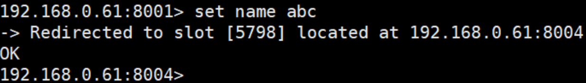
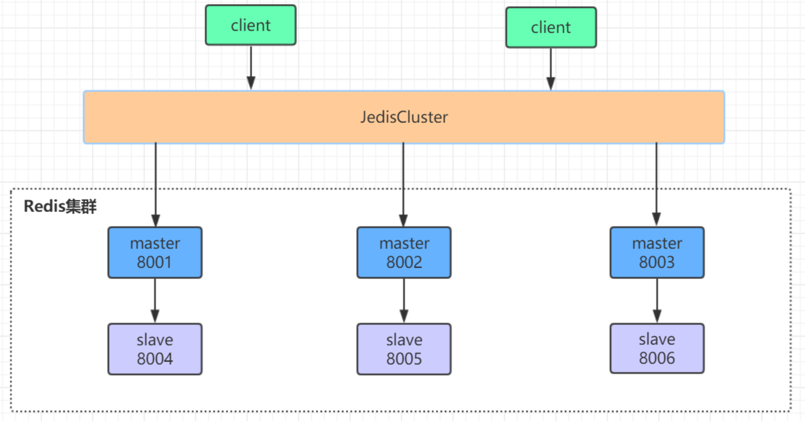
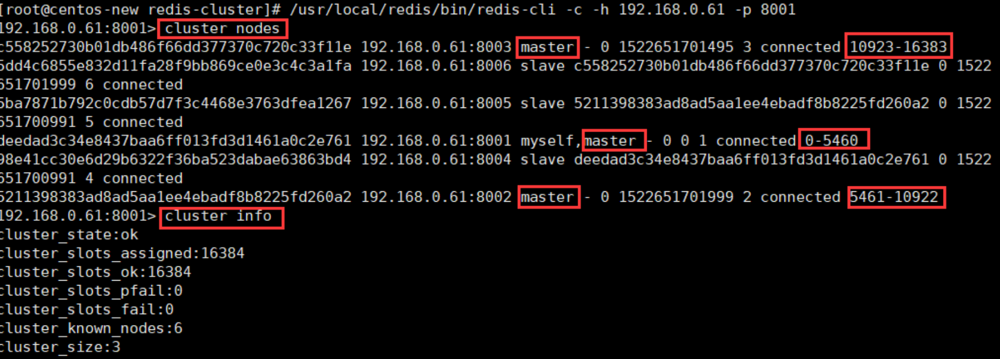
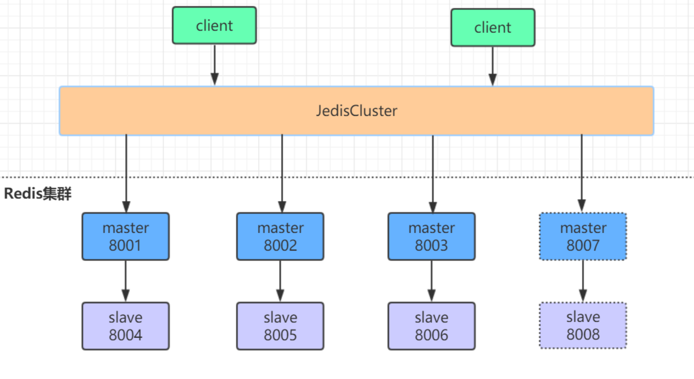
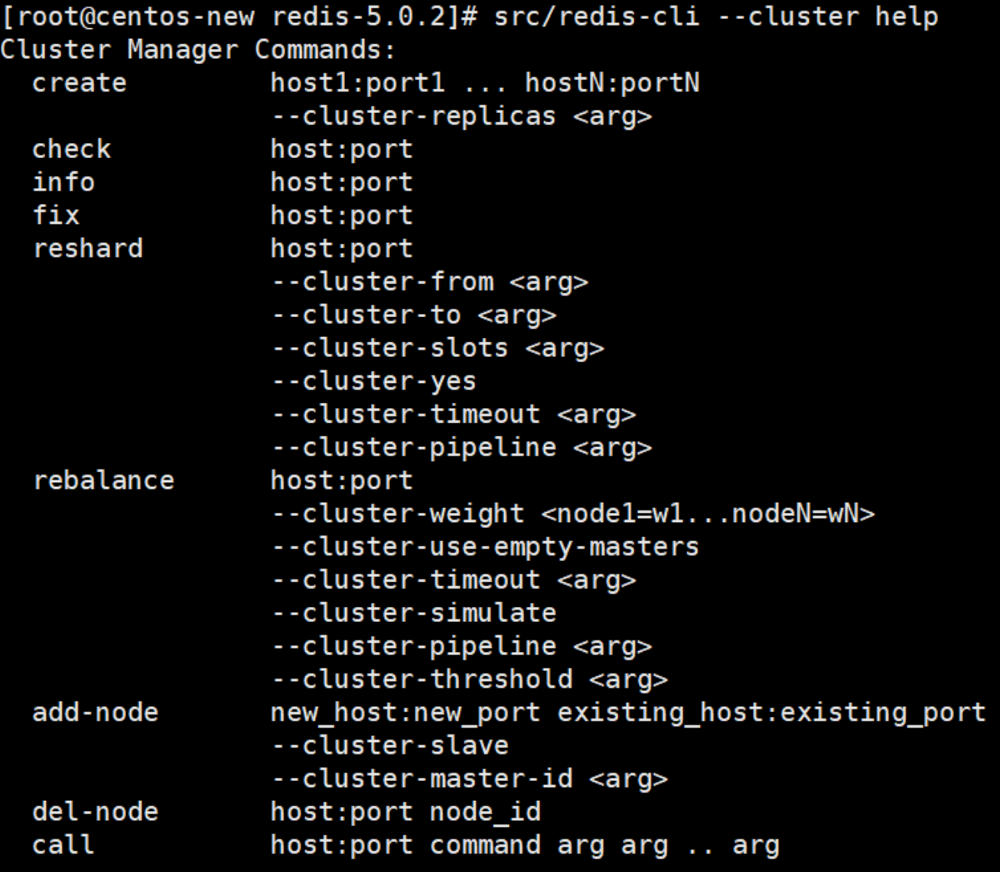
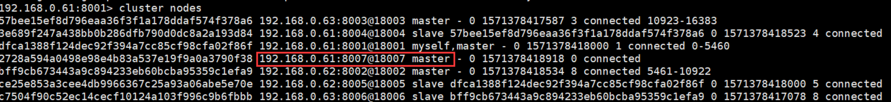
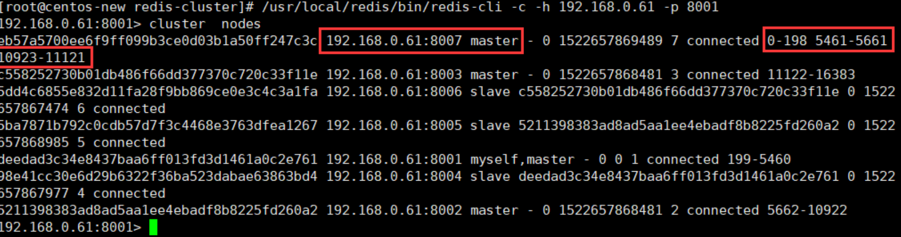
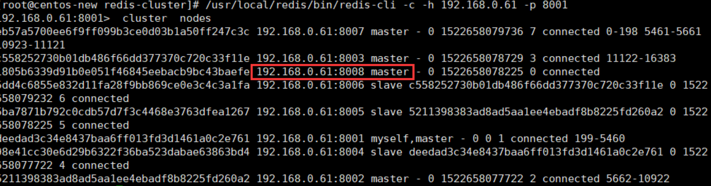
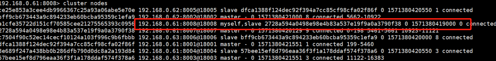

# redis cluster集群和原理

## Redis集群方案比较 

**redis 集群的性能和高可用性均优于之前版本的哨兵模式，且集群配置非常简单**

- **哨兵模式** 

  在 redis3.0 以前的版本要实现集群一般是借助哨兵 sentinel 工具来监控 master 节点的状态

  - **如果 master 节点异常，则会做主从切换**，将某一台 slave 作为 master，哨兵的配置略微复杂，并且性能和高可用性等各方面表现一般，**特别是在主从切换的瞬间存在访问瞬断的情况**

  - 而且哨兵模式**只有一个主节点对外提供服务**，没法支持很高的并发

  - 且单个主节点内存也不宜设置得过大，否则会导致**持久化文件过大，影响数据恢复或主从同步的效率**

- **高可用集群模式**

  redis 集群是一个由多个主从节点群组成的分布式服务器群，它具有复制、高可用和分片特性。

  **Redis 集群不需要 sentinel 哨兵，也能完成节点移除和故障转移的功能**。需要将每个节点设置成集群模式，这种集群模式没有中心节点，可水平扩展，据官方文档称可以线性扩展到上万个节点 (官方推荐不超过 1000 个节点)。

  

## **Redis集群搭建**

redis 集群需要至少三个 master 节点，我们这里搭建三个 master 节点，并且给每个 master 再搭建一个 slave 节点，总共 6 个 redis 节点，这里用三台机器部署 6 个 redis 实例，每台机器一主一从，搭建集群的步骤如下：

1. 在第一台机器的/usr/local下 `redis同级目录` 创建文件夹redis-cluster，然后在其下面分别创建2个文件夾如下
   `（1）mkdir -p /usr/local/redis-cluster
   （2）mkdir 8001 8004`

2. **把之前的redis.conf配置文件copy到8001下，修改如下内容**

   ```shell
   （1）daemonize yes
   （2）port 8001（分别对每个机器的端口号进行设置）
   （3）pidfile /var/run/redis_8001.pid  # 把pid进程号写入pidfile配置的文件
   （4）dir /usr/local/redis-cluster/8001/（指定数据文件存放位置，必须要指定不同的目录位置，不然会丢失数据）
   （5）cluster-enabled yes（启动集群模式）
   （6）cluster-config-file nodes-8001.conf（集群节点信息文件，这里800x最好和port对应上）
   （7）cluster-node-timeout 10000
    (8)# bind 127.0.0.1（bind绑定的是自己机器网卡的ip，如果有多块网卡可以配多个ip，代表允许客户端通过机器的哪些网卡ip去访问，内网一般可以不配置bind，注释掉即可）
    (9)protected-mode  no   （关闭保护模式）
    (10)appendonly yes
    如果要设置密码需要增加如下配置：
    (11)requirepass zhuge     (设置redis访问密码)
    (12)masterauth zhuge      (设置集群节点间访问密码，跟上面一致)
   ```

3. 把修改后的配置文件，copy到8004，修改第2、3、4、6项里的端口号，可以用批量替换

   ```
   :%s/源字符串/目的字符串/g
   ```

4. 另外两台机器也需要做上面几步操作，第二台机器用8002和8005，第三台机器用8003和8006

5. 分别启动6个redis实例，然后检查是否启动成功

   ```shell
   （1）/usr/local/redis-5.0.3/src/redis-server /usr/local/redis-cluster/800*/redis.conf
   （2）ps -ef | grep redis 查看是否启动成功
   ```

6. **用redis-cli创建整个redis集群**

   ```shell
   # 下面命令里的1代表为每个创建的主服务器节点创建一个从服务器节点
   # 执行这条命令需要确认三台机器之间的redis实例要能相互访问，可以先简单把所有机器防火墙关掉，如果不关闭防火墙则需要打开redis服务端口和集群节点gossip通信端口16379(默认是在redis端口号上加1W)
   # 关闭防火墙
   # systemctl stop firewalld # 临时关闭防火墙
   # systemctl disable firewalld # 禁止开机启动
   # 前面三个节点默认主节点，后面三个从节点，随机分配但是同一台机器的不会为同一主从（错位连接）
   （1）/usr/local/redis-5.0.3/src/redis-cli -a zhuge --cluster create --cluster-replicas 1 192.168.0.61:8001 192.168.0.62:8002 192.168.0.63:8003 192.168.0.61:8004 192.168.0.62:8005 192.168.0.63:8006 
   ```

7. 验证集群：

   ```shell
   （1）连接任意一个客户端即可：./redis-cli -c -h -p (-a访问服务端密码，-c表示集群模式，指定ip地址和端口号）
       如：/usr/local/redis-5.0.3/src/redis-cli -a zhuge -c -h 192.168.0.61 -p 800*
   （2）进行验证： cluster info（查看集群信息）、cluster nodes（查看节点列表）
   （3）进行数据操作验证
   （4）关闭集群则需要逐个进行关闭，使用命令：
   /usr/local/redis-5.0.3/src/redis-cli -a zhuge -c -h 192.168.0.60 -p 800* shutdown
   ```


### **Java 操作 redis 集群**

借助 redis 的 java 客户端 jedis 可以操作以上集群，引用 jedis 版本的 maven 坐标如下：

```xml
<dependency>
    <groupId>redis.clients</groupId>
    <artifactId>jedis</artifactId>
    <version>2.9.0</version>
</dependency>
```

Java 编写访问 redis 集群的代码非常简单，如下所示：

```java
public class JedisClusterTest {
    public static void main(String[] args) throws IOException {
 
        JedisPoolConfig config = new JedisPoolConfig();
        config.setMaxTotal(20);
        config.setMaxIdle(10);
        config.setMinIdle(5);
 
        Set<HostAndPort> jedisClusterNode = new HashSet<HostAndPort>();
        jedisClusterNode.add(new HostAndPort("192.168.0.61", 8001));
        jedisClusterNode.add(new HostAndPort("192.168.0.62", 8002));
        jedisClusterNode.add(new HostAndPort("192.168.0.63", 8003));
        jedisClusterNode.add(new HostAndPort("192.168.0.61", 8004));
        jedisClusterNode.add(new HostAndPort("192.168.0.62", 8005));
        jedisClusterNode.add(new HostAndPort("192.168.0.63", 8006));
 
        JedisCluster jedisCluster = null;
        try {
            //connectionTimeout：指的是连接一个url的连接等待时间
            //soTimeout：指的是连接上一个url，获取response的返回等待时间
            jedisCluster = new JedisCluster(jedisClusterNode, 6000, 5000, 10, "zhuge", config);
            System.out.println(jedisCluster.set("cluster", "zhuge"));
            System.out.println(jedisCluster.get("cluster"));
        } catch (Exception e) {
            e.printStackTrace();
        } finally {
            if (jedisCluster != null)
                jedisCluster.close();
        }
    }
}
```

###  Spring Boot整合集群Redis连接

1、引入相关依赖：

```xml
<dependency>
   <groupId>org.springframework.boot</groupId>
   <artifactId>spring-boot-starter-data-redis</artifactId>
</dependency>
 
<dependency>
   <groupId>org.apache.commons</groupId>
   <artifactId>commons-pool2</artifactId>
</dependency>
```

springboot 项目核心配置：

```yml
server:
  port: 8080
 
spring:
  redis:
    database: 0
    timeout: 3000
    password: zhuge
    cluster:
      nodes: 192.168.0.61:8001,192.168.0.62:8002,192.168.0.63:8003,192.168.0.61:8004,192.168.0.62:8005,192.168.0.63:8006
   lettuce:
      pool:
        max-idle: 50
        min-idle: 10
        max-active: 100
        max-wait: 1000
```

访问代码：

```java
@RestController
public class IndexController {
 
    private static final Logger logger = LoggerFactory.getLogger(IndexController.class);
 
    @Autowired
    private StringRedisTemplate stringRedisTemplate;
 
    @RequestMapping("/test_cluster")
    public void testCluster() throws InterruptedException {
       stringRedisTemplate.opsForValue().set("zhuge", "666");
       System.out.println(stringRedisTemplate.opsForValue().get("zhuge"));
    }
}
```


## **Redis 集群原理**

**Redis Cluster 将所有数据划分为 16384 个 slots (槽位)**，每个节点负责其中一部分槽位。槽位的信息存储于每个节点中。

**当 Redis Cluster 的客户端来连接集群时，它也会得到一份集群的槽位配置信息并将其缓存在客户端本地。这样当客户端要查找某个 key 时，可以直接定位到目标节点**。同时因为槽位的信息可能会存在客户端与服务器不一致的情况，还需要纠正机制来实现槽位信息的校验调整。

### **槽位定位算法**

Cluster 默认会对 **key 值使用 crc16 算法进行 hash 得到一个整数值，然后用这个整数值对 16384 进行取模来得到具体槽位**。

`HASH_SLOT = CRC16(key) mod 16384`

### **跳转重定位**

当客户端向一个错误的节点发出了指令，该节点会发现指令的 key 所在的槽位并不归自己管理，这时它会向客户端发送一个特殊的跳转指令携带目标操作的节点地址，告诉客户端去连这个节点去获取数据。

**客户端收到指令后除了跳转到正确的节点上去操作，还会同步更新纠正本地的槽位映射表缓存，后续所有 key 将使用新的槽位映射表。**



### **Redis 集群节点间的通信机制**

redis cluster 节点间采取 gossip 协议进行通信 

维护集群的元数据 (集群节点信息，主从角色，节点数量，各节点共享的数据等) 有两种方式：**集中式和 gossip** 

- **集中式：** 

  优点：在于元数据的**更新和读取，时效性非常好**，一旦元数据出现变更立即就会更新到集中式的存储中，其他节点读取的时候立即就可以立即感知到

  不足：在于所有的元数据的更新压力全部集中在一个地方，可能导致**元数据的存储压力**。 很多中间件都会借助 zookeeper 集中式存储元数据。

- **gossip**

  

  gossip 协议包含多种消息，包括 ping，pong，meet，fail 等等。 

  - meet：某个节点发送 meet 给新加入的节点，让新节点加入集群中，然后新节点就会开始与其他节点进行通信；

  - ping：每个节点都会频繁给其他节点发送 ping，其中包含自己的状态还有自己维护的集群元数据，互相通过 ping 交换元数据 (类似自己感知到的集群节点增加和移除，hash slot 信息等)； 
  - pong: 对 ping 和 meet 消息的返回，包含自己的状态和其他信息，也可以用于信息广播和更新； 
  - fail: 某个节点判断另一个节点 fail 之后，就发送 fail 给其他节点，通知其他节点，指定的节点宕机了。

  gossip 协议的优点在于元数据的更新比较分散，不是集中在一个地方

  优点：更新请求会陆陆续续，打到所有节点上去更新，**有一定的延时，降低了压力**

  缺点：元数据更新有延时可能导致集群的一些**操作会有一些滞后**。


**网络抖动**

真实世界的机房网络往往并不是风平浪静的，它们经常会发生各种各样的小问题。比如网络抖动就是非常常见的一种现象，突然之间部分连接变得不可访问，然后很快又恢复正常。

为解决这种问题，Redis Cluster 提供了一种选项 **cluster-node-timeout**

表示当某个节点持续 timeout 的时间失联时，才可以认定该节点出现故障，需要进行主从切换。如果没有这个选项，网络抖动会导致主从频繁切换 (数据的重新复制)。


### **Redis 集群选举原理分析**

当 slave 发现自己的 master 变为 FAIL 状态时，便尝试进行 Failover，以期成为新的 master。由于挂掉的 master 可能会有多个 slave，**从而存在多个 slave 竞争成为 master 节点的过程**， 其过程如下：

1. slave 发现自己的 master 变为 FAIL

2. 将自己记录的集群 currentEpoch`选举周期` 加 1，并广播 FAILOVER_AUTH_REQUEST`错误转移请求` 信息

3. 其他节点收到该信息，但只有 master 响应并判断请求者的合法性，并发送 FAILOVER_AUTH_ACK`错误转移确认`，对每一个 epoch 只发送一次 ack `一次选举周期只会发一次`

4. 尝试 failover 的 slave 收集 master 返回的 FAILOVER_AUTH_ACK

5. **slave 收到超过半数 master 的 ack 后变成新 Master** (这里解释了集群为什么至少需要三个主节点，**如果只有两个，当其中一个挂了，只剩一个主节点是不能选举成功的**)

   如果从节点票数一样，则选举周期+1，重新以上流程

6. slave 广播 Pong 消息通知其他集群节点。


从节点并不是在主节点一进入 FAIL 状态就马上尝试发起选举，而是有一定延迟来确保我们等待 FAIL 状态在集群中传播

slave 如果立即尝试选举，**其它 masters 或许尚未意识到 FAIL 状态，可能会拒绝投票**

・延迟计算公式：

` DELAY = 500ms + random(0 ~ 500ms) + SLAVE_RANK * 1000ms`

・SLAVE_RANK 表示此 slave 已经从 master 复制数据的总量的 rank。Rank 越小代表已复制的数据越新。**这种方式下，持有最新数据的 slave 将会首先发起选举（理论上）**。


### 一些集群常见疑问

- **集群脑裂数据丢失问题**

`脑裂：主从之间网络异常导致选举产生了新的主节点，之后网络恢复之前的主节点就会变成从节点导致数据丢失`

redis 集群没有过半机制会有脑裂问题，网络分区导致脑裂后多个主节点对外提供写服务，**一旦网络分区恢复，会将其中一个主节点变为从节点，这时会有大量数据丢失**。

规避方法可以在 redis 配置里加上参数 (这种方法不可能百分百避免数据丢失，参考集群 leader 选举机制)：

```
min-slaves-to-write 1  //写数据成功最少同步的slave数量，这个数量可以模仿大于半数机制配置，比如集群总共三个节点可以配置1，加上leader就是2，超过了半数，该参数在redis最新版本里名字已经换成了min-replicas-to-write
```

**注意**：这个配置在一定程度上会影响集群的可用性，比如 slave 要是少于 1 个，这个集群就算 leader 正常也不能提供服务了，需要具体场景权衡选择。


- **集群是否完整才能对外提供服务**

当 redis.conf 的配置 cluster-require-full-coverage 为 no 时，表示当负责一个插槽的主库下线且没有相应的从库进行故障恢复时，集群仍然可用，如果为 yes 则集群不可用。


- **Redis 集群为什么至少需要三个 master 节点，并且推荐节点数为奇数？**

因为新 master 的选举需要大于半数的集群 master 节点同意才能选举成功，如果只有两个 master 节点，当其中一个挂了，是达不到选举新 master 的条件的。

`四个节点挂两个和三个节点挂两个没有什么不同`

 奇数个 master 节点可以在满足选举该条件的基础上**节省一个节点**，比如三个 master 节点和四个 master 节点的集群相比，大家如果都挂了一个 master 节点都能选举新 master 节点，如果都挂了两个 master 节点都没法选举新 master 节点了，所以奇数的 master 节点更多的是**从节省机器资源角度出发**说的。


> **哨兵 leader 选举流程**
>
> 当一个 master 服务器被某 sentinel 视为下线状态后，该 sentinel 会与其他 sentinel 协商选出 sentinel 的 leader 进行故障转移工作。
>
> 每个发现 master 服务器进入下线的 sentinel 都可以要求其他 sentinel 选自己为 sentinel 的 leader，选举是先到先得。
>
> 同时每个 sentinel 每次选举都会自增配置纪元 (选举周期)，每个纪元中只会选择一个 sentinel 的 leader。如果所有超过一半的 sentinel 选举某 sentinel 作为 leader。之后该 sentinel 进行故障转移操作，从存活的 slave 中选举出新的 master，这个选举过程跟集群的 master 选举很类似。
>
> 哨兵集群只有一个哨兵节点，redis 的主从也能正常运行以及选举 master，如果 master 挂了，那唯一的那个哨兵节点就是哨兵 leader 了，可以正常选举新 master。
>
> 不过为了高可用一般都推荐至少部署三个哨兵节点。为什么推荐奇数个哨兵节点原理跟集群奇数个 master 节点类似。


## 集群水平扩展

Redis3.0 以后的版本虽然有了集群功能，提供了比之前版本的哨兵模式更高的性能与可用性，但是集群的水平扩展却比较麻烦

原始集群 (见下图) 由 6 个节点组成，6 个节点分布在三台机器上，采用三主三从的模式



### **1、启动集群**

/# 启动整个集群

```shell
/usr/local/redis-5.0.3/src/redis-server /usr/local/redis-cluster/8001/redis.conf
/usr/local/redis-5.0.3/src/redis-server /usr/local/redis-cluster/8002/redis.conf
/usr/local/redis-5.0.3/src/redis-server /usr/local/redis-cluster/8003/redis.conf
/usr/local/redis-5.0.3/src/redis-server /usr/local/redis-cluster/8004/redis.conf
/usr/local/redis-5.0.3/src/redis-server /usr/local/redis-cluster/8005/redis.conf
/usr/local/redis-5.0.3/src/redis-server /usr/local/redis-cluster/8006/redis.conf
```

/# 客户端连接 8001 端口的 redis 实例

```shell
/usr/local/redis-5.0.3/src/redis-cli -a zhuge -c -h 192.168.0.61 -p 8001
```

/# 查看集群状态

```
192.168.0.61:8001> cluster  nodes
```



 从上图可以看出，整个集群运行正常，三个 master 节点和三个 slave 节点，

8001 端口的实例节点存储 0-5460 这些 hash 槽

8002 端口的实例节点存储 5461-10922 这些 hash 槽

8003 端口的实例节点存储 10923-16383 这些 hash 槽

这三个 master 节点存储的所有 hash 槽组成 redis 集群的存储槽位，slave 点是每个主节点的备份从节点，不显示存储槽位  


### **2、集群操作**

原始集群基础上再增加一主 (8007) 一从 (8008)，增加节点后的集群参见下图，新增节点用虚线框表示



- **增加 redis 实例**

/# 在 /usr/local/redis-cluster 下创建 8007 和 8008 文件夹，并拷贝 8001 文件夹下的 redis.conf 文件到 8007 和 8008 这两个文件夹下

```shell
mkdir 8007 8008
cd 8001
cp redis.conf /usr/local/redis-cluster/8007/
cp redis.conf /usr/local/redis-cluster/8008/
 
# 修改8007文件夹下的redis.conf配置文件
vim /usr/local/redis-cluster/8007/redis.conf
# 修改如下内容：
port:8007
dir /usr/local/redis-cluster/8007/
cluster-config-file nodes-8007.conf
 
# 修改8008文件夹下的redis.conf配置文件
vim /usr/local/redis-cluster/8008/redis.conf
修改内容如下：
port:8008
dir /usr/local/redis-cluster/8008/
cluster-config-file nodes-8008.conf
 
# 启动8007和8008俩个服务并查看服务状态
/usr/local/redis-5.0.3/src/redis-server /usr/local/redis-cluster/8007/redis.conf
/usr/local/redis-5.0.3/src/redis-server /usr/local/redis-cluster/8008/redis.conf
ps -el | grep redis
```

-  **查看 redis 集群的命令帮助**

```
cd /usr/local/redis-5.0.3
src/redis-cli --cluster help
```



1. create：创建一个集群环境 host1:port1 ... hostN:portN

2. call：可以执行 redis 命令

3. add-node：将一个节点添加到集群里，第一个参数为新节点的 ip:port，第二个参数为集群中任意一个已经存在的节点的 ip:port 

4. del-node：移除一个节点

5. reshard：重新分片

6. check：检查集群状态 

**根据help的内容**

### **3.配置 8007 为集群主节点**

/# 使用 add-node 命令新增一个主节点 8007 (master)，前面的 ip:port 为新增节点，后面的 ip:port 为已知存在节点，看到日志最后有 "`[OK] New node added correctly`" 提示代表新节点加入成功

```shell
/usr/local/redis-5.0.3/src/redis-cli -a zhuge --cluster add-node 192.168.0.61:8007 192.168.0.61:8001
```

/# 查看集群状态

```shell
/usr/local/redis-5.0.3/src/redis-cli -a zhuge -c -h 192.168.0.61 -p 8001
192.168.0.61:8001> cluster nodes
```



> 注意：当添加节点成功以后，新增的节点不会有任何数据，因为它还没有分配任何的 slot (hash 槽)，我们需要为新节点手工分配 hash 槽

/# 使用 redis-cli 命令为 8007 分配 hash 槽，找到集群中的任意一个主节点，对其进行重新分片工作。

```shell
/usr/local/redis-5.0.3/src/redis-cli -a zhuge --cluster reshard 192.168.0.61:8001
```

**输出如下：**

... ...

`How many slots do you want to move (from 1 to 16384)?  ` **600**

(ps: 需要多少个槽移动到新的节点上，自己设置，比如 600 个 hash 槽)

`What is the receiving node ID?` **2728a594a0498e98e4b83a537e19f9a0a3790f38**

(ps: 把这 600 个 hash 槽移动到哪个节点上去，需要指定节点 id)

`Please enter all the source node IDs.`

` Type 'all' to use all the nodes as source nodes for the hash slots.`

` Type 'done' once you entered all the source nodes IDs.`

`Source node 1:`  **all**

(ps: 输入 all 为从所有主节点 (8001,8002,8003) 中分别抽取相应的槽数指定到新节点中，抽取的总槽数为 600 个)

 ... ...

`Do you want to proceed with the proposed reshard plan (yes/no)?`   **yes**

(ps: 输入 yes 确认开始执行分片任务)


**/# 查看下最新的集群状态**



如上图所示，现在我们的 8007 已经有 hash 槽了，也就是说可以在 8007 上进行读写数据啦！到此为止我们的 8007 已经加入到集群中，并且是主节点 (Master)

### **4.配置 8008 为 8007 的从节点**

/# 添加从节点 8008 到集群中去并查看集群状态

```
/usr/local/redis-5.0.3/src/redis-cli -a zhuge --cluster add-node 192.168.0.61:8008 192.168.0.61:8001
```



如图所示，还是一个 master 节点，没有被分配任何的 hash 槽。

我们需要执行 **replicate** 命令来指定当前节点 (从节点) 的主节点 id 为哪个：

首先需要连接新加的 8008 节点的客户端，然后使用集群命令进行操作，把当前的 8008 (slave) 节点指定到一个主节点下 (这里使用之前创建的 8007 主节点)

```shell
/usr/local/redis-5.0.3/src/redis-cli -a zhuge -c -h 192.168.0.61 -p 8008
192.168.0.61:8008> cluster replicate 2728a594a0498e98e4b83a537e19f9a0a3790f38  #后面这串id为8007的节点id
```

/# 查看集群状态，8008 节点已成功添加为 8007 节点的从节点



### 5.**删除 8008 从节点**

/# 用 del-node 删除从节点 8008，指定删除节点 ip 和端口，以及节点 id (红色为 8008 节点 id)

```shell
/usr/local/redis-5.0.3/src/redis-cli -a zhuge --cluster del-node 192.168.0.61:8008 a1cfe35722d151cf70585cee21275565393c0956
```

 再次查看集群状态，如下图所示，8008 这个 slave 节点已经移除，并且该节点的 redis 服务也已被停止


### 6.**删除 8007 主节点**

最后，我们尝试删除之前加入的主节点 8007，这个步骤相对比较麻烦一些，因为主节点的里面是有分配了 hash 槽的，所以我们这里必须先把 8007 里的 hash 槽放入到其他的可用主节点中去，然后再进行移除节点操作，不然会出现数据丢失问题 (目前只能把 master 的数据迁移到一个节点上，暂时做不了平均分配功能)，执行命令如下：

```shell
/usr/local/redis-5.0.3/src/redis-cli -a zhuge --cluster reshard 192.168.0.61:8007
```

输出如下：

 ... ...

`How many slots do you want to move (from 1 to 16384)? `**600**

`What is the receiving node ID?` **dfca1388f124dec92f394a7cc85cf98cfa02f86f**

(ps: 这里是需要把数据移动到哪？8001 的主节点 id)

`Please enter all the source node IDs.`

` Type 'all' to use all the nodes as source nodes for the hash slots.`

` Type 'done' once you entered all the source nodes IDs.`

`Source node 1:`**2728a594a0498e98e4b83a537e19f9a0a3790f38**

(ps: 这里是需要数据源，也就是我们的 8007 节点 id)

`Source node 2:`**done**

(ps: 这里直接输入 done 开始生成迁移计划)

 ... ...

`Do you want to proceed with the proposed reshard plan (yes/no)? `**Yes**

(ps: 这里输入 yes 开始迁移)


至此，我们已经成功的把 8007 主节点的数据迁移到 8001 上去了，我们可以看一下现在的集群状态如下图，你会发现 8007 下面已经没有任何 hash 槽了，证明迁移成功

/# 最后我们直接使用 del-node 命令删除 8007 主节点即可

```shell
/usr/local/redis-5.0.3/src/redis-cli -a zhuge --cluster del-node 192.168.0.61:8007 2728a594a0498e98e4b83a537e19f9a0a3790f38
```

查看集群状态，一切还原为最初始状态

