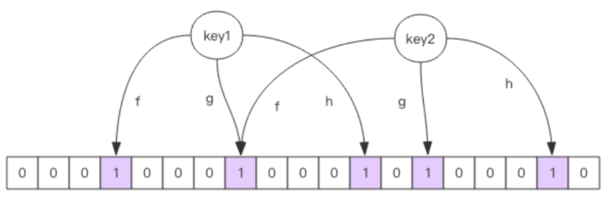
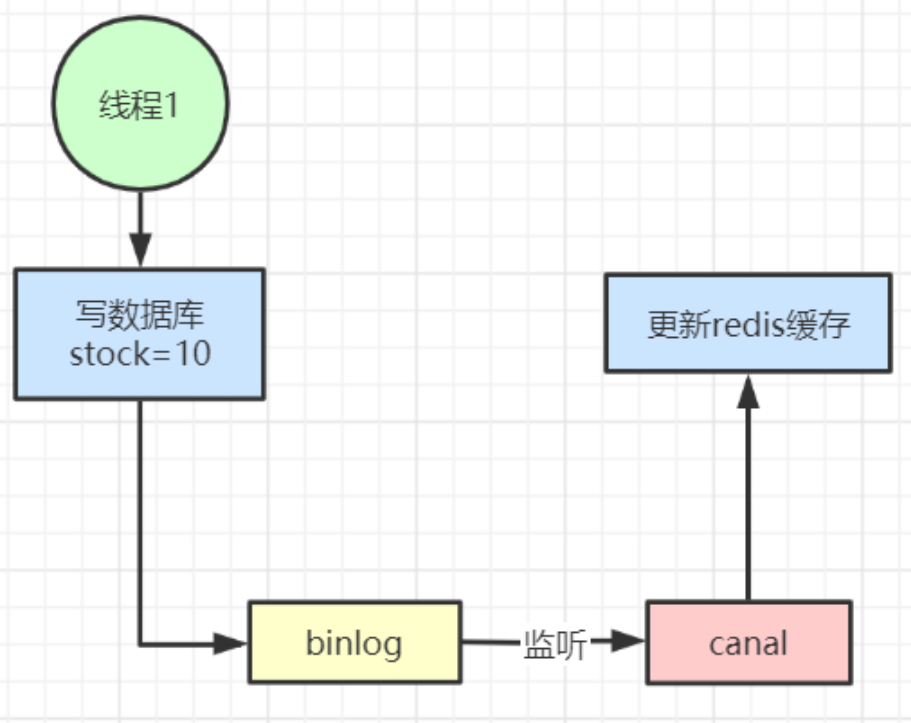

# 缓存设计与性能优化

## **缓存穿透**

缓存穿透是指**查询一个根本不存在的数据， 缓存层和存储层都不会命中**。 通常出于容错的考虑， 如果从存储层查不到数据则不写入缓存层。

**缓存穿透将导致不存在的数据每次请求都要到存储层去查询， 失去了缓存保护后端存储的意义**。

造成缓存穿透的基本原因有两个：

- 第一， 自身业务代码或者数据出现问题。

- 第二， 一些恶意攻击、 爬虫等造成大量空命中。 

缓存穿透问题解决方案：

### 1、缓存空对象

```java
String get(String key) {
    // 从缓存中获取数据
    String cacheValue = cache.get(key);
    // 缓存为空
    if (StringUtils.isBlank(cacheValue)) {
        // 从存储中获取
        String storageValue = storage.get(key);
        cache.set(key, storageValue);
        //即使查出来结果是空，也一样缓存
        // 如果存储数据为空， 需要设置一个过期时间(300秒)
        if (storageValue == null) {
            cache.expire(key, 60 * 5);
        }
        return storageValue;
    } else {
        // 缓存非空
        return cacheValue;
    }
}
```

### 2、布隆过滤器

对于恶意攻击，向服务器请求大量不存在的数据造成的缓存穿透，还可以用布隆过滤器先做一次过滤，对于不存在的数据布隆过滤器一般都能够过滤掉，不让请求再往后端发送。

当布隆过滤器说**某个值存在时，这个值可能不存在；当它说不存在时，那就肯定不存在。**



**布隆过滤器就是一个大型的位数组和几个不一样的无偏 hash 函数。**

所谓**无偏函数就是能够把元素的 hash 值算得比较均匀。**

1. 向布隆过滤器中**添加 key** 时，会使用**多个 hash 函数对 key 进行 has**h 算得**一个整数索引值**。然后对位数组长度进行取模运算得到一个位置，每个 hash 函数都会算得一个不同的位置。再把位数组的这几个位置都置为 1 就完成了 add 操作。

2. 向布隆过滤器询问 key 是否存在时，跟 add 一样，也会把 hash 的几个位置都算出来，看看位数组中这几个位置是否都为 1

   - 只要有一个位为 0，那么说明布隆过滤器中这个 key 不存在。
   - 如果都是 1，这并不能说明这个 key 就一定存在，**只是极有可能存在**，因为这些位被置为 1 可能是因为其它的 key 存在所致

   如果这个位数组长度比较大，存在概率就会很大，如果这个位数组长度比较小，存在概率就会降低。

这种方法适用于数据命中不高、 数据相对固定、 实时性低（通常是数据集较大） 的应用场景， **代码维护较为复杂， 但是缓存空间占用很少。**

可以用 **redisson** 实现布隆过滤器，引入依赖：

```XML
<dependency>
   <groupId>org.redisson</groupId>
   <artifactId>redisson</artifactId>
   <version>3.6.5</version>
</dependency>
```

示例伪代码：

`tryInit：初始化`     ` add：添加`

```java
public class RedissonBloomFilter {
 
    public static void main(String[] args) {
        Config config = new Config();
        config.useSingleServer().setAddress("redis://localhost:6379");
        //构造Redisson
        RedissonClient redisson = Redisson.create(config);
 
        RBloomFilter<String> bloomFilter = redisson.getBloomFilter("nameList");
        //初始化布隆过滤器：预计元素为100000000L,误差率为3%,根据这两个参数会计算出底层的bit数组大小
        bloomFilter.tryInit(100000000L,0.03);
        //将zhuge插入到布隆过滤器中
        bloomFilter.add("zhuge");
 
        //判断下面号码是否在布隆过滤器中
        System.out.println(bloomFilter.contains("guojia"));//false
        System.out.println(bloomFilter.contains("baiqi"));//false
        System.out.println(bloomFilter.contains("zhuge"));//true
    }
}
```

使用布隆过滤器需要把所有数据提前放入布隆过滤器，并且在增加数据时也要往布隆过滤器里放，布隆过滤器缓存过滤伪代码：

```java
//初始化布隆过滤器
RBloomFilter<String> bloomFilter = redisson.getBloomFilter("nameList");
//初始化布隆过滤器：预计元素为100000000L,误差率为3%
bloomFilter.tryInit(100000000L,0.03);
        
//把所有数据存入布隆过滤器
void init(){
    for (String key: keys) {
        bloomFilter.put(key);
    }
}
 
String get(String key) {
    // 从布隆过滤器这一级缓存判断下key是否存在
    Boolean exist = bloomFilter.contains(key);
    if(!exist){
        return "";
    }
    // 从缓存中获取数据
    String cacheValue = cache.get(key);
    // 缓存为空
    if (StringUtils.isBlank(cacheValue)) {
        // 从存储中获取
        String storageValue = storage.get(key);
        cache.set(key, storageValue);
        // 如果存储数据为空， 需要设置一个过期时间(300秒)
        if (storageValue == null) {
            cache.expire(key, 60 * 5);
        }
        return storageValue;
    } else {
        // 缓存非空
        return cacheValue;
    }
}
```

> 注意：布隆过滤器不能删除数据，如果要删除得重新初始化数据。


## **缓存失效 (击穿)**

由于**大批量缓存在同一时间失效可能导致大量请求同时穿透缓存直达数据库，可能会造成数据库瞬间压力过大甚至挂掉**，对于这种情况我们在批量增加缓存时最好将这一批数据的缓存过期时间设置为一个时间段内的不同时间。

示例伪代码

```java
String get(String key) {
    // 从缓存中获取数据
    String cacheValue = cache.get(key);
    // 缓存为空
    if (StringUtils.isBlank(cacheValue)) {
        // 从存储中获取
        String storageValue = storage.get(key);
        cache.set(key, storageValue);
        //设置一个过期时间(300到600之间的一个随机数)
        int expireTime = new Random().nextInt(300)  + 300;
        if (storageValue == null) {
            cache.expire(key, expireTime);
        }
        return storageValue;
    } else {
        // 缓存非空
        return cacheValue;
    }
}
```


## **缓存雪崩**

**缓存雪崩指的是缓存层支撑不住或宕掉后， 流量会像奔逃的野牛一样， 打向后端存储层。**

由于缓存层承载着大量请求， 有效地保护了存储层， 但是如果缓存层由于某些原因不能提供服务 (比如超大并发过来，缓存层支撑不住，或者由于缓存设计不好，类似大量请求访问 bigkey，导致缓存能支撑的并发急剧下降)， 于是大量请求都会打到存储层， 存储层的调用量会暴增， 造成存储层也会级联宕机的情况。 

预防和解决缓存雪崩问题， 可以从以下三个方面进行着手。

- **保证缓存层服务高可用性，比如使用 Redis Sentinel 或 Redis Cluster。**

- 依赖隔离组件为后端限流熔断并降级。**比如使用 Sentinel 或 Hystrix 限流降级组件**。

  比如**服务降级**，我们可以针对不同的数据采取不同的处理方式：

  当业务应用访问的是非核心数据（例如电商商品属性，用户信息等）时，暂时停止从缓存中查询这些数据，而是**直接返回预定义的默认降级信息、空值或是错误提示信息**；

  当业务应用访问的是核心数据（例如电商商品库存）时，仍然允许查询缓存，如果缓存缺失，也可以继续通过数据库读取。

- 提前演练：在项目上线前， 演练缓存层宕掉后， 应用以及后端的负载情况以及可能出现的问题， 在此基础上做一些预案设定。


## **热点缓存 key 重建优化**

开发人员使用 “缓存 + 过期时间” 的策略既可以加速数据读写， 又保证数据的定期更新， 这种模式基本能够满足绝大部分需求。 但是有两个问题如果同时出现， 可能就会对应用造成致命的危害：

- **当前 key 是一个热点 key（例如一个热门的娱乐新闻），并发量非常大**。

- 重建缓存不能在短时间完成， 可能是一个复杂计算， 例如复杂的 SQL、 多次 IO、 多个依赖等。

  在缓存失效的瞬间， 有大量线程来重建缓存， 造成后端负载加大， 甚至可能会让应用崩溃。

要解决这个问题主要就是要避免大量线程同时重建缓存。

我们可以利用互斥锁来解决，此方法只允许一个线程重建缓存， 其他线程等待重建缓存的线程执行完， 重新从缓存获取数据即可。

`使用分布式锁`


## **缓存与数据库双写不一致**

在大并发下，同时操作数据库与缓存会存在数据不一致性问题

**解决方案：**

1、对于并发几率很小的数据 (如个人维度的订单数据、用户数据等)，这种几乎不用考虑这个问题，很少会发生缓存不一致，**可以给缓存数据加上过期时间，每隔一段时间触发读的主动更新即可**。

2、就算并发很高，如果业务上能**容忍短时间的缓存数据不一致** (如商品名称，商品分类菜单等)，缓存加上过期时间依然可以解决大部分业务对于缓存的要求。

3、如果不能容忍缓存数据不一致，可以通过加**分布式读写锁**保证并发读写或写写的时候按顺序排好队，**读读的时候相当于无锁**。

4、也可以用阿里开源的 **canal 通过监听数据库的 binlog 日志及时的去修改缓存**，但是引入了新的中间件，增加了系统的复杂度。



**总结：**

以上我们针对的都是**读多写少**的情况加入缓存提高性能，如果**写多读多**的情况又不能容忍缓存数据不一致，那就没必要加缓存了，可以直接操作数据库。

当然，如果数据库抗不住压力，还可以把缓存作为数据读写的主存储，**异步将数据同步到数据库**，数据库只是作为数据的备份。

**放入缓存的数据应该是对实时性、一致性要求不是很高的数据。**

> 切记不要为了用缓存，同时又要保证绝对的一致性做大量的过度设计和控制，增加系统复杂性！


## **开发规范与性能优化**

### **1. key 名设计**

- (1)【建议】: **可读性和可管理性**

以业务名 (或数据库名) 为前缀 (防止 key 冲突)，用冒号分隔，比如业务名：表名:id

```
trade:order:1
```

- (2)【建议】：**简洁性**

保证语义的前提下，**控制 key 的长度**，当 key 较多时，内存占用也不容忽视，例如：

```
user:{uid}:friends:messages:{mid} 简化为 u:{uid}:fr:m:{mid}
```

- (3)【强制】：**不要包含特殊字符**

反例：包含空格、换行、单双引号以及其他转义字符


### **2. value 设计**

- (1)【强制】：**拒绝 bigkey！ (防止网卡流量、慢查询)**

在 Redis 中，一个字符串最大 512MB，一个二级数据结构（例如 hash、list、set、zset）可以存储大约 40 亿个 (2^32-1) 个元素，但实际中如果下面两种情况，我就会认为它是 bigkey。

- 字符串类型：它的 big 体现在单个 value 值很大，一般认为超过 10KB 就是 bigkey。

- 非字符串类型：哈希、列表、集合、有序集合，它们的 big 体现在元素个数太多。

一般来说，string 类型控制在 10KB 以内，hash、list、set、zset 元素个数不要超过 5000。

> 反例：一个包含 200 万个元素的 list。
>
> 非字符串的 bigkey，不要使用 del 直接删除，**使用 hscan、sscan、zscan 方式渐进式删除**，同时要注意防止 bigkey 过期时间自动删除问题 (例如一个 200 万的 zset 设置 1 小时过期，会触发 del 操作，造成阻塞）


### **bigkey 的危害：**

一般来说，bigkey 的产生都是由于程序设计不当，或者对于数据规模预料不清楚造成的，来看几个例子：

1.  社交类：粉丝列表，如果某些明星或者大 v 不精心设计下，必是 bigkey。

2. 统计类：例如按天存储某项功能或者网站的用户集合，除非没几个人用，否则必是 bigkey。

3. 缓存类：将数据从数据库 load 出来序列化放到 Redis 里，这个方式非常常用，但有两个地方需要注意

   - 第一，是不是有必要把所有字段都缓存

   - 第二，有没有相关关联的数据，有的人为了图方便把相关数据都存一个 key 下，产生 bigkey。

### **如何优化 bigkey**

1. **拆**

   big list： list1、list2、...listN

   big hash：可以讲数据分段存储，比如一个大的 key，假设存了 1 百万的用户数据，可以拆分成 200 个 key，每个 key 下面存放 5000 个用户数据

   如果 bigkey 不可避免，也要思考一下要不要每次把所有元素都取出来 (例如有时候仅仅需要 hmget，而不是 hgetall)，删除也是一样，尽量使用优雅的方式来处理。

2. 【推荐】：**选择适合的数据类型**。

   例如：实体类型 (要合理控制和使用数据结构，但也要注意节省内存和性能之间的平衡)

   反例：

   ```
   set user:1:name tom
   set user:1:age 19
   set user:1:favor football
   ```

   正例:

   ```
   hmset user:1 name tom age 19 favor football
   ```

3. 【推荐】：**控制 key 的生命周期，redis 不是垃圾桶**。

   建议使用 expire 设置过期时间 (条件允许可以打散过期时间，防止集中过期)。


### **命令使用**

1.【推荐】 O (N) 命令关注 N 的数量

例如 hgetall、lrange、smembers、zrange、sinter 等并非不能使用，但是需要明确 N 的值。有遍历的需求可以使用 hscan、sscan、zscan 代替。

2.【推荐】：禁用命令

禁止线上使用 keys、flushall、flushdb 等，通过 redis 的 rename 机制禁掉命令，或者使用 scan 的方式渐进式处理。

3.【推荐】合理使用 select

redis 的多数据库较弱，使用数字进行区分，很多客户端支持较差，同时多业务用多数据库实际还是单线程处理，会有干扰。

4.【推荐】使用批量操作提高效率

```
原生命令：例如mget、mset。
非原生命令：可以使用pipeline提高效率。
```

5.【建议】Redis 事务功能较弱，不建议过多使用，可以用 lua 替代


### **客户端使用**

1.【推荐】

避免多个应用使用一个 Redis 实例

正例：不相干的业务拆分，公共数据做服务化。

 

2.【推荐】使用带有连接池的数据库，可以有效控制连接，同时提高效率，标准使用方式：

```java
JedisPoolConfig jedisPoolConfig = new JedisPoolConfig();
jedisPoolConfig.setMaxTotal(5);
jedisPoolConfig.setMaxIdle(2);
jedisPoolConfig.setTestOnBorrow(true);
 
JedisPool jedisPool = new JedisPool(jedisPoolConfig, "192.168.0.60", 6379, 3000, null);
 
Jedis jedis = null;
try {
    jedis = jedisPool.getResource();
    //具体的命令
    jedis.executeCommand()
} catch (Exception e) {
    logger.error("op key {} error: " + e.getMessage(), key, e);
} finally {
    //注意这里不是关闭连接，在JedisPool模式下，Jedis会被归还给资源池。
    if (jedis != null) 
        jedis.close();
}
```

连接池参数含义：

| 序号 | 参数名             | 含义                                                         | 默认值           | 使用建议                                              |
| ---- | ------------------ | ------------------------------------------------------------ | ---------------- | ----------------------------------------------------- |
| 1    | maxTotal           | 资源池中最大连接数                                           | 8                | 设置建议见下面                                        |
| 2    | maxIdle            | 资源池允许最大空闲的连接数                                   | 8                | 设置建议见下面                                        |
| 3    | minIdle            | 资源池确保最少空闲的连接数                                   | 0                | 设置建议见下面                                        |
| 4    | blockWhenExhausted | 当资源池用尽后，调用者是否要等待。只有当为 true 时，下面的 maxWaitMillis 才会生效 | true             | 建议使用默认值                                        |
| 5    | maxWaitMillis      | 当资源池连接用尽后，调用者的最大等待时间 (单位为毫秒)        | -1：表示永不超时 | 不建议使用默认值                                      |
| 6    | testOnBorrow       | 向资源池借用连接时是否做连接有效性检测 (ping)，无效连接会被移除 | false            | 业务量很大时候建议设置为 false (多一次 ping 的开销)。 |
| 7    | testOnReturn       | 向资源池归还连接时是否做连接有效性检测 (ping)，无效连接会被移除 | false            | 业务量很大时候建议设置为 false (多一次 ping 的开销)。 |
| 8    | jmxEnabled         | 是否开启 jmx 监控，可用于监控                                | true             | 建议开启，但应用本身也要开启                          |

**优化建议：**

- **maxTotal**：最大连接数，早期的版本叫 maxActive

优化考虑的因素比较多：

- 业务希望 Redis 并发量

- 客户端执行命令时间

- Redis 资源：例如 nodes (例如应用个数) * maxTotal 是不能超过 redis 的最大连接数 maxclients。

- 资源开销：例如虽然希望控制**空闲连接** (连接池此刻可马上使用的连接)，但是不希望因为连接池的频繁释放创建连接造成不必靠开销。

  假设:

  - 一次命令时间（borrow|return resource + Jedis 执行命令 (含网络) ）的平均耗时约为 1ms，一个连接的 QPS 大约是 1000

  - 业务期望的 QPS 是 50000

那么理论上需要的资源池大小是 50000 / 1000 = 50 个。但事实上这是个理论值，还要考虑到要比理论值预留一些资源，通常来讲 maxTotal 可以比理论值大一些。

但这个值不是越大越好，一方面连接太多占用客户端和服务端资源，另一方面对于 Redis 这种高 QPS 的服务器，一个大命令的阻塞即使设置再大资源池仍然会无济于事。


- **maxIdle 和 minIdle**

  maxIdle 实际上才是业务需要的最大连接数，maxTotal 是为了**给出余量**，所以 maxIdle 不要设置过小，否则会有 new Jedis (新连接) 开销。

  **连接池的最佳性能是 maxTotal = maxIdle**，这样就避免连接池伸缩带来的性能干扰。但是如果并发量不大或者 maxTotal 设置过高，会导致不必要的连接资源浪费。一般推荐 maxIdle 可以设置为按上面的业务期望 QPS 计算出来的理论连接数，maxTotal 可以再放大一倍。

  minIdle（最小空闲连接数），与其说是最小空闲连接数，不如说是 " **至少需要保持的空闲连接数** "，在使用连接的过程中，如果连接数超过了 minIdle，那么继续建立连接，如果超过了 maxIdle，当超过的连接执行完业务后会慢慢被移出连接池释放掉。

  **如果系统启动完马上就会有很多的请求过来，那么可以给 redis 连接池做预热**。比如快速的创建一些 redis 连接，执行简单命令，类似 ping ()，快速的将连接池里的空闲连接提升到 minIdle 的数量。

  

总之，要根据实际系统的 QPS 和调用 redis 客户端的规模整体评估每个节点所使用的连接池大小。


3. 【建议】高并发下建议客户端添加熔断功能 (例如 sentinel、hystrix)

 

4. 【推荐】设置合理的密码，如有必要可以使用 SSL 加密访问


### **Redis 三种清除策略**

**Redis 对于过期键有三种清除策略：**

- 被动删除：当读 / 写一个已经过期的 key 时，会触发惰性删除策略，直接删除掉这个过期 key
- 主动删除：由于惰性删除策略无法保证冷数据被及时删掉，所以 Redis 会定期 (默认每 100ms) 主动淘汰一批**已过期**的 key，这里的一批只是部分过期 key，所以可能会出现部分 key 已经过期但还没有被清理掉的情况，导致内存并没有被释放
- 当前已用内存超过 maxmemory 限定时，触发**主动清理策略**

**主动清理策略**在 Redis 4.0 之前一共实现了 6 种内存淘汰策略，在 4.0 之后，又增加了 2 种策略，总共 8 种：

**a) 针对设置了过期时间的 key 做处理：**

- volatile-ttl：在筛选时，会针对设置了过期时间的键值对，根据过期时间的先后进行删除，越早过期的越先被删除。
- volatile-random：就像它的名称一样，在设置了过期时间的键值对中，进行随机删除。
- volatile-lru：会使用 LRU 算法筛选设置了过期时间的键值对删除。
- volatile-lfu：会使用 LFU 算法筛选设置了过期时间的键值对删除。

**b) 针对所有的 key 做处理：**

- allkeys-random：从所有键值对中随机选择并删除数据。
- allkeys-lru：使用 LRU 算法在所有数据中进行筛选删除。
- allkeys-lfu：使用 LFU 算法在所有数据中进行筛选删除。

**c) 不处理：**

- noeviction：不会剔除任何数据，拒绝所有写入操作并返回客户端错误信息 "(error) OOM command not allowed when used memory"，此时 Redis 只响应读操作。

  

- **LRU 算法**（Least Recently Used，最近最少使用）

  淘汰很久没被访问过的数据，以**最近一次访问时间**作为参考。

- **LFU 算法**（Least Frequently Used，最不经常使用）

  淘汰最近一段时间被访问次数最少的数据，以**次数**作为参考。

当存在热点数据时，LRU 的效率很好，但偶发性的、周期性的批量操作会导致 LRU 命中率急剧下降，缓存污染情况比较严重。这时使用 LFU 可能更好点。

根据自身业务类型，配置好 **maxmemory-policy** (默认是 noeviction)**，推荐使用 volatile-lru**。如果不设置最大内存，当 Redis 内存超出物理内存限制时，内存的数据会开始和磁盘产生频繁的交换 (swap)，会让 Redis 的性能急剧下降。

当 Redis 运行在主从模式时，只有主结点才会执行过期删除策略，然后把删除操作”del key” 同步到从结点删除数据。

