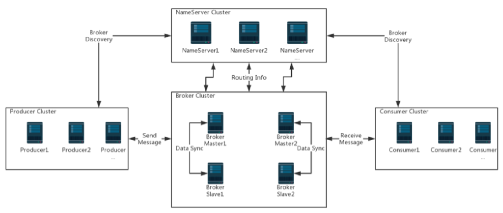

# RocketMQ入门

RocketMQ 是阿里巴巴开源的一个消息中间件，在阿里内部历经了双十一等很多高并发场景的考验，能够处理亿万级别的消息。2016 年开源后捐赠给 Apache，现在是 Apache 的一个顶级项目

目前 RocketMQ 在阿里云上有一个购买即可用的商业版本，商业版本集成了阿里内部一些更深层次的功能及运维定制。我们这里学习的是 Apache 的开源版本。开源版本相对于阿里云上的商业版本，功能上略有缺失，但是大体上功能是一样的。

RocketMQ的官网地址： [http://rocketmq.apache.org](http://rocketmq.apache.org/) ，github地址是 https://github.com/apache/rocketmq

## 快速运行RocketMQ



 RocketMQ 由以下这几个组件组成

- **NameServer :** 提供轻量级的 Broker 路由服务。
- **Broker：**实际处理消息存储、转发等服务的核心组件。
- **Producer：**消息生产者集群。通常是业务系统中的一个功能模块。
- **Consumer：**消息消费者集群。通常也是业务系统中的一个功能模块。

**所以我们要启动 RocketMQ 服务，需要先启动 NameServer**

### 启动NameServer

启动 NameServer 非常简单， 在 `$ROCKETMQ_HOME/bin` 目录下有个 `mqnamesrv`。直接执行这个脚本就可以启动 RocketMQ 的 NameServer 服务。

但是要注意，RocketMQ默认预设的JVM内存是4G，这是RocketMQ给我们的最佳配置。但是通常我们用虚拟机的话都是不够4G内存的，所以需要调整下JVM内存大小。[修改的方式是直接修改 `runserver.sh`

用`vi runserver.sh`编辑这个脚本，在脚本中找到这一行调整内存大小为512M

```shell
JAVA_OPT="${JAVA_OPT} -server -Xms512m -Xmx512m -Xmn256m -
XX:MetaspaceSize=128m -XX:MaxMetaspaceSize=320m"
```

 然后我们用静默启动的方式启动 NameServer 服务：

```shell
nohup bin/mqnamesrv & 
```

> `nohup`: 这是一个 Linux/Unix 命令，用于在后台运行程序，并且不受终端关闭的影响。它会将程序的输出重定向到一个名为 `nohup.out` 的文件中，以便稍后查看程序的输出信息
>
> `&`: 在 Linux/Unix 系统中，`&` 符号表示在后台运行命令。使用 `&` 符号可以使命令在后台运行，而不会阻塞当前终端

 启动完成后，在 nohup.out 里看到这一条关键日志就是启动成功了。并且使用 jps 指令可以看到有一个 NamesrvStartup 进程。

```
Java HotSpot(TM) 64-Bit Server VM warning: Using the DefNew young collector with the CMS
collector is deprecated and will likely be removed in a future release
Java HotSpot(TM) 64-Bit Server VM warning: UseCMSCompactAtFullCollection is deprecated and
will likely be removed in a future release.
The Name Server boot success. serializeType=JSON
```

### 启动Broker

 启动 Broker 的脚本是 runbroker.sh。Broker的默认预设内存是8G，启动前，如果内存不够，同样需要调整下JVM内存。vi runbroker.sh，找到这一行，进行内存调整

```shell
JAVA_OPT="${JAVA_OPT} -server -Xms512m -Xmx512m -Xmn256m"
```

 然后我们需要找到 $ROCKETMQ_HOME/conf/broker.conf， vi 指令进行编辑，在最下面加入一个配置：

```shell
autoCreateTopicEnable=true
```

> 表示允许 RocketMQ 在接收到生产者发送的消息时，自动创建相应的主题。这样，如果生产者发送的消息指定了一个尚未存在的主题，RocketMQ 将会自动创建该主题，并将消息存储到这个新创建的主题中。若设置为 `false`，则表示禁止自动创建主题，生产者发送消息到一个不存在的主题时，将会返回错误

然后也以静默启动的方式启动 runbroker.sh

```shell
nohup ./mqbroker &
```

 启动完成后，同样是检查 nohup.out 日志，有这一条关键日志就标识启动成功了。 并且 jps 指令可以看到一个 BrokerStartup 进程。

```
The broker[worker1, 192.168.232.128:10911] boot success. serializeType=JSON
```

> 在观察 runserver.sh 和 runbroker.sh 时，我们还可以查看到其他的 JVM 执行参数，这些参数都可以进行定制。例如观察到一个比较有意思的地方，nameServer 使用的是 CMS 垃圾回收器，而 Broker 使用的是 G1 垃圾回收器 

### 命令行快速验证

在 RocketMQ 的安装包中，提供了一个 `tools.sh` 工具可以用来在命令行快速验证 RocketMQ 服务。我们在 worker2 上进入 RocketMQ 的安装目录：

首先需要配置一个环境变量 NAMESRV_ADDR 指向我们启动的 NameServer 服务，生产者和消费者默认从这个地址获取到nameServer

```shell
export NAMESRV_ADDR='localhost:9876' 
```

然后启动消息生产者发送消息：默认会发 1000 条消息

```shell
bin/tools.sh org.apache.rocketmq.example.quickstart.Producer
```

我们可以看到发送消息的日志：

```
.....
SendResult [sendStatus=SEND_OK, msgId=C0A8E88007AC3764951D891CE9A003E7, offsetMsgId=C0A8E88000002A9F00000000000317BF, messageQueue=MessageQueue [topic=TopicTest, brokerName=worker1, queueId=1], queueOffset=249]
14:59:33.418 [NettyClientSelector_1] INFO  RocketmqRemoting - closeChannel: close the connection to remote address[127.0.0.1:9876] result: true
14:59:33.423 [NettyClientSelector_1] INFO  RocketmqRemoting - closeChannel: close the connection to remote address[192.168.232.128:10911] result: true
```

这日志中，上面部分就是我们发送的消息的内容。后面两句标识消息生产者正常关闭。

然后启动消息消费者接收消息：

```shell
bin/tools.sh  org.apache.rocketmq.example.quickstart.Consumer
```

启动后，可以看到消费到的消息。

```
......
ConsumeMessageThread_19 Receive New Messages: [MessageExt [brokerName=worker1, queueId=2, storeSize=203, queueOffset=53, sysFlag=0, bornTimestamp=1606460371999, bornHost=/192.168.232.128:43436, storeTimestamp=1606460372000, storeHost=/192.168.232.128:10911, msgId=C0A8E88000002A9F000000000000A7AE, commitLogOffset=42926, bodyCRC=1968636794, reconsumeTimes=0, preparedTransactionOffset=0, toString()=Message{topic='TopicTest', flag=0, properties={MIN_OFFSET=0, MAX_OFFSET=250, CONSUME_START_TIME=1606460450150, UNIQ_KEY=C0A8E88007AC3764951D891CE41F00D4, CLUSTER=DefaultCluster, WAIT=true, TAGS=TagA}, body=[72, 101, 108, 108, 111, 32, 82, 111, 99, 107, 101, 116, 77, 81, 32, 50, 49, 50], transactionId='null'}]] 
```

> 日志中 MessageExt 后的整个内容就是一条完整的 RocketMQ 消息。我们要对这个消息的结构有个大概的了解，后面会对这个消息进行深入的理解。
>
> 其中比较关键的属性有：brokerName，queueId，msgId，topic，cluster，tags，body，transactionId。先找到这些属性在哪里。

而这个 Consume 指令并不会结束，他会继续挂起，等待消费其他的消息。我们可以使用 CTRL+C 停止该进程。

### 关闭RocketMQ服务

要关闭 RocketMQ 服务可以通过 mqshutdown 脚本直接关闭

```Shell
# 1.关闭NameServer
sh bin/mqshutdown namesrv
# 2.关闭Broker
sh bin/mqshutdown broker
```


## RocketMQ集群架构

### RocketMQ集群中的各个角色

一个完整的 RocketMQ 集群中，有如下几个角色

- Producer：消息的发送者；举例：发信者
- Consumer：消息接收者；举例：收信者
- Broker：暂存和传输消息；举例：邮局
- NameServer：管理 Broker；举例：各个邮局的管理机构
- Topic：区分消息的种类；一个发送者可以发送消息给一个或者多个 Topic；一个消息的接收者可以订阅一个或者多个 Topic 消息

- Message Queue：相当于是 Topic 的分区；用于并行发送和接收消息