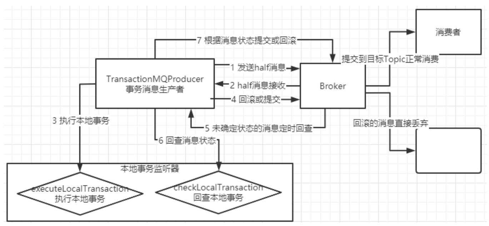

# RocketMQ编程

## RocketMQ原生API使用

### 测试环境搭建

 首先创建一个基于 Maven 的 SpringBoot 工程，引入如下依赖：

```xml
<dependency>
    <groupId>org.apache.rocketmq</groupId>
    <artifactId>rocketmq-client</artifactId>
    <version>4.7.1</version>
</dependency>
```

另外还与一些依赖，例如 openmessage、acl 等扩展功能还需要添加对应的依赖。具体可以参见 RocketMQ 源码中的 example 模块。在 RocketMQ 源码包中的 example 模块提供了非常详尽的测试代码，也可以拿来直接调试。这里就用源码包中的示例来连接我们自己搭建的 RocketMQ 集群来进行演示。

但是在调试这些代码的时候要注意一个问题：这些测试代码中的生产者和消费者都需要依赖 NameServer 才能运行，**只需要将 NameServer 指向我们自己搭建的 RocketMQ 集群，而不需要管 Broker 在哪里，就可以连接我们自己的自己的 RocketMQ 集群**

而 RocketMQ 提供的生产者和消费者寻找 NameServer 的方式有两种：

- 在代码中指定 namesrvAddr 属性。例如：consumer.setNamesrvAddr ("127.0.0.1:9876");

- 通过 NAMESRV_ADDR 环境变量来指定。多个 NameServer 之间用分号连接。

### RocketMQ的编程模型

> 当使用 RocketMQ 进行消息传递时，以下是有关主题（Topic）、标签（Tag）和键（Key）的作用：
>
> 1. **主题（Topic）**：
>    - 主题是消息的逻辑分类，用于标识一类消息的集合。生产者发送的消息会指定一个主题，消费者可以订阅特定的主题来接收消息。主题通常代表一种业务场景或一种类型的数据。例如，一个电商应用可能有一个名为 "订单" 的主题，用于处理所有订单相关的消息。
>    - 主题的设计应该具有良好的区分度，使得相关的消息能够被组织在一起，方便管理和维护。同时，主题也应该具备足够的扩展性，以应对业务的变化和增长。
> 2. **标签（Tag）**：
>    - 标签是对消息的进一步分类，用于更精细地过滤和订阅消息。在发送消息时，可以为消息指定一个或多个标签。消费者可以根据标签来订阅消息，只接收特定标签的消息。标签可以用来区分不同类型的消息或者表示消息的处理状态。例如，在电商应用中，可以使用不同的标签来表示订单状态（如待处理、已支付、已发货等）。
>    - 使用标签能够帮助实现更精准的消息过滤和路由，提高系统的灵活性和性能。
> 3. **键（Key）**：
>    - 键是消息的唯一标识符，用于保证消息的幂等性和顺序性。生产者发送消息时可以指定一个键，RocketMQ 根据键来保证消息的唯一性和顺序性。消费者在接收消息时可以根据键来检查消息的重复性，并保证消息的处理顺序。
>    - 键通常是业务中具有唯一性的标识符，比如订单号、用户ID等。在某些场景下，键也可以用于路由消息到指定的队列

- **消息发送者的固定步骤**
  1. 创建消息生产者 producer，并制定生产者组名
  2. 指定 Nameserver 地址
  3. 启动 producer
  4. 创建消息对象，指定主题 Topic、Tag 和消息体
  5. 发送消息
  6. 关闭生产者 producer
- **消息消费者的固定步骤**
  1. 创建消费者 Consumer，制定消费者组名
  2. 指定 Nameserver 地址
  3. 订阅主题 Topic 和 Tag
  4. 设置回调函数，处理消息
  5. 启动消费者 consumer

### RocketMQ的消息样例

 基本样例部分我们使用消息生产者分别通过**三种方式发送消息，同步发送、异步发送以及单向发送**

 然后使用消费者来消费这些消息。

 1、同步发送消息的样例见：org.apache.rocketmq.example.simple.Producer，它会等待消息返回后再继续进行下面的操作。`SendResult sendResult = producer.send(msg);`通过SendResult 获取sendResult的发送结果

```java
public static void main(String[] args) throws MQClientException, InterruptedException {
    // 创建一个默认的生产者实例，指定生产者组名为 "ProducerGroupName"
    DefaultMQProducer producer = new DefaultMQProducer("ProducerGroupName");
    // 启动生产者
    producer.start();
    // 循环发送消息
    for (int i = 0; i < 128; i++) {
        try {
            // 构建消息对象，指定主题为 "TopicTest"，标签为 "TagA"，订单ID为 "OrderID188"，消息内容为 "Hello world"
            Message msg = new Message("TopicTest",
                    "TagA",
                    "OrderID188",
                    "Hello world".getBytes(RemotingHelper.DEFAULT_CHARSET));
            
            // 发送消息，并等待结果
            SendResult sendResult = producer.send(msg);
            // 打印发送结果
            System.out.printf("%s%n", sendResult);
        } catch (Exception e) {
            e.printStackTrace();
        }
    }
    // 关闭生产者
    producer.shutdown();
}
```

 2、异步发送消息的样例见：org.apache.rocketmq.example.simple.AsyncProducer

> 这个示例有个特别地方就是引入了一个 countDownLatch 来保证所有消息回调方法都执行完了再关闭 Producer。 所以从这里可以看出，RocketMQ 的 Producer 也是一个服务端，在往 Broker 发送消息的时候也要作为服务端提供服务。

```java
public class AsyncProducer {
    public static void main(String[] args) throws MQClientException, InterruptedException, UnsupportedEncodingException {
        // 创建一个生产者实例，指定生产者组名
        DefaultMQProducer producer = new DefaultMQProducer("Jodie_Daily_test");
        // 启动生产者
        producer.start();
        // 设置当发送异步消息失败时不进行重试
        producer.setRetryTimesWhenSendAsyncFailed(0);
        // 准备发送的消息数量
        int messageCount = 100;
        // 创建一个倒计时计数器，用于等待所有消息发送完成
        final CountDownLatch countDownLatch = new CountDownLatch(messageCount);
        // 循环发送消息
        for (int i = 0; i < messageCount; i++) {
            try {
                final int index = i;
                // 创建消息对象，指定主题、标签、键和消息内容
                Message msg = new Message("Jodie_topic_1023",
                    "TagA",
                    "OrderID188",
                    "Hello world".getBytes(RemotingHelper.DEFAULT_CHARSET));
                // 发送消息，并指定发送结果的回调函数
                producer.send(msg, new SendCallback() {
                    @Override
                    public void onSuccess(SendResult sendResult) {
                        // 异步发送成功后，回调该方法
                        countDownLatch.countDown(); // 减少倒计时计数器
                        System.out.printf("%-10d OK %s %n", index, sendResult.getMsgId()); // 打印发送成功信息
                    }

                    @Override
                    public void onException(Throwable e) {
                        // 发送异常时，回调该方法
                        countDownLatch.countDown(); // 减少倒计时计数器
                        System.out.printf("%-10d Exception %s %n", index, e); // 打印异常信息
                        e.printStackTrace(); // 输出异常堆栈信息
                    }
                });
            } catch (Exception e) {
                e.printStackTrace();
            }
        }
        // 等待 5 秒钟，确保所有消息发送完成
        countDownLatch.await(5, TimeUnit.SECONDS);
        // 关闭生产者
        producer.shutdown();
    }
}
```

 3、单向发送消息的样例：

```java
public class OnewayProducer {
    public static void main(String[] args) throws Exception {
        // 创建一个生产者实例，指定生产者组名
        DefaultMQProducer producer = new DefaultMQProducer("please_rename_unique_group_name");
        // 指定 NameServer 地址
        producer.setNamesrvAddr("localhost:9876");
        // 启动生产者
        producer.start();
        // 循环发送消息
        for (int i = 0; i < 100; i++) {
            // 创建消息对象，指定主题、标签和消息内容
            Message msg = new Message(
                "TopicTest", // 主题
                "TagA", // 标签
                ("Hello RocketMQ " + i).getBytes(RemotingHelper.DEFAULT_CHARSET) // 消息内容
            );
            // 发送单向消息，不关心发送结果
            producer.sendOneway(msg);
        }

        // 等待 5 秒钟，确保发送完成
        Thread.sleep(5000);

        // 关闭生产者
        producer.shutdown();
    }
}
```

> 关键点就是使用 producer.sendOneWay 方式来发送消息，这个方法没有返回值，也没有回调。就是只管把消息发出去就行了。


 **4、使用消费者消费消息**

 消费者消费消息有两种模式，一种是消费者主动去 Broker 上拉取消息的拉模式，另一种是消费者等待 Broker 把消息推送过来的推模式。

 **拉模式**的样例见：org.apache.rocketmq.example.simple.PullConsumer，**使用了拉取消息的方式消费消息，循环拉取指定主题下的所有消息队列的消息。在循环拉取的过程中，根据拉取结果的状态进行相应的处理。**

```java
public class PullConsumer {
    // 存储每个消息队列的消费进度
    private static final Map<MessageQueue, Long> OFFSET_TABLE = new HashMap<>();

    public static void main(String[] args) throws MQClientException {
        // 创建一个拉取消息的消费者实例，指定消费者组名
        DefaultMQPullConsumer consumer = new DefaultMQPullConsumer("please_rename_unique_group_name_5");
        // 设置 NameServer 地址
        consumer.setNamesrvAddr("127.0.0.1:9876");
        // 启动消费者
        consumer.start();
        // 获取指定主题下的所有消息队列
        Set<MessageQueue> mqs = consumer.fetchSubscribeMessageQueues("broker-a");
        for (MessageQueue mq : mqs) {
            System.out.printf("Consume from the queue: %s%n", mq);
            // 从队列拉取消息，循环拉取
            SINGLE_MQ:
            while (true) {
                try {
                    // 拉取消息，参数为消息队列、消息标签、消息队列的消费进度、一次拉取的消息数量
                    PullResult pullResult = consumer.pullBlockIfNotFound(mq, null, getMessageQueueOffset(mq), 32);
                    System.out.printf("%s%n", pullResult);
                    // 更新消息队列的消费进度
                    putMessageQueueOffset(mq, pullResult.getNextBeginOffset());
                    // 根据拉取结果的状态进行处理
                    switch (pullResult.getPullStatus()) {
                        case FOUND: // 找到消息
                            break;
                        case NO_MATCHED_MSG: // 没有匹配的消息
                            break;
                        case NO_NEW_MSG: // 没有新的消息
                            break SINGLE_MQ; // 结束本次消息队列的拉取
                        case OFFSET_ILLEGAL: // 消息队列的消费进度非法
                            break;
                        default:
                            break;
                    }
                } catch (Exception e) {
                    e.printStackTrace();
                }
            }
        }
        // 关闭消费者
        consumer.shutdown();
    }

    // 获取消息队列的消费进度
    private static long getMessageQueueOffset(MessageQueue mq) {
        Long offset = OFFSET_TABLE.get(mq);
        if (offset != null)
            return offset;

        return 0;
    }
    
    // 更新消息队列的消费进度
    private static void putMessageQueueOffset(MessageQueue mq, long offset) {
        OFFSET_TABLE.put(mq, offset);
    }
}
```

 **推模式**的样例见：org.apache.rocketmq.example.simple.PushConsumer

```java
public class PushConsumer {
    public static void main(String[] args) throws InterruptedException, MQClientException {
        // 创建一个消息推送消费者实例，指定消费者组名
        DefaultMQPushConsumer consumer = new DefaultMQPushConsumer("CID_JODIE_1");
        // 订阅指定主题的所有消息
        consumer.subscribe("TopicTest", "*");
        // 设置消费位置为从队列的第一个消息开始消费
        consumer.setConsumeFromWhere(ConsumeFromWhere.CONSUME_FROM_FIRST_OFFSET);
        // 设置消费时间戳
        consumer.setConsumeTimestamp("20181109221800");
        // 注册消息监听器，处理消息的回调逻辑
        consumer.registerMessageListener(new MessageListenerConcurrently() {

            @Override
            public ConsumeConcurrentlyStatus consumeMessage(List<MessageExt> msgs, ConsumeConcurrentlyContext context) {
                // 消费消息的逻辑，这里简单打印消息内容
                System.out.printf("%s Receive New Messages: %s %n", Thread.currentThread().getName(), msgs);
                return ConsumeConcurrentlyStatus.CONSUME_SUCCESS; // 返回消费状态
            }
        });
        // 启动消费者
        consumer.start();
        System.out.printf("Consumer Started.%n"); // 输出启动信息
    }
}
```

> 通常情况下，用推模式比较简单。
>
> 实际上 RocketMQ 的推模式也是由拉模式封装出来的。


### 顺序消息

RocketMQ 保证的是消息的局部有序，而不是全局有序。

**顺序消息生产者样例见：org.apache.rocketmq.example.order.Producer**

```java
public class Producer {
    public static void main(String[] args) throws UnsupportedEncodingException {
        try {
            // 创建一个消息生产者实例，指定生产者组名
            MQProducer producer = new DefaultMQProducer("please_rename_unique_group_name");
            // 启动生产者实例
            producer.start();

            // 定义一组消息标签
            String[] tags = new String[] {"TagA", "TagB", "TagC", "TagD", "TagE"};
            // 发送100条消息
            for (int i = 0; i < 100; i++) {
                int orderId = i % 10; // 模拟订单ID
                // 创建消息实例，指定主题、标签、键和消息内容
                Message msg = new Message("TopicTestjjj", tags[i % tags.length], "KEY" + i,
                        ("Hello RocketMQ " + i).getBytes(RemotingHelper.DEFAULT_CHARSET));
                // 发送消息，并指定消息队列选择器和队列ID
                SendResult sendResult = producer.send(msg, new MessageQueueSelector() {
                    @Override
                    public MessageQueue select(List<MessageQueue> mqs, Message msg, Object arg) {
                        Integer id = (Integer) arg;
                        int index = id % mqs.size();
                        return mqs.get(index);
                    }
                }, orderId);

                // 输出发送结果
                System.out.printf("%s%n", sendResult);
            }

            // 关闭生产者实例
            producer.shutdown();
        } catch (MQClientException | RemotingException | MQBrokerException | InterruptedException e) {
            e.printStackTrace();
        }
    }
}
```

> `select` 方法是一个自定义的消息队列选择器，用于根据特定的规则选择消息发送到哪个消息队列。该方法接收三个参数：
>
> 1. `mqs`：消息队列列表，表示当前主题下所有可用的消息队列。
> 2. `msg`：要发送的消息对象。
> 3. `arg`：附加的参数，用于指定消息队列选择的依据。
>
> 在这个方法中，根据传入的订单ID (`orderId`) 来选择消息队列。具体选择逻辑是计算订单ID对消息队列列表大小取模的结果，然后返回对应索引位置的消息队列。这样可以保证同一订单的消息都发送到同一个消息队列中，实现了订单的顺序性处理

**顺序消息消费者样例见：org.apache.rocketmq.example.order.Consumer**

```java
public class Consumer {

    public static void main(String[] args) throws MQClientException {
        // 创建一个消费者实例
        DefaultMQPushConsumer consumer = new DefaultMQPushConsumer("please_rename_unique_group_name_3");
        // 设置消费者从消息队列的首个偏移量开始消费
        consumer.setConsumeFromWhere(ConsumeFromWhere.CONSUME_FROM_FIRST_OFFSET);
        // 订阅主题为 "TopicTest" 的消息，并指定标签为 "TagA"、"TagC" 或者 "TagD" 的消息
        consumer.subscribe("TopicTest", "TagA || TagC || TagD");
        // 注册消息监听器
        consumer.registerMessageListener(new MessageListenerOrderly() {
            // 记录消费次数
            AtomicLong consumeTimes = new AtomicLong(0);

            @Override
            public ConsumeOrderlyStatus consumeMessage(List<MessageExt> msgs, ConsumeOrderlyContext context) {
                // 设置自动提交
                context.setAutoCommit(true);
                // 输出线程名称和收到的消息
                System.out.printf("%s Receive New Messages: %s %n", Thread.currentThread().getName(), msgs);
                // 消费次数自增
                this.consumeTimes.incrementAndGet();
                // 根据不同的消费次数返回不同的消费状态
                if ((this.consumeTimes.get() % 2) == 0) {
                    return ConsumeOrderlyStatus.SUCCESS; // 消费成功
                } else if ((this.consumeTimes.get() % 3) == 0) {
                    return ConsumeOrderlyStatus.ROLLBACK; // 需要回滚
                } else if ((this.consumeTimes.get() % 4) == 0) {
                    return ConsumeOrderlyStatus.COMMIT; // 需要提交
                } else if ((this.consumeTimes.get() % 5) == 0) {
                    context.setSuspendCurrentQueueTimeMillis(3000); // 设置暂停时间
                    return ConsumeOrderlyStatus.SUSPEND_CURRENT_QUEUE_A_MOMENT; // 暂停当前队列一段时间
                }
                return ConsumeOrderlyStatus.SUCCESS; // 默认返回成功
            }
        });
        // 启动消费者
        consumer.start();
        System.out.printf("Consumer Started.%n");
    }
}
```

> 实际上，RocketMQ 也只保证了每个 OrderID 的所有消息有序 (发到了同一个 queue)，而并不能保证所有消息都有序。所以这就涉及到了 RocketMQ 消息有序的原理。要保证最终消费到的消息是有序的，需要从 Producer、Broker、Consumer 三个步骤都保证消息有序才行。
>
> - **首先在发送者端：**在默认情况下，消息发送者会采取 Round Robin 轮询方式把消息发送到不同的 MessageQueue (分区队列)，而消费者消费的时候也从多个 MessageQueue 上拉取消息，这种情况下消息是不能保证顺序的。
>
>   而只有当一组有序的消息发送到同一个 MessageQueue 上时，才能利用 MessageQueue 先进先出的特性保证这一组消息有序。
>
> - **然后在消费者端：**消费者会从多个消息队列上去拿消息。这时虽然每个消息队列上的消息是有序的，但是多个队列之间的消息仍然是乱序的。
>
>   **消费者端要保证消息有序，就需要按队列一个一个来取消息，即取完一个队列的消息后，再去取下一个队列的消息**。而给 consumer 注入的 `MessageListenerOrderly `对象，在 RocketMQ 内部就会通过**锁队列的方式**保证消息是一个一个队列来取的。`MessageListenerConcurrently` 这个消息监听器则不会锁队列，每次都是从多个 Message 中取一批数据（默认不超过 32 条）因此也无法保证消息有序。

### 广播消息

 广播消息的消息生产者样例见：org.apache.rocketmq.example.broadcast.PushConsumer

```java
public class PushConsumer {

    public static void main(String[] args) throws InterruptedException, MQClientException {
        // 创建一个推送模式的消费者实例
        DefaultMQPushConsumer consumer = new DefaultMQPushConsumer("please_rename_unique_group_name_1");
        // 设置消费者从消息队列的首个偏移量开始消费
        consumer.setConsumeFromWhere(ConsumeFromWhere.CONSUME_FROM_FIRST_OFFSET);
        // 设置消费模式为广播模式
        consumer.setMessageModel(MessageModel.BROADCASTING);
        // 订阅主题为 "TopicTest" 的消息，并指定标签为 "TagA"、"TagC" 或者 "TagD" 的消息
        consumer.subscribe("TopicTest", "TagA || TagC || TagD");
        // 注册消息监听器
        consumer.registerMessageListener(new MessageListenerConcurrently() {

            @Override
            public ConsumeConcurrentlyStatus consumeMessage(List<MessageExt> msgs,
                ConsumeConcurrentlyContext context) {
                // 输出线程名称和收到的消息
                System.out.printf("%s Receive New Messages: %s %n", Thread.currentThread().getName(), msgs);
                return ConsumeConcurrentlyStatus.CONSUME_SUCCESS; // 消费成功
            }
        });
        // 启动消费者
        consumer.start();
        System.out.printf("Broadcast Consumer Started.%n");
    }
}
```

> 广播消息并没有特定的消息消费者样例，这是因为这涉及到消费者的集群消费模式。在集群状态 (MessageModel.CLUSTERING) 下，每一条消息只会被同一个消费者组中的一个实例消费到 (这跟 kafka 和 rabbitMQ 的集群模式是一样的)。而广播模式则是把消息发给了所有订阅了对应主题的消费者，而不管消费者是不是同一个消费者组。

### 延迟消息

延迟消息的生产者案例

```java
public class ScheduledMessageProducer {
    public static void main(String[] args) throws Exception {
        // 实例化一个生产者来发送定时消息
        DefaultMQProducer producer = new DefaultMQProducer("ExampleProducerGroup");
        // 启动生产者
        producer.start();
        // 要发送的消息总数
        int totalMessagesToSend = 100;
        for (int i = 0; i < totalMessagesToSend; i++) {
            // 创建一条消息
            Message message = new Message("TestTopic", ("Hello scheduled message " + i).getBytes());
            // 设置消息的延迟级别，这条消息将在10秒后发送给消费者
            message.setDelayTimeLevel(3);
            // 发送消息
            producer.send(message);
        }
        // 使用后关闭生产者
        producer.shutdown();
    }
}
```

> 延迟消息实现的效果就是在调用 producer.send 方法后，消息并不会立即发送出去，而是会等一段时间再发送出去。这是 RocketMQ 特有的一个功能。
>
> 那会延迟多久呢？**延迟时间的设置就是在 Message 消息对象上设置一个延迟级别 message.setDelayTimeLevel (3);**
>
> 开源版本的 RocketMQ 中，对延迟消息并不支持任意时间的延迟设定 (商业版本中支持)，而是只支持 18 个固定的延迟级别，1 到 18 分别对应 messageDelayLevel=1s 5s 10s 30s 1m 2m 3m 4m 5m 6m 7m 8m 9m 10m 20m 30m 1h 2h。这从哪里看出来的？其实从 rocketmq-console 控制台就能看出来。而这 18 个延迟级别也支持自行定义，不过一般情况下最好不要自定义修改。
>
> 那这么好用的延迟消息是怎么实现的？这 18 个延迟级别除了在延迟消息中用，还有什么地方用到？

### 批量消息

**批量消息是指将多条消息合并成一个批量消息，一次发送出去。这样的好处是可以减少网络 IO，提升吞吐量。**

批量消息的消息生产者样例见：org.apache.rocketmq.example.batch.SimpleBatchProducer 

```java
public class SimpleBatchProducer {
    public static void main(String[] args) throws Exception {
        // 实例化一个生产者
        DefaultMQProducer producer = new DefaultMQProducer("BatchProducerGroupName");
        // 启动生产者
        producer.start();
        // 消息主题
        String topic = "BatchTest";
        // 构建消息列表
        List<Message> messages = new ArrayList<>();
        messages.add(new Message(topic, "Tag", "OrderID001", "Hello world 0".getBytes()));
        messages.add(new Message(topic, "Tag", "OrderID002", "Hello world 1".getBytes()));
        messages.add(new Message(topic, "Tag", "OrderID003", "Hello world 2".getBytes()));
        // 发送消息
        producer.send(messages);
        // 关闭生产者
        producer.shutdown();
    }
}
```

org.apache.rocketmq.example.batch.SplitBatchProducer

```java
public class SplitBatchProducer {
    public static void main(String[] args) throws Exception {
        // 实例化一个生产者
        DefaultMQProducer producer = new DefaultMQProducer("BatchProducerGroupName");
        // 启动生产者
        producer.start();
        // 要发送的消息主题
        String topic = "BatchTest";
        // 构建一个包含大量消息的列表
        List<Message> messages = new ArrayList<>(100 * 1000);
        for (int i = 0; i < 100 * 1000; i++) {
            messages.add(new Message(topic, "Tag", "OrderID" + i, ("Hello world " + i).getBytes()));
        }
        // 将大批量消息拆分成小批量发送
        ListSplitter splitter = new ListSplitter(messages);
        while (splitter.hasNext()) {
            List<Message> listItem = splitter.next();
            producer.send(listItem);
        }
        // 使用后关闭生产者
        producer.shutdown();
    }
}
```

> 如果批量消息大于 1MB 就不要用一个批次发送，而要拆分成多个批次消息发送。也就是说，一个批次消息的大小不要超过 1MB
>
> 实际使用时，这个 1MB 的限制可以稍微扩大点，实际最大的限制是 4194304 字节，大概 4MB。但是使用批量消息时，这个消息长度确实是必须考虑的一个问题。而且批量消息的使用是有一定限制的，这些消息应该有相同的 Topic，相同的 waitStoreMsgOK。而且不能是延迟消息、事务消息等。

### 过滤消息

在大多数情况下，可以使用 Message 的 Tag 属性来简单快速的过滤信息。

使用 Tag 过滤消息的消息生产者案例见：org.apache.rocketmq.example.filter.TagFilterProducer

```java
public class TagFilterProducer {
    public static void main(String[] args) throws Exception {
        // 实例化一个生产者
        DefaultMQProducer producer = new DefaultMQProducer("please_rename_unique_group_name");
        // 指定NameServer地址
        producer.setNamesrvAddr("localhost:9876");
        // 启动生产者
        producer.start();
        // 消息标签
        String[] tags = new String[] {"TagA", "TagB", "TagC"};
        // 循环发送消息
        for (int i = 0; i < 60; i++) {
            // 构建消息
            Message msg = new Message("TagFilterTest", tags[i % tags.length], "Hello world".getBytes(RemotingHelper.DEFAULT_CHARSET));
            // 发送消息
            SendResult sendResult = producer.send(msg);
            System.out.printf("%s%n", sendResult);
        }
        // 关闭生产者
        producer.shutdown();
    }
}
```

使用 Tag 过滤消息的消息消费者案例见：org.apache.rocketmq.example.filter.TagFilterConsumer

```java
public class TagFilterConsumer {
    public static void main(String[] args) throws InterruptedException, MQClientException {
        // 创建消费者实例
        DefaultMQPushConsumer consumer = new DefaultMQPushConsumer("please_rename_unique_group_name");
        // 订阅消息，设置过滤条件
        consumer.subscribe("TagFilterTest", "TagA || TagC");
        // 注册消息监听器
        consumer.registerMessageListener(new MessageListenerConcurrently() {

            @Override
            public ConsumeConcurrentlyStatus consumeMessage(List<MessageExt> msgs,
                ConsumeConcurrentlyContext context) {
                // 消费消息
                System.out.printf("%s Receive New Messages: %s %n", Thread.currentThread().getName(), msgs);
                return ConsumeConcurrentlyStatus.CONSUME_SUCCESS;
            }
        });
        // 启动消费者实例
        consumer.start();
        System.out.printf("Consumer Started.%n");
    }
}
```

> 主要是看消息消费者。consumer.subscribe ("TagFilterTest", "TagA || TagC"); 这句只订阅 TagA 和 TagC 的消息。
>
> TAG 是 RocketMQ 中特有的一个消息属性。RocketMQ 的最佳实践中就建议，使用 RocketMQ 时，一个应用可以就用一个 Topic，而应用中的不同业务就用 TAG 来区分。

但是，这种方式有一个很大的限制，就是一个消息只能有一个 TAG，这在一些比较复杂的场景就有点不足了。 这时候，可以使用 SQL 表达式来对消息进行过滤。

**SQL 过滤的消息生产者案例见：org.apache.rocketmq.example.filter.SqlFilterProducer**

```java
public class SqlFilterProducer {
    public static void main(String[] args) throws Exception {
        // 创建生产者实例
        DefaultMQProducer producer = new DefaultMQProducer("please_rename_unique_group_name");
        // 启动生产者实例
        producer.start();
        // 消息标签数组
        String[] tags = new String[] {"TagA", "TagB", "TagC"};
        // 发送消息
        for (int i = 0; i < 10; i++) {
            // 创建消息
            Message msg = new Message("SqlFilterTest",
                tags[i % tags.length],
                ("Hello RocketMQ " + i).getBytes(RemotingHelper.DEFAULT_CHARSET)
            );
            // 设置消息属性
            msg.putUserProperty("a", String.valueOf(i));
            // 发送消息并接收发送结果
            SendResult sendResult = producer.send(msg);
            System.out.printf("%s%n", sendResult);
        }
        // 关闭生产者实例
        producer.shutdown();
    }
}
```

**SQL 过滤的消息消费者案例见：org.apache.rocketmq.example.filter.SqlFilterConsumer**

```java
public class SqlFilterConsumer {
    public static void main(String[] args) throws Exception {
        // 创建消费者实例
        DefaultMQPushConsumer consumer = new DefaultMQPushConsumer("please_rename_unique_group_name");
        // 订阅消息主题并设置消息过滤器
        consumer.subscribe("SqlFilterTest",MessageSelector.bySql("(TAGS is not null and TAGS in ('TagA', 'TagB'))" + "and (a is not null and a between 0 and 3)"));
        // 注册消息监听器
        consumer.registerMessageListener(new MessageListenerConcurrently() {

            @Override
            public ConsumeConcurrentlyStatus consumeMessage(List<MessageExt> msgs,
                ConsumeConcurrentlyContext context) {
                // 消费消息
                System.out.printf("%s Receive New Messages: %s %n", Thread.currentThread().getName(), msgs);
                // 返回消费状态
                return ConsumeConcurrentlyStatus.CONSUME_SUCCESS;
            }
        });
        // 启动消费者实例
        consumer.start();
        System.out.printf("Consumer Started.%n");
    }
}
```

这个模式的关键是在消费者端使用 `MessageSelector.bySql (String sql)` 返回的一个` MessageSelector`。这里面的 sql 语句是按照 SQL92 标准来执行的。sql 中可以使用的参数有默认的 TAGS 和一个在生产者中加入的 a 属性。

SQL92 语法：

RocketMQ 只定义了一些基本语法来支持这个特性。你也可以很容易地扩展它。

- 数值比较，比如：**>，>=，<，<=，BETWEEN，=；**
- 字符比较，比如：**=，<>，IN；**
- **IS NULL** 或者 **IS NOT NULL；**
- 逻辑符号 **AND，OR，NOT；**

常量支持类型为：

- 数值，比如：**123，3.1415；**
- 字符，比如：**'abc'，必须用单引号包裹起来；**
- **NULL**，特殊的常量
- 布尔值，**TRUE** 或 **FALSE**

使用注意：只有推模式的消费者可以使用 SQL 过滤。拉模式是用不了的。

### 事务消息

这个事务消息是 RocketMQ 提供的一个非常有特色的功能，需要着重理解。

事务消息是在分布式系统中保证最终一致性的两阶段提交的消息实现。他可以保证本地事务执行与消息发送两个操作的原子性，也就是这两个操作一起成功或者一起失败。

事务消息只保证消息发送者的本地事务与发消息这两个操作的原子性，因此，事务消息的示例只涉及到消息发送者，对于消息消费者来说，并没有什么特别的。

事务消息生产者的案例见：org.apache.rocketmq.example.transaction.TransactionProducer

> 事务消息的关键是在 TransactionMQProducer 中指定了一个 `TransactionListener` 事务监听器，这个事务监听器就是事务消息的关键控制器。

```java
public class TransactionListenerImpl implements TransactionListener {
    
 	//在提交完事务消息后执行。
 	//返回COMMIT_MESSAGE状态的消息会立即被消费者消费到。
 	//返回ROLLBACK_MESSAGE状态的消息会被丢弃。
 	//返回UNKNOWN状态的消息会由Broker过一段时间再来回查事务的状态。
    @Override
    public LocalTransactionState executeLocalTransaction(Message msg, Object arg) {
        String tags = msg.getTags();
        //TagA的消息会立即被消费者消费到
        if(StringUtils.contains(tags,"TagA")){
            return LocalTransactionState.COMMIT_MESSAGE;
        //TagB的消息会被丢弃
        }else if(StringUtils.contains(tags,"TagB")){
            return LocalTransactionState.ROLLBACK_MESSAGE;
            
        //CDE等其他消息会等待Broker进行事务状态回查
        }else{
            return LocalTransactionState.UNKNOW;
        }
    }
    
 	//在对UNKNOWN状态的消息进行状态回查时执行。返回的结果是一样的。
    @Override
    public LocalTransactionState checkLocalTransaction(MessageExt msg) {
  		String tags = msg.getTags();
        //TagC的消息过一段时间会被消费者消费到
        if(StringUtils.contains(tags,"TagC")){
            return LocalTransactionState.COMMIT_MESSAGE;
        //TagD的消息也会在状态回查时被丢弃掉
        }else if(StringUtils.contains(tags,"TagD")){
            return LocalTransactionState.ROLLBACK_MESSAGE;
        //剩下TagE的消息会在多次状态回查后最终丢弃
        }else{
            return LocalTransactionState.UNKNOW;
        }
    }
}
```

**事务消息的使用限制：**

 1、**事务消息不支持延迟消息和批量消息**。

 2、**为了避免单个消息被检查太多次而导致半队列消息累积，我们默认将单个消息的检查次数限制为 15 次**，但是用户可以通过 Broker 配置文件的 `transactionCheckMax` 参数来修改此限制。如果已经检查某条消息超过 N 次的话（ N = `transactionCheckMax` ） 则 Broker 将丢弃此消息，并在默认情况下同时打印错误日志。用户可以通过重写 `AbstractTransactionCheckListener` 类来修改这个行为。

> 回查次数是由 BrokerConfig.transactionCheckMax 这个参数来配置的，默认 15 次，可以在 broker.conf 中覆盖。
> 然后实际的检查次数会在 message 中保存一个用户属性 MessageConst.PROPERTY_TRANSACTION_CHECK_TIMES。这个属性值大于 transactionCheckMax，就会丢弃。 这个用户属性值会按回查次数递增，也可以在 Producer 中自行覆盖这个属性。

 3、**事务消息将在 Broker 配置文件中的参数 transactionMsgTimeout 这样的特定时间长度之后被检查**。当发送事务消息时，用户还可以通过设置用户属性 CHECK_IMMUNITY_TIME_IN_SECONDS 来改变这个限制，该参数优先于 `transactionMsgTimeout` 参数。

> 由 BrokerConfig.transactionTimeOut 这个参数来配置。默认 6 秒，可以在 broker.conf 中进行修改。
> 另外，也可以给消息配置一个 MessageConst.PROPERTY_CHECK_IMMUNITY_TIME_IN_SECONDS 属性来给消息指定一个特定的消息回查时间。
> msg.putUserProperty (MessageConst.PROPERTY_CHECK_IMMUNITY_TIME_IN_SECONDS, "10000"); 这样就是 10 秒。

 4、**事务性消息可能不止一次被检查或消费**。

 5、提交给用户的目标主题消息可能会失败，目前这依日志的记录而定。它的高可用性通过 RocketMQ 本身的高可用性机制来保证，如果希望确保事务消息不丢失、并且事务完整性得到保证，建议使用同步的双重写入机制。

 6、事务消息的生产者 ID 不能与其他类型消息的生产者 ID 共享。与其他类型的消息不同，事务消息允许反向查询、MQ 服务器能通过它们的生产者 ID 查询到消费者。



 事务消息机制的关键是在发送消息时，会将消息转为一个 half 半消息，并存入 RocketMQ 内部的一个 `RMQ_SYS_TRANS_HALF_TOPIC `这个 Topic，这样对消费者是不可见的。再经过一系列事务检查通过后，再将消息转存到目标 Topic，这样对消费者就可见了。

这个事务消息跟分布式事务有什么关系？为什么扯到了分布式事务相关的两阶段提交上了？

**事务消息只保证了发送者本地事务和发送消息这两个操作的原子性，但是并不保证消费者本地事务的原子性，所以，事务消息只保证了分布式事务的一半**。

但是即使这样，**对于复杂的分布式事务，RocketMQ 提供的事务消息也是目前业内最佳的降级方案**。

### ACL权限控制`了解`

 权限控制（ACL）主要为RocketMQ提供Topic资源级别的用户访问控制。用户在使用RocketMQ权限控制时，可以在Client客户端通过 RPCHook注入AccessKey和SecretKey签名；同时，将对应的权限控制属性（包括Topic访问权限、IP白名单和AccessKey和SecretKey签名等）设置在$ROCKETMQ_HOME/conf/plain_acl.yml的配置文件中。Broker端对AccessKey所拥有的权限进行校验，校验不过，抛出异常； ACL客户端可以参考：`**org.apache.rocketmq.example.simple**` 包下面的 **AclClient** 代码。

> 注意，如果要在自己的客户端中使用 RocketMQ 的 ACL 功能，还需要引入一个单独的依赖包
>
> ```xml
> <dependency>
> 	<groupId>org.apache.rocketmq</groupId>
> 	<artifactId>rocketmq-acl</artifactId>
> 	<version>4.7.1</version>
> </dependency>
> ```

 而 Broker 端具体的配置信息可以参见源码包下 `docs/cn/acl/user_guide.md`。主要是在 broker.conf 中打开 acl 的标志：aclEnable=true。然后就可以用 plain_acl.yml 来进行权限配置了。并且这个配置文件是热加载的，也就是说要修改配置时，只要修改配置文件就可以了，不用重启 Broker 服务。我们来简单分析下源码中的 plan_acl.yml 的配置：

```yaml
#全局白名单，不受ACL控制
#通常需要将主从架构中的所有节点加进来
globalWhiteRemoteAddresses:
- 10.10.103.*
- 192.168.0.*

accounts:
#第一个账户
- accessKey: RocketMQ
  secretKey: 12345678
  whiteRemoteAddress:
  admin: false 
  defaultTopicPerm: DENY #默认Topic访问策略是拒绝
  defaultGroupPerm: SUB #默认Group访问策略是只允许订阅
  topicPerms:
  - topicA=DENY #topicA拒绝
  - topicB=PUB|SUB #topicB允许发布和订阅消息
  - topicC=SUB #topicC只允许订阅
  groupPerms:
  # the group should convert to retry topic
  - groupA=DENY
  - groupB=PUB|SUB
  - groupC=SUB
#第二个账户，只要是来自192.168.1.*的IP，就可以访问所有资源
- accessKey: rocketmq2
  secretKey: 12345678
  whiteRemoteAddress: 192.168.1.*
  # if it is admin, it could access all resources
  admin: true
```


## SpringBoot整合RocketMQ

> 在使用 SpringBoot 的 starter 集成包时，要特别注意版本。因为 SpringBoot 集成 RocketMQ 的 starter 依赖是由 Spring 社区提供的，目前正在快速迭代的过程当中，不同版本之间的差距非常大，甚至基础的底层对象都会经常有改动。
>
> 例如如果使用 rocketmq-spring-boot-starter:2.0.4 版本开发的代码，升级到目前最新的 rocketmq-spring-boot-starter:2.1.1 后，基本就用不了了

```xml
<dependencies>
        <dependency>
            <groupId>org.apache.rocketmq</groupId>
            <artifactId>rocketmq-spring-boot-starter</artifactId>
            <version>2.1.1</version>
            <exclusions>
                <exclusion>
                    <groupId>org.springframework.boot</groupId>
                    <artifactId>spring-boot-starter</artifactId>
                </exclusion>
                <exclusion>
                    <groupId>org.springframework</groupId>
                    <artifactId>spring-core</artifactId>
                </exclusion>
                <exclusion>
                    <groupId>org.springframework</groupId>
                    <artifactId>spring-webmvc</artifactId>
                </exclusion>
            </exclusions>
        </dependency>
        <dependency>
            <groupId>org.springframework.boot</groupId>
            <artifactId>spring-boot-starter-web</artifactId>
            <version>2.1.6.RELEASE</version>
        </dependency>
        <dependency>
            <groupId>io.springfox</groupId>
            <artifactId>springfox-swagger-ui</artifactId>
            <version>2.9.2</version>
        </dependency>
        <dependency>
            <groupId>io.springfox</groupId>
            <artifactId>springfox-swagger2</artifactId>
            <version>2.9.2</version>
        </dependency>
    </dependencies>
```

以 SpringBoot 的方式，快速创建一个简单的 Demo

**启动类：**

```java
@SpringBootApplication
public class RocketMQScApplication {

    public static void main(String[] args) {
        SpringApplication.run(RocketMQScApplication.class,args);
    }
}
```

配置文件 application.properties

```properties
#NameServer地址
rocketmq.name-server=192.168.232.128:9876
#默认的消息生产者组
rocketmq.producer.group=springBootGroup
```

消息生产者

```java
@Component
public class SpringProducer {

    @Resource
    private RocketMQTemplate rocketMQTemplate;
    
 	//发送普通消息的示例
    public void sendMessage(String topic,String msg){
        this.rocketMQTemplate.convertAndSend(topic,msg);
    }
    
	 //发送事务消息的示例
    public void sendMessageInTransaction(String topic,String msg) throws InterruptedException {
        String[] tags = new String[] {"TagA", "TagB", "TagC", "TagD", "TagE"};
        for (int i = 0; i < 10; i++) {
            Message<String> message = MessageBuilder.withPayload(msg).build();
            String destination =topic+":"+tags[i % tags.length];
            SendResult sendResult = rocketMQTemplate.sendMessageInTransaction(destination, message,destination);
            System.out.printf("%s%n", sendResult);
            Thread.sleep(10);
        }
    }
}
```

消息消费者

```java
@Component
@RocketMQMessageListener(consumerGroup = "MyConsumerGroup", topic = "TestTopic")
public class SpringConsumer implements RocketMQListener<String> {
    @Override
    public void onMessage(String message) {
        System.out.println("Received message : "+ message);
    }
}
```

> SpringBoot 集成 RocketMQ，消费者部分的核心就在这个 @RocketMQMessageListener 注解上。所有消费者的核心功能也都会集成到这个注解中。所以我们还要注意下这个注解里面的属性：
>
> 例如：消息过滤可以由里面的 selectorType 属性和 selectorExpression 来定制
>
> 消息有序消费还是并发消费则由 consumeMode 属性定制。
>
> 消费者是集群部署还是广播部署由 messageModel 属性定制。

**关于事务消息，还需要配置一个事务消息监听器：**

```java
@RocketMQTransactionListener(rocketMQTemplateBeanName = "rocketMQTemplate")
public class MyTransactionImpl implements RocketMQLocalTransactionListener {

    private ConcurrentHashMap<Object, String> localTrans = new ConcurrentHashMap<>();
    @Override
    public RocketMQLocalTransactionState executeLocalTransaction(Message msg, Object arg) {
        Object id = msg.getHeaders().get("id");
        String destination = arg.toString();
        localTrans.put(id,destination);
        org.apache.rocketmq.common.message.Message message = RocketMQUtil.convertToRocketMessage(new StringMessageConverter(),"UTF-8",destination, msg);
        String tags = message.getTags();
        if(StringUtils.contains(tags,"TagA")){
            return RocketMQLocalTransactionState.COMMIT;
        }else if(StringUtils.contains(tags,"TagB")){
            return RocketMQLocalTransactionState.ROLLBACK;
        }else{
            return RocketMQLocalTransactionState.UNKNOWN;
        }
    }

    @Override
    public RocketMQLocalTransactionState checkLocalTransaction(Message msg) {
        //SpringBoot的消息对象中，并没有transactionId这个属性。跟原生API不一样。
		//String destination = localTrans.get(msg.getTransactionId());
        return RocketMQLocalTransactionState.COMMIT;
    }
}
```

对于其他的消息类型，具体可以参见源码中的 junit 测试案例。

总结：

- SpringBoot 引入` org.apache.rocketmq:rocketmq-spring-boot-starter` 依赖后，就可以通过内置的 `RocketMQTemplate` 来与 RocketMQ 交互。相关属性都以 rockemq. 开头。具体所有的配置信息可以参见 `org.apache.rocketmq.spring.autoconfigure.RocketMQProperties` 这个类。
- **SpringBoot 依赖中的 Message 对象和 RocketMQ-client 中的 Message 对象是两个不同的对象**，这在使用的时候要非常容易弄错。例如 RocketMQ-client 中的 Message 里的 TAG 属性，在 SpringBoot 依赖中的 Message 中就没有。**Tag 属性被移到了发送目标中，与 Topic 一起，以 Topic:Tag 的方式指定**。
- 一定要注意版本。rocketmq-spring-boot-starter 的更新进度一般都会略慢于 RocketMQ 的版本更新，并且版本不同会引发很多奇怪的问题。apache 有一个官方的 rocketmq-spring 示例，地址：https://github.com/apache/rocketmq-spring.git 以后如果版本更新了，参考下这个示例代码。


## SpringCloudStream整合RocketMQ

SpringCloudStream 是 Spring 社区提供的一个统一的消息驱动框架，**目的是想要以一个统一的编程模型来对接所有的 MQ 消息中间件产品**

 创建 Maven 工程，引入依赖：

```xml
<dependencies>
  <dependency>
   <groupId>org.apache.rocketmq</groupId>
   <artifactId>rocketmq-client</artifactId>
   <version>4.7.1</version>
  </dependency>
  <dependency>
   <groupId>org.apache.rocketmq</groupId>
   <artifactId>rocketmq-acl</artifactId>
   <version>4.7.1</version>
  </dependency>
  <dependency>
   <groupId>com.alibaba.cloud</groupId>
   <artifactId>spring-cloud-starter-stream-rocketmq</artifactId>
   <version>2.2.3.RELEASE</version>
   <exclusions>
    <exclusion>
     <groupId>org.apache.rocketmq</groupId>
     <artifactId>rocketmq-client</artifactId>
    </exclusion>
    <exclusion>
     <groupId>org.apache.rocketmq</groupId>
     <artifactId>rocketmq-acl</artifactId>
    </exclusion>
   </exclusions>
  </dependency>
  <dependency>
   <groupId>org.springframework.boot</groupId>
   <artifactId>spring-boot-starter-web</artifactId>
   <version>2.3.3.RELEASE</version>
  </dependency>
 </dependencies>
```

应用启动类：

```java
@EnableBinding({Source.class, Sink.class})
@SpringBootApplication
public class ScRocketMQApplication {
    public static void main(String[] args) {
        SpringApplication.run(ScRocketMQApplication.class,args);
    }
}
```

> 注意这个 @EnableBinding ({Source.class, Sink.class}) 注解，这是 SpringCloudStream 引入的 Binder 配置。

然后增加配置文件 application.properties

```properties
#ScStream通用的配置以spring.cloud.stream开头
spring.cloud.stream.bindings.input.destination=TestTopic
spring.cloud.stream.bindings.input.group=scGroup
spring.cloud.stream.bindings.output.destination=TestTopic
#rocketMQ的个性化配置以spring.cloud.stream.rocketmq开头
#spring.cloud.stream.rocketmq.binder.name-server=192.168.232.128:9876;192.168.232.129:9876;192.168.232.130:9876
spring.cloud.stream.rocketmq.binder.name-server=192.168.232.128:9876
```

> SpringCloudStream 中，一个 binding 对应一个消息通道。这其中配置的 input，是在 Sink.class 中定义的，对应一个消息消费者。而 output，是在 Source.class 中定义的，对应一个消息生产者。

然后就可以增加消息消费者：

```java
@Component
public class ScConsumer {
    @StreamListener(Sink.INPUT)
    public void onMessage(String messsage){
        System.out.println("received message:"+messsage+" from binding:"+ Sink.INPUT);
    }
}
```

消息生产者：

```java
@Component
public class ScProducer {

    @Resource
    private Source source;

    public void sendMessage(String msg){
        Map<String, Object> headers = new HashMap<>();
        headers.put(MessageConst.PROPERTY_TAGS, "testTag");
        MessageHeaders messageHeaders = new MessageHeaders(headers);
        Message<String> message = MessageBuilder.createMessage(msg, messageHeaders);
        this.source.output().send(message);
    }
}
```

最后增加一个 Controller 类用于测试：

```java
@RestController
@RequestMapping("/MQTest")
public class MQTestController {

    @Resource
    private ScProducer producer;
    
    @RequestMapping("/sendMessage")
    public String sendMessage(String message){
        producer.sendMessage(message);
        return "消息发送完成";
    }
}
```

启动应用后，就可以访问 http://localhost:8080/MQTest/sendMessage?message=123，给 RocketMQ 发送一条消息到 TestTopic，并在 ScConsumer 中消费到了。


**总结**

- **关于 SpringCloudStream，这是一套几乎通用的消息中间件编程框架**，例如从对接 RocketMQ 换到对接 Kafka，业务代码几乎不需要动，只需要更换 pom 依赖并且修改配置文件就行了。

  但是，由于各个 MQ 产品都有自己的业务模型，差距非常大，所以使用使用 SpringCloudStream 时要注意业务模型转换。并且在实际使用中，要非常注意各个 MQ 的个性化配置属性。例如 RocketMQ 的个性化属性都是以 `spring.cloud.stream.rocketmq` 开头，只有通过这些属性才能用上 RocketMQ 的延迟消息、排序消息、事务消息等个性化功能。

- **SpringCloudStream 是 Spring 社区提供的一套统一框架，但是官方目前只封装了 kafka、kafka Stream、RabbitMQ 的具体依赖。**而 RocketMQ 的依赖是交由厂商自己维护的，也就是由阿里巴巴自己来维护。这个维护力度显然是有不小差距的。所以一方面可以看到之前在使用 SpringBoot 时着重强调的版本问题，在使用 SpringCloudStream 中被放大了很多。spring-cloud-starter-stream-rocketmq 目前最新的 2.2.3.RELEASE 版本中包含的 rocketmq-client 版本还是 4.4.0。这个差距就非常大了。另一方面，RocketMQ 这帮大神不屑于写文档的问题也特别严重，SpringCloudStream 中关于 RocketMQ 的个性化配置几乎很难找到完整的文档。

- 总之，**对于 RocketMQ 来说，SpringCloudStream 目前来说还并不是一个非常好的集成方案**。这方面跟 kafka 和 Rabbit 还没法比。

