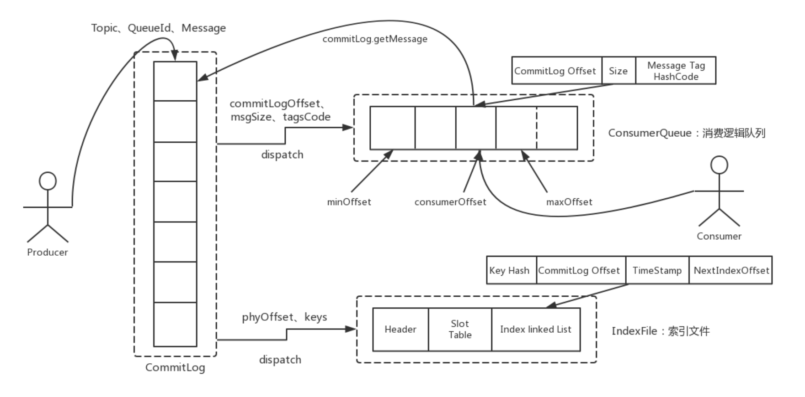
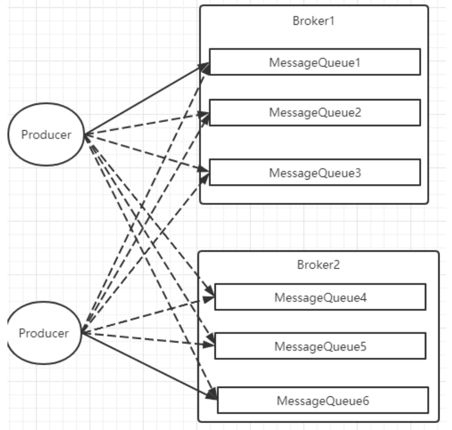
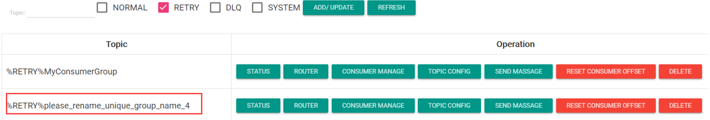
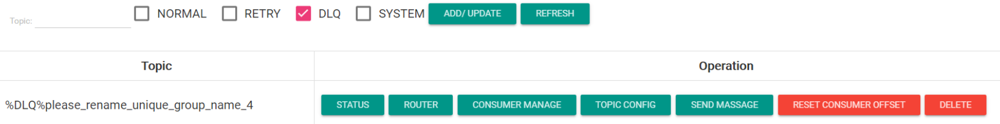

# Rocket高级特性

## 基础概念复习

### 1.消息模型（Message Model）

**RocketMQ 主要由 Producer、Broker、Consumer 三部分**组成，其中 **Producer 负责生产消息，Consumer 负责消费消息，Broker 负责存储消息**

Broker 在实际部署过程中**对应一台服务器**，每个 Broker 可以存储多个 Topic 的消息，每个 Topic 的消息也可以分片存储于不同的 Broker。Message Queue 用于存储消息的物理地址，每个 Topic 中的消息地址存储于多个 Message Queue 中。

ConsumerGroup 由多个 Consumer 实例构成。


### 2.消息生产者（Producer）

负责生产消息，一般由业务系统负责生产消息。**一个消息生产者会把业务应用系统里产生的消息发送到 broker 服务器**

RocketMQ 提供多种发送方式，同步发送、异步发送、顺序发送、单向发送。同步和异步方式均需要 Broker 返回确认信息，单向发送不需要。

**生产者中，会把同一类 Producer 组成一个集合，叫做生产者组**，这类 Producer 发送同一类消息且发送逻辑一致。

如果发送的是事务消息且原始生产者在发送之后崩溃，则 Broker 服务器会联系同一生产者组的其他生产者实例以提交或回溯消费。


### 3.消息消费者（Consumer）

负责消费消息，一般是后台系统负责异步消费。一个消息消费者会从 Broker 服务器拉取消息、并将其提供给应用程序。从用户应用的角度而言提供了两种消费形式：**拉取式消费、推动式消费**。

- 拉取式消费的**应用通常主动调用 Consumer 的拉消息方法从 Broker 服务器拉消息、主动权由应用控制**。一旦获取了批量消息，应用就会启动消费过程。
- 推动式消费模式下 Broker 收到数据后**会主动推送给消费端**，该消费模式一般实时性较高。

**消费者同样会把同一类 Consumer 组成一个集合，叫做消费者组**，这类 Consumer 通常消费同一类消息且消费逻辑一致。

消费者组使得在消息消费方面，实现负载均衡和容错的目标变得非常容易。

> 要注意的是，消费者组的消费者实例必须订阅完全相同的 Topic。

RocketMQ 支持**两种消息模式**：**集群消费（Clustering）和广播消费（Broadcasting）**。

- 集群消费模式下，相同 Consumer Group 的每个 Consumer 实例平均分摊消息。
- 广播消费模式下，相同 Consumer Group 的每个 Consumer 实例都接收全量的消息。


### 4.主题（Topic）

表示一类消息的集合，每个主题包含若干条消息，每条消息只能属于一个主题，**是 RocketMQ 进行消息订阅的基本单位**。

集群模式下同一个 Topic 下的数据，会分片保存到不同的 Broker 上，

每一个分片单位，就叫做 MessageQueue。**MessageQueue 是生产者发送消息与消费者消费消息的最小单位**。


### 5.代理服务器（Broker Server）

**是消息中转角色，负责存储消息、转发消息。**

**代理服务器在 RocketMQ 系统中负责接收从生产者发送来的消息并存储、同时为消费者的拉取请求作准备。**

代理服务器也存储消息相关的元数据，包括消费者组、消费进度偏移和主题和队列消息等。

**Broker Server 是 RocketMQ 真正的业务核心**，包含了多个重要的子模块：

- Remoting Module：整个 Broker 的实体，负责处理来自客户端的请求。
- Client Manager：负**责管理客户端 (Producer/Consumer) 和维护 Consumer 的 Topic 订阅信息**
- Store Service：提供方便简单的 API 接口**处理消息存储到物理硬盘和查询功能**。
- HA Service：**高可用服务**，提供 Master Broker 和 Slave Broker 之间的数据同步功能。
- Index Service：根据特定的 Message key 对投递到 Broker 的消息进行索引服务，以提供**消息的快速查询**。

而 Broker Server 要保证高可用需要搭建主从集群架构。RocketMQ 中有**两种 Broker 架构模式**：

- **普通集群：**

这种集群模式下会给每个节点分配一个固定的角色，master 负责响应客户端的请求，并存储消息。**slave 则只负责对 master 的消息进行同步保存，并响应部分客户端的读请求**。消息同步方式分为同步同步和异步同步。

这种集群模式下各个节点的角色无法进行切换，也就是说，master 节点挂了，这一组 Broker 就不可用了。

- **Dledger 高可用集群：**

**Dledger 是 RocketMQ 自 4.5 版本引入的实现高可用集群的一项技术。这个模式下的集群会随机选出一个节点作为 master，而当 master 节点挂了后，会从 slave 中自动选出一个节点升级成为 master。**

Dledger 技术做的事情：1、接管 Broker 的 CommitLog 消息存储 2、从集群中选举出 master 节点 3、完成 master 节点往 slave 节点的消息同步。

Dledger 的关键部分是在他的节点选举上。Dledger 是使用 **Raft 算法**来进行节点选举的。

> raft算法需要专门了解


### 6.名字服务（Name Server）

**名称服务充当路由消息的提供者。**

**Broker Server 会在启动时向所有的 Name Server 注册自己的服务信息，并且后续通过心跳请求的方式保证这个服务信息的实时性**。生产者或消费者能够通过名字服务查找各主题相应的 Broker IP 列表。多个 Namesrv 实例组成集群，但相互独立，没有信息交换。

这种特性也就意味着 NameServer 中任意的节点挂了，只要有一台服务节点正常，整个路由服务就不会有影响。当然，这里不考虑节点的负载情况。


### 7. 消息（Message）

**消息系统所传输信息的物理载体，生产和消费数据的最小单位，每条消息必须属于一个主题 Topic**

RocketMQ 中每个消息拥有唯一的 Message ID，且可以携带具有业务标识的 Key。系统提供了通过 Message ID 和 Key 查询消息的功能。

**并且 Message 上有一个为消息设置的标志，Tag 标签。用于同一主题下区分不同类型的消息**。来自同一业务单元的消息，可以根据不同业务目的在同一主题下设置不同标签。标签能够有效地保持代码的清晰度和连贯性，并优化 RocketMQ 提供的查询系统。消费者可以根据 Tag 实现对不同子主题的不同消费逻辑，实现更好的扩展性。


## 消息存储

分布式队列因为有高可靠性的要求，所以数据要进行持久化存储。

### 何时存储消息？

1. MQ 收到一条消息后，需要向生产者返回一个 ACK 响应，并将消息存储起来。
2. MQ Push 一条消息给消费者后，等待消费者的 ACK 响应，需要将消息标记为已消费。如果没有标记为消费，MQ 会不断的尝试往消费者推送这条消息。
3. **MQ 需要定期删除一些过期的消息，这样才能保证服务一直可用。**


### 消息存储介质

RocketMQ 采用的是类似于 Kafka 的文件存储机制，**即直接用磁盘文件来保存消息**，而不需要借助 MySQL 这一类索引工具。

- **磁盘保存文件慢吗？**

  磁盘如果使用得当，磁盘的速度完全可以匹配上网络 的数据传输速度。**RocketMQ 的消息用顺序写，保证了消息存储的速度**。

  > 目前的高性能磁盘，顺序写速度可以达到 600MB/s， 超过了一般网卡的传输速度。但是磁盘随机写的速度只有大概 100KB/s，和顺序写的性能相差 6000 倍！因为有如此巨大的速度差别，好的消息队列系统会比普通的消息队列系统速度快多个数量级。

- 零拷贝技术加速文件读写

  Linux 操作系统分为【用户态】和【内核态】，**文件操作、网络操作需要涉及这两种形态的切换**，免不了进行数据复制。

  一台服务器 把本机磁盘文件的内容发送到客户端，一般分为两个步骤：

  1）read；读取本地文件内容；

  2）write；将读取的内容通过网络发送出去。

  这两个看似简单的操作，实际进行了 4 次数据复制，分别是：

  1. 从磁盘复制数据到内核态内存；
  2. 从内核态内存复 制到用户态内存；
  3. 然后从用户态 内存复制到网络驱动的内核态内存；
  4. 最后是从网络驱动的内核态内存复 制到网卡中进行传输。

  > 磁盘->内核态内存->用户态内存->网络驱动的内核态内存->网卡

  而通过使用 mmap 的方式，可以**省去向用户态的内存复制**，提高速度。这种机制在 Java 中是通过 NIO 包中的 MappedByteBuffer 实现的。

  **RocketMQ 充分利用了上述特性，也就是所谓的 “零拷贝” 技术，提高消息存盘和网络发送的速度。**

  > 这里需要注意的是，采用 MappedByteBuffer 这种内存映射的方式有几个限制，其中之一是一**次只能映射 1.5~2G 的文件**至用户态的虚拟内存，这也是为何 RocketMQ 默认设置单个 CommitLog 日志数据文件为 1G 的原因了

  > 关于零拷贝，JAVA 的 NIO 中提供了两种实现方式，mmap 和 sendfile，其中 mmap 适合比较小的文件，而 sendfile 适合传递比较大的文件。
  >
  > `mmap`和`sendfile`都是用于提高文件读写效率的系统调用，但它们的作用和使用场景略有不同。
  >
  > 1. **mmap**：
  >    - `mmap`（Memory Map）**是将文件或其他对象映射到进程的虚拟地址空间的一种技术。**
  >    - 通过`mmap`，可以将文件直接映射到进程的地址空间，使得文件的内容在内存中可以直接访问，而不需要通过`read`和`write`系统调用来进行读写。
  >    - `mmap`适合于需要频繁访问文件内容的情况，比如数据库系统中的数据文件、动态链接库等。
  >    - 使用`mmap`可以减少文件I/O时的内存拷贝开销，提高文件读写的效率。
  > 2. **sendfile**：
  >    - `sendfile`系统调用用于在两个文件描述符之间直接传输数据，一般用于网络编程中，用于从一个文件描述符（如socket）发送数据到另一个文件描述符（如socket）。
  >    - `sendfile`通常用于优化网络传输性能，避免了在内核态和用户态之间复制数据的开销。


### 消息存储结构

RocketMQ 消息的存储分为三个部分：

- **CommitLog：存储消息的元数据。**所有消息都会**顺序存入到 CommitLog 文件当中**。CommitLog 由多个文件组成，每个文件固定大小 1G。以第一条消息的偏移量为文件名。
  - CommitLog 是 RocketMQ 存储消息的核心组件，它是一个持久化存储消息的文件。所有发送到 RocketMQ 服务器的消息都会先写入 CommitLog 中。
  - CommitLog 是一个顺序写文件，消息写入 CommitLog 时是有序的，保证消息的顺序性。消息在 CommitLog 中的位置信息（偏移量）可以通过消息的物理偏移量来查找。
  - CommitLog 中的每个文件通常有固定大小，当一个 CommitLog 文件写满时，RocketMQ 会自动创建新的 CommitLog 文件继续写入消息。
- ConsumerQueue：存储消息在 CommitLog 的索引。**一个 MessageQueue 一个ConsumerQueue文件**，记录当前 MessageQueue 被哪些消费者组消费到了哪一条 CommitLog。
  - ConsumeQueue 是用于**消息消费的索引文件，用于快速查询消息的消费状态和位置信息**。
  - ConsumeQueue 将 CommitLog 中的消息按照 Topic 和 QueueId 进行索引，并记录了消息的偏移量（物理偏移量）以及消息在队列中的逻辑偏移量。
  - 消费者消费消息时，会根据 ConsumeQueue 中记录的消息偏移量来获取待消费的消息
- IndexFile：为了消息查询提供了一**种通过 key 或时间区间来查询消息的方法**，这种通过 IndexFile 来查找消息的方法不影响发送与消费消息的主流程
  - IndexFile 以一定的时间间隔或消息数量进行切分，将 CommitLog 中的消息按照关键字（如 Message Key）进行索引，提高消息的检索效率。



> 另外还有几个文件可以了解下
>
> **abort：**这个文件是 RocketMQ 用来判断程序是否正常关闭的一个标识文件。正常情况下，会在启动时创建，而关闭服务时删除。但是如果遇到一些服务器宕机，或者 kill -9 这样一些非正常关闭服务的情况，这个 abort 文件就不会删除，因此 RocketMQ 就可以判断上一次服务是非正常关闭的，后续就会做一些数据恢复的操作。
>
> **checkpoint：**数据存盘检查点
>
> **config/*.json：**这些文件是将 RocketMQ 的一些关键配置信息进行存盘保存。例如 Topic 配置、消费者组配置、消费者组消息偏移量 Offset 等等一些信息。


### 刷盘机制

RocketMQ 需要将消息存储到磁盘上，这样才能保证断电后消息不会丢失。同时这样才可以让存储的消息量可以超出内存的限制。RocketMQ 为了提高性能，会尽量保证磁盘的顺序写。

消息在写入磁盘时，有两种写磁盘的方式，**同步刷盘和异步刷盘**

- 同步刷盘：

  **在返回写成功状态时，消息已经被写入磁盘。**

  具体流程是，消息写入内存的 PAGECACHE 后，立刻通知刷盘线程刷盘， 然后等待刷盘完成，刷盘线程执行完成后唤醒等待的线程，返回消息写 成功的状态。

- 异步刷盘：

  **在返回写成功状态时，消息可能只是被写入了内存的 PAGECACHE**，写操作的返回快，吞吐量大；当内存里的消息量积累到一定程度时，统一触发写磁盘动作，快速写入。

配置方式：刷盘方式是通过` Broker `配置文件里的` flushDiskType `参数设置的，这个参数被配置成 SYNC_FLUSH、ASYNC_FLUSH 中的 一个。


### 消息主从复制

如果 Broker 以一个集群的方式部署，会有一个 master 节点和多个 slave 节点，消息需要从 Master 复制到 Slave 上。而消息复制的方式分为同步复制和异步复制。

- **同步复制：**

**同步复制是等 Master 和 Slave 都写入消息成功后才反馈给客户端写入成功的状态。**

在同步复制下，如果 Master 节点故障，Slave 上有全部的数据备份，这样容易恢复数据。但是同步复制会增大数据写入的延迟，降低系统的吞吐量。

- **异步复制：**

**异步复制是只要 master 写入消息成功，就反馈给客户端写入成功的状态。然后再异步的将消息复制给 Slave 节点。**

在异步复制下，系统拥有较低的延迟和较高的吞吐量。但是如果 master 节点故障，而有些数据没有完成复制，就会造成数据丢失。

配置方式：消息复制方式是通过 Broker 配置文件里的 `brokerRole `参数进行设置的，这个参数可以被设置成 `ASYNC_MASTER、 SYNC_MASTER、SLAVE` 三个值中的一个。


## 负载均衡

### Producer负载均衡

Producer 发送消息时，默认会轮询目标 Topic 下的所有 MessageQueue，**并采用递增取模的方式往不同的 MessageQueue 上发送消息，以达到让消息平均落在不同的 queue 上的目的**

由于 MessageQueue 是分布在不同的 Broker 上的，所以消息也会发送到不同的 broker 上。



**同时生产者在发送消息时，可以指定一个 `MessageQueueSelector`。**通过这个对象来将消息发送到自己指定的 MessageQueue 上。这样可以保证消息**局部有序**


### Consumer负载均衡

Consumer 也是以 MessageQueue 为单位来进行负载均衡。分为集群模式和广播模式。

- 集群模式

  在集群消费模式下，**每条消息只需要投递到订阅这个 topic 的 Consumer Group 下的一个实例即可**。

  RocketMQ 采用主动拉取的方式拉取并消费消息，在拉取的时候需要明确指定拉取哪一条 message queue。

  而每当实例的数量有变更，都会触发一次所有实例的负载均衡，这时候会按照 queue 的数量和实例的数量平均分配 queue 给每个实例。

  每次分配时，都会将 MessageQueue 和消费者 ID 进行排序后，再用不同的分配算法进行分配。内置的分配的算法共有六种，分别对应 `AllocateMessageQueueStrategy `下的六种实现类，可以在 consumer 中直接 set 来指定。默认情况下使用的是最简单的平均分配策略。

  - `AllocateMachineRoomNearby： `将同机房的 Consumer 和 Broker 优先分配在一起。

   这个策略可以通过一个 machineRoomResolver 对象来定制 Consumer 和 Broker 的机房解析规则。然后还需要引入另外一个分配策略来对同机房的 Broker 和 Consumer 进行分配。一般也就用简单的平均分配策略或者轮询分配策略。

  - `AllocateMessageQueueAveragely：`平均分配。将所有 MessageQueue 平均分给每一个消费者
  - `AllocateMessageQueueAveragelyByCircle：` 轮询分配。轮流的给一个消费者分配一个 MessageQueue。
  - `AllocateMessageQueueByConfig：` 不分配，直接指定一个 messageQueue 列表。类似于广播模式，直接指定所有队列。
  - `AllocateMessageQueueByMachineRoom：`按逻辑机房的概念进行分配。又是对 BrokerName 和 ConsumerIdc 有定制化的配置。
  - `AllocateMessageQueueConsistentHash：`这个一致性哈希策略只需要指定一个虚拟节点数，是用的一个哈希环的算法，虚拟节点是为了让 Hash 数据在换上分布更为均匀。

- 广播模式

  每一条消息都会投递给订阅了 Topic 的所有消费者实例，所以也就没有消息分配这一说。而在实现上，就是在 Consumer 分配 Queue 时，所有 Consumer 都分到所有的 Queue。


## 消息重试

首先对于广播模式的消息， 是不存在消息重试的机制的，即消息消费失败后，不会再重新进行发送，而只是继续消费新的消息。

而对于普通的消息，当消费者消费消息失败后，你可以通过**设置返回状态达到消息重试的结果**

### 如何让消息进行重试

集群消费方式下，消息消费失败后期望消息重试，需要在消息监听器接口的实现中明确进行配置。可以有三种配置方式：

- 返回 Action.ReconsumeLater (推荐) 
- 返回 null
- 抛出异常

```java
public class MessageListenerImpl implements MessageListener {
    @Override
    public Action consume(Message message, ConsumeContext context) {
        //处理消息
        doConsumeMessage(message);
        //方式1：返回 Action.ReconsumeLater，消息将重试
        return Action.ReconsumeLater;
        //方式2：返回 null，消息将重试
        return null;
        //方式3：直接抛出异常， 消息将重试
        throw new RuntimeException("Consumer Message exceotion");
    }
}
```

如果希望消费失败后不重试，可以直接返回 Action.CommitMessage。

```java
public class MessageListenerImpl implements MessageListener {
    @Override
    public Action consume(Message message, ConsumeContext context) {
        try {
            doConsumeMessage(message);
        } catch (Throwable e) {
            //捕获消费逻辑中的所有异常，并返回 Action.CommitMessage;
            return Action.CommitMessage;
        }
        //消息处理正常，直接返回 Action.CommitMessage;
        return Action.CommitMessage;
    }
}
```


### 重试消息如何处理

重试的消息会进入一个` “% RETRY%”+ConsumeGroup `的队列中。



然后 RocketMQ 默认允许每条消息最多重试 16 次，每次重试的间隔时间如下：

| 重试次数 | 与上次重试的间隔时间 | 重试次数 | 与上次重试的间隔时间 |
| :------: | :------------------: | :------: | :------------------: |
|    1     |        10 秒         |    9     |        7 分钟        |
|    2     |        30 秒         |    10    |        8 分钟        |
|    3     |        1 分钟        |    11    |        9 分钟        |
|    4     |        2 分钟        |    12    |       10 分钟        |
|    5     |        3 分钟        |    13    |       20 分钟        |
|    6     |        4 分钟        |    14    |       30 分钟        |
|    7     |        5 分钟        |    15    |        1 小时        |
|    8     |        6 分钟        |    16    |        2 小时        |

> 这个重试时间跟延迟消息的延迟级别是对应的。不过取的是延迟级别的后 16 级别。
>
> messageDelayLevel=1s 5s 10s 30s 1m 2m 3m 4m 5m 6m 7m 8m 9m 10m 20m 30m 1h 2h

**重试次数：**

**如果消息重试 16 次后仍然失败，消息将不再投递，转为进入死信队列**

另外一条消息无论重试多少次，这些重试消息的 MessageId 始终都是一样的。

然后关于这个重试次数，RocketMQ 可以进行定制。例如通过 `consumer.setMaxReconsumeTimes (20) `将重试次数设定为 20 次。当定制的重试次数超过 16 次后，消息的重试时间间隔均为 2 小时。


## 死信队列

当一条消息消费失败，RocketMQ 就会自动进行消息重试。**而如果消息超过最大重试次数，RocketMQ 就会认为这个消息有问题**。但是此时，RocketMQ 不会立刻将这个有问题的消息丢弃，而会将其发送到这个消费者组对应的一种特殊队列：死信队列。

死信队列的名称是 `% DLQ%+ConsumGroup`



**死信队列的特征：**

- **一个死信队列对应一个 ConsumGroup**，而不是对应某个消费者实例。
- **如果一个 ConsumeGroup 没有产生死信队列，RocketMQ 就不会为其创建相应的死信队列。**
- 一个死信队列包含了这个 ConsumeGroup 里的所有死信消息，而**不区分该消息属于哪个 Topic**。
- **死信队列中的消息不会再被消费者正常消费。**
- **死信队列的有效期跟正常消息相同。**默认 3 天，对应 broker.conf 中的 `fileReservedTime `属性。超过这个最长时间的消息都会被删除，而不管消息是否消费过。

通常，一条消息进入了死信队列，意味着消息在消费处理的过程中出现了比较严重的错误，并且无法自行恢复。

此时，一般需要人工去查看死信队列中的消息，对错误原因进行排查。然后对死信消息进行处理，比如**转发到正常的 Topic 重新进行消费，或者丢弃**。

> 默认创建出来的死信队列，**他里面的消息是无法读取的**！
>
> 在控制台和消费者中都无法读取。这是因为这些默认的死信队列，他们的权限 perm 被设置成了 2: 禁读 (这个权限有三种 2: 禁读，4: 禁写，6: 可读可写)。
>
> **需要手动将死信队列的权限配置成 6，才能被消费** (可以通过 mqadmin 指定或者 web 控制台)。


## 消息幂等

### 幂等的概念

在 MQ 系统中，对于消息幂等有三种实现语义：

- **at most once 最多一次：每条消息最多只会被消费一次**
- **at least once 至少一次：每条消息至少会被消费一次**
- **exactly once 刚刚好一次：每条消息都只会确定的消费一次**

这三种语义都有他适用的业务场景。

其中，at most once 是最好保证的。RocketMQ 中可以直接用**异步发送、sendOneWay 等方式就可以保证**。

而 at least once 这个语义，RocketMQ 也有**同步发送、事务消息等很多方式能够保证**。

**而这个 exactly once 是 MQ 中最理想也是最难保证的一种语义**，需要有非常精细的设计才行。

RocketMQ 只能保证 at least once，保证不了 exactly once。**所以，使用 RocketMQ 时，需要由业务系统自行保证消息的幂等性。**

### 消息幂等的必要性

在互联网应用中，尤其在网络不稳定的情况下，消息队列 RocketMQ 的消息有可能会出现重复，理而导致的**数据错误或其他不一致性问题**

消息重复简单可以概括为以下情况：

- **发送时消息重复**

  当一条消息已被成功发送到服务端并完成持久化，此时出现了网络闪断或者客户端宕机，导致服务端对客户端应答失败。 如果此时生产者意识到消息发送失败并尝试再次发送消息，消费者后续会收到两条内容相同并且 Message ID 也相同的消息。

- **投递时消息重复**

  消息消费的场景下，消息已投递到消费者并完成业务处理，当客户端给服务端反馈应答的时候网络闪断。 为了保证消息至少被消费一次，消息队列 RocketMQ 的服务端将在网络恢复后再次尝试投递之前已被处理过的消息，消费者后续会收到两条内容相同并且 Message ID 也相同的消息。

- **负载均衡时消息重复（包括但不限于网络抖动、Broker 重启以及订阅方应用重启）**

  当消息队列 RocketMQ 的 Broker 或客户端重启、扩容或缩容时，会触发 Rebalance，此时消费者可能会收到重复消息。

### 处理方式

从上面的分析中，我们知道，在 RocketMQ 中，是无法保证每个消息只被投递一次的，所以要在**业务上自行来保证消息消费的幂等性**

而要处理这个问题，RocketMQ 的每条消息都有一个唯一的 MessageId，**这个参数在多次投递的过程中是不会改变的，所以业务上可以用这个 MessageId 来作为判断幂等的关键依据**

但是，这个 MessageId 是无法保证全局唯一的，也会有冲突的情况。所以在一些对幂等性要求严格的场景，最好是使用**业务上唯一的一个标识比较靠谱。例如订单 ID。而这个业务标识可以使用 Message 的 Key 来进行传递**。

> 同rabbitMQ保证幂等性原理差不多

