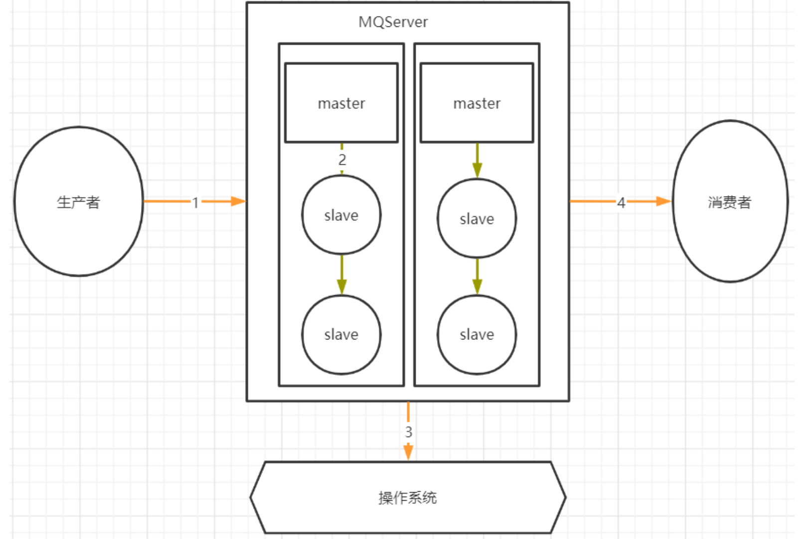
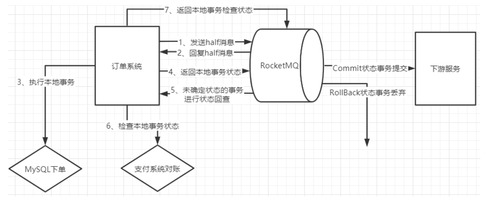
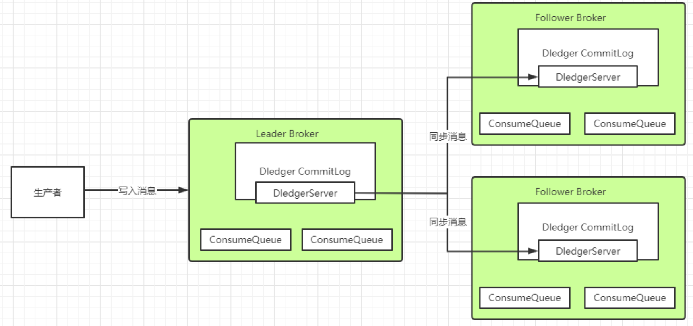
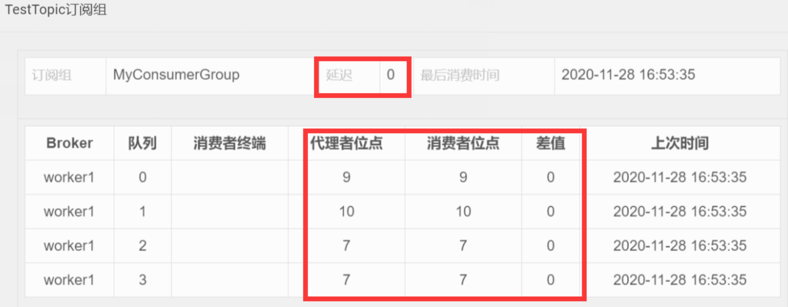
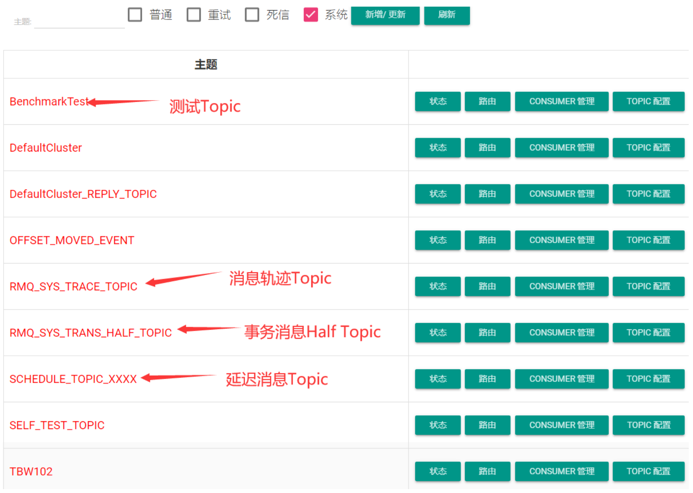

# RocketMQ常见问题 `面试`

## 一、使用RocketMQ如何保证消息不丢失？

### 哪些环节会有丢消息的可能？



其中，1，2，4 三个场景都是跨网络的，而跨网络就肯定会有丢消息的可能。

然后关于 3 这个环节，通常 MQ 存盘时都会先写入操作系统的缓存 page cache 中，然后再由操作系统异步的将消息写入硬盘。这个中间有个时间差，就可能会造成消息丢失。如果服务挂了，缓存中还没有来得及写入硬盘的消息就会丢失。

这个是 MQ 场景都会面对的通用的丢消息问题。那我们看看用 Rocket 时要如何解决这个问题


## RocketMQ消息零丢失方案

### 第1步. 生产者使用事务消息机制保证消息零丢失

这个结论比较容易理解，因为 **RocketMQ 的事务消息机制就是为了保证零丢失来设计的**，并且经过阿里的验证，肯定是非常靠谱的。

但是如果深入一点的话，我们还是要理解下这个事务消息到底是不是靠谱。我们以最常见的电商订单场景为例，来简单分析下事务消息机制如何保证消息不丢失。



- 为什么要发送个 half 消息？有什么用？

  这个 half 消息是在订单系统进行下单操作前发送，并且对下游服务的消费者是不可见的。那这个消息的作用更多的体现在**确认 RocketMQ 的服务是否正常**。

  **相当于嗅探下 RocketMQ 服务是否正常，并且通知 RocketMQ，我马上就要发一个很重要的消息了，你做好准备**

- half 消息如果写入失败了怎么办？

  > 如果没有 half 消息这个流程，那我们通常是会在订单系统中先完成下单，再发送消息给 MQ。这时候写入消息到 MQ 如果失败就会非常尴尬了

  **half 消息如果写入失败，我们就可以认为 MQ 的服务是有问题的，这时，就不能通知下游服务了**

  我们可以在**下单时给订单一个状态标记**，然后**等待 MQ 服务正常后再进行补偿操作**，等 MQ 服务正常后重新下单通知下游服务。

- 订单系统写数据库失败了怎么办？

  > 这个问题我们同样比较下没有使用事务消息机制时会怎么办？
  >
  > 如果没有使用事务消息，我们只能判断下单失败，抛出了异常，那就不往 MQ 发消息了，这样至少保证不会对下游服务进行错误的通知。
  >
  > 但是这样的话，如果过一段时间数据库恢复过来了，这个消息就无法再次发送了。当然，也可以设计另外的补偿机制，例如将订单数据缓存起来，再启动一个线程定时尝试往数据库写。而如果使用事务消息机制，就可以有一种更优雅的方案。

  如果下单时，写数据库失败 (可能是数据库崩了，需要等一段时间才能恢复)。那我们可以**另外找个地方把订单消息先缓存起来** (Redis、文本或者其他方式)，然后**给 RocketMQ 返回一个 UNKNOWN 状态**。

  这样 **RocketMQ 就会过一段时间来回查事务状态**，我们就可以在回查事务状态时再尝试把订单数据写入数据库

  如果数据库这时候已经恢复了，那就能完整正常的下单，再继续后面的业务。这样这个订单的消息就不会因为数据库临时崩了而丢失。

- half 消息写入成功后 RocketMQ 挂了怎么办？

  在事务消息的处理机制中，未知状态的事务状态回查是由 RocketMQ 的 Broker **主动**发起的。

  也就是说如果出现了这种情况，那 RocketMQ 就不会回调到事务消息中回查事务状态的服务。这时，我们就可以将订单一直标记为 "新下单" 的状态。而等 RocketMQ 恢复后，**只要存储的消息没有丢失，RocketMQ 就会再次继续状态回查的流程**。

- **下单成功后如何优雅的等待支付成功？**

  在订单场景下，通常会要求下单完成后，客户在一定时间内，例如 10 分钟，内完成订单支付，支付完成后才会通知下游服务进行进一步的营销补偿。

  > 如果不用事务消息，那通常会怎么办？
  >
  > 最简单的方式是**启动一个定时任务，每隔一段时间扫描订单表**，比对未支付的订单的下单时间，将超过时间的订单回收。这种方式显然是有很大问题的，需要定时扫描很庞大的一个订单信息，这对系统是个不小的压力。

  那更进一步的方案是什么呢？是不是就可以使用 RocketMQ 提供的**延迟消息机制**。

  1. 往 MQ 发一个延迟 1 分钟的消息，消费掉这个消息后去检查订单的支付状态
     - 如果订单已经支付，就往下游发送下单的通知
     - 而如果没有支付，就再发一个延迟 1 分钟的消息。
  2. 最终在第十个消息时把订单回收。

  **这个方案就不用对全部的订单表进行扫描，而只需要每次处理一个单独的订单消息。**

  

  **那如果使用上了事务消息呢？**

  我们就可以用事务消息的**`状态回查机制`来替代定时的任务**

  在下单时，给 Broker 返回一个` UNKNOWN` 的未知状态。而在状态回查的方法中去查询订单的支付状态。这样整个业务逻辑就会简单很多。我们只需要配置 RocketMQ 中的事务消息回查次数 (默认 15 次) 和事务回查间隔时间` (messageDelayLevel)`，就可以更优雅的完成这个支付状态检查的需求

  

**事务消息机制的作用**

整体来说，在订单这个场景下，消息不丢失的问题实际上就还是转化成了下单这个业务与下游服务的业务的分布式事务一致性问题。

而事务一致性问题一直以来都是一个非常复杂的问题。 **RocketMQ 的事务消息机制，实际上只保证了整个事务消息的`一半`**，他保证的是**订单系统下单和发消息这两个事件的事务一致性**，而对下游服务的事务并没有保证。

但是即便如此，也是分布式事务的一个很好的降级方案。目前来看，也是业内最好的降级方案。


### 第2步.RocketMQ配置同步刷盘+Dledger主从架构保证MQ自身不会丢消息

**同步刷盘**

可以简单的把 RocketMQ 的刷盘方式` flushDiskType `配置成同步刷盘就可以保证消息在刷盘过程中不会丢失了。

**Dledger 的文件同步` Raft 协议`**



在使用 Dledger 技术搭建的 RocketMQ 集群中，Dledger 会通过两阶段提交的方式保证文件在主从之间成功同步。

数据同步会通过两个阶段，**一个是 uncommitted 阶段，一个是 commited 阶段**

1. Leader Broker 上的 Dledger 收到一条数据后，会标记为 `uncommitted `状态，然后他通过自己的 DledgerServer 组件把这个 uncommitted 数据发给 Follower Broker 的 DledgerServer 组件。

2. 接着 Follower Broker 的 DledgerServer 收到 uncommitted 消息之后，必须返回一个 ack 给 Leader Broker 的 Dledger。然后如果 Leader Broker 收到超过半数的 Follower Broker 返回的 ack 之后，就会把消息标记为 committed 状态。

3. 再接下来， Leader Broker 上的 DledgerServer 就会发送 `committed` 消息给 Follower Broker 上的 DledgerServer，让他们把消息也标记为 committed 状态。这样，就基于 Raft 协议完成了两阶段的数据同步。


### 第4步.消费者端不要使用异步消费机制

正常情况下，消费者端都是需要先处理本地事务，然后再给 MQ 一个 ACK 响应，这时 MQ 就会修改 Offset，将消息标记为已消费，从而不再往其他消费者推送消息。所以在 Broker 的这种重新推送机制下，消息是不会在传输过程中丢失的。但是也会有下面这种情况会造成服务端消息丢失：

```java
 DefaultMQPushConsumer consumer = new DefaultMQPushConsumer("please_rename_unique_group_name_4");
        consumer.registerMessageListener(new MessageListenerConcurrently() {
            @Override
            public ConsumeConcurrentlyStatus consumeMessage(List<MessageExt> msgs,ConsumeConcurrentlyContext context) {
                new Thread(){
                    public void run(){
                        //处理业务逻辑
                        System.out.printf("%s Receive New Messages: %s %n",Thread.currentThread().getName(), msgs);
                    }
                };
                return ConsumeConcurrentlyStatus.CONSUME_SUCCESS;
            }
        });
```

这种**异步消费**的方式，就有可能造成消息状态返回后消费者本地业务逻辑处理失败造成消息丢失的可能。


### rocketMQ特有的:NameServer挂了如何保证消息不丢失？

**NameServer 在 RocketMQ 中，是扮演的一个路由中心的角色**

但是其实路由中心这样的功能，在所有的 MQ 中都是需要的。kafka 是用 zookeeper 和一个作为 Controller 的 Broker 一起来提供路由服务，整个功能是相当复杂纠结的。而 RabbitMQ 是由每一个 Broker 来提供路由服务。**而只有 RocketMQ 把这个路由中心单独抽取了出来，并独立部署。**

这个NameServer之前都了解过，集群中任意多的节点挂掉，都不会影响他提供的路由功能。那**如果集群中所有的 NameServer 节点都挂了呢？**

> 有很多人就会认为在生产者和消费者中都会有全部路由信息的缓存副本，那整个服务可以正常工作一段时间。其实这个问题大家可以做一下实验，当 NameServer 全部挂了后，生产者和消费者是立即就无法工作了的。

在这种情况下，RocketMQ相当于整个服务都不可用了，那他本身肯定无法给我们保证消息不丢失了。我们只能自己设计一个降级方案来处理这个问题了。

**例如在订单系统中，如果多次尝试发送RocketMQ不成功，那就只能另外找给地方(Redis、文件或者内存等)把订单消息缓存下来，然后起一个线程定时的扫描这些失败的订单消息，尝试往RocketMQ发送**。这样等RocketMQ的服务恢复过来后，就能第一时间把这些消息重新发送出去。

整个这套降级的机制，在大型互联网项目中，都是必须要有的。


### **RocketMQ 消息零丢失方案总结**

整个 RocketMQ 消息零丢失的方案其实挺简单

- **生产者使用事务消息机制。**
- **Broker 配置同步刷盘 + Dledger 主从架构**
- **消费者不要使用异步消费。**
- **整个 MQ 挂了之后准备降级方案**

那这套方案是不是就很完美呢？

其实很明显，这整套的消息零丢失方案，在各个环节都大量的**降低了系统的处理性能以及吞吐量**。在很多场景下，这套方案带来的性能损失的代价可能远远大于部分消息丢失的代价。所以，我们在设计 RocketMQ 使用方案时，要根据实际的业务情况来考虑。

例如，如果针对所有服务器都在同一个机房的场景，完全可以**把 Broker 配置成异步刷盘来提升吞吐量**。而在有些对消息可靠性要求没有那么高的场景，在生产者端就可以采用其他一些更简单的方案来提升吞吐，而采用定时对账、补偿的机制来提高消息的可靠性。而如果消费者不需要进行消息存盘，那使用**异步消费的机制带来的性能提升也是非常显著的**。

总之，这套消息零丢失方案的总结是为了在设计 RocketMQ 使用方案时的一个很好的参考


## 二、使用RocketMQ如何保证消息顺序

### 为什么要保证消息有序？

这个也是面试时最常见的问题。

例如如果我们有个大数据系统，需要对业务系统的日志进行收集分析，这时候为了减少对业务系统的影响，通常都会通过 MQ 来做消息中转。而这时候，对消息的顺序就有一定的要求了。例如我们考虑下面这一系列的操作。

1. 用户的积分默认是 0 分，而新注册用户设置为默认的 10 分。
2. 用户有奖励行为，积分 + 2 分。
3. 用户有不正当行为，积分 - 3 分。

这样一组操作，正常用户积分要变成 9 分。但是如果顺序乱了，这个结果就全部对不了。这时，就需要对这一组操作，保证消息都是有序的。

### 如何保证消息有序？

MQ 的顺序问题分为**全局有序和局部有序**

- 全局有序：整个 MQ 系统的所有消息严格按照队列先入先出顺序进行消费。
- 局部有序：只保证一部分关键消息的消费顺序。

首先需要分析下这个问题，在通常的业务场景中，全局有序和局部有序哪个更重要？

**其实在大部分的MQ业务场景，只需要能够保证局部有序就可以了**。例如我们用QQ聊天，只需要保证一个聊天窗口里的消息有序就可以了。而对于电商订单场景，也只要保证一个订单的所有消息是有序的就可以了。至于全局消息的顺序，并不会太关心。

而通常意义下，全局有序都可以压缩成局部有序的问题。例如以前我们常用的聊天室，就是个典型的需要保证消息全局有序的场景。但是这种场景，通常可以压缩成只有一个聊天窗口的QQ来理解。即整个系统只有一个聊天通道，这样就可以用QQ那种保证一个聊天窗口消息有序的方式来保证整个系统的全局消息有序。

然后落地到RocketMQ。

1. 通常情况下，发送者发送消息时，会通过`MessageQueue轮询`的方式保证消息尽量均匀的分布到所有的MessageQueue上，而消费者也就同样需要从多个MessageQueue上消费消息。而MessageQueue是RocketMQ存储消息的最小单元，他们之间的消息都是互相隔离的，**通常在这种情况下，是无法保证消息全局有序的**。

2.  **而对于局部有序的要求，只需要将有序的一组消息都存入同一个 MessageQueue 里**，这样 MessageQueue 的 FIFO 设计天生就可以保证这一组消息的有序。RocketMQ 中，可以在发送者发送消息时指定一个 `MessageSelector 对象`，让这个对象来决定消息发入哪一个 MessageQueue。这样就可以保证一组有序的消息能够发到同一个 MessageQueue 里。

3. 另外，通常所谓的保证 Topic 全局消息有序的方式，就是**将 Topic 配置成只有一个 MessageQueue 队列** (默认是 4 个)。这样天生就能保证消息全局有序了。这个说法其实就是我们将聊天室场景压缩成只有一个聊天窗口的 QQ 一样的理解方式。**而这种方式对整个 Topic 的消息吞吐影响是非常大的，如果这样用，基本上就没有用 MQ 的必要了**


## 三、使用RocketMQ如何快速处理积压消息？

### 1、如何确定RocketMQ有大量的消息积压？

 在正常情况下，使用 MQ 都会要尽量保证他的消息生产速度和消费速度整体上是平衡的，但是如果部分消费者系统出现故障，就会造成大量的消息积累。

**出现场景：**这类问题通常在实际工作中会出现得比较隐蔽。例如某一天一个数据库突然挂了，大家大概率就会集中处理数据库的问题。等好不容易把数据库恢复过来了，这时基于这个数据库服务的消费者程序就会积累大量的消息。或者网络波动等情况，也会导致消息大量的积累。这在一些大型的互联网项目中，消息积压的速度是相当恐怖的。

**所以消息积压是个需要时时关注的问题！**

 对于消息积压，如果是 RocketMQ 或者 kafka 还好，他们的消息积压不会对性能造成很大的影响。而如果是 RabbitMQ 的话，那就惨了，大量的消息积压可以瞬间造成性能直线下滑。

 **对于 RocketMQ 来说，有个最简单的方式来确定消息是否有积压。那就是使用 web 控制台，就能直接看到消息的积压情况。**

 在 Web 控制台的主题页面，可以通过 Consumer 管理 按钮实时看到消息的积压情况。



> 另外，也可以通过 mqadmin 指令在后台检查各个 Topic 的消息延迟情况。
>
> 还有 RocketMQ 也会在他的 ${storePathRootDir}/config 目录下落地一系列的 json 文件，也可以用来跟踪消息积压情况。


### 2、如何处理大量积压的消息？

其实我们回顾下 RocketMQ 的负载均衡的内容就不难想到解决方案。

如果 Topic 下的 MessageQueue 配置得是足够多的，那每个 Consumer 实际上会分配多个 MessageQueue 来进行消费。

**这个时候，就可以简单的通过增加 Consumer 的服务节点数量来加快消息的消费，等积压消息消费完了，再恢复成正常情况。**

> 最极限的情况是把 Consumer 的节点个数设置成跟 MessageQueue 的个数相同。但是如果此时再继续增加 Consumer 的服务节点就没有用了。

**而如果 Topic 下的 MessageQueue 配置得不够多的话，那就不能用上面这种增加 Consumer 节点个数的方法了。这时怎么办呢？**

这时如果要快速处理积压的消息

1. 可以创建一个新的 Topic，**配置足够多的 MessageQueue**
2. 然后把所有消费者节点的目标 Topic 转向新的 Topic
3. 并紧急上线一组新的消费者，只负责消费旧 Topic 中的消息，并转储到新的 Topic 中，这个速度是可以很快的
4. 然后在新的 Topic 上，就可以通过增加消费者个数来提高消费速度了，之后再根据情况恢复成正常情况。

> 在官网中，还分析了一个特殊的情况。就是如果 RocketMQ 原本是采用的普通方式搭建主从架构，而现在想要中途改为使用 Dledger 高可用集群，这时候如果不想历史消息丢失，就需要先将消息进行对齐，也就是要消费者把所有的消息都消费完，再来切换主从架构。
>
> 因为 Dledger 集群会接管 RocketMQ 原有的 CommitLog 日志，所以切换主从架构时，如果有消息没有消费完，这些消息是存在旧的 CommitLog 中的，就无法再进行消费了。这个场景下也是需要尽快的处理掉积压的消息。


## 四、RocketMQ的消息轨迹

RocketMQ 默认提供了消息轨迹的功能：

### 1、RocketMQ消息轨迹数据的关键属性：

| Producer 端      | Consumer 端        | Broker 端     |
| ---------------- | ------------------ | ------------- |
| 生产实例信息     | 消费实例信息       | 消息的 Topic  |
| 发送消息时间     | 投递时间，投递轮次 | 消息存储位置  |
| 消息是否发送成功 | 消息是否消费成功   | 消息的 Key 值 |
| 发送耗时         | 消费耗时           | 消息的 Tag 值 |

### 2、消息轨迹配置

打开消息轨迹功能，需要在 broker.conf 中打开一个关键配置：

```
traceTopicEnable=true
```

这个配置的默认值是 false，也就是说默认是关闭的。

### 3、消息轨迹数据存储

默认情况下，消息轨迹数据是存于一个系统级别的 Topic ,`RMQ_SYS_TRACE_TOPIC`。这个 Topic 在 Broker 节点启动时，会自动创建出来。



> 另外，也支持客户端自定义轨迹数据存储的 Topic。
>
> 在客户端的两个核心对象 `DefaultMQProducer` 和 `DefaultMQPushConsumer`，他们的构造函数中，都有两个可选的参数来打开消息轨迹存储
>
> - **enableMsgTrace**：是否打开消息轨迹。默认是 false。
> - **customizedTraceTopic**：配置将消息轨迹数据存储到用户指定的 Topic 。

## 总结 rabbitMQ和rocketMQ的区别

- **消息模型：**

  - RabbitMQ 实现了 AMQP（高级消息队列协议），采用的是标准的消息队列模型，支持点对点和发布/订阅两种消息传递方
  - 而RocketMQ 是基于主题（Topic）的消息模型，支持发布/订阅模式，消息按照主题进行分类，订阅者根据主题来接收消息

  > 也就是RabbitMQ有交换机exchange，RocketMQ 没有，但它有nameServer来路由，用tag来进行过滤

- **语言：**

  - RabbitMQ 使用 Erlang 语言实现，性能稳定，但对于一些非 Erlang 开发者来说，可能学习成本较高
  - RocketMQ 使用 Java 语言实现

- **分布式架构**：

  - RabbitMQ 是一个传统的消息队列系统，单个 RabbitMQ Broker 节点的容量有限，需要通过集群方式实现横向扩展
  - RocketMQ 采用分布式架构设计，支持水平扩展和负载均衡，具备更好的性能和可伸缩

- **消息存储**：

  - RabbitMQ 使用内存存储消息，通过持久化机制将消息写入磁盘以防止消息丢失。
  - RocketMQ 使用文件存储消息，消息先写入缓存，再定期刷入磁盘，能够更好地处理高并发情况下的消息存储和检索。

- **社区生态**：

  - RabbitMQ 有着庞大的开源社区支持，拥有丰富的插件和扩展功能。
  - RocketMQ 作为阿里巴巴开源的项目，得到了阿里巴巴团队的持续维护和支持，在中国和国际上都有一定的用户基础和社区活跃度。

- RocketMQ 自带事务消息，顺序消息延时队列等更强大的功能，支持权限控制