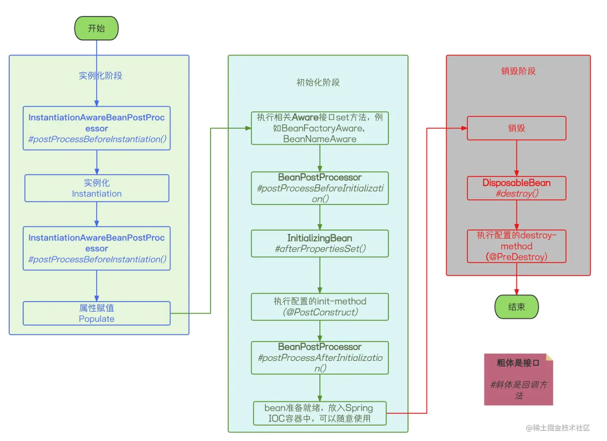

# **spring源码介绍**

## 1.描述下 BeanFactory。

BeanFactory 是 Spring 框架中的一个接口，它是一个**工厂类，用来创建和管理 Spring 中的 Bean 对象**。BeanFactory 接口定义了 **Spring 容器的基本规范和行为**，它提供了一种机制来将配置文件中定义的 **Bean 实例化、配置和管理起来**。

BeanFactory 的**主要作用是提供 Bean 的创建、配置、初始化和销毁等基本操作**

BeanFactory 接口有多个实现类，其中最常用的是 **XmlBeanFactory 和 DefaultListableBeanFactory**。XmlBeanFactory 是通过 XML 文件来配置 Bean 的实例化、配置和管理的，而 DefaultListableBeanFactory 则是通过 Java 代码来配置 Bean 的实例化、配置和管理的

> BeanFactory将注册成的bean定义`BeanDefinition`创建到ioc容器中

## 2.BeanFactory 和 ApplicationContext 的区别？

1. BeanFactory 是 Spring 的早期接口，称为 `Spring的Bean工厂`，ApplicationContext 是后期更高级接口，称之为 `Spring容器`；
2. ApplicationContext 在 BeanFactory **基础上对功能进行了扩展**，例如：`监听功能、国际化功能`等。`BeanFactory` 的 API 更偏向底层，ApplicationContext的 API 大多数是对这些**底层 API的封装**；
3. **Bean 创建的主要逻辑和功能都被封装在 BeanFactory 中**，ApplicationContext不仅继承了BeanFactory，而且ApplicationContext内部还维护着BeanFactory的引用，所以，ApplicationContext 与 BeanFactory **既有继承关系，又有融合关系**。
4. Bean 的初始化时机不同，原始BeanFactory是在**首次调用getBean时才进行Bean的创建**，而ApplicationContext则是配置文件加载，**容器一创建就将 Bean 都实例化并初始化好**。

## 3.简述 SpringIoC 的加载过程。

1. **配置文件加载：** 首先需要加载配置文件，通常是`ClassPathXmlApplicationContext`：从类路径下的 XML 文件加载 Bean 定义信息 ，或者是`AnnotationConfigApplicationContext`：基于 Java 注解的方式，从指定的配置类中加载 Bean 定义信息

2. **生成Bean定义`BeanDefinition`**：通过上面两种ApplicationContext 实现，**BeanDefinitionScanner负责扫描类并生成 BeanDefinition** ， **BeanDefinitionReader负责读取和解析 BeanDefinition**，**BeanDefinitionRegistry 负责将解析得到的 BeanDefinition 注册到 Spring 容器中**。

   这三者共同协作，实现了 BeanDefinition 的加载和注册，这些 BeanDefinition 对象包含了 Bean 的类名、依赖关系、初始化参数等信息

3. **BeanDefinition实例化前拓展：**`BeanFactoryPostProcessor` 和 `BeanDefinitionRegistryPostProcessor` 都是 Spring 框架中用于处理 BeanDefinition 的**扩展点**，对于继承了扩展接口的类Spring会对方法自动实现

   - **BeanFactoryPostProcessor：**是 Spring 容器加载 BeanDefinition 后，在**实例化 Bean 之前的一个扩展点**。允许我们在容器**实例化 Bean 之前对 BeanDefinition 进行修改**。比如修改 Bean 的属性值、添加新的 BeanDefinition 等。

   - **BeanDefinitionRegistryPostProcessor：**是 **BeanFactoryPostProcessor的一个子接口**，它专门用于处理 BeanDefinition 的注册。与 BeanFactoryPostProcessor不同，BeanDefinitionRegistryPostProcessor 在容器加载 BeanDefinition 之后、在实例化 Bean 之前执行。**它提供了额外的方法，可以直接向容器注册新的 BeanDefinition**

4. **Bean 实例和初始化：**

   1. 首先Spring 容器根据 BeanDefinition 中的类名信息，使用 **Java 反射机制实例化 Bean 对象**。

   2. 然后**依赖注入**和**属性赋值**：Spring 容器会查找并**注入 Bean 所依赖的其他 Bean 实例**，和**根据 BeanDefinition 中配置的属性信息，为 Bean 对象的属性赋值**

   3. **实现Bean 生命周期回调方法**：如果 Bean 类中定义了初始化方法（如通过 `@PostConstruct` 注解或配置文件的 `init-method` 属性指定），**Spring 容器会在实例化完成后调用该方法进行初始化**

   4. **完成加载**： 加载过程完成后，Spring IoC 容器会准备好供应用程序使用的所有 Bean 实例，Bean 实例会被投入一级缓存，也就是单例池中供我们使用

      > 还有总共9种不同功能和实例化阶段的**BeanPostProcessor**允许我们在 **Bean 实例化流程中进行一些自定义处理**
      >
      > 同时还有**Aware** ：Aware 是 Spring 框架提供的一种特殊接口，在容器实例化 Bean 过程中，可以通过实现相应的 Aware 接口，**让 Bean 获取到容器的相关信息**，只要实例化对象继承了对应的Aware接口就可以实现。比如**BeanNameAware**：Bean 可以获取到在容器中配置的自身 Bean 名称；**BeanFactoryAware**：Bean 可以获取到当前所在的 BeanFactory，可以通过 BeanFactory 获取其他 Bean 实例。。。等等

## 4.简述 Bean 的生命周期。

**主要就是四个 ：实例化（空壳）—>属性设置—>初始化—>使用—>销毁**

1. **实例化（Instantiation）**：容器根据配置信息创建 Bean 的实例。这通常是通过构造函数或工厂方法来实现的。
2. **属性设置（Population of properties）**：容器将配置的属性值或引用注入到 Bean 实例中，包括依赖注入（Dependency Injection）和其他属性的设置。
3. **初始化前回调（Initialization callback）**：在 Bean 实例化后，在调用任何初始化方法之前，容器会调用 BeanPostProcessor 的 postProcessBeforeInitialization() 方法。
4. **初始化（Initialization）**：容器调用 Bean 的初始化方法（如果有），通常是通过 @PostConstruct 注解或指定的初始化方法来实现。此阶段可以执行一些初始化操作，如连接数据库、打开文件等。
5. **初始化后回调（Initialization callback）**：在调用初始化方法之后，容器会调用 BeanPostProcessor 的 postProcessAfterInitialization() 方法。
6. **使用（Bean is ready for use）**：Bean 已经被完全初始化，可以被其他 Bean 或应用程序代码使用。
7. **销毁前回调（Destruction callback）**：在容器关闭之前，如果 Bean 实现了 DisposableBean 接口或指定了销毁方法，则容器会调用其销毁方法。
8. **销毁（Destruction）**：容器关闭时，会销毁所有的 Bean 实例。在销毁 Bean 之前，容器会调用 DisposableBean 的 destroy() 方法或指定的销毁方法。

## 5.Spring 中有哪些扩展接口及调用时机

1. **BeanPostProcessor**：该接口用于在 Bean 初始化前后进行自定义操作。它包含两个方法：

   - `postProcessBeforeInitialization(Object bean, String beanName)`: 在 Bean 初始化方法调用之前调用。

   - `postProcessAfterInitialization(Object bean, String beanName)`: 在 Bean 初始化方法调用之后调用。

2. **BeanFactoryPostProcessor**：该接口用于在**容器实例化 BeanFactory 时对其进行后处理**，通常用于修改或替换容器中的 BeanDefinition。它包含一个方法：
   - `postProcessBeanFactory(ConfigurableListableBeanFactory beanFactory)`: **在 BeanFactory 初始化之后，BeanDefinition 加载之前调用。**

3. **InitializingBean** 和 **DisposableBean**：这两个接口分别用于**在 Bean 初始化和销毁时执行自定义逻辑**。它们分别包含 `afterPropertiesSet()` 和 `destroy()` 方法。（可能有耦合）

   **@PostConstruct** 和 **@PreDestroy**：这两个注解用于指定在 Bean 初始化和销毁时执行的方法。（更为简洁）

4. **ApplicationListener**：该接口用于监听应用程序事件。当应用程序发布与之关联的事件时，注册的监听器将被调用。

5. **Aware 接口：**用于在 Spring 容器初始化 Bean 时，将一些相关的对象注入到 Bean 中，使得 Bean 具有更多的感知能力。实现 Aware 接口可以在 Bean 初始化之前获取到 Spring 容器的一些相关资源，如 ApplicationContext、BeanFactory 等，从而为 Bean 提供更多的操作能力。

