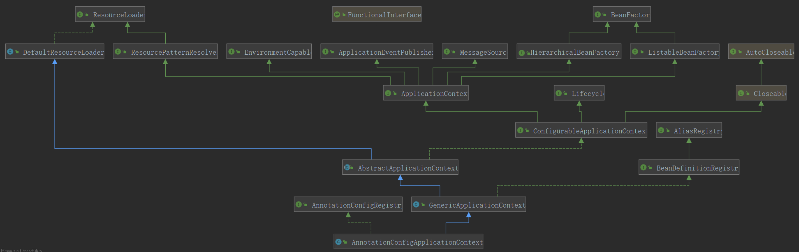
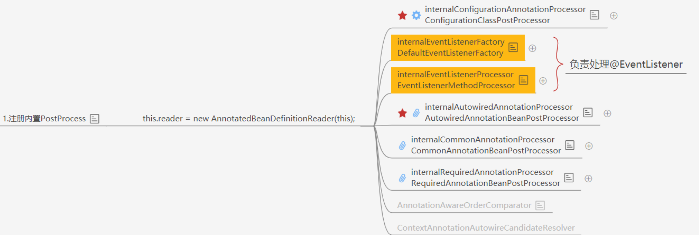
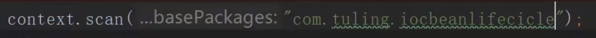
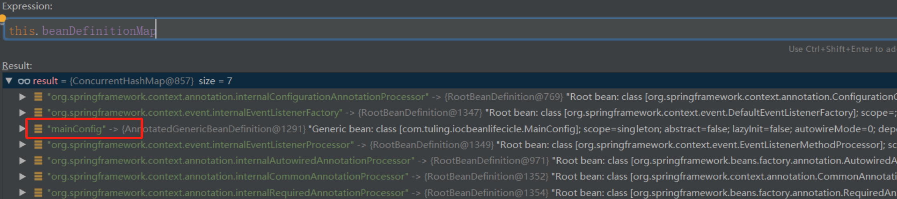
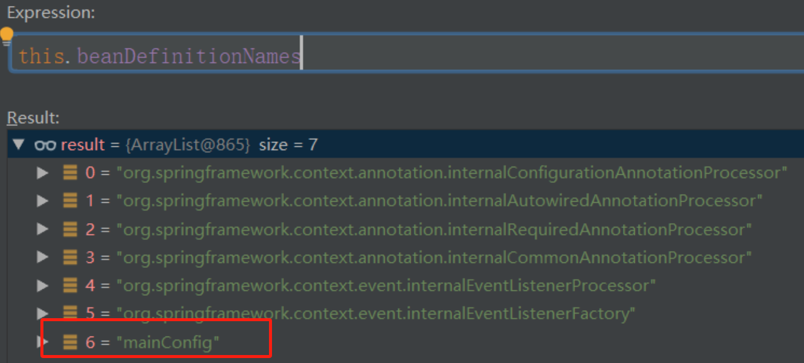

# Spring Ioc源码

**这里以配置类示例**

```java
public static void main(String[] args)   {
   // 加载spring上下文
   AnnotationConfigApplicationContext context = new AnnotationConfigApplicationContext(MainConfig.class);
 
   Car car =  context.getBean("car",Car.class);
   System.out.println(car.getName());
}
```



## **1. 实例化化容器：AnnotationConfigApplicationContext **

从这里出发：

```java
 // 加载spring上下文
   AnnotationConfigApplicationContext context = new AnnotationConfigApplicationContext(MainConfig.class);
```

创建 AnnotationConfigApplicationContext 对象

```java
public AnnotationConfigApplicationContext(Class<?>... annotatedClasses) {
    //本类的构造函数里面，初始化了一个读取器：AnnotatedBeanDefinitionReader read，一个扫描器ClassPathBeanDefinitionScanner scanner
    //scanner的用处不是很大，它仅仅是在我们外部手动调用 .scan 等方法才有用，常规方式是不会用到scanner对象的
    this();
    //把传入的类进行注册，这里有两个情况，
    //传入传统的配置类
    //传入bean（虽然一般没有人会这么做
    //看到后面会知道spring把传统的带上@Configuration的配置类称之为FULL配置类，不带@Configuration的称之为Lite配置类
    //但是我们这里先把带上@Configuration的配置类称之为传统配置类，不带的称之为普通bean
    register(annotatedClasses);
    //刷新
    refresh();
}
```

1. 这是一个有参的构造方法 `public AnnotationConfigApplicationContext(Class<?>... annotatedClasses) {`，可以接收多个配置类，不过一般情况下，只会传入一个配置类。

2. 这个配置类有两种情况，一种是传统意义上的**带上 @Configuration 注解的配置类**，还有一种是**没有带上 @Configuration**，但是**带有 @Component，@Import，@ImportResouce，@Service，@ComponentScan 等注解的配置类**，在 Spring 内部把前者称为 **Full 配置类**，把后者称之为 **Lite 配置类**。

   > 在本源码分析中，有些地方也把 Lite 配置类称为**普通 Bean**


## 2. 先看this()：无参构造函数

```java
this();
```

调用子类的构造函数，会先调用父类**GenericApplicationContext**的构造函数，让我们看看

> 在**面向对象中**，子类继承了父类的属性和方法，而构造函数负责对对象进行初始化，包括初始化继承的属性。因此在创建子类对象时，必须先确保父类部分已经完成了初始化，这就需要先调用父类的构造函数

```java
public class GenericApplicationContext extends AbstractApplicationContext implements BeanDefinitionRegistry {
public GenericApplicationContext() {
    this.beanFactory = new DefaultListableBeanFactory();
}
}
```

父类的构造函数里面就是**初始化DefaultListableBeanFactory，并且赋值给beanFactory**

> 为什么使用DefaultListableBeanFactory？
>
> `DefaultListableBeanFactory` 是 Spring 中最常用的 `BeanFactory` 实现之一，因为它提供了对 bean 的注册、解析、获取等操作的支持，功能最为强大


**执行构造函数AnnotationConfigApplicationContext()**

```java
public class AnnotationConfigApplicationContext extends GenericApplicationContext implements AnnotationConfigRegistry {
 
    //注解bean定义读取器，主要作用是用来读取被注解的了bean
    private final AnnotatedBeanDefinitionReader reader;
 
    //扫描器，它仅仅是在我们外部手动调用 .scan 等方法才有用，常规方式是不会用到scanner对象的
    private final ClassPathBeanDefinitionScanner scanner;
 
    public AnnotationConfigApplicationContext() {
        //初始化一个Bean读取器
        this.reader = new AnnotatedBeanDefinitionReader(this);
 
        //初始化一个扫描器，它仅仅是在我们外部手动调用 .scan 等方法才有用，常规方式是不会用到scanner对象的
        this.scanner = new ClassPathBeanDefinitionScanner(this);
    }
}
```

其主要做了 2 件事情

1. **注册内置 BeanPostProcessor**

2. **注册相关的 BeanDefinition**


### Ⅰ.**实例化** **BeanDefinition** **读取器： AnnotatedBeanDefinitionReader**

```java
this.reader = new AnnotatedBeanDefinitionReader(this);
```

看看 Spring 在初始化 AnnotatedBeanDefinitionReader 的时候做了什么

进入AnnotatedBeanDefinitionReader，看到AnnotationConfigApplicationContext 作为BeanDefinitionRegistry传入

```java
public AnnotatedBeanDefinitionReader(BeanDefinitionRegistry registry) {
        this(registry, getOrCreateEnvironment(registry));
}
```

这里又直接调用了此类其他的构造方法：点击进入this()

```java
public AnnotatedBeanDefinitionReader(BeanDefinitionRegistry registry, Environment environment) {
    this.beanNameGenerator = new AnnotationBeanNameGenerator();
    this.scopeMetadataResolver = new AnnotationScopeMetadataResolver();
    Assert.notNull(registry, "BeanDefinitionRegistry must not be null");
    Assert.notNull(environment, "Environment must not be null");
    this.registry = registry;
    this.conditionEvaluator = new ConditionEvaluator(registry, environment, (ResourceLoader)null);
    AnnotationConfigUtils.registerAnnotationConfigProcessors(this.registry);
}
```

 让我们把目光移动到这个方法的最后一行，进入 **registerAnnotationConfigProcessors** 方法：

进入AnnotationConfigUtils类

```java
public static void registerAnnotationConfigProcessors(BeanDefinitionRegistry registry) {
	registerAnnotationConfigProcessors(registry, null);
}
```

再点进去，这个方法的返回值 `Set<BeanDefinitionHolder> `，但是上游方法并没有去接收这个返回值，所以这个方法的返回值也不是很重要了，当然方法内部给这个返回值赋值也不重要了。

由于这个方法内容比较多，这里就把最核心的贴出来，这个方法的核心就是**注册 Spring 内置的多个 Bean**

```java
if (!registry.containsBeanDefinition(CONFIGURATION_ANNOTATION_PROCESSOR_BEAN_NAME)) {
	RootBeanDefinition def = new RootBeanDefinition(ConfigurationClassPostProcessor.class);
	def.setSource(source);
	beanDefs.add(registerPostProcessor(registry, def, CONFIGURATION_ANNOTATION_PROCESSOR_BEAN_NAME));
}
```

1. 判断容器中是否已经存在了 ConfigurationClassPostProcessor 这个Bean

   ```java
   if (!registry.containsBeanDefinition(CONFIGURATION_ANNOTATION_PROCESSOR_BEAN_NAME))
   ```

2. 如果不存在（当然这里肯定是不存在的），就通过 RootBeanDefinition 的构造方法获得 ConfigurationClassPostProcessor 的 BeanDefinition，RootBeanDefinition 是 BeanDefinition 的子类

   ```java
   RootBeanDefinition def = new RootBeanDefinition(ConfigurationClassPostProcessor.class);
   ```

3. 执行 registerPostProcessor 方法，registerPostProcessor 方法内部就是注册 Bean，当然这里注册其他 Bean 也是一样的流程。这里的返回值不重要，注册进去就行了。

   ```java
   registerPostProcessor(registry, def, CONFIGURATION_ANNOTATION_PROCESSOR_BEAN_NAME)
   ```

> **internalConfigurationAnnotationProcessor**,**internalAutowiredAnnotationProcessor**,**internalRequiredAnnotationProcessor**这些个乱七八糟的类又有什么作用呢？为啥一开始就要放进去？
>
> 1. `org.springframework.context.annotation.internalConfigurationAnnotationProcessor`: 用于处理 `@Configuration` 注解的处理器。当 Spring 容器扫描到一个类上标注了 `@Configuration` 注解时，会使用这个处理器来处理该类，将其识别为配置类，并执行相应的处理逻辑，例如解析配置信息、创建 bean 实例等。
>
>    - **生成BeanDefinition：** 通过解析 `@Configuration` 注解，该处理器会生成相应的 BeanDefinition，并将其注册到容器中。
>
>    - **处理@Bean注解：** 在 `@Configuration` 类中使用 `@Bean` 注解声明的方法，会被该处理器识别并处理，生成相应的 BeanDefinition。
>
>    - **处理@Import注解：** 如果 `@Configuration` 类中使用了 `@Import` 注解导入其他配置类，该处理器也会相应地处理这些导入操作
>
> 2. `org.springframework.context.annotation.internalAutowiredAnnotationProcessor`: 这个类是用于处理 `@Autowired` 注解的处理器。`@Autowired` 注解用于自动装配 bean，当 Spring 容器扫描到一个类中的字段、方法或构造函数上标注了 `@Autowired` 注解时，会使用这个处理器来处理该类，将其标记为需要自动装配的 bean。
>
> 3. `org.springframework.context.annotation.internalRequiredAnnotationProcessor`: 这个类是用于处理 `@Required` 注解的处理器。`@Required` 注解用于标记必需的 bean 属性，当 Spring 容器扫描到一个类中的字段或方法上标注了 `@Required` 注解时，会使用这个处理器来处理该类，确保相应的属性被正确设置。
>
> 也就是说，要先把这些Spring 框架内部**负责处理常见的注解**的核心组件先注册进去，才能为之后实现**自动装配，配置类的解析，依赖注入和配置管理**等功能。我不放进去，那之后的带注解的类进来我怎么识别他们呢？




### **II**.registerPostProcessor 方法：

看看`registerPostProcessor(registry, def, CONFIGURATION_ANNOTATION_PROCESSOR_BEAN_NAME)`这一句的registerPostProcessor 方法

```java
private static BeanDefinitionHolder registerPostProcessor(BeanDefinitionRegistry registry, RootBeanDefinition definition, String beanName) {

	definition.setRole(BeanDefinition.ROLE_INFRASTRUCTURE);
	registry.registerBeanDefinition(beanName, definition);
	return new BeanDefinitionHolder(definition, beanName);
}
```

这方法为 BeanDefinition 设置了一个 **Role**，**ROLE_INFRASTRUCTURE** 代表这是 spring 内部的，并非用户定义的

然后又调用了 registerBeanDefinition 方法，再点进去，你会发现它是一个接口，没办法直接点进去了

```java
public interface BeanDefinitionRegistry extends AliasRegistry {
    void registerBeanDefinition(String var1, BeanDefinition var2) throws BeanDefinitionStoreException;
    }
```


**首先要知道 registry 实现类是什么，那么它的实现是什么呢？**

答案是 **DefaultListableBeanFactory**

DefaultListableBeanFactory的registerBeanDefinition 核心在于下面两行代码

```java
//beanDefinitionMap是Map<String, BeanDefinition>，
//这里就是把beanName作为key，ScopedProxyMode作为value，推到map里面
this.beanDefinitionMap.put(beanName, beanDefinition);
 
//beanDefinitionNames就是一个List<String>,这里就是把beanName放到List中去
this.beanDefinitionNames.add(beanName);
```

从这里可以看出 DefaultListableBeanFactory 就是我们所说的容器了，**里面放着 beanDefinitionMap，beanDefinitionNames**

**beanDefinitionMap** 是一个 hashMap，beanName 作为 Key,beanDefinition 作为 Value

**beanDefinitionNames** 是一个List集合，里面存放了 beanName


这里仅仅是注册了一些核心配置类，可以简单的理解为**把一些原料放入工厂，工厂还没有真正的去生产，但是工厂已经准备好去生产了**

ConfigurationClassPostProcessor`也就是internalConfigurationAnnotationProcessor` 实现 **BeanDefinitionRegistryPostProcessor** 接口，**BeanDefinitionRegistryPostProcessor** 接口又扩展了 **BeanFactoryPostProcessor** 接口

**BeanFactoryPostProcessor 是 Spring 的扩展点之一，ConfigurationClassPostProcessor 是 Spring 极为重要的一个类！**


除了注册了 ConfigurationClassPostProcessor，还注册了其他 Bean，其他 Bean 也都实现了其他接口，比如 BeanPostProcessor 等。

**BeanPostProcessor 接口也是 Spring 的扩展点之一。**

至此，实例化 AnnotatedBeanDefinitionReader reader 分析完毕。


### Ⅲ.**创建** **BeanDefinition 扫描器：ClassPathBeanDefinitionScanner（略）**

由于常规使用方式是**不会用到 AnnotationConfigApplicationContext 里面的 scanner 的**，会新建一个，这里的 scanner 仅仅是为了程序员可以手动调用 AnnotationConfigApplicationContext 对象的 scan 方法，单独扫描某个包



所以这里就不看 scanner 是如何被实例化的了。


## 3. register (annotatedClasses)

把目光回到最开始，再分析第二行代码：

**这里是将目标类注册为BeanDefinition** 

```java
register(annotatedClasses);
```

```java
public void register(Class<?>... annotatedClasses) {
    Assert.notEmpty(annotatedClasses, "At least one annotated class must be specified");
    this.reader.register(annotatedClasses);
}
```

```java
public void register(Class<?>... annotatedClasses) {
    Class[] var2 = annotatedClasses;
    int var3 = annotatedClasses.length;
    for(int var4 = 0; var4 < var3; ++var4) {
        Class<?> annotatedClass = var2[var4];
        this.registerBean(annotatedClass);
    }
}
```

这里传进去的是一个数组，**最终会循环调用如下方法：**

```java
    <T> void doRegisterBean(Class<T> annotatedClass, @Nullable Supplier<T> instanceSupplier, @Nullable String name,
            @Nullable Class<? extends Annotation>[] qualifiers, BeanDefinitionCustomizer... definitionCustomizers) {

        AnnotatedGenericBeanDefinition abd = new AnnotatedGenericBeanDefinition(annotatedClass);
 
        if (this.conditionEvaluator.shouldSkip(abd.getMetadata())) {
            return;
        }
        abd.setInstanceSupplier(instanceSupplier);
 
        ScopeMetadata scopeMetadata = this.scopeMetadataResolver.resolveScopeMetadata(abd);
        abd.setScope(scopeMetadata.getScopeName());
 
        String beanName = (name != null ? name : this.beanNameGenerator.generateBeanName(abd, this.registry));
 
        AnnotationConfigUtils.processCommonDefinitionAnnotations(abd);

        if (qualifiers != null) {
            //可以传入qualifier数组，所以需要循环处理
            for (Class<? extends Annotation> qualifier : qualifiers) {
                //Primary注解优先
                if (Primary.class == qualifier) {
                    abd.setPrimary(true);
                }
                //Lazy注解
                else if (Lazy.class == qualifier) {
                    abd.setLazyInit(true);
                }
                //其他，AnnotatedGenericBeanDefinition有个Map<String,AutowireCandidateQualifier>属性，直接push进去
                else {
                    abd.addQualifier(new AutowireCandidateQualifier(qualifier));
                }
            }
        }
 
        for (BeanDefinitionCustomizer customizer : definitionCustomizers) {
            customizer.customize(abd);
        }
 
        BeanDefinitionHolder definitionHolder = new BeanDefinitionHolder(abd, beanName);
 
        definitionHolder = AnnotationConfigUtils.applyScopedProxyMode(scopeMetadata, definitionHolder, this.registry);
 
        //DefaultListableBeanFactory维护着一系列信息，比如beanDefinitionNames，beanDefinitionMap
        //beanDefinitionNames是一个List<String>,用来保存beanName
        //beanDefinitionMap是一个Map,用来保存beanName和beanDefinition
        BeanDefinitionReaderUtils.registerBeanDefinition(definitionHolder, this.registry);
    }
```


1. 先看

   ```java
   AnnotatedGenericBeanDefinition abd = new AnnotatedGenericBeanDefinition(annotatedClass);
   ```

   **AnnotatedGenericBeanDefinition可以理解为一种数据结构，是用来描述Bean的**

   这里的作用就是把传入的标记了注解的类转为AnnotatedGenericBeanDefinition数据结构，里面有一个getMetadata方法，可以拿到类上的注解

   ```java
   //拿到目标类上的注解
   public final AnnotationMetadata getMetadata() {
       return this.metadata;
   }
   ```

   ​	通过 AnnotatedGenericBeanDefinition 的构造方法，获得配置类的 BeanDefinition

   ​	这里与注册 ConfigurationClassPostProcessor 类的时候，也是通过构造方法去获得 BeanDefinition 的类似，只不过当时是通过 RootBeanDefinition 去获得，现在是通过 AnnotatedGenericBeanDefinition 去获得。`两种不同的BeanDefinition获取`

2. 判断是否需要跳过注解

   ```java
   if (this.conditionEvaluator.shouldSkip(abd.getMetadata()))
   ```

    判断是否需要跳过注解，spring中有一个**@Condition**注解，当不满足条件，这个bean就不会被解析

3. 解析作用域

   ```java
   ScopeMetadata scopeMetadata = this.scopeMetadataResolver.resolveScopeMetadata(abd);
   abd.setScope(scopeMetadata.getScopeName());
   ```

   如果没有设置的话，默认为单例

4. 获取beanName

   ```java
    String beanName = (name != null ? name : this.beanNameGenerator.generateBeanName(abd, this.registry));
   ```

5. 解析通用注解

   ```java
   AnnotationConfigUtils.processCommonDefinitionAnnotations(abd);
   ```

   解析通用注解，填充到AnnotatedGenericBeanDefinition，解析的注解为**Lazy，Primary，DependsOn，Role，Description**

6. 限定符处理

   ```java
   if (qualifiers != null) {
       Class[] var7 = qualifiers;
       int var8 = qualifiers.length;
   
       for(int var9 = 0; var9 < var8; ++var9) {
           Class<? extends Annotation> qualifier = var7[var9];
           if (Primary.class == qualifier) {
               abd.setPrimary(true);
           } else if (Lazy.class == qualifier) {
               abd.setLazyInit(true);
           } else {
               abd.addQualifier(new AutowireCandidateQualifier(qualifier));
           }
       }
   }
   ```

   不是特指 @Qualifier 注解，也有可能是 Primary，或者是 Lazy，或者是其他。

7. 把 **AnnotatedGenericBeanDefinition 数据结构和 beanName 封装到一个对象中**（这个不是很重要，可以简单的理解为方便传参）

   ```java
   BeanDefinitionHolder definitionHolder = new BeanDefinitionHolder(abd, beanName);
   ```

   >  ` definitionHolder = AnnotationConfigUtils.applyScopedProxyMode(scopeMetadata, definitionHolder, this.registry);`
   >
   > 这一句的作用是根据给定的作用域元数据（`scopeMetadata`），将 bean 的定义（`definitionHolder`）应用指定的代理模式

8. 正式注册

   最终会调用 DefaultListableBeanFactory 中的 registerBeanDefinition 方法拿到definitionHolder `Bean定义`去注册

   ```java
   BeanDefinitionReaderUtils.registerBeanDefinition(definitionHolder, this.registry);
   ```


### Ⅰ.registerBeanDefinition 注册BeanDefinition

```java
    public static void registerBeanDefinition(BeanDefinitionHolder definitionHolder, BeanDefinitionRegistry registry)throws BeanDefinitionStoreException {
 
        //获取beanName
        // Register bean definition under primary name.
        String beanName = definitionHolder.getBeanName();
 
        //注册bean
        registry.registerBeanDefinition(beanName, definitionHolder.getBeanDefinition());
 
        //Spring支持别名
        String[] aliases = definitionHolder.getAliases();
        if (aliases != null) {
            for (String alias : aliases) {
                registry.registerAlias(beanName, alias);
            }
        }
    }
```

**在上面注册 Spring 内置的 Bean 的时候，已经解析过这个方法了，**这里就不重复了

此时，让我们再观察下 beanDefinitionMap beanDefinitionNames 两个变量，除了 Spring 内置的 Bean，还有我们传进来的 Bean，这里的 Bean 当然就是我们的配置类了：






**到这里注册配置类MainConfig.class完成。**


## **4.refresh()`最最最核心一步`** 

其实到这里，Spring 还没有进行扫描，只是实例化了一个工厂，注册了一些内置的 Bean 和我们传进去的配置类，真正的大头是在第三行代码：

```java
refresh();
```

这个方法做了很多事情，让我们点开这个方法：

```java
public void refresh() throws BeansException, IllegalStateException {
    synchronized (this.startupShutdownMonitor) {
        //刷新预处理，和主流程关系不大，就是保存了容器的启动时间，启动标志等
        prepareRefresh();

        //和主流程关系也不大，最终获得了DefaultListableBeanFactory，
        // DefaultListableBeanFactory实现了ConfigurableListableBeanFactory
        ConfigurableListableBeanFactory beanFactory = obtainFreshBeanFactory();

        //还是一些准备工作，添加了两个后置处理器：ApplicationContextAwareProcessor，ApplicationListenerDetector
        //还设置了 忽略自动装配 和 允许自动装配 的接口,如果不存在某个bean的时候，spring就自动注册singleton bean
        //还设置了bean表达式解析器 等
        prepareBeanFactory(beanFactory);

        try {
            // Allows post-processing of the bean factory in context subclasses.
            //这是一个空方法
            postProcessBeanFactory(beanFactory);

            // Invoke factory processors registered as beans in the context.
            //执行自定义的BeanFactoryProcessor和内置的BeanFactoryProcessor
            invokeBeanFactoryPostProcessors(beanFactory);

            // Register bean processors that intercept bean creation.
            // 注册BeanPostProcessor
            registerBeanPostProcessors(beanFactory);

            // Initialize message source for this context.
            initMessageSource();

            // Initialize event multicaster for this context.
            initApplicationEventMulticaster();

            // Initialize other special beans in specific context subclasses.
            // 空方法
            onRefresh();

            // Check for listener beans and register them.
            registerListeners();

            // Instantiate all remaining (non-lazy-init) singletons.
            finishBeanFactoryInitialization(beanFactory);

            // Last step: publish corresponding event.
            finishRefresh();
        }

        catch (BeansException ex) {
            if (logger.isWarnEnabled()) {
                logger.warn("Exception encountered during context initialization - " +
                            "cancelling refresh attempt: " + ex);
            }

            destroyBeans();

            cancelRefresh(ex);

            throw ex;
        }

        finally {
            resetCommonCaches();
        }
    }
}
```

### **1.prepareRefresh()**

从命名来看，就知道这个方法主要做了一些刷新前的准备工作，和主流程关系不大，主要是保存了容器的启动时间，启动标志等。

### 2.**ConfigurableListableBeanFactory beanFactory = obtainFreshBeanFactory()**

这个方法和主流程关系也不是很大，可以简单的认为，就是把 beanFactory 取出来而已。XML 模式下会在这里读取 BeanDefinition

### **3.prepareBeanFactory**

```java
prepareBeanFactory(beanFactory);
```

还是一些准备工作，添加了两个后置处理器：ApplicationContextAwareProcessor，ApplicationListenerDetector

还设置了 忽略自动装配 和 允许自动装配 的接口，如果不存在某个bean的时候，spring就自动注册singleton bean

还设置了bean表达式解析器 等

**点击进入**

```java
protected void prepareBeanFactory(ConfigurableListableBeanFactory beanFactory) {
    //设置类加载器
    beanFactory.setBeanClassLoader(getClassLoader());

    //设置bean表达式解析器
    beanFactory.setBeanExpressionResolver(new StandardBeanExpressionResolver(beanFactory.getBeanClassLoader()));

    //属性编辑器支持
    beanFactory.addPropertyEditorRegistrar(new ResourceEditorRegistrar(this, getEnvironment()));

    //添加一个后置处理器：ApplicationContextAwareProcessor，此后置处理处理器实现了BeanPostProcessor接口
    beanFactory.addBeanPostProcessor(new ApplicationContextAwareProcessor(this));

    //以下接口，忽略自动装配
    beanFactory.ignoreDependencyInterface(EnvironmentAware.class);
    beanFactory.ignoreDependencyInterface(EmbeddedValueResolverAware.class);
    beanFactory.ignoreDependencyInterface(ResourceLoaderAware.class);
    beanFactory.ignoreDependencyInterface(ApplicationEventPublisherAware.class);
    beanFactory.ignoreDependencyInterface(MessageSourceAware.class);
    beanFactory.ignoreDependencyInterface(ApplicationContextAware.class);

    //以下接口，允许自动装配,第一个参数是自动装配的类型，，第二个字段是自动装配的值
    beanFactory.registerResolvableDependency(BeanFactory.class, beanFactory);
    beanFactory.registerResolvableDependency(ResourceLoader.class, this);
    beanFactory.registerResolvableDependency(ApplicationEventPublisher.class, this);
    beanFactory.registerResolvableDependency(ApplicationContext.class, this);

    //添加一个后置处理器：ApplicationListenerDetector，此后置处理器实现了BeanPostProcessor接口
    beanFactory.addBeanPostProcessor(new ApplicationListenerDetector(this));
    if (beanFactory.containsBean(LOAD_TIME_WEAVER_BEAN_NAME)) {
        beanFactory.addBeanPostProcessor(new LoadTimeWeaverAwareProcessor(beanFactory));
        beanFactory.setTempClassLoader(new ContextTypeMatchClassLoader(beanFactory.getBeanClassLoader()));
    }

    //如果没有注册过bean名称为XXX，spring就自己创建一个名称为XXX的singleton bean
    if (!beanFactory.containsLocalBean(ENVIRONMENT_BEAN_NAME)) {
        beanFactory.registerSingleton(ENVIRONMENT_BEAN_NAME, getEnvironment());
    }
    if (!beanFactory.containsLocalBean(SYSTEM_PROPERTIES_BEAN_NAME)) {
        beanFactory.registerSingleton(SYSTEM_PROPERTIES_BEAN_NAME, getEnvironment().getSystemProperties());
    }
    if (!beanFactory.containsLocalBean(SYSTEM_ENVIRONMENT_BEAN_NAME)) {
        beanFactory.registerSingleton(SYSTEM_ENVIRONMENT_BEAN_NAME, getEnvironment().getSystemEnvironment());
    }
}
```

主要做了如下的操作：

1. 设置了一个类加载器

   ```java
   beanFactory.setBeanClassLoader(getClassLoader());
   ```

2. 设置了 bean 表达式解析器

3. 添加了属性编辑器的支持

4. 添加了一个后置处理器：ApplicationContextAwareProcessor，此后置处理器实现了 BeanPostProcessor 接口

   ```java
   beanFactory.addBeanPostProcessor(new ApplicationContextAwareProcessor(this));
   ```

5. 设置了一些忽略自动装配的接口

6. 设置了一些允许自动装配的接口，并且进行了赋值操作

   > 自动装配是指 Spring 容器在初始化 Bean 的时候，自动将符合条件的 Bean 注入到目标 Bean 中，而无需手动配置

7. 在容器中还没有 XX 的 bean 的时候，帮我们注册 beanName 为 XX 的 singleton bean

   > 1. **ENVIRONMENT_BEAN_NAME：** 这是一个常量，表示注册的 Bean 的名称为 `"environment"`，用于存放 **Spring 应用程序的环境相关信息**。在注册之前，首先通过 `containsLocalBean` 方法检查容器中是否已经存在名为 `"environment"` 的 Bean，如果不存在，则调用 `getEnvironment()` 方法获取环境对象，并使用 `registerSingleton` 方法将其注册为单例 Bean。
   > 2. **SYSTEM_PROPERTIES_BEAN_NAME：** 同样是一个常量，表示注册的 Bean 的名称为 `"systemProperties"`，用于存放系统属性。通过 `getEnvironment().getSystemProperties()` 方法获取**系统属性对象**，并使用 `registerSingleton` 方法将其注册为单例 Bean。
   > 3. **SYSTEM_ENVIRONMENT_BEAN_NAME：** 同样是一个常量，表示注册的 Bean 的名称为 `"systemEnvironment"`，用于存放**系统环境变量**。通过 `getEnvironment().getSystemEnvironment()` 方法获取系统环境变量对象，并使用 `registerSingleton` 方法将其注册为单例 Bean

### 4.**postProcessBeanFactory(beanFactory)**

```java
//这是一个空方法
postProcessBeanFactory(beanFactory);
```

### 5.**invokeBeanFactoryPostProcessors(beanFactory) `重要`**

执行自定义的BeanFactoryProcessor和内置的BeanFactoryProcessor

重点代码终于来了，可以说 这句代码是目前为止最重要，也是内容最多的代码了，有必要好好分析下：

```java
protected void invokeBeanFactoryPostProcessors(ConfigurableListableBeanFactory beanFactory) {
   	//getBeanFactoryPostProcessors真是坑，第一次看到这里的时候，愣住了，总觉得获得的永远都是空的集合，掉入坑里，久久无法自拔
    //后来才知道spring允许我们手动添加BeanFactoryPostProcessor
    //即：annotationConfigApplicationContext.addBeanFactoryPostProcessor(XXX);
    PostProcessorRegistrationDelegate.invokeBeanFactoryPostProcessors(beanFactory, getBeanFactoryPostProcessors());

    if (beanFactory.getTempClassLoader() == null && beanFactory.containsBean(LOAD_TIME_WEAVER_BEAN_NAME)) {
        beanFactory.addBeanPostProcessor(new LoadTimeWeaverAwareProcessor(beanFactory));
        beanFactory.setTempClassLoader(new ContextTypeMatchClassLoader(beanFactory.getBeanClassLoader()));
    }
}
```

让我们看看第一个小方法的第二个参数：

```java
public List<BeanFactoryPostProcessor> getBeanFactoryPostProcessors() {
	return this.beanFactoryPostProcessors;
}
```

这里获得的是 BeanFactoryPostProcessor，我们在外部可以手动添加一个后置处理器，而不是交给 Spring 去扫描，即：

```java
AnnotationConfigApplicationContext annotationConfigApplicationContext =new AnnotationConfigApplicationContext(AppConfig.class);
annotationConfigApplicationContext.addBeanFactoryPostProcessor(XXX);
```

只有这样，这个后置处理器集合才不会为空

点击进入 `PostProcessorRegistrationDelegate.invokeBeanFactoryPostProcessors(beanFactory, getBeanFactoryPostProcessors());`的`invokeBeanFactoryPostProcessors`方法

```java
	public static void invokeBeanFactoryPostProcessors(
			ConfigurableListableBeanFactory beanFactory, List<BeanFactoryPostProcessor> beanFactoryPostProcessors) {
 
		Set<String> processedBeans = new HashSet<>();
 
		//beanFactory是DefaultListableBeanFactory，是BeanDefinitionRegistry的实现类，所以肯定满足if
		if (beanFactory instanceof BeanDefinitionRegistry) {
			BeanDefinitionRegistry registry = (BeanDefinitionRegistry) beanFactory;
 
			//regularPostProcessors 用来存放BeanFactoryPostProcessor，
			List<BeanFactoryPostProcessor> regularPostProcessors = new ArrayList<>();
 
			//registryProcessors 用来存放BeanDefinitionRegistryPostProcessor
			List<BeanDefinitionRegistryPostProcessor> registryProcessors = new ArrayList<>();
 
			for (BeanFactoryPostProcessor postProcessor : beanFactoryPostProcessors) {
				// 判断postProcessor是不是BeanDefinitionRegistryPostProcessor，因为BeanDefinitionRegistryPostProcessor
				// 扩展了BeanFactoryPostProcessor，所以这里先要判断是不是BeanDefinitionRegistryPostProcessor
				// 是的话，直接执行postProcessBeanDefinitionRegistry方法，然后把对象装到registryProcessors里面去
				if (postProcessor instanceof BeanDefinitionRegistryPostProcessor) {
					BeanDefinitionRegistryPostProcessor registryProcessor =
							(BeanDefinitionRegistryPostProcessor) postProcessor;
					registryProcessor.postProcessBeanDefinitionRegistry(registry);
					registryProcessors.add(registryProcessor);
				}
 
				else {//不是的话，就装到regularPostProcessors
					regularPostProcessors.add(postProcessor);
				}
			}
 
			//一个临时变量，用来装载BeanDefinitionRegistryPostProcessor
			//BeanDefinitionRegistry继承了PostProcessorBeanFactoryPostProcessor
			List<BeanDefinitionRegistryPostProcessor> currentRegistryProcessors = new ArrayList<>();
 
			// 获得实现BeanDefinitionRegistryPostProcessor接口的类的BeanName:org.springframework.context.annotation.internalConfigurationAnnotationProcessor
			// 并且装入数组postProcessorNames，一般情况下，只会找到一个
			// 这里又有一个坑，为什么我自己创建了一个实现BeanDefinitionRegistryPostProcessor接口的类，也打上了@Component注解
			// 配置类也加上了@Component注解，但是这里却没有拿到
			// 因为直到这一步，Spring还没有去扫描，扫描是在ConfigurationClassPostProcessor类中完成的，也就是下面的第一个invokeBeanDefinitionRegistryPostProcessors方法
			String[] postProcessorNames =
					beanFactory.getBeanNamesForType(BeanDefinitionRegistryPostProcessor.class, true, false);
 
			for (String ppName : postProcessorNames) {
				if (beanFactory.isTypeMatch(ppName, PriorityOrdered.class)) {
					//获得ConfigurationClassPostProcessor类，并且放到currentRegistryProcessors
					//ConfigurationClassPostProcessor是很重要的一个类，它实现了BeanDefinitionRegistryPostProcessor接口
					//BeanDefinitionRegistryPostProcessor接口又实现了BeanFactoryPostProcessor接口
					//ConfigurationClassPostProcessor是极其重要的类
					//里面执行了扫描Bean，Import，ImportResouce等各种操作
					//用来处理配置类（有两种情况 一种是传统意义上的配置类，一种是普通的bean）的各种逻辑
					currentRegistryProcessors.add(beanFactory.getBean(ppName, BeanDefinitionRegistryPostProcessor.class));
					//把name放到processedBeans，后续会根据这个集合来判断处理器是否已经被执行过了
					processedBeans.add(ppName);
				}
			}
 
			//处理排序
			sortPostProcessors(currentRegistryProcessors, beanFactory);
 
			//合并Processors，为什么要合并，因为registryProcessors是装载BeanDefinitionRegistryPostProcessor的
			//一开始的时候，spring只会执行BeanDefinitionRegistryPostProcessor独有的方法
			//而不会执行BeanDefinitionRegistryPostProcessor父类的方法，即BeanFactoryProcessor的方法
			//所以这里需要把处理器放入一个集合中，后续统一执行父类的方法
			registryProcessors.addAll(currentRegistryProcessors);
 
			//可以理解为执行ConfigurationClassPostProcessor的postProcessBeanDefinitionRegistry方法
			//Spring热插播的体现，像ConfigurationClassPostProcessor就相当于一个组件，Spring很多事情就是交给组件去管理
			//如果不想用这个组件，直接把注册组件的那一步去掉就可以
			invokeBeanDefinitionRegistryPostProcessors(currentRegistryProcessors, registry);
 
			//因为currentRegistryProcessors是一个临时变量，所以需要清除
			currentRegistryProcessors.clear();
 
			// 再次根据BeanDefinitionRegistryPostProcessor获得BeanName，看这个BeanName是否已经被执行过了，有没有实现Ordered接口
			// 如果没有被执行过，也实现了Ordered接口的话，把对象推送到currentRegistryProcessors，名称推送到processedBeans
			// 如果没有实现Ordered接口的话，这里不把数据加到currentRegistryProcessors，processedBeans中，后续再做处理
			// 这里才可以获得我们定义的实现了BeanDefinitionRegistryPostProcessor的Bean
			postProcessorNames = beanFactory.getBeanNamesForType(BeanDefinitionRegistryPostProcessor.class, true, false);
			for (String ppName : postProcessorNames) {
				if (!processedBeans.contains(ppName) && beanFactory.isTypeMatch(ppName, Ordered.class)) {
					currentRegistryProcessors.add(beanFactory.getBean(ppName, BeanDefinitionRegistryPostProcessor.class));
					processedBeans.add(ppName);
				}
			}
 
			//处理排序
			sortPostProcessors(currentRegistryProcessors, beanFactory);
 
			//合并Processors
			registryProcessors.addAll(currentRegistryProcessors);
 
			//执行我们自定义的BeanDefinitionRegistryPostProcessor
			invokeBeanDefinitionRegistryPostProcessors(currentRegistryProcessors, registry);
 
			//清空临时变量
			currentRegistryProcessors.clear();
 
			// 上面的代码是执行了实现了Ordered接口的BeanDefinitionRegistryPostProcessor，
			// 下面的代码就是执行没有实现Ordered接口的BeanDefinitionRegistryPostProcessor
			boolean reiterate = true;
			while (reiterate) {
				reiterate = false;
				postProcessorNames = beanFactory.getBeanNamesForType(BeanDefinitionRegistryPostProcessor.class, true, false);
				for (String ppName : postProcessorNames) {
					if (!processedBeans.contains(ppName)) {
						currentRegistryProcessors.add(beanFactory.getBean(ppName, BeanDefinitionRegistryPostProcessor.class));
						processedBeans.add(ppName);
						reiterate = true;
					}
				}
				sortPostProcessors(currentRegistryProcessors, beanFactory);
				registryProcessors.addAll(currentRegistryProcessors);
				invokeBeanDefinitionRegistryPostProcessors(currentRegistryProcessors, registry);
				currentRegistryProcessors.clear();
			}
 
			//registryProcessors集合装载BeanDefinitionRegistryPostProcessor
			//上面的代码是执行子类独有的方法，这里需要再把父类的方法也执行一次
			invokeBeanFactoryPostProcessors(registryProcessors, beanFactory);
 
			//regularPostProcessors装载BeanFactoryPostProcessor，执行BeanFactoryPostProcessor的方法
			//但是regularPostProcessors一般情况下，是不会有数据的，只有在外面手动添加BeanFactoryPostProcessor，才会有数据
			invokeBeanFactoryPostProcessors(regularPostProcessors, beanFactory);
		}
 
		else {
			invokeBeanFactoryPostProcessors(beanFactoryPostProcessors, beanFactory);
		}
 
		//找到BeanFactoryPostProcessor实现类的BeanName数组
		String[] postProcessorNames =
				beanFactory.getBeanNamesForType(BeanFactoryPostProcessor.class, true, false);

		List<BeanFactoryPostProcessor> priorityOrderedPostProcessors = new ArrayList<>();
		List<String> orderedPostProcessorNames = new ArrayList<>();
		List<String> nonOrderedPostProcessorNames = new ArrayList<>();
		//循环BeanName数组
		for (String ppName : postProcessorNames) {
			//如果这个Bean被执行过了，跳过
			if (processedBeans.contains(ppName)) {
				// skip - already processed in first phase above
			}
			//如果实现了PriorityOrdered接口，加入到priorityOrderedPostProcessors
			else if (beanFactory.isTypeMatch(ppName, PriorityOrdered.class)) {
				priorityOrderedPostProcessors.add(beanFactory.getBean(ppName, BeanFactoryPostProcessor.class));
			}
			//如果实现了Ordered接口，加入到orderedPostProcessorNames
			else if (beanFactory.isTypeMatch(ppName, Ordered.class)) {
				orderedPostProcessorNames.add(ppName);
			}
			//如果既没有实现PriorityOrdered，也没有实现Ordered。加入到nonOrderedPostProcessorNames
			else {
				nonOrderedPostProcessorNames.add(ppName);
			}
		}
		//排序处理priorityOrderedPostProcessors，即实现了PriorityOrdered接口的BeanFactoryPostProcessor
		sortPostProcessors(priorityOrderedPostProcessors, beanFactory);
		//执行priorityOrderedPostProcessors
		invokeBeanFactoryPostProcessors(priorityOrderedPostProcessors, beanFactory);
		//执行实现了Ordered接口的BeanFactoryPostProcessor
		List<BeanFactoryPostProcessor> orderedPostProcessors = new ArrayList<>();
		for (String postProcessorName : orderedPostProcessorNames) {
			orderedPostProcessors.add(beanFactory.getBean(postProcessorName, BeanFactoryPostProcessor.class));
		}
		sortPostProcessors(orderedPostProcessors, beanFactory);
		invokeBeanFactoryPostProcessors(orderedPostProcessors, beanFactory);
 
		// 执行既没有实现PriorityOrdered接口，也没有实现Ordered接口的BeanFactoryPostProcessor
		List<BeanFactoryPostProcessor> nonOrderedPostProcessors = new ArrayList<>();
		for (String postProcessorName : nonOrderedPostProcessorNames) {
			nonOrderedPostProcessors.add(beanFactory.getBean(postProcessorName, BeanFactoryPostProcessor.class));
		}
		invokeBeanFactoryPostProcessors(nonOrderedPostProcessors, beanFactory);
 
		beanFactory.clearMetadataCache();
	}
```

1. 定义了一个 Set，装载 BeanName，后面会根据这个 Set，来判断后置处理器是否被执行过了。

   ```java
   Set<String> processedBeans = new HashSet<>();
   ```

2. 首先判断 beanFactory 是不是 BeanDefinitionRegistry 的实例

   ```java
   if (beanFactory instanceof BeanDefinitionRegistry) 
   ```

   当然肯定是的，然后执行如下操作：

3. 定义了两个 List，一个是 regularPostProcessors，用来装载 BeanFactoryPostProcessor，一个是 registryProcessors 用来装载 BeanDefinitionRegistryPostProcessor

   ```java
   List<BeanFactoryPostProcessor> regularPostProcessors = new ArrayList<>();
   List<BeanDefinitionRegistryPostProcessor> registryProcessors = new ArrayList<>();
   ```

   其中 BeanDefinitionRegistryPostProcessor 扩展了 BeanFactoryPostProcessor。

   **BeanDefinitionRegistryPostProcessor** 有两个方法，一个是独有的 **postProcessBeanDefinitionRegistry** 方法，一个是父类的 **postProcessBeanFactory** 方法

   > postProcessBeanDefinitionRegistry ：在 Spring 应用程序上下文启动时，该方法会被容器调用。在调用这个方法时，容器会将 `BeanDefinitionRegistry`(Bean定义注册器) 的实例传递给它，从而允许它注册更多的 Bean 定义，如动态注册Bean,扫描特定的包并注册 Bean 
   >
   > postProcessBeanFactory  : 可以对 Bean 工厂进行各种后处理操作，例如修改 Bean 的属性值、注册新的 Bean、修改Bean 的作用域等等。它主要用于对 **Bean 工厂本身进行配置**，**而不是对 Bean 实例进行修改**

4. 循环传进来的 beanFactoryPostProcessors，上面已经解释过了，一般情况下，这里永远都是空的，**只有手动 add beanFactoryPostProcessor，这里才会有数据**。

   我们假设 beanFactoryPostProcessors 有数据，进入循环，判断 postProcessor 是不是 BeanDefinitionRegistryPostProcessor，因为 BeanDefinitionRegistryPostProcessor 扩展了 BeanFactoryPostProcessor，所以这里先要判断是不是 BeanDefinitionRegistryPostProcessor

   是的话，执行 postProcessBeanDefinitionRegistry 方法，然后把对象装到 registryProcessors 里面去，不是的话，就装到 regularPostProcessors。

   > 根据传进来的beanFactoryPostProcessors类型放到对应的List，不过一般没数据

   ```java
   for (BeanFactoryPostProcessor postProcessor : beanFactoryPostProcessors) {
   	if (postProcessor instanceof BeanDefinitionRegistryPostProcessor) {
   		BeanDefinitionRegistryPostProcessor registryProcessor =
   		(BeanDefinitionRegistryPostProcessor) postProcessor;
           //如果我们添加了，也就是add了继承BeanDefinitionRegistryPostProcessor的类，先会被执行
   		registryProcessor.postProcessBeanDefinitionRegistry(registry);
   		registryProcessors.add(registryProcessor);
   	}else {
   		regularPostProcessors.add(postProcessor);
   	}
   }
   ```

5. getBeanNamesForType，顾名思义，是根据类型查到 BeanNames

   ```java
   String[] postProcessorNames =
   	beanFactory.getBeanNamesForType(BeanDefinitionRegistryPostProcessor.class, true, false);
   ```

   这里有一点需要注意，就是去哪里找，点开这个方法的话，就知道是循环 beanDefinitionNames`之前在完成register (annotatedClasses)后的beanDefinition，也就是需要先执行的创世纪类` 去找

   这里传了 BeanDefinitionRegistryPostProcessor.class，就是**找到类型为 BeanDefinitionRegistryPostProcessor 的后置处理器，并且赋值给 postProcessorNames**

   一般情况下，只会找到一个，就是 org.springframework.context.annotation.internalConfigurationAnnotationProcessor，也就是 **ConfigurationAnnotationProcessor**，这个后置处理器十分重要。

6. 循环 postProcessorNames，其实也就是 ConfigurationAnnotationProcessor，判断此后置处理器是否实现了 PriorityOrdered 接口

   `ConfigurationAnnotationProcessor 也实现了 PriorityOrdered 接口，所以会执行后面逻辑`

   如果实现了，把它添加到 currentRegistryProcessors 这个临时变量中，再放入 processedBeans，代表这个后置处理已经被处理过了。当然现在还没有处理，但是马上就要处理了

   ```java
   for (String ppName : postProcessorNames) {
   	if (!processedBeans.contains(ppName) && beanFactory.isTypeMatch(ppName, Ordered.class)) {
   		currentRegistryProcessors.add(beanFactory.getBean(ppName, BeanDefinitionRegistryPostProcessor.class));
   		processedBeans.add(ppName);
   		}
   }
   ```

7. 进行排序，PriorityOrdered 是一个排序接口，如果实现了它，就说明此后置处理器是有顺序的，所以需要排序。当然目前这里只有一个后置处理器，就是 ConfigurationClassPostProcessor。

   ```java
   sortPostProcessors(currentRegistryProcessors, beanFactory);
   ```

8. 把 currentRegistryProcessors 合并到 registryProcessors，为什么需要合并？

   因为一开始 **spring 只会执行 BeanDefinitionRegistryPostProcessor 独有的方法**，而不会执行 BeanDefinitionRegistryPostProcessor 父类的方法，即 BeanFactoryProcessor 接口中的方法

   所以需要把这些后置处理器放入一个集合中，**以便后续统一执行 BeanFactoryProcessor 接口中的方法。**

   当然目前这里只有一个后置处理器，就是 ConfigurationClassPostProcessor。

   ```java
   registryProcessors.addAll(currentRegistryProcessors);
   ```

9. 执行ConfigurationClassPostProcessor 的BeanDefinitionRegistryPostProcessor

   ```java
   invokeBeanDefinitionRegistryPostProcessors(currentRegistryProcessors, registry);
   ```

   可以理解为执行 currentRegistryProcessors 中的 ConfigurationClassPostProcessor 中的 postProcessBeanDefinitionRegistry 方法

   这就是 Spring 设计思想的体现了，在这里体现的就是其中的**热插拔**，插件化开发的思想。

   > 一般情况下就一个，也就是ConfigurationClassPostProcessor ，根据`String[] postProcessorNames =
   > 	beanFactory.getBeanNamesForType(BeanDefinitionRegistryPostProcessor.class, true, false);`找到的BeanDefinitionRegistryPostProcessor

   Spring 中很多东西都是交给插件去处理的，这个后置处理器就相当于一个插件，如果不想用了，直接不添加就是了。这个方法特别重要

10. 清空 currentRegistryProcessors，因为 currentRegistryProcessors 是一个临时变量，已经完成了目前的使命，所以需要清空，当然后面还会用到。

    ```java
    currentRegistryProcessors.clear();
    ```

11. 再次根据 BeanDefinitionRegistryPostProcessor 获得 BeanName，然后进行循环，看这个后置处理器是否被执行过了，如果没有被执行过，也实现了 Ordered 接口的话，把此后置处理器推送到 currentRegistryProcessors 和 processedBeans 中。

    **这里就可以获得我们定义的，并且打上 @Component 注解的后置处理器了，因为 Spring 已经完成了扫描**

    但是这里需要注意的是，由于 ConfigurationClassPostProcessor 在上面已经被执行过了，所以虽然可以通过 getBeanNamesForType 获得，但是并不会加入到 currentRegistryProcessors 和 processedBeans。

    ```java
    postProcessorNames = beanFactory.getBeanNamesForType(BeanDefinitionRegistryPostProcessor.class, true, false);
    for (String ppName : postProcessorNames) {
    	if (!processedBeans.contains(ppName)) {
    		currentRegistryProcessors.add(beanFactory.getBean(ppName, 				BeanDefinitionRegistryPostProcessor.class));
    		processedBeans.add(ppName);
    		reiterate = true;
    	}
    }
    ```

12. 处理排序。

    ```java
    sortPostProcessors(currentRegistryProcessors, beanFactory);
    ```

13. 合并 Processors，合并的理由和上面是一样的。

    ```java
    registryProcessors.addAll(currentRegistryProcessors);
    ```

14. **执行我们自定义的 BeanDefinitionRegistryPostProcessor。**

    在上面的方法中，仅仅是执行了实现了 Ordered 接口的 BeanDefinitionRegistryPostProcessor，这里是执行没有实现 Ordered 接口的 BeanDefinitionRegistryPostProcessor。

    ```java
    invokeBeanDefinitionRegistryPostProcessors(currentRegistryProcessors, registry);
    ```

15. 清空临时变量。

    ```java
    currentRegistryProcessors.clear();
    ```

16. 上面的代码是执行子类独有的方法，这里需要再把父类的方法也执行一次。

    **这里的差别是currentRegistryProcessors和registryProcessors**

    ```java
    invokeBeanFactoryPostProcessors(registryProcessors, beanFactory);
    ```

17. 执行 regularPostProcessors 中的后置处理器的方法，需要注意的是，在一般情况下，regularPostProcessors 是不会有数据的，只有在外面手动添加 BeanFactoryPostProcessor，才会有数据。

    ```java
    invokeBeanFactoryPostProcessors(regularPostProcessors, beanFactory);
    ```

18. 查找实现了 BeanFactoryPostProcessor 的后置处理器，并且执行后置处理器中的方法。和上面的逻辑差不多，不再详细说明。

    这就是这个方法中做的主要的事情了，可以说是比较复杂的。但是逻辑还是比较清晰的

    

### invokeBeanDefinitionRegistryPostProcessors

在第 9 步的时候，现在就让我们好好看看`invokeBeanDefinitionRegistryPostProcessors`这个方法究竟做了什么吧。

```java
private static void invokeBeanDefinitionRegistryPostProcessors(Collection<? extends BeanDefinitionRegistryPostProcessor> postProcessors, BeanDefinitionRegistry registry) {
    Iterator var2 = postProcessors.iterator();
    while(var2.hasNext()) {
        BeanDefinitionRegistryPostProcessor postProcessor =(BeanDefinitionRegistryPostProcessor)var2.next();
        postProcessor.postProcessBeanDefinitionRegistry(registry);
    }
}
```


### **6.registerBeanPostProcessors(beanFactory);**

实例化和注册 beanFactory 中继承了了 BeanPostProcessor 的 bean。

例如：

AutowiredAnnotationBeanPostProcessor(处理被 @Autowired 注解修饰的 bean 并注入)

RequiredAnnotationBeanPostProcessor(处理被 @Required 注解修饰的方法)

CommonAnnotationBeanPostProcessor(处理 @PreDestroy、@PostConstruct、@Resource 等多个注解的作用) 等。


### 7.**initMessageSource()**

初始化国际化资源处理器。不是主线代码忽略，没什么学习价值。


### **8.initApplicationEventMulticaster()**

创建事件多播器


### **9. onRefresh()**

模板方法，在容器刷新的时候可以自定义逻辑，不同的 Spring 容器做不同的事情


### **10.registerListeners();**

注册监听器，广播 early application events


### **11.finishBeanFactoryInitialization(beanFactory);**

**实例化所有剩余的（非懒加载）单例**

比如 invokeBeanFactoryPostProcessors 方法中根据各种注解解析出来的类，在这个时候都会被初始化。

实例化的过程各种 BeanPostProcessor 开始起作用。 

这个方法是用来实例化懒加载单例 Bean 的，也就是我们的 Bean 都是在这里被创建出来的（绝大部分情况是这样的）

```java
finishBeanFactoryInitialization(beanFactory);
```

再进入 finishBeanFactoryInitialization 这方法，里面有一个 beanFactory.preInstantiateSingletons () 方法：

```java
//初始化所有的非懒加载单例
beanFactory.preInstantiateSingletons();
```

再点进去，会发现这是一个接口，好在它只有一个实现类，所以来到了他的唯一实现，实现类就是 org.springframework.beans.factory.support.DefaultListableBeanFactory

这里面是一个循环，我们的 Bean 就是循环被创建出来的，我们找到其中的 getBean 方法：

```
getBean(beanName);
```

这里有一个分支，如果 Bean 是 FactoryBean，如何如何，如果 Bean 不是 FactoryBean 如何如何

好在不管是不是 FactoryBean，最终还是会调用 getBean 方法，所以可以毫不犹豫的点进去，点进去之后会发现，这是一个门面方法，直接调用了 doGetBean 方法：

```java
return doGetBean(name, null, null, false);
```

```java
if (mbd.isSingleton()) {
    //getSingleton中的第二个参数类型是ObjectFactory<?>，是一个函数式接口，不会立刻执行，而是在
    //getSingleton方法中，调用ObjectFactory的getObject，才会执行createBean
    sharedInstance = getSingleton(beanName, () -> {
        try {
            return createBean(beanName, mbd, args);
        }
        catch (BeansException ex) {
            destroySingleton(beanName);
            throw ex;
        }
    });
    bean = getObjectForBeanInstance(sharedInstance, name, beanName, mbd);
}
```

这里面的 createBean 方法是接口，但是这个接口又只有一个实现类

这个实现类为 org.springframework.beans.factory.support.AbstractAutowireCapableBeanFactory。

这个实现的方法里面又做了很多事情，找到那几个生命周期的回调到底定义在哪里就 OK 

```java
Object beanInstance = doCreateBean(beanName, mbdToUse, args);//创建bean，核心
	if (logger.isDebugEnabled()) {
		logger.debug("Finished creating instance of bean '" + beanName + "'");
	}
return beanInstance;
```

再继续深入 doCreateBean 方法，这个方法又做了一堆一堆的事情，但是我们已经找到了我们要寻找的东西了。

**创建实例**

首先是创建实例，位于：

```java
instanceWrapper = createBeanInstance(beanName, mbd, args);//创建bean的实例。核心
```

**填充属性**

其次是填充属性，位于：

```java
populateBean(beanName, mbd, instanceWrapper);//填充属性，重要
```

在填充属性下面有一行代码：**initializeBean开始设计到aware 系列接口的回调和BeanPostProcessor 等**

```java
exposedObject = initializeBean(beanName, exposedObject, mbd);
```

**aware 系列接口的回调位于 initializeBean 中的 invokeAwareMethods 方法：**

```java
BeanPostProcessor 的 postProcessBeforeInitialization 方法invokeAwareMethods(beanName, bean);
private void invokeAwareMethods(final String beanName, final Object bean) {
    //检查是否实现 Aware 接口
        if (bean instanceof Aware) {
            //设置 BeanNameAware：如果目标 Bean 实现了 BeanNameAware 接口，那么调用它的 setBeanName() 方法，将当前 Bean 的名称传递给它
            if (bean instanceof BeanNameAware) {
                ((BeanNameAware) bean).setBeanName(beanName);
            }
            //设置 BeanClassLoaderAware：如果目标 Bean 实现了 BeanClassLoaderAware 接口，那么调用它的 setBeanClassLoader() 方法，将当前线程上下文的类加载器（ClassLoader）传递给它。这样，该 Bean 就可以获取到自己的类加载器。
            if (bean instanceof BeanClassLoaderAware) {
                ClassLoader bcl = getBeanClassLoader();
                if (bcl != null) {
                    ((BeanClassLoaderAware) bean).setBeanClassLoader(bcl);
                }
            }
            //设置 BeanFactoryAware：如果目标 Bean 实现了 BeanFactoryAware 接口，那么调用它的 setBeanFactory() 方法，将当前容器的 BeanFactory 实例传递给它。这样，该 Bean 就可以获取到所在的容器
            if (bean instanceof BeanFactoryAware) {
                ((BeanFactoryAware) bean).setBeanFactory(AbstractAutowireCapableBeanFactory.this);
            }
        }
    }
```

**BeanPostProcessor 的 postProcessBeforeInitialization 方法位于initializeBean 的applyBeanPostProcessorsBeforeInitialization方法**

这段代码是在 Bean 初始化之前应用 BeanPostProcessor 的方法

```java
if (mbd == null || !mbd.isSynthetic()) {
            wrappedBean = applyBeanPostProcessorsBeforeInitialization(wrappedBean, beanName);
        }
    @Override
    public Object applyBeanPostProcessorsBeforeInitialization(Object existingBean, String beanName)
            throws BeansException {
 
        Object result = existingBean;
        //首先，通过 getBeanPostProcessors() 方法获取容器中所有的 BeanPostProcessor
        for (BeanPostProcessor processor : getBeanPostProcessors()) {
            //循环处理。对于每个 BeanPostProcessor，都会调用它的 postProcessBeforeInitialization() 方法，并传入当前的 Bean 实例和 Bean 的名称
            //在调用 postProcessBeforeInitialization() 方法后，会得到一个处理结果 current。如果处理结果为 null，说明该 BeanPostProcessor 已经处理完成，直接返回结果；否则，将处理结果赋值给 result，继续处理下一个 BeanPostProcessor
            Object current = processor.postProcessBeforeInitialization(result, beanName);
            if (current == null) {
                return result;
            }
            result = current;
        }
        //最终返回处理完成后的 Bean 实例 result
        return result;
    }
```

**BeanPostProcessor 的 postProcessAfterInitialization 方法**

同postProcessBeforeInitialization 差不多


**afterPropertiesSet 和 init-method**

> `afterPropertiesSet` 方法是 `InitializingBean` 接口中定义的一个方法，用于在 Bean 的所有属性被设置之后，进行一些额外的初始化操作。通常情况下，当 Spring 容器实例化 Bean，并将其所有属性设置完成后，会调用该方法。

afterPropertiesSet init-method 位于 initializeBean 中的invokeInitMethods方法中

这里面调用了两个方法，一个是 afterPropertiesSet 方法，一个是 init-method 方法：

> `invokeCustomInitMethod` 方法用于调用自定义的初始化方法，即在 BeanDefinition 中通过 `init-method` 属性指定的初始化方法。这个方法在 `invokeInitMethods` 方法中被调用。
>
> 第二种定义初始化逻辑的方法

```
((InitializingBean) bean).afterPropertiesSet();
invokeCustomInitMethod(beanName, bean, mbd);
```


### **12. finishRefresh()**

**refresh 做完之后需要做的其他事情。**

清除上下文资源缓存（如扫描中的 ASM 元数据）

初始化上下文的生命周期处理器，并刷新（找出 Spring 容器中实现了 Lifecycle 接口的 bean 并执行 start () 方法）。

发布 ContextRefreshedEvent 事件告知对应的 ApplicationListener 进行响应的操作

```java
protected void finishRefresh() {
    // 1.为此上下文初始化生命周期处理器
    initLifecycleProcessor();

    // 2.首先将刷新完毕事件传播到生命周期处理器（触发isAutoStartup方法返回true的SmartLifecycle的start方法）
    getLifecycleProcessor().onRefresh();

    // 3.推送上下文刷新完毕事件到相应的监听器
    publishEvent(new ContextRefreshedEvent(this));

    LiveBeansView.registerApplicationContext(this);
```


## **Spring Bean 的生命周期**

Spring In Action 以及市面上流传的大部分博客是这样的：

1. 实例化 Bean 对象，这个时候 Bean 的对象是非常低级的，基本不能够被我们使用，因为连最基本的属性都没有设置，可以理解为连 Autowired 注解都是没有解析的；

2. 填充属性，当做完这一步，Bean 对象基本是完整的了，可以理解为 Autowired 注解已经解析完毕，依赖注入完成了；

3. 如果 Bean 实现了 BeanNameAware 接口，则调用 setBeanName 方法；

4. 如果 Bean 实现了 BeanClassLoaderAware 接口，则调用 setBeanClassLoader 方法；

5. 如果 Bean 实现了 BeanFactoryAware 接口，则调用 setBeanFactory 方法；

6. 调用 BeanPostProcessor 的 postProcessBeforeInitialization 方法；

7. 如果 Bean 实现了 InitializingBean 接口，调用 afterPropertiesSet 方法；

8. 如果 Bean 定义了 init-method 方法，则调用 Bean 的 init-method 方法；

9. 调用 BeanPostProcessor 的 postProcessAfterInitialization 方法；当进行到这一步，Bean 已经被准备就绪了，一直停留在应用的上下文中，直到被销毁；

10. 如果应用的上下文被销毁了，如果 Bean 实现了 DisposableBean 接口，则调用 destroy 方法，如果 Bean 定义了 destory-method 声明了销毁方法也会被调用。

    