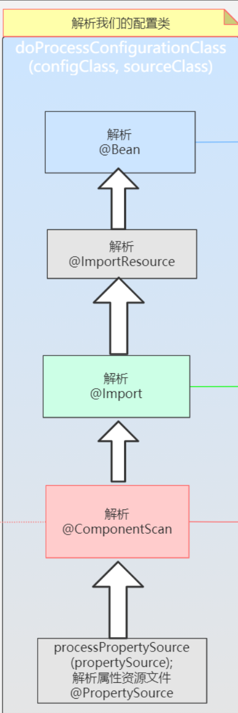

# invokeBeanDefinitionRegistryPostProcessors方法详解

**ConfigurationClassPostProcessor 中的 processConfigBeanDefinitions 方法十分重要，主要是完成扫描，最终注册我们定义的 Bean。**

## 1.方法入口

这一步其实就是执行 ConfigurationClassPostProcessor 中的 **postProcessBeanDefinitionRegistry** 方法

```java
invokeBeanDefinitionRegistryPostProcessors(priorityOrderedPostProcessors, registry);
```

将实现了**priorityOrder接口**的处理器`需要排在最前面执行的PostProcessor`列表，（其实里面就一个ConfigurationClassPostProcessor），和registry `beanFactory`作为两个参数传入这个方法


## 2.执行postProcessBeanDefinitionRegistry

```java
private static void invokeBeanDefinitionRegistryPostProcessors(Collection<? extends BeanDefinitionRegistryPostProcessor> postProcessors, BeanDefinitionRegistry registry) {
    Iterator var2 = postProcessors.iterator();
    while(var2.hasNext()) {
        BeanDefinitionRegistryPostProcessor postProcessor = (BeanDefinitionRegistryPostProcessor)var2.next();
        postProcessor.postProcessBeanDefinitionRegistry(registry);
    }

}
```

中转方法，获取priorityOrderedPostProcessors列表中的postProcessors（这里就一个），然后执行它继承自**BeanDefinitionRegistryPostProcessor**实现的**postProcessBeanDefinitionRegistry**方法

点击进入postProcessBeanDefinitionRegistry方法，找到ConfigurationClassPostProcessor实现


## 重点方法processConfigBeanDefinitions

```java
public void postProcessBeanDefinitionRegistry(BeanDefinitionRegistry registry) {
	...
    if (this.registriesPostProcessed.contains(registryId)) {
        throw new IllegalStateException("postProcessBeanDefinitionRegistry already called on this post-processor against " + registry);
    } else if (this.factoriesPostProcessed.contains(registryId)) {
        throw new IllegalStateException("postProcessBeanFactory already called on this post-processor against " + registry);
    } else {
        this.registriesPostProcessed.add(registryId);
        this.processConfigBeanDefinitions(registry);
    }
}
```

**点击进入**

```java
this.processConfigBeanDefinitions(registry)
```

```java
	public void processConfigBeanDefinitions(BeanDefinitionRegistry registry) {
		List<BeanDefinitionHolder> configCandidates = new ArrayList<>();
        //获得所有的BeanDefinition的Name，放入candidateNames数组
		String[] candidateNames = registry.getBeanDefinitionNames();
        
		//循环candidateNames数组
		for (String beanName : candidateNames) {
			BeanDefinition beanDef = registry.getBeanDefinition(beanName);//根据beanName获得BeanDefinition
 
			// 内部有两个标记位来标记是否已经处理过了
			if (ConfigurationClassUtils.isFullConfigurationClass(beanDef) ||
					ConfigurationClassUtils.isLiteConfigurationClass(beanDef)) {
				if (logger.isDebugEnabled()) {
					logger.debug("Bean definition has already been processed as a configuration class: " + beanDef);
				}
			}
 
			else if (ConfigurationClassUtils.checkConfigurationClassCandidate(beanDef, this.metadataReaderFactory)) {
				configCandidates.add(new BeanDefinitionHolder(beanDef, beanName));
			}
		}
 
		if (configCandidates.isEmpty()) {
			return;
		}
 
		configCandidates.sort((bd1, bd2) -> {
			int i1 = ConfigurationClassUtils.getOrder(bd1.getBeanDefinition());
			int i2 = ConfigurationClassUtils.getOrder(bd2.getBeanDefinition());
			return Integer.compare(i1, i2);
		});
 
		SingletonBeanRegistry sbr = null;
		//它检查传入的 registry 是否是 SingletonBeanRegistry 的实例，因为 DefaultListableBeanFactory 最终实现了 SingletonBeanRegistry 接口。这个接口用于管理单例对象的注册
        //如果是 SingletonBeanRegistry 的实例，就将其强制转换为 SingletonBeanRegistry 类型的sbr，并在接下来的代码中使用
		if (registry instanceof SingletonBeanRegistry) {
			sbr = (SingletonBeanRegistry) registry;
			if (!this.localBeanNameGeneratorSet) {
		//spring中可以修改默认的bean命名方式，这里就是看用户有没有自定义bean命名方式，虽然一般没有人会这么做
        //它检查是否已经设置了自定义的 bean 命名生成器（BeanNameGenerator）。如果没有设置，它会尝试从 SingletonBeanRegistry 中获取一个 bean 命名生成器。这个 bean 命名生成器主要用于为被扫描到的组件生成默认的 bean 名称。如果用户没有自定义，则会使用默认的生成器。如果找到了自定义的 bean 命名生成器，则将其设置为 componentScanBeanNameGenerator 和 importBeanNameGenerator
				BeanNameGenerator generator = (BeanNameGenerator) sbr.getSingleton(CONFIGURATION_BEAN_NAME_GENERATOR);
				if (generator != null) {
					this.componentScanBeanNameGenerator = generator;
					this.importBeanNameGenerator = generator;
				}
			}
		}
 		//如果当前环境对象 environment 为 null，则会创建一个标准的环境对象 StandardEnvironment
		if (this.environment == null) {
			this.environment = new StandardEnvironment();
		}
 		//new一个对象解析配置类ConfigurationClassParser
		ConfigurationClassParser parser = new ConfigurationClassParser(
				this.metadataReaderFactory, this.problemReporter, this.environment,
				this.resourceLoader, this.componentScanBeanNameGenerator, registry);
 
		Set<BeanDefinitionHolder> candidates = new LinkedHashSet<>(configCandidates);
		Set<ConfigurationClass> alreadyParsed = new HashSet<>(configCandidates.size());
		do {
			//解析配置类（传统意义上的配置类或者是普通bean，核心来了）
			parser.parse(candidates);
			parser.validate();
 
			Set<ConfigurationClass> configClasses = new LinkedHashSet<>(parser.getConfigurationClasses());
			configClasses.removeAll(alreadyParsed);
 
			// Read the model and create bean definitions based on its content
			if (this.reader == null) {
				this.reader = new ConfigurationClassBeanDefinitionReader(
						registry, this.sourceExtractor, this.resourceLoader, this.environment,
						this.importBeanNameGenerator, parser.getImportRegistry());
			}
			this.reader.loadBeanDefinitions(configClasses);//直到这一步才把Import的类，@Bean @ImportRosource 转换成BeanDefinition
			alreadyParsed.addAll(configClasses);//把configClasses加入到alreadyParsed，代表
 
			candidates.clear();
			//获得注册器里面BeanDefinition的数量 和 candidateNames进行比较
			//如果大于的话，说明有新的BeanDefinition注册进来了
			if (registry.getBeanDefinitionCount() > candidateNames.length) {
				String[] newCandidateNames = registry.getBeanDefinitionNames();//从注册器里面获得BeanDefinitionNames
				Set<String> oldCandidateNames = new HashSet<>(Arrays.asList(candidateNames));//candidateNames转换set
				Set<String> alreadyParsedClasses = new HashSet<>();
				//循环alreadyParsed。把类名加入到alreadyParsedClasses
				for (ConfigurationClass configurationClass : alreadyParsed) {
					alreadyParsedClasses.add(configurationClass.getMetadata().getClassName());
				}
				for (String candidateName : newCandidateNames) {
					if (!oldCandidateNames.contains(candidateName)) {
						BeanDefinition bd = registry.getBeanDefinition(candidateName);
						if (ConfigurationClassUtils.checkConfigurationClassCandidate(bd, this.metadataReaderFactory) &&
								!alreadyParsedClasses.contains(bd.getBeanClassName())) {
							candidates.add(new BeanDefinitionHolder(bd, candidateName));
						}
					}
				}
				candidateNames = newCandidateNames;
			}
		}
		while (!candidates.isEmpty());
 
		if (sbr != null && !sbr.containsSingleton(IMPORT_REGISTRY_BEAN_NAME)) {
			sbr.registerSingleton(IMPORT_REGISTRY_BEAN_NAME, parser.getImportRegistry());
		}
 
		if (this.metadataReaderFactory instanceof CachingMetadataReaderFactory) {
			((CachingMetadataReaderFactory) this.metadataReaderFactory).clearCache();
		}
	}
```

1. 获得所有的 BeanName，放入 candidateNames 数组。

   第一次执行时registry`beanFactory`里面只有MainConfig这个配置类的Bean

   ```java
   String[] candidateNames = registry.getBeanDefinitionNames();
   ```

2. 循环 candidateNames 数组，根据 beanName 获得 BeanDefinition，判断此 BeanDefinition 是否已经被处理过了。

3. 判断是否是配置类，如果是的话。加入到 configCandidates 数组，在判断的时候，还会标记配置类属于 Full 配置类，还是 Lite 配置类，这里会引发一连串的知识盲点：

   ```java
   else if (ConfigurationClassUtils.checkConfigurationClassCandidate(beanDef, this.metadataReaderFactory)) {
   	configCandidates.add(new BeanDefinitionHolder(beanDef, beanName));
   }
   ```

   - 当我们注册配置类的时候，可以不加 @Configuration 注解，直接使用 **@Component @ComponentScan @Import@ImportResource 等注解**，Spring 把这种配置类称之为 **Lite 配置类**， 如果加了 **@Configuration 注解，就称之为 Full 配置类**。
   - 如果我们注册了 Lite 配置类，我们 getBean 这个配置类，会发现它就是原本的那个配置类，**如果我们注册了 Full 配置类，我们 getBean 这个配置类，会发现它已经不是原本那个配置类了，而是已经被 cgilb 代理的类了**
   -  写一个 A 类，其中有一个构造方法，打印出 “你好”，再写一个配置类，里面有两个被 @bean 注解的方法，其中一个方法 new 了 A 类，并且返回 A 的对象，把此方法称之为 getA，第二个方法又调用了 getA 方法，如果配置类是 Lite 配置类，会发现打印了两次 “你好”，也就是说 A 类被 new 了两次，如果配置类是 Full 配置类，会发现只打印了一次 “你好”，也就是说 A 类只被 new 了一次，因为这个类被 cgilb 代理了，方法已经被改写。
   - **这也是加不加Configuration注解的区别之一**

4. 如果没有配置类直接返回。

   ```java
   if (configCandidates.isEmpty()) {
       return;
   }
   ```

5. 处理排序。

   ```java
   configCandidates.sort((bd1, bd2) -> {
       int i1 = ConfigurationClassUtils.getOrder(bd1.getBeanDefinition());
       int i2 = ConfigurationClassUtils.getOrder(bd2.getBeanDefinition());
       return Integer.compare(i1, i2);
   });
   ```

6. 解析配置类（传统意义上的配置类或者是普通bean），可能是 Full 配置类，也有可能是 Lite 配置类，这个小方法是此方法的核心。

7. 在第 6 步的时候，只是注册了部分 Bean，像 @Import @Bean 等，是没有被注册的，这里统一对这些进行注册。


### parse解析配置类

下面是解析配置类的过程：

```java
parser.parse(candidates)
```

```java
	public void parse(Set<BeanDefinitionHolder> configCandidates) {
		this.deferredImportSelectors = new LinkedList<>();
		//循环传进来的配置类
		for (BeanDefinitionHolder holder : configCandidates) {
            //获得BeanDefinition
			BeanDefinition bd = holder.getBeanDefinition();
			try {
				//如果获得BeanDefinition是AnnotatedBeanDefinition的实例
				if (bd instanceof AnnotatedBeanDefinition) {
					parse(((AnnotatedBeanDefinition) bd).getMetadata(), holder.getBeanName());
				} else if (bd instanceof AbstractBeanDefinition && ((AbstractBeanDefinition) bd).hasBeanClass()) {
					parse(((AbstractBeanDefinition) bd).getBeanClass(), holder.getBeanName());
				} else {
					parse(bd.getBeanClassName(), holder.getBeanName());
				}
			} catch (BeanDefinitionStoreException ex) {
				throw ex;
			} catch (Throwable ex) {
				throw new BeanDefinitionStoreException(
						"Failed to parse configuration class [" + bd.getBeanClassName() + "]", ex);
			}
		}
 
		//执行DeferredImportSelector
		processDeferredImportSelectors();
	}
```

因为可以有多个配置类，所以需要循环处理。

我们的配置类的 BeanDefinition 是 AnnotatedBeanDefinition 的实例，所以会进入第一个 if：

点击进入 `parse(((AnnotatedBeanDefinition) bd).getMetadata(), holder.getBeanName());`

```java
protected final void parse(AnnotationMetadata metadata, String beanName) throws IOException {
		processConfigurationClass(new ConfigurationClass(metadata, beanName));
	}
	protected void processConfigurationClass(ConfigurationClass configClass) throws IOException {
 
		//判断是否需要跳过
		if (this.conditionEvaluator.shouldSkip(configClass.getMetadata(), ConfigurationPhase.PARSE_CONFIGURATION)) {
			return;
		}
 
		ConfigurationClass existingClass = this.configurationClasses.get(configClass);
		if (existingClass != null) {
			if (configClass.isImported()) {
				if (existingClass.isImported()) {
					existingClass.mergeImportedBy(configClass);
				}
				return;
			} else {
				this.configurationClasses.remove(configClass);
				this.knownSuperclasses.values().removeIf(configClass::equals);
			}
		}
 
		SourceClass sourceClass = asSourceClass(configClass);
		do {
			sourceClass = doProcessConfigurationClass(configClass, sourceClass);
		}
		while (sourceClass != null);
 
		this.configurationClasses.put(configClass, configClass);
	}
```

重点在于 **doProcessConfigurationClass** 方法



需要特别注意，最后一行代码`this.configurationClasses.put(configClass, configClass);`，会把 configClass 放入一个 Map，会在上面第 7 步中用到

### doProcessConfigurationClass

来看**doProcessConfigurationClass**方法

```java
	protected final SourceClass doProcessConfigurationClass(ConfigurationClass configClass, SourceClass sourceClass)
			throws IOException {
 
		//递归处理内部类，一般不会写内部类
		processMemberClasses(configClass, sourceClass);
 
		//处理@PropertySource注解，@PropertySource注解用来加载properties文件
		for (AnnotationAttributes propertySource : AnnotationConfigUtils.attributesForRepeatable(
				sourceClass.getMetadata(), PropertySources.class,
				org.springframework.context.annotation.PropertySource.class)) {
			if (this.environment instanceof ConfigurableEnvironment) {
				processPropertySource(propertySource);
			} else {
				logger.warn("Ignoring @PropertySource annotation on [" + sourceClass.getMetadata().getClassName() +
						"]. Reason: Environment must implement ConfigurableEnvironment");
			}
		}
 
		//获得ComponentScan注解具体的内容，ComponentScan注解除了最常用的basePackage之外，还有includeFilters，excludeFilters等
		Set<AnnotationAttributes> componentScans = AnnotationConfigUtils.attributesForRepeatable(
				sourceClass.getMetadata(), ComponentScans.class, ComponentScan.class);
 
		//如果没有打上ComponentScan，或者被@Condition条件跳过，就不再进入这个if
		if (!componentScans.isEmpty() &&
				!this.conditionEvaluator.shouldSkip(sourceClass.getMetadata(), ConfigurationPhase.REGISTER_BEAN)) {
			//循环处理componentScans
			for (AnnotationAttributes componentScan : componentScans) {
				//componentScan就是@ComponentScan上的具体内容，sourceClass.getMetadata().getClassName()就是配置类的名称
				Set<BeanDefinitionHolder> scannedBeanDefinitions =
						this.componentScanParser.parse(componentScan, sourceClass.getMetadata().getClassName());

				for (BeanDefinitionHolder holder : scannedBeanDefinitions) {
					BeanDefinition bdCand = holder.getBeanDefinition().getOriginatingBeanDefinition();
					if (bdCand == null) {
						bdCand = holder.getBeanDefinition();
					}
					if (ConfigurationClassUtils.checkConfigurationClassCandidate(bdCand, this.metadataReaderFactory)) {
						//递归调用，因为可能组件类有被@Bean标记的方法，或者组件类本身也有ComponentScan等注解
						parse(bdCand.getBeanClassName(), holder.getBeanName());
					}
				}
			}
		}
 
		//处理@Import注解
		//@Import注解是spring中很重要的一个注解，Springboot大量应用这个注解
		//@Import三种类，一种是Import普通类，一种是Import ImportSelector，还有一种是Import ImportBeanDefinitionRegistrar
		//getImports(sourceClass)是获得import的内容，返回的是一个set
		processImports(configClass, sourceClass, getImports(sourceClass), true);
 
		// Process any @ImportResource annotations
		//处理@ImportResource注解
		AnnotationAttributes importResource =
				AnnotationConfigUtils.attributesFor(sourceClass.getMetadata(), ImportResource.class);
		if (importResource != null) {
			String[] resources = importResource.getStringArray("locations");
			Class<? extends BeanDefinitionReader> readerClass = importResource.getClass("reader");
			for (String resource : resources) {
				String resolvedResource = this.environment.resolveRequiredPlaceholders(resource);
				configClass.addImportedResource(resolvedResource, readerClass);
			}
		}
 
		//处理@Bean的方法，可以看到获得了带有@Bean的方法后，不是马上转换成BeanDefinition，而是先用一个set接收
		Set<MethodMetadata> beanMethods = retrieveBeanMethodMetadata(sourceClass);
		for (MethodMetadata methodMetadata : beanMethods) {
			configClass.addBeanMethod(new BeanMethod(methodMetadata, configClass));
		}
        
		processInterfaces(configClass, sourceClass);
 
		if (sourceClass.getMetadata().hasSuperClass()) {
			String superclass = sourceClass.getMetadata().getSuperClassName();
			if (superclass != null && !superclass.startsWith("java") &&
					!this.knownSuperclasses.containsKey(superclass)) {
				this.knownSuperclasses.put(superclass, configClass);
				return sourceClass.getSuperClass();
			}
		}
		return null;
	}
```

1. 递归处理内部类，一般不会使用内部类。

2. 处理 @PropertySource 注解，@PropertySource 注解用来加载 properties 文件。

3. 获得 ComponentScan 注解具体的内容，ComponentScan 注解除了最常用的 basePackage 之外，还有 includeFilters，excludeFilters 等。

4. 判断有没有被 @ComponentScans 标记，或者被 @Condition 条件带过，如果满足条件的话，进入 if，进行如下操作：

   - 执行扫描操作，把扫描出来的放入 set，这个方法稍后再详细说明。

     ```java
     beanMethods = this.componentScanParser.parse(componentScan, sourceClass.getMetadata().getClassName());
     ```

   - 循环 set，判断是否是配置类，是的话，递归调用 parse 方法，因为被扫描出来的类，还是一个配置类，有 @ComponentScans 注解，或者其中有被 @Bean 标记的方法 等等，所以需要再次被解析。

5. 处理 @Import 注解，@Import 是 Spring 中很重要的一个注解，正是由于它的存在，让 Spring 非常灵活，不管是 Spring 内部，还是与 Spring 整合的第三方技术，都大量的运用了 @Import 注解，@Import 有三种情况，一种是 Import 普通类，一种是 Import ImportSelector，还有一种是 Import ImportBeanDefinitionRegistrar，getImports (sourceClass) 是获得 import 的内容，返回的是一个 set，这个方法稍后再详细说明。

6. 处理 @ImportResource 注解。

7. 处理 @Bean 的方法，可以看到获得了带有 @Bean 的方法后，不是马上转换成 BeanDefinition，而是先用一个 set 接收。

> 总而言之就是成立了 @PropertySource，@ComponentScan，@Import ，@Bean等注解


### componentScanParser.parse

来看第四步的parse方法

```java
	public Set<BeanDefinitionHolder> parse(AnnotationAttributes componentScan, final String declaringClass) {
		//扫描器，还记不记在new AnnotationConfigApplicationContext的时候
		//会调用AnnotationConfigApplicationContext的构造方法
		//构造方法里面有一句 this.scanner = new ClassPathBeanDefinitionScanner(this);
		//当时说这个对象不重要，这里就是证明了。常规用法中，实际上执行扫描的只会是这里的scanner对象
		ClassPathBeanDefinitionScanner scanner = new ClassPathBeanDefinitionScanner(this.registry,
				componentScan.getBoolean("useDefaultFilters"), this.environment, this.resourceLoader);
 
		//判断是否重写了默认的命名规则
		Class<? extends BeanNameGenerator> generatorClass = componentScan.getClass("nameGenerator");
		boolean useInheritedGenerator = (BeanNameGenerator.class == generatorClass);
		scanner.setBeanNameGenerator(useInheritedGenerator ? this.beanNameGenerator :
				BeanUtils.instantiateClass(generatorClass));
 
		ScopedProxyMode scopedProxyMode = componentScan.getEnum("scopedProxy");
		if (scopedProxyMode != ScopedProxyMode.DEFAULT) {
			scanner.setScopedProxyMode(scopedProxyMode);
		}
		else {
			Class<? extends ScopeMetadataResolver> resolverClass = componentScan.getClass("scopeResolver");
			scanner.setScopeMetadataResolver(BeanUtils.instantiateClass(resolverClass));
		}
 
		scanner.setResourcePattern(componentScan.getString("resourcePattern"));
 
		//addIncludeFilter addExcludeFilter,最终是往List<TypeFilter>里面填充数据
		//TypeFilter是一个函数式接口，函数式接口在java8的时候大放异彩，只定义了一个虚方法的接口被称为函数式接口
		//当调用scanner.addIncludeFilter  scanner.addExcludeFilter 仅仅把 定义的规则塞进去，并么有真正去执行匹配过程
 
		//处理includeFilters
		for (AnnotationAttributes filter : componentScan.getAnnotationArray("includeFilters")) {
			for (TypeFilter typeFilter : typeFiltersFor(filter)) {
				scanner.addIncludeFilter(typeFilter);
			}
		}
 
		//处理excludeFilters
		for (AnnotationAttributes filter : componentScan.getAnnotationArray("excludeFilters")) {
			for (TypeFilter typeFilter : typeFiltersFor(filter)) {
				scanner.addExcludeFilter(typeFilter);
			}
		}
 
		boolean lazyInit = componentScan.getBoolean("lazyInit");
		if (lazyInit) {
			scanner.getBeanDefinitionDefaults().setLazyInit(true);
		}
 
		Set<String> basePackages = new LinkedHashSet<>();
		String[] basePackagesArray = componentScan.getStringArray("basePackages");
		for (String pkg : basePackagesArray) {
			String[] tokenized = StringUtils.tokenizeToStringArray(this.environment.resolvePlaceholders(pkg),
					ConfigurableApplicationContext.CONFIG_LOCATION_DELIMITERS);
			Collections.addAll(basePackages, tokenized);
		}
		// 从下面的代码可以看出ComponentScans指定扫描目标，除了最常用的basePackages，还有两种方式
		// 1.指定basePackageClasses，就是指定多个类，只要是与这几个类同级的，或者在这几个类下级的都可以被扫描到，这种方式其实是spring比较推荐的
		// 因为指定basePackages没有IDE的检查，容易出错，但是指定一个类，就有IDE的检查了，不容易出错，经常会用一个空的类来作为basePackageClasses
		// 2.直接不指定，默认会把与配置类同级，或者在配置类下级的作为扫描目标
		for (Class<?> clazz : componentScan.getClassArray("basePackageClasses")) {
			basePackages.add(ClassUtils.getPackageName(clazz));
		}
		if (basePackages.isEmpty()) {
			basePackages.add(ClassUtils.getPackageName(declaringClass));
		}
 
		//把规则填充到排除规则：List<TypeFilter>，这里就把 注册类自身当作排除规则，真正执行匹配的时候，会把自身给排除
		scanner.addExcludeFilter(new AbstractTypeHierarchyTraversingFilter(false, false) {
			@Override
			protected boolean matchClassName(String className) {
				return declaringClass.equals(className);
			}
		});
		//basePackages是一个LinkedHashSet<String>，这里就是把basePackages转为字符串数组的形式
		return scanner.doScan(StringUtils.toStringArray(basePackages));
	}
```

1. 定义了一个扫描器 scanner，还记不记在 new AnnotationConfigApplicationContext 的时候，会调用 AnnotationConfigApplicationContext 的构造方法，构造方法里面有一句 this.scanner = new ClassPathBeanDefinitionScanner (this); 当时说这个对象不重要，这里就是证明了。常规用法中，实际上执行扫描的只会是这里的 scanner 对象。
2. 处理 includeFilters，就是把规则添加到 scanner。
3. 处理 excludeFilters，就是把规则添加到 scanner。
4. 解析 basePackages，获得需要扫描哪些包。
5. 添加一个默认的排除规则：排除自身。
6. 执行扫描，稍后详细说明。


### doScan

我们来看看到底是怎么执行扫描的：

```java
protected Set<BeanDefinitionHolder> doScan(String... basePackages) {
		Assert.notEmpty(basePackages, "At least one base package must be specified");
		Set<BeanDefinitionHolder> beanDefinitions = new LinkedHashSet<>();
		//循环处理basePackages
		for (String basePackage : basePackages) {
			//根据包名找到符合条件的BeanDefinition集合
			Set<BeanDefinition> candidates = findCandidateComponents(basePackage);
			for (BeanDefinition candidate : candidates) {
				ScopeMetadata scopeMetadata = this.scopeMetadataResolver.resolveScopeMetadata(candidate);
				candidate.setScope(scopeMetadata.getScopeName());
				String beanName = this.beanNameGenerator.generateBeanName(candidate, this.registry);
				//由findCandidateComponents内部可知，这里的candidate是ScannedGenericBeanDefinition
				//而ScannedGenericBeanDefinition是AbstractBeanDefinition和AnnotatedBeanDefinition的之类
				//所以下面的两个if都会进入
				if (candidate instanceof AbstractBeanDefinition) {
					//内部会设置默认值
					postProcessBeanDefinition((AbstractBeanDefinition) candidate, beanName);
				}
				if (candidate instanceof AnnotatedBeanDefinition) {
					//如果是AnnotatedBeanDefinition，还会再设置一次值
					AnnotationConfigUtils.processCommonDefinitionAnnotations((AnnotatedBeanDefinition) candidate);
				}
				if (checkCandidate(beanName, candidate)) {
					BeanDefinitionHolder definitionHolder = new BeanDefinitionHolder(candidate, beanName);
					definitionHolder =
							AnnotationConfigUtils.applyScopedProxyMode(scopeMetadata, definitionHolder, this.registry);
					beanDefinitions.add(definitionHolder);
					registerBeanDefinition(definitionHolder, this.registry);
				}
			}
		}
		return beanDefinitions;
	}
```

因为 basePackages 可能有多个，所以需要循环处理，最终会进行 Bean 的注册。下面再来看看 findCandidateComponents 方法：


### findCandidateComponents 

```java
	public Set<BeanDefinition> findCandidateComponents(String basePackage) {
		//spring支持component索引技术，需要引入一个组件，因为大部分情况不会引入这个组件
		//所以不会进入到这个if
		if (this.componentsIndex != null && indexSupportsIncludeFilters()) {
			return addCandidateComponentsFromIndex(this.componentsIndex, basePackage);
		}
		else {
			return scanCandidateComponents(basePackage);
		}
	}
```

### *进入scanCandidateComponents

```java
private Set<BeanDefinition> scanCandidateComponents(String basePackage) {
		Set<BeanDefinition> candidates = new LinkedHashSet<>();
		try {
			//把 传进来的类似 命名空间形式的字符串转换成类似类文件地址的形式，然后在前面加上classpath*:
			//即：com.xx=>classpath*:com/xx/**/*.class
			String packageSearchPath = ResourcePatternResolver.CLASSPATH_ALL_URL_PREFIX +
					resolveBasePackage(basePackage) + '/' + this.resourcePattern;
			//根据packageSearchPath，获得符合要求的文件
			Resource[] resources = getResourcePatternResolver().getResources(packageSearchPath);
			boolean traceEnabled = logger.isTraceEnabled();
			boolean debugEnabled = logger.isDebugEnabled();
			//循环资源
			for (Resource resource : resources) {
				if (traceEnabled) {
					logger.trace("Scanning " + resource);
				}
 
				if (resource.isReadable()) {//判断资源是否可读，并且不是一个目录
					try {
						//metadataReader 元数据读取器，解析resource，也可以理解为描述资源的数据结构
						MetadataReader metadataReader = getMetadataReaderFactory().getMetadataReader(resource);
						//在isCandidateComponent方法内部会真正执行匹配规则
						//注册配置类自身会被排除，不会进入到这个if
						if (isCandidateComponent(metadataReader)) {
							ScannedGenericBeanDefinition sbd = new ScannedGenericBeanDefinition(metadataReader);
							sbd.setResource(resource);
							sbd.setSource(resource);
							if (isCandidateComponent(sbd)) {
								if (debugEnabled) {
									logger.debug("Identified candidate component class: " + resource);
								}
								candidates.add(sbd);
							}
							else {
								if (debugEnabled) {
									logger.debug("Ignored because not a concrete top-level class: " + resource);
								}
							}
						}
						else {
							if (traceEnabled) {
								logger.trace("Ignored because not matching any filter: " + resource);
							}
						}
					}
					catch (Throwable ex) {
						throw new BeanDefinitionStoreException(
								"Failed to read candidate component class: " + resource, ex);
					}
				}
				else {
					if (traceEnabled) {
						logger.trace("Ignored because not readable: " + resource);
					}
				}
			}
		}
		catch (IOException ex) {
			throw new BeanDefinitionStoreException("I/O failure during classpath scanning", ex);
		}
		return candidates;
	}
```

1. 把传进来的类似命名空间形式的字符串转换成类似类文件地址的形式，然后在前面加上 classpath*，即：com.xx=>classpath*:com/xx/**/*.class。
2. 根据 packageSearchPath，获得符合要求的文件。
3. 循环符合要求的文件，进一步进行判断。

最终会把符合要求的文件，转换为 BeanDefinition，并且返回。


## **@Import 解析：**

```java
	//这个方法内部相当相当复杂，importCandidates是Import的内容，调用这个方法的时候，已经说过可能有三种情况
	//这里再说下，1.Import普通类，2.Import ImportSelector，3.Import ImportBeanDefinitionRegistrar
	//循环importCandidates，判断属于哪种情况
	//如果是普通类，会进到else，调用processConfigurationClass方法
	//这个方法是不是很熟悉，没错，processImports这个方法就是在processConfigurationClass方法中被调用的
	//processImports又主动调用processConfigurationClass方法，是一个递归调用，因为Import的普通类，也有可能被加了Import注解，@ComponentScan注解 或者其他注解，所以普通类需要再次被解析
	//如果Import ImportSelector就跑到了第一个if中去，首先执行Aware接口方法，所以我们在实现ImportSelector的同时，还可以实现Aware接口
	//然后判断是不是DeferredImportSelector，DeferredImportSelector扩展了ImportSelector
	//如果不是的话，调用selectImports方法，获得全限定类名数组，在转换成类的数组，然后再调用processImports，又特么的是一个递归调用...
	//可能又有三种情况，一种情况是selectImports的类是一个普通类，第二种情况是selectImports的类是一个ImportBeanDefinitionRegistrar类，第三种情况是还是一个ImportSelector类...
	//所以又需要递归调用
	//如果Import ImportBeanDefinitionRegistrar就跑到了第二个if，还是会执行Aware接口方法，这里终于没有递归了，会把数据放到ConfigurationClass中的Map<ImportBeanDefinitionRegistrar, AnnotationMetadata> importBeanDefinitionRegistrars中去
	private void processImports(ConfigurationClass configClass, SourceClass currentSourceClass,
								Collection<SourceClass> importCandidates, boolean checkForCircularImports) {
 
		if (importCandidates.isEmpty()) {
			return;
		}
 
		if (checkForCircularImports && isChainedImportOnStack(configClass)) {
			this.problemReporter.error(new CircularImportProblem(configClass, this.importStack));
		} else {
			this.importStack.push(configClass);
			try {
				for (SourceClass candidate : importCandidates) {
					if (candidate.isAssignable(ImportSelector.class)) {
						// Candidate class is an ImportSelector -> delegate to it to determine imports
						Class<?> candidateClass = candidate.loadClass();
						ImportSelector selector = BeanUtils.instantiateClass(candidateClass, ImportSelector.class);
						ParserStrategyUtils.invokeAwareMethods(
								selector, this.environment, this.resourceLoader, this.registry);
						if (this.deferredImportSelectors != null && selector instanceof DeferredImportSelector) {
							this.deferredImportSelectors.add(
									new DeferredImportSelectorHolder(configClass, (DeferredImportSelector) selector));
						} else {
							String[] importClassNames = selector.selectImports(currentSourceClass.getMetadata());
							Collection<SourceClass> importSourceClasses = asSourceClasses(importClassNames);
							processImports(configClass, currentSourceClass, importSourceClasses, false);
						}
					} else if (candidate.isAssignable(ImportBeanDefinitionRegistrar.class)) {
						// Candidate class is an ImportBeanDefinitionRegistrar ->
						// delegate to it to register additional bean definitions
						Class<?> candidateClass = candidate.loadClass();
						ImportBeanDefinitionRegistrar registrar =
								BeanUtils.instantiateClass(candidateClass, ImportBeanDefinitionRegistrar.class);
						ParserStrategyUtils.invokeAwareMethods(
								registrar, this.environment, this.resourceLoader, this.registry);
						configClass.addImportBeanDefinitionRegistrar(registrar, currentSourceClass.getMetadata());
					} else {
						// Candidate class not an ImportSelector or ImportBeanDefinitionRegistrar ->
						// process it as an @Configuration class
						this.importStack.registerImport(
								currentSourceClass.getMetadata(), candidate.getMetadata().getClassName());
						processConfigurationClass(candidate.asConfigClass(configClass));
					}
				}
			} catch (BeanDefinitionStoreException ex) {
				throw ex;
			} catch (Throwable ex) {
				throw new BeanDefinitionStoreException(
						"Failed to process import candidates for configuration class [" +
								configClass.getMetadata().getClassName() + "]", ex);
			} finally {
				this.importStack.pop();
			}
		}
	}
```

直到这里，才把 ConfigurationClassPostProcessor 中的 processConfigBeanDefinitions 方法简单的过了一下。

但是这还没有结束，这里只会解析 @Import 的 Bean 而已， 不会注册。

