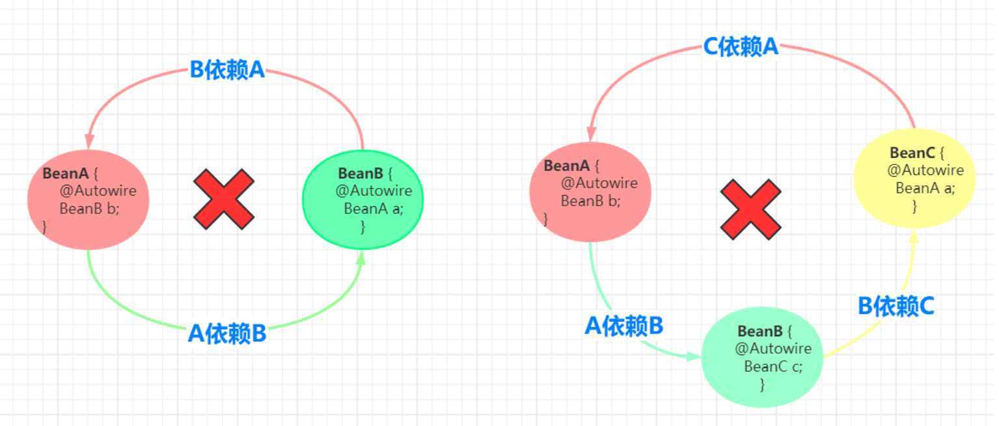
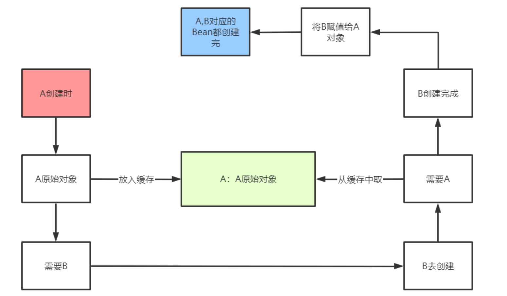
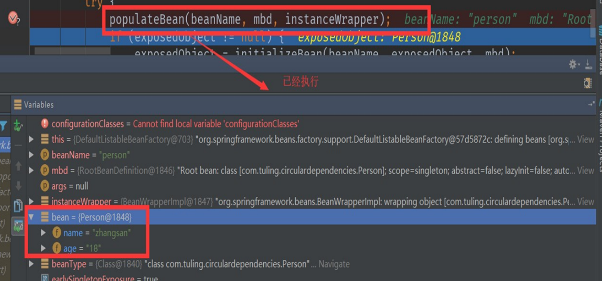
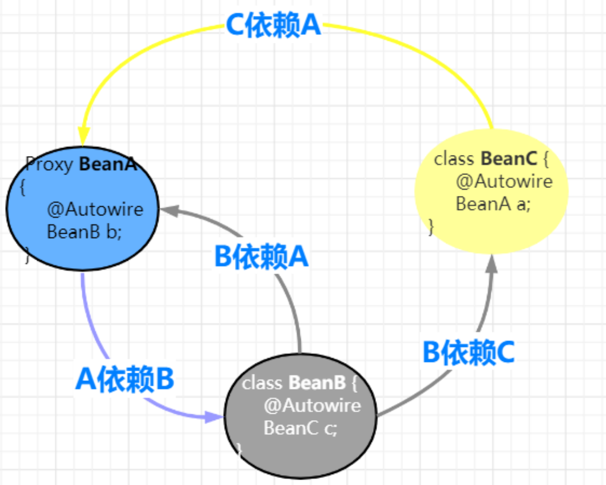

# Spring的循环依赖

在Spring中，一个对象并不是简单new出来了，而是会经过一系列的Bean的生命周期，就是因为Bean的生命周期所以才会出现循环依赖问题。

当然，在Spring中，出现循环依赖的场景很多，有的场景Spring自动帮我们解决了，而有的场景则需要程序员来解决

## 什么是循环依赖?

所谓的循环依赖是指，A 依赖 B，B 又依赖 A，它们之间形成了循环依赖。或者是 A 依赖 B，B 依赖 C，C 又依赖 A。它们之间的依赖关系如下：



那么如何打破这个循环，加个中间人（缓存）



## **如何解决循环依赖？**

```java
 DefaultSingletonBeanRegistry类的三个成员变量命名如下：
 /** 一级缓存 这个就是我们大名鼎鼎的单例缓存池 用于保存我们所有的单实例bean */
 private final Map<String, Object> singletonObjects = new ConcurrentHashMap<>(256);

 /** 二级缓存 ，用户缓存我们的key为beanName value是我们的早期对象(对象属性还没有来得及进行赋值) */
 private final Map<String, Object> earlySingletonObjects = new HashMap<>(16);

 /** 三级缓存 该map用户缓存 key为 beanName value 为ObjectFactory(包装为早期对象) */
 private final Map<String, ObjectFactory<?>> singletonFactories = new HashMap<>(16);
```

- **singletonObjects** 中缓存的是已经经历了**完整生命周期的 bean 对象**。
- **earlySingletonObjects** 比 singletonObjects 多了一个 early，表示缓存的是早期的 bean 对象。**早期是什么意思？**表示 Bean 的生命周期还没走完就把这个 Bean 放入了 earlySingletonObjects。
- **singletonFactories** 中缓存的是 ObjectFactory，表示对象工厂，表示用来创建早期 bean 对象的工厂


**以 BeanA 和 BeanB 两个类相互依赖为例**

### **1. 创建原始 bean 对象**

```java
instanceWrapper = createBeanInstance(beanName, mbd, args);
final Object bean = (instanceWrapper != null ? instanceWrapper.getWrappedInstance() : null);
```

假设 beanA 先被创建，创建后的原始对象为BeanA@1234，上面代码中的 bean 变量指向就是这个对象

`什么意思呢？beanA其实是A的proxy代理，而真正的A是BeanA@1234，此时这个真正的A就会通过三级缓存中的ObjectFactory 暴露出去，到时候被获取时进行postProcessor处理`

> AOP 就是通过一个 BeanPostProcessor 来实现的，这个 BeanPostProcessor 就是 AnnotationAwareAspectJAutoProxyCreator，它的父类是 AbstractAutoProxyCreator
>
> `instanceWrapper` 是一个包装了新创建的 Bean 实例的对象。
>
> 在 Spring 中，Bean 实例可能会经过一些额外的处理，例如代理、AOP 等。`instanceWrapper` 就是用来包装这个经过处理后的 Bean 实例的对象


### **2. 暴露早期引用**

该方法用于把早期对象包装成一个ObjectFactory 暴露到三级缓存中 用于将解决循环依赖

```java
protected void addSingletonFactory(String beanName, ObjectFactory<?> singletonFactory) {
    ...
        //加入到三级缓存中，，，，，暴露早期对象用于解决循环依赖
        this.singletonFactories.put(beanName, singletonFactory);
    ...
}
```

beanA 指向的原始对象创建好后，就开始把指向原始对象的引用通过 ObjectFactory 暴露出去。

getEarlyBeanReference 方法的第三个参数 bean 指向的正是 createBeanInstance 方法创建出原始 bean 对象BeanA@1234


### **3. 解析依赖**

```java
populateBean(beanName, mbd, instanceWrapper);
```

- 还没有进行属性装配，自动注入的属性都是null


- 初始化好的Bean



**populateBean 用于向 beanA 这个原始对象中填充属性**

当它检测到 beanA 依赖于 beanB 时，会首先去实例化 beanB。

beanB 在此方法处也会解析自己的依赖，当它检测到 beanA 这个依赖，于是调用 `BeanFactroy.getBean("beanA") `这个方法，从容

器中获取 beanA。


### **4. 获取早期引用**

```java
protected Object getSingleton(String beanName, boolean allowEarlyReference) {
		/**
 		* 第一步:我们尝试去一级缓存(单例缓存池中去获取对象,一般情况从该map中获取的对象是直接可以使用的)
		* IOC容器初始化加载单实例bean的时候第一次进来的时候 该map中一般返回空
 		*/
        Object singletonObject = this.singletonObjects.get(beanName);
		/**
 		* 若在第一级缓存中没有获取到对象,并且singletonsCurrentlyInCreation这个list包含该beanName
 		* IOC容器初始化加载单实例bean的时候第一次进来的时候 该list中一般返回空,但是循环依赖的时候可以满足该条件
 		*/
        if (singletonObject == null && isSingletonCurrentlyInCreation(beanName)) {
            synchronized (this.singletonObjects) {
				/**
 				* 尝试去二级缓存中获取对象(二级缓存中的对象是一个早期对象)
 				* 何为早期对象:就是bean刚刚调用了构造方法，还来不及给bean的属性进行赋值的对象(纯净态)
 				* 就是早期对象
 				*/
                singletonObject = this.earlySingletonObjects.get(beanName);
				/**
 				* 二级缓存中也没有获取到对象,allowEarlyReference为true(参数是有上一个方法传递进来的true)
 				*/
                if (singletonObject == null && allowEarlyReference) {
					/**
			 		* 直接从三级缓存中获取 ObjectFactory对象 这个对接就是用来解决循环依赖的关键所在
 					* 在ioc后期的过程中,当bean调用了构造方法的时候,把早期对象包裹成一个ObjectFactory
 					* 暴露到三级缓存中
 					*/
                    ObjectFactory<?> singletonFactory = this.singletonFactories.get(beanName);
					//从三级缓存中获取到对象不为空
                    if (singletonFactory != null) {
						/**
 						* 在这里通过暴露的ObjectFactory 包装对象中,通过调用他的getObject()来获取我们的早期对象
					 	* 在这个环节中会调用到 getEarlyBeanReference()来进行后置处理
 						*/
                        singletonObject = singletonFactory.getObject();
						//把早期对象放置在二级缓存,
                        this.earlySingletonObjects.put(beanName, singletonObject);
						//ObjectFactory 包装对象从三级缓存中删除掉
                        this.singletonFactories.remove(beanName);
                    }
                }
            }
        }
        return singletonObject;
    }
```

接着上面的步骤:

1. populateBean 调用 `BeanFactroy.getBean("beanA")` 以获取 beanB 的依赖。
2. getBean("beanB") 会先调用 getSingleton("beanA")，尝试从缓存中获取 beanA。此时由于 beanA 还没完全实例化好于是 this.singletonObjects.get("beanA") 返回 null。
3. 接着 this.earlySingletonObjects.get("beanA") 也返回空，因为 beanA 早期引用还没放入到这个缓存中。
4. **最后调用 singletonFactory.getObject() 返回 singletonObject**，此时 singletonObject != null。singletonObject 指向BeanA@1234，也就是 createBeanInstance 创建的原始对象。此时 beanB 获取到了这个原始对象的引用，beanB 就能顺利完成实例化。
5. beanB 完成实例化后，beanA 就能获取到 beanB 所指向的实例，beanA 随之也完成了实例化工作。
6. 由于 beanB.beanA 和 beanA指向的是同一个对象 BeanA@1234，所以 beanB 中的 beanA 此时也处于可用状态了。


## **为何需要三级缓存,而不是两级缓存?**

**为什么需要二级缓存？**

二级缓存只要是为了分离成熟Bean和纯净Bean(未注入属性)的存放， 防止**多线程**中在Bean还未创建完成时读取到的Bean时不完整的。所以也是为了**保证我们getBean是完整最终的Bean，不会出现不完整的情况**。


**为什么需要三级缓存？**

我们都知道Bean的aop动态代理创建时在初始化之后，但是循环依赖的Bean如果使用了AOP。 那无法等到解决完循环依赖再创建动态代

理，因为这个时候已经注入属性。 

**所以如果循环依赖的Bean使用了aop. 需要提前创建aop。**

- **但是需要思考的是动态代理在哪创建？？ 在实例化后直接创建？** 

  我们正常的Bean是在初始化创建，所以可以加个判断**如果是循环依赖就实例化后调用，没有循环依赖就正常在初始化后调用**。

- **怎么判断当前创建的bean是不是循环依赖？ 根据二级缓存判断？有就是循环依赖？**

  ```java
  if(二级缓存有说明是循环依赖？){
   二级缓存=创建动态代理覆盖（判断当前bean是否被二级缓存命中）；
   }
  ```

  实例化后始终会放入二级缓存中， 所以这样写不管是不是循环依赖都会在实例化后创建动态代理

  创建本身的时候没法判断自己是不是循环依赖，只有在B 引用A 下才能判断是不是循环依赖（比如B引用A**,A正在创建**，那说明是循环依赖）。

  ```java
  假如A是proxy.
  A创建Bean ‐‐>注入属性B‐‐>getBean(B)‐‐>创建B‐‐>注入属性A‐‐‐‐>getSingleton("a")之后写如下代码
  if(二级缓存有说明是循环依赖？){
  // 在这里创建AOP代理吗？
  	二级缓存=创建动态代理覆盖（判断当前bean是否被二级缓存命中，没命中依然返回二级缓存）；
  }
  ```

  这样子写可以实现在初始化后aop的功能，但面对这种情况

  

  A被循环依赖了俩次或N次， 那要创建N次aop吗？然后在里面判断有没有命中

  如果时根据二级缓存的对象判断，如果是动态代理就不重复创建，这样逻辑过于复杂耦合性太高

  能否实现这样的效果？

  ```java
   假如A是proxy.
  
   A创建Bean ‐‐>注入属性B‐‐>getBean(B)‐‐>创建B‐‐>注入属性A‐‐‐‐>getSingleton("a")之后写如下代码
  
   if(二级缓存有说明是循环依赖？ ){
   	if(二级缓存是aop就){
  		return 二级缓存;
   }
   // 在这里创建AOP代理
   二级缓存=创建动态代理覆盖（判断当前bean是否被二级缓存命中，没命中依然返回二级缓存）；
   }
  ```

  让二级缓存存储的bean无脑返回就行了，不管是普通的还是代理的。 

  增加三级缓存，二级缓存先啥也不存。

  三级缓存 存一个函数接口， 动态代理还是普通bean的逻辑调用BeanPostProcessor 都放在这里面。 只要调用了就存在二级缓存，无脑返回就行。 大大减少业务逻辑复杂度


## **为什么Spring不能解决构造器的循环依赖？**

在Bean调用构造器实例化之前，一二三级缓存并没有Bean的任何相关信息，在实例化之后才放入三级缓存中，因此当getBean的时候缓存并没有命中，这样就抛出了循环依赖的异常了。


## **为什么多例Bean不能解决循环依赖？**

可以看到，核心是利用一个map，来解决这个问题的，这个map就相当于缓存。

为什么可以这么做，因为我们的bean是单例的，而且是字段注入（setter注入）的，单例意味着只需要创建一次对象，后面就可以从缓存中取出来，字段注入，意味着我们无需调用构造方法进行注入。

如果是原型bean，那么就意味着**每次都要去创建对象，无法利用缓存**

如果是构造方法注入，那么就意味着需要调用构造方法注入，也无法利用缓存。

> 每次都要去创建对象，无法利用缓存


## **循环依赖可以关闭吗**

```java
AnnotationConfigApplicationContext applicationContext = new AnnotationConfigApplicationContext();
applicationContext.setAllowCircularReferences(false);
```


## **如何进行拓展？**

bean可以通过实现SmartInstantiationAwareBeanPostProcessor接口（一般这个接口供spring内部使用）的getEarlyBeanReference方法进行拓展

何时进行拓展？（进行bean的实例化时）

可以通过重写getEarlyBeanReference对某些特定的实例进行自定义化的动态代理

> `SmartInstantiationAwareBeanPostProcessor` 是 Spring 中的一个扩展接口，用于在实例化 Bean 之前提供定制化的实例化逻辑
>
> 其中，`getEarlyBeanReference` 方法是 `SmartInstantiationAwareBeanPostProcessor` 接口中定义的一个方法，用于在实际的 Bean 实例化之前，为 Bean 提供一个早期的引用

```java
public class MySmartInstantiationAwareBeanPostProcessor implements SmartInstantiationAwareBeanPostProcessor {

    @Override
    public Object getEarlyBeanReference(Object bean, String beanName) throws BeansException {
        // 在这里提供早期的 Bean 引用，例如返回一个代理对象
        return null;
    }
    
    // 其他实现的方法...
}
```


## 总结

至此，总结一下三级缓存：

1. **singletonObjects**：缓存经过了**完整生命周期**的 bean

2. **earlySingletonObjects**：缓存**未经过完整生命周期的 bean**

   - 如果某个 bean 出现了循环依赖，就会**提前**把这个暂时未经过完整生命周期的 bean 放入 earlySingletonObjects 中

   - 这个 bean 如果要**经过 AOP**，那么就会把代理对象放入 earlySingletonObjects 中，否则就是把原始对象放入 earlySingletonObjects

     但是不管怎么样，就是是代理对象，代理对象所代理的原始对象也是没有经过完整生命周期的，所以放入 earlySingletonObjects 我们就可以统一认为是**未经过完整生命周期的 bean。**

3. **singletonFactories**：缓存的是一个 ObjectFactory，也就是一个 Lambda 表达式。

   在每个 Bean 的生成过程中，经过**实例化**得到一个原始对象后，都会提前基于原始对象暴露一个 Lambda 表达式，并保存到三级缓存中，这个 Lambda 表达式**可能用到，也可能用不到**

   - 如果当前 Bean 没有出现循环依赖，那么这个 Lambda 表达式没用，当前 bean 按照自己的生命周期正常执行，执行完后直接把当前 bean 放入 singletonObjects 中
   - 如果当前 bean 在依赖注入时发现出现了循环依赖（当前正在创建的 bean 被其他 bean 依赖了），则从三级缓存中拿到 Lambda 表达式，并执行 Lambda 表达式得到一个对象，并把得到的对象放入二级缓存。
     - 如果当前 Bean 需要 AOP，那么执行 lambda 表达式，得到就是对应的代理对象
     - 如果无需 AOP，则直接得到一个原始对象。

4. 其实还要一个缓存，就是 **earlyProxyReferences**，它用来记录某个原始对象是否进行过 AOP 了。